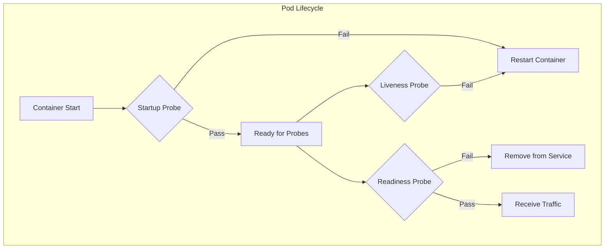
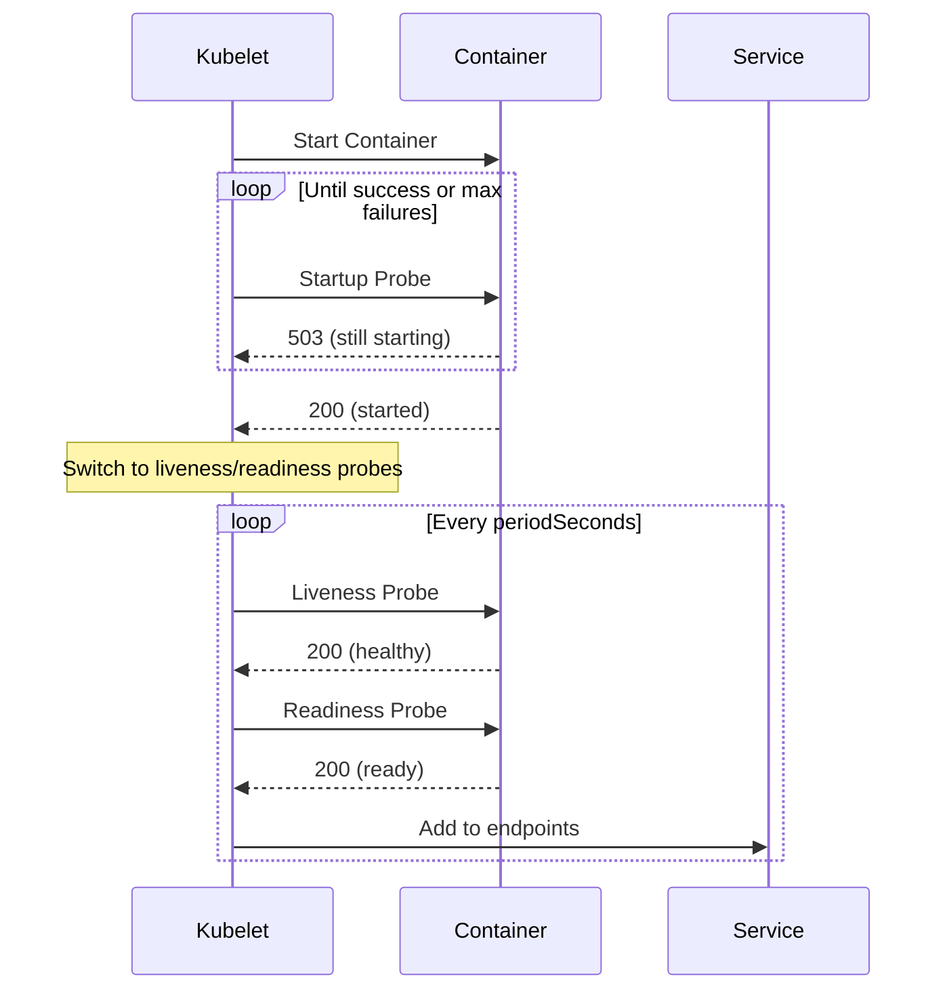

# How to Implement Health Checks for Network Services in Kubernetes

Author: [nawazdhandala](https://www.github.com/nawazdhandala)

Tags: Kubernetes, Health Checks, gRPC, Networking, DevOps, Reliability, Monitoring, Troubleshooting

Description: A comprehensive guide to implementing liveness, readiness, and startup probes for network services in Kubernetes, covering TCP, HTTP, gRPC, and exec health checks.

---

Health checks are critical for maintaining reliable network services in Kubernetes. They determine when containers should be restarted, when they're ready to receive traffic, and when they've completed startup. This guide covers all probe types and best practices for network services.

## Understanding Kubernetes Probes

Kubernetes provides three types of probes, each serving a distinct purpose:



### Probe Types Explained

| Probe | Purpose | Failure Action | When to Use |
|-------|---------|----------------|-------------|
| **Startup** | Detect slow-starting containers | Restart container | Apps with long initialization |
| **Liveness** | Detect deadlocked processes | Restart container | Always recommended |
| **Readiness** | Detect when ready for traffic | Remove from endpoints | Services with dependencies |

## Probe Mechanisms

Kubernetes supports four probe mechanisms:

### 1. HTTP GET Probes

Best for HTTP/REST services:

```yaml
apiVersion: v1
kind: Pod
metadata:
  name: http-service
spec:
  containers:
  - name: app
    image: my-http-service:latest
    ports:
    - containerPort: 8080
    livenessProbe:
      httpGet:
        path: /healthz
        port: 8080
        httpHeaders:
        - name: Custom-Header
          value: "probe"
      initialDelaySeconds: 10
      periodSeconds: 10
      timeoutSeconds: 5
      successThreshold: 1
      failureThreshold: 3
    readinessProbe:
      httpGet:
        path: /ready
        port: 8080
      initialDelaySeconds: 5
      periodSeconds: 5
      timeoutSeconds: 3
      successThreshold: 1
      failureThreshold: 3
```

### 2. TCP Socket Probes

Best for TCP services without HTTP endpoints:

```yaml
apiVersion: v1
kind: Pod
metadata:
  name: tcp-service
spec:
  containers:
  - name: database
    image: postgres:15
    ports:
    - containerPort: 5432
    livenessProbe:
      tcpSocket:
        port: 5432
      initialDelaySeconds: 30
      periodSeconds: 10
      timeoutSeconds: 5
      failureThreshold: 3
    readinessProbe:
      tcpSocket:
        port: 5432
      initialDelaySeconds: 5
      periodSeconds: 5
      timeoutSeconds: 3
      failureThreshold: 3
```

### 3. gRPC Probes

Best for gRPC services (Kubernetes 1.24+):

```yaml
apiVersion: v1
kind: Pod
metadata:
  name: grpc-service
spec:
  containers:
  - name: grpc-server
    image: my-grpc-server:latest
    ports:
    - containerPort: 50051
    livenessProbe:
      grpc:
        port: 50051
      initialDelaySeconds: 10
      periodSeconds: 10
      timeoutSeconds: 5
      failureThreshold: 3
    readinessProbe:
      grpc:
        port: 50051
        service: "mypackage.MyService"  # Optional: check specific service
      initialDelaySeconds: 5
      periodSeconds: 5
      timeoutSeconds: 3
      failureThreshold: 3
```

### 4. Exec Probes

Best for complex health checks:

```yaml
apiVersion: v1
kind: Pod
metadata:
  name: custom-service
spec:
  containers:
  - name: app
    image: my-app:latest
    livenessProbe:
      exec:
        command:
        - /bin/sh
        - -c
        - |
          # Check if process is responding
          pgrep -x myprocess > /dev/null && \
          # Check if port is listening
          nc -z localhost 8080 && \
          # Check if config is valid
          /app/validate-config.sh
      initialDelaySeconds: 30
      periodSeconds: 30
      timeoutSeconds: 10
      failureThreshold: 3
```

## Implementing Health Endpoints

### HTTP Health Endpoint (Node.js)

```javascript
const express = require('express');
const app = express();

let isReady = false;
let isHealthy = true;

// Startup initialization
async function initialize() {
  // Connect to database
  await connectDatabase();
  // Load configuration
  await loadConfig();
  // Warm up caches
  await warmupCache();

  isReady = true;
}

// Liveness endpoint - is the process alive?
app.get('/healthz', (req, res) => {
  if (isHealthy) {
    res.status(200).json({ status: 'ok', timestamp: new Date().toISOString() });
  } else {
    res.status(503).json({ status: 'unhealthy' });
  }
});

// Readiness endpoint - can we accept traffic?
app.get('/ready', async (req, res) => {
  if (!isReady) {
    return res.status(503).json({ status: 'initializing' });
  }

  // Check dependencies
  const checks = await Promise.allSettled([
    checkDatabase(),
    checkCache(),
    checkExternalService()
  ]);

  const allHealthy = checks.every(c => c.status === 'fulfilled' && c.value);

  if (allHealthy) {
    res.status(200).json({ status: 'ready', checks: checks });
  } else {
    res.status(503).json({ status: 'not ready', checks: checks });
  }
});

// Startup endpoint (optional, can use readiness)
app.get('/startup', (req, res) => {
  if (isReady) {
    res.status(200).json({ status: 'started' });
  } else {
    res.status(503).json({ status: 'starting' });
  }
});

initialize().catch(err => {
  console.error('Failed to initialize:', err);
  isHealthy = false;
});

app.listen(8080);
```

### HTTP Health Endpoint (Python/FastAPI)

```python
from fastapi import FastAPI, Response
from typing import Dict
import asyncio

app = FastAPI()

# Global state
is_ready = False
is_healthy = True
startup_complete = False

@app.on_event("startup")
async def startup():
    global is_ready, startup_complete
    # Perform initialization
    await connect_database()
    await load_config()
    await warm_cache()
    is_ready = True
    startup_complete = True

@app.get("/healthz")
async def liveness() -> Dict:
    """Liveness probe - is the process alive and not deadlocked?"""
    if is_healthy:
        return {"status": "ok"}
    return Response(status_code=503, content='{"status": "unhealthy"}')

@app.get("/ready")
async def readiness() -> Dict:
    """Readiness probe - can we accept traffic?"""
    if not is_ready:
        return Response(status_code=503, content='{"status": "initializing"}')

    # Check dependencies
    db_ok = await check_database()
    cache_ok = await check_cache()

    if db_ok and cache_ok:
        return {"status": "ready", "database": db_ok, "cache": cache_ok}

    return Response(
        status_code=503,
        content=f'{{"status": "not ready", "database": {db_ok}, "cache": {cache_ok}}}'
    )

@app.get("/startup")
async def startup_probe() -> Dict:
    """Startup probe - has initialization completed?"""
    if startup_complete:
        return {"status": "started"}
    return Response(status_code=503, content='{"status": "starting"}')
```

### gRPC Health Service Implementation

Implement the standard gRPC health checking protocol:

```protobuf
// health.proto (standard gRPC health protocol)
syntax = "proto3";

package grpc.health.v1;

message HealthCheckRequest {
  string service = 1;
}

message HealthCheckResponse {
  enum ServingStatus {
    UNKNOWN = 0;
    SERVING = 1;
    NOT_SERVING = 2;
    SERVICE_UNKNOWN = 3;
  }
  ServingStatus status = 1;
}

service Health {
  rpc Check(HealthCheckRequest) returns (HealthCheckResponse);
  rpc Watch(HealthCheckRequest) returns (stream HealthCheckResponse);
}
```

**Go Implementation:**

```go
package main

import (
    "context"
    "google.golang.org/grpc"
    "google.golang.org/grpc/health"
    "google.golang.org/grpc/health/grpc_health_v1"
)

func main() {
    server := grpc.NewServer()

    // Create health server
    healthServer := health.NewServer()
    grpc_health_v1.RegisterHealthServer(server, healthServer)

    // Register your services
    myServiceServer := &MyServiceServer{}
    pb.RegisterMyServiceServer(server, myServiceServer)

    // Set health status
    healthServer.SetServingStatus("", grpc_health_v1.HealthCheckResponse_SERVING)
    healthServer.SetServingStatus("mypackage.MyService", grpc_health_v1.HealthCheckResponse_SERVING)

    // When service becomes unhealthy
    // healthServer.SetServingStatus("mypackage.MyService", grpc_health_v1.HealthCheckResponse_NOT_SERVING)

    lis, _ := net.Listen("tcp", ":50051")
    server.Serve(lis)
}
```

**Python Implementation:**

```python
import grpc
from grpc_health.v1 import health, health_pb2, health_pb2_grpc
from concurrent import futures

class MyServiceServicer(my_service_pb2_grpc.MyServiceServicer):
    # Your service implementation
    pass

def serve():
    server = grpc.server(futures.ThreadPoolExecutor(max_workers=10))

    # Add your service
    my_service_pb2_grpc.add_MyServiceServicer_to_server(MyServiceServicer(), server)

    # Add health service
    health_servicer = health.HealthServicer()
    health_pb2_grpc.add_HealthServicer_to_server(health_servicer, server)

    # Set status
    health_servicer.set("", health_pb2.HealthCheckResponse.SERVING)
    health_servicer.set("mypackage.MyService", health_pb2.HealthCheckResponse.SERVING)

    server.add_insecure_port('[::]:50051')
    server.start()
    server.wait_for_termination()

if __name__ == '__main__':
    serve()
```

## Startup Probes

Startup probes are essential for applications that take time to initialize:

```yaml
apiVersion: v1
kind: Pod
metadata:
  name: slow-starting-app
spec:
  containers:
  - name: app
    image: my-slow-app:latest
    ports:
    - containerPort: 8080
    startupProbe:
      httpGet:
        path: /startup
        port: 8080
      initialDelaySeconds: 0
      periodSeconds: 10
      timeoutSeconds: 5
      failureThreshold: 30  # 30 * 10s = 5 minutes max startup time
    livenessProbe:
      httpGet:
        path: /healthz
        port: 8080
      periodSeconds: 10
      timeoutSeconds: 5
      failureThreshold: 3
    readinessProbe:
      httpGet:
        path: /ready
        port: 8080
      periodSeconds: 5
      timeoutSeconds: 3
      failureThreshold: 3
```

### Startup Probe Flow



## Probe Configuration Parameters

Understanding probe parameters:

```yaml
livenessProbe:
  httpGet:
    path: /healthz
    port: 8080
  initialDelaySeconds: 10  # Wait before first probe
  periodSeconds: 10        # How often to probe
  timeoutSeconds: 5        # Probe timeout
  successThreshold: 1      # Successes needed to be healthy
  failureThreshold: 3      # Failures before action taken
```

### Parameter Recommendations

| Parameter | Liveness | Readiness | Startup |
|-----------|----------|-----------|---------|
| initialDelaySeconds | 10-30s | 0-5s | 0s |
| periodSeconds | 10-30s | 5-10s | 10s |
| timeoutSeconds | 5-10s | 3-5s | 5-10s |
| successThreshold | 1 | 1-2 | 1 |
| failureThreshold | 3-5 | 3 | 30+ |

## Network Service Patterns

### Pattern 1: HTTP Service with Database Dependency

```yaml
apiVersion: apps/v1
kind: Deployment
metadata:
  name: api-server
spec:
  replicas: 3
  selector:
    matchLabels:
      app: api-server
  template:
    metadata:
      labels:
        app: api-server
    spec:
      containers:
      - name: api
        image: api-server:latest
        ports:
        - containerPort: 8080
        env:
        - name: DATABASE_URL
          valueFrom:
            secretKeyRef:
              name: db-credentials
              key: url
        startupProbe:
          httpGet:
            path: /startup
            port: 8080
          failureThreshold: 30
          periodSeconds: 10
        livenessProbe:
          httpGet:
            path: /healthz
            port: 8080
          initialDelaySeconds: 0  # Startup probe handles delay
          periodSeconds: 15
          timeoutSeconds: 5
          failureThreshold: 3
        readinessProbe:
          httpGet:
            path: /ready
            port: 8080
          initialDelaySeconds: 0
          periodSeconds: 5
          timeoutSeconds: 3
          failureThreshold: 3
```

### Pattern 2: gRPC Service with Multiple Backends

```yaml
apiVersion: apps/v1
kind: Deployment
metadata:
  name: grpc-gateway
spec:
  replicas: 3
  selector:
    matchLabels:
      app: grpc-gateway
  template:
    metadata:
      labels:
        app: grpc-gateway
    spec:
      containers:
      - name: gateway
        image: grpc-gateway:latest
        ports:
        - containerPort: 50051
          name: grpc
        - containerPort: 8080
          name: metrics
        startupProbe:
          grpc:
            port: 50051
          failureThreshold: 30
          periodSeconds: 10
        livenessProbe:
          grpc:
            port: 50051
          periodSeconds: 10
          timeoutSeconds: 5
          failureThreshold: 3
        readinessProbe:
          grpc:
            port: 50051
            service: "gateway.GatewayService"
          periodSeconds: 5
          timeoutSeconds: 3
          failureThreshold: 3
```

### Pattern 3: TCP Service (Redis)

```yaml
apiVersion: apps/v1
kind: StatefulSet
metadata:
  name: redis
spec:
  serviceName: redis
  replicas: 1
  selector:
    matchLabels:
      app: redis
  template:
    metadata:
      labels:
        app: redis
    spec:
      containers:
      - name: redis
        image: redis:7
        ports:
        - containerPort: 6379
        livenessProbe:
          tcpSocket:
            port: 6379
          initialDelaySeconds: 30
          periodSeconds: 10
          timeoutSeconds: 5
          failureThreshold: 3
        readinessProbe:
          exec:
            command:
            - redis-cli
            - ping
          initialDelaySeconds: 5
          periodSeconds: 5
          timeoutSeconds: 3
          failureThreshold: 3
```

### Pattern 4: Sidecar with Shared Health

```yaml
apiVersion: v1
kind: Pod
metadata:
  name: app-with-sidecar
spec:
  containers:
  - name: app
    image: my-app:latest
    ports:
    - containerPort: 8080
    livenessProbe:
      httpGet:
        path: /healthz
        port: 8080
      periodSeconds: 10
    readinessProbe:
      httpGet:
        path: /ready
        port: 8080
      periodSeconds: 5
  - name: envoy-sidecar
    image: envoyproxy/envoy:v1.28.0
    ports:
    - containerPort: 9901
      name: admin
    livenessProbe:
      httpGet:
        path: /ready
        port: 9901
      periodSeconds: 10
    readinessProbe:
      httpGet:
        path: /ready
        port: 9901
      periodSeconds: 5
```

## Advanced Health Check Patterns

### Dependency-Aware Readiness

```javascript
// Check all critical dependencies
app.get('/ready', async (req, res) => {
  const checks = {
    database: await checkDatabase(),
    cache: await checkCache(),
    messageQueue: await checkMessageQueue(),
    externalApi: await checkExternalApi()
  };

  const critical = ['database', 'cache'];
  const criticalHealthy = critical.every(dep => checks[dep]);

  if (criticalHealthy) {
    // Report degraded if non-critical services down
    const degraded = Object.values(checks).some(v => !v);
    res.status(200).json({
      status: degraded ? 'degraded' : 'ready',
      checks
    });
  } else {
    res.status(503).json({ status: 'not ready', checks });
  }
});
```

### Circuit Breaker Integration

```javascript
const CircuitBreaker = require('opossum');

const dbBreaker = new CircuitBreaker(checkDatabase, {
  timeout: 3000,
  errorThresholdPercentage: 50,
  resetTimeout: 30000
});

app.get('/ready', async (req, res) => {
  // If circuit is open, we're not ready
  if (dbBreaker.opened) {
    return res.status(503).json({
      status: 'not ready',
      reason: 'database circuit breaker open'
    });
  }

  try {
    await dbBreaker.fire();
    res.status(200).json({ status: 'ready' });
  } catch (err) {
    res.status(503).json({ status: 'not ready', error: err.message });
  }
});
```

### Gradual Readiness

```yaml
apiVersion: v1
kind: Pod
metadata:
  name: gradual-ready-app
spec:
  containers:
  - name: app
    image: my-app:latest
    readinessProbe:
      httpGet:
        path: /ready
        port: 8080
      initialDelaySeconds: 5
      periodSeconds: 2     # Fast polling during startup
      successThreshold: 3  # Require 3 consecutive successes
      failureThreshold: 1  # Remove quickly on failure
```

## Troubleshooting Health Checks

### View Probe Status

```bash
# Check pod events for probe failures
kubectl describe pod my-pod | grep -A 20 Events

# Watch probe status
kubectl get pods -w

# Check probe logs (if httpGet)
kubectl logs my-pod | grep -E "(health|ready|startup)"
```

### Common Issues and Solutions

**Issue 1: Liveness Probe Killing Healthy Pods**

```yaml
# Problem: Probe too aggressive during load spikes
livenessProbe:
  httpGet:
    path: /healthz
    port: 8080
  timeoutSeconds: 1      # Too short
  failureThreshold: 1    # Too aggressive

# Solution: More lenient settings
livenessProbe:
  httpGet:
    path: /healthz
    port: 8080
  timeoutSeconds: 10     # Allow for slow responses
  failureThreshold: 5    # Allow temporary failures
  periodSeconds: 30      # Don't probe too often
```

**Issue 2: Readiness Probe Flapping**

```yaml
# Problem: Service frequently added/removed from endpoints
readinessProbe:
  httpGet:
    path: /ready
    port: 8080
  successThreshold: 1
  failureThreshold: 1    # Too sensitive

# Solution: Add hysteresis
readinessProbe:
  httpGet:
    path: /ready
    port: 8080
  successThreshold: 2    # Require 2 successes to become ready
  failureThreshold: 3    # Allow 3 failures before removing
  periodSeconds: 5
```

**Issue 3: Slow Startup Causing Restarts**

```yaml
# Problem: Liveness probe fails before app fully starts
livenessProbe:
  httpGet:
    path: /healthz
    port: 8080
  initialDelaySeconds: 30  # Not enough for slow apps

# Solution: Use startup probe
startupProbe:
  httpGet:
    path: /healthz
    port: 8080
  failureThreshold: 60    # 60 * 10s = 10 minutes
  periodSeconds: 10
livenessProbe:
  httpGet:
    path: /healthz
    port: 8080
  initialDelaySeconds: 0  # No delay needed with startup probe
```

### Debug Script

```bash
#!/bin/bash
# health-check-debug.sh

POD=$1
NAMESPACE=${2:-default}

echo "=== Health Check Debug for $POD ==="

# Get pod status
echo -e "\n--- Pod Status ---"
kubectl get pod $POD -n $NAMESPACE -o wide

# Get probe definitions
echo -e "\n--- Probe Definitions ---"
kubectl get pod $POD -n $NAMESPACE -o jsonpath='{.spec.containers[*].livenessProbe}' | jq .
kubectl get pod $POD -n $NAMESPACE -o jsonpath='{.spec.containers[*].readinessProbe}' | jq .
kubectl get pod $POD -n $NAMESPACE -o jsonpath='{.spec.containers[*].startupProbe}' | jq .

# Get recent events
echo -e "\n--- Recent Events ---"
kubectl get events -n $NAMESPACE --field-selector involvedObject.name=$POD --sort-by='.lastTimestamp' | tail -20

# Test probes manually
echo -e "\n--- Manual Probe Tests ---"
HEALTH_PORT=$(kubectl get pod $POD -n $NAMESPACE -o jsonpath='{.spec.containers[0].livenessProbe.httpGet.port}')
HEALTH_PATH=$(kubectl get pod $POD -n $NAMESPACE -o jsonpath='{.spec.containers[0].livenessProbe.httpGet.path}')

if [ ! -z "$HEALTH_PORT" ]; then
    echo "Testing: curl localhost:$HEALTH_PORT$HEALTH_PATH"
    kubectl exec $POD -n $NAMESPACE -- curl -s -o /dev/null -w "%{http_code}" localhost:$HEALTH_PORT$HEALTH_PATH
fi

echo -e "\n=== Debug Complete ==="
```

## Best Practices Summary

1. **Always use startup probes for slow-starting apps** - Prevents liveness probes from killing pods during initialization

2. **Keep liveness probes simple** - Only check if the process is alive, not dependencies

3. **Use readiness probes for dependency checks** - Check database, cache, and other services

4. **Set appropriate timeouts** - Account for network latency and load spikes

5. **Don't make health endpoints expensive** - Avoid database queries in liveness probes

6. **Use named ports** - Makes configurations more readable and maintainable

7. **Monitor probe failures** - Alert on excessive probe failures

8. **Test probes under load** - Ensure probes don't timeout during traffic spikes

9. **Document health endpoint behavior** - Clear expectations for each endpoint

10. **Use gRPC health protocol for gRPC services** - Standard protocol with wide tooling support

---

Health checks are the foundation of reliable Kubernetes services. By properly implementing liveness, readiness, and startup probes, you ensure your network services are only receiving traffic when they can handle it, and are automatically recovered when they fail.
