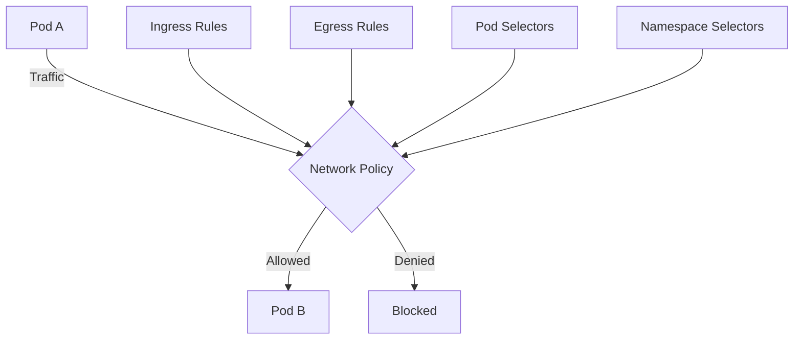
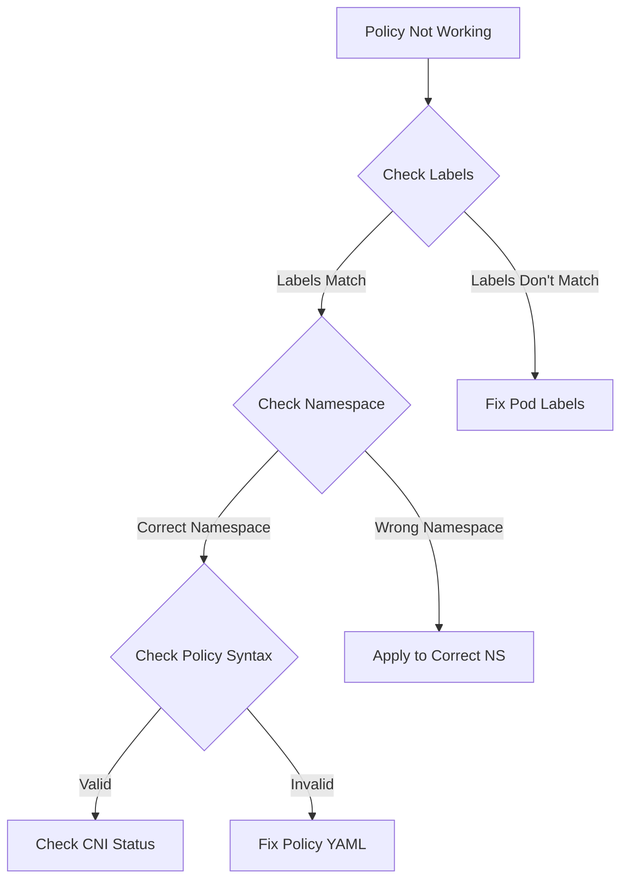
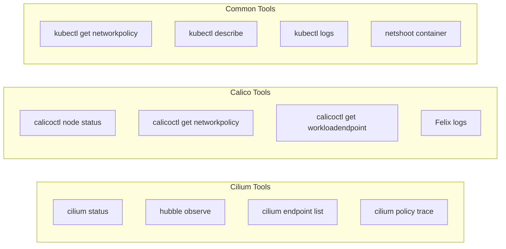

# How to Debug Network Policy Issues with Cilium or Calico

Author: [nawazdhandala](https://www.github.com/nawazdhandala)

Tags: kubernetes, network policies, cilium, calico, debugging, security, CNI, hubble, calicoctl

Description: Learn how to effectively debug and troubleshoot Kubernetes network policy issues using Cilium Hubble and Calico calicoctl with practical examples and common solutions.

---

Network policies are essential for securing Kubernetes clusters, but when they don't work as expected, debugging can be challenging. This guide covers comprehensive troubleshooting techniques for both Cilium and Calico CNI plugins.

## Understanding Network Policies

Before diving into debugging, let's understand how network policies work in Kubernetes:



## Prerequisites

Ensure you have the following tools installed:

```bash
# For Cilium
cilium version
hubble version

# For Calico
calicoctl version

# Common tools
kubectl version
```

## Debugging with Cilium

### Installing Cilium CLI and Hubble

```bash
# Install Cilium CLI
CILIUM_CLI_VERSION=$(curl -s https://raw.githubusercontent.com/cilium/cilium-cli/main/stable.txt)
CLI_ARCH=amd64
curl -L --fail --remote-name-all https://github.com/cilium/cilium-cli/releases/download/${CILIUM_CLI_VERSION}/cilium-linux-${CLI_ARCH}.tar.gz
sudo tar xzvfC cilium-linux-${CLI_ARCH}.tar.gz /usr/local/bin
rm cilium-linux-${CLI_ARCH}.tar.gz

# Enable Hubble
cilium hubble enable --ui
```

### Checking Cilium Status

```bash
# Check overall Cilium status
cilium status

# Expected output:
#     /¯¯\
#  /¯¯\__/¯¯\    Cilium:             OK
#  \__/¯¯\__/    Operator:           OK
#  /¯¯\__/¯¯\    Envoy DaemonSet:    OK
#  \__/¯¯\__/    Hubble Relay:       OK
#     \__/       ClusterMesh:        disabled

# Check connectivity
cilium connectivity test
```

### Using Hubble for Flow Visibility

Hubble provides real-time visibility into network flows:

```bash
# Port-forward Hubble Relay
cilium hubble port-forward &

# Observe all flows
hubble observe

# Filter flows by namespace
hubble observe --namespace default

# Filter by pod
hubble observe --pod default/my-app

# Filter dropped packets (policy violations)
hubble observe --verdict DROPPED

# Filter by specific policy
hubble observe --verdict DROPPED --protocol TCP --port 80
```

### Hubble Flow Analysis

```bash
# Watch flows in real-time with detailed output
hubble observe --follow --output json | jq '.'

# Example output for dropped traffic:
# {
#   "flow": {
#     "time": "2026-01-08T10:30:00.000000Z",
#     "verdict": "DROPPED",
#     "drop_reason": 133,
#     "drop_reason_desc": "Policy denied",
#     "ethernet": {...},
#     "IP": {
#       "source": "10.0.1.50",
#       "destination": "10.0.2.100"
#     },
#     "l4": {
#       "TCP": {
#         "source_port": 45678,
#         "destination_port": 80
#       }
#     },
#     "source": {
#       "namespace": "frontend",
#       "pod_name": "web-app-xyz"
#     },
#     "destination": {
#       "namespace": "backend",
#       "pod_name": "api-server-abc"
#     }
#   }
# }
```

### Inspecting Cilium Endpoints

```bash
# List all Cilium endpoints
kubectl -n kube-system exec -it $(kubectl -n kube-system get pods -l k8s-app=cilium -o jsonpath='{.items[0].metadata.name}') -- cilium endpoint list

# Get detailed endpoint info
kubectl -n kube-system exec -it $(kubectl -n kube-system get pods -l k8s-app=cilium -o jsonpath='{.items[0].metadata.name}') -- cilium endpoint get <endpoint-id>

# Check policy status for an endpoint
kubectl -n kube-system exec -it $(kubectl -n kube-system get pods -l k8s-app=cilium -o jsonpath='{.items[0].metadata.name}') -- cilium endpoint get <endpoint-id> -o jsonpath='{.status.policy}'
```

### Viewing Cilium Network Policies

```bash
# List Cilium Network Policies
kubectl get ciliumnetworkpolicies --all-namespaces

# List Cilium Clusterwide Network Policies
kubectl get ciliumclusterwidenetworkpolicies

# Describe a specific policy
kubectl describe ciliumnetworkpolicy <policy-name> -n <namespace>

# Get policy in YAML format
kubectl get ciliumnetworkpolicy <policy-name> -n <namespace> -o yaml
```

### Cilium Policy Tracing

```bash
# Trace policy decision between two endpoints
kubectl -n kube-system exec -it $(kubectl -n kube-system get pods -l k8s-app=cilium -o jsonpath='{.items[0].metadata.name}') -- cilium policy trace \
  --src-k8s-pod default:frontend-pod \
  --dst-k8s-pod default:backend-pod \
  --dport 80 \
  --protocol TCP
```

## Debugging with Calico

### Installing calicoctl

```bash
# Download calicoctl
curl -L https://github.com/projectcalico/calico/releases/download/v3.27.0/calicoctl-linux-amd64 -o calicoctl
chmod +x calicoctl
sudo mv calicoctl /usr/local/bin/

# Configure calicoctl
export CALICO_DATASTORE_TYPE=kubernetes
export CALICO_KUBECONFIG=~/.kube/config
```

### Checking Calico Status

```bash
# Check Calico node status
calicoctl node status

# Check Calico version
calicoctl version

# View Calico system pods
kubectl get pods -n calico-system
```

### Viewing Calico Network Policies

```bash
# List all network policies (Kubernetes native)
kubectl get networkpolicies --all-namespaces

# List Calico-specific policies
calicoctl get networkpolicy --all-namespaces

# List Global Network Policies
calicoctl get globalnetworkpolicy

# Get detailed policy info
calicoctl get networkpolicy <policy-name> -n <namespace> -o yaml
```

### Calico Policy Debugging

```bash
# Check workload endpoints
calicoctl get workloadendpoint --all-namespaces

# Get specific workload endpoint
calicoctl get workloadendpoint -n <namespace> --selector="projectcalico.org/orchestrator=k8s" -o yaml

# View IP pools
calicoctl get ippool -o wide

# Check BGP peers (if using BGP)
calicoctl node status
```

### Enabling Calico Flow Logs

```yaml
# felixconfiguration.yaml
apiVersion: projectcalico.org/v3
kind: FelixConfiguration
metadata:
  name: default
spec:
  flowLogsFlushInterval: 15s
  flowLogsFileEnabled: true
  flowLogsFileIncludeLabels: true
  flowLogsFileIncludePolicies: true
  flowLogsFileIncludeService: true
  # For denied flows
  flowLogsEnableNetworkSets: true
```

Apply the configuration:

```bash
calicoctl apply -f felixconfiguration.yaml
```

### Viewing Calico Logs

```bash
# View Felix logs (policy enforcement)
kubectl logs -n calico-system -l k8s-app=calico-node -c calico-node --tail=100

# Filter for policy-related logs
kubectl logs -n calico-system -l k8s-app=calico-node -c calico-node | grep -i policy

# View denied connections
kubectl logs -n calico-system -l k8s-app=calico-node -c calico-node | grep -i denied
```

## Common Network Policy Issues

### Issue 1: Policy Not Applied



**Debugging Steps:**

```bash
# Verify pod labels
kubectl get pods -n <namespace> --show-labels

# Verify policy selector matches pods
kubectl get networkpolicy <policy-name> -n <namespace> -o jsonpath='{.spec.podSelector}'

# Test label selector
kubectl get pods -n <namespace> -l app=myapp
```

### Issue 2: Ingress Traffic Blocked

Example policy that might cause issues:

```yaml
# restrictive-ingress.yaml
apiVersion: networking.k8s.io/v1
kind: NetworkPolicy
metadata:
  name: api-ingress
  namespace: backend
spec:
  podSelector:
    matchLabels:
      app: api
  policyTypes:
    - Ingress
  ingress:
    - from:
        - namespaceSelector:
            matchLabels:
              name: frontend  # Common mistake: namespace might not have this label
        - podSelector:
            matchLabels:
              app: web
      ports:
        - protocol: TCP
          port: 8080
```

**Fix: Ensure namespace labels exist:**

```bash
# Check namespace labels
kubectl get namespace frontend --show-labels

# Add label if missing
kubectl label namespace frontend name=frontend
```

### Issue 3: Egress Traffic Blocked

```yaml
# debug-egress-policy.yaml
apiVersion: networking.k8s.io/v1
kind: NetworkPolicy
metadata:
  name: allow-dns-and-api
  namespace: default
spec:
  podSelector:
    matchLabels:
      app: myapp
  policyTypes:
    - Egress
  egress:
    # Allow DNS
    - to:
        - namespaceSelector: {}
          podSelector:
            matchLabels:
              k8s-app: kube-dns
      ports:
        - protocol: UDP
          port: 53
        - protocol: TCP
          port: 53
    # Allow external API
    - to:
        - ipBlock:
            cidr: 0.0.0.0/0
            except:
              - 10.0.0.0/8
              - 172.16.0.0/12
              - 192.168.0.0/16
      ports:
        - protocol: TCP
          port: 443
```

### Issue 4: Cross-Namespace Communication

```yaml
# cross-namespace-policy.yaml
apiVersion: networking.k8s.io/v1
kind: NetworkPolicy
metadata:
  name: allow-from-monitoring
  namespace: production
spec:
  podSelector: {}  # Apply to all pods in namespace
  policyTypes:
    - Ingress
  ingress:
    - from:
        - namespaceSelector:
            matchLabels:
              purpose: monitoring
        - podSelector:
            matchLabels:
              app: prometheus
      ports:
        - protocol: TCP
          port: 9090
```

**Important:** The above uses OR logic. For AND logic, use a single `from` entry:

```yaml
  ingress:
    - from:
        - namespaceSelector:
            matchLabels:
              purpose: monitoring
          podSelector:
            matchLabels:
              app: prometheus
```

## Testing Network Policies

### Create Test Pods

```yaml
# test-pods.yaml
apiVersion: v1
kind: Pod
metadata:
  name: test-client
  namespace: default
  labels:
    app: test-client
spec:
  containers:
    - name: netshoot
      image: nicolaka/netshoot
      command: ["sleep", "infinity"]
---
apiVersion: v1
kind: Pod
metadata:
  name: test-server
  namespace: default
  labels:
    app: test-server
spec:
  containers:
    - name: nginx
      image: nginx
      ports:
        - containerPort: 80
```

### Testing Connectivity

```bash
# Apply test pods
kubectl apply -f test-pods.yaml

# Test connectivity from client to server
kubectl exec -it test-client -- curl -v --connect-timeout 5 test-server

# Test with specific port
kubectl exec -it test-client -- nc -zv test-server 80

# DNS resolution test
kubectl exec -it test-client -- nslookup kubernetes.default

# Test external connectivity
kubectl exec -it test-client -- curl -v --connect-timeout 5 https://api.github.com
```

## Debugging Tools Summary



## Advanced Debugging Script

```bash
#!/bin/bash
# network-policy-debug.sh

NAMESPACE=${1:-default}
POD=${2:-}

echo "=== Network Policy Debug Script ==="
echo "Namespace: $NAMESPACE"
echo "Pod: $POD"
echo ""

# List all network policies in namespace
echo "=== Network Policies in $NAMESPACE ==="
kubectl get networkpolicy -n $NAMESPACE

# If pod specified, show its labels
if [ -n "$POD" ]; then
    echo ""
    echo "=== Pod Labels ==="
    kubectl get pod $POD -n $NAMESPACE -o jsonpath='{.metadata.labels}' | jq '.'

    echo ""
    echo "=== Pod Network Status ==="
    kubectl get pod $POD -n $NAMESPACE -o jsonpath='{.status.podIP}'
fi

# Check CNI type
echo ""
echo "=== CNI Detection ==="
if kubectl get pods -n kube-system -l k8s-app=cilium 2>/dev/null | grep -q cilium; then
    echo "CNI: Cilium detected"
    echo ""
    echo "=== Cilium Status ==="
    cilium status 2>/dev/null || echo "cilium CLI not available"
elif kubectl get pods -n calico-system 2>/dev/null | grep -q calico; then
    echo "CNI: Calico detected"
    echo ""
    echo "=== Calico Node Status ==="
    calicoctl node status 2>/dev/null || echo "calicoctl not available"
else
    echo "CNI: Unknown or standard"
fi

# Show namespace labels
echo ""
echo "=== Namespace Labels ==="
kubectl get namespace $NAMESPACE -o jsonpath='{.metadata.labels}' | jq '.'
```

## Best Practices

1. **Start with Default Deny**: Implement default deny policies first, then add allow rules.

```yaml
# default-deny-all.yaml
apiVersion: networking.k8s.io/v1
kind: NetworkPolicy
metadata:
  name: default-deny-all
  namespace: production
spec:
  podSelector: {}
  policyTypes:
    - Ingress
    - Egress
```

2. **Label Everything**: Ensure all namespaces and pods have appropriate labels.

3. **Test Incrementally**: Add policies one at a time and test after each addition.

4. **Use Policy Visualization**: Tools like Hubble UI or Calico Enterprise provide visual policy maps.

5. **Document Policies**: Keep documentation of what each policy allows and why.

## Conclusion

Debugging network policies requires understanding both the policy syntax and the CNI-specific tools. Cilium's Hubble provides excellent flow visibility, while Calico's calicoctl offers powerful policy inspection. Always verify labels, test incrementally, and use the debugging tools appropriate for your CNI.

Key takeaways:
- Use `hubble observe --verdict DROPPED` for Cilium to see blocked traffic
- Use `calicoctl get` commands to inspect Calico policies
- Always verify pod and namespace labels match policy selectors
- Test with tools like netshoot for comprehensive connectivity testing
