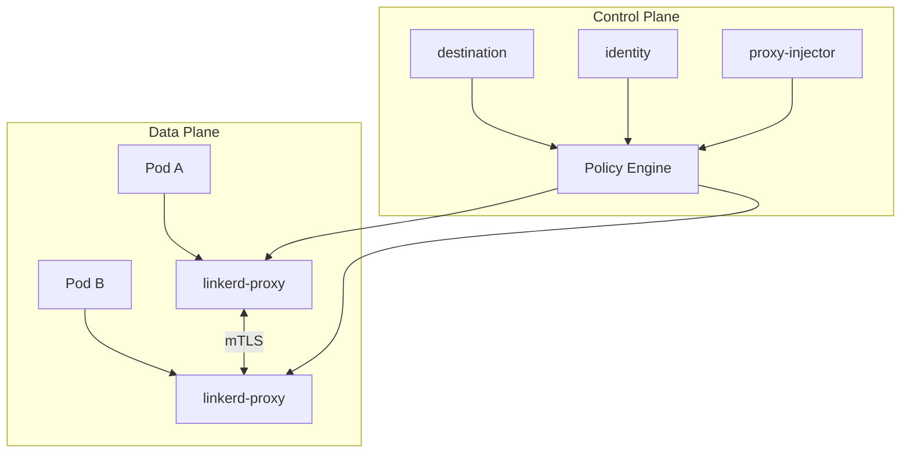
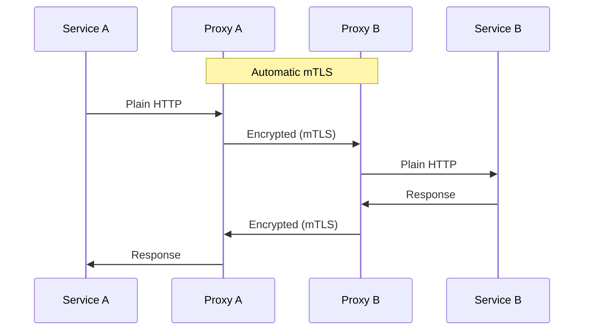
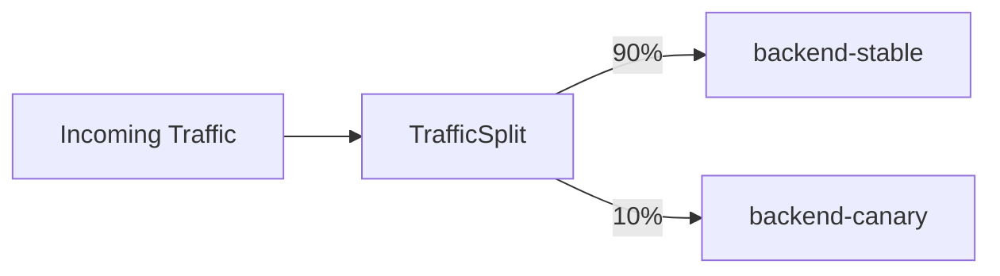
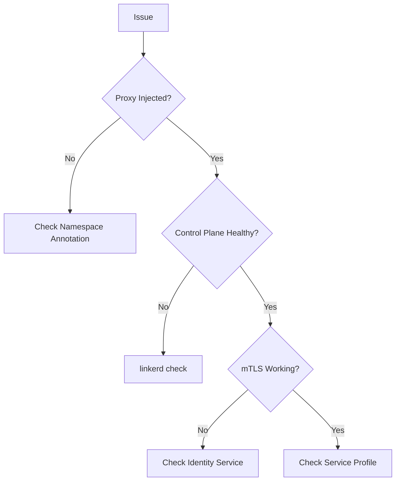

# How to Get Started with Linkerd for Service Mesh in Kubernetes

Author: [nawazdhandala](https://www.github.com/nawazdhandala)

Tags: linkerd, service mesh, kubernetes, mtls, observability, traffic splitting, microservices, security

Description: A complete guide to installing and configuring Linkerd service mesh in Kubernetes with automatic mTLS, observability features, and traffic management.

---

Linkerd is a lightweight, security-first service mesh for Kubernetes. Known for its simplicity and performance, Linkerd provides automatic mTLS, observability, and reliability features with minimal configuration. This guide walks you through installation, configuration, and practical use cases.

## What is Linkerd?



Linkerd consists of:
- **Control Plane**: Manages the mesh (destination, identity, proxy-injector)
- **Data Plane**: Lightweight proxies (linkerd2-proxy) injected into pods
- **CLI**: Command-line tool for installation and management

## Prerequisites

Before installing Linkerd, ensure you have:

```bash
# Kubernetes cluster (1.21+)
kubectl version --short

# Sufficient cluster resources
kubectl top nodes

# Helm (optional, for Helm installation)
helm version
```

## Installing Linkerd CLI

```bash
# Install Linkerd CLI (Linux/macOS)
curl --proto '=https' --tlsv1.2 -sSfL https://run.linkerd.io/install | sh

# Add to PATH
export PATH=$PATH:$HOME/.linkerd2/bin

# Verify installation
linkerd version

# Check cluster compatibility
linkerd check --pre
```

## Installing Linkerd Control Plane

### Option 1: CLI Installation

```bash
# Generate certificates (production: use your own CA)
linkerd check --pre

# Install CRDs
linkerd install --crds | kubectl apply -f -

# Install control plane
linkerd install | kubectl apply -f -

# Verify installation
linkerd check
```

### Option 2: Helm Installation

```bash
# Add Linkerd Helm repository
helm repo add linkerd https://helm.linkerd.io/stable
helm repo update

# Install CRDs
helm install linkerd-crds linkerd/linkerd-crds -n linkerd --create-namespace

# Generate certificates for production
step certificate create root.linkerd.cluster.local ca.crt ca.key \
  --profile root-ca --no-password --insecure

step certificate create identity.linkerd.cluster.local issuer.crt issuer.key \
  --profile intermediate-ca --not-after 8760h --no-password --insecure \
  --ca ca.crt --ca-key ca.key

# Install control plane with certificates
helm install linkerd-control-plane linkerd/linkerd-control-plane \
  -n linkerd \
  --set-file identityTrustAnchorsPEM=ca.crt \
  --set-file identity.issuer.tls.crtPEM=issuer.crt \
  --set-file identity.issuer.tls.keyPEM=issuer.key

# Verify installation
linkerd check
```

### Verify Control Plane Components

```bash
# Check control plane pods
kubectl get pods -n linkerd

# Expected output:
# NAME                                      READY   STATUS    RESTARTS   AGE
# linkerd-destination-xxxxxxxxxx-xxxxx      4/4     Running   0          2m
# linkerd-identity-xxxxxxxxxx-xxxxx         2/2     Running   0          2m
# linkerd-proxy-injector-xxxxxxxxxx-xxxxx   2/2     Running   0          2m

# Check control plane health
linkerd check
```

## Installing Linkerd Viz (Observability)

```bash
# Install Linkerd Viz extension
linkerd viz install | kubectl apply -f -

# Verify Viz installation
linkerd viz check

# Access the dashboard
linkerd viz dashboard &
```

## Injecting the Linkerd Proxy

### Automatic Injection (Recommended)

```yaml
# Enable injection for a namespace
apiVersion: v1
kind: Namespace
metadata:
  name: my-app
  annotations:
    linkerd.io/inject: enabled
```

```bash
# Apply namespace annotation
kubectl annotate namespace my-app linkerd.io/inject=enabled
```

### Manual Injection

```bash
# Inject proxy into deployment
kubectl get deployment my-app -o yaml | linkerd inject - | kubectl apply -f -

# Inject all deployments in a namespace
kubectl get deploy -n my-app -o yaml | linkerd inject - | kubectl apply -f -
```

### Verify Injection

```bash
# Check if pods have proxy
kubectl get pods -n my-app -o jsonpath='{.items[*].spec.containers[*].name}' | tr ' ' '\n' | grep linkerd-proxy

# Check proxy status
linkerd viz stat deploy -n my-app
```

## Automatic mTLS

Linkerd provides automatic mTLS without any configuration:



### Verifying mTLS

```bash
# Check mTLS status
linkerd viz edges deployment -n my-app

# Example output:
# SRC          DST          SRC_NS    DST_NS    SECURED
# frontend     backend      my-app    my-app    √
# backend      database     my-app    my-app    √

# Detailed TLS stats
linkerd viz stat deploy -n my-app -o wide
```

### Check Certificate Information

```bash
# View proxy identity
linkerd viz tap deploy/my-app -n my-app --to deploy/backend | grep tls

# Check identity certificates
kubectl exec -it deploy/my-app -n my-app -c linkerd-proxy -- \
  cat /var/run/linkerd/identity/end-entity/certificate.crt | openssl x509 -text -noout
```

## Observability Features

### Real-Time Traffic Monitoring

```bash
# View live traffic stats
linkerd viz stat deploy -n my-app

# Output:
# NAME       MESHED   SUCCESS   RPS   LATENCY_P50   LATENCY_P95   LATENCY_P99
# frontend   1/1      100.00%   10    5ms           15ms          25ms
# backend    1/1      99.50%    8     3ms           10ms          20ms
```

### Traffic Tap (Live Request Inspection)

```bash
# Tap all traffic to a deployment
linkerd viz tap deploy/frontend -n my-app

# Tap with filters
linkerd viz tap deploy/frontend -n my-app --to deploy/backend --method GET

# Tap with path filter
linkerd viz tap deploy/api -n my-app --path /api/v1/users
```

### Top Routes (Traffic by Route)

```bash
# View top routes
linkerd viz routes deploy/frontend -n my-app

# Output:
# ROUTE                       SERVICE   SUCCESS   RPS   LATENCY_P50   LATENCY_P95
# GET /api/users              backend   100.00%   5     10ms          50ms
# POST /api/orders            backend   99.80%    3     20ms          100ms
# GET /health                 backend   100.00%   1     1ms           2ms
```

### Service Profiles for Route Metrics

```yaml
# service-profile.yaml
apiVersion: linkerd.io/v1alpha2
kind: ServiceProfile
metadata:
  name: backend.my-app.svc.cluster.local
  namespace: my-app
spec:
  routes:
    - name: GET /api/users
      condition:
        method: GET
        pathRegex: /api/users
    - name: POST /api/users
      condition:
        method: POST
        pathRegex: /api/users
    - name: GET /api/users/{id}
      condition:
        method: GET
        pathRegex: /api/users/[^/]+
      responseClasses:
        - condition:
            status:
              min: 500
              max: 599
          isFailure: true
```

```bash
# Generate service profile from OpenAPI spec
linkerd viz profile --open-api swagger.yaml backend -n my-app | kubectl apply -f -
```

## Traffic Splitting

Traffic splitting enables canary deployments and A/B testing:



### Configure Traffic Split

```yaml
# traffic-split.yaml
apiVersion: split.smi-spec.io/v1alpha2
kind: TrafficSplit
metadata:
  name: backend-split
  namespace: my-app
spec:
  service: backend
  backends:
    - service: backend-stable
      weight: 900  # 90%
    - service: backend-canary
      weight: 100  # 10%
```

### Create Backend Services

```yaml
# backend-services.yaml
apiVersion: v1
kind: Service
metadata:
  name: backend
  namespace: my-app
spec:
  selector:
    app: backend
  ports:
    - port: 80
---
apiVersion: v1
kind: Service
metadata:
  name: backend-stable
  namespace: my-app
spec:
  selector:
    app: backend
    version: stable
  ports:
    - port: 80
---
apiVersion: v1
kind: Service
metadata:
  name: backend-canary
  namespace: my-app
spec:
  selector:
    app: backend
    version: canary
  ports:
    - port: 80
```

### Monitor Traffic Split

```bash
# View traffic split stats
linkerd viz stat trafficsplit -n my-app

# Watch traffic distribution
watch linkerd viz stat deploy -n my-app
```

## Retries and Timeouts

### Configure Retries

```yaml
# service-profile-retries.yaml
apiVersion: linkerd.io/v1alpha2
kind: ServiceProfile
metadata:
  name: backend.my-app.svc.cluster.local
  namespace: my-app
spec:
  routes:
    - name: GET /api/users
      condition:
        method: GET
        pathRegex: /api/users
      isRetryable: true  # Enable retries for this route
  retryBudget:
    retryRatio: 0.2        # Max 20% additional load from retries
    minRetriesPerSecond: 10
    ttl: 10s
```

### Configure Timeouts

```yaml
# service-profile-timeouts.yaml
apiVersion: linkerd.io/v1alpha2
kind: ServiceProfile
metadata:
  name: backend.my-app.svc.cluster.local
  namespace: my-app
spec:
  routes:
    - name: GET /api/users
      condition:
        method: GET
        pathRegex: /api/users
      timeout: 5s  # 5 second timeout
    - name: POST /api/process
      condition:
        method: POST
        pathRegex: /api/process
      timeout: 30s  # Longer timeout for processing
```

## Authorization Policies

Linkerd provides fine-grained authorization:

```yaml
# server-authorization.yaml
apiVersion: policy.linkerd.io/v1beta1
kind: Server
metadata:
  name: backend-server
  namespace: my-app
spec:
  podSelector:
    matchLabels:
      app: backend
  port: 8080
  proxyProtocol: HTTP/1
---
apiVersion: policy.linkerd.io/v1beta1
kind: ServerAuthorization
metadata:
  name: backend-authz
  namespace: my-app
spec:
  server:
    name: backend-server
  client:
    meshTLS:
      serviceAccounts:
        - name: frontend
          namespace: my-app
```

### Default Deny Policy

```yaml
# default-deny.yaml
apiVersion: policy.linkerd.io/v1beta1
kind: AuthorizationPolicy
metadata:
  name: deny-all
  namespace: my-app
spec:
  targetRef:
    group: policy.linkerd.io
    kind: Server
    name: backend-server
  requiredAuthenticationRefs: []  # Denies all traffic
```

## Complete Example Application

### Deploy Sample Application

```yaml
# sample-app.yaml
apiVersion: v1
kind: Namespace
metadata:
  name: emojivoto
  annotations:
    linkerd.io/inject: enabled
---
apiVersion: apps/v1
kind: Deployment
metadata:
  name: web
  namespace: emojivoto
spec:
  replicas: 1
  selector:
    matchLabels:
      app: web
  template:
    metadata:
      labels:
        app: web
    spec:
      serviceAccountName: web
      containers:
        - name: web
          image: docker.l5d.io/buoyantio/emojivoto-web:v11
          ports:
            - containerPort: 8080
          env:
            - name: WEB_PORT
              value: "8080"
            - name: EMOJISVC_HOST
              value: emoji-svc.emojivoto:8080
            - name: VOTINGSVC_HOST
              value: voting-svc.emojivoto:8080
---
apiVersion: v1
kind: Service
metadata:
  name: web-svc
  namespace: emojivoto
spec:
  selector:
    app: web
  ports:
    - port: 80
      targetPort: 8080
---
apiVersion: v1
kind: ServiceAccount
metadata:
  name: web
  namespace: emojivoto
```

### Apply and Verify

```bash
# Apply the sample app
kubectl apply -f sample-app.yaml

# Check injection
kubectl get pods -n emojivoto -o jsonpath='{.items[*].spec.containers[*].name}'

# View in dashboard
linkerd viz dashboard &
```

## Troubleshooting

### Common Issues



### Debug Commands

```bash
# Full health check
linkerd check

# Check specific namespace
linkerd check --proxy -n my-app

# View proxy logs
kubectl logs deploy/my-app -n my-app -c linkerd-proxy

# Debug proxy configuration
linkerd viz tap deploy/my-app -n my-app

# Check edges (service-to-service communication)
linkerd viz edges deploy -n my-app

# Diagnose specific pod
linkerd diagnostics proxy-metrics -n my-app deploy/my-app
```

### Common Fixes

```bash
# Restart pods to pick up new proxy
kubectl rollout restart deploy -n my-app

# Re-inject proxy
kubectl get deploy my-app -n my-app -o yaml | linkerd inject --manual - | kubectl apply -f -

# Check for proxy injection issues
kubectl describe pod <pod-name> -n my-app | grep -A5 "linkerd"
```

## Upgrading Linkerd

```bash
# Check current version
linkerd version

# Check for available updates
linkerd check --pre

# Upgrade CLI
curl --proto '=https' --tlsv1.2 -sSfL https://run.linkerd.io/install | sh

# Upgrade control plane
linkerd upgrade | kubectl apply --prune -l linkerd.io/control-plane-ns=linkerd -f -

# Upgrade data plane (restart injected pods)
kubectl rollout restart deploy -n my-app

# Verify upgrade
linkerd check
```

## Best Practices

1. **Always run `linkerd check`** before and after installation or upgrades.

2. **Use automatic injection** by annotating namespaces rather than manual injection.

3. **Create Service Profiles** for detailed route metrics and retry configuration.

4. **Monitor with Linkerd Viz** dashboard for real-time observability.

5. **Use production certificates** - generate your own CA certificates for production.

6. **Enable debug logging** only when troubleshooting to avoid performance impact.

7. **Regularly upgrade** to get security patches and new features.

## Comparison with Other Service Meshes

| Feature | Linkerd | Istio | Consul Connect |
|---------|---------|-------|----------------|
| Complexity | Low | High | Medium |
| Resource Usage | Light | Heavy | Medium |
| mTLS | Automatic | Configurable | Automatic |
| Protocol Support | HTTP/1, HTTP/2, gRPC | HTTP/1, HTTP/2, gRPC, TCP | HTTP, gRPC, TCP |
| Learning Curve | Easy | Steep | Moderate |

## Conclusion

Linkerd provides a lightweight, secure, and easy-to-use service mesh for Kubernetes. With automatic mTLS, built-in observability, and simple configuration, it's an excellent choice for teams looking to add service mesh capabilities without significant complexity.

Key takeaways:
- Installation is straightforward with the Linkerd CLI
- mTLS is automatic and requires no configuration
- Observability features provide deep insights into service communication
- Traffic splitting enables safe canary deployments
- Service profiles provide fine-grained control over routes and retries
- Authorization policies add security beyond mTLS
