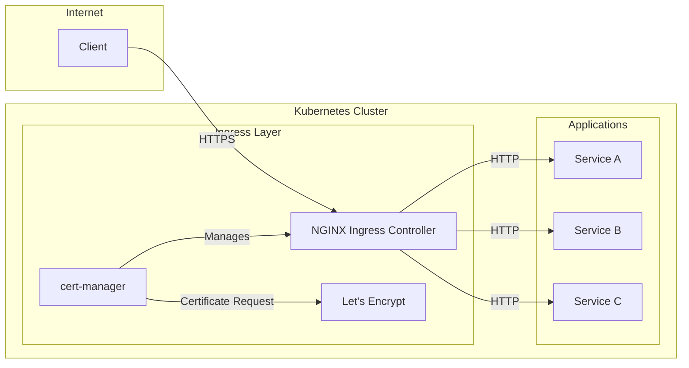

# How to Set Up NGINX Ingress Controller with SSL/TLS Termination

Author: [nawazdhandala](https://www.github.com/nawazdhandala)

Tags: nginx, ingress, kubernetes, ssl, tls, cert-manager, lets-encrypt, security, https

Description: A comprehensive guide to deploying NGINX Ingress Controller with automated SSL/TLS certificate management using cert-manager and Let's Encrypt.

---

## Introduction

SSL/TLS termination at the ingress level is essential for securing traffic to your Kubernetes applications. The NGINX Ingress Controller combined with cert-manager provides a robust solution for handling HTTPS traffic with automated certificate management.

This guide covers everything from installation to production-ready configurations with security best practices.

## Architecture Overview



## Prerequisites

Before starting, ensure you have:

- A running Kubernetes cluster (v1.19+)
- `kubectl` configured with cluster access
- Helm 3.x installed
- A domain name pointing to your cluster's external IP
- Basic understanding of Kubernetes resources

## Step 1: Install NGINX Ingress Controller

### Using Helm (Recommended)

First, add the NGINX Ingress Helm repository:

```bash
# Add the ingress-nginx repository
helm repo add ingress-nginx https://kubernetes.github.io/ingress-nginx
helm repo update
```

Create a values file for customization:

```yaml
# nginx-ingress-values.yaml
controller:
  replicaCount: 2

  # Enable metrics for monitoring
  metrics:
    enabled: true
    serviceMonitor:
      enabled: true

  # Resource limits
  resources:
    requests:
      cpu: 100m
      memory: 128Mi
    limits:
      cpu: 500m
      memory: 512Mi

  # Enable PodDisruptionBudget
  podDisruptionBudget:
    enabled: true
    minAvailable: 1

  # Configmap settings for security headers
  config:
    ssl-protocols: "TLSv1.2 TLSv1.3"
    ssl-ciphers: "ECDHE-ECDSA-AES128-GCM-SHA256:ECDHE-RSA-AES128-GCM-SHA256:ECDHE-ECDSA-AES256-GCM-SHA384:ECDHE-RSA-AES256-GCM-SHA384"
    ssl-prefer-server-ciphers: "true"
    hsts: "true"
    hsts-include-subdomains: "true"
    hsts-max-age: "31536000"

  # Service configuration
  service:
    type: LoadBalancer
    annotations: {}
    # For AWS:
    # service.beta.kubernetes.io/aws-load-balancer-type: nlb
    # For GCP:
    # cloud.google.com/load-balancer-type: External
```

Install the NGINX Ingress Controller:

```bash
# Create namespace
kubectl create namespace ingress-nginx

# Install with custom values
helm install ingress-nginx ingress-nginx/ingress-nginx \
  --namespace ingress-nginx \
  --values nginx-ingress-values.yaml
```

### Verify Installation

```bash
# Check deployment status
kubectl get pods -n ingress-nginx

# Get the external IP
kubectl get svc -n ingress-nginx ingress-nginx-controller

# Expected output:
# NAME                       TYPE           CLUSTER-IP      EXTERNAL-IP     PORT(S)
# ingress-nginx-controller   LoadBalancer   10.96.xxx.xxx   203.0.113.xxx   80:31234/TCP,443:31235/TCP
```

## Step 2: Install cert-manager

cert-manager automates the management and issuance of TLS certificates from various sources, including Let's Encrypt.

### Install cert-manager using Helm

```bash
# Add the Jetstack Helm repository
helm repo add jetstack https://charts.jetstack.io
helm repo update

# Install cert-manager with CRDs
kubectl create namespace cert-manager

helm install cert-manager jetstack/cert-manager \
  --namespace cert-manager \
  --version v1.14.0 \
  --set installCRDs=true \
  --set prometheus.enabled=true
```

### Verify cert-manager Installation

```bash
# Check all cert-manager pods are running
kubectl get pods -n cert-manager

# Test the installation
kubectl apply -f - <<EOF
apiVersion: v1
kind: Namespace
metadata:
  name: cert-manager-test
---
apiVersion: cert-manager.io/v1
kind: Issuer
metadata:
  name: test-selfsigned
  namespace: cert-manager-test
spec:
  selfSigned: {}
---
apiVersion: cert-manager.io/v1
kind: Certificate
metadata:
  name: selfsigned-cert
  namespace: cert-manager-test
spec:
  dnsNames:
    - example.com
  secretName: selfsigned-cert-tls
  issuerRef:
    name: test-selfsigned
EOF

# Check if certificate was issued
kubectl get certificate -n cert-manager-test

# Clean up test resources
kubectl delete namespace cert-manager-test
```

## Step 3: Configure Let's Encrypt Issuers

Create ClusterIssuers for both staging and production Let's Encrypt environments.

### Staging Issuer (for testing)

```yaml
# cluster-issuer-staging.yaml
apiVersion: cert-manager.io/v1
kind: ClusterIssuer
metadata:
  name: letsencrypt-staging
spec:
  acme:
    # Staging server for testing
    server: https://acme-staging-v02.api.letsencrypt.org/directory
    email: your-email@example.com
    privateKeySecretRef:
      name: letsencrypt-staging-account-key
    solvers:
    - http01:
        ingress:
          class: nginx
```

### Production Issuer

```yaml
# cluster-issuer-production.yaml
apiVersion: cert-manager.io/v1
kind: ClusterIssuer
metadata:
  name: letsencrypt-production
spec:
  acme:
    # Production server
    server: https://acme-v02.api.letsencrypt.org/directory
    email: your-email@example.com
    privateKeySecretRef:
      name: letsencrypt-production-account-key
    solvers:
    - http01:
        ingress:
          class: nginx
```

Apply the issuers:

```bash
kubectl apply -f cluster-issuer-staging.yaml
kubectl apply -f cluster-issuer-production.yaml

# Verify issuers are ready
kubectl get clusterissuers
```

### DNS01 Challenge Solver (for wildcard certificates)

For wildcard certificates, you need DNS01 challenge. Here's an example using Cloudflare:

```yaml
# cluster-issuer-dns01.yaml
apiVersion: cert-manager.io/v1
kind: ClusterIssuer
metadata:
  name: letsencrypt-dns01
spec:
  acme:
    server: https://acme-v02.api.letsencrypt.org/directory
    email: your-email@example.com
    privateKeySecretRef:
      name: letsencrypt-dns01-account-key
    solvers:
    - dns01:
        cloudflare:
          email: your-cloudflare-email@example.com
          apiTokenSecretRef:
            name: cloudflare-api-token
            key: api-token
      selector:
        dnsZones:
        - "example.com"
```

Create the Cloudflare API token secret:

```bash
kubectl create secret generic cloudflare-api-token \
  --namespace cert-manager \
  --from-literal=api-token=<your-cloudflare-api-token>
```

## Step 4: Deploy a Sample Application

Let's deploy a sample application to test our setup:

```yaml
# sample-app.yaml
apiVersion: apps/v1
kind: Deployment
metadata:
  name: hello-app
  namespace: default
spec:
  replicas: 2
  selector:
    matchLabels:
      app: hello-app
  template:
    metadata:
      labels:
        app: hello-app
    spec:
      containers:
      - name: hello-app
        image: gcr.io/google-samples/hello-app:1.0
        ports:
        - containerPort: 8080
        resources:
          requests:
            cpu: 50m
            memory: 64Mi
          limits:
            cpu: 100m
            memory: 128Mi
---
apiVersion: v1
kind: Service
metadata:
  name: hello-app-service
  namespace: default
spec:
  selector:
    app: hello-app
  ports:
  - port: 80
    targetPort: 8080
  type: ClusterIP
```

Apply the deployment:

```bash
kubectl apply -f sample-app.yaml
```

## Step 5: Create Ingress with TLS

### Basic TLS Ingress

```yaml
# ingress-tls.yaml
apiVersion: networking.k8s.io/v1
kind: Ingress
metadata:
  name: hello-app-ingress
  namespace: default
  annotations:
    # Use NGINX Ingress Controller
    kubernetes.io/ingress.class: nginx
    # Use Let's Encrypt production issuer
    cert-manager.io/cluster-issuer: letsencrypt-production
    # Force HTTPS redirect
    nginx.ingress.kubernetes.io/ssl-redirect: "true"
    # Enable HSTS
    nginx.ingress.kubernetes.io/configuration-snippet: |
      add_header Strict-Transport-Security "max-age=31536000; includeSubDomains" always;
spec:
  tls:
  - hosts:
    - app.example.com
    secretName: hello-app-tls
  rules:
  - host: app.example.com
    http:
      paths:
      - path: /
        pathType: Prefix
        backend:
          service:
            name: hello-app-service
            port:
              number: 80
```

### Ingress with Multiple Hosts

```yaml
# ingress-multi-host.yaml
apiVersion: networking.k8s.io/v1
kind: Ingress
metadata:
  name: multi-host-ingress
  namespace: default
  annotations:
    kubernetes.io/ingress.class: nginx
    cert-manager.io/cluster-issuer: letsencrypt-production
    nginx.ingress.kubernetes.io/ssl-redirect: "true"
spec:
  tls:
  - hosts:
    - app.example.com
    - api.example.com
    - admin.example.com
    secretName: multi-host-tls
  rules:
  - host: app.example.com
    http:
      paths:
      - path: /
        pathType: Prefix
        backend:
          service:
            name: frontend-service
            port:
              number: 80
  - host: api.example.com
    http:
      paths:
      - path: /
        pathType: Prefix
        backend:
          service:
            name: api-service
            port:
              number: 80
  - host: admin.example.com
    http:
      paths:
      - path: /
        pathType: Prefix
        backend:
          service:
            name: admin-service
            port:
              number: 80
```

### Wildcard Certificate Ingress

```yaml
# ingress-wildcard.yaml
apiVersion: cert-manager.io/v1
kind: Certificate
metadata:
  name: wildcard-example-com
  namespace: default
spec:
  secretName: wildcard-example-com-tls
  issuerRef:
    name: letsencrypt-dns01
    kind: ClusterIssuer
  dnsNames:
  - "*.example.com"
  - "example.com"
---
apiVersion: networking.k8s.io/v1
kind: Ingress
metadata:
  name: wildcard-ingress
  namespace: default
  annotations:
    kubernetes.io/ingress.class: nginx
    nginx.ingress.kubernetes.io/ssl-redirect: "true"
spec:
  tls:
  - hosts:
    - "*.example.com"
    secretName: wildcard-example-com-tls
  rules:
  - host: "*.example.com"
    http:
      paths:
      - path: /
        pathType: Prefix
        backend:
          service:
            name: catch-all-service
            port:
              number: 80
```

## Step 6: Security Headers Configuration

### Comprehensive Security Headers

```yaml
# ingress-security-headers.yaml
apiVersion: networking.k8s.io/v1
kind: Ingress
metadata:
  name: secure-app-ingress
  namespace: default
  annotations:
    kubernetes.io/ingress.class: nginx
    cert-manager.io/cluster-issuer: letsencrypt-production
    nginx.ingress.kubernetes.io/ssl-redirect: "true"

    # Security headers
    nginx.ingress.kubernetes.io/configuration-snippet: |
      # HSTS with preload
      add_header Strict-Transport-Security "max-age=31536000; includeSubDomains; preload" always;

      # Prevent clickjacking
      add_header X-Frame-Options "SAMEORIGIN" always;

      # Prevent MIME type sniffing
      add_header X-Content-Type-Options "nosniff" always;

      # XSS protection
      add_header X-XSS-Protection "1; mode=block" always;

      # Referrer policy
      add_header Referrer-Policy "strict-origin-when-cross-origin" always;

      # Content Security Policy
      add_header Content-Security-Policy "default-src 'self'; script-src 'self' 'unsafe-inline' 'unsafe-eval'; style-src 'self' 'unsafe-inline';" always;

      # Permissions Policy
      add_header Permissions-Policy "geolocation=(), microphone=(), camera=()" always;
spec:
  tls:
  - hosts:
    - secure.example.com
    secretName: secure-app-tls
  rules:
  - host: secure.example.com
    http:
      paths:
      - path: /
        pathType: Prefix
        backend:
          service:
            name: secure-app-service
            port:
              number: 80
```

### Global Security Configuration via ConfigMap

Update the NGINX Ingress ConfigMap for cluster-wide settings:

```yaml
# nginx-configmap.yaml
apiVersion: v1
kind: ConfigMap
metadata:
  name: ingress-nginx-controller
  namespace: ingress-nginx
data:
  # TLS configuration
  ssl-protocols: "TLSv1.2 TLSv1.3"
  ssl-ciphers: "ECDHE-ECDSA-AES128-GCM-SHA256:ECDHE-RSA-AES128-GCM-SHA256:ECDHE-ECDSA-AES256-GCM-SHA384:ECDHE-RSA-AES256-GCM-SHA384:ECDHE-ECDSA-CHACHA20-POLY1305:ECDHE-RSA-CHACHA20-POLY1305"
  ssl-prefer-server-ciphers: "true"

  # HSTS
  hsts: "true"
  hsts-include-subdomains: "true"
  hsts-max-age: "31536000"
  hsts-preload: "true"

  # Security
  hide-headers: "X-Powered-By,Server"
  server-tokens: "false"

  # Timeouts
  proxy-connect-timeout: "10"
  proxy-read-timeout: "60"
  proxy-send-timeout: "60"

  # Buffer sizes
  proxy-buffer-size: "8k"
  proxy-buffers-number: "4"

  # Client body size
  proxy-body-size: "50m"

  # Enable gzip compression
  use-gzip: "true"
  gzip-types: "application/json application/javascript text/css text/plain"
```

## Step 7: HTTP to HTTPS Redirects

### Automatic Redirect (Recommended)

```yaml
# ingress-redirect.yaml
apiVersion: networking.k8s.io/v1
kind: Ingress
metadata:
  name: redirect-ingress
  namespace: default
  annotations:
    kubernetes.io/ingress.class: nginx
    cert-manager.io/cluster-issuer: letsencrypt-production
    # Enable automatic HTTP to HTTPS redirect
    nginx.ingress.kubernetes.io/ssl-redirect: "true"
    # Permanent redirect (301)
    nginx.ingress.kubernetes.io/permanent-redirect-code: "301"
spec:
  tls:
  - hosts:
    - www.example.com
    secretName: www-example-tls
  rules:
  - host: www.example.com
    http:
      paths:
      - path: /
        pathType: Prefix
        backend:
          service:
            name: app-service
            port:
              number: 80
```

### WWW to Non-WWW Redirect

```yaml
# ingress-www-redirect.yaml
apiVersion: networking.k8s.io/v1
kind: Ingress
metadata:
  name: www-redirect
  namespace: default
  annotations:
    kubernetes.io/ingress.class: nginx
    cert-manager.io/cluster-issuer: letsencrypt-production
    nginx.ingress.kubernetes.io/permanent-redirect: "https://example.com$request_uri"
spec:
  tls:
  - hosts:
    - www.example.com
    secretName: www-redirect-tls
  rules:
  - host: www.example.com
    http:
      paths:
      - path: /
        pathType: Prefix
        backend:
          service:
            name: app-service
            port:
              number: 80
---
apiVersion: networking.k8s.io/v1
kind: Ingress
metadata:
  name: main-ingress
  namespace: default
  annotations:
    kubernetes.io/ingress.class: nginx
    cert-manager.io/cluster-issuer: letsencrypt-production
    nginx.ingress.kubernetes.io/ssl-redirect: "true"
spec:
  tls:
  - hosts:
    - example.com
    secretName: example-com-tls
  rules:
  - host: example.com
    http:
      paths:
      - path: /
        pathType: Prefix
        backend:
          service:
            name: app-service
            port:
              number: 80
```

## Step 8: Monitor Certificate Status

### Check Certificate Status

```bash
# List all certificates
kubectl get certificates --all-namespaces

# Describe a specific certificate
kubectl describe certificate hello-app-tls -n default

# Check certificate secret
kubectl get secret hello-app-tls -n default -o yaml

# View certificate details
kubectl get secret hello-app-tls -n default -o jsonpath='{.data.tls\.crt}' | base64 -d | openssl x509 -text -noout
```

### Check Certificate Request Status

```bash
# List certificate requests
kubectl get certificaterequests --all-namespaces

# Check for any issues
kubectl get challenges --all-namespaces
kubectl get orders --all-namespaces
```

### Create Monitoring Script

```bash
#!/bin/bash
# check-certs.sh - Monitor certificate expiration

echo "Checking certificate expiration dates..."
echo "========================================="

for ns in $(kubectl get namespaces -o jsonpath='{.items[*].metadata.name}'); do
  for cert in $(kubectl get certificates -n $ns -o jsonpath='{.items[*].metadata.name}' 2>/dev/null); do
    expiry=$(kubectl get certificate $cert -n $ns -o jsonpath='{.status.notAfter}')
    ready=$(kubectl get certificate $cert -n $ns -o jsonpath='{.status.conditions[?(@.type=="Ready")].status}')
    echo "Namespace: $ns | Certificate: $cert | Ready: $ready | Expires: $expiry"
  done
done
```

## Troubleshooting

### Common Issues and Solutions

#### Certificate Not Issuing

```bash
# Check cert-manager logs
kubectl logs -n cert-manager -l app=cert-manager -f

# Check challenge status
kubectl describe challenge -A

# Check order status
kubectl describe order -A

# Verify DNS is pointing to the correct IP
nslookup app.example.com
dig app.example.com
```

#### NGINX Ingress Issues

```bash
# Check NGINX Ingress Controller logs
kubectl logs -n ingress-nginx -l app.kubernetes.io/component=controller -f

# Check NGINX configuration
kubectl exec -n ingress-nginx -it $(kubectl get pods -n ingress-nginx -l app.kubernetes.io/component=controller -o jsonpath='{.items[0].metadata.name}') -- nginx -T

# Check ingress events
kubectl describe ingress hello-app-ingress -n default
```

#### SSL/TLS Debugging

```bash
# Test SSL connection
openssl s_client -connect app.example.com:443 -servername app.example.com

# Check certificate chain
curl -vI https://app.example.com

# Verify certificate
echo | openssl s_client -connect app.example.com:443 2>/dev/null | openssl x509 -noout -dates
```

### Certificate Renewal Issues

cert-manager automatically renews certificates 30 days before expiry. If renewal fails:

```bash
# Force certificate renewal by deleting the secret
kubectl delete secret hello-app-tls -n default

# The certificate controller will detect the missing secret and request a new one

# Alternatively, delete and recreate the Certificate resource
kubectl delete certificate hello-app-tls -n default
kubectl apply -f ingress-tls.yaml
```

## Best Practices

### 1. Use Staging First

Always test with Let's Encrypt staging before production:

```yaml
annotations:
  cert-manager.io/cluster-issuer: letsencrypt-staging
```

### 2. Set Resource Limits

```yaml
resources:
  requests:
    cpu: 100m
    memory: 128Mi
  limits:
    cpu: 500m
    memory: 512Mi
```

### 3. Enable Pod Disruption Budget

```yaml
podDisruptionBudget:
  enabled: true
  minAvailable: 1
```

### 4. Use Network Policies

```yaml
apiVersion: networking.k8s.io/v1
kind: NetworkPolicy
metadata:
  name: ingress-nginx-policy
  namespace: ingress-nginx
spec:
  podSelector:
    matchLabels:
      app.kubernetes.io/component: controller
  policyTypes:
  - Ingress
  ingress:
  - from: []
    ports:
    - protocol: TCP
      port: 80
    - protocol: TCP
      port: 443
```

### 5. Regular Certificate Monitoring

Set up alerts for certificate expiration:

```yaml
# prometheus-alert.yaml
apiVersion: monitoring.coreos.com/v1
kind: PrometheusRule
metadata:
  name: cert-manager-alerts
  namespace: monitoring
spec:
  groups:
  - name: cert-manager
    rules:
    - alert: CertificateExpiringSoon
      expr: certmanager_certificate_expiration_timestamp_seconds - time() < 604800
      for: 1h
      labels:
        severity: warning
      annotations:
        summary: "Certificate {{ $labels.name }} expiring soon"
        description: "Certificate {{ $labels.name }} in namespace {{ $labels.namespace }} expires in less than 7 days"
```

## Conclusion

Setting up NGINX Ingress Controller with SSL/TLS termination provides a secure, scalable solution for managing HTTPS traffic in Kubernetes. By combining NGINX Ingress with cert-manager and Let's Encrypt, you get automated certificate management that requires minimal maintenance.

Key takeaways:
- Use cert-manager for automated certificate lifecycle management
- Always test with Let's Encrypt staging before production
- Implement comprehensive security headers
- Monitor certificate expiration proactively
- Follow security best practices for TLS configuration

With this setup, your Kubernetes applications will benefit from industry-standard encryption with minimal operational overhead.
