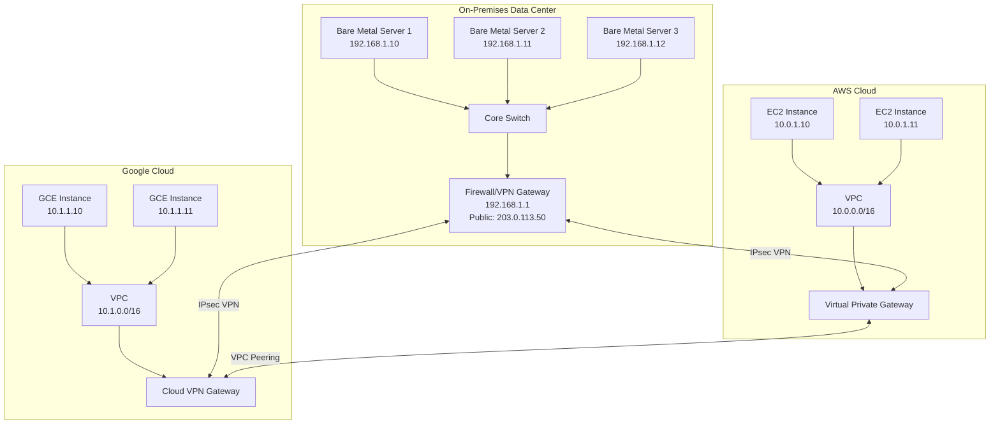
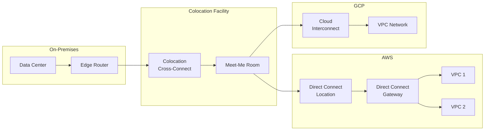
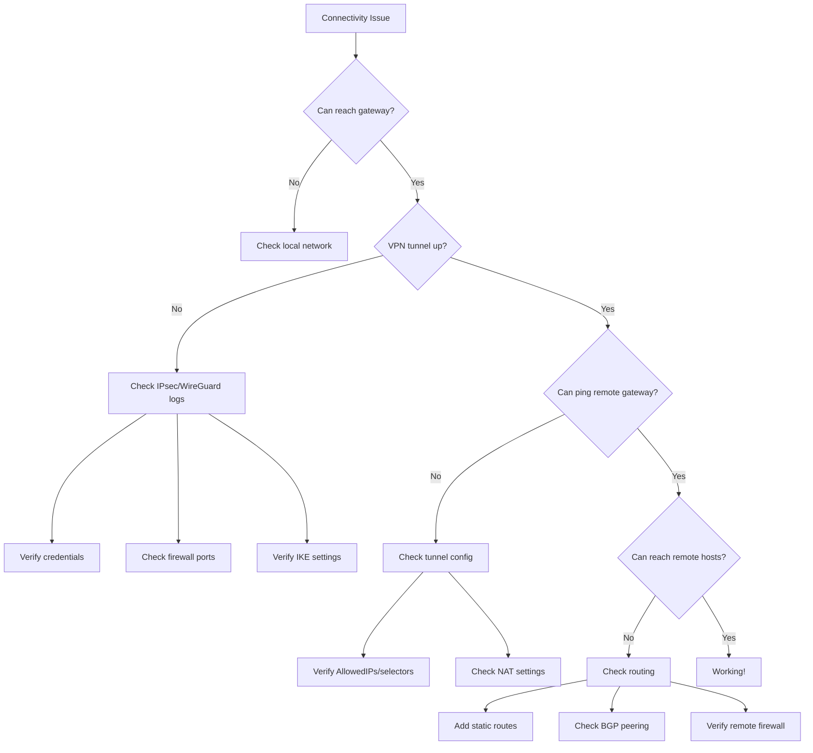
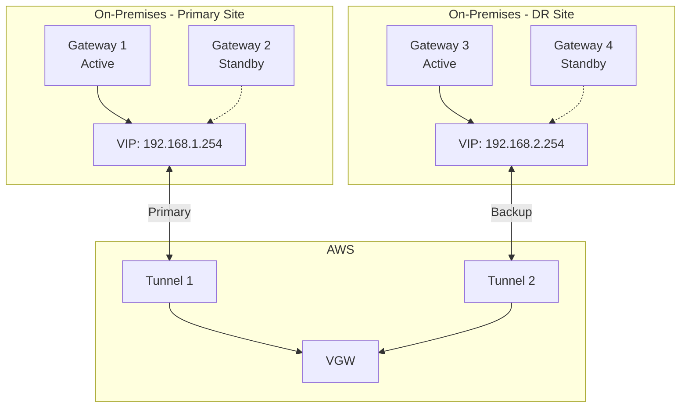

# How to Configure Private Network Connectivity Between Cloud and Bare Metal

Author: [nawazdhandala](https://www.github.com/nawazdhandala)

Tags: hybrid-cloud, vpn, ipsec, private-networking, bare-metal, cloud-connectivity, direct-connect, routing

Description: A comprehensive guide to establishing secure private network connectivity between cloud providers and on-premises bare metal infrastructure for hybrid cloud deployments.

---

## Introduction

Hybrid cloud architectures combining public cloud services with on-premises bare metal servers are increasingly common. Establishing secure, reliable, and performant network connectivity between these environments is crucial for data synchronization, service communication, and unified infrastructure management.

This guide covers various approaches to connect cloud environments with bare metal infrastructure, from VPN-based solutions to dedicated connectivity options.

## Architecture Overview



## Connectivity Options Comparison

| Option | Bandwidth | Latency | Cost | Setup Complexity | Use Case |
|--------|-----------|---------|------|------------------|----------|
| Site-to-Site VPN | Up to 1.25 Gbps | Variable | Low | Medium | Dev/Test, Light production |
| IPsec with BGP | Up to 1.25 Gbps | Variable | Low | High | Multi-site, Dynamic routing |
| AWS Direct Connect | 1-100 Gbps | Low, Consistent | High | High | Production, Compliance |
| GCP Cloud Interconnect | 10-100 Gbps | Low, Consistent | High | High | Production, High bandwidth |
| Azure ExpressRoute | 1-100 Gbps | Low, Consistent | High | High | Production, Compliance |
| WireGuard VPN | Up to 10 Gbps | Low | Low | Low | Modern alternative |
| Dedicated Line (MPLS) | Variable | Very Low | Very High | Very High | Enterprise, SLA-critical |

## Option 1: IPsec Site-to-Site VPN

### Network Planning

Before configuration, document your network topology:

```
On-Premises Network:
- LAN CIDR: 192.168.0.0/16
- Server Subnet: 192.168.1.0/24
- Gateway: 192.168.1.1
- Public IP: 203.0.113.50

AWS VPC:
- VPC CIDR: 10.0.0.0/16
- Private Subnet: 10.0.1.0/24
- Virtual Private Gateway ASN: 64512

GCP VPC:
- VPC CIDR: 10.1.0.0/16
- Private Subnet: 10.1.1.0/24
- Cloud Router ASN: 64513
```

### On-Premises Gateway Setup with strongSwan

#### Installation

```bash
# Ubuntu/Debian
sudo apt update
sudo apt install -y strongswan strongswan-pki libcharon-extra-plugins

# RHEL/CentOS
sudo dnf install -y strongswan

# Verify installation
ipsec --version
```

#### Generate Certificates (Optional but Recommended)

```bash
#!/bin/bash
# generate-ipsec-certs.sh

PKI_DIR="/etc/ipsec.d"
CA_NAME="Hybrid-Cloud-CA"
GATEWAY_NAME="onprem-gateway"
VALIDITY_DAYS=3650

# Create CA private key
ipsec pki --gen --type rsa --size 4096 --outform pem > ${PKI_DIR}/private/ca-key.pem

# Create CA certificate
ipsec pki --self --ca --lifetime ${VALIDITY_DAYS} \
    --in ${PKI_DIR}/private/ca-key.pem \
    --type rsa \
    --dn "CN=${CA_NAME}" \
    --outform pem > ${PKI_DIR}/cacerts/ca-cert.pem

# Generate gateway private key
ipsec pki --gen --type rsa --size 4096 --outform pem > ${PKI_DIR}/private/gateway-key.pem

# Generate gateway certificate
ipsec pki --pub --in ${PKI_DIR}/private/gateway-key.pem --type rsa | \
    ipsec pki --issue --lifetime ${VALIDITY_DAYS} \
    --cacert ${PKI_DIR}/cacerts/ca-cert.pem \
    --cakey ${PKI_DIR}/private/ca-key.pem \
    --dn "CN=${GATEWAY_NAME}" \
    --san ${GATEWAY_NAME} \
    --san 203.0.113.50 \
    --flag serverAuth --flag ikeIntermediate \
    --outform pem > ${PKI_DIR}/certs/gateway-cert.pem

# Set permissions
chmod 600 ${PKI_DIR}/private/*
```

#### strongSwan Configuration

```bash
# /etc/ipsec.conf

config setup
    charondebug="ike 2, knl 2, cfg 2, net 2, esp 2, dmn 2, mgr 2"
    uniqueids=yes
    strictcrlpolicy=no

# Connection to AWS VPC
conn aws-vpc
    auto=start
    type=tunnel
    authby=secret

    # Local (On-Premises) settings
    left=203.0.113.50
    leftid=203.0.113.50
    leftsubnet=192.168.0.0/16

    # Remote (AWS) settings
    right=52.1.2.3
    rightid=52.1.2.3
    rightsubnet=10.0.0.0/16

    # IKE and ESP settings
    ike=aes256-sha256-modp2048!
    esp=aes256-sha256-modp2048!
    keyexchange=ikev2
    ikelifetime=28800s
    lifetime=3600s
    dpddelay=30s
    dpdtimeout=120s
    dpdaction=restart

    # Enable NAT traversal
    forceencaps=yes

# Connection to GCP VPC
conn gcp-vpc
    auto=start
    type=tunnel
    authby=secret

    left=203.0.113.50
    leftid=203.0.113.50
    leftsubnet=192.168.0.0/16

    right=35.1.2.3
    rightid=35.1.2.3
    rightsubnet=10.1.0.0/16

    ike=aes256-sha256-modp2048!
    esp=aes256-sha256-modp2048!
    keyexchange=ikev2
    ikelifetime=28800s
    lifetime=3600s
    dpddelay=30s
    dpdtimeout=120s
    dpdaction=restart
    forceencaps=yes
```

#### IPsec Secrets Configuration

```bash
# /etc/ipsec.secrets

# Pre-shared key for AWS VPN
203.0.113.50 52.1.2.3 : PSK "your-aws-preshared-key-here"

# Pre-shared key for GCP VPN
203.0.113.50 35.1.2.3 : PSK "your-gcp-preshared-key-here"
```

#### Enable IP Forwarding

```bash
# Enable IP forwarding permanently
cat >> /etc/sysctl.conf << EOF
net.ipv4.ip_forward = 1
net.ipv4.conf.all.accept_redirects = 0
net.ipv4.conf.all.send_redirects = 0
net.ipv4.conf.default.accept_redirects = 0
net.ipv4.conf.default.send_redirects = 0
net.ipv4.conf.eth0.accept_redirects = 0
net.ipv4.conf.eth0.send_redirects = 0
EOF

# Apply settings
sudo sysctl -p

# Start strongSwan
sudo systemctl enable strongswan-starter
sudo systemctl start strongswan-starter

# Verify connection
sudo ipsec status
```

### AWS Site-to-Site VPN Setup

#### Using AWS CLI

```bash
#!/bin/bash
# setup-aws-vpn.sh

# Variables
VPC_ID="vpc-0123456789abcdef0"
REGION="us-east-1"
CUSTOMER_IP="203.0.113.50"
ON_PREM_CIDR="192.168.0.0/16"
BGP_ASN="65000"

# Create Customer Gateway
CGW_ID=$(aws ec2 create-customer-gateway \
    --type ipsec.1 \
    --public-ip ${CUSTOMER_IP} \
    --bgp-asn ${BGP_ASN} \
    --region ${REGION} \
    --query 'CustomerGateway.CustomerGatewayId' \
    --output text)

echo "Customer Gateway created: ${CGW_ID}"

# Create Virtual Private Gateway
VGW_ID=$(aws ec2 create-vpn-gateway \
    --type ipsec.1 \
    --amazon-side-asn 64512 \
    --region ${REGION} \
    --query 'VpnGateway.VpnGatewayId' \
    --output text)

echo "Virtual Private Gateway created: ${VGW_ID}"

# Attach VGW to VPC
aws ec2 attach-vpn-gateway \
    --vpn-gateway-id ${VGW_ID} \
    --vpc-id ${VPC_ID} \
    --region ${REGION}

echo "VGW attached to VPC"

# Create VPN Connection
VPN_ID=$(aws ec2 create-vpn-connection \
    --type ipsec.1 \
    --customer-gateway-id ${CGW_ID} \
    --vpn-gateway-id ${VGW_ID} \
    --options "{\"StaticRoutesOnly\":false}" \
    --region ${REGION} \
    --query 'VpnConnection.VpnConnectionId' \
    --output text)

echo "VPN Connection created: ${VPN_ID}"

# Wait for VPN to be available
aws ec2 wait vpn-connection-available \
    --vpn-connection-ids ${VPN_ID} \
    --region ${REGION}

# Get VPN configuration
aws ec2 describe-vpn-connections \
    --vpn-connection-ids ${VPN_ID} \
    --region ${REGION} \
    --query 'VpnConnections[0].CustomerGatewayConfiguration' \
    --output text > vpn-config.xml

echo "VPN configuration saved to vpn-config.xml"

# Enable route propagation
ROUTE_TABLE_ID=$(aws ec2 describe-route-tables \
    --filters "Name=vpc-id,Values=${VPC_ID}" \
    --region ${REGION} \
    --query 'RouteTables[0].RouteTableId' \
    --output text)

aws ec2 enable-vgw-route-propagation \
    --gateway-id ${VGW_ID} \
    --route-table-id ${ROUTE_TABLE_ID} \
    --region ${REGION}

echo "Route propagation enabled"
```

#### Terraform Configuration for AWS VPN

```hcl
# aws-vpn.tf

provider "aws" {
  region = "us-east-1"
}

variable "on_prem_public_ip" {
  default = "203.0.113.50"
}

variable "on_prem_cidr" {
  default = "192.168.0.0/16"
}

# Customer Gateway
resource "aws_customer_gateway" "on_prem" {
  bgp_asn    = 65000
  ip_address = var.on_prem_public_ip
  type       = "ipsec.1"

  tags = {
    Name = "on-premises-gateway"
  }
}

# Virtual Private Gateway
resource "aws_vpn_gateway" "main" {
  vpc_id          = aws_vpc.main.id
  amazon_side_asn = 64512

  tags = {
    Name = "hybrid-cloud-vgw"
  }
}

# VPN Connection
resource "aws_vpn_connection" "on_prem" {
  customer_gateway_id = aws_customer_gateway.on_prem.id
  vpn_gateway_id      = aws_vpn_gateway.main.id
  type                = "ipsec.1"
  static_routes_only  = false

  tunnel1_ike_versions                 = ["ikev2"]
  tunnel1_phase1_encryption_algorithms = ["AES256"]
  tunnel1_phase1_integrity_algorithms  = ["SHA2-256"]
  tunnel1_phase1_dh_group_numbers      = [14]
  tunnel1_phase2_encryption_algorithms = ["AES256"]
  tunnel1_phase2_integrity_algorithms  = ["SHA2-256"]
  tunnel1_phase2_dh_group_numbers      = [14]

  tunnel2_ike_versions                 = ["ikev2"]
  tunnel2_phase1_encryption_algorithms = ["AES256"]
  tunnel2_phase1_integrity_algorithms  = ["SHA2-256"]
  tunnel2_phase1_dh_group_numbers      = [14]
  tunnel2_phase2_encryption_algorithms = ["AES256"]
  tunnel2_phase2_integrity_algorithms  = ["SHA2-256"]
  tunnel2_phase2_dh_group_numbers      = [14]

  tags = {
    Name = "on-prem-vpn-connection"
  }
}

# Route propagation
resource "aws_vpn_gateway_route_propagation" "main" {
  vpn_gateway_id = aws_vpn_gateway.main.id
  route_table_id = aws_route_table.private.id
}

# Output VPN configuration
output "vpn_tunnel1_address" {
  value = aws_vpn_connection.on_prem.tunnel1_address
}

output "vpn_tunnel1_preshared_key" {
  value     = aws_vpn_connection.on_prem.tunnel1_preshared_key
  sensitive = true
}

output "vpn_tunnel2_address" {
  value = aws_vpn_connection.on_prem.tunnel2_address
}

output "vpn_tunnel2_preshared_key" {
  value     = aws_vpn_connection.on_prem.tunnel2_preshared_key
  sensitive = true
}
```

### GCP Cloud VPN Setup

#### Using gcloud CLI

```bash
#!/bin/bash
# setup-gcp-vpn.sh

PROJECT_ID="your-project-id"
REGION="us-central1"
VPC_NAME="hybrid-vpc"
GATEWAY_NAME="hybrid-vpn-gateway"
TUNNEL_NAME="on-prem-tunnel"
ROUTER_NAME="hybrid-router"
ON_PREM_IP="203.0.113.50"
ON_PREM_CIDR="192.168.0.0/16"
SHARED_SECRET="your-preshared-key"

# Set project
gcloud config set project ${PROJECT_ID}

# Create VPN Gateway
gcloud compute vpn-gateways create ${GATEWAY_NAME} \
    --network=${VPC_NAME} \
    --region=${REGION}

# Create Cloud Router for BGP
gcloud compute routers create ${ROUTER_NAME} \
    --network=${VPC_NAME} \
    --region=${REGION} \
    --asn=64513

# Create External VPN Gateway (represents on-premises)
gcloud compute external-vpn-gateways create on-prem-gateway \
    --interfaces 0=${ON_PREM_IP}

# Create VPN Tunnel
gcloud compute vpn-tunnels create ${TUNNEL_NAME} \
    --vpn-gateway=${GATEWAY_NAME} \
    --peer-external-gateway=on-prem-gateway \
    --peer-external-gateway-interface=0 \
    --shared-secret=${SHARED_SECRET} \
    --router=${ROUTER_NAME} \
    --ike-version=2 \
    --region=${REGION} \
    --interface=0

# Get VPN Gateway IP
VPN_IP=$(gcloud compute vpn-gateways describe ${GATEWAY_NAME} \
    --region=${REGION} \
    --format='get(vpnInterfaces[0].ipAddress)')

echo "GCP VPN Gateway IP: ${VPN_IP}"

# Create BGP session (optional - for dynamic routing)
gcloud compute routers add-interface ${ROUTER_NAME} \
    --interface-name=bgp-interface \
    --vpn-tunnel=${TUNNEL_NAME} \
    --ip-address=169.254.1.1 \
    --mask-length=30 \
    --region=${REGION}

gcloud compute routers add-bgp-peer ${ROUTER_NAME} \
    --peer-name=on-prem-peer \
    --peer-ip-address=169.254.1.2 \
    --peer-asn=65000 \
    --interface=bgp-interface \
    --region=${REGION}

# For static routing (alternative to BGP)
gcloud compute routes create on-prem-route \
    --network=${VPC_NAME} \
    --destination-range=${ON_PREM_CIDR} \
    --next-hop-vpn-tunnel=${TUNNEL_NAME} \
    --next-hop-vpn-tunnel-region=${REGION}
```

#### Terraform Configuration for GCP VPN

```hcl
# gcp-vpn.tf

provider "google" {
  project = "your-project-id"
  region  = "us-central1"
}

variable "on_prem_public_ip" {
  default = "203.0.113.50"
}

variable "on_prem_cidr" {
  default = "192.168.0.0/16"
}

variable "shared_secret" {
  sensitive = true
}

# HA VPN Gateway
resource "google_compute_ha_vpn_gateway" "gateway" {
  name    = "hybrid-vpn-gateway"
  network = google_compute_network.vpc.id
  region  = "us-central1"
}

# Cloud Router
resource "google_compute_router" "router" {
  name    = "hybrid-router"
  network = google_compute_network.vpc.name
  region  = "us-central1"

  bgp {
    asn = 64513
  }
}

# External VPN Gateway (on-premises)
resource "google_compute_external_vpn_gateway" "on_prem" {
  name            = "on-prem-gateway"
  redundancy_type = "SINGLE_IP_INTERNALLY_REDUNDANT"

  interface {
    id         = 0
    ip_address = var.on_prem_public_ip
  }
}

# VPN Tunnel
resource "google_compute_vpn_tunnel" "tunnel" {
  name                            = "on-prem-tunnel"
  region                          = "us-central1"
  vpn_gateway                     = google_compute_ha_vpn_gateway.gateway.id
  peer_external_gateway           = google_compute_external_vpn_gateway.on_prem.id
  peer_external_gateway_interface = 0
  shared_secret                   = var.shared_secret
  router                          = google_compute_router.router.id
  vpn_gateway_interface           = 0
  ike_version                     = 2
}

# Router Interface
resource "google_compute_router_interface" "interface" {
  name       = "bgp-interface"
  router     = google_compute_router.router.name
  region     = "us-central1"
  ip_range   = "169.254.1.1/30"
  vpn_tunnel = google_compute_vpn_tunnel.tunnel.name
}

# BGP Peer
resource "google_compute_router_peer" "peer" {
  name                      = "on-prem-peer"
  router                    = google_compute_router.router.name
  region                    = "us-central1"
  peer_ip_address           = "169.254.1.2"
  peer_asn                  = 65000
  advertised_route_priority = 100
  interface                 = google_compute_router_interface.interface.name
}

output "vpn_gateway_ip" {
  value = google_compute_ha_vpn_gateway.gateway.vpn_interfaces[0].ip_address
}
```

## Option 2: Direct Connect / Dedicated Interconnect

For production workloads requiring consistent low latency and high bandwidth, dedicated connectivity is recommended.



### AWS Direct Connect Setup

```bash
#!/bin/bash
# setup-direct-connect.sh

# Create Direct Connect Gateway
DXGW_ID=$(aws directconnect create-direct-connect-gateway \
    --direct-connect-gateway-name "hybrid-dxgw" \
    --amazon-side-asn 64512 \
    --query 'directConnectGateway.directConnectGatewayId' \
    --output text)

echo "Direct Connect Gateway: ${DXGW_ID}"

# Create Virtual Interface (requires connection ID from AWS)
# CONNECTION_ID is provided by AWS when you order the connection
CONNECTION_ID="dxcon-xxxx"

aws directconnect create-private-virtual-interface \
    --connection-id ${CONNECTION_ID} \
    --new-private-virtual-interface '{
        "virtualInterfaceName": "on-prem-vif",
        "vlan": 100,
        "asn": 65000,
        "authKey": "your-bgp-auth-key",
        "amazonAddress": "169.254.100.1/30",
        "customerAddress": "169.254.100.2/30",
        "directConnectGatewayId": "'${DXGW_ID}'"
    }'

# Associate DX Gateway with VPC
aws directconnect create-direct-connect-gateway-association \
    --direct-connect-gateway-id ${DXGW_ID} \
    --gateway-id ${VGW_ID} \
    --add-allowed-prefixes-to-direct-connect-gateway "[{\"cidr\":\"10.0.0.0/16\"}]"
```

### GCP Cloud Interconnect Setup

```bash
#!/bin/bash
# setup-cloud-interconnect.sh

PROJECT_ID="your-project-id"
REGION="us-central1"
ROUTER_NAME="interconnect-router"
ATTACHMENT_NAME="on-prem-attachment"

# Create Cloud Router
gcloud compute routers create ${ROUTER_NAME} \
    --network=hybrid-vpc \
    --region=${REGION} \
    --asn=64513 \
    --project=${PROJECT_ID}

# Create VLAN Attachment (Partner Interconnect)
gcloud compute interconnects attachments partner create ${ATTACHMENT_NAME} \
    --router=${ROUTER_NAME} \
    --region=${REGION} \
    --edge-availability-domain=availability-domain-1 \
    --project=${PROJECT_ID}

# Get pairing key (share with partner)
gcloud compute interconnects attachments describe ${ATTACHMENT_NAME} \
    --region=${REGION} \
    --project=${PROJECT_ID} \
    --format='get(pairingKey)'
```

## Option 3: WireGuard VPN (Modern Alternative)

For a simpler, high-performance VPN solution, WireGuard is an excellent choice.

### On-Premises WireGuard Gateway

```bash
# /etc/wireguard/wg0.conf

[Interface]
PrivateKey = <ON_PREM_PRIVATE_KEY>
Address = 10.99.0.1/24
ListenPort = 51820
MTU = 1420

# Enable forwarding
PostUp = sysctl -w net.ipv4.ip_forward=1
PostUp = iptables -A FORWARD -i wg0 -j ACCEPT
PostUp = iptables -A FORWARD -o wg0 -j ACCEPT
PostUp = iptables -t nat -A POSTROUTING -o eth0 -j MASQUERADE

PostDown = iptables -D FORWARD -i wg0 -j ACCEPT
PostDown = iptables -D FORWARD -o wg0 -j ACCEPT
PostDown = iptables -t nat -D POSTROUTING -o eth0 -j MASQUERADE

# AWS VPN Gateway
[Peer]
PublicKey = <AWS_GATEWAY_PUBLIC_KEY>
Endpoint = 18.1.2.3:51820
AllowedIPs = 10.99.0.2/32, 10.0.0.0/16
PersistentKeepalive = 25

# GCP VPN Gateway
[Peer]
PublicKey = <GCP_GATEWAY_PUBLIC_KEY>
Endpoint = 35.1.2.3:51820
AllowedIPs = 10.99.0.3/32, 10.1.0.0/16
PersistentKeepalive = 25
```

### AWS EC2 WireGuard Gateway

Deploy a WireGuard gateway in AWS using EC2:

```yaml
# wireguard-gateway-cloudformation.yaml
AWSTemplateFormatVersion: '2010-09-09'
Description: WireGuard VPN Gateway

Parameters:
  VpcId:
    Type: AWS::EC2::VPC::Id
  SubnetId:
    Type: AWS::EC2::Subnet::Id
  KeyName:
    Type: AWS::EC2::KeyPair::KeyName
  OnPremPublicKey:
    Type: String
    NoEcho: true

Resources:
  WireGuardSecurityGroup:
    Type: AWS::EC2::SecurityGroup
    Properties:
      GroupDescription: WireGuard VPN Gateway
      VpcId: !Ref VpcId
      SecurityGroupIngress:
        - IpProtocol: udp
          FromPort: 51820
          ToPort: 51820
          CidrIp: 0.0.0.0/0
        - IpProtocol: tcp
          FromPort: 22
          ToPort: 22
          CidrIp: 10.0.0.0/8

  WireGuardInstance:
    Type: AWS::EC2::Instance
    Properties:
      ImageId: ami-0c55b159cbfafe1f0  # Amazon Linux 2
      InstanceType: t3.small
      KeyName: !Ref KeyName
      SubnetId: !Ref SubnetId
      SecurityGroupIds:
        - !Ref WireGuardSecurityGroup
      SourceDestCheck: false
      UserData:
        Fn::Base64: !Sub |
          #!/bin/bash
          yum update -y
          amazon-linux-extras install epel -y
          yum install -y wireguard-tools

          # Generate keys
          wg genkey | tee /etc/wireguard/private.key | wg pubkey > /etc/wireguard/public.key
          chmod 600 /etc/wireguard/private.key

          PRIVATE_KEY=$(cat /etc/wireguard/private.key)

          # Create configuration
          cat > /etc/wireguard/wg0.conf << EOF
          [Interface]
          PrivateKey = $PRIVATE_KEY
          Address = 10.99.0.2/24
          ListenPort = 51820

          PostUp = sysctl -w net.ipv4.ip_forward=1
          PostUp = iptables -t nat -A POSTROUTING -o eth0 -j MASQUERADE
          PostDown = iptables -t nat -D POSTROUTING -o eth0 -j MASQUERADE

          [Peer]
          PublicKey = ${OnPremPublicKey}
          AllowedIPs = 10.99.0.1/32, 192.168.0.0/16
          PersistentKeepalive = 25
          EOF

          systemctl enable wg-quick@wg0
          systemctl start wg-quick@wg0
      Tags:
        - Key: Name
          Value: wireguard-gateway

  WireGuardEIP:
    Type: AWS::EC2::EIP
    Properties:
      InstanceId: !Ref WireGuardInstance

Outputs:
  PublicIP:
    Value: !Ref WireGuardEIP
  PublicKey:
    Value: "Retrieve from instance: cat /etc/wireguard/public.key"
```

## Routing Configuration

### BGP Configuration with BIRD

For dynamic routing between on-premises and cloud:

```bash
# /etc/bird/bird.conf

log syslog all;
router id 192.168.1.1;

protocol device {
    scan time 10;
}

protocol direct {
    ipv4;
    interface "eth0", "wg0";
}

protocol kernel {
    ipv4 {
        export all;
        import all;
    };
}

# Static routes for local networks
protocol static {
    ipv4;
    route 192.168.0.0/16 via "eth0";
}

# BGP to AWS
protocol bgp aws_vpn {
    local 169.254.100.2 as 65000;
    neighbor 169.254.100.1 as 64512;

    ipv4 {
        import filter {
            if net ~ [10.0.0.0/16+] then accept;
            reject;
        };
        export filter {
            if net ~ [192.168.0.0/16+] then accept;
            reject;
        };
    };
}

# BGP to GCP
protocol bgp gcp_vpn {
    local 169.254.1.2 as 65000;
    neighbor 169.254.1.1 as 64513;

    ipv4 {
        import filter {
            if net ~ [10.1.0.0/16+] then accept;
            reject;
        };
        export filter {
            if net ~ [192.168.0.0/16+] then accept;
            reject;
        };
    };
}
```

### Static Routing Setup

If not using BGP, configure static routes on all endpoints:

```bash
#!/bin/bash
# setup-static-routes.sh

# On-premises gateway - routes to cloud networks
ip route add 10.0.0.0/16 dev ipsec0   # AWS via IPsec tunnel
ip route add 10.1.0.0/16 dev ipsec1   # GCP via IPsec tunnel

# Make persistent (Ubuntu/Debian with Netplan)
cat > /etc/netplan/99-hybrid-routes.yaml << EOF
network:
  version: 2
  ethernets:
    eth0:
      routes:
        - to: 10.0.0.0/16
          via: 169.254.100.1
          metric: 100
        - to: 10.1.0.0/16
          via: 169.254.1.1
          metric: 100
EOF

netplan apply
```

## Firewall Configuration

### On-Premises Firewall Rules

```bash
#!/bin/bash
# hybrid-firewall.sh

# Allow IPsec traffic
iptables -A INPUT -p udp --dport 500 -j ACCEPT   # IKE
iptables -A INPUT -p udp --dport 4500 -j ACCEPT  # NAT-T
iptables -A INPUT -p esp -j ACCEPT                # ESP
iptables -A INPUT -p ah -j ACCEPT                 # AH (if used)

# Allow WireGuard
iptables -A INPUT -p udp --dport 51820 -j ACCEPT

# Allow traffic from cloud networks
iptables -A INPUT -s 10.0.0.0/16 -j ACCEPT  # AWS
iptables -A INPUT -s 10.1.0.0/16 -j ACCEPT  # GCP

# Allow forwarding
iptables -A FORWARD -s 192.168.0.0/16 -d 10.0.0.0/8 -j ACCEPT
iptables -A FORWARD -s 10.0.0.0/8 -d 192.168.0.0/16 -j ACCEPT

# NAT for outbound traffic (if needed)
iptables -t nat -A POSTROUTING -o eth0 -s 10.0.0.0/8 -j MASQUERADE

# Save rules
iptables-save > /etc/iptables/rules.v4
```

### AWS Security Groups

```hcl
# security-groups.tf

resource "aws_security_group" "hybrid_access" {
  name        = "hybrid-network-access"
  description = "Allow traffic from on-premises and other clouds"
  vpc_id      = aws_vpc.main.id

  # Allow all traffic from on-premises
  ingress {
    from_port   = 0
    to_port     = 0
    protocol    = "-1"
    cidr_blocks = ["192.168.0.0/16"]
    description = "On-premises network"
  }

  # Allow all traffic from GCP
  ingress {
    from_port   = 0
    to_port     = 0
    protocol    = "-1"
    cidr_blocks = ["10.1.0.0/16"]
    description = "GCP VPC"
  }

  egress {
    from_port   = 0
    to_port     = 0
    protocol    = "-1"
    cidr_blocks = ["0.0.0.0/0"]
  }

  tags = {
    Name = "hybrid-network-access"
  }
}
```

### GCP Firewall Rules

```hcl
# gcp-firewall.tf

resource "google_compute_firewall" "hybrid_ingress" {
  name    = "hybrid-network-ingress"
  network = google_compute_network.vpc.name

  allow {
    protocol = "icmp"
  }

  allow {
    protocol = "tcp"
    ports    = ["0-65535"]
  }

  allow {
    protocol = "udp"
    ports    = ["0-65535"]
  }

  source_ranges = [
    "192.168.0.0/16",  # On-premises
    "10.0.0.0/16"      # AWS VPC
  ]
}
```

## Monitoring and Troubleshooting

### Connection Health Check Script

```bash
#!/bin/bash
# check-hybrid-connectivity.sh

echo "=== Hybrid Network Connectivity Check ==="
echo "Date: $(date)"
echo ""

# Check IPsec tunnels
echo "--- IPsec Status ---"
ipsec status | grep -E "(ESTABLISHED|CONNECTING)"

# Check WireGuard
echo ""
echo "--- WireGuard Status ---"
wg show all | grep -E "(peer|latest handshake|transfer)"

# Ping tests
echo ""
echo "--- Connectivity Tests ---"

TARGETS=(
    "10.0.1.10:AWS-Instance"
    "10.1.1.10:GCP-Instance"
    "192.168.1.10:On-Prem-Server"
)

for target in "${TARGETS[@]}"; do
    IP=$(echo $target | cut -d: -f1)
    NAME=$(echo $target | cut -d: -f2)

    if ping -c 2 -W 2 $IP > /dev/null 2>&1; then
        echo "$NAME ($IP): OK"
    else
        echo "$NAME ($IP): FAILED"
    fi
done

# Check routing
echo ""
echo "--- Route Table ---"
ip route | grep -E "10\.(0|1)\.|192\.168\."

# Check BGP (if using BIRD)
if command -v birdc &> /dev/null; then
    echo ""
    echo "--- BGP Status ---"
    birdc show protocols | grep -E "BGP|aws|gcp"
fi
```

### Monitoring with Prometheus

```yaml
# prometheus-hybrid-monitoring.yaml
apiVersion: v1
kind: ConfigMap
metadata:
  name: prometheus-config
data:
  prometheus.yml: |
    global:
      scrape_interval: 15s

    scrape_configs:
      - job_name: 'ipsec-exporter'
        static_configs:
          - targets: ['localhost:9903']

      - job_name: 'wireguard-exporter'
        static_configs:
          - targets: ['localhost:9586']

      - job_name: 'blackbox-network'
        metrics_path: /probe
        params:
          module: [icmp]
        static_configs:
          - targets:
            - 10.0.1.10   # AWS
            - 10.1.1.10   # GCP
            - 192.168.1.10 # On-prem
        relabel_configs:
          - source_labels: [__address__]
            target_label: __param_target
          - source_labels: [__param_target]
            target_label: instance
          - target_label: __address__
            replacement: localhost:9115
```

### Troubleshooting Flow



### Debug Commands Reference

```bash
# IPsec debugging
ipsec statusall                    # Detailed status
ipsec status                       # Brief status
journalctl -u strongswan -f        # Live logs
ipsec restart                      # Restart service

# WireGuard debugging
wg show                            # Interface status
wg showconf wg0                    # Current config
journalctl -u wg-quick@wg0 -f     # Live logs

# Network debugging
tcpdump -i eth0 port 500 or port 4500  # IPsec traffic
tcpdump -i wg0 -n                       # WireGuard traffic
mtr -r 10.0.1.10                        # Path analysis

# BGP debugging (BIRD)
birdc show protocols all           # All protocols
birdc show route                   # Routing table
birdc show route export aws_vpn    # Routes to AWS
```

## High Availability Architecture



### Keepalived for Gateway HA

```bash
# /etc/keepalived/keepalived.conf

global_defs {
    router_id HYBRID_GW
}

vrrp_script check_vpn {
    script "/usr/local/bin/check-vpn-health.sh"
    interval 5
    weight 2
}

vrrp_instance VI_HYBRID {
    state MASTER
    interface eth0
    virtual_router_id 51
    priority 101
    advert_int 1

    authentication {
        auth_type PASS
        auth_pass hybrid_ha
    }

    virtual_ipaddress {
        192.168.1.254/24
    }

    track_script {
        check_vpn
    }

    notify_master "/usr/local/bin/vpn-master.sh"
    notify_backup "/usr/local/bin/vpn-backup.sh"
}
```

```bash
#!/bin/bash
# /usr/local/bin/check-vpn-health.sh

# Check if any VPN tunnel is up
if ipsec status | grep -q "ESTABLISHED"; then
    exit 0
fi

if wg show wg0 2>/dev/null | grep -q "latest handshake"; then
    LAST_HS=$(wg show wg0 latest-handshakes | awk '{print $2}')
    NOW=$(date +%s)
    if [ $((NOW - LAST_HS)) -lt 180 ]; then
        exit 0
    fi
fi

exit 1
```

## Security Best Practices

1. **Use Strong Encryption**
   - IKEv2 with AES-256 and SHA-256
   - WireGuard uses ChaCha20-Poly1305 by default

2. **Rotate Keys Regularly**
   - IPsec: Rotate pre-shared keys quarterly
   - WireGuard: Rotate keys when personnel changes

3. **Implement Network Segmentation**
   - Use separate VPNs for different security zones
   - Apply firewall rules at both ends

4. **Monitor and Alert**
   - Set up alerts for tunnel failures
   - Monitor bandwidth utilization
   - Track unusual traffic patterns

5. **Document Everything**
   - Maintain network diagrams
   - Document IP allocations
   - Keep runbooks updated

## Conclusion

Establishing private network connectivity between cloud and bare metal infrastructure requires careful planning and implementation. The right solution depends on your specific requirements:

- **VPN (IPsec/WireGuard)**: Cost-effective for moderate bandwidth needs
- **Direct Connect/Interconnect**: Best for production workloads requiring consistent performance
- **Hybrid Approach**: Combine dedicated links for production with VPN for backup

Key takeaways:
- Plan IP addressing carefully to avoid conflicts
- Implement redundancy for production workloads
- Use BGP for dynamic routing in complex environments
- Monitor tunnel health continuously
- Document and test failover procedures regularly

For most organizations starting with hybrid cloud, begin with VPN-based connectivity and migrate to dedicated links as traffic grows and requirements solidify.
