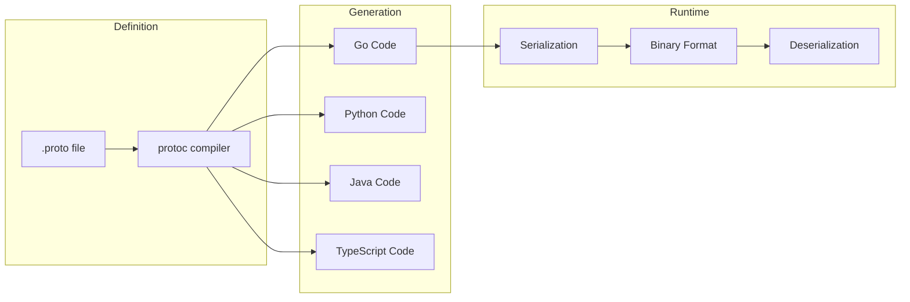
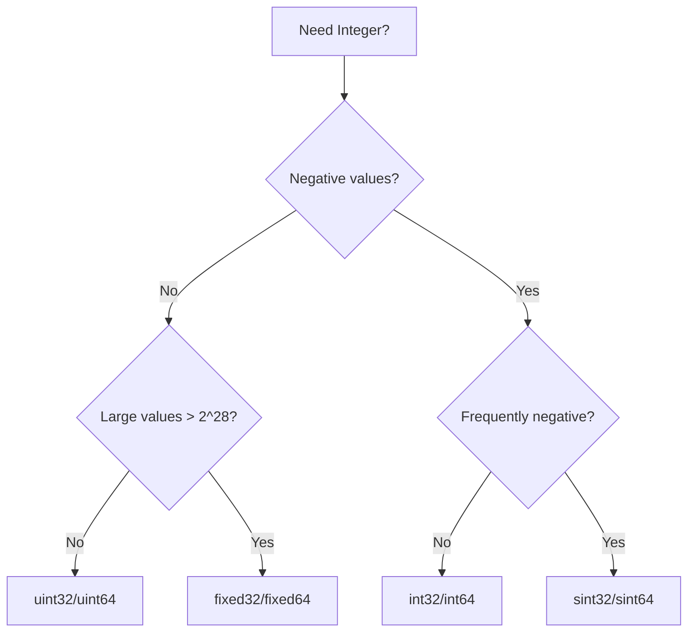
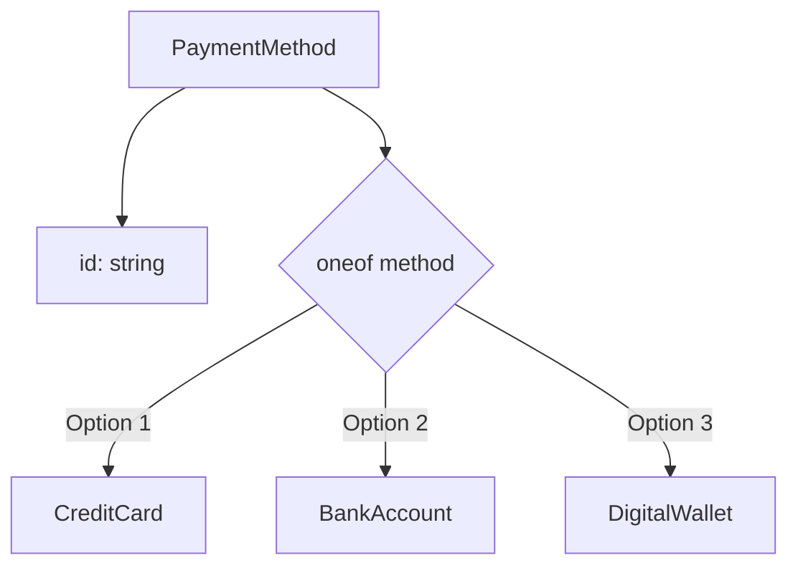
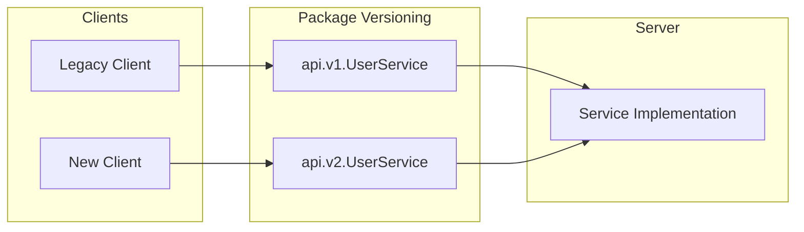

# How to Define Protocol Buffers (Protobuf) for gRPC Services

Author: [nawazdhandala](https://www.github.com/nawazdhandala)

Tags: Protocol Buffers, Protobuf, gRPC, API Design, Serialization, Schema, Tutorial

Description: Master Protocol Buffers syntax and best practices for defining efficient, maintainable gRPC service contracts.

---

## Introduction

Protocol Buffers (Protobuf) is Google's language-neutral, platform-neutral, extensible mechanism for serializing structured data. It serves as both the interface definition language (IDL) and the message interchange format for gRPC services.

In this guide, you will learn how to write effective Protocol Buffer definitions, understand all the available data types, and apply best practices for maintainable API schemas.

## Protocol Buffers Overview



## Basic Syntax

### Proto File Structure

Every `.proto` file starts with essential declarations:

```protobuf
// Specify the syntax version (proto3 is recommended)
syntax = "proto3";

// Package declaration to avoid name collisions
package mycompany.myproject.v1;

// Language-specific options
option go_package = "github.com/mycompany/myproject/gen/go/v1";
option java_package = "com.mycompany.myproject.v1";
option java_multiple_files = true;

// Import other proto files
import "google/protobuf/timestamp.proto";
import "google/protobuf/empty.proto";

// Your messages and services go here
```

## Scalar Types

Protocol Buffers supports a variety of scalar types:

### Numeric Types

```protobuf
message NumericTypes {
  // Signed integers
  int32 small_int = 1;       // -2^31 to 2^31-1
  int64 large_int = 2;       // -2^63 to 2^63-1

  // Unsigned integers
  uint32 positive_int = 3;   // 0 to 2^32-1
  uint64 big_positive = 4;   // 0 to 2^64-1

  // Signed integers (efficient for negative numbers)
  sint32 signed_small = 5;   // Uses ZigZag encoding
  sint64 signed_large = 6;   // Uses ZigZag encoding

  // Fixed-size integers (efficient for large values)
  fixed32 fixed_small = 7;   // Always 4 bytes
  fixed64 fixed_large = 8;   // Always 8 bytes
  sfixed32 sfixed_small = 9; // Signed, always 4 bytes
  sfixed64 sfixed_large = 10; // Signed, always 8 bytes

  // Floating point
  float decimal = 11;        // 32-bit IEEE 754
  double precise = 12;       // 64-bit IEEE 754
}
```

### Choosing the Right Integer Type



### String and Bytes

```protobuf
message TextTypes {
  string name = 1;           // UTF-8 encoded string
  bytes data = 2;            // Arbitrary byte sequence
}
```

### Boolean

```protobuf
message BooleanType {
  bool is_active = 1;        // true or false
}
```

## Message Types

### Basic Messages

```protobuf
message User {
  int64 id = 1;
  string username = 2;
  string email = 3;
  bool is_verified = 4;
}

message Address {
  string street = 1;
  string city = 2;
  string state = 3;
  string zip_code = 4;
  string country = 5;
}
```

### Nested Messages

```protobuf
message Order {
  int64 id = 1;
  int64 user_id = 2;

  // Nested message definition
  message LineItem {
    int64 product_id = 1;
    int32 quantity = 2;
    int64 price_cents = 3;
  }

  repeated LineItem items = 3;
  int64 total_cents = 4;

  // Nested address
  message ShippingInfo {
    string recipient_name = 1;
    Address address = 2;  // Reference to top-level Address
  }

  ShippingInfo shipping = 5;
}

// Using nested message from outside
message OrderSummary {
  int64 order_id = 1;
  repeated Order.LineItem top_items = 2;  // Reference nested type
}
```

## Field Rules

### Singular Fields (Default in Proto3)

```protobuf
message Profile {
  string name = 1;      // Zero or one value
  int32 age = 2;        // Default value is 0 if not set
}
```

### Repeated Fields (Lists/Arrays)

```protobuf
message Playlist {
  string name = 1;
  repeated string song_ids = 2;      // List of strings
  repeated int32 durations = 3;      // List of integers
  repeated Song songs = 4;           // List of messages
}

message Song {
  string id = 1;
  string title = 2;
  string artist = 3;
}
```

### Optional Fields (Explicit Presence)

```protobuf
message SearchRequest {
  string query = 1;
  optional int32 page_size = 2;      // Can distinguish between 0 and not set
  optional string cursor = 3;         // Can check if explicitly set
}
```

## Enumerations

### Basic Enum

```protobuf
enum Status {
  STATUS_UNSPECIFIED = 0;  // Required: first value must be 0
  STATUS_PENDING = 1;
  STATUS_ACTIVE = 2;
  STATUS_SUSPENDED = 3;
  STATUS_DELETED = 4;
}

message Account {
  int64 id = 1;
  string name = 2;
  Status status = 3;
}
```

### Enum Best Practices

```protobuf
// Use a prefix to avoid naming collisions
enum OrderStatus {
  ORDER_STATUS_UNSPECIFIED = 0;
  ORDER_STATUS_CREATED = 1;
  ORDER_STATUS_PAID = 2;
  ORDER_STATUS_SHIPPED = 3;
  ORDER_STATUS_DELIVERED = 4;
  ORDER_STATUS_CANCELLED = 5;
}

// Allow aliases when needed
enum Priority {
  option allow_alias = true;
  PRIORITY_UNSPECIFIED = 0;
  PRIORITY_LOW = 1;
  PRIORITY_NORMAL = 2;
  PRIORITY_MEDIUM = 2;  // Alias for NORMAL
  PRIORITY_HIGH = 3;
  PRIORITY_CRITICAL = 4;
  PRIORITY_URGENT = 4;  // Alias for CRITICAL
}
```

### Nested Enums

```protobuf
message Task {
  int64 id = 1;
  string title = 2;

  enum Priority {
    PRIORITY_UNSPECIFIED = 0;
    PRIORITY_LOW = 1;
    PRIORITY_MEDIUM = 2;
    PRIORITY_HIGH = 3;
  }

  Priority priority = 3;

  enum Status {
    STATUS_UNSPECIFIED = 0;
    STATUS_TODO = 1;
    STATUS_IN_PROGRESS = 2;
    STATUS_DONE = 3;
  }

  Status status = 4;
}
```

## Oneof Fields

Use `oneof` when only one of several fields should be set:

```protobuf
message PaymentMethod {
  string id = 1;

  oneof method {
    CreditCard credit_card = 2;
    BankAccount bank_account = 3;
    DigitalWallet digital_wallet = 4;
  }
}

message CreditCard {
  string card_number = 1;
  string expiry_month = 2;
  string expiry_year = 3;
  string cvv = 4;
}

message BankAccount {
  string routing_number = 1;
  string account_number = 2;
  string account_type = 3;
}

message DigitalWallet {
  string provider = 1;  // e.g., "paypal", "applepay"
  string token = 2;
}
```

### Oneof Visualization



### Advanced Oneof Example

```protobuf
message SearchFilter {
  oneof filter {
    TextFilter text = 1;
    RangeFilter range = 2;
    ListFilter list = 3;
    BoolFilter bool = 4;
  }
}

message TextFilter {
  string field = 1;
  string value = 2;

  enum MatchType {
    MATCH_TYPE_UNSPECIFIED = 0;
    MATCH_TYPE_EXACT = 1;
    MATCH_TYPE_PREFIX = 2;
    MATCH_TYPE_CONTAINS = 3;
    MATCH_TYPE_REGEX = 4;
  }

  MatchType match_type = 3;
}

message RangeFilter {
  string field = 1;
  optional double min = 2;
  optional double max = 3;
}

message ListFilter {
  string field = 1;
  repeated string values = 2;
  bool include = 3;  // true = IN, false = NOT IN
}

message BoolFilter {
  string field = 1;
  bool value = 2;
}
```

## Maps

Maps provide key-value pair storage:

```protobuf
message UserPreferences {
  int64 user_id = 1;

  // String to string map
  map<string, string> settings = 2;

  // String to message map
  map<string, NotificationConfig> notifications = 3;

  // Integer to string map
  map<int32, string> shortcuts = 4;
}

message NotificationConfig {
  bool enabled = 1;
  string channel = 2;  // "email", "sms", "push"
  string frequency = 3; // "instant", "daily", "weekly"
}
```

### Map Constraints

- Keys can be any integral or string type (not float, double, or bytes)
- Values can be any type except another map
- Map fields cannot be repeated

```protobuf
// Valid map key types
map<int32, string> int_to_string = 1;
map<int64, bytes> long_to_bytes = 2;
map<uint32, MyMessage> uint_to_message = 3;
map<string, double> string_to_double = 4;
map<bool, string> bool_to_string = 5;

// Invalid - will not compile
// map<float, string> invalid1 = 6;
// map<bytes, string> invalid2 = 7;
// map<MyMessage, string> invalid3 = 8;
// repeated map<string, string> invalid4 = 9;
```

## Well-Known Types

Google provides standard message types for common use cases:

```protobuf
import "google/protobuf/timestamp.proto";
import "google/protobuf/duration.proto";
import "google/protobuf/empty.proto";
import "google/protobuf/wrappers.proto";
import "google/protobuf/any.proto";
import "google/protobuf/struct.proto";

message Event {
  string id = 1;
  string name = 2;

  // Timestamp for date/time
  google.protobuf.Timestamp created_at = 3;
  google.protobuf.Timestamp updated_at = 4;

  // Duration for time spans
  google.protobuf.Duration ttl = 5;

  // Wrappers for nullable primitives
  google.protobuf.Int32Value priority = 6;
  google.protobuf.StringValue description = 7;
  google.protobuf.BoolValue is_public = 8;

  // Any for dynamic typing
  google.protobuf.Any payload = 9;

  // Struct for JSON-like dynamic data
  google.protobuf.Struct metadata = 10;
}

// Service using Empty for no-op responses
service EventService {
  rpc DeleteEvent(DeleteEventRequest) returns (google.protobuf.Empty);
  rpc Ping(google.protobuf.Empty) returns (google.protobuf.Empty);
}
```

## Packages and Imports

### Package Organization

```protobuf
// api/v1/user.proto
syntax = "proto3";

package mycompany.api.v1;

option go_package = "github.com/mycompany/api/gen/go/v1";

message User {
  int64 id = 1;
  string name = 2;
}
```

```protobuf
// api/v1/order.proto
syntax = "proto3";

package mycompany.api.v1;

option go_package = "github.com/mycompany/api/gen/go/v1";

import "api/v1/user.proto";

message Order {
  int64 id = 1;
  User customer = 2;  // Same package, no prefix needed
}
```

### Cross-Package Imports

```protobuf
// common/types.proto
syntax = "proto3";

package mycompany.common;

message Money {
  string currency_code = 1;
  int64 units = 2;
  int32 nanos = 3;
}

message Pagination {
  int32 page_size = 1;
  string page_token = 2;
}
```

```protobuf
// api/v1/product.proto
syntax = "proto3";

package mycompany.api.v1;

import "common/types.proto";

message Product {
  int64 id = 1;
  string name = 2;
  mycompany.common.Money price = 3;  // Full package path
}

message ListProductsRequest {
  mycompany.common.Pagination pagination = 1;
  string category = 2;
}
```

## Service Definitions

### Complete Service Example

```protobuf
syntax = "proto3";

package mycompany.api.v1;

import "google/protobuf/empty.proto";
import "google/protobuf/field_mask.proto";

// User service definition
service UserService {
  // Create a new user
  rpc CreateUser(CreateUserRequest) returns (User);

  // Get a user by ID
  rpc GetUser(GetUserRequest) returns (User);

  // List users with pagination
  rpc ListUsers(ListUsersRequest) returns (ListUsersResponse);

  // Update a user (partial update with field mask)
  rpc UpdateUser(UpdateUserRequest) returns (User);

  // Delete a user
  rpc DeleteUser(DeleteUserRequest) returns (google.protobuf.Empty);

  // Stream user updates
  rpc WatchUsers(WatchUsersRequest) returns (stream UserEvent);

  // Bulk create users
  rpc BulkCreateUsers(stream CreateUserRequest) returns (BulkCreateUsersResponse);
}

message User {
  int64 id = 1;
  string email = 2;
  string display_name = 3;
  string avatar_url = 4;
  google.protobuf.Timestamp created_at = 5;
  google.protobuf.Timestamp updated_at = 6;
}

message CreateUserRequest {
  string email = 1;
  string display_name = 2;
  string password = 3;
}

message GetUserRequest {
  int64 id = 1;
}

message ListUsersRequest {
  int32 page_size = 1;
  string page_token = 2;
  string filter = 3;  // e.g., "status=active"
  string order_by = 4; // e.g., "created_at desc"
}

message ListUsersResponse {
  repeated User users = 1;
  string next_page_token = 2;
  int32 total_count = 3;
}

message UpdateUserRequest {
  User user = 1;
  google.protobuf.FieldMask update_mask = 2;
}

message DeleteUserRequest {
  int64 id = 1;
}

message WatchUsersRequest {
  repeated int64 user_ids = 1;  // Empty = watch all
}

message UserEvent {
  enum EventType {
    EVENT_TYPE_UNSPECIFIED = 0;
    EVENT_TYPE_CREATED = 1;
    EVENT_TYPE_UPDATED = 2;
    EVENT_TYPE_DELETED = 3;
  }

  EventType event_type = 1;
  User user = 2;
  google.protobuf.Timestamp occurred_at = 3;
}

message BulkCreateUsersResponse {
  int32 created_count = 1;
  int32 failed_count = 2;
  repeated string errors = 3;
}
```

## Field Numbers and Reserved Fields

### Field Number Guidelines

```protobuf
message Example {
  // Field numbers 1-15 use 1 byte (use for frequently used fields)
  string id = 1;
  string name = 2;
  int32 status = 3;

  // Field numbers 16-2047 use 2 bytes
  string description = 16;
  repeated string tags = 17;

  // Field numbers 2048-262143 use 3 bytes
  // Reserve these for rarely used fields

  // Reserved ranges (19000-19999 are reserved by protobuf)
}
```

### Reserved Fields for Backward Compatibility

```protobuf
message Account {
  reserved 2, 15, 9 to 11;
  reserved "old_email", "legacy_status";

  int64 id = 1;
  // Field 2 was 'email' - removed
  string username = 3;
  string new_email = 4;
  // Fields 9-11 were old address fields - removed
  // Field 15 was 'legacy_status' - removed
}
```

## Best Practices

### Naming Conventions

```protobuf
// Messages: PascalCase
message UserAccount {}
message ShippingAddress {}

// Fields: snake_case
message User {
  string user_name = 1;
  string email_address = 2;
  int64 created_at_unix = 3;
}

// Enums: SCREAMING_SNAKE_CASE with prefix
enum UserStatus {
  USER_STATUS_UNSPECIFIED = 0;
  USER_STATUS_ACTIVE = 1;
  USER_STATUS_INACTIVE = 2;
}

// Services: PascalCase with Service suffix
service UserService {}
service OrderManagementService {}

// RPC Methods: PascalCase
service UserService {
  rpc CreateUser(CreateUserRequest) returns (User);
  rpc GetUserById(GetUserByIdRequest) returns (User);
}
```

### API Design Patterns

```protobuf
// Use request/response wrappers
message GetUserRequest {
  int64 user_id = 1;
}

// Don't return bare primitives
// Bad: rpc GetUserCount() returns (int32);
// Good:
message GetUserCountResponse {
  int32 count = 1;
}

// Include pagination in list responses
message ListUsersResponse {
  repeated User users = 1;
  string next_page_token = 2;
  int32 total_count = 3;
}

// Use field masks for partial updates
message UpdateUserRequest {
  User user = 1;
  google.protobuf.FieldMask update_mask = 2;
}
```

### Versioning Strategy



```protobuf
// api/v1/user.proto
syntax = "proto3";
package mycompany.api.v1;

service UserService {
  rpc GetUser(GetUserRequest) returns (User);
}

// api/v2/user.proto
syntax = "proto3";
package mycompany.api.v2;

import "api/v1/user.proto";

service UserService {
  // New version with enhanced response
  rpc GetUser(GetUserRequest) returns (UserWithMetadata);

  // Deprecated method from v1
  rpc GetUserLegacy(mycompany.api.v1.GetUserRequest)
    returns (mycompany.api.v1.User) {
    option deprecated = true;
  };
}
```

### Documentation with Comments

```protobuf
// UserService handles all user-related operations.
//
// This service requires authentication for all methods.
service UserService {
  // CreateUser creates a new user account.
  //
  // Required permissions: users.create
  //
  // Errors:
  //   - ALREADY_EXISTS: User with this email already exists
  //   - INVALID_ARGUMENT: Invalid email format or missing required fields
  rpc CreateUser(CreateUserRequest) returns (User);
}

// User represents a user account in the system.
message User {
  // Unique identifier for the user.
  // Format: numeric ID assigned by the system.
  int64 id = 1;

  // Email address of the user.
  // Must be unique across all users.
  // Format: valid email address (RFC 5322)
  string email = 2;

  // Display name shown in the UI.
  // Max length: 100 characters.
  string display_name = 3;

  // Current status of the user account.
  UserStatus status = 4;

  // When the user account was created.
  // Set automatically by the server.
  google.protobuf.Timestamp created_at = 5;
}
```

## Complete Example: E-commerce API

```protobuf
syntax = "proto3";

package ecommerce.api.v1;

import "google/protobuf/timestamp.proto";
import "google/protobuf/empty.proto";
import "google/protobuf/wrappers.proto";
import "google/protobuf/field_mask.proto";

option go_package = "github.com/mycompany/ecommerce/gen/go/v1";

// ============ Common Types ============

message Money {
  string currency_code = 1;  // ISO 4217
  int64 units = 2;           // Whole units
  int32 nanos = 3;           // Nano units (10^-9)
}

message Address {
  string street_line_1 = 1;
  string street_line_2 = 2;
  string city = 3;
  string state = 4;
  string postal_code = 5;
  string country_code = 6;  // ISO 3166-1 alpha-2
}

message Pagination {
  int32 page_size = 1;
  string page_token = 2;
}

// ============ Product Domain ============

message Product {
  string id = 1;
  string name = 2;
  string description = 3;
  Money price = 4;
  repeated string categories = 5;
  map<string, string> attributes = 6;
  repeated ProductImage images = 7;
  int32 stock_quantity = 8;
  ProductStatus status = 9;
  google.protobuf.Timestamp created_at = 10;
  google.protobuf.Timestamp updated_at = 11;
}

message ProductImage {
  string url = 1;
  string alt_text = 2;
  bool is_primary = 3;
  int32 sort_order = 4;
}

enum ProductStatus {
  PRODUCT_STATUS_UNSPECIFIED = 0;
  PRODUCT_STATUS_DRAFT = 1;
  PRODUCT_STATUS_ACTIVE = 2;
  PRODUCT_STATUS_OUT_OF_STOCK = 3;
  PRODUCT_STATUS_DISCONTINUED = 4;
}

service ProductService {
  rpc CreateProduct(CreateProductRequest) returns (Product);
  rpc GetProduct(GetProductRequest) returns (Product);
  rpc ListProducts(ListProductsRequest) returns (ListProductsResponse);
  rpc UpdateProduct(UpdateProductRequest) returns (Product);
  rpc DeleteProduct(DeleteProductRequest) returns (google.protobuf.Empty);
  rpc SearchProducts(SearchProductsRequest) returns (SearchProductsResponse);
}

message CreateProductRequest {
  string name = 1;
  string description = 2;
  Money price = 3;
  repeated string categories = 4;
  map<string, string> attributes = 5;
  int32 initial_stock = 6;
}

message GetProductRequest {
  string product_id = 1;
}

message ListProductsRequest {
  Pagination pagination = 1;
  repeated string category_ids = 2;
  ProductStatus status = 3;
}

message ListProductsResponse {
  repeated Product products = 1;
  string next_page_token = 2;
  int32 total_count = 3;
}

message UpdateProductRequest {
  Product product = 1;
  google.protobuf.FieldMask update_mask = 2;
}

message DeleteProductRequest {
  string product_id = 1;
}

message SearchProductsRequest {
  string query = 1;
  Pagination pagination = 2;

  message PriceRange {
    google.protobuf.Int64Value min_cents = 1;
    google.protobuf.Int64Value max_cents = 2;
  }

  PriceRange price_range = 3;
  repeated string categories = 4;

  enum SortBy {
    SORT_BY_UNSPECIFIED = 0;
    SORT_BY_RELEVANCE = 1;
    SORT_BY_PRICE_ASC = 2;
    SORT_BY_PRICE_DESC = 3;
    SORT_BY_NEWEST = 4;
  }

  SortBy sort_by = 5;
}

message SearchProductsResponse {
  repeated Product products = 1;
  string next_page_token = 2;
  int32 total_count = 3;
  map<string, int32> facets = 4;  // category -> count
}

// ============ Order Domain ============

message Order {
  string id = 1;
  string customer_id = 2;
  repeated OrderItem items = 3;
  Money subtotal = 4;
  Money tax = 5;
  Money shipping_cost = 6;
  Money total = 7;
  Address shipping_address = 8;
  Address billing_address = 9;
  OrderStatus status = 10;
  PaymentInfo payment = 11;
  google.protobuf.Timestamp created_at = 12;
  google.protobuf.Timestamp updated_at = 13;
}

message OrderItem {
  string product_id = 1;
  string product_name = 2;
  int32 quantity = 3;
  Money unit_price = 4;
  Money total_price = 5;
}

enum OrderStatus {
  ORDER_STATUS_UNSPECIFIED = 0;
  ORDER_STATUS_PENDING = 1;
  ORDER_STATUS_CONFIRMED = 2;
  ORDER_STATUS_PROCESSING = 3;
  ORDER_STATUS_SHIPPED = 4;
  ORDER_STATUS_DELIVERED = 5;
  ORDER_STATUS_CANCELLED = 6;
  ORDER_STATUS_REFUNDED = 7;
}

message PaymentInfo {
  string payment_id = 1;

  oneof method {
    CreditCardPayment credit_card = 2;
    PayPalPayment paypal = 3;
    BankTransferPayment bank_transfer = 4;
  }

  PaymentStatus status = 5;
  google.protobuf.Timestamp paid_at = 6;
}

message CreditCardPayment {
  string last_four = 1;
  string brand = 2;
  string exp_month = 3;
  string exp_year = 4;
}

message PayPalPayment {
  string payer_email = 1;
  string transaction_id = 2;
}

message BankTransferPayment {
  string bank_name = 1;
  string reference_number = 2;
}

enum PaymentStatus {
  PAYMENT_STATUS_UNSPECIFIED = 0;
  PAYMENT_STATUS_PENDING = 1;
  PAYMENT_STATUS_COMPLETED = 2;
  PAYMENT_STATUS_FAILED = 3;
  PAYMENT_STATUS_REFUNDED = 4;
}

service OrderService {
  rpc CreateOrder(CreateOrderRequest) returns (Order);
  rpc GetOrder(GetOrderRequest) returns (Order);
  rpc ListOrders(ListOrdersRequest) returns (ListOrdersResponse);
  rpc UpdateOrderStatus(UpdateOrderStatusRequest) returns (Order);
  rpc CancelOrder(CancelOrderRequest) returns (Order);

  // Streaming: Watch for order status changes
  rpc WatchOrder(WatchOrderRequest) returns (stream OrderStatusUpdate);
}

message CreateOrderRequest {
  string customer_id = 1;
  repeated OrderItemInput items = 2;
  Address shipping_address = 3;
  Address billing_address = 4;

  message OrderItemInput {
    string product_id = 1;
    int32 quantity = 2;
  }
}

message GetOrderRequest {
  string order_id = 1;
}

message ListOrdersRequest {
  string customer_id = 1;
  Pagination pagination = 2;
  repeated OrderStatus statuses = 3;
}

message ListOrdersResponse {
  repeated Order orders = 1;
  string next_page_token = 2;
  int32 total_count = 3;
}

message UpdateOrderStatusRequest {
  string order_id = 1;
  OrderStatus new_status = 2;
  string reason = 3;
}

message CancelOrderRequest {
  string order_id = 1;
  string cancellation_reason = 2;
}

message WatchOrderRequest {
  string order_id = 1;
}

message OrderStatusUpdate {
  string order_id = 1;
  OrderStatus previous_status = 2;
  OrderStatus current_status = 3;
  string message = 4;
  google.protobuf.Timestamp occurred_at = 5;
}
```

## Conclusion

Protocol Buffers provide a powerful, efficient, and type-safe way to define your gRPC service contracts. By following the best practices outlined in this guide, you can create maintainable, well-documented, and backward-compatible API schemas.

Key takeaways:

1. Always use `proto3` syntax for new projects
2. Choose appropriate scalar types based on your data characteristics
3. Use `oneof` for mutually exclusive fields
4. Leverage well-known types for common patterns
5. Follow naming conventions consistently
6. Document your APIs with comments
7. Plan for versioning from the start
8. Reserve deprecated field numbers for backward compatibility

With these foundations, you are ready to generate code and implement robust gRPC services in any supported language.
