# How to Set Up a Production-Ready React Project with TypeScript and Vite

Author: [nawazdhandala](https://www.github.com/nawazdhandala)

Tags: React, TypeScript, Vite, ESLint, Prettier, Docker, Production, Build Optimization, Frontend

Description: A comprehensive guide to setting up a production-ready React application with TypeScript, Vite, code quality tools, and deployment configurations.

---

Setting up a React project for production involves much more than just running a scaffold command. You need proper TypeScript configuration, code quality tools, environment management, build optimization, and deployment strategies. This guide walks you through creating a robust, scalable React application from scratch.

## Table of Contents

1. [Project Initialization with Vite](#project-initialization-with-vite)
2. [TypeScript Configuration](#typescript-configuration)
3. [ESLint Setup](#eslint-setup)
4. [Prettier Configuration](#prettier-configuration)
5. [Environment Variables](#environment-variables)
6. [Project Structure](#project-structure)
7. [Build Optimization](#build-optimization)
8. [Docker Setup](#docker-setup)
9. [CI/CD Configuration](#cicd-configuration)
10. [Production Checklist](#production-checklist)

## Project Initialization with Vite

Vite is a modern build tool that offers lightning-fast development experience and optimized production builds. Let's start by creating a new project.

```bash
# Create a new Vite project with React and TypeScript
npm create vite@latest my-react-app -- --template react-ts

# Navigate to project directory
cd my-react-app

# Install dependencies
npm install
```

After initialization, your project structure will look like this:

```
my-react-app/
├── node_modules/
├── public/
│   └── vite.svg
├── src/
│   ├── assets/
│   │   └── react.svg
│   ├── App.css
│   ├── App.tsx
│   ├── index.css
│   ├── main.tsx
│   └── vite-env.d.ts
├── .gitignore
├── index.html
├── package.json
├── tsconfig.json
├── tsconfig.node.json
└── vite.config.ts
```

## TypeScript Configuration

A proper TypeScript configuration is essential for catching errors early and improving code quality. Let's configure TypeScript for strict type checking.

### tsconfig.json

```json
{
  "compilerOptions": {
    "target": "ES2020",
    "useDefineForClassFields": true,
    "lib": ["ES2020", "DOM", "DOM.Iterable"],
    "module": "ESNext",
    "skipLibCheck": true,

    /* Bundler mode */
    "moduleResolution": "bundler",
    "allowImportingTsExtensions": true,
    "resolveJsonModule": true,
    "isolatedModules": true,
    "noEmit": true,
    "jsx": "react-jsx",

    /* Strict Type Checking */
    "strict": true,
    "noImplicitAny": true,
    "strictNullChecks": true,
    "strictFunctionTypes": true,
    "strictBindCallApply": true,
    "strictPropertyInitialization": true,
    "noImplicitThis": true,
    "useUnknownInCatchVariables": true,
    "alwaysStrict": true,

    /* Additional Checks */
    "noUnusedLocals": true,
    "noUnusedParameters": true,
    "exactOptionalPropertyTypes": true,
    "noImplicitReturns": true,
    "noFallthroughCasesInSwitch": true,
    "noUncheckedIndexedAccess": true,
    "noImplicitOverride": true,
    "noPropertyAccessFromIndexSignature": true,
    "allowUnusedLabels": false,
    "allowUnreachableCode": false,

    /* Path Aliases */
    "baseUrl": ".",
    "paths": {
      "@/*": ["src/*"],
      "@components/*": ["src/components/*"],
      "@hooks/*": ["src/hooks/*"],
      "@utils/*": ["src/utils/*"],
      "@types/*": ["src/types/*"],
      "@services/*": ["src/services/*"],
      "@assets/*": ["src/assets/*"]
    }
  },
  "include": ["src"],
  "references": [{ "path": "./tsconfig.node.json" }]
}
```

### tsconfig.node.json

```json
{
  "compilerOptions": {
    "composite": true,
    "skipLibCheck": true,
    "module": "ESNext",
    "moduleResolution": "bundler",
    "allowSyntheticDefaultImports": true,
    "strict": true
  },
  "include": ["vite.config.ts"]
}
```

### Configure Path Aliases in Vite

Update `vite.config.ts` to support path aliases:

```typescript
import { defineConfig } from 'vite';
import react from '@vitejs/plugin-react';
import path from 'path';

export default defineConfig({
  plugins: [react()],
  resolve: {
    alias: {
      '@': path.resolve(__dirname, './src'),
      '@components': path.resolve(__dirname, './src/components'),
      '@hooks': path.resolve(__dirname, './src/hooks'),
      '@utils': path.resolve(__dirname, './src/utils'),
      '@types': path.resolve(__dirname, './src/types'),
      '@services': path.resolve(__dirname, './src/services'),
      '@assets': path.resolve(__dirname, './src/assets'),
    },
  },
});
```

Install the Node types for path resolution:

```bash
npm install -D @types/node
```

## ESLint Setup

ESLint helps maintain code quality and consistency. Let's set up a comprehensive configuration.

```bash
# Install ESLint and plugins
npm install -D eslint \
  @typescript-eslint/parser \
  @typescript-eslint/eslint-plugin \
  eslint-plugin-react \
  eslint-plugin-react-hooks \
  eslint-plugin-react-refresh \
  eslint-plugin-jsx-a11y \
  eslint-plugin-import
```

### eslint.config.js (Flat Config)

```javascript
import js from '@eslint/js';
import globals from 'globals';
import reactHooks from 'eslint-plugin-react-hooks';
import reactRefresh from 'eslint-plugin-react-refresh';
import tseslint from 'typescript-eslint';
import react from 'eslint-plugin-react';
import jsxA11y from 'eslint-plugin-jsx-a11y';
import importPlugin from 'eslint-plugin-import';

export default tseslint.config(
  { ignores: ['dist', 'node_modules', 'coverage'] },
  {
    extends: [
      js.configs.recommended,
      ...tseslint.configs.strictTypeChecked,
      ...tseslint.configs.stylisticTypeChecked,
    ],
    files: ['**/*.{ts,tsx}'],
    languageOptions: {
      ecmaVersion: 2020,
      globals: globals.browser,
      parserOptions: {
        project: ['./tsconfig.json', './tsconfig.node.json'],
        tsconfigRootDir: import.meta.dirname,
      },
    },
    plugins: {
      'react-hooks': reactHooks,
      'react-refresh': reactRefresh,
      react: react,
      'jsx-a11y': jsxA11y,
      import: importPlugin,
    },
    settings: {
      react: {
        version: 'detect',
      },
      'import/resolver': {
        typescript: {
          alwaysTryTypes: true,
        },
      },
    },
    rules: {
      // React rules
      ...reactHooks.configs.recommended.rules,
      'react-refresh/only-export-components': [
        'warn',
        { allowConstantExport: true },
      ],
      'react/prop-types': 'off',
      'react/react-in-jsx-scope': 'off',
      'react/jsx-uses-react': 'off',
      'react/self-closing-comp': 'error',
      'react/jsx-sort-props': [
        'warn',
        {
          callbacksLast: true,
          shorthandFirst: true,
          reservedFirst: true,
        },
      ],

      // TypeScript rules
      '@typescript-eslint/no-unused-vars': [
        'error',
        { argsIgnorePattern: '^_' },
      ],
      '@typescript-eslint/explicit-function-return-type': 'warn',
      '@typescript-eslint/no-explicit-any': 'error',
      '@typescript-eslint/prefer-nullish-coalescing': 'error',
      '@typescript-eslint/prefer-optional-chain': 'error',

      // Import rules
      'import/order': [
        'error',
        {
          groups: [
            'builtin',
            'external',
            'internal',
            ['parent', 'sibling'],
            'index',
            'object',
            'type',
          ],
          'newlines-between': 'always',
          alphabetize: {
            order: 'asc',
            caseInsensitive: true,
          },
        },
      ],
      'import/no-duplicates': 'error',

      // Accessibility rules
      'jsx-a11y/alt-text': 'error',
      'jsx-a11y/anchor-is-valid': 'error',
      'jsx-a11y/click-events-have-key-events': 'error',
      'jsx-a11y/no-static-element-interactions': 'error',

      // General rules
      'no-console': ['warn', { allow: ['warn', 'error'] }],
      'prefer-const': 'error',
      'no-var': 'error',
    },
  }
);
```

## Prettier Configuration

Prettier ensures consistent code formatting across your team.

```bash
# Install Prettier and ESLint integration
npm install -D prettier eslint-config-prettier eslint-plugin-prettier
```

### .prettierrc

```json
{
  "semi": true,
  "trailingComma": "es5",
  "singleQuote": true,
  "printWidth": 80,
  "tabWidth": 2,
  "useTabs": false,
  "bracketSpacing": true,
  "bracketSameLine": false,
  "arrowParens": "always",
  "endOfLine": "lf",
  "jsxSingleQuote": false,
  "quoteProps": "as-needed",
  "plugins": ["prettier-plugin-tailwindcss"]
}
```

### .prettierignore

```
node_modules
dist
coverage
.git
*.min.js
*.min.css
package-lock.json
pnpm-lock.yaml
yarn.lock
```

### Update package.json Scripts

```json
{
  "scripts": {
    "dev": "vite",
    "build": "tsc -b && vite build",
    "preview": "vite preview",
    "lint": "eslint .",
    "lint:fix": "eslint . --fix",
    "format": "prettier --write \"src/**/*.{ts,tsx,css,json}\"",
    "format:check": "prettier --check \"src/**/*.{ts,tsx,css,json}\"",
    "type-check": "tsc --noEmit",
    "validate": "npm run type-check && npm run lint && npm run format:check"
  }
}
```

## Environment Variables

Vite has built-in support for environment variables. Let's set up a proper configuration.

### Environment Files

Create these files in your project root:

**.env** (default values, committed to git)
```bash
# Application
VITE_APP_NAME=My React App
VITE_APP_VERSION=$npm_package_version

# API Configuration
VITE_API_BASE_URL=http://localhost:3000/api
VITE_API_TIMEOUT=30000

# Feature Flags
VITE_ENABLE_ANALYTICS=false
VITE_ENABLE_DEBUG_MODE=false
```

**.env.development** (development overrides)
```bash
VITE_API_BASE_URL=http://localhost:3000/api
VITE_ENABLE_DEBUG_MODE=true
```

**.env.production** (production values)
```bash
VITE_API_BASE_URL=https://api.myapp.com
VITE_ENABLE_ANALYTICS=true
VITE_ENABLE_DEBUG_MODE=false
```

**.env.local** (local overrides, not committed)
```bash
# Add to .gitignore
# Personal API keys or local configuration
VITE_API_KEY=your-personal-api-key
```

### Type-Safe Environment Variables

Create a type definition file for environment variables:

**src/types/env.d.ts**
```typescript
/// <reference types="vite/client" />

interface ImportMetaEnv {
  readonly VITE_APP_NAME: string;
  readonly VITE_APP_VERSION: string;
  readonly VITE_API_BASE_URL: string;
  readonly VITE_API_TIMEOUT: string;
  readonly VITE_ENABLE_ANALYTICS: string;
  readonly VITE_ENABLE_DEBUG_MODE: string;
}

interface ImportMeta {
  readonly env: ImportMetaEnv;
}
```

### Environment Configuration Utility

**src/config/env.ts**
```typescript
const getEnvVar = (key: string, defaultValue?: string): string => {
  const value = import.meta.env[key] as string | undefined;
  if (value === undefined) {
    if (defaultValue !== undefined) {
      return defaultValue;
    }
    throw new Error(`Environment variable ${key} is not defined`);
  }
  return value;
};

const getBooleanEnvVar = (key: string, defaultValue = false): boolean => {
  const value = import.meta.env[key] as string | undefined;
  if (value === undefined) {
    return defaultValue;
  }
  return value === 'true';
};

const getNumberEnvVar = (key: string, defaultValue?: number): number => {
  const value = import.meta.env[key] as string | undefined;
  if (value === undefined) {
    if (defaultValue !== undefined) {
      return defaultValue;
    }
    throw new Error(`Environment variable ${key} is not defined`);
  }
  const parsed = parseInt(value, 10);
  if (isNaN(parsed)) {
    throw new Error(`Environment variable ${key} is not a valid number`);
  }
  return parsed;
};

export const config = {
  app: {
    name: getEnvVar('VITE_APP_NAME', 'React App'),
    version: getEnvVar('VITE_APP_VERSION', '0.0.0'),
  },
  api: {
    baseUrl: getEnvVar('VITE_API_BASE_URL'),
    timeout: getNumberEnvVar('VITE_API_TIMEOUT', 30000),
  },
  features: {
    analytics: getBooleanEnvVar('VITE_ENABLE_ANALYTICS'),
    debugMode: getBooleanEnvVar('VITE_ENABLE_DEBUG_MODE'),
  },
  isDevelopment: import.meta.env.DEV,
  isProduction: import.meta.env.PROD,
} as const;

export type Config = typeof config;
```

## Project Structure

A well-organized project structure improves maintainability and scalability.

```
src/
├── assets/                    # Static assets (images, fonts, etc.)
│   ├── images/
│   └── fonts/
├── components/                # Reusable UI components
│   ├── common/               # Generic components (Button, Input, etc.)
│   │   ├── Button/
│   │   │   ├── Button.tsx
│   │   │   ├── Button.test.tsx
│   │   │   ├── Button.styles.ts
│   │   │   └── index.ts
│   │   └── index.ts
│   ├── forms/                # Form-specific components
│   ├── layout/               # Layout components (Header, Footer, etc.)
│   └── index.ts
├── config/                    # Configuration files
│   ├── env.ts
│   └── constants.ts
├── hooks/                     # Custom React hooks
│   ├── useAuth.ts
│   ├── useFetch.ts
│   └── index.ts
├── pages/                     # Page components (route-level)
│   ├── Home/
│   │   ├── Home.tsx
│   │   └── index.ts
│   └── index.ts
├── services/                  # API services and external integrations
│   ├── api/
│   │   ├── client.ts
│   │   └── endpoints.ts
│   └── index.ts
├── store/                     # State management (if using Redux/Zustand)
│   ├── slices/
│   └── index.ts
├── styles/                    # Global styles
│   ├── globals.css
│   └── variables.css
├── types/                     # TypeScript type definitions
│   ├── api.ts
│   ├── env.d.ts
│   └── index.ts
├── utils/                     # Utility functions
│   ├── formatters.ts
│   ├── validators.ts
│   └── index.ts
├── App.tsx
├── main.tsx
└── vite-env.d.ts
```

### Example Component Structure

**src/components/common/Button/Button.tsx**
```typescript
import { type ButtonHTMLAttributes, type ReactNode } from 'react';

import styles from './Button.module.css';

type ButtonVariant = 'primary' | 'secondary' | 'outline' | 'ghost';
type ButtonSize = 'sm' | 'md' | 'lg';

interface ButtonProps extends ButtonHTMLAttributes<HTMLButtonElement> {
  children: ReactNode;
  variant?: ButtonVariant;
  size?: ButtonSize;
  isLoading?: boolean;
  leftIcon?: ReactNode;
  rightIcon?: ReactNode;
}

export const Button = ({
  children,
  variant = 'primary',
  size = 'md',
  isLoading = false,
  leftIcon,
  rightIcon,
  className,
  disabled,
  ...props
}: ButtonProps): JSX.Element => {
  const buttonClasses = [
    styles.button,
    styles[variant],
    styles[size],
    isLoading ? styles.loading : '',
    className ?? '',
  ]
    .filter(Boolean)
    .join(' ');

  return (
    <button
      className={buttonClasses}
      disabled={disabled ?? isLoading}
      {...props}
    >
      {isLoading ? (
        <span className={styles.spinner} />
      ) : (
        <>
          {leftIcon && <span className={styles.iconLeft}>{leftIcon}</span>}
          {children}
          {rightIcon && <span className={styles.iconRight}>{rightIcon}</span>}
        </>
      )}
    </button>
  );
};
```

**src/components/common/Button/index.ts**
```typescript
export { Button } from './Button';
```

## Build Optimization

Optimize your Vite build for production performance.

### vite.config.ts (Complete Configuration)

```typescript
import path from 'path';

import react from '@vitejs/plugin-react';
import { visualizer } from 'rollup-plugin-visualizer';
import { defineConfig, loadEnv, type PluginOption } from 'vite';
import compression from 'vite-plugin-compression';

export default defineConfig(({ mode }) => {
  const env = loadEnv(mode, process.cwd(), '');
  const isProduction = mode === 'production';
  const isAnalyze = mode === 'analyze';

  return {
    plugins: [
      react({
        // Enable Fast Refresh
        fastRefresh: true,
      }),
      // Gzip compression
      isProduction &&
        compression({
          algorithm: 'gzip',
          ext: '.gz',
          threshold: 1024,
        }),
      // Brotli compression
      isProduction &&
        compression({
          algorithm: 'brotliCompress',
          ext: '.br',
          threshold: 1024,
        }),
      // Bundle analyzer
      isAnalyze &&
        (visualizer({
          filename: './dist/stats.html',
          open: true,
          gzipSize: true,
          brotliSize: true,
        }) as PluginOption),
    ].filter(Boolean) as PluginOption[],

    resolve: {
      alias: {
        '@': path.resolve(__dirname, './src'),
        '@components': path.resolve(__dirname, './src/components'),
        '@hooks': path.resolve(__dirname, './src/hooks'),
        '@utils': path.resolve(__dirname, './src/utils'),
        '@types': path.resolve(__dirname, './src/types'),
        '@services': path.resolve(__dirname, './src/services'),
        '@assets': path.resolve(__dirname, './src/assets'),
      },
    },

    // Development server configuration
    server: {
      port: 3000,
      strictPort: true,
      host: true,
      open: true,
      cors: true,
      proxy: {
        '/api': {
          target: env.VITE_API_BASE_URL || 'http://localhost:8080',
          changeOrigin: true,
          secure: false,
          rewrite: (p) => p.replace(/^\/api/, ''),
        },
      },
    },

    // Preview server configuration
    preview: {
      port: 3001,
      strictPort: true,
      host: true,
      open: true,
    },

    // Build configuration
    build: {
      target: 'es2020',
      outDir: 'dist',
      assetsDir: 'assets',
      sourcemap: isProduction ? 'hidden' : true,
      minify: isProduction ? 'terser' : false,
      cssMinify: isProduction,

      // Terser options for better minification
      terserOptions: isProduction
        ? {
            compress: {
              drop_console: true,
              drop_debugger: true,
              pure_funcs: ['console.log', 'console.info'],
            },
            mangle: {
              safari10: true,
            },
            format: {
              comments: false,
            },
          }
        : undefined,

      // Rollup options for code splitting
      rollupOptions: {
        output: {
          // Manual chunk splitting for better caching
          manualChunks: {
            // Vendor chunk for React
            'react-vendor': ['react', 'react-dom'],
            // Router chunk (if using react-router)
            // 'router': ['react-router-dom'],
            // UI library chunk (if using one)
            // 'ui': ['@mui/material', '@emotion/react'],
          },
          // Asset file naming
          assetFileNames: (assetInfo) => {
            const info = assetInfo.name?.split('.') ?? [];
            const ext = info[info.length - 1];
            if (/png|jpe?g|svg|gif|tiff|bmp|ico/i.test(ext ?? '')) {
              return `assets/images/[name]-[hash][extname]`;
            }
            if (/woff2?|eot|ttf|otf/i.test(ext ?? '')) {
              return `assets/fonts/[name]-[hash][extname]`;
            }
            return `assets/[name]-[hash][extname]`;
          },
          chunkFileNames: 'assets/js/[name]-[hash].js',
          entryFileNames: 'assets/js/[name]-[hash].js',
        },
      },

      // Chunk size warnings
      chunkSizeWarningLimit: 500,

      // Report compressed size
      reportCompressedSize: true,
    },

    // CSS configuration
    css: {
      modules: {
        localsConvention: 'camelCase',
        generateScopedName: isProduction
          ? '[hash:base64:8]'
          : '[name]__[local]__[hash:base64:5]',
      },
      devSourcemap: true,
    },

    // Dependency optimization
    optimizeDeps: {
      include: ['react', 'react-dom'],
      exclude: ['@vite/client', '@vite/env'],
    },

    // Environment variable prefix
    envPrefix: 'VITE_',
  };
});
```

Install the required plugins:

```bash
npm install -D vite-plugin-compression rollup-plugin-visualizer terser
```

### Add Bundle Analysis Script

```json
{
  "scripts": {
    "build:analyze": "vite build --mode analyze"
  }
}
```

## Docker Setup

Create a production-ready Docker configuration with multi-stage builds.

### Dockerfile

```dockerfile
# Build stage
FROM node:20-alpine AS builder

# Set working directory
WORKDIR /app

# Install dependencies for node-gyp (if needed)
RUN apk add --no-cache python3 make g++

# Copy package files
COPY package*.json ./

# Install dependencies
RUN npm ci --legacy-peer-deps

# Copy source code
COPY . .

# Set build-time environment variables
ARG VITE_API_BASE_URL
ARG VITE_APP_VERSION
ENV VITE_API_BASE_URL=$VITE_API_BASE_URL
ENV VITE_APP_VERSION=$VITE_APP_VERSION

# Build the application
RUN npm run build

# Production stage
FROM nginx:alpine AS production

# Install curl for healthcheck
RUN apk add --no-cache curl

# Copy custom nginx configuration
COPY nginx.conf /etc/nginx/nginx.conf

# Copy built assets from builder stage
COPY --from=builder /app/dist /usr/share/nginx/html

# Add non-root user for security
RUN addgroup -g 1001 -S nodejs && \
    adduser -S nextjs -u 1001 && \
    chown -R nextjs:nodejs /usr/share/nginx/html && \
    chown -R nextjs:nodejs /var/cache/nginx && \
    chown -R nextjs:nodejs /var/log/nginx && \
    touch /var/run/nginx.pid && \
    chown -R nextjs:nodejs /var/run/nginx.pid

# Expose port
EXPOSE 80

# Health check
HEALTHCHECK --interval=30s --timeout=3s --start-period=5s --retries=3 \
  CMD curl -f http://localhost/health || exit 1

# Start nginx
CMD ["nginx", "-g", "daemon off;"]
```

### nginx.conf

```nginx
worker_processes auto;
error_log /var/log/nginx/error.log warn;
pid /var/run/nginx.pid;

events {
    worker_connections 1024;
    use epoll;
    multi_accept on;
}

http {
    include /etc/nginx/mime.types;
    default_type application/octet-stream;

    # Logging
    log_format main '$remote_addr - $remote_user [$time_local] "$request" '
                    '$status $body_bytes_sent "$http_referer" '
                    '"$http_user_agent" "$http_x_forwarded_for"';
    access_log /var/log/nginx/access.log main;

    # Performance optimizations
    sendfile on;
    tcp_nopush on;
    tcp_nodelay on;
    keepalive_timeout 65;
    types_hash_max_size 2048;

    # Gzip compression
    gzip on;
    gzip_vary on;
    gzip_proxied any;
    gzip_comp_level 6;
    gzip_types text/plain text/css text/xml application/json application/javascript
               application/rss+xml application/atom+xml image/svg+xml;

    # Brotli compression (if module available)
    # brotli on;
    # brotli_comp_level 6;
    # brotli_types text/plain text/css text/xml application/json application/javascript
    #              application/rss+xml application/atom+xml image/svg+xml;

    # Security headers
    add_header X-Frame-Options "SAMEORIGIN" always;
    add_header X-Content-Type-Options "nosniff" always;
    add_header X-XSS-Protection "1; mode=block" always;
    add_header Referrer-Policy "strict-origin-when-cross-origin" always;

    server {
        listen 80;
        server_name localhost;
        root /usr/share/nginx/html;
        index index.html;

        # Health check endpoint
        location /health {
            access_log off;
            return 200 "healthy\n";
            add_header Content-Type text/plain;
        }

        # Static assets with long cache
        location /assets {
            expires 1y;
            add_header Cache-Control "public, max-age=31536000, immutable";
            try_files $uri =404;
        }

        # Pre-compressed files
        location ~* \.(js|css|html|svg)$ {
            gzip_static on;
            expires 1y;
            add_header Cache-Control "public, max-age=31536000, immutable";
        }

        # SPA fallback - serve index.html for all routes
        location / {
            try_files $uri $uri/ /index.html;

            # Don't cache index.html
            location = /index.html {
                expires -1;
                add_header Cache-Control "no-store, no-cache, must-revalidate, proxy-revalidate, max-age=0";
            }
        }

        # API proxy (optional)
        location /api {
            proxy_pass http://backend:8080;
            proxy_http_version 1.1;
            proxy_set_header Upgrade $http_upgrade;
            proxy_set_header Connection 'upgrade';
            proxy_set_header Host $host;
            proxy_set_header X-Real-IP $remote_addr;
            proxy_set_header X-Forwarded-For $proxy_add_x_forwarded_for;
            proxy_set_header X-Forwarded-Proto $scheme;
            proxy_cache_bypass $http_upgrade;
        }

        # Error pages
        error_page 404 /index.html;
        error_page 500 502 503 504 /50x.html;
        location = /50x.html {
            root /usr/share/nginx/html;
        }
    }
}
```

### docker-compose.yml

```yaml
version: '3.8'

services:
  app:
    build:
      context: .
      dockerfile: Dockerfile
      args:
        - VITE_API_BASE_URL=${VITE_API_BASE_URL:-http://localhost:8080}
        - VITE_APP_VERSION=${VITE_APP_VERSION:-1.0.0}
    ports:
      - '80:80'
    environment:
      - NODE_ENV=production
    healthcheck:
      test: ['CMD', 'curl', '-f', 'http://localhost/health']
      interval: 30s
      timeout: 10s
      retries: 3
      start_period: 10s
    restart: unless-stopped
    networks:
      - app-network

  # Optional: Add backend service
  # backend:
  #   image: your-backend-image
  #   ports:
  #     - "8080:8080"
  #   networks:
  #     - app-network

networks:
  app-network:
    driver: bridge
```

### .dockerignore

```
node_modules
dist
coverage
.git
.gitignore
.env.local
*.log
npm-debug.log*
.DS_Store
.vscode
.idea
*.md
!README.md
Dockerfile*
docker-compose*
.dockerignore
```

## CI/CD Configuration

### GitHub Actions Workflow

**.github/workflows/ci.yml**
```yaml
name: CI/CD Pipeline

on:
  push:
    branches: [main, develop]
  pull_request:
    branches: [main]

env:
  NODE_VERSION: '20'
  REGISTRY: ghcr.io
  IMAGE_NAME: ${{ github.repository }}

jobs:
  # Code quality checks
  quality:
    name: Code Quality
    runs-on: ubuntu-latest
    steps:
      - name: Checkout
        uses: actions/checkout@v4

      - name: Setup Node.js
        uses: actions/setup-node@v4
        with:
          node-version: ${{ env.NODE_VERSION }}
          cache: 'npm'

      - name: Install dependencies
        run: npm ci

      - name: Type check
        run: npm run type-check

      - name: Lint
        run: npm run lint

      - name: Format check
        run: npm run format:check

  # Run tests
  test:
    name: Tests
    runs-on: ubuntu-latest
    needs: quality
    steps:
      - name: Checkout
        uses: actions/checkout@v4

      - name: Setup Node.js
        uses: actions/setup-node@v4
        with:
          node-version: ${{ env.NODE_VERSION }}
          cache: 'npm'

      - name: Install dependencies
        run: npm ci

      - name: Run tests
        run: npm run test -- --coverage

      - name: Upload coverage
        uses: codecov/codecov-action@v4
        with:
          files: ./coverage/lcov.info
          fail_ci_if_error: true

  # Build application
  build:
    name: Build
    runs-on: ubuntu-latest
    needs: [quality, test]
    steps:
      - name: Checkout
        uses: actions/checkout@v4

      - name: Setup Node.js
        uses: actions/setup-node@v4
        with:
          node-version: ${{ env.NODE_VERSION }}
          cache: 'npm'

      - name: Install dependencies
        run: npm ci

      - name: Build
        run: npm run build
        env:
          VITE_API_BASE_URL: ${{ secrets.VITE_API_BASE_URL }}
          VITE_APP_VERSION: ${{ github.sha }}

      - name: Upload build artifacts
        uses: actions/upload-artifact@v4
        with:
          name: dist
          path: dist
          retention-days: 7

  # Build and push Docker image
  docker:
    name: Docker Build & Push
    runs-on: ubuntu-latest
    needs: build
    if: github.ref == 'refs/heads/main'
    permissions:
      contents: read
      packages: write
    steps:
      - name: Checkout
        uses: actions/checkout@v4

      - name: Set up Docker Buildx
        uses: docker/setup-buildx-action@v3

      - name: Login to Container Registry
        uses: docker/login-action@v3
        with:
          registry: ${{ env.REGISTRY }}
          username: ${{ github.actor }}
          password: ${{ secrets.GITHUB_TOKEN }}

      - name: Extract metadata
        id: meta
        uses: docker/metadata-action@v5
        with:
          images: ${{ env.REGISTRY }}/${{ env.IMAGE_NAME }}
          tags: |
            type=sha,prefix=
            type=ref,event=branch
            type=semver,pattern={{version}}
            type=raw,value=latest,enable=${{ github.ref == 'refs/heads/main' }}

      - name: Build and push
        uses: docker/build-push-action@v5
        with:
          context: .
          push: true
          tags: ${{ steps.meta.outputs.tags }}
          labels: ${{ steps.meta.outputs.labels }}
          cache-from: type=gha
          cache-to: type=gha,mode=max
          build-args: |
            VITE_API_BASE_URL=${{ secrets.VITE_API_BASE_URL }}
            VITE_APP_VERSION=${{ github.sha }}

  # Deploy to production
  deploy:
    name: Deploy
    runs-on: ubuntu-latest
    needs: docker
    if: github.ref == 'refs/heads/main'
    environment: production
    steps:
      - name: Deploy to production
        run: |
          echo "Deploying to production..."
          # Add your deployment commands here
          # kubectl apply -f k8s/
          # or
          # aws ecs update-service ...
```

## Production Checklist

Before deploying to production, ensure you've completed these items:

```mermaid
flowchart TD
    A[Production Readiness] --> B[Code Quality]
    A --> C[Performance]
    A --> D[Security]
    A --> E[Monitoring]

    B --> B1[TypeScript strict mode]
    B --> B2[ESLint rules passing]
    B --> B3[Prettier formatting]
    B --> B4[Unit test coverage > 80%]

    C --> C1[Bundle size optimized]
    C --> C2[Code splitting enabled]
    C --> C3[Assets compressed]
    C --> C4[Lazy loading implemented]

    D --> D1[Environment variables secured]
    D --> D2[Security headers configured]
    D --> D3[Dependencies audited]
    D --> D4[CSP policy defined]

    E --> E1[Error tracking setup]
    E --> E2[Performance monitoring]
    E --> E3[Analytics configured]
    E --> E4[Health checks enabled]
```



### Pre-Deployment Checklist

```markdown
## Code Quality
- [ ] TypeScript strict mode enabled
- [ ] All ESLint rules passing
- [ ] Code formatted with Prettier
- [ ] No TypeScript `any` types
- [ ] Unit test coverage > 80%
- [ ] E2E tests passing

## Performance
- [ ] Bundle size < 500KB (initial load)
- [ ] Lighthouse score > 90
- [ ] Code splitting implemented
- [ ] Images optimized
- [ ] Fonts preloaded
- [ ] Critical CSS inlined

## Security
- [ ] Environment variables not exposed
- [ ] Security headers configured
- [ ] npm audit shows no high vulnerabilities
- [ ] HTTPS enforced
- [ ] CSP headers configured
- [ ] XSS protection enabled

## Deployment
- [ ] Build succeeds without warnings
- [ ] Docker image builds successfully
- [ ] Health check endpoint working
- [ ] Rollback strategy defined
- [ ] CDN configured
- [ ] SSL certificate valid

## Monitoring
- [ ] Error tracking (Sentry/etc.) configured
- [ ] Performance monitoring enabled
- [ ] Logging configured
- [ ] Alerts set up
```

### Final package.json

```json
{
  "name": "my-react-app",
  "private": true,
  "version": "1.0.0",
  "type": "module",
  "scripts": {
    "dev": "vite",
    "build": "tsc -b && vite build",
    "build:analyze": "vite build --mode analyze",
    "preview": "vite preview",
    "lint": "eslint .",
    "lint:fix": "eslint . --fix",
    "format": "prettier --write \"src/**/*.{ts,tsx,css,json}\"",
    "format:check": "prettier --check \"src/**/*.{ts,tsx,css,json}\"",
    "type-check": "tsc --noEmit",
    "test": "vitest",
    "test:coverage": "vitest --coverage",
    "validate": "npm run type-check && npm run lint && npm run format:check && npm run test",
    "prepare": "husky install"
  },
  "dependencies": {
    "react": "^18.3.1",
    "react-dom": "^18.3.1"
  },
  "devDependencies": {
    "@eslint/js": "^9.15.0",
    "@types/node": "^22.10.1",
    "@types/react": "^18.3.12",
    "@types/react-dom": "^18.3.1",
    "@typescript-eslint/eslint-plugin": "^8.15.0",
    "@typescript-eslint/parser": "^8.15.0",
    "@vitejs/plugin-react": "^4.3.4",
    "eslint": "^9.15.0",
    "eslint-config-prettier": "^9.1.0",
    "eslint-plugin-import": "^2.31.0",
    "eslint-plugin-jsx-a11y": "^6.10.2",
    "eslint-plugin-prettier": "^5.2.1",
    "eslint-plugin-react": "^7.37.2",
    "eslint-plugin-react-hooks": "^5.0.0",
    "eslint-plugin-react-refresh": "^0.4.14",
    "globals": "^15.12.0",
    "husky": "^9.1.7",
    "lint-staged": "^15.2.10",
    "prettier": "^3.4.1",
    "rollup-plugin-visualizer": "^5.12.0",
    "terser": "^5.36.0",
    "typescript": "~5.6.3",
    "typescript-eslint": "^8.15.0",
    "vite": "^6.0.1",
    "vite-plugin-compression": "^0.5.1",
    "vitest": "^2.1.6"
  },
  "lint-staged": {
    "*.{ts,tsx}": [
      "eslint --fix",
      "prettier --write"
    ],
    "*.{json,css,md}": [
      "prettier --write"
    ]
  }
}
```

## Conclusion

You now have a production-ready React application with:

1. **Vite** for fast development and optimized builds
2. **TypeScript** with strict type checking for better code quality
3. **ESLint** and **Prettier** for consistent code style
4. **Environment variables** with type safety
5. **Build optimizations** including code splitting and compression
6. **Docker** configuration with multi-stage builds
7. **CI/CD** pipeline with GitHub Actions

This setup provides a solid foundation for building scalable React applications. As your project grows, you can extend this configuration with additional tools like:

- State management (Redux Toolkit, Zustand, Jotai)
- Routing (React Router, TanStack Router)
- Data fetching (TanStack Query, SWR)
- Testing (Vitest, React Testing Library, Playwright)
- UI components (Tailwind CSS, Radix UI, shadcn/ui)

Remember to regularly update dependencies, run security audits, and monitor your application's performance in production.
