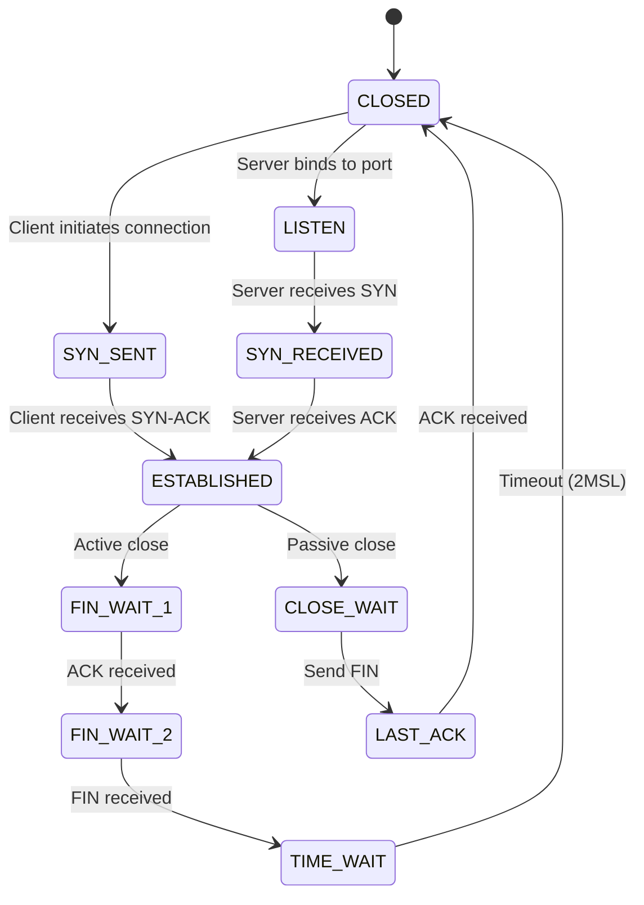
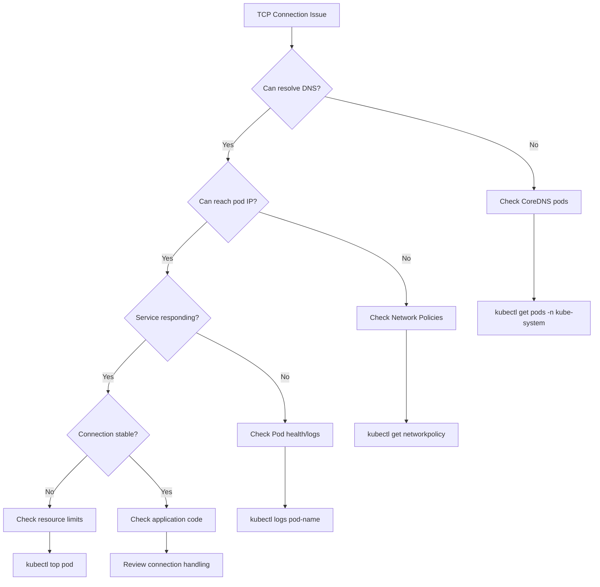

# How to Debug TCP Connection Issues in Containerized Applications

Author: [nawazdhandala](https://www.github.com/nawazdhandala)

Tags: TCP, debugging, containers, Docker, Kubernetes, networking, troubleshooting, netcat, ss, connection states

Description: A comprehensive guide to diagnosing and resolving TCP connection problems in containerized environments using essential networking tools and techniques.

---

## Introduction

TCP connection issues in containerized applications can be notoriously difficult to debug. The additional network abstraction layers introduced by container runtimes, overlay networks, and orchestration platforms add complexity that traditional debugging approaches may not address. This guide provides practical techniques and tools for identifying and resolving TCP connection problems in Docker and Kubernetes environments.

## Understanding TCP Connection States

Before diving into debugging, it's essential to understand TCP connection states and what they indicate about potential problems.



### Common Connection State Issues

| State | Problem Indication |
|-------|-------------------|
| `SYN_SENT` accumulating | Server unreachable or firewall blocking |
| `CLOSE_WAIT` accumulating | Application not closing connections properly |
| `TIME_WAIT` accumulating | High connection churn, possible port exhaustion |
| `ESTABLISHED` but no data | Application-level issues or deadlocks |

## Essential Debugging Tools

### 1. Using `ss` (Socket Statistics)

The `ss` command is the modern replacement for `netstat` and provides detailed socket information.

```bash
# View all TCP connections with process information
ss -tlnp

# Show all TCP connections with state information
ss -tan

# Filter connections by state
ss -tan state established

# Show connections to a specific port
ss -tan 'dport = :80'

# Show detailed socket statistics
ss -ti

# Count connections by state
ss -tan | awk '{print $1}' | sort | uniq -c
```

#### Installing ss in Containers

Many minimal container images don't include `ss`. Here's how to add it:

```dockerfile
# Debian/Ubuntu-based images
FROM ubuntu:22.04
RUN apt-get update && apt-get install -y iproute2

# Alpine-based images
FROM alpine:3.18
RUN apk add --no-cache iproute2
```

### 2. Using `netcat` (nc) for Connection Testing

Netcat is invaluable for testing TCP connectivity.

```bash
# Test if a port is reachable (with timeout)
nc -zv -w 5 hostname 80

# Test multiple ports
nc -zv hostname 80-443

# Create a simple TCP listener for testing
nc -l -p 8080

# Send data to test application protocol
echo "GET / HTTP/1.1\r\nHost: example.com\r\n\r\n" | nc hostname 80

# Test with verbose output showing connection timing
nc -v -w 10 hostname 443 2>&1
```

### 3. Using `tcpdump` for Packet Analysis

Capture TCP traffic to understand connection behavior.

```bash
# Capture SYN packets (new connections)
tcpdump -i any 'tcp[tcpflags] & tcp-syn != 0'

# Capture packets for a specific host and port
tcpdump -i any host 10.0.0.5 and port 8080

# Capture and show TCP flags
tcpdump -i any 'tcp' -nn -tttt

# Capture RST packets (connection resets)
tcpdump -i any 'tcp[tcpflags] & tcp-rst != 0'

# Save capture for later analysis
tcpdump -i any -w capture.pcap port 80
```

## Debugging in Docker Containers

### Entering Container Network Namespace

```bash
# Find the container's process ID
CONTAINER_ID="your-container-id"
PID=$(docker inspect -f '{{.State.Pid}}' $CONTAINER_ID)

# Enter the network namespace
nsenter -t $PID -n ss -tan

# Run tcpdump in container's namespace
nsenter -t $PID -n tcpdump -i any -nn
```

### Docker Network Debugging

```bash
# List all Docker networks
docker network ls

# Inspect network details
docker network inspect bridge

# Check container's network settings
docker inspect --format='{{json .NetworkSettings}}' container_name | jq

# Test connectivity between containers
docker exec container1 ping container2
docker exec container1 nc -zv container2 8080
```

### Debug Container with Network Tools

Create a debug container with networking tools:

```yaml
# docker-compose.debug.yml
version: '3.8'
services:
  debug:
    image: nicolaka/netshoot
    network_mode: "container:target_container_name"
    stdin_open: true
    tty: true
```

```bash
# Run debug container attached to target container's network
docker run -it --rm --network container:target_container \
  nicolaka/netshoot bash
```

## Debugging in Kubernetes

### Using Ephemeral Debug Containers

```bash
# Attach a debug container to a running pod
kubectl debug -it pod-name --image=nicolaka/netshoot --target=container-name

# Debug with specific namespace
kubectl debug -it pod-name -n namespace --image=busybox
```

### Creating a Debug Pod

```yaml
# debug-pod.yaml
apiVersion: v1
kind: Pod
metadata:
  name: network-debug
  namespace: default
spec:
  containers:
  - name: debug
    image: nicolaka/netshoot
    command: ["sleep", "infinity"]
    securityContext:
      capabilities:
        add: ["NET_ADMIN", "NET_RAW"]
```

```bash
# Apply and use the debug pod
kubectl apply -f debug-pod.yaml
kubectl exec -it network-debug -- bash

# Inside the debug pod
ss -tan
tcpdump -i any port 8080
curl -v http://service-name:8080
```

### Debugging Service Connectivity

```bash
# Check service endpoints
kubectl get endpoints service-name

# Verify service DNS resolution
kubectl exec -it debug-pod -- nslookup service-name

# Test service connectivity from within cluster
kubectl exec -it debug-pod -- nc -zv service-name 80

# Check if pods are ready
kubectl get pods -l app=your-app -o wide
```

### Network Policy Debugging

```bash
# List network policies in namespace
kubectl get networkpolicies -n namespace

# Describe network policy details
kubectl describe networkpolicy policy-name -n namespace

# Test connectivity with policy applied
kubectl exec -it source-pod -- nc -zv target-pod 8080
```

## Common TCP Connection Issues and Solutions

### Issue 1: Connection Timeout (SYN_SENT)

**Symptoms:**
- Connections stuck in `SYN_SENT` state
- "Connection timed out" errors

**Debugging Steps:**

```bash
# Check if target is reachable
ping target-host

# Verify port is open on target
ss -tln | grep :8080

# Check for packet loss
tcpdump -i any 'tcp[tcpflags] & tcp-syn != 0' and host target-host

# Verify no firewall blocking
iptables -L -n -v
```

**Common Causes:**
- Firewall blocking traffic
- Network policy denying ingress
- Service not listening on expected port
- DNS resolution failures

### Issue 2: Connection Reset (RST)

**Symptoms:**
- "Connection reset by peer" errors
- Immediate connection failures

**Debugging Steps:**

```bash
# Watch for RST packets
tcpdump -i any 'tcp[tcpflags] & tcp-rst != 0'

# Check application logs
kubectl logs pod-name

# Verify service health
kubectl exec -it pod-name -- curl localhost:8080/health
```

**Common Causes:**
- Application crashed or not running
- Port not bound correctly
- Load balancer health check failures
- Resource limits reached

### Issue 3: CLOSE_WAIT Accumulation

**Symptoms:**
- Many connections in `CLOSE_WAIT` state
- Memory/resource exhaustion over time

**Debugging Steps:**

```bash
# Count CLOSE_WAIT connections
ss -tan state close-wait | wc -l

# Identify which process owns connections
ss -tanp state close-wait

# Monitor over time
watch -n 5 'ss -tan state close-wait | wc -l'
```

**Solution:**
This indicates the application isn't properly closing connections. Review application code for:
- Missing `close()` calls on sockets
- Exception handlers that don't clean up connections
- Connection pool misconfigurations

### Issue 4: TIME_WAIT Exhaustion

**Symptoms:**
- "Cannot assign requested address" errors
- Port exhaustion under high load

**Debugging Steps:**

```bash
# Count TIME_WAIT connections
ss -tan state time-wait | wc -l

# Check available ephemeral ports
cat /proc/sys/net/ipv4/ip_local_port_range

# Monitor port usage
ss -tan | awk '{print $4}' | cut -d: -f2 | sort -n | uniq -c | sort -rn | head
```

**Solutions:**

```bash
# Increase ephemeral port range
sysctl -w net.ipv4.ip_local_port_range="1024 65535"

# Enable TCP reuse (use with caution)
sysctl -w net.ipv4.tcp_tw_reuse=1

# Reduce TIME_WAIT duration (not recommended for production)
sysctl -w net.ipv4.tcp_fin_timeout=30
```

## Automated Health Check Script

Create a comprehensive TCP debugging script:

```bash
#!/bin/bash
# tcp-debug.sh - TCP Connection Debugging Script

TARGET_HOST="${1:-localhost}"
TARGET_PORT="${2:-8080}"
NAMESPACE="${3:-default}"

echo "=== TCP Connection Debug Report ==="
echo "Target: $TARGET_HOST:$TARGET_PORT"
echo "Timestamp: $(date)"
echo ""

echo "=== DNS Resolution ==="
nslookup $TARGET_HOST 2>&1 || echo "DNS lookup failed"
echo ""

echo "=== Connection Test ==="
nc -zv -w 5 $TARGET_HOST $TARGET_PORT 2>&1
echo ""

echo "=== TCP Connection States ==="
ss -tan | awk '{print $1}' | sort | uniq -c | sort -rn
echo ""

echo "=== Connections to Target ==="
ss -tan | grep ":$TARGET_PORT" | head -20
echo ""

echo "=== Route to Target ==="
ip route get $(getent hosts $TARGET_HOST | awk '{print $1}') 2>&1 || echo "Route lookup failed"
echo ""

echo "=== Recent Connection Attempts (last 10 SYNs) ==="
timeout 5 tcpdump -i any -c 10 "tcp[tcpflags] & tcp-syn != 0 and port $TARGET_PORT" 2>&1 || echo "No SYN packets captured"
echo ""

echo "=== System TCP Settings ==="
echo "tcp_max_syn_backlog: $(cat /proc/sys/net/ipv4/tcp_max_syn_backlog 2>/dev/null || echo 'N/A')"
echo "tcp_fin_timeout: $(cat /proc/sys/net/ipv4/tcp_fin_timeout 2>/dev/null || echo 'N/A')"
echo "tcp_keepalive_time: $(cat /proc/sys/net/ipv4/tcp_keepalive_time 2>/dev/null || echo 'N/A')"
echo "somaxconn: $(cat /proc/sys/net/core/somaxconn 2>/dev/null || echo 'N/A')"
```

## Kubernetes TCP Debugging Workflow



## Best Practices

### 1. Configure Proper Timeouts

```yaml
# Kubernetes service configuration
apiVersion: v1
kind: Service
metadata:
  name: my-service
  annotations:
    # Adjust idle timeout for long-lived connections
    service.beta.kubernetes.io/aws-load-balancer-connection-idle-timeout: "3600"
spec:
  ports:
  - port: 80
    targetPort: 8080
  selector:
    app: my-app
```

### 2. Implement Connection Pooling

```python
# Python example with connection pooling
import requests
from requests.adapters import HTTPAdapter
from urllib3.util.retry import Retry

session = requests.Session()
retries = Retry(total=3, backoff_factor=0.1)
adapter = HTTPAdapter(pool_connections=10, pool_maxsize=20, max_retries=retries)
session.mount('http://', adapter)
session.mount('https://', adapter)
```

### 3. Monitor Connection Metrics

```yaml
# Prometheus ServiceMonitor for connection metrics
apiVersion: monitoring.coreos.com/v1
kind: ServiceMonitor
metadata:
  name: tcp-connections
spec:
  selector:
    matchLabels:
      app: my-app
  endpoints:
  - port: metrics
    interval: 30s
```

## Conclusion

Debugging TCP connection issues in containerized environments requires a systematic approach and familiarity with networking tools. Key takeaways:

1. **Always start with connection state analysis** using `ss` to understand what's happening
2. **Use the right namespace** - debug from within the container's network namespace
3. **Layer your debugging** - check DNS, then routing, then connectivity, then application
4. **Leverage ephemeral debug containers** in Kubernetes for non-invasive troubleshooting
5. **Monitor proactively** - set up alerts for connection state anomalies before they become problems

By following the workflows and using the tools described in this guide, you can efficiently identify and resolve TCP connection issues in even the most complex containerized environments.

## Additional Resources

- [Kubernetes Network Debugging](https://kubernetes.io/docs/tasks/debug/debug-application/debug-service/)
- [Docker Networking Documentation](https://docs.docker.com/network/)
- [TCP/IP Illustrated](https://www.oreilly.com/library/view/tcpip-illustrated-volume/9780132808200/)
- [netshoot - Network Troubleshooting Swiss Army Container](https://github.com/nicolaka/netshoot)
