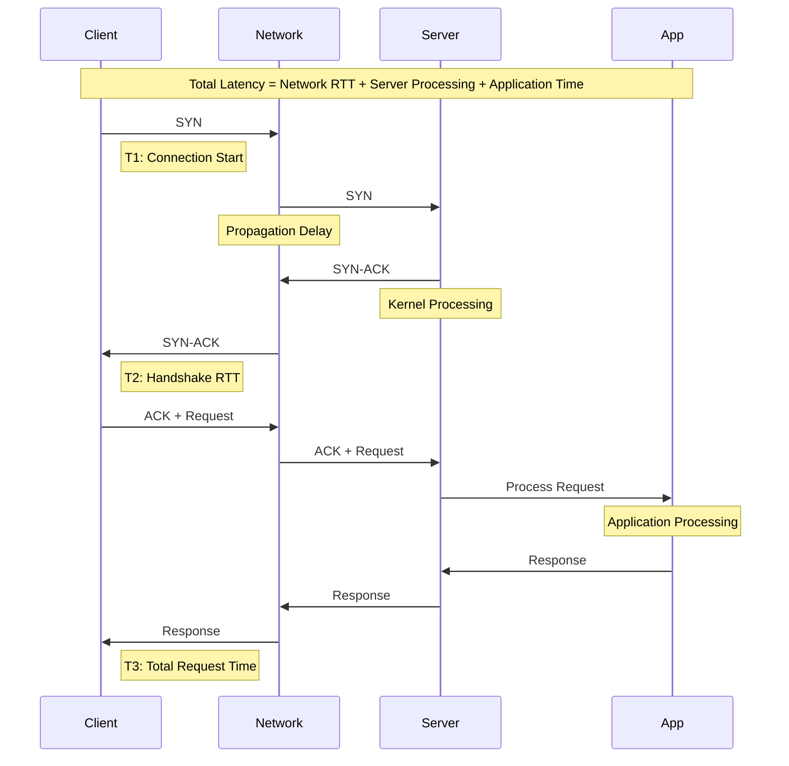
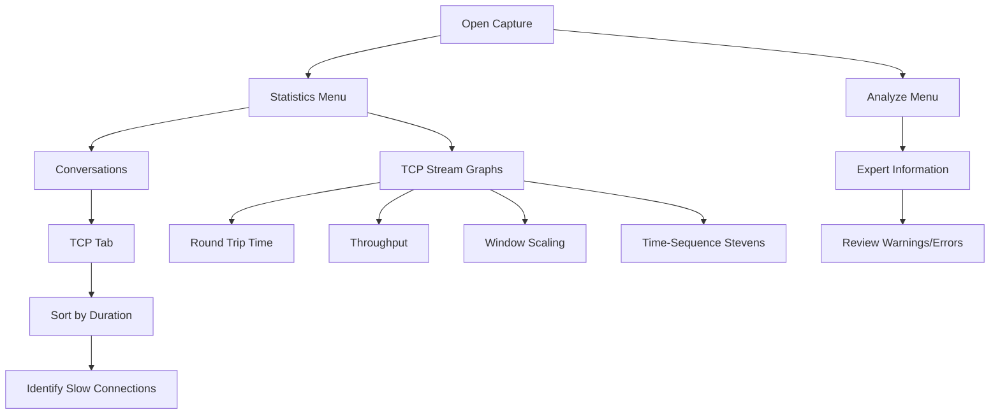
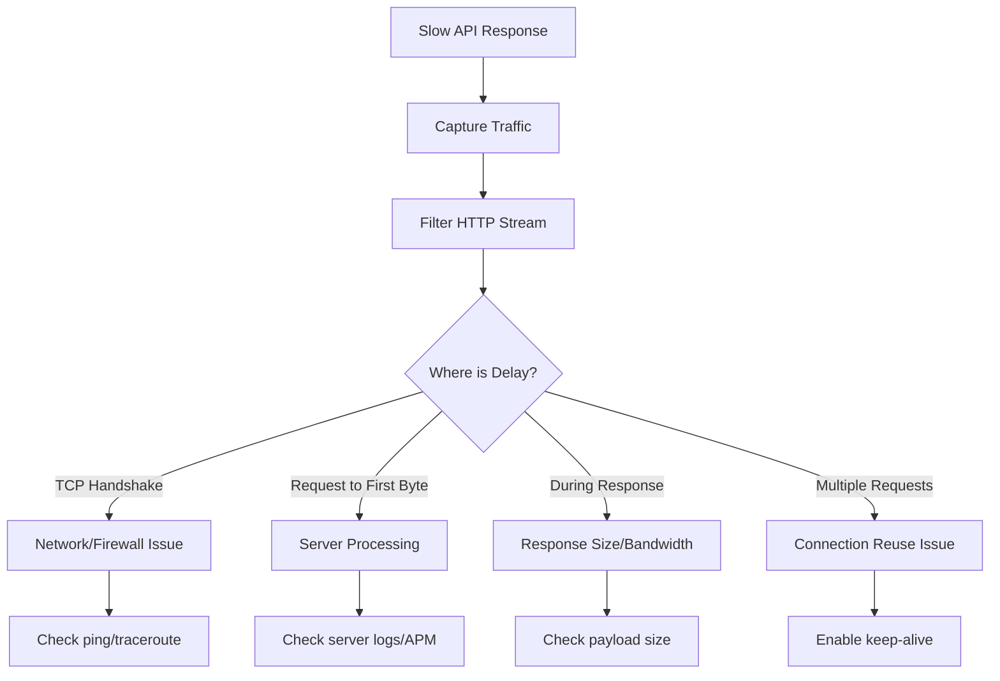

# How to Troubleshoot Network Latency Using tcpdump and Wireshark

Author: [nawazdhandala](https://www.github.com/nawazdhandala)

Tags: tcpdump, Wireshark, network latency, packet analysis, troubleshooting, TCP, networking, performance, timing analysis

Description: A practical guide to capturing and analyzing network traffic with tcpdump and Wireshark to identify and resolve latency issues in distributed systems.

---

## Introduction

Network latency can silently degrade application performance, causing timeouts, slow response times, and poor user experience. While high-level metrics provide visibility into latency trends, understanding the root cause often requires packet-level analysis. This guide covers practical techniques for using tcpdump to capture network traffic and Wireshark to analyze it, with a focus on identifying latency issues in modern distributed systems.

## Understanding Network Latency Components



### Latency Types and Their Causes

| Latency Type | Typical Range | Common Causes |
|--------------|---------------|---------------|
| Propagation | 1-100ms | Physical distance, speed of light |
| Transmission | 0.01-10ms | Link bandwidth, packet size |
| Processing | 0.1-100ms | CPU load, software efficiency |
| Queuing | 0.1-1000ms | Network congestion, buffer bloat |
| Serialization | 0.01-1ms | MTU size, interface speed |

## tcpdump Essentials for Latency Analysis

### Basic Capture Commands

```bash
# Capture all traffic on an interface
tcpdump -i eth0 -w capture.pcap

# Capture with timestamps (nanosecond precision)
tcpdump -i eth0 -w capture.pcap --time-stamp-precision=nano

# Capture specific host traffic
tcpdump -i eth0 host 10.0.0.5 -w capture.pcap

# Capture specific port traffic
tcpdump -i eth0 port 8080 -w capture.pcap

# Capture with buffer size to prevent drops
tcpdump -i eth0 -B 4096 -w capture.pcap

# Capture TCP only
tcpdump -i eth0 tcp -w capture.pcap

# Ring buffer capture (useful for long-running captures)
tcpdump -i eth0 -w capture_%Y%m%d_%H%M%S.pcap -G 3600 -W 24
```

### Advanced Capture Filters

```bash
# Capture SYN packets (new connections)
tcpdump -i eth0 'tcp[tcpflags] & tcp-syn != 0'

# Capture packets with high latency indicators
# (retransmissions often indicated by duplicate ACKs)
tcpdump -i eth0 'tcp[tcpflags] & tcp-ack != 0'

# Capture slow start (small window sizes)
tcpdump -i eth0 'tcp[14:2] < 1000'

# Capture ICMP (useful for path MTU discovery issues)
tcpdump -i eth0 icmp

# Capture between two hosts
tcpdump -i eth0 'host 10.0.0.5 and host 10.0.0.10'

# Capture HTTP traffic
tcpdump -i eth0 'tcp port 80 and (((ip[2:2] - ((ip[0]&0xf)<<2)) - ((tcp[12]&0xf0)>>2)) != 0)'

# Exclude SSH traffic (when capturing remotely)
tcpdump -i eth0 'not port 22'

# Capture packets larger than MTU (fragmentation issues)
tcpdump -i eth0 'ip[6:2] & 0x1fff != 0'
```

### Running tcpdump in Containers

```bash
# Docker container
docker exec -it container_name tcpdump -i eth0 -w /tmp/capture.pcap
docker cp container_name:/tmp/capture.pcap ./capture.pcap

# Kubernetes pod
kubectl exec -it pod-name -- tcpdump -i eth0 -w /tmp/capture.pcap
kubectl cp pod-name:/tmp/capture.pcap ./capture.pcap

# Using ephemeral debug container
kubectl debug -it pod-name --image=nicolaka/netshoot -- \
  tcpdump -i any -w /tmp/capture.pcap

# Using nsenter (from node)
PID=$(docker inspect -f '{{.State.Pid}}' container_name)
nsenter -t $PID -n tcpdump -i any -w /tmp/capture.pcap
```

### tcpdump Output Analysis (Without Wireshark)

```bash
# Show packet timestamps with microsecond precision
tcpdump -i eth0 -tttt -nn

# Show TCP sequence numbers
tcpdump -i eth0 -S -nn

# Show packet contents in hex and ASCII
tcpdump -i eth0 -X

# Read capture file with timing
tcpdump -r capture.pcap -tttt

# Calculate time deltas between packets
tcpdump -r capture.pcap -ttt

# Filter and show specific connection
tcpdump -r capture.pcap 'host 10.0.0.5 and port 8080' -tttt

# Quick latency check using first and last packet
tcpdump -r capture.pcap -c 1 -tttt && tcpdump -r capture.pcap -tttt | tail -1
```

## Wireshark Analysis Techniques

### Opening and Filtering Captures

```
# Display filters for latency analysis

# Show only TCP conversations
tcp

# Filter specific conversation
ip.addr == 10.0.0.5 && tcp.port == 8080

# Show retransmissions
tcp.analysis.retransmission

# Show duplicate ACKs
tcp.analysis.duplicate_ack

# Show zero window events
tcp.analysis.zero_window

# Show out-of-order packets
tcp.analysis.out_of_order

# Show packets with high RTT (expert info)
tcp.analysis.ack_rtt > 0.1

# Show TCP resets
tcp.flags.reset == 1

# Show slow connections (SYN to SYN-ACK > 100ms)
tcp.flags.syn == 1 && tcp.flags.ack == 0
```

### Wireshark TCP Stream Analysis



### Time Reference and Delta Analysis

1. **Set Time Reference**: Right-click a packet > Set/Unset Time Reference
2. **View Delta Time**: Add column for `tcp.time_delta`
3. **Custom Time Display**: Edit > Preferences > Columns > Add `Delta time displayed`

### Key Wireshark Statistics for Latency

```
Statistics > TCP Stream Graphs > Round Trip Time
- Shows RTT over time for selected stream
- Identify RTT spikes and patterns

Statistics > TCP Stream Graphs > Window Scaling
- Shows receive window changes
- Identify buffer issues and flow control problems

Statistics > IO Graph
- Plot packets/sec or bytes/sec
- Identify throughput bottlenecks

Statistics > Flow Graph
- Visual sequence diagram
- See request/response timing
```

## Identifying Latency Patterns

### Pattern 1: TCP Handshake Latency

```
# Wireshark filter
tcp.flags.syn == 1

# Look for:
- Time between SYN and SYN-ACK (network RTT)
- Time between SYN-ACK and ACK (client processing)
```

**Analysis Script:**

```python
#!/usr/bin/env python3
# analyze-handshake.py - Analyze TCP handshake times from pcap

from scapy.all import rdpcap, TCP

def analyze_handshakes(pcap_file):
    packets = rdpcap(pcap_file)

    syn_times = {}  # Key: (src, dst, dport), Value: timestamp
    handshake_times = []

    for pkt in packets:
        if TCP in pkt:
            tcp = pkt[TCP]
            key = (pkt.src, pkt.dst, tcp.dport)
            reverse_key = (pkt.dst, pkt.src, tcp.sport)

            # SYN packet
            if tcp.flags == 'S':
                syn_times[key] = float(pkt.time)

            # SYN-ACK packet
            elif tcp.flags == 'SA':
                if reverse_key in syn_times:
                    rtt = float(pkt.time) - syn_times[reverse_key]
                    handshake_times.append({
                        'src': reverse_key[0],
                        'dst': reverse_key[1],
                        'port': reverse_key[2],
                        'rtt_ms': rtt * 1000
                    })

    # Print statistics
    if handshake_times:
        rtts = [h['rtt_ms'] for h in handshake_times]
        print(f"Handshake Analysis ({len(handshake_times)} connections)")
        print(f"  Min RTT: {min(rtts):.2f} ms")
        print(f"  Max RTT: {max(rtts):.2f} ms")
        print(f"  Avg RTT: {sum(rtts)/len(rtts):.2f} ms")
        print(f"\nSlowest connections:")
        for h in sorted(handshake_times, key=lambda x: -x['rtt_ms'])[:5]:
            print(f"  {h['src']} -> {h['dst']}:{h['port']}: {h['rtt_ms']:.2f} ms")

if __name__ == "__main__":
    import sys
    analyze_handshakes(sys.argv[1])
```

### Pattern 2: Application Response Latency

```
# Wireshark filter for HTTP
http.request or http.response

# For any TCP application, look for:
- PSH flag (Push) indicating data boundary
- Time between request and response PSH packets
```

**tshark Analysis:**

```bash
# Extract HTTP response times
tshark -r capture.pcap -T fields \
  -e frame.time_delta_displayed \
  -e http.request.method \
  -e http.request.uri \
  -e http.response.code \
  -e http.time \
  -Y "http.response"

# Calculate TCP stream durations
tshark -r capture.pcap -q -z conv,tcp

# Show IO statistics
tshark -r capture.pcap -q -z io,stat,1
```

### Pattern 3: Retransmission-Induced Latency

```
# Wireshark filter
tcp.analysis.retransmission or tcp.analysis.fast_retransmission

# Key indicators:
- tcp.analysis.rto (Retransmission Timeout)
- tcp.analysis.duplicate_ack_num
```

```bash
# Count retransmissions with tshark
tshark -r capture.pcap -Y "tcp.analysis.retransmission" | wc -l

# Show retransmission details
tshark -r capture.pcap -T fields \
  -e frame.time \
  -e ip.src \
  -e ip.dst \
  -e tcp.srcport \
  -e tcp.dstport \
  -e tcp.analysis.rto \
  -Y "tcp.analysis.retransmission"
```

### Pattern 4: Window Size Issues

```
# Wireshark filter
tcp.window_size_value < 1000 or tcp.analysis.zero_window

# Look for:
- Decreasing window sizes (receiver overwhelmed)
- Zero window advertisements
- Window scale factor issues
```

### Pattern 5: DNS Resolution Latency

```
# Wireshark filter
dns

# Analysis:
- Time between DNS query and response
- Failed queries requiring retries
- Multiple queries for same name
```

```bash
# Extract DNS timing
tshark -r capture.pcap -T fields \
  -e frame.time_delta \
  -e dns.qry.name \
  -e dns.time \
  -Y "dns.flags.response == 1"
```

## Practical Troubleshooting Workflows

### Workflow 1: Diagnosing Slow API Responses



**Step-by-step:**

```bash
# 1. Capture API traffic
tcpdump -i eth0 port 8080 -w api_capture.pcap

# 2. Make the slow request (in another terminal)
curl -w "@curl-format.txt" http://api.example.com/slow-endpoint

# Create curl-format.txt:
cat > curl-format.txt << 'EOF'
    time_namelookup:  %{time_namelookup}s\n
       time_connect:  %{time_connect}s\n
    time_appconnect:  %{time_appconnect}s\n
   time_pretransfer:  %{time_pretransfer}s\n
      time_redirect:  %{time_redirect}s\n
 time_starttransfer:  %{time_starttransfer}s\n
                    ----------\n
         time_total:  %{time_total}s\n
EOF

# 3. Stop capture and analyze
# In Wireshark: Follow TCP Stream to see full conversation
```

### Workflow 2: Identifying Network Path Issues

```bash
# 1. Capture with MTR for path analysis
mtr --report --report-cycles 100 target-host

# 2. Simultaneous tcpdump
tcpdump -i eth0 icmp or 'tcp port 8080' -w path_analysis.pcap

# 3. Look for in Wireshark:
# - ICMP Time Exceeded (routing issues)
# - ICMP Destination Unreachable
# - TTL values decreasing unexpectedly
# - Fragmentation (ICMP fragmentation needed)
```

### Workflow 3: Debugging Microservices Latency

```bash
# 1. Identify the slow call path
# Use distributed tracing (Jaeger/Zipkin) to find slow span

# 2. Capture at both ends
# On client pod:
kubectl exec -it client-pod -- \
  tcpdump -i eth0 host service-backend -w /tmp/client.pcap

# On server pod:
kubectl exec -it server-pod -- \
  tcpdump -i eth0 -w /tmp/server.pcap

# 3. Copy captures
kubectl cp client-pod:/tmp/client.pcap ./client.pcap
kubectl cp server-pod:/tmp/server.pcap ./server.pcap

# 4. Merge and analyze in Wireshark
mergecap -w merged.pcap client.pcap server.pcap

# 5. Look for time differences between client send and server receive
```

## Automated Latency Analysis Script

```bash
#!/bin/bash
# latency-analyzer.sh - Automated network latency analysis

INTERFACE="${1:-eth0}"
CAPTURE_DURATION="${2:-60}"
OUTPUT_DIR="./latency-analysis-$(date +%Y%m%d_%H%M%S)"

mkdir -p "$OUTPUT_DIR"

echo "=== Network Latency Analysis ==="
echo "Interface: $INTERFACE"
echo "Duration: ${CAPTURE_DURATION}s"
echo "Output: $OUTPUT_DIR"
echo ""

# Start capture
echo "[1/5] Starting packet capture..."
timeout $CAPTURE_DURATION tcpdump -i $INTERFACE -w "$OUTPUT_DIR/capture.pcap" 2>/dev/null &
TCPDUMP_PID=$!

sleep $CAPTURE_DURATION
wait $TCPDUMP_PID 2>/dev/null

# Analyze capture
echo "[2/5] Analyzing TCP conversations..."
tshark -r "$OUTPUT_DIR/capture.pcap" -q -z conv,tcp > "$OUTPUT_DIR/tcp_conversations.txt"

echo "[3/5] Counting retransmissions..."
RETRANS=$(tshark -r "$OUTPUT_DIR/capture.pcap" -Y "tcp.analysis.retransmission" 2>/dev/null | wc -l)
echo "Retransmissions: $RETRANS" > "$OUTPUT_DIR/retransmissions.txt"
tshark -r "$OUTPUT_DIR/capture.pcap" -T fields \
  -e frame.time \
  -e ip.src \
  -e ip.dst \
  -e tcp.srcport \
  -e tcp.dstport \
  -Y "tcp.analysis.retransmission" >> "$OUTPUT_DIR/retransmissions.txt" 2>/dev/null

echo "[4/5] Analyzing DNS latency..."
tshark -r "$OUTPUT_DIR/capture.pcap" -T fields \
  -e frame.time \
  -e dns.qry.name \
  -e dns.time \
  -Y "dns.flags.response == 1" > "$OUTPUT_DIR/dns_latency.txt" 2>/dev/null

echo "[5/5] Generating IO statistics..."
tshark -r "$OUTPUT_DIR/capture.pcap" -q -z io,stat,1 > "$OUTPUT_DIR/io_stats.txt" 2>/dev/null

# Generate summary
echo ""
echo "=== Analysis Summary ==="
cat << EOF > "$OUTPUT_DIR/summary.txt"
Network Latency Analysis Summary
================================
Capture Duration: ${CAPTURE_DURATION}s
Interface: $INTERFACE
Timestamp: $(date)

TCP Retransmissions: $RETRANS

Top 10 TCP Conversations by Bytes:
$(head -20 "$OUTPUT_DIR/tcp_conversations.txt")

DNS Queries with Latency > 100ms:
$(awk '$3 > 0.1 {print}' "$OUTPUT_DIR/dns_latency.txt" | head -10)

EOF

cat "$OUTPUT_DIR/summary.txt"
echo ""
echo "Full analysis saved to: $OUTPUT_DIR/"
```

## Wireshark Display Filter Quick Reference

```
# Connection establishment
tcp.flags.syn == 1 && tcp.flags.ack == 0    # SYN only
tcp.flags.syn == 1 && tcp.flags.ack == 1    # SYN-ACK

# Latency indicators
tcp.analysis.ack_rtt > 0.1                   # High RTT
tcp.analysis.initial_rtt > 0.05              # Slow initial RTT
tcp.time_delta > 0.5                         # Long gaps between packets

# Problems
tcp.analysis.retransmission                  # Retransmissions
tcp.analysis.duplicate_ack                   # Duplicate ACKs
tcp.analysis.zero_window                     # Zero window
tcp.analysis.window_full                     # Window full
tcp.analysis.out_of_order                    # Out of order

# Connection termination issues
tcp.flags.reset == 1                         # TCP resets
tcp.flags.fin == 1                           # Connection close

# Application layer
http.time > 1                                # Slow HTTP responses
dns.time > 0.1                               # Slow DNS

# Combine filters
(tcp.analysis.retransmission) && (ip.addr == 10.0.0.5)
```

## Best Practices

### Capture Best Practices

1. **Use sufficient buffer size** (`-B 4096`) to prevent packet drops
2. **Capture on the correct interface** - verify with `ip addr`
3. **Use ring buffers for long captures** (`-W` and `-G` flags)
4. **Minimize capture filter** to get complete picture, filter during analysis
5. **Capture at both endpoints** when possible for latency comparison
6. **Use nanosecond timestamps** for precise timing analysis

### Analysis Best Practices

1. **Start with Statistics > Conversations** to get overview
2. **Use Expert Information** to find problems quickly
3. **Follow TCP Stream** to see complete conversation
4. **Compare timestamps at different points** in the network path
5. **Look for patterns** - single slow packet vs consistent latency

### Performance Considerations

```bash
# Check for dropped packets during capture
tcpdump -i eth0 -w capture.pcap -v
# Look for "packets dropped by kernel" message

# Use kernel ring buffer for high-traffic capture
tcpdump -i eth0 -B 8192 -w capture.pcap

# Reduce capture load with targeted filter
tcpdump -i eth0 'tcp port 8080 and host 10.0.0.5' -w capture.pcap
```

## Conclusion

Effective network latency troubleshooting with tcpdump and Wireshark requires:

1. **Strategic capture placement** - Know where to capture to isolate the problem
2. **Appropriate filters** - Use capture filters for performance, display filters for analysis
3. **Understanding TCP behavior** - Know what retransmissions, window issues, and resets indicate
4. **Systematic analysis** - Follow workflows to narrow down root causes
5. **Correlation with application metrics** - Combine packet analysis with APM data

By mastering these tools and techniques, you can efficiently diagnose network latency issues that would otherwise remain mysterious, leading to faster resolution and better application performance.

## Additional Resources

- [Wireshark User Guide](https://www.wireshark.org/docs/wsug_html/)
- [tcpdump Manual](https://www.tcpdump.org/manpages/tcpdump.1.html)
- [Practical Packet Analysis by Chris Sanders](https://nostarch.com/packetanalysis3)
- [TCP/IP Guide](http://www.tcpipguide.com/)
- [Wireshark Display Filter Reference](https://www.wireshark.org/docs/dfref/)
