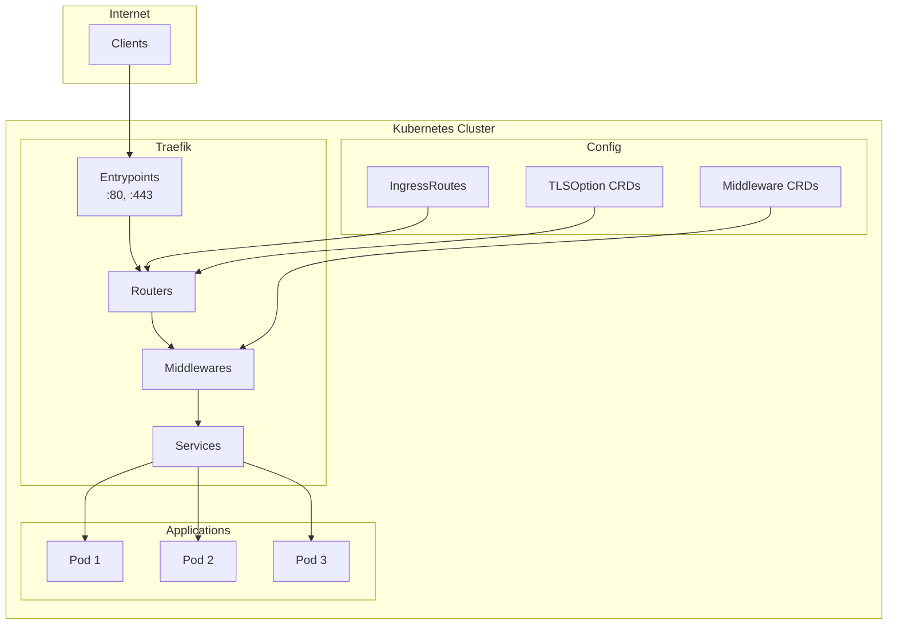

# How to Configure Traefik as an Ingress Controller on Kubernetes

Author: [nawazdhandala](https://www.github.com/nawazdhandala)

Tags: traefik, ingress, kubernetes, ingressroute, middleware, tls, load-balancer, reverse-proxy

Description: A complete guide to deploying and configuring Traefik as an Ingress Controller on Kubernetes with IngressRoute CRDs, middleware, TLS, and advanced routing.

---

## Introduction

Traefik is a modern, cloud-native reverse proxy and ingress controller that makes deploying microservices easy. Unlike traditional ingress controllers, Traefik offers dynamic configuration, automatic service discovery, and powerful middleware capabilities through its Custom Resource Definitions (CRDs).

This guide covers everything you need to know to deploy Traefik on Kubernetes, from basic installation to advanced configurations.

## Architecture Overview



## Prerequisites

Before you begin, ensure you have:

- Kubernetes cluster (v1.20+)
- `kubectl` configured with cluster access
- Helm 3.x installed
- Basic understanding of Kubernetes networking

## Step 1: Install Traefik

### Using Helm (Recommended)

```bash
# Add Traefik Helm repository
helm repo add traefik https://traefik.github.io/charts
helm repo update
```

Create a values file for customization:

```yaml
# traefik-values.yaml
# Deployment configuration
deployment:
  replicas: 2

# Pod disruption budget
podDisruptionBudget:
  enabled: true
  minAvailable: 1

# Resource limits
resources:
  requests:
    cpu: "100m"
    memory: "128Mi"
  limits:
    cpu: "500m"
    memory: "512Mi"

# Service configuration
service:
  enabled: true
  type: LoadBalancer
  annotations: {}

# Entrypoints configuration
ports:
  web:
    port: 8000
    exposedPort: 80
    expose: true
    protocol: TCP
  websecure:
    port: 8443
    exposedPort: 443
    expose: true
    protocol: TCP
    tls:
      enabled: true
  traefik:
    port: 9000
    expose: false

# Enable dashboard
ingressRoute:
  dashboard:
    enabled: true
    matchRule: Host(`traefik.localhost`)
    entryPoints: ["traefik"]

# Access logs
logs:
  general:
    level: INFO
  access:
    enabled: true
    format: json

# Metrics
metrics:
  prometheus:
    entryPoint: metrics
    addEntryPointsLabels: true
    addServicesLabels: true

# Additional arguments
additionalArguments:
  - "--api.insecure=true"
  - "--providers.kubernetesingress.ingressclass=traefik"
  - "--log.level=INFO"

# Install CRDs
ingressClass:
  enabled: true
  isDefaultClass: false
  fallbackApiVersion: ""

# Kubernetes provider configuration
providers:
  kubernetesCRD:
    enabled: true
    allowCrossNamespace: true
  kubernetesIngress:
    enabled: true
    publishedService:
      enabled: true
```

Install Traefik:

```bash
# Create namespace
kubectl create namespace traefik

# Install Traefik with custom values
helm install traefik traefik/traefik \
  --namespace traefik \
  --values traefik-values.yaml
```

### Verify Installation

```bash
# Check pods are running
kubectl get pods -n traefik

# Check services
kubectl get svc -n traefik

# Verify CRDs are installed
kubectl get crds | grep traefik
```

Expected CRDs:
- `ingressroutes.traefik.io`
- `ingressroutetcps.traefik.io`
- `ingressrouteudps.traefik.io`
- `middlewares.traefik.io`
- `middlewaretcps.traefik.io`
- `serverstransports.traefik.io`
- `tlsoptions.traefik.io`
- `tlsstores.traefik.io`
- `traefikservices.traefik.io`

## Step 2: Understanding Traefik CRDs

### IngressRoute

IngressRoute is Traefik's custom resource for defining routing rules:

```yaml
apiVersion: traefik.io/v1alpha1
kind: IngressRoute
metadata:
  name: example-ingressroute
  namespace: default
spec:
  entryPoints:
    - web
    - websecure
  routes:
    - match: Host(`example.com`) && PathPrefix(`/api`)
      kind: Rule
      services:
        - name: api-service
          port: 80
      middlewares:
        - name: api-middleware
```

### Middleware

Middleware modifies requests and responses:

```yaml
apiVersion: traefik.io/v1alpha1
kind: Middleware
metadata:
  name: example-middleware
  namespace: default
spec:
  headers:
    customRequestHeaders:
      X-Custom-Header: "value"
```

### TLSOption

TLSOption configures TLS settings:

```yaml
apiVersion: traefik.io/v1alpha1
kind: TLSOption
metadata:
  name: example-tlsoption
  namespace: default
spec:
  minVersion: VersionTLS12
  cipherSuites:
    - TLS_ECDHE_RSA_WITH_AES_256_GCM_SHA384
```

## Step 3: Deploy Sample Application

```yaml
# sample-app.yaml
apiVersion: apps/v1
kind: Deployment
metadata:
  name: whoami
  namespace: default
spec:
  replicas: 3
  selector:
    matchLabels:
      app: whoami
  template:
    metadata:
      labels:
        app: whoami
    spec:
      containers:
      - name: whoami
        image: traefik/whoami:latest
        ports:
        - containerPort: 80
        resources:
          requests:
            cpu: 50m
            memory: 64Mi
          limits:
            cpu: 100m
            memory: 128Mi
---
apiVersion: v1
kind: Service
metadata:
  name: whoami
  namespace: default
spec:
  selector:
    app: whoami
  ports:
  - port: 80
    targetPort: 80
```

Apply the deployment:

```bash
kubectl apply -f sample-app.yaml
```

## Step 4: Configure IngressRoute

### Basic IngressRoute

```yaml
# ingressroute-basic.yaml
apiVersion: traefik.io/v1alpha1
kind: IngressRoute
metadata:
  name: whoami-ingressroute
  namespace: default
spec:
  entryPoints:
    - web
  routes:
    - match: Host(`whoami.example.com`)
      kind: Rule
      services:
        - name: whoami
          port: 80
```

### IngressRoute with Path-Based Routing

```yaml
# ingressroute-paths.yaml
apiVersion: traefik.io/v1alpha1
kind: IngressRoute
metadata:
  name: multi-path-ingressroute
  namespace: default
spec:
  entryPoints:
    - web
    - websecure
  routes:
    # API routes
    - match: Host(`app.example.com`) && PathPrefix(`/api/v1`)
      kind: Rule
      services:
        - name: api-v1-service
          port: 80

    # API v2 routes
    - match: Host(`app.example.com`) && PathPrefix(`/api/v2`)
      kind: Rule
      services:
        - name: api-v2-service
          port: 80

    # Static content
    - match: Host(`app.example.com`) && PathPrefix(`/static`)
      kind: Rule
      services:
        - name: static-service
          port: 80

    # Default route
    - match: Host(`app.example.com`)
      kind: Rule
      services:
        - name: frontend-service
          port: 80
```

### IngressRoute with Header-Based Routing

```yaml
# ingressroute-headers.yaml
apiVersion: traefik.io/v1alpha1
kind: IngressRoute
metadata:
  name: header-routing
  namespace: default
spec:
  entryPoints:
    - websecure
  routes:
    # Route based on API version header
    - match: Host(`api.example.com`) && Headers(`X-API-Version`, `v2`)
      kind: Rule
      services:
        - name: api-v2-service
          port: 80

    # Route based on custom header
    - match: Host(`api.example.com`) && HeadersRegexp(`Authorization`, `Bearer.*`)
      kind: Rule
      services:
        - name: authenticated-service
          port: 80

    # Default API route
    - match: Host(`api.example.com`)
      kind: Rule
      services:
        - name: api-v1-service
          port: 80
```

### Weighted Round Robin (Canary Deployments)

```yaml
# ingressroute-weighted.yaml
apiVersion: traefik.io/v1alpha1
kind: IngressRoute
metadata:
  name: canary-deployment
  namespace: default
spec:
  entryPoints:
    - websecure
  routes:
    - match: Host(`app.example.com`)
      kind: Rule
      services:
        - name: app-stable
          port: 80
          weight: 90
        - name: app-canary
          port: 80
          weight: 10
```

## Step 5: Configure Middleware

### Authentication Middleware

#### Basic Auth

```yaml
# middleware-basicauth.yaml
apiVersion: traefik.io/v1alpha1
kind: Middleware
metadata:
  name: basic-auth
  namespace: default
spec:
  basicAuth:
    secret: auth-secret
---
apiVersion: v1
kind: Secret
metadata:
  name: auth-secret
  namespace: default
type: kubernetes.io/basic-auth
stringData:
  # Generate with: htpasswd -nb admin password | base64
  users: |
    admin:$apr1$xyz123$hashedpassword
```

#### Forward Auth (External Authentication)

```yaml
# middleware-forwardauth.yaml
apiVersion: traefik.io/v1alpha1
kind: Middleware
metadata:
  name: forward-auth
  namespace: default
spec:
  forwardAuth:
    address: http://auth-service.auth.svc.cluster.local:4181
    trustForwardHeader: true
    authResponseHeaders:
      - X-Forwarded-User
      - X-Auth-User
```

### Rate Limiting Middleware

```yaml
# middleware-ratelimit.yaml
apiVersion: traefik.io/v1alpha1
kind: Middleware
metadata:
  name: rate-limit
  namespace: default
spec:
  rateLimit:
    average: 100
    burst: 50
    period: 1m
    sourceCriterion:
      ipStrategy:
        depth: 1
```

### Headers Middleware

```yaml
# middleware-headers.yaml
apiVersion: traefik.io/v1alpha1
kind: Middleware
metadata:
  name: security-headers
  namespace: default
spec:
  headers:
    # Security headers
    frameDeny: true
    contentTypeNosniff: true
    browserXssFilter: true

    # HSTS
    stsIncludeSubdomains: true
    stsPreload: true
    stsSeconds: 31536000

    # Custom headers
    customResponseHeaders:
      X-Custom-Response-Header: "value"
    customRequestHeaders:
      X-Forwarded-Proto: "https"

    # Remove headers
    customResponseHeaders:
      X-Powered-By: ""
      Server: ""
```

### Redirect Middleware

```yaml
# middleware-redirect.yaml
# HTTP to HTTPS redirect
apiVersion: traefik.io/v1alpha1
kind: Middleware
metadata:
  name: redirect-https
  namespace: default
spec:
  redirectScheme:
    scheme: https
    permanent: true
---
# Regex redirect
apiVersion: traefik.io/v1alpha1
kind: Middleware
metadata:
  name: redirect-regex
  namespace: default
spec:
  redirectRegex:
    regex: ^https://old.example.com/(.*)
    replacement: https://new.example.com/${1}
    permanent: true
---
# WWW redirect
apiVersion: traefik.io/v1alpha1
kind: Middleware
metadata:
  name: redirect-www
  namespace: default
spec:
  redirectRegex:
    regex: ^https://www\.(.*)
    replacement: https://${1}
    permanent: true
```

### Strip Prefix Middleware

```yaml
# middleware-stripprefix.yaml
apiVersion: traefik.io/v1alpha1
kind: Middleware
metadata:
  name: strip-api-prefix
  namespace: default
spec:
  stripPrefix:
    prefixes:
      - /api
      - /api/v1
```

### Compress Middleware

```yaml
# middleware-compress.yaml
apiVersion: traefik.io/v1alpha1
kind: Middleware
metadata:
  name: compress
  namespace: default
spec:
  compress:
    excludedContentTypes:
      - text/event-stream
```

### Chain Multiple Middlewares

```yaml
# middleware-chain.yaml
apiVersion: traefik.io/v1alpha1
kind: Middleware
metadata:
  name: secure-chain
  namespace: default
spec:
  chain:
    middlewares:
      - name: redirect-https
      - name: security-headers
      - name: rate-limit
      - name: compress
```

### Using Middlewares in IngressRoute

```yaml
# ingressroute-with-middleware.yaml
apiVersion: traefik.io/v1alpha1
kind: IngressRoute
metadata:
  name: secure-app
  namespace: default
spec:
  entryPoints:
    - websecure
  routes:
    - match: Host(`app.example.com`)
      kind: Rule
      middlewares:
        - name: security-headers
        - name: rate-limit
        - name: compress
      services:
        - name: app-service
          port: 80
  tls:
    secretName: app-tls-secret
```

## Step 6: TLS Configuration

### Self-Signed Certificate

```yaml
# tls-secret.yaml
apiVersion: v1
kind: Secret
metadata:
  name: app-tls-secret
  namespace: default
type: kubernetes.io/tls
data:
  tls.crt: <base64-encoded-cert>
  tls.key: <base64-encoded-key>
```

Generate self-signed certificate:

```bash
# Generate self-signed certificate
openssl req -x509 -nodes -days 365 -newkey rsa:2048 \
  -keyout tls.key -out tls.crt \
  -subj "/CN=app.example.com"

# Create secret
kubectl create secret tls app-tls-secret \
  --cert=tls.crt \
  --key=tls.key \
  -n default
```

### IngressRoute with TLS

```yaml
# ingressroute-tls.yaml
apiVersion: traefik.io/v1alpha1
kind: IngressRoute
metadata:
  name: secure-app
  namespace: default
spec:
  entryPoints:
    - websecure
  routes:
    - match: Host(`app.example.com`)
      kind: Rule
      services:
        - name: app-service
          port: 80
  tls:
    secretName: app-tls-secret
    options:
      name: secure-tlsoption
      namespace: default
```

### TLS Options

```yaml
# tlsoption.yaml
apiVersion: traefik.io/v1alpha1
kind: TLSOption
metadata:
  name: secure-tlsoption
  namespace: default
spec:
  minVersion: VersionTLS12
  maxVersion: VersionTLS13
  cipherSuites:
    - TLS_ECDHE_ECDSA_WITH_AES_256_GCM_SHA384
    - TLS_ECDHE_RSA_WITH_AES_256_GCM_SHA384
    - TLS_ECDHE_ECDSA_WITH_AES_128_GCM_SHA256
    - TLS_ECDHE_RSA_WITH_AES_128_GCM_SHA256
    - TLS_ECDHE_ECDSA_WITH_CHACHA20_POLY1305
    - TLS_ECDHE_RSA_WITH_CHACHA20_POLY1305
  curvePreferences:
    - CurveP521
    - CurveP384
  sniStrict: true
```

### cert-manager Integration

```yaml
# certificate.yaml
apiVersion: cert-manager.io/v1
kind: Certificate
metadata:
  name: app-certificate
  namespace: default
spec:
  secretName: app-tls-secret
  issuerRef:
    name: letsencrypt-production
    kind: ClusterIssuer
  dnsNames:
    - app.example.com
    - www.app.example.com
---
apiVersion: traefik.io/v1alpha1
kind: IngressRoute
metadata:
  name: secure-app
  namespace: default
spec:
  entryPoints:
    - websecure
  routes:
    - match: Host(`app.example.com`) || Host(`www.app.example.com`)
      kind: Rule
      services:
        - name: app-service
          port: 80
  tls:
    secretName: app-tls-secret
```

## Step 7: Dashboard Access

### Secure Dashboard Access

```yaml
# dashboard-ingressroute.yaml
apiVersion: traefik.io/v1alpha1
kind: Middleware
metadata:
  name: dashboard-auth
  namespace: traefik
spec:
  basicAuth:
    secret: dashboard-auth-secret
---
apiVersion: v1
kind: Secret
metadata:
  name: dashboard-auth-secret
  namespace: traefik
type: kubernetes.io/basic-auth
stringData:
  users: |
    admin:$apr1$H6uskkkW$IgXLP6ewTrSuBkTrqE8wj/
---
apiVersion: traefik.io/v1alpha1
kind: IngressRoute
metadata:
  name: traefik-dashboard
  namespace: traefik
spec:
  entryPoints:
    - websecure
  routes:
    - match: Host(`traefik.example.com`)
      kind: Rule
      middlewares:
        - name: dashboard-auth
          namespace: traefik
      services:
        - name: api@internal
          kind: TraefikService
  tls:
    secretName: traefik-dashboard-tls
```

Generate the password hash:

```bash
# Install htpasswd
# Ubuntu: apt-get install apache2-utils
# Mac: brew install httpd

# Generate password hash
htpasswd -nb admin your-secure-password

# Output: admin:$apr1$H6uskkkW$IgXLP6ewTrSuBkTrqE8wj/
```

### Port-Forward for Local Access

```bash
# Quick access to dashboard
kubectl port-forward -n traefik $(kubectl get pods -n traefik -l app.kubernetes.io/name=traefik -o jsonpath='{.items[0].metadata.name}') 9000:9000

# Access at http://localhost:9000/dashboard/
```

## Step 8: Advanced Routing Rules

### Complex Match Rules

```yaml
# ingressroute-complex.yaml
apiVersion: traefik.io/v1alpha1
kind: IngressRoute
metadata:
  name: complex-routing
  namespace: default
spec:
  entryPoints:
    - websecure
  routes:
    # Match multiple conditions with AND
    - match: Host(`api.example.com`) && PathPrefix(`/v1`) && Method(`GET`, `POST`)
      kind: Rule
      services:
        - name: api-v1-service
          port: 80

    # Match with query parameters
    - match: Host(`api.example.com`) && Query(`version=2`)
      kind: Rule
      services:
        - name: api-v2-service
          port: 80

    # Match with client IP
    - match: Host(`admin.example.com`) && ClientIP(`192.168.1.0/24`)
      kind: Rule
      services:
        - name: admin-service
          port: 80

    # Match with OR conditions
    - match: Host(`www.example.com`) || Host(`example.com`)
      kind: Rule
      services:
        - name: main-service
          port: 80
```

### TCP IngressRoute

```yaml
# ingressroute-tcp.yaml
apiVersion: traefik.io/v1alpha1
kind: IngressRouteTCP
metadata:
  name: postgres-tcp
  namespace: default
spec:
  entryPoints:
    - postgres
  routes:
    - match: HostSNI(`*`)
      services:
        - name: postgres-service
          port: 5432
```

Add TCP entrypoint to Traefik values:

```yaml
# traefik-values.yaml (add to ports section)
ports:
  postgres:
    port: 5432
    expose: true
    protocol: TCP
```

### UDP IngressRoute

```yaml
# ingressroute-udp.yaml
apiVersion: traefik.io/v1alpha1
kind: IngressRouteUDP
metadata:
  name: dns-udp
  namespace: default
spec:
  entryPoints:
    - dns
  routes:
    - services:
        - name: dns-service
          port: 53
```

## Step 9: Sticky Sessions

```yaml
# traefik-service-sticky.yaml
apiVersion: traefik.io/v1alpha1
kind: TraefikService
metadata:
  name: sticky-service
  namespace: default
spec:
  weighted:
    services:
      - name: app-service
        port: 80
        weight: 1
    sticky:
      cookie:
        name: sticky-cookie
        secure: true
        httpOnly: true
        sameSite: strict
---
apiVersion: traefik.io/v1alpha1
kind: IngressRoute
metadata:
  name: sticky-ingressroute
  namespace: default
spec:
  entryPoints:
    - websecure
  routes:
    - match: Host(`app.example.com`)
      kind: Rule
      services:
        - name: sticky-service
          kind: TraefikService
```

## Step 10: Circuit Breaker

```yaml
# middleware-circuitbreaker.yaml
apiVersion: traefik.io/v1alpha1
kind: Middleware
metadata:
  name: circuit-breaker
  namespace: default
spec:
  circuitBreaker:
    expression: NetworkErrorRatio() > 0.5 || ResponseCodeRatio(500, 600, 0, 600) > 0.5
    checkPeriod: 10s
    fallbackDuration: 30s
    recoveryDuration: 60s
```

## Troubleshooting

### Check Traefik Logs

```bash
# View Traefik logs
kubectl logs -n traefik -l app.kubernetes.io/name=traefik -f

# Check for configuration errors
kubectl logs -n traefik -l app.kubernetes.io/name=traefik | grep -i error
```

### Verify IngressRoute Configuration

```bash
# List all IngressRoutes
kubectl get ingressroutes --all-namespaces

# Describe specific IngressRoute
kubectl describe ingressroute whoami-ingressroute -n default

# Check events
kubectl get events -n default --sort-by='.lastTimestamp'
```

### Debug Routing Issues

```bash
# Check Traefik dashboard for routing configuration
kubectl port-forward -n traefik svc/traefik 9000:9000

# Test routing with curl
curl -v -H "Host: app.example.com" http://<traefik-ip>

# Check if service is reachable
kubectl exec -n traefik -it <traefik-pod> -- wget -qO- http://app-service.default.svc.cluster.local
```

### Common Issues

#### IngressRoute Not Working

```bash
# Verify CRDs are installed
kubectl get crds | grep traefik

# Check if the service exists
kubectl get svc -n default

# Verify endpoints
kubectl get endpoints -n default
```

#### TLS Certificate Issues

```bash
# Check secret exists
kubectl get secrets -n default | grep tls

# Verify secret content
kubectl describe secret app-tls-secret -n default

# Test TLS connection
openssl s_client -connect app.example.com:443 -servername app.example.com
```

#### Middleware Not Applied

```bash
# Verify middleware exists
kubectl get middlewares -n default

# Check middleware is correctly referenced
kubectl describe ingressroute secure-app -n default
```

## Best Practices

### 1. Use Namespaced Resources

```yaml
# Keep resources in the same namespace
spec:
  routes:
    - middlewares:
        - name: my-middleware
          namespace: default  # Explicitly specify namespace
```

### 2. Implement Health Checks

```yaml
# traefik-values.yaml
additionalArguments:
  - "--ping=true"
  - "--ping.entrypoint=traefik"

# Kubernetes probe configuration
livenessProbe:
  httpGet:
    path: /ping
    port: 9000
  initialDelaySeconds: 10
  periodSeconds: 10
```

### 3. Enable Access Logs

```yaml
# traefik-values.yaml
logs:
  access:
    enabled: true
    format: json
    fields:
      headers:
        defaultMode: keep
```

### 4. Set Resource Limits

```yaml
resources:
  requests:
    cpu: "100m"
    memory: "128Mi"
  limits:
    cpu: "500m"
    memory: "512Mi"
```

### 5. Use Pod Anti-Affinity

```yaml
affinity:
  podAntiAffinity:
    preferredDuringSchedulingIgnoredDuringExecution:
      - weight: 100
        podAffinityTerm:
          labelSelector:
            matchLabels:
              app.kubernetes.io/name: traefik
          topologyKey: kubernetes.io/hostname
```

## Conclusion

Traefik provides a powerful and flexible ingress solution for Kubernetes with its CRD-based configuration. Key advantages include:

- **Dynamic Configuration**: Automatic service discovery and configuration updates
- **Middleware Support**: Extensive request/response modification capabilities
- **Native Kubernetes Integration**: First-class support for Kubernetes resources
- **Dashboard**: Built-in web UI for monitoring and debugging
- **Multiple Protocol Support**: HTTP, TCP, UDP routing capabilities

By leveraging IngressRoutes and Middleware, you can build sophisticated routing configurations while maintaining clean, declarative YAML definitions.
