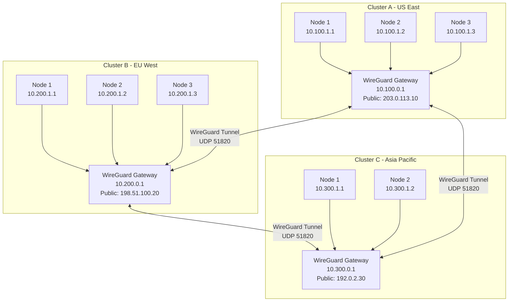
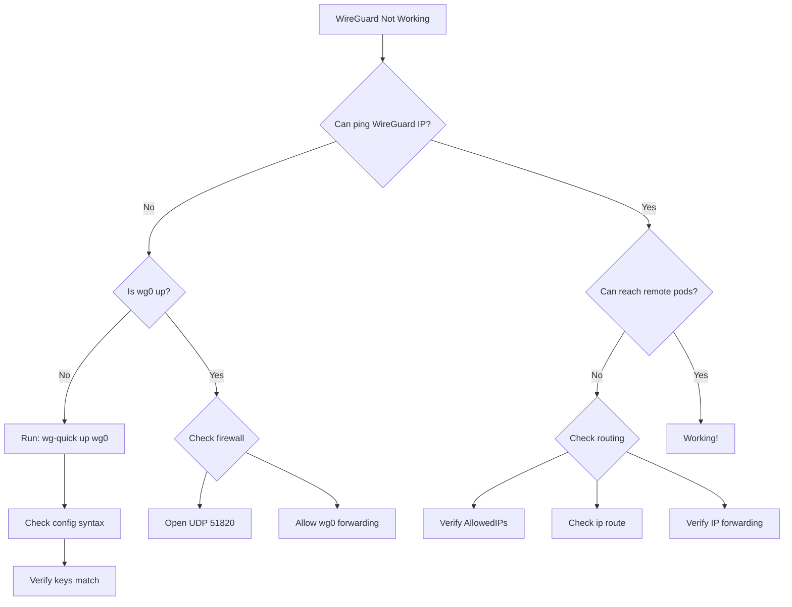
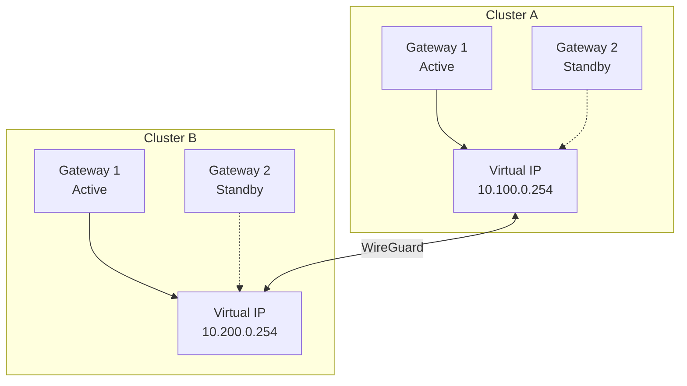

# How to Set Up WireGuard for Secure Cluster-to-Cluster Communication

Author: [nawazdhandala](https://www.github.com/nawazdhandala)

Tags: wireguard, vpn, kubernetes, cluster-networking, security, multi-cluster, encryption

Description: A comprehensive guide to establishing secure WireGuard VPN tunnels between Kubernetes clusters for encrypted cross-cluster communication.

---

## Introduction

When running multiple Kubernetes clusters across different data centers or cloud providers, secure communication between them becomes critical. WireGuard is a modern, high-performance VPN solution that provides cryptographically sound tunnels with minimal configuration overhead.

This guide walks you through setting up WireGuard for secure cluster-to-cluster communication, enabling your workloads to communicate seamlessly across geographical boundaries.

## Why WireGuard for Cluster Communication?

WireGuard offers several advantages over traditional VPN solutions:

- **Performance**: Runs in the Linux kernel with minimal overhead
- **Simplicity**: Configuration is straightforward compared to IPsec or OpenVPN
- **Security**: Uses modern cryptographic primitives (Curve25519, ChaCha20, Poly1305)
- **Roaming**: Handles IP changes gracefully
- **Low Attack Surface**: ~4,000 lines of code vs 100,000+ for alternatives

## Architecture Overview



## Prerequisites

Before starting, ensure you have:

- Root access on gateway nodes in each cluster
- Linux kernel 5.6+ (WireGuard is built-in) or WireGuard kernel module
- UDP port 51820 accessible between clusters
- Knowledge of your cluster network CIDRs

## Step 1: Install WireGuard

### Ubuntu/Debian

```bash
# Update package list
sudo apt update

# Install WireGuard
sudo apt install -y wireguard wireguard-tools

# Verify installation
wg --version
```

### RHEL/CentOS/Rocky Linux

```bash
# Enable EPEL repository
sudo dnf install -y epel-release

# Install WireGuard
sudo dnf install -y wireguard-tools

# Load the WireGuard kernel module
sudo modprobe wireguard

# Verify module is loaded
lsmod | grep wireguard
```

### Alpine Linux (Common in containers)

```bash
# Install WireGuard tools
apk add wireguard-tools

# The kernel module should be available in recent Alpine versions
modprobe wireguard
```

## Step 2: Generate Key Pairs

Each WireGuard peer needs a private/public key pair. Generate these on each gateway node.

### Cluster A Gateway

```bash
# Create WireGuard directory with proper permissions
sudo mkdir -p /etc/wireguard
sudo chmod 700 /etc/wireguard

# Generate private key
wg genkey | sudo tee /etc/wireguard/private.key
sudo chmod 600 /etc/wireguard/private.key

# Generate public key from private key
sudo cat /etc/wireguard/private.key | wg pubkey | sudo tee /etc/wireguard/public.key

# Display the public key (share this with other clusters)
echo "Cluster A Public Key:"
sudo cat /etc/wireguard/public.key
```

### Cluster B Gateway

```bash
# Same process on Cluster B
sudo mkdir -p /etc/wireguard
sudo chmod 700 /etc/wireguard

wg genkey | sudo tee /etc/wireguard/private.key
sudo chmod 600 /etc/wireguard/private.key
sudo cat /etc/wireguard/private.key | wg pubkey | sudo tee /etc/wireguard/public.key

echo "Cluster B Public Key:"
sudo cat /etc/wireguard/public.key
```

### Cluster C Gateway

```bash
# Same process on Cluster C
sudo mkdir -p /etc/wireguard
sudo chmod 700 /etc/wireguard

wg genkey | sudo tee /etc/wireguard/private.key
sudo chmod 600 /etc/wireguard/private.key
sudo cat /etc/wireguard/private.key | wg pubkey | sudo tee /etc/wireguard/public.key

echo "Cluster C Public Key:"
sudo cat /etc/wireguard/public.key
```

### Key Management Script

For easier key management across multiple clusters, use this script:

```bash
#!/bin/bash
# generate-wireguard-keys.sh

set -e

CLUSTER_NAME=${1:-"cluster"}
KEY_DIR="/etc/wireguard"

echo "Generating WireGuard keys for ${CLUSTER_NAME}..."

# Create directory
sudo mkdir -p ${KEY_DIR}
sudo chmod 700 ${KEY_DIR}

# Generate keys
PRIVATE_KEY=$(wg genkey)
PUBLIC_KEY=$(echo ${PRIVATE_KEY} | wg pubkey)

# Save keys
echo ${PRIVATE_KEY} | sudo tee ${KEY_DIR}/private.key > /dev/null
echo ${PUBLIC_KEY} | sudo tee ${KEY_DIR}/public.key > /dev/null

sudo chmod 600 ${KEY_DIR}/private.key
sudo chmod 644 ${KEY_DIR}/public.key

echo "Keys generated successfully!"
echo "Public Key for ${CLUSTER_NAME}: ${PUBLIC_KEY}"
echo ""
echo "Share this public key with peer clusters."
```

## Step 3: Configure WireGuard Interface

### Network Planning

Before configuration, plan your WireGuard network addresses:

| Cluster | WireGuard IP | Pod CIDR | Service CIDR | Public IP |
|---------|--------------|----------|--------------|-----------|
| Cluster A | 10.10.0.1/24 | 10.100.0.0/16 | 10.101.0.0/16 | 203.0.113.10 |
| Cluster B | 10.10.0.2/24 | 10.200.0.0/16 | 10.201.0.0/16 | 198.51.100.20 |
| Cluster C | 10.10.0.3/24 | 10.300.0.0/16 | 10.301.0.0/16 | 192.0.2.30 |

### Cluster A Configuration

```bash
# /etc/wireguard/wg0.conf on Cluster A Gateway

[Interface]
# Private key for this node
PrivateKey = <CLUSTER_A_PRIVATE_KEY>
# WireGuard interface IP
Address = 10.10.0.1/24
# Listening port
ListenPort = 51820
# Save configuration on shutdown
SaveConfig = false

# Post-up commands for routing
PostUp = sysctl -w net.ipv4.ip_forward=1
PostUp = iptables -A FORWARD -i wg0 -j ACCEPT
PostUp = iptables -A FORWARD -o wg0 -j ACCEPT
PostUp = iptables -t nat -A POSTROUTING -o eth0 -j MASQUERADE

# Post-down cleanup
PostDown = iptables -D FORWARD -i wg0 -j ACCEPT
PostDown = iptables -D FORWARD -o wg0 -j ACCEPT
PostDown = iptables -t nat -D POSTROUTING -o eth0 -j MASQUERADE

# Peer: Cluster B
[Peer]
PublicKey = <CLUSTER_B_PUBLIC_KEY>
# Cluster B's public endpoint
Endpoint = 198.51.100.20:51820
# Allow traffic from Cluster B's networks
AllowedIPs = 10.10.0.2/32, 10.200.0.0/16, 10.201.0.0/16
# Keep connection alive through NAT
PersistentKeepalive = 25

# Peer: Cluster C
[Peer]
PublicKey = <CLUSTER_C_PUBLIC_KEY>
Endpoint = 192.0.2.30:51820
AllowedIPs = 10.10.0.3/32, 10.300.0.0/16, 10.301.0.0/16
PersistentKeepalive = 25
```

### Cluster B Configuration

```bash
# /etc/wireguard/wg0.conf on Cluster B Gateway

[Interface]
PrivateKey = <CLUSTER_B_PRIVATE_KEY>
Address = 10.10.0.2/24
ListenPort = 51820
SaveConfig = false

PostUp = sysctl -w net.ipv4.ip_forward=1
PostUp = iptables -A FORWARD -i wg0 -j ACCEPT
PostUp = iptables -A FORWARD -o wg0 -j ACCEPT
PostUp = iptables -t nat -A POSTROUTING -o eth0 -j MASQUERADE

PostDown = iptables -D FORWARD -i wg0 -j ACCEPT
PostDown = iptables -D FORWARD -o wg0 -j ACCEPT
PostDown = iptables -t nat -D POSTROUTING -o eth0 -j MASQUERADE

# Peer: Cluster A
[Peer]
PublicKey = <CLUSTER_A_PUBLIC_KEY>
Endpoint = 203.0.113.10:51820
AllowedIPs = 10.10.0.1/32, 10.100.0.0/16, 10.101.0.0/16
PersistentKeepalive = 25

# Peer: Cluster C
[Peer]
PublicKey = <CLUSTER_C_PUBLIC_KEY>
Endpoint = 192.0.2.30:51820
AllowedIPs = 10.10.0.3/32, 10.300.0.0/16, 10.301.0.0/16
PersistentKeepalive = 25
```

### Cluster C Configuration

```bash
# /etc/wireguard/wg0.conf on Cluster C Gateway

[Interface]
PrivateKey = <CLUSTER_C_PRIVATE_KEY>
Address = 10.10.0.3/24
ListenPort = 51820
SaveConfig = false

PostUp = sysctl -w net.ipv4.ip_forward=1
PostUp = iptables -A FORWARD -i wg0 -j ACCEPT
PostUp = iptables -A FORWARD -o wg0 -j ACCEPT
PostUp = iptables -t nat -A POSTROUTING -o eth0 -j MASQUERADE

PostDown = iptables -D FORWARD -i wg0 -j ACCEPT
PostDown = iptables -D FORWARD -o wg0 -j ACCEPT
PostDown = iptables -t nat -D POSTROUTING -o eth0 -j MASQUERADE

# Peer: Cluster A
[Peer]
PublicKey = <CLUSTER_A_PUBLIC_KEY>
Endpoint = 203.0.113.10:51820
AllowedIPs = 10.10.0.1/32, 10.100.0.0/16, 10.101.0.0/16
PersistentKeepalive = 25

# Peer: Cluster B
[Peer]
PublicKey = <CLUSTER_B_PUBLIC_KEY>
Endpoint = 198.51.100.20:51820
AllowedIPs = 10.10.0.2/32, 10.200.0.0/16, 10.201.0.0/16
PersistentKeepalive = 25
```

## Step 4: Start WireGuard Interface

### Bring Up the Interface

```bash
# Start WireGuard interface
sudo wg-quick up wg0

# Verify interface is up
sudo wg show

# Check interface status
ip addr show wg0
```

### Enable at Boot

```bash
# Enable WireGuard to start on boot
sudo systemctl enable wg-quick@wg0

# Check service status
sudo systemctl status wg-quick@wg0
```

### Verify Connectivity

```bash
# From Cluster A, ping Cluster B's WireGuard IP
ping -c 4 10.10.0.2

# From Cluster A, ping Cluster C's WireGuard IP
ping -c 4 10.10.0.3

# Check WireGuard statistics
sudo wg show wg0
```

Expected output:

```
interface: wg0
  public key: <CLUSTER_A_PUBLIC_KEY>
  private key: (hidden)
  listening port: 51820

peer: <CLUSTER_B_PUBLIC_KEY>
  endpoint: 198.51.100.20:51820
  allowed ips: 10.10.0.2/32, 10.200.0.0/16, 10.201.0.0/16
  latest handshake: 12 seconds ago
  transfer: 1.24 MiB received, 856.32 KiB sent
  persistent keepalive: every 25 seconds

peer: <CLUSTER_C_PUBLIC_KEY>
  endpoint: 192.0.2.30:51820
  allowed ips: 10.10.0.3/32, 10.300.0.0/16, 10.301.0.0/16
  latest handshake: 8 seconds ago
  transfer: 2.56 MiB received, 1.12 MiB sent
  persistent keepalive: every 25 seconds
```

## Step 5: Configure Routing for Cluster Networks

### Static Routes on Gateway Nodes

The WireGuard configuration handles routing for remote networks, but you need to ensure cluster nodes know to route through the gateway.

### Using BGP with BIRD (Recommended for Production)

```bash
# Install BIRD routing daemon
sudo apt install -y bird2

# /etc/bird/bird.conf
router id 10.100.0.1;

protocol device {
    scan time 10;
}

protocol direct {
    ipv4;
    interface "wg0";
}

protocol kernel {
    ipv4 {
        export all;
        import all;
    };
}

protocol bgp cluster_b {
    local 10.10.0.1 as 65001;
    neighbor 10.10.0.2 as 65002;
    ipv4 {
        import all;
        export where net ~ [10.100.0.0/16+, 10.101.0.0/16+];
    };
}

protocol bgp cluster_c {
    local 10.10.0.1 as 65001;
    neighbor 10.10.0.3 as 65003;
    ipv4 {
        import all;
        export where net ~ [10.100.0.0/16+, 10.101.0.0/16+];
    };
}
```

### Using Static Routes (Simpler Setup)

On each cluster node, add routes to remote clusters:

```bash
# On Cluster A nodes - route to Cluster B and C through gateway
sudo ip route add 10.200.0.0/16 via 10.100.0.1
sudo ip route add 10.201.0.0/16 via 10.100.0.1
sudo ip route add 10.300.0.0/16 via 10.100.0.1
sudo ip route add 10.301.0.0/16 via 10.100.0.1

# Make routes persistent (Ubuntu/Debian with Netplan)
# /etc/netplan/99-wireguard-routes.yaml
network:
  version: 2
  ethernets:
    eth0:
      routes:
        - to: 10.200.0.0/16
          via: 10.100.0.1
        - to: 10.201.0.0/16
          via: 10.100.0.1
        - to: 10.300.0.0/16
          via: 10.100.0.1
        - to: 10.301.0.0/16
          via: 10.100.0.1
```

## Step 6: Configure Firewall Rules

### Using iptables

```bash
#!/bin/bash
# wireguard-firewall.sh

# Allow WireGuard UDP traffic
iptables -A INPUT -p udp --dport 51820 -j ACCEPT

# Allow traffic on WireGuard interface
iptables -A INPUT -i wg0 -j ACCEPT
iptables -A OUTPUT -o wg0 -j ACCEPT

# Allow forwarding between wg0 and internal interface
iptables -A FORWARD -i wg0 -o eth0 -j ACCEPT
iptables -A FORWARD -i eth0 -o wg0 -j ACCEPT

# NAT for outgoing traffic (if needed)
iptables -t nat -A POSTROUTING -o eth0 -j MASQUERADE

# Save rules
iptables-save > /etc/iptables/rules.v4
```

### Using nftables

```bash
# /etc/nftables.conf

#!/usr/sbin/nft -f

flush ruleset

table inet filter {
    chain input {
        type filter hook input priority 0; policy drop;

        # Allow established connections
        ct state established,related accept

        # Allow loopback
        iif lo accept

        # Allow WireGuard
        udp dport 51820 accept

        # Allow all traffic on WireGuard interface
        iifname "wg0" accept

        # Allow SSH
        tcp dport 22 accept
    }

    chain forward {
        type filter hook forward priority 0; policy drop;

        # Allow forwarding on WireGuard
        iifname "wg0" accept
        oifname "wg0" accept

        # Allow established
        ct state established,related accept
    }

    chain output {
        type filter hook output priority 0; policy accept;
    }
}

table inet nat {
    chain postrouting {
        type nat hook postrouting priority 100;
        oifname "eth0" masquerade
    }
}
```

### Using firewalld

```bash
# Add WireGuard zone
sudo firewall-cmd --permanent --new-zone=wireguard

# Configure WireGuard zone
sudo firewall-cmd --permanent --zone=wireguard --add-interface=wg0
sudo firewall-cmd --permanent --zone=wireguard --set-target=ACCEPT

# Allow WireGuard port in public zone
sudo firewall-cmd --permanent --zone=public --add-port=51820/udp

# Enable masquerading
sudo firewall-cmd --permanent --zone=public --add-masquerade

# Reload firewall
sudo firewall-cmd --reload
```

## Step 7: Kubernetes Integration

### Deploy WireGuard as DaemonSet

For Kubernetes-native deployment, run WireGuard as a DaemonSet on gateway nodes:

```yaml
# wireguard-daemonset.yaml
apiVersion: v1
kind: Namespace
metadata:
  name: wireguard-system
---
apiVersion: v1
kind: Secret
metadata:
  name: wireguard-config
  namespace: wireguard-system
type: Opaque
stringData:
  wg0.conf: |
    [Interface]
    PrivateKey = <PRIVATE_KEY>
    Address = 10.10.0.1/24
    ListenPort = 51820

    [Peer]
    PublicKey = <PEER_PUBLIC_KEY>
    Endpoint = 198.51.100.20:51820
    AllowedIPs = 10.10.0.2/32, 10.200.0.0/16
    PersistentKeepalive = 25
---
apiVersion: apps/v1
kind: DaemonSet
metadata:
  name: wireguard
  namespace: wireguard-system
  labels:
    app: wireguard
spec:
  selector:
    matchLabels:
      app: wireguard
  template:
    metadata:
      labels:
        app: wireguard
    spec:
      nodeSelector:
        node-role.kubernetes.io/wireguard-gateway: "true"
      hostNetwork: true
      containers:
      - name: wireguard
        image: linuxserver/wireguard:latest
        securityContext:
          capabilities:
            add:
              - NET_ADMIN
              - SYS_MODULE
          privileged: true
        volumeMounts:
        - name: wireguard-config
          mountPath: /config/wg_confs
        - name: lib-modules
          mountPath: /lib/modules
          readOnly: true
        env:
        - name: PUID
          value: "1000"
        - name: PGID
          value: "1000"
        ports:
        - containerPort: 51820
          protocol: UDP
          hostPort: 51820
      volumes:
      - name: wireguard-config
        secret:
          secretName: wireguard-config
          items:
          - key: wg0.conf
            path: wg0.conf
      - name: lib-modules
        hostPath:
          path: /lib/modules
          type: Directory
```

### Label Gateway Nodes

```bash
# Label nodes that will run WireGuard
kubectl label node gateway-node-1 node-role.kubernetes.io/wireguard-gateway=true

# Apply the DaemonSet
kubectl apply -f wireguard-daemonset.yaml
```

### Network Policy for Cross-Cluster Traffic

```yaml
# cross-cluster-network-policy.yaml
apiVersion: networking.k8s.io/v1
kind: NetworkPolicy
metadata:
  name: allow-cross-cluster
  namespace: default
spec:
  podSelector: {}
  policyTypes:
  - Ingress
  - Egress
  ingress:
  - from:
    # Cluster A pod CIDR
    - ipBlock:
        cidr: 10.100.0.0/16
    # Cluster B pod CIDR
    - ipBlock:
        cidr: 10.200.0.0/16
    # Cluster C pod CIDR
    - ipBlock:
        cidr: 10.300.0.0/16
  egress:
  - to:
    - ipBlock:
        cidr: 10.100.0.0/16
    - ipBlock:
        cidr: 10.200.0.0/16
    - ipBlock:
        cidr: 10.300.0.0/16
```

## Step 8: Monitoring and Troubleshooting

### WireGuard Status Script

```bash
#!/bin/bash
# wg-status.sh - Monitor WireGuard connections

echo "=== WireGuard Interface Status ==="
sudo wg show wg0

echo ""
echo "=== Interface Statistics ==="
ip -s link show wg0

echo ""
echo "=== Routing Table ==="
ip route | grep -E "10\.(100|200|300)"

echo ""
echo "=== Connection Test ==="
for peer_ip in 10.10.0.1 10.10.0.2 10.10.0.3; do
    if ping -c 1 -W 2 $peer_ip > /dev/null 2>&1; then
        echo "$peer_ip: OK"
    else
        echo "$peer_ip: FAILED"
    fi
done
```

### Prometheus Metrics Exporter

```yaml
# wireguard-exporter.yaml
apiVersion: apps/v1
kind: Deployment
metadata:
  name: wireguard-exporter
  namespace: wireguard-system
spec:
  replicas: 1
  selector:
    matchLabels:
      app: wireguard-exporter
  template:
    metadata:
      labels:
        app: wireguard-exporter
      annotations:
        prometheus.io/scrape: "true"
        prometheus.io/port: "9586"
    spec:
      nodeSelector:
        node-role.kubernetes.io/wireguard-gateway: "true"
      hostNetwork: true
      containers:
      - name: exporter
        image: mindflavor/prometheus-wireguard-exporter:latest
        args:
        - "-a"
        - "true"
        ports:
        - containerPort: 9586
        securityContext:
          capabilities:
            add:
              - NET_ADMIN
---
apiVersion: v1
kind: Service
metadata:
  name: wireguard-exporter
  namespace: wireguard-system
  labels:
    app: wireguard-exporter
spec:
  ports:
  - port: 9586
    targetPort: 9586
  selector:
    app: wireguard-exporter
```

### Common Issues and Solutions



### Debug Commands

```bash
# Check if WireGuard module is loaded
lsmod | grep wireguard

# View WireGuard debug logs
sudo dmesg | grep wireguard

# Check interface configuration
sudo wg showconf wg0

# Test connectivity with verbose output
sudo wg show wg0 dump

# Check for handshake issues
watch -n 1 'sudo wg show wg0 | grep -E "(handshake|transfer)"'

# Verify routing
ip route get 10.200.0.1

# Check for NAT issues
sudo conntrack -L | grep 51820

# Monitor traffic
sudo tcpdump -i wg0 -n
```

## Step 9: High Availability Setup

### Multiple Gateway Nodes



### Keepalived Configuration for HA

```bash
# /etc/keepalived/keepalived.conf on Gateway 1

vrrp_script check_wireguard {
    script "/usr/local/bin/check-wireguard.sh"
    interval 2
    weight 2
}

vrrp_instance WG_VIP {
    state MASTER
    interface eth0
    virtual_router_id 51
    priority 101
    advert_int 1

    authentication {
        auth_type PASS
        auth_pass wireguard_ha
    }

    virtual_ipaddress {
        10.100.0.254/24
    }

    track_script {
        check_wireguard
    }

    notify_master "/usr/local/bin/wg-master.sh"
    notify_backup "/usr/local/bin/wg-backup.sh"
}
```

```bash
# /usr/local/bin/check-wireguard.sh
#!/bin/bash
if ip link show wg0 > /dev/null 2>&1; then
    # Check if at least one peer has recent handshake
    HANDSHAKES=$(sudo wg show wg0 latest-handshakes | awk '{print $2}')
    CURRENT_TIME=$(date +%s)

    for hs in $HANDSHAKES; do
        if [ $((CURRENT_TIME - hs)) -lt 180 ]; then
            exit 0
        fi
    done
fi
exit 1
```

## Step 10: Security Best Practices

### Key Rotation Script

```bash
#!/bin/bash
# rotate-wireguard-keys.sh

set -e

BACKUP_DIR="/etc/wireguard/backups"
DATE=$(date +%Y%m%d_%H%M%S)

# Create backup
mkdir -p ${BACKUP_DIR}
cp /etc/wireguard/private.key ${BACKUP_DIR}/private.key.${DATE}
cp /etc/wireguard/public.key ${BACKUP_DIR}/public.key.${DATE}

# Generate new keys
NEW_PRIVATE=$(wg genkey)
NEW_PUBLIC=$(echo ${NEW_PRIVATE} | wg pubkey)

echo "New public key: ${NEW_PUBLIC}"
echo ""
echo "Steps to rotate:"
echo "1. Share new public key with all peers"
echo "2. Update peer configurations"
echo "3. Apply new private key to this node"
echo ""
read -p "Proceed with rotation? (yes/no): " confirm

if [ "$confirm" = "yes" ]; then
    echo ${NEW_PRIVATE} > /etc/wireguard/private.key
    echo ${NEW_PUBLIC} > /etc/wireguard/public.key

    # Update wg0.conf with new private key
    sed -i "s/PrivateKey = .*/PrivateKey = ${NEW_PRIVATE}/" /etc/wireguard/wg0.conf

    # Restart WireGuard
    wg-quick down wg0
    wg-quick up wg0

    echo "Key rotation complete!"
fi
```

### Restricting Access with Pre-Shared Keys

```bash
# Generate pre-shared key for additional security
wg genpsk > /etc/wireguard/psk-cluster-b.key

# Add to peer configuration
[Peer]
PublicKey = <CLUSTER_B_PUBLIC_KEY>
PresharedKey = <PRE_SHARED_KEY>
Endpoint = 198.51.100.20:51820
AllowedIPs = 10.10.0.2/32, 10.200.0.0/16
```

## Complete Configuration Example

Here's a full production-ready configuration:

```bash
# /etc/wireguard/wg0.conf - Production Configuration

[Interface]
PrivateKey = <YOUR_PRIVATE_KEY>
Address = 10.10.0.1/24
ListenPort = 51820
SaveConfig = false

# MTU optimization for cloud environments
MTU = 1420

# Enable IP forwarding
PostUp = sysctl -w net.ipv4.ip_forward=1
PostUp = sysctl -w net.ipv4.conf.all.forwarding=1

# Firewall rules
PostUp = iptables -A FORWARD -i wg0 -j ACCEPT
PostUp = iptables -A FORWARD -o wg0 -j ACCEPT
PostUp = iptables -t nat -A POSTROUTING -o eth0 -j MASQUERADE

# Routing for cluster networks
PostUp = ip route add 10.200.0.0/16 dev wg0
PostUp = ip route add 10.201.0.0/16 dev wg0

PostDown = iptables -D FORWARD -i wg0 -j ACCEPT
PostDown = iptables -D FORWARD -o wg0 -j ACCEPT
PostDown = iptables -t nat -D POSTROUTING -o eth0 -j MASQUERADE

# Peer: Cluster B - EU West
[Peer]
PublicKey = <CLUSTER_B_PUBLIC_KEY>
PresharedKey = <PSK_CLUSTER_B>
Endpoint = 198.51.100.20:51820
AllowedIPs = 10.10.0.2/32, 10.200.0.0/16, 10.201.0.0/16
PersistentKeepalive = 25

# Peer: Cluster C - Asia Pacific
[Peer]
PublicKey = <CLUSTER_C_PUBLIC_KEY>
PresharedKey = <PSK_CLUSTER_C>
Endpoint = 192.0.2.30:51820
AllowedIPs = 10.10.0.3/32, 10.300.0.0/16, 10.301.0.0/16
PersistentKeepalive = 25
```

## Conclusion

WireGuard provides an excellent foundation for secure cluster-to-cluster communication. Its simplicity, performance, and modern cryptographic design make it ideal for connecting Kubernetes clusters across different environments.

Key takeaways:
- WireGuard requires minimal configuration compared to alternatives
- Proper key management and rotation is essential for security
- Routing configuration is critical for cross-cluster pod communication
- High availability setups require additional tooling like Keepalived
- Monitor WireGuard connections with Prometheus for production deployments

For more complex multi-cluster scenarios, consider combining WireGuard with service mesh solutions like Istio or Linkerd for additional traffic management capabilities.
