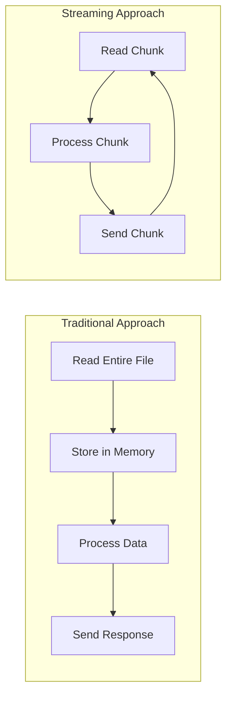
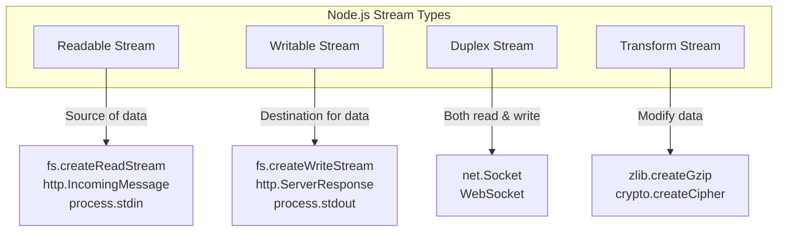
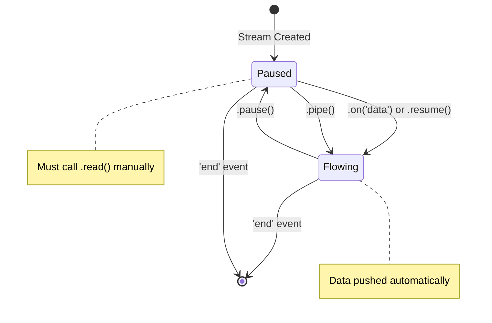
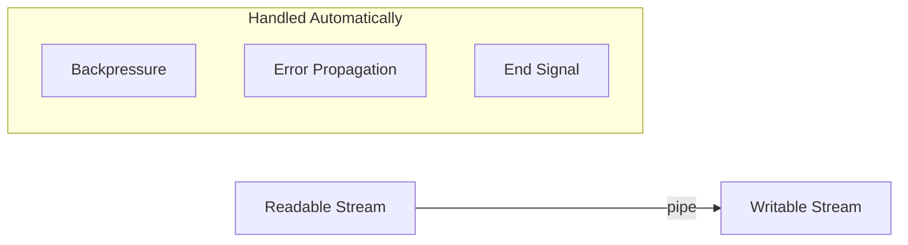
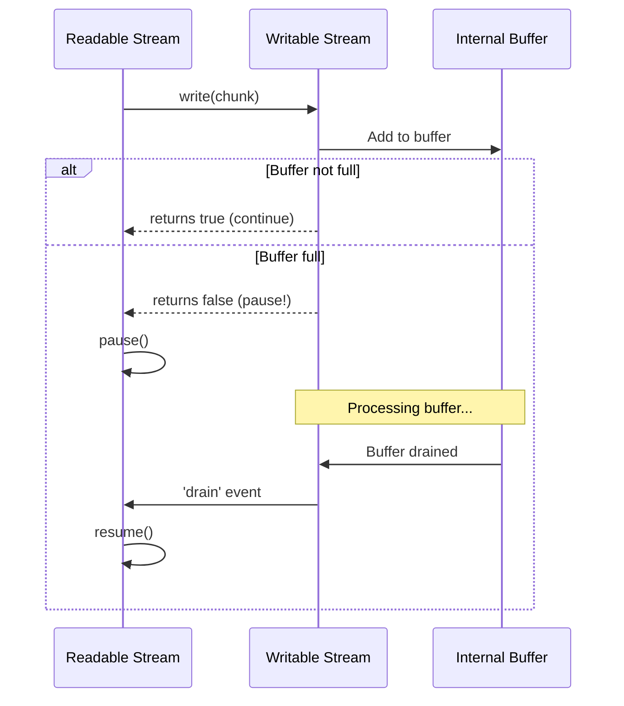
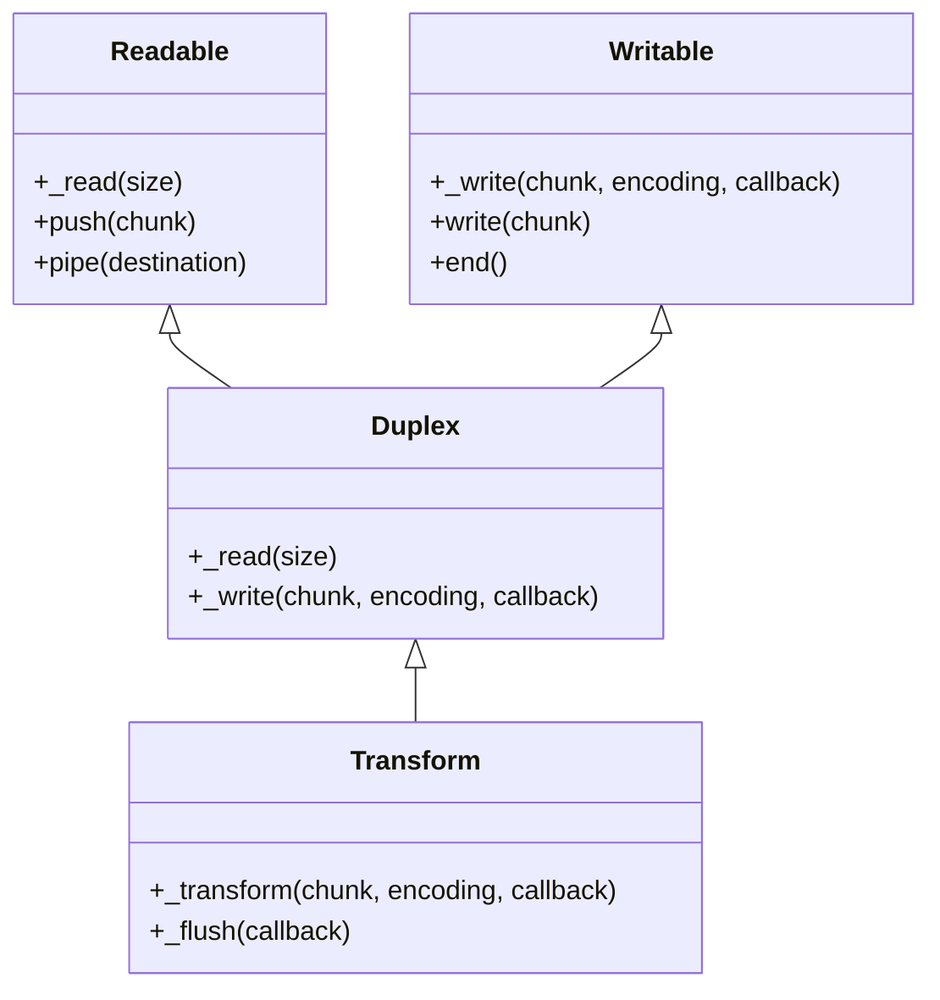
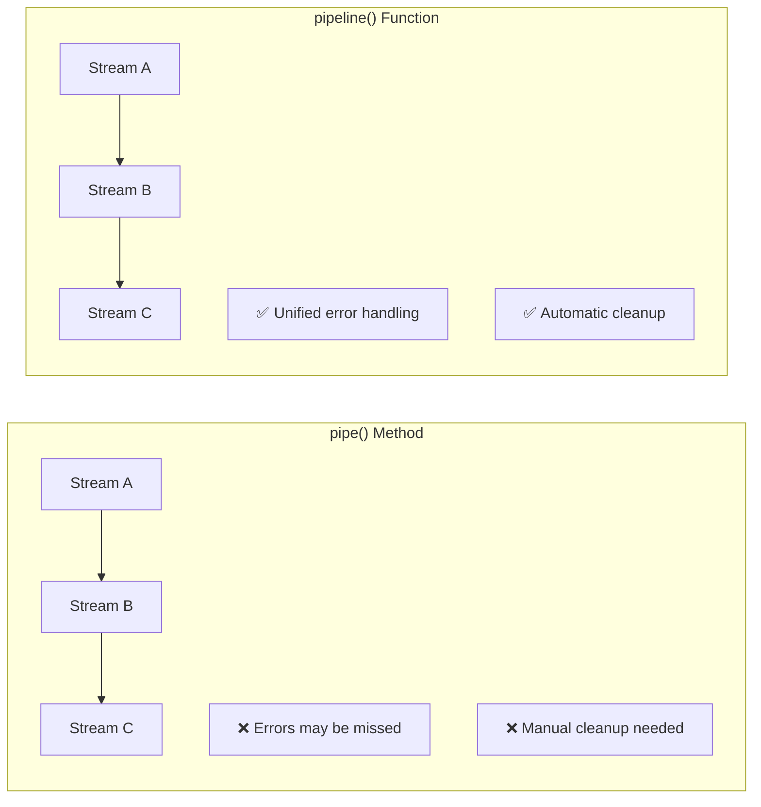
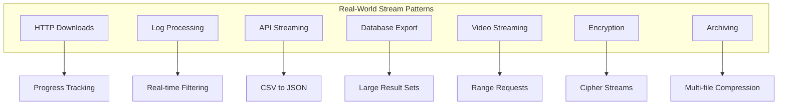
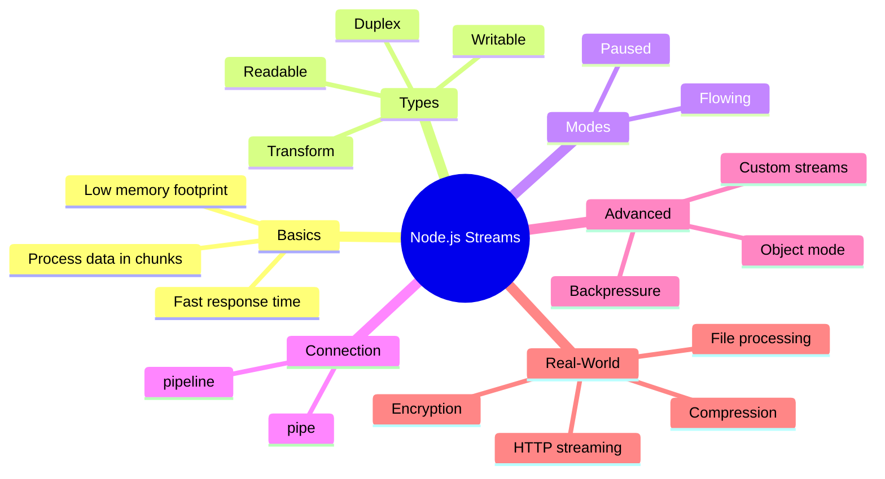

# How Streams Work in Node.js: From Beginner to Advanced

Author: [nawazdhandala](https://github.com/nawazdhandala)

Tags: NodeJS, Streams, Performance, Backend, TypeScript, Tutorial

Description: A comprehensive course on Node.js Streams - from basic concepts and simple examples to advanced real-world patterns like file processing, HTTP streaming, and data pipelines.

---

Streams are one of the most powerful but often misunderstood features in Node.js. They allow you to process data piece by piece, without loading everything into memory at once. This makes them essential for handling large files, real-time data, and building efficient applications.

In this comprehensive guide, we'll start from the absolute basics and work our way up to advanced real-world patterns. By the end, you'll understand not just how to use streams, but why they work the way they do.

## What Are Streams?

Think of streams like water flowing through a pipe. Instead of filling up a bucket (loading everything into memory) and then using the water, you use the water as it flows through the pipe. This is exactly how Node.js streams work with data.



### The Problem Streams Solve

Let's say you need to read a 2GB log file and send it to a client. Here's the naive approach:

```typescript
import * as fs from 'fs';
import * as http from 'http';
import type { IncomingMessage, ServerResponse } from 'http';

// DON'T DO THIS - loads entire file into memory
const server = http.createServer((req: IncomingMessage, res: ServerResponse) => {
  fs.readFile('./huge-log-file.log', (err: NodeJS.ErrnoException | null, data: Buffer) => {
    if (err) {
      res.statusCode = 500;
      res.end('Error reading file');
      return;
    }
    res.end(data); // Sends 2GB from memory
  });
});
```

This approach has several problems:
- **Memory Usage**: The entire 2GB file sits in memory
- **Slow Start**: The client waits until the whole file is read before receiving anything
- **Scalability**: Multiple requests could crash your server from memory exhaustion

Here's the same thing with streams:

```typescript
import { createReadStream } from 'fs';
import { createServer, IncomingMessage, ServerResponse } from 'http';

// DO THIS - streams data in chunks
const server = createServer((req: IncomingMessage, res: ServerResponse) => {
  const stream = createReadStream('./huge-log-file.log');
  stream.pipe(res); // Data flows directly to response
});
```

With streams:
- **Low Memory**: Only a small chunk (typically 64KB) is in memory at a time
- **Fast Start**: Client starts receiving data immediately
- **Scalable**: Can handle many concurrent requests

## The Four Types of Streams

Node.js has four fundamental stream types. Understanding these is key to mastering streams.



### 1. Readable Streams

Readable streams are sources of data. They produce data that you can consume.

**Common examples:**
- `fs.createReadStream()` - reading files
- `http.IncomingMessage` - HTTP request bodies
- `process.stdin` - terminal input

```typescript
import { createReadStream, ReadStream } from 'fs';

// Create a readable stream from a file
const readStream: ReadStream = createReadStream('./data.txt', {
  encoding: 'utf8',  // Return strings instead of buffers
  highWaterMark: 1024 // Read 1KB chunks (default is 64KB)
});

// Event: 'data' - emitted when a chunk is available
readStream.on('data', (chunk: string) => {
  console.log('Received chunk:', chunk.length, 'bytes');
});

// Event: 'end' - emitted when no more data
readStream.on('end', () => {
  console.log('Finished reading file');
});

// Event: 'error' - emitted on error
readStream.on('error', (err: NodeJS.ErrnoException) => {
  console.error('Error reading file:', err.message);
});
```

### 2. Writable Streams

Writable streams are destinations for data. You write data to them.

**Common examples:**
- `fs.createWriteStream()` - writing to files
- `http.ServerResponse` - HTTP responses
- `process.stdout` - terminal output

```typescript
import { createWriteStream, WriteStream } from 'fs';

// Create a writable stream to a file
const writeStream: WriteStream = createWriteStream('./output.txt');

// Write data in chunks
writeStream.write('Hello, ');
writeStream.write('World!\n');
writeStream.write('This is written in chunks.');

// Signal that we're done writing
writeStream.end();

// Event: 'finish' - emitted when all data has been flushed
writeStream.on('finish', () => {
  console.log('Finished writing to file');
});

// Event: 'error' - emitted on error
writeStream.on('error', (err: NodeJS.ErrnoException) => {
  console.error('Error writing file:', err.message);
});
```

### 3. Duplex Streams

Duplex streams can both read and write data. They're like a two-way pipe.

**Common examples:**
- TCP sockets (`net.Socket`)
- WebSocket connections

```typescript
import { createServer, Socket, Server } from 'net';

// Create a TCP server - each connection is a duplex stream
const server: Server = createServer((socket: Socket) => {
  // socket is a duplex stream
  
  // Read from the client
  socket.on('data', (data: Buffer) => {
    console.log('Received:', data.toString());
    
    // Write back to the client (echo server)
    socket.write('Echo: ' + data.toString());
  });
  
  socket.on('end', () => {
    console.log('Client disconnected');
  });
});

server.listen(3000, () => {
  console.log('Server listening on port 3000');
});
```

### 4. Transform Streams

Transform streams modify data as it passes through. They're duplex streams where the output is computed from the input.

**Common examples:**
- `zlib.createGzip()` - compression
- `crypto.createCipher()` - encryption

```typescript
import { Transform, TransformCallback } from 'stream';

// Create a transform stream that converts text to uppercase
const upperCaseTransform = new Transform({
  transform(chunk: Buffer, encoding: BufferEncoding, callback: TransformCallback): void {
    // Transform the chunk
    const upperCased = chunk.toString().toUpperCase();
    
    // Push the transformed data
    this.push(upperCased);
    
    // Signal that we're done processing this chunk
    callback();
  }
});

// Use the transform stream
process.stdin
  .pipe(upperCaseTransform)
  .pipe(process.stdout);

// Now type in your terminal - text will be uppercased!
```

## Understanding Stream Modes

Readable streams operate in one of two modes: **flowing** and **paused**.



### Flowing Mode

In flowing mode, data is read automatically and provided as fast as possible through events.

```typescript
import { createReadStream, ReadStream } from 'fs';

const readStream: ReadStream = createReadStream('./data.txt');

// Attaching a 'data' listener switches to flowing mode
readStream.on('data', (chunk: Buffer) => {
  console.log('Chunk received:', chunk.length);
});
```

### Paused Mode

In paused mode, you must explicitly call `read()` to get chunks of data.

```typescript
import { createReadStream, ReadStream } from 'fs';

const readStream: ReadStream = createReadStream('./data.txt');

// Stream starts in paused mode
readStream.on('readable', () => {
  let chunk: Buffer | null;
  
  // Explicitly read chunks
  while ((chunk = readStream.read()) !== null) {
    console.log('Read chunk:', chunk.length);
  }
});
```

### Switching Between Modes

```typescript
import { createReadStream, ReadStream } from 'fs';

const readStream: ReadStream = createReadStream('./data.txt');

// Start flowing
readStream.on('data', (chunk: Buffer) => {
  console.log('Got chunk');
  
  // Pause the stream
  readStream.pause();
  
  // Resume after 1 second
  setTimeout(() => {
    readStream.resume();
  }, 1000);
});
```

## The Pipe Method

The `pipe()` method is the simplest way to connect streams. It handles backpressure automatically.



```typescript
import { createReadStream, createWriteStream, ReadStream, WriteStream } from 'fs';

// Simple file copy
const source: ReadStream = createReadStream('./source.txt');
const destination: WriteStream = createWriteStream('./destination.txt');

source.pipe(destination);

destination.on('finish', () => {
  console.log('File copied successfully');
});
```

### Chaining Pipes

You can chain multiple streams together:

```typescript
import { createReadStream, createWriteStream } from 'fs';
import { createGzip } from 'zlib';

// Read file -> Compress -> Write compressed file
createReadStream('./large-file.txt')
  .pipe(createGzip())
  .pipe(createWriteStream('./large-file.txt.gz'))
  .on('finish', () => {
    console.log('File compressed successfully');
  });
```

### Decompression Chain

```typescript
import { createReadStream, createWriteStream } from 'fs';
import { createGunzip } from 'zlib';

// Read compressed file -> Decompress -> Write decompressed file
createReadStream('./large-file.txt.gz')
  .pipe(createGunzip())
  .pipe(createWriteStream('./large-file-restored.txt'))
  .on('finish', () => {
    console.log('File decompressed successfully');
  });
```

## Understanding Backpressure

Backpressure occurs when data is being produced faster than it can be consumed. Without proper handling, this can cause memory issues.



### The Problem

```typescript
import { createReadStream, createWriteStream, ReadStream, WriteStream } from 'fs';

const readStream: ReadStream = createReadStream('./huge-file.bin');
const writeStream: WriteStream = createWriteStream('./slow-destination.bin');

// If writing is slow, data accumulates in memory
readStream.on('data', (chunk: Buffer) => {
  writeStream.write(chunk); // What if this can't keep up?
});
```

### Manual Backpressure Handling

```typescript
import { createReadStream, createWriteStream, ReadStream, WriteStream } from 'fs';

const readStream: ReadStream = createReadStream('./huge-file.bin');
const writeStream: WriteStream = createWriteStream('./slow-destination.bin');

readStream.on('data', (chunk: Buffer) => {
  // write() returns false if internal buffer is full
  const canContinue: boolean = writeStream.write(chunk);
  
  if (!canContinue) {
    // Pause reading until writing catches up
    readStream.pause();
  }
});

// Resume reading when write buffer drains
writeStream.on('drain', () => {
  readStream.resume();
});

readStream.on('end', () => {
  writeStream.end();
});
```

### Let Pipe Handle It

The `pipe()` method handles backpressure automatically:

```typescript
import { createReadStream, createWriteStream } from 'fs';

// pipe() handles all the backpressure logic for you
createReadStream('./huge-file.bin')
  .pipe(createWriteStream('./destination.bin'));
```

## Creating Custom Streams

Now let's create our own streams. This is where streams become really powerful.



### Custom Readable Stream

```typescript
import { Readable } from 'stream';

// A readable stream that produces numbers
class NumberStream extends Readable {
  private current: number = 0;
  private max: number;
  
  constructor(max: number) {
    super();
    this.max = max;
  }
  
  _read(): void {
    if (this.current <= this.max) {
      // Push data into the stream
      this.push(String(this.current) + '\n');
      this.current++;
    } else {
      // Push null to signal end of stream
      this.push(null);
    }
  }
}

// Use the custom stream
const numberStream = new NumberStream(5);
numberStream.pipe(process.stdout);

// Output:
// 0
// 1
// 2
// 3
// 4
// 5
```

### Custom Writable Stream

```typescript
import { Writable, WritableOptions } from 'stream';

// A writable stream that logs chunks
class LoggerStream extends Writable {
  private prefix: string;
  
  constructor(prefix: string, options?: WritableOptions) {
    super(options);
    this.prefix = prefix;
  }
  
  _write(chunk: Buffer, encoding: BufferEncoding, callback: (error?: Error | null) => void): void {
    console.log(`${this.prefix}: ${chunk.toString().trim()}`);
    
    // Call callback when done processing
    // Pass error as first argument if something went wrong
    callback();
  }
}

// Use the custom stream
const logger = new LoggerStream('[LOG]');

logger.write('Hello\n');
logger.write('World\n');
logger.end();

// Output:
// [LOG]: Hello
// [LOG]: World
```

### Custom Transform Stream

```typescript
import { Transform, TransformCallback, TransformOptions } from 'stream';
import { createReadStream } from 'fs';

interface CSVRow {
  [key: string]: string;
}

// Transform stream that converts CSV to JSON
class CSVToJSON extends Transform {
  private headers: string[] | null = null;
  private buffer: string = '';
  
  constructor(options?: TransformOptions) {
    super({ ...options, objectMode: true }); // Output JavaScript objects
  }
  
  _transform(chunk: Buffer, encoding: BufferEncoding, callback: TransformCallback): void {
    this.buffer += chunk.toString();
    const lines = this.buffer.split('\n');
    
    // Keep incomplete line in buffer
    this.buffer = lines.pop() || '';
    
    for (const line of lines) {
      if (!line.trim()) continue;
      
      const values = line.split(',').map(v => v.trim());
      
      if (!this.headers) {
        this.headers = values;
      } else {
        const obj: CSVRow = {};
        this.headers.forEach((header, i) => {
          obj[header] = values[i];
        });
        this.push(obj);
      }
    }
    
    callback();
  }
  
  _flush(callback: TransformCallback): void {
    // Handle any remaining data in buffer
    if (this.buffer.trim() && this.headers) {
      const values = this.buffer.split(',').map(v => v.trim());
      const obj: CSVRow = {};
      this.headers.forEach((header, i) => {
        obj[header] = values[i];
      });
      this.push(obj);
    }
    callback();
  }
}

// Use the transform stream
createReadStream('./data.csv')
  .pipe(new CSVToJSON())
  .on('data', (obj: CSVRow) => {
    console.log('Row:', obj);
  })
  .on('end', () => {
    console.log('Done parsing CSV');
  });
```

## Object Mode Streams

By default, streams work with Buffers or strings. Object mode allows streams to work with any JavaScript values.

```typescript
import { Transform, TransformCallback, Readable } from 'stream';

interface User {
  name: string;
  active: boolean;
}

// Transform stream in object mode
const filterUsers = new Transform({
  objectMode: true,
  transform(user: User, encoding: BufferEncoding, callback: TransformCallback): void {
    // Only pass through active users
    if (user.active) {
      this.push(user);
    }
    callback();
  }
});

// Use it in a pipeline
const users: User[] = [
  { name: 'Alice', active: true },
  { name: 'Bob', active: false },
  { name: 'Charlie', active: true },
];

// Create readable from array
Readable.from(users)
  .pipe(filterUsers)
  .on('data', (user: User) => {
    console.log('Active user:', user.name);
  });

// Output:
// Active user: Alice
// Active user: Charlie
```

## The Pipeline Function

Node.js provides `pipeline()` as a better alternative to `pipe()`. It handles errors properly and cleans up streams.



```typescript
import { pipeline } from 'stream';
import { createReadStream, createWriteStream } from 'fs';
import { createGzip } from 'zlib';

// Using pipeline with callback
pipeline(
  createReadStream('./input.txt'),
  createGzip(),
  createWriteStream('./input.txt.gz'),
  (err: NodeJS.ErrnoException | null) => {
    if (err) {
      console.error('Pipeline failed:', err);
    } else {
      console.log('Pipeline succeeded');
    }
  }
);
```

### Pipeline with Promises

```typescript
import { pipeline } from 'stream/promises';
import { createReadStream, createWriteStream } from 'fs';
import { createGzip } from 'zlib';

async function compress(): Promise<void> {
  try {
    await pipeline(
      createReadStream('./input.txt'),
      createGzip(),
      createWriteStream('./input.txt.gz')
    );
    console.log('Compression complete');
  } catch (err) {
    console.error('Compression failed:', err);
  }
}

compress();
```

## Real-World Examples

Now let's look at practical applications of streams.



### Example 1: HTTP File Download with Progress

```typescript
import * as https from 'https';
import { createWriteStream, WriteStream } from 'fs';
import { Transform, TransformCallback } from 'stream';
import type { IncomingMessage } from 'http';

function downloadWithProgress(url: string, destination: string): Promise<void> {
  return new Promise((resolve, reject) => {
    https.get(url, (response: IncomingMessage) => {
      const totalBytes = parseInt(response.headers['content-length'] || '0', 10);
      let downloadedBytes = 0;
      
      // Transform stream to track progress
      const progressTracker = new Transform({
        transform(chunk: Buffer, encoding: BufferEncoding, callback: TransformCallback): void {
          downloadedBytes += chunk.length;
          const percent = ((downloadedBytes / totalBytes) * 100).toFixed(2);
          process.stdout.write(`\rDownloading: ${percent}%`);
          callback(null, chunk);
        }
      });
      
      const file: WriteStream = createWriteStream(destination);
      
      response
        .pipe(progressTracker)
        .pipe(file)
        .on('finish', () => {
          console.log('\nDownload complete!');
          resolve();
        })
        .on('error', reject);
    }).on('error', reject);
  });
}

// Usage
downloadWithProgress(
  'https://example.com/large-file.zip',
  './downloaded-file.zip'
);
```

### Example 2: Real-time Log Processing

```typescript
import { createReadStream } from 'fs';
import { createInterface, Interface } from 'readline';

interface LogError {
  timestamp: string;
  message: string;
  level: 'ERROR' | 'FATAL';
}

// Process a log file line by line
function processLogs(logFile: string): void {
  const rl: Interface = createInterface({
    input: createReadStream(logFile),
    crlfDelay: Infinity
  });
  
  const errors: LogError[] = [];
  
  rl.on('line', (line: string) => {
    if (line.includes('ERROR') || line.includes('FATAL')) {
      const timestamp = line.substring(0, 23);
      const message = line.substring(24);
      errors.push({ 
        timestamp, 
        message, 
        level: line.includes('FATAL') ? 'FATAL' : 'ERROR' 
      });
    }
  });
  
  rl.on('close', () => {
    console.log(`Found ${errors.length} errors:`);
    errors.forEach((err: LogError) => {
      console.log(`[${err.level}] ${err.timestamp}: ${err.message}`);
    });
  });
}

processLogs('./application.log');
```

### Example 3: CSV to JSON API Stream

```typescript
import { createServer, IncomingMessage, ServerResponse, Server } from 'http';
import { createReadStream } from 'fs';
import { Transform, TransformCallback } from 'stream';

// Transform CSV to JSON Lines (NDJSON)
class CSVToJSONLines extends Transform {
  private headers: string[] | null = null;
  private buffer: string = '';
  
  constructor() {
    super();
  }
  
  _transform(chunk: Buffer, encoding: BufferEncoding, callback: TransformCallback): void {
    this.buffer += chunk.toString();
    const lines = this.buffer.split('\n');
    this.buffer = lines.pop() || ''; // Keep incomplete line
    
    let output = '';
    
    for (const line of lines) {
      if (!line.trim()) continue;
      
      const values = line.split(',').map(v => v.trim());
      
      if (!this.headers) {
        this.headers = values;
      } else {
        const obj: Record<string, string> = {};
        this.headers.forEach((header, i) => {
          obj[header] = values[i];
        });
        output += JSON.stringify(obj) + '\n';
      }
    }
    
    if (output) {
      this.push(output);
    }
    callback();
  }
  
  _flush(callback: TransformCallback): void {
    if (this.buffer.trim() && this.headers) {
      const values = this.buffer.split(',').map(v => v.trim());
      const obj: Record<string, string> = {};
      this.headers.forEach((header, i) => {
        obj[header] = values[i];
      });
      this.push(JSON.stringify(obj) + '\n');
    }
    callback();
  }
}

// Create HTTP server that streams CSV as JSON
const server: Server = createServer((req: IncomingMessage, res: ServerResponse) => {
  if (req.url === '/data') {
    res.setHeader('Content-Type', 'application/x-ndjson');
    
    createReadStream('./large-data.csv')
      .pipe(new CSVToJSONLines())
      .pipe(res);
  } else {
    res.statusCode = 404;
    res.end('Not found');
  }
});

server.listen(3000, () => {
  console.log('Server listening on port 3000');
});
```

### Example 4: Video/Audio Streaming Server

```typescript
import { createServer, IncomingMessage, ServerResponse, Server } from 'http';
import { createReadStream, stat, Stats } from 'fs';
import { join } from 'path';

const server: Server = createServer((req: IncomingMessage, res: ServerResponse) => {
  const videoPath = join(__dirname, 'video.mp4');
  
  stat(videoPath, (err: NodeJS.ErrnoException | null, stats: Stats) => {
    if (err) {
      res.statusCode = 404;
      res.end('Video not found');
      return;
    }
    
    const fileSize = stats.size;
    const range = req.headers.range;
    
    if (range) {
      // Handle range request for video seeking
      const parts = range.replace(/bytes=/, '').split('-');
      const start = parseInt(parts[0], 10);
      const end = parts[1] ? parseInt(parts[1], 10) : fileSize - 1;
      const chunkSize = end - start + 1;
      
      const file = createReadStream(videoPath, { start, end });
      
      res.writeHead(206, {
        'Content-Range': `bytes ${start}-${end}/${fileSize}`,
        'Accept-Ranges': 'bytes',
        'Content-Length': chunkSize,
        'Content-Type': 'video/mp4',
      });
      
      file.pipe(res);
    } else {
      // Stream entire video
      res.writeHead(200, {
        'Content-Length': fileSize,
        'Content-Type': 'video/mp4',
      });
      
      createReadStream(videoPath).pipe(res);
    }
  });
});

server.listen(3000, () => {
  console.log('Video server listening on port 3000');
});
```

### Example 5: Encryption/Decryption Pipeline

```typescript
import { createCipheriv, createDecipheriv, randomBytes, CipherGCMTypes } from 'crypto';
import { createReadStream, createWriteStream } from 'fs';
import { pipeline } from 'stream/promises';

const algorithm: CipherGCMTypes = 'aes-256-gcm';

interface EncryptionKeys {
  key: Buffer;
  iv: Buffer;
}

async function encryptFile(inputPath: string, outputPath: string): Promise<EncryptionKeys> {
  // Generate key and IV (in production, store these securely)
  const key = randomBytes(32);
  const iv = randomBytes(16);
  
  const cipher = createCipheriv(algorithm, key, iv);
  
  await pipeline(
    createReadStream(inputPath),
    cipher,
    createWriteStream(outputPath)
  );
  
  console.log('File encrypted successfully');
  return { key, iv };
}

async function decryptFile(
  inputPath: string, 
  outputPath: string, 
  key: Buffer, 
  iv: Buffer
): Promise<void> {
  const decipher = createDecipheriv(algorithm, key, iv);
  
  await pipeline(
    createReadStream(inputPath),
    decipher,
    createWriteStream(outputPath)
  );
  
  console.log('File decrypted successfully');
}

// Usage
async function main(): Promise<void> {
  const { key, iv } = await encryptFile('./secret.txt', './secret.enc');
  await decryptFile('./secret.enc', './secret-decrypted.txt', key, iv);
}

main().catch(console.error);
```

### Example 6: Multi-File Compression (Creating a TAR-like Archive)

```typescript
import { createReadStream, createWriteStream, promises as fsPromises } from 'fs';
import { basename } from 'path';
import { createGzip } from 'zlib';
import { PassThrough } from 'stream';
import { pipeline } from 'stream/promises';

// Create a simple archive format
class Archiver extends PassThrough {
  async addFile(filePath: string): Promise<void> {
    const stat = await fsPromises.stat(filePath);
    const fileName = basename(filePath);
    
    // Write header: filename length (4 bytes) + filename + file size (8 bytes)
    const header = Buffer.alloc(4 + fileName.length + 8);
    header.writeUInt32BE(fileName.length, 0);
    header.write(fileName, 4);
    header.writeBigUInt64BE(BigInt(stat.size), 4 + fileName.length);
    
    this.push(header);
    
    // Stream file content
    const fileStream = createReadStream(filePath);
    for await (const chunk of fileStream) {
      this.push(chunk);
    }
  }
  
  finish(): void {
    this.push(null);
  }
}

async function createArchive(files: string[], outputPath: string): Promise<void> {
  const archiver = new Archiver();
  const gzip = createGzip();
  const output = createWriteStream(outputPath);
  
  // Start the pipeline
  const pipelinePromise = pipeline(archiver, gzip, output);
  
  // Add files
  for (const file of files) {
    await archiver.addFile(file);
    console.log(`Added: ${file}`);
  }
  
  archiver.finish();
  await pipelinePromise;
  
  console.log('Archive created successfully');
}

// Usage
createArchive(['./file1.txt', './file2.txt', './file3.txt'], './archive.gz');
```

## Stream Performance Tips

### 1. Choose the Right highWaterMark

The `highWaterMark` option controls the buffer size. Default is 16KB for object mode, 64KB for binary.

```typescript
import { createReadStream, ReadStream } from 'fs';

// For small files or memory-constrained environments
const smallChunkStream: ReadStream = createReadStream('./file.txt', {
  highWaterMark: 16 * 1024 // 16KB chunks
});

// For large files on systems with more memory
const largeChunkStream: ReadStream = createReadStream('./large-file.bin', {
  highWaterMark: 1024 * 1024 // 1MB chunks - fewer I/O operations
});
```

### 2. Use pipeline() Instead of pipe()

`pipeline()` properly handles errors and cleanup:

```typescript
import { pipeline } from 'stream/promises';
import { Readable, Transform, Writable } from 'stream';

declare const source: Readable;
declare const transform: Transform;
declare const destination: Writable;

// Good - errors are handled, streams are cleaned up
await pipeline(source, transform, destination);

// Avoid - errors can be missed, streams may not be cleaned up
source.pipe(transform).pipe(destination);
```

### 3. Avoid Synchronous Operations in Transform

```typescript
import { Transform, TransformCallback } from 'stream';

declare function heavySyncOperation(chunk: Buffer): Buffer;

// BAD - blocks the event loop
const badTransform = new Transform({
  transform(chunk: Buffer, encoding: BufferEncoding, callback: TransformCallback): void {
    const result = heavySyncOperation(chunk); // Blocks!
    callback(null, result);
  }
});

// GOOD - use setImmediate to yield to event loop
const goodTransform = new Transform({
  transform(chunk: Buffer, encoding: BufferEncoding, callback: TransformCallback): void {
    setImmediate(() => {
      const result = heavySyncOperation(chunk);
      callback(null, result);
    });
  }
});
```

### 4. Use Readable.from() for Easy Stream Creation

```typescript
import { Readable } from 'stream';

// Create stream from array
const arrayStream: Readable = Readable.from(['a', 'b', 'c']);

// Create stream from async generator
async function* generateData(): AsyncGenerator<string> {
  for (let i = 0; i < 100; i++) {
    yield `Item ${i}\n`;
    await new Promise<void>(r => setTimeout(r, 10)); // Simulate async
  }
}

const asyncStream: Readable = Readable.from(generateData());
asyncStream.pipe(process.stdout);
```

## Error Handling Best Practices

### Always Handle Errors

```typescript
import { pipeline } from 'stream/promises';
import { createReadStream, createWriteStream } from 'fs';
import { Transform } from 'stream';

declare const transformStream: Transform;

async function processFile(): Promise<void> {
  try {
    await pipeline(
      createReadStream('./input.txt'),
      transformStream,
      createWriteStream('./output.txt')
    );
  } catch (err) {
    const error = err as NodeJS.ErrnoException;
    // Handle specific error types
    if (error.code === 'ENOENT') {
      console.error('Input file not found');
    } else if (error.code === 'EACCES') {
      console.error('Permission denied');
    } else {
      console.error('Stream error:', error.message);
    }
  }
}
```

### Clean Up on Errors

```typescript
import { finished } from 'stream/promises';
import { createReadStream, createWriteStream, promises as fsPromises, ReadStream, WriteStream } from 'fs';

async function safeStreamProcessing(): Promise<void> {
  const readStream: ReadStream = createReadStream('./input.txt');
  const writeStream: WriteStream = createWriteStream('./output.txt');
  
  try {
    readStream.pipe(writeStream);
    await finished(writeStream);
  } catch (err) {
    // Clean up streams
    readStream.destroy();
    writeStream.destroy();
    
    // Remove partially written file
    await fsPromises.unlink('./output.txt').catch(() => {});
    
    throw err;
  }
}
```

## Summary

Streams are a fundamental pattern in Node.js that enable efficient data processing. Here's what we covered:



1. **Basic Concepts**: Streams process data in chunks, reducing memory usage
2. **Four Types**: Readable, Writable, Duplex, and Transform streams
3. **Modes**: Flowing mode (automatic) vs Paused mode (manual)
4. **pipe()**: Connects streams and handles backpressure automatically
5. **pipeline()**: Better error handling and cleanup than pipe()
6. **Custom Streams**: Create your own for specific use cases
7. **Object Mode**: Work with JavaScript objects, not just buffers
8. **Real-World Examples**: File processing, HTTP streaming, compression, encryption

Streams become intuitive with practice. Start with simple pipe operations and gradually move to custom transforms as you get comfortable. The key insight is that streams let you write code that scales from small files to enormous datasets without changing your approach.

For more Node.js patterns, check out our guides on [connection pooling](https://oneuptime.com/blog/post/2026-01-06-nodejs-connection-pooling-postgresql-mysql/view), [graceful shutdown](https://oneuptime.com/blog/post/2026-01-06-nodejs-graceful-shutdown-handler/view), and [OpenTelemetry instrumentation](https://oneuptime.com/blog/post/2026-01-06-nodejs-express-opentelemetry-instrumentation/view).
