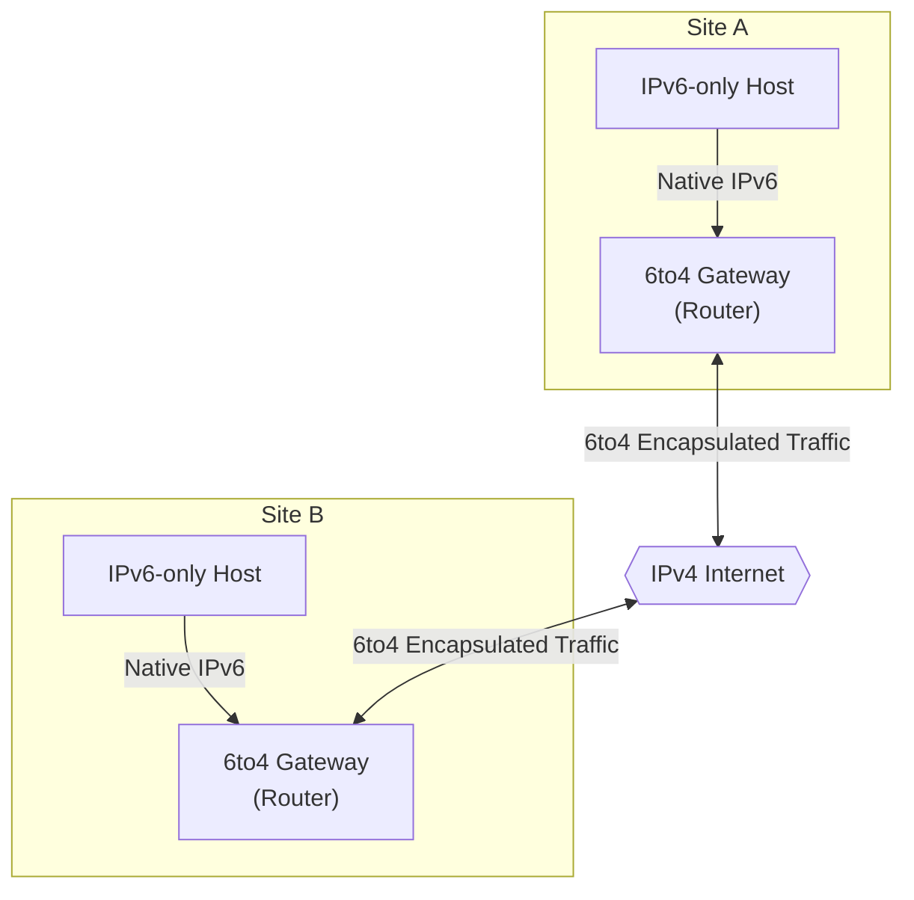

# How to Implement 6to4 Tunneling for IPv6 Connectivity

Author: [nawazdhandala](https://github.com/nawazdhandala)

Tags: IPv6, Tunneling, Networking, Linux, Infrastructure, DevOps

Description: A comprehensive guide to implementing 6to4 tunneling for establishing IPv6 connectivity over existing IPv4 infrastructure, covering configuration, best practices, and troubleshooting.

---

## Introduction

As the internet continues its transition from IPv4 to IPv6, network administrators face the challenge of maintaining connectivity across both protocols. IPv4 address exhaustion has made IPv6 adoption essential, but the reality is that many networks still rely heavily on IPv4 infrastructure. This is where transition mechanisms like 6to4 tunneling become invaluable.

6to4 is an automatic tunneling technique that allows IPv6 packets to be transmitted over an IPv4 network without the need for explicit tunnel configuration between endpoints. It provides a practical solution for organizations that want to enable IPv6 connectivity while leveraging their existing IPv4 infrastructure.

In this comprehensive guide, we will explore the fundamentals of 6to4 tunneling, walk through implementation on various platforms, discuss best practices, and address common challenges you may encounter.

## Understanding 6to4 Tunneling

### What is 6to4 Tunneling?

6to4 tunneling is a transition mechanism defined in RFC 3056 that enables IPv6 packets to be encapsulated within IPv4 packets for transmission across IPv4-only networks. The key characteristics of 6to4 include:

- **Automatic address assignment**: 6to4 uses a specific IPv6 prefix (2002::/16) combined with the public IPv4 address to create a unique IPv6 address
- **No explicit tunnel configuration**: Unlike manual tunnels, 6to4 does not require pre-configured endpoints
- **Relay routers**: Communication with native IPv6 networks occurs through 6to4 relay routers

### How 6to4 Address Derivation Works

The 6to4 address format follows a specific structure:

```
2002:WWXX:YYZZ::/48
```

Where `WWXX:YYZZ` is the hexadecimal representation of the IPv4 address. For example:

- IPv4 address: 203.0.113.1
- Hexadecimal conversion: 203 = CB, 0 = 00, 113 = 71, 1 = 01
- Resulting 6to4 prefix: 2002:CB00:7101::/48

This gives you a /48 prefix, which can be further subdivided into 65,536 /64 subnets.

### 6to4 Architecture Overview



## Prerequisites

Before implementing 6to4 tunneling, ensure you have:

1. **A public IPv4 address**: 6to4 requires a globally routable IPv4 address (not behind NAT)
2. **Root/Administrator access**: Configuration requires elevated privileges
3. **IPv6-capable operating system**: Most modern operating systems support IPv6
4. **Protocol 41 allowed**: Firewalls must permit IP protocol 41 (IPv6 encapsulation)

### Verifying Your IPv4 Address

First, confirm you have a public IPv4 address:

```bash
#!/bin/bash
# Script: check_public_ip.sh
# Description: Verify public IPv4 address for 6to4 compatibility

# Get the public IP address
PUBLIC_IP=$(curl -s https://api.ipify.org)

echo "Your public IPv4 address: $PUBLIC_IP"

# Check if it's a private IP (which would indicate NAT)
check_private_ip() {
    local ip=$1

    # Check for private IP ranges
    if [[ $ip =~ ^10\. ]] || \
       [[ $ip =~ ^172\.(1[6-9]|2[0-9]|3[01])\. ]] || \
       [[ $ip =~ ^192\.168\. ]] || \
       [[ $ip =~ ^127\. ]]; then
        return 0  # Is private
    fi
    return 1  # Is public
}

if check_private_ip "$PUBLIC_IP"; then
    echo "WARNING: This appears to be a private IP address."
    echo "6to4 tunneling requires a public IPv4 address."
    exit 1
else
    echo "SUCCESS: This is a public IPv4 address suitable for 6to4."
fi

# Calculate the 6to4 prefix
calculate_6to4_prefix() {
    local ipv4=$1
    local IFS='.'
    read -ra octets <<< "$ipv4"

    # Convert each octet to hexadecimal
    local hex1=$(printf '%02x' "${octets[0]}")
    local hex2=$(printf '%02x' "${octets[1]}")
    local hex3=$(printf '%02x' "${octets[2]}")
    local hex4=$(printf '%02x' "${octets[3]}")

    echo "2002:${hex1}${hex2}:${hex3}${hex4}::/48"
}

echo "Your 6to4 prefix will be: $(calculate_6to4_prefix $PUBLIC_IP)"
```

## Implementation on Linux

### Basic 6to4 Tunnel Configuration

Here is how to set up a 6to4 tunnel on a Linux system:

```bash
#!/bin/bash
# Script: setup_6to4_linux.sh
# Description: Configure 6to4 tunnel on Linux systems
# Requirements: Root privileges, public IPv4 address

set -e  # Exit on any error

# Configuration variables
# Replace with your actual public IPv4 address
PUBLIC_IPV4="203.0.113.1"

# 6to4 relay anycast address
RELAY_ADDRESS="192.88.99.1"

# Function to calculate 6to4 address
calculate_6to4_address() {
    local ipv4=$1
    local subnet=$2
    local host=$3
    local IFS='.'
    read -ra octets <<< "$ipv4"

    local hex1=$(printf '%02x' "${octets[0]}")
    local hex2=$(printf '%02x' "${octets[1]}")
    local hex3=$(printf '%02x' "${octets[2]}")
    local hex4=$(printf '%02x' "${octets[3]}")

    echo "2002:${hex1}${hex2}:${hex3}${hex4}:${subnet}::${host}"
}

# Step 1: Enable IPv6 forwarding (if acting as a router)
echo "Enabling IPv6 forwarding..."
sysctl -w net.ipv6.conf.all.forwarding=1
sysctl -w net.ipv6.conf.default.forwarding=1

# Step 2: Create the 6to4 tunnel interface
echo "Creating 6to4 tunnel interface..."
ip tunnel add tun6to4 mode sit remote any local $PUBLIC_IPV4 ttl 64

# Step 3: Bring up the tunnel interface
echo "Bringing up tunnel interface..."
ip link set tun6to4 up

# Step 4: Assign the 6to4 address to the tunnel interface
TUNNEL_ADDRESS=$(calculate_6to4_address $PUBLIC_IPV4 "0" "1")
echo "Assigning address $TUNNEL_ADDRESS/16 to tunnel..."
ip addr add $TUNNEL_ADDRESS/16 dev tun6to4

# Step 5: Add default IPv6 route through the 6to4 relay
echo "Adding default route to 6to4 relay..."
ip route add ::/0 via ::$RELAY_ADDRESS dev tun6to4 metric 1

# Step 6: Add route for 2002::/16 through the tunnel
echo "Adding 6to4 prefix route..."
ip route add 2002::/16 dev tun6to4 metric 1

echo ""
echo "6to4 tunnel configuration complete!"
echo "Tunnel interface: tun6to4"
echo "6to4 address: $TUNNEL_ADDRESS"
echo ""
echo "Testing connectivity..."
ping6 -c 3 ipv6.google.com || echo "Note: Ping may fail if IPv6 is not fully operational"
```

### Persistent Configuration with systemd

For persistence across reboots, create a systemd service:

```bash
#!/bin/bash
# Script: create_6to4_service.sh
# Description: Create systemd service for persistent 6to4 tunnel

# Configuration
PUBLIC_IPV4="203.0.113.1"
SERVICE_FILE="/etc/systemd/system/6to4-tunnel.service"
SCRIPT_FILE="/usr/local/bin/6to4-tunnel.sh"

# Create the tunnel script
cat > $SCRIPT_FILE << 'SCRIPT_EOF'
#!/bin/bash
# 6to4 Tunnel Management Script

PUBLIC_IPV4="203.0.113.1"
RELAY_ADDRESS="192.88.99.1"

calculate_6to4_address() {
    local ipv4=$1
    local IFS='.'
    read -ra octets <<< "$ipv4"
    local hex1=$(printf '%02x' "${octets[0]}")
    local hex2=$(printf '%02x' "${octets[1]}")
    local hex3=$(printf '%02x' "${octets[2]}")
    local hex4=$(printf '%02x' "${octets[3]}")
    echo "2002:${hex1}${hex2}:${hex3}${hex4}:0::1"
}

start_tunnel() {
    # Enable forwarding
    sysctl -w net.ipv6.conf.all.forwarding=1 > /dev/null

    # Create and configure tunnel
    ip tunnel add tun6to4 mode sit remote any local $PUBLIC_IPV4 ttl 64
    ip link set tun6to4 up

    TUNNEL_ADDR=$(calculate_6to4_address $PUBLIC_IPV4)
    ip addr add $TUNNEL_ADDR/16 dev tun6to4

    # Add routes
    ip route add ::/0 via ::$RELAY_ADDRESS dev tun6to4 metric 1
    ip route add 2002::/16 dev tun6to4 metric 1

    echo "6to4 tunnel started with address: $TUNNEL_ADDR"
}

stop_tunnel() {
    # Remove routes
    ip route del 2002::/16 dev tun6to4 2>/dev/null
    ip route del ::/0 via ::$RELAY_ADDRESS dev tun6to4 2>/dev/null

    # Remove tunnel interface
    ip link set tun6to4 down 2>/dev/null
    ip tunnel del tun6to4 2>/dev/null

    echo "6to4 tunnel stopped"
}

case "$1" in
    start)
        start_tunnel
        ;;
    stop)
        stop_tunnel
        ;;
    restart)
        stop_tunnel
        sleep 1
        start_tunnel
        ;;
    *)
        echo "Usage: $0 {start|stop|restart}"
        exit 1
        ;;
esac
SCRIPT_EOF

chmod +x $SCRIPT_FILE

# Create the systemd service file
cat > $SERVICE_FILE << 'SERVICE_EOF'
[Unit]
Description=6to4 IPv6 Tunnel Service
After=network.target
Wants=network-online.target

[Service]
Type=oneshot
RemainAfterExit=yes
ExecStart=/usr/local/bin/6to4-tunnel.sh start
ExecStop=/usr/local/bin/6to4-tunnel.sh stop
ExecReload=/usr/local/bin/6to4-tunnel.sh restart

[Install]
WantedBy=multi-user.target
SERVICE_EOF

# Update the script with the actual IP
sed -i "s/203.0.113.1/$PUBLIC_IPV4/g" $SCRIPT_FILE

# Reload systemd and enable the service
systemctl daemon-reload
systemctl enable 6to4-tunnel.service

echo "Service created and enabled!"
echo "Start with: systemctl start 6to4-tunnel"
echo "Check status: systemctl status 6to4-tunnel"
```

### Using Netplan (Ubuntu 18.04+)

For Ubuntu systems using Netplan, create a configuration file:

```yaml
# File: /etc/netplan/60-6to4-tunnel.yaml
# Description: Netplan configuration for 6to4 tunnel

network:
  version: 2
  renderer: networkd

  tunnels:
    # 6to4 tunnel interface configuration
    tun6to4:
      mode: sit
      local: 203.0.113.1      # Your public IPv4 address
      remote: any              # Accept from any remote

      addresses:
        # 6to4 derived address (replace with your calculated address)
        - "2002:cb00:7101::1/48"

      routes:
        # Default route through 6to4 relay
        - to: "::/0"
          via: "::192.88.99.1"
          metric: 100

        # Route for 6to4 prefix
        - to: "2002::/16"
          metric: 100
```

Apply the configuration:

```bash
# Validate the configuration
sudo netplan generate

# Apply the configuration
sudo netplan apply

# Verify the tunnel is up
ip -6 addr show dev tun6to4
ip -6 route show dev tun6to4
```

## Implementation on BSD/FreeBSD

### FreeBSD 6to4 Configuration

```bash
#!/bin/sh
# Script: setup_6to4_freebsd.sh
# Description: Configure 6to4 tunnel on FreeBSD

# Configuration
PUBLIC_IPV4="203.0.113.1"

# Calculate 6to4 prefix
calc_6to4() {
    echo $1 | awk -F. '{
        printf "2002:%02x%02x:%02x%02x", $1, $2, $3, $4
    }'
}

PREFIX=$(calc_6to4 $PUBLIC_IPV4)
TUNNEL_ADDR="${PREFIX}::1"

# Load the required kernel module
kldload if_stf

# Create the stf interface (6to4 interface in FreeBSD)
ifconfig stf0 create

# Configure the interface with the 6to4 address
ifconfig stf0 inet6 $TUNNEL_ADDR prefixlen 16

# Enable the interface
ifconfig stf0 up

# Add default IPv6 route
route add -inet6 default -interface stf0

# Verify configuration
echo "Configuration complete!"
echo "6to4 Address: $TUNNEL_ADDR"
ifconfig stf0
```

### Persistent FreeBSD Configuration

Add to `/etc/rc.conf`:

```bash
# /etc/rc.conf additions for 6to4 tunnel

# Enable IPv6
ipv6_enable="YES"

# Configure the stf0 (6to4) interface
# Replace with your calculated 6to4 address
cloned_interfaces="stf0"
ifconfig_stf0_ipv6="inet6 2002:cb00:7101::1 prefixlen 16"

# Set the default IPv6 route
ipv6_defaultrouter="stf0"

# Enable IPv6 forwarding (if acting as router)
ipv6_gateway_enable="YES"
```

## Implementation on Windows Server

### PowerShell Configuration

```powershell
# Script: Setup-6to4Tunnel.ps1
# Description: Configure 6to4 tunnel on Windows Server
# Requires: Administrator privileges

#Requires -RunAsAdministrator

param(
    [Parameter(Mandatory=$false)]
    [string]$PublicIPv4 = "203.0.113.1"
)

function Convert-IPv4To6to4 {
    param([string]$IPv4Address)

    $octets = $IPv4Address.Split('.')
    $hex1 = [Convert]::ToString([int]$octets[0], 16).PadLeft(2, '0')
    $hex2 = [Convert]::ToString([int]$octets[1], 16).PadLeft(2, '0')
    $hex3 = [Convert]::ToString([int]$octets[2], 16).PadLeft(2, '0')
    $hex4 = [Convert]::ToString([int]$octets[3], 16).PadLeft(2, '0')

    return "2002:${hex1}${hex2}:${hex3}${hex4}::1"
}

Write-Host "Configuring 6to4 Tunnel for Windows Server" -ForegroundColor Cyan
Write-Host "Public IPv4: $PublicIPv4" -ForegroundColor Yellow

# Calculate the 6to4 address
$6to4Address = Convert-IPv4To6to4 -IPv4Address $PublicIPv4
Write-Host "6to4 Address: $6to4Address" -ForegroundColor Yellow

# Step 1: Enable the 6to4 adapter
Write-Host "`nStep 1: Enabling 6to4 adapter..." -ForegroundColor Green
netsh interface 6to4 set state state=enabled

# Step 2: Configure the 6to4 relay
Write-Host "Step 2: Configuring 6to4 relay..." -ForegroundColor Green
netsh interface 6to4 set relay 192.88.99.1 enabled

# Step 3: Set the relay resolution interval
Write-Host "Step 3: Setting relay resolution interval..." -ForegroundColor Green
netsh interface 6to4 set relay interval=1440

# Step 4: Enable routing if this is a router
Write-Host "Step 4: Enabling IPv6 routing..." -ForegroundColor Green
netsh interface ipv6 set global randomizeidentifiers=disabled
Set-NetIPInterface -InterfaceAlias "6TO4 Adapter" -Forwarding Enabled

# Step 5: Verify the configuration
Write-Host "`nVerifying configuration..." -ForegroundColor Cyan

# Display 6to4 status
Write-Host "`n6to4 State:" -ForegroundColor Yellow
netsh interface 6to4 show state

# Display 6to4 relay configuration
Write-Host "`n6to4 Relay:" -ForegroundColor Yellow
netsh interface 6to4 show relay

# Display IPv6 addresses
Write-Host "`nIPv6 Addresses:" -ForegroundColor Yellow
Get-NetIPAddress -AddressFamily IPv6 | Where-Object {$_.IPAddress -like "2002:*"} |
    Format-Table InterfaceAlias, IPAddress, PrefixLength

# Test connectivity
Write-Host "`nTesting IPv6 connectivity..." -ForegroundColor Cyan
Test-Connection -ComputerName "ipv6.google.com" -Count 3 -ErrorAction SilentlyContinue

Write-Host "`nConfiguration complete!" -ForegroundColor Green
```

### Group Policy Configuration

For enterprise deployments, use Group Policy:

```powershell
# Script: Configure-6to4GPO.ps1
# Description: Configure 6to4 settings via Group Policy

# Registry keys for 6to4 configuration
$6to4RegistryPath = "HKLM:\SYSTEM\CurrentControlSet\Services\Tcpip6\Parameters"

# Enable 6to4
Set-ItemProperty -Path $6to4RegistryPath -Name "DisabledComponents" -Value 0x00 -Type DWord

# Configure 6to4 relay router
$relayPath = "HKLM:\SYSTEM\CurrentControlSet\Services\6to4\Parameters"
if (-not (Test-Path $relayPath)) {
    New-Item -Path $relayPath -Force
}

Set-ItemProperty -Path $relayPath -Name "RelayName" -Value "192.88.99.1" -Type String
Set-ItemProperty -Path $relayPath -Name "RelayResolutionInterval" -Value 1440 -Type DWord
Set-ItemProperty -Path $relayPath -Name "State" -Value 1 -Type DWord

Write-Host "Registry configuration applied. Restart required." -ForegroundColor Yellow
```

## Firewall Configuration

### iptables Rules for Linux

```bash
#!/bin/bash
# Script: configure_6to4_firewall.sh
# Description: Configure iptables rules for 6to4 tunnel

# Allow Protocol 41 (IPv6 encapsulation) for incoming traffic
iptables -A INPUT -p 41 -j ACCEPT

# Allow Protocol 41 for outgoing traffic
iptables -A OUTPUT -p 41 -j ACCEPT

# Allow forwarding of Protocol 41
iptables -A FORWARD -p 41 -j ACCEPT

# IPv6 firewall rules using ip6tables
# Allow ICMPv6 (required for IPv6 to function properly)
ip6tables -A INPUT -p icmpv6 -j ACCEPT
ip6tables -A OUTPUT -p icmpv6 -j ACCEPT
ip6tables -A FORWARD -p icmpv6 -j ACCEPT

# Allow established and related connections
ip6tables -A INPUT -m state --state ESTABLISHED,RELATED -j ACCEPT
ip6tables -A OUTPUT -m state --state ESTABLISHED,RELATED -j ACCEPT
ip6tables -A FORWARD -m state --state ESTABLISHED,RELATED -j ACCEPT

# Allow traffic on the 6to4 interface
ip6tables -A INPUT -i tun6to4 -j ACCEPT
ip6tables -A OUTPUT -o tun6to4 -j ACCEPT
ip6tables -A FORWARD -i tun6to4 -j ACCEPT
ip6tables -A FORWARD -o tun6to4 -j ACCEPT

# Log dropped packets (optional, useful for debugging)
ip6tables -A INPUT -j LOG --log-prefix "IPv6-INPUT-DROP: "
ip6tables -A FORWARD -j LOG --log-prefix "IPv6-FORWARD-DROP: "

# Save the rules
iptables-save > /etc/iptables/rules.v4
ip6tables-save > /etc/iptables/rules.v6

echo "Firewall rules configured for 6to4 tunnel"
```

### nftables Configuration (Modern Linux)

```bash
#!/usr/bin/nft -f
# File: /etc/nftables.d/6to4.nft
# Description: nftables rules for 6to4 tunnel

table inet 6to4_filter {
    chain input {
        type filter hook input priority 0; policy accept;

        # Allow Protocol 41 (6in4 encapsulation)
        ip protocol 41 accept comment "Allow 6to4 encapsulated traffic"

        # Allow ICMPv6
        ip6 nexthdr icmpv6 accept comment "Allow ICMPv6"

        # Allow traffic from 6to4 interface
        iifname "tun6to4" accept comment "Allow 6to4 tunnel input"
    }

    chain forward {
        type filter hook forward priority 0; policy accept;

        # Allow Protocol 41 forwarding
        ip protocol 41 accept comment "Forward 6to4 traffic"

        # Allow forwarding through tunnel interface
        iifname "tun6to4" accept comment "Forward from tunnel"
        oifname "tun6to4" accept comment "Forward to tunnel"
    }

    chain output {
        type filter hook output priority 0; policy accept;

        # Allow Protocol 41 outgoing
        ip protocol 41 accept comment "Allow outgoing 6to4"

        # Allow traffic to 6to4 interface
        oifname "tun6to4" accept comment "Allow 6to4 tunnel output"
    }
}
```

## Monitoring and Troubleshooting

### Comprehensive Monitoring Script

```bash
#!/bin/bash
# Script: monitor_6to4.sh
# Description: Monitor 6to4 tunnel health and performance

LOG_FILE="/var/log/6to4-monitor.log"
ALERT_EMAIL="admin@example.com"

log_message() {
    local level=$1
    local message=$2
    echo "$(date '+%Y-%m-%d %H:%M:%S') [$level] $message" | tee -a $LOG_FILE
}

check_tunnel_interface() {
    log_message "INFO" "Checking tunnel interface..."

    if ip link show tun6to4 &>/dev/null; then
        local state=$(ip link show tun6to4 | grep -o "state [A-Z]*" | awk '{print $2}')
        if [ "$state" = "UP" ]; then
            log_message "INFO" "Tunnel interface is UP"
            return 0
        else
            log_message "ERROR" "Tunnel interface is DOWN"
            return 1
        fi
    else
        log_message "ERROR" "Tunnel interface does not exist"
        return 1
    fi
}

check_ipv6_address() {
    log_message "INFO" "Checking IPv6 address assignment..."

    local addr=$(ip -6 addr show dev tun6to4 | grep "inet6 2002:" | awk '{print $2}')
    if [ -n "$addr" ]; then
        log_message "INFO" "6to4 address assigned: $addr"
        return 0
    else
        log_message "ERROR" "No 6to4 address assigned"
        return 1
    fi
}

check_routes() {
    log_message "INFO" "Checking IPv6 routes..."

    # Check for 6to4 prefix route
    if ip -6 route show | grep -q "2002::/16"; then
        log_message "INFO" "6to4 prefix route exists"
    else
        log_message "WARNING" "6to4 prefix route missing"
    fi

    # Check for default route
    if ip -6 route show default | grep -q "tun6to4"; then
        log_message "INFO" "Default IPv6 route via tunnel exists"
        return 0
    else
        log_message "WARNING" "Default route not via 6to4 tunnel"
        return 1
    fi
}

check_connectivity() {
    log_message "INFO" "Testing IPv6 connectivity..."

    # Test connectivity to well-known IPv6 addresses
    local test_hosts=("2001:4860:4860::8888" "2606:4700:4700::1111")
    local success=0

    for host in "${test_hosts[@]}"; do
        if ping6 -c 2 -W 5 $host &>/dev/null; then
            log_message "INFO" "Successfully reached $host"
            success=$((success + 1))
        else
            log_message "WARNING" "Failed to reach $host"
        fi
    done

    if [ $success -gt 0 ]; then
        return 0
    else
        return 1
    fi
}

measure_latency() {
    log_message "INFO" "Measuring tunnel latency..."

    local target="2001:4860:4860::8888"  # Google DNS
    local result=$(ping6 -c 5 -W 10 $target 2>/dev/null | tail -1 | awk -F'/' '{print $5}')

    if [ -n "$result" ]; then
        log_message "INFO" "Average latency to $target: ${result}ms"

        # Alert if latency is high
        if (( $(echo "$result > 200" | bc -l) )); then
            log_message "WARNING" "High latency detected: ${result}ms"
        fi
    else
        log_message "ERROR" "Unable to measure latency"
    fi
}

check_packet_stats() {
    log_message "INFO" "Checking interface statistics..."

    local stats=$(ip -s link show tun6to4 2>/dev/null)

    if [ -n "$stats" ]; then
        local rx_bytes=$(echo "$stats" | grep -A1 "RX:" | tail -1 | awk '{print $1}')
        local tx_bytes=$(echo "$stats" | grep -A1 "TX:" | tail -1 | awk '{print $1}')
        local rx_errors=$(echo "$stats" | grep -A1 "RX:" | tail -1 | awk '{print $3}')
        local tx_errors=$(echo "$stats" | grep -A1 "TX:" | tail -1 | awk '{print $3}')

        log_message "INFO" "RX: ${rx_bytes} bytes, TX: ${tx_bytes} bytes"
        log_message "INFO" "RX Errors: ${rx_errors}, TX Errors: ${tx_errors}"

        if [ "$rx_errors" -gt 0 ] || [ "$tx_errors" -gt 0 ]; then
            log_message "WARNING" "Packet errors detected"
        fi
    fi
}

run_full_check() {
    log_message "INFO" "========== Starting 6to4 Tunnel Health Check =========="

    local failures=0

    check_tunnel_interface || failures=$((failures + 1))
    check_ipv6_address || failures=$((failures + 1))
    check_routes || failures=$((failures + 1))
    check_connectivity || failures=$((failures + 1))
    measure_latency
    check_packet_stats

    log_message "INFO" "========== Health Check Complete =========="

    if [ $failures -gt 0 ]; then
        log_message "ERROR" "Health check completed with $failures failures"
        return 1
    else
        log_message "INFO" "All checks passed successfully"
        return 0
    fi
}

# Run the health check
run_full_check
```

### Troubleshooting Common Issues

```bash
#!/bin/bash
# Script: troubleshoot_6to4.sh
# Description: Diagnose and fix common 6to4 tunnel issues

echo "=== 6to4 Tunnel Troubleshooting ==="
echo ""

# Check 1: Verify the tunnel interface exists
echo "[Check 1] Verifying tunnel interface..."
if ip link show tun6to4 &>/dev/null; then
    echo "  PASS: Tunnel interface exists"
    ip link show tun6to4
else
    echo "  FAIL: Tunnel interface not found"
    echo "  FIX: Create the tunnel with:"
    echo "       ip tunnel add tun6to4 mode sit remote any local <YOUR_IPV4>"
fi
echo ""

# Check 2: Verify IPv6 is enabled
echo "[Check 2] Verifying IPv6 is enabled..."
if [ "$(cat /proc/sys/net/ipv6/conf/all/disable_ipv6)" = "0" ]; then
    echo "  PASS: IPv6 is enabled"
else
    echo "  FAIL: IPv6 is disabled"
    echo "  FIX: Enable IPv6 with:"
    echo "       sysctl -w net.ipv6.conf.all.disable_ipv6=0"
fi
echo ""

# Check 3: Verify Protocol 41 is not blocked
echo "[Check 3] Checking firewall for Protocol 41..."
if iptables -L INPUT -v -n | grep -q "proto 41"; then
    echo "  PASS: Protocol 41 rule found in iptables"
else
    echo "  WARNING: No explicit Protocol 41 rule found"
    echo "  FIX: Allow Protocol 41 with:"
    echo "       iptables -A INPUT -p 41 -j ACCEPT"
fi
echo ""

# Check 4: Verify 6to4 address is assigned
echo "[Check 4] Checking 6to4 address assignment..."
ADDR=$(ip -6 addr show dev tun6to4 2>/dev/null | grep "inet6 2002:" | awk '{print $2}')
if [ -n "$ADDR" ]; then
    echo "  PASS: 6to4 address assigned: $ADDR"
else
    echo "  FAIL: No 6to4 address assigned"
    echo "  FIX: Assign address with:"
    echo "       ip addr add 2002:XXXX:XXXX::1/16 dev tun6to4"
fi
echo ""

# Check 5: Verify routes are configured
echo "[Check 5] Checking IPv6 routes..."
echo "  Current routes:"
ip -6 route show | grep -E "(2002::|default)" | sed 's/^/    /'
echo ""

# Check 6: Test tunnel encapsulation
echo "[Check 6] Testing tunnel encapsulation..."
tcpdump -i any -c 5 -n proto 41 2>/dev/null &
TCPDUMP_PID=$!
sleep 1
ping6 -c 3 -W 2 2001:4860:4860::8888 &>/dev/null
sleep 2
kill $TCPDUMP_PID 2>/dev/null
echo ""

# Check 7: Test relay router reachability
echo "[Check 7] Testing 6to4 relay router..."
if ping -c 3 -W 5 192.88.99.1 &>/dev/null; then
    echo "  PASS: Relay router 192.88.99.1 is reachable"
else
    echo "  WARNING: Relay router may be unreachable"
    echo "  Note: This is normal if ICMP is blocked"
fi
echo ""

# Check 8: Check MTU settings
echo "[Check 8] Checking MTU configuration..."
MTU=$(ip link show tun6to4 2>/dev/null | grep -o "mtu [0-9]*" | awk '{print $2}')
if [ -n "$MTU" ]; then
    echo "  Current MTU: $MTU"
    if [ "$MTU" -lt 1280 ]; then
        echo "  WARNING: MTU is below IPv6 minimum (1280)"
        echo "  FIX: Increase MTU with:"
        echo "       ip link set tun6to4 mtu 1480"
    fi
fi
echo ""

echo "=== Troubleshooting Complete ==="
```

## Best Practices

### Security Considerations

```bash
#!/bin/bash
# Script: secure_6to4.sh
# Description: Apply security best practices for 6to4 tunnel

# 1. Restrict source addresses for incoming tunneled traffic
ip6tables -A INPUT -i tun6to4 -s 2002::/16 -j ACCEPT
ip6tables -A INPUT -i tun6to4 -j DROP

# 2. Prevent spoofed packets
ip6tables -A INPUT -i tun6to4 ! -s 2002::/16 -j LOG --log-prefix "SPOOFED-6to4: "
ip6tables -A INPUT -i tun6to4 ! -s 2002::/16 -j DROP

# 3. Enable reverse path filtering
sysctl -w net.ipv6.conf.tun6to4.rp_filter=1

# 4. Disable router advertisements acceptance on tunnel
sysctl -w net.ipv6.conf.tun6to4.accept_ra=0

# 5. Limit ICMP rate
ip6tables -A INPUT -p icmpv6 --icmpv6-type echo-request -m limit --limit 10/second -j ACCEPT
ip6tables -A INPUT -p icmpv6 --icmpv6-type echo-request -j DROP

# 6. Log and monitor suspicious activity
ip6tables -A INPUT -i tun6to4 -m limit --limit 5/minute -j LOG --log-prefix "6to4-TRAFFIC: "

echo "Security hardening applied to 6to4 tunnel"
```

### Performance Optimization

```bash
#!/bin/bash
# Script: optimize_6to4.sh
# Description: Optimize 6to4 tunnel performance

# 1. Set optimal MTU (accounting for encapsulation overhead)
# IPv4 MTU (1500) - IPv4 header (20) = 1480
ip link set tun6to4 mtu 1480

# 2. Enable TCP MTU path discovery
sysctl -w net.ipv6.conf.tun6to4.mtu_discovery=1

# 3. Optimize TCP buffer sizes for tunnel
sysctl -w net.core.rmem_max=16777216
sysctl -w net.core.wmem_max=16777216
sysctl -w net.ipv6.tcp_rmem="4096 87380 16777216"
sysctl -w net.ipv6.tcp_wmem="4096 65536 16777216"

# 4. Enable TCP window scaling
sysctl -w net.ipv4.tcp_window_scaling=1

# 5. Optimize tunnel queue length
ip link set tun6to4 txqueuelen 1000

# 6. Set appropriate TTL for tunneled packets
# This is set during tunnel creation with ttl parameter

echo "Performance optimizations applied"
```

## Integration with Monitoring Systems

### Prometheus Exporter

```python
#!/usr/bin/env python3
# Script: 6to4_exporter.py
# Description: Prometheus exporter for 6to4 tunnel metrics

from prometheus_client import start_http_server, Gauge, Counter
import subprocess
import time
import re

# Define metrics
TUNNEL_UP = Gauge('sixto4_tunnel_up', 'Whether the 6to4 tunnel interface is up')
TUNNEL_RX_BYTES = Counter('sixto4_rx_bytes_total', 'Total bytes received on tunnel')
TUNNEL_TX_BYTES = Counter('sixto4_tx_bytes_total', 'Total bytes transmitted on tunnel')
TUNNEL_RX_PACKETS = Counter('sixto4_rx_packets_total', 'Total packets received on tunnel')
TUNNEL_TX_PACKETS = Counter('sixto4_tx_packets_total', 'Total packets transmitted on tunnel')
TUNNEL_RX_ERRORS = Counter('sixto4_rx_errors_total', 'Total receive errors on tunnel')
TUNNEL_TX_ERRORS = Counter('sixto4_tx_errors_total', 'Total transmit errors on tunnel')
TUNNEL_LATENCY = Gauge('sixto4_latency_ms', 'Latency to IPv6 target in milliseconds')

def get_interface_stats():
    """Get interface statistics for tun6to4"""
    try:
        result = subprocess.run(
            ['ip', '-s', 'link', 'show', 'tun6to4'],
            capture_output=True,
            text=True
        )

        if result.returncode != 0:
            return None

        output = result.stdout

        # Parse statistics
        stats = {}

        # Check if interface is up
        stats['up'] = 1 if 'UP' in output else 0

        # Parse RX/TX lines
        lines = output.split('\n')
        for i, line in enumerate(lines):
            if 'RX:' in line and i + 1 < len(lines):
                rx_values = lines[i + 1].split()
                if len(rx_values) >= 3:
                    stats['rx_bytes'] = int(rx_values[0])
                    stats['rx_packets'] = int(rx_values[1])
                    stats['rx_errors'] = int(rx_values[2])
            elif 'TX:' in line and i + 1 < len(lines):
                tx_values = lines[i + 1].split()
                if len(tx_values) >= 3:
                    stats['tx_bytes'] = int(tx_values[0])
                    stats['tx_packets'] = int(tx_values[1])
                    stats['tx_errors'] = int(tx_values[2])

        return stats
    except Exception as e:
        print(f"Error getting interface stats: {e}")
        return None

def measure_latency():
    """Measure latency to an IPv6 target"""
    try:
        result = subprocess.run(
            ['ping6', '-c', '3', '-W', '5', '2001:4860:4860::8888'],
            capture_output=True,
            text=True
        )

        if result.returncode == 0:
            # Parse average latency
            match = re.search(r'rtt min/avg/max/mdev = [\d.]+/([\d.]+)/', result.stdout)
            if match:
                return float(match.group(1))
        return -1
    except Exception:
        return -1

def collect_metrics():
    """Collect all metrics"""
    stats = get_interface_stats()

    if stats:
        TUNNEL_UP.set(stats.get('up', 0))

        if 'rx_bytes' in stats:
            TUNNEL_RX_BYTES._value._value = stats['rx_bytes']
        if 'tx_bytes' in stats:
            TUNNEL_TX_BYTES._value._value = stats['tx_bytes']
        if 'rx_packets' in stats:
            TUNNEL_RX_PACKETS._value._value = stats['rx_packets']
        if 'tx_packets' in stats:
            TUNNEL_TX_PACKETS._value._value = stats['tx_packets']
        if 'rx_errors' in stats:
            TUNNEL_RX_ERRORS._value._value = stats['rx_errors']
        if 'tx_errors' in stats:
            TUNNEL_TX_ERRORS._value._value = stats['tx_errors']
    else:
        TUNNEL_UP.set(0)

    latency = measure_latency()
    if latency >= 0:
        TUNNEL_LATENCY.set(latency)

if __name__ == '__main__':
    # Start HTTP server on port 9106
    start_http_server(9106)
    print("6to4 Prometheus exporter started on port 9106")

    while True:
        collect_metrics()
        time.sleep(15)  # Collect every 15 seconds
```

### Alerting Rules for Prometheus

```yaml
# File: 6to4_alerts.yml
# Description: Prometheus alerting rules for 6to4 tunnel

groups:
  - name: 6to4_tunnel
    rules:
      - alert: 6to4TunnelDown
        expr: sixto4_tunnel_up == 0
        for: 2m
        labels:
          severity: critical
        annotations:
          summary: "6to4 tunnel is down"
          description: "The 6to4 tunnel interface has been down for more than 2 minutes."

      - alert: 6to4HighLatency
        expr: sixto4_latency_ms > 200
        for: 5m
        labels:
          severity: warning
        annotations:
          summary: "6to4 tunnel experiencing high latency"
          description: "Latency through the 6to4 tunnel exceeds 200ms (current: {{ $value }}ms)"

      - alert: 6to4PacketErrors
        expr: rate(sixto4_rx_errors_total[5m]) > 0 or rate(sixto4_tx_errors_total[5m]) > 0
        for: 5m
        labels:
          severity: warning
        annotations:
          summary: "6to4 tunnel experiencing packet errors"
          description: "The 6to4 tunnel is experiencing packet errors."

      - alert: 6to4NoTraffic
        expr: rate(sixto4_rx_bytes_total[15m]) == 0 and rate(sixto4_tx_bytes_total[15m]) == 0
        for: 15m
        labels:
          severity: info
        annotations:
          summary: "No traffic on 6to4 tunnel"
          description: "The 6to4 tunnel has had no traffic for 15 minutes."
```

## Summary Table

| Aspect | Details |
|--------|---------|
| **Protocol** | RFC 3056 - Connection of IPv6 Domains via IPv4 Clouds |
| **Address Prefix** | 2002::/16 |
| **Address Format** | 2002:WWXX:YYZZ:subnet:interface |
| **IP Protocol** | Protocol 41 (IPv6 encapsulation in IPv4) |
| **MTU Recommendation** | 1480 bytes (1500 - 20 byte IPv4 header) |
| **Relay Router** | 192.88.99.1 (anycast address) |
| **Requirements** | Public IPv4 address, Protocol 41 allowed through firewall |
| **Linux Interface** | tun6to4 (sit mode tunnel) |
| **FreeBSD Interface** | stf0 |
| **Windows** | Built-in 6to4 adapter |

### Comparison with Other Transition Mechanisms

| Feature | 6to4 | Teredo | ISATAP | Native Dual-Stack |
|---------|------|--------|--------|-------------------|
| NAT Traversal | No | Yes | No | N/A |
| Configuration | Automatic | Automatic | Manual | Manual |
| Performance | Good | Moderate | Good | Best |
| Address Space | /48 per IPv4 | Single /128 | /64 per site | Unlimited |
| Relay Required | Yes | Yes | No | No |
| Best Use Case | Server connectivity | Client connectivity | Enterprise internal | Production |

### Quick Reference Commands

| Task | Linux Command |
|------|---------------|
| Create tunnel | `ip tunnel add tun6to4 mode sit remote any local <IPv4>` |
| Enable tunnel | `ip link set tun6to4 up` |
| Assign address | `ip addr add 2002:XXXX:XXXX::1/16 dev tun6to4` |
| Add default route | `ip route add ::/0 via ::192.88.99.1 dev tun6to4` |
| Check status | `ip -6 addr show dev tun6to4` |
| View routes | `ip -6 route show` |
| Remove tunnel | `ip tunnel del tun6to4` |
| Test connectivity | `ping6 ipv6.google.com` |

## Conclusion

6to4 tunneling provides a straightforward mechanism for enabling IPv6 connectivity over existing IPv4 infrastructure. While it has limitations (particularly the requirement for a public IPv4 address and potential reliability issues with relay routers), it remains a useful tool in the IPv6 transition toolkit.

Key takeaways:

1. **Use for testing and development**: 6to4 is excellent for experimenting with IPv6 without requiring native IPv6 from your ISP
2. **Not recommended for production**: Due to relay router dependency and potential performance issues, consider native IPv6 or dedicated tunnel brokers for production
3. **Security matters**: Always implement proper firewall rules and monitoring
4. **Monitor actively**: Regular health checks help identify issues before they impact users

As the internet continues its transition to IPv6, understanding tunneling mechanisms like 6to4 helps network administrators bridge the gap between the IPv4 and IPv6 worlds effectively.

## Additional Resources

- RFC 3056: Connection of IPv6 Domains via IPv4 Clouds
- RFC 3068: An Anycast Prefix for 6to4 Relay Routers
- RFC 6343: Advisory Guidelines for 6to4 Deployment
- Linux IPv6 HOWTO: https://www.tldp.org/HOWTO/Linux+IPv6-HOWTO/
- FreeBSD Handbook: IPv6 Chapter
- Microsoft IPv6 Transition Technologies Documentation

---

*This post is part of the OneUptime infrastructure monitoring and DevOps best practices series. OneUptime provides comprehensive monitoring solutions that support both IPv4 and IPv6 connectivity monitoring.*
