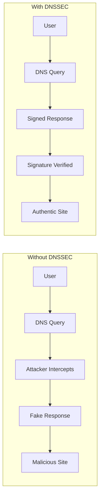

# How to Audit DNSSEC Configuration for Security Compliance

Author: [nawazdhandala](https://github.com/nawazdhandala)

Tags: DNSSEC, Security, Compliance, Auditing, DNS, Best Practices

Description: A comprehensive guide to auditing DNSSEC configurations for security compliance, including checklists, tools, compliance framework mappings, and practical validation techniques.

---

DNS Security Extensions (DNSSEC) adds cryptographic authentication to DNS responses, preventing cache poisoning, man-in-the-middle attacks, and DNS spoofing. However, DNSSEC is only effective when properly configured and maintained. This guide provides a thorough approach to auditing DNSSEC configurations for security compliance.

## Why DNSSEC Auditing Matters

Without DNSSEC validation, attackers can:
- Redirect users to malicious websites
- Intercept sensitive communications
- Steal credentials through DNS hijacking
- Perform supply chain attacks via compromised DNS
- Violate compliance requirements (PCI-DSS, NIST, SOC 2)



## DNSSEC Fundamentals for Auditors

Before auditing, understand the key DNSSEC components:

### Record Types

| Record Type | Purpose | Audit Focus |
|------------|---------|-------------|
| DNSKEY | Public keys for zone signing | Key algorithm strength, rotation schedule |
| RRSIG | Digital signatures for DNS records | Signature validity, expiration dates |
| DS | Delegation Signer (chain of trust) | Parent zone linkage, hash algorithm |
| NSEC/NSEC3 | Authenticated denial of existence | Zone walking protection |

### Chain of Trust

```
Root Zone (.)
    |
    +-- DS Record --> TLD (.com)
                          |
                          +-- DS Record --> Your Domain (example.com)
                                                |
                                                +-- DNSKEY --> Zone Records
```

## Pre-Audit Preparation

### 1. Gather Documentation

Before starting the audit, collect:

- DNS zone files and configurations
- Key management policies and procedures
- Previous audit reports
- Incident response procedures for DNSSEC failures
- Change management records for DNS infrastructure
- Contact information for DNS administrators

### 2. Identify Scope

Define which domains and subdomains are in scope:

```bash
# List all domains under management
cat domains-in-scope.txt
example.com
api.example.com
cdn.example.com
mail.example.com
```

### 3. Establish Audit Criteria

Map your audit to relevant compliance frameworks:

| Framework | DNSSEC Requirements |
|-----------|-------------------|
| NIST SP 800-81-2 | Mandatory for federal agencies |
| PCI-DSS 4.0 | Required for cardholder data protection |
| SOC 2 | Part of security controls |
| ISO 27001 | Network security controls |
| FedRAMP | Required for cloud services |
| HIPAA | Recommended for PHI protection |

---

## DNSSEC Audit Checklist

### Section 1: DNSSEC Deployment Status

**1.1 Zone Signing Verification**

Check if DNSSEC is enabled for each domain:

```bash
# Check for DNSKEY records
dig +dnssec DNSKEY example.com

# Verify zone is signed
dig +dnssec +multiline example.com SOA
```

Expected output should include:
- DNSKEY records present
- RRSIG records accompanying DNS responses
- AD (Authenticated Data) flag in responses

**Audit Questions:**
- [ ] Is DNSSEC enabled for all production domains?
- [ ] Are all subdomains properly signed?
- [ ] Is there documentation of which zones are signed?

**1.2 DS Record Chain Verification**

Verify the chain of trust from root to your domain:

```bash
# Check DS record at parent zone
dig +short DS example.com

# Verify chain using delv
delv @8.8.8.8 example.com SOA +rtrace

# Full chain validation
drill -S example.com
```

**Audit Questions:**
- [ ] Is the DS record properly published at the parent zone?
- [ ] Does the DS record match the active KSK (Key Signing Key)?
- [ ] Is the chain of trust complete from root to zone?

---

### Section 2: Key Management

**2.1 Key Algorithm Assessment**

Modern DNSSEC should use strong algorithms:

```bash
# Check algorithm used
dig +short DNSKEY example.com | awk '{print $3}'
```

**Algorithm Reference:**

| Algorithm Number | Name | Security Status |
|-----------------|------|-----------------|
| 5 | RSA/SHA-1 | Deprecated - FAIL |
| 7 | RSASHA1-NSEC3-SHA1 | Deprecated - FAIL |
| 8 | RSA/SHA-256 | Acceptable |
| 10 | RSA/SHA-512 | Acceptable |
| 13 | ECDSA P-256/SHA-256 | Recommended |
| 14 | ECDSA P-384/SHA-384 | Recommended |
| 15 | Ed25519 | Recommended |
| 16 | Ed448 | Recommended |

**Audit Questions:**
- [ ] Are deprecated algorithms (5, 7) still in use?
- [ ] Is the key size appropriate (RSA >= 2048 bits)?
- [ ] Is there a plan to migrate to ECDSA or EdDSA?

**2.2 Key Separation (KSK/ZSK)**

Best practice uses separate keys:

```bash
# List all DNSKEY records with flags
dig +short DNSKEY example.com | while read flags proto alg key; do
    if [ "$flags" -eq 257 ]; then
        echo "KSK (Key Signing Key): Algorithm $alg"
    elif [ "$flags" -eq 256 ]; then
        echo "ZSK (Zone Signing Key): Algorithm $alg"
    fi
done
```

**Audit Questions:**
- [ ] Are KSK and ZSK properly separated?
- [ ] Is the KSK stored with higher security controls?
- [ ] Are key flags correctly set (257 for KSK, 256 for ZSK)?

**2.3 Key Rotation Policy**

Verify key rotation procedures:

```bash
# Check for multiple keys (indicates rotation in progress or standby)
dig +short DNSKEY example.com | wc -l

# Check key IDs (key tags)
dig DNSKEY example.com | grep -oP 'key id = \K\d+'
```

**Recommended Rotation Periods:**

| Key Type | Rotation Frequency | Maximum Lifetime |
|----------|-------------------|------------------|
| ZSK | 30-90 days | 1 year |
| KSK | 1-2 years | 5 years |

**Audit Questions:**
- [ ] Is there a documented key rotation policy?
- [ ] Are key rotation procedures tested?
- [ ] Is emergency key rollover documented?
- [ ] Are old keys properly retired?

---

### Section 3: Signature Management

**3.1 Signature Validity Period**

Check signature expiration:

```bash
# View RRSIG expiration dates
dig +dnssec example.com SOA | grep RRSIG

# Parse expiration timestamp
dig +dnssec example.com SOA | grep RRSIG | awk '{print $9}'
```

**Audit Questions:**
- [ ] Are signature validity periods appropriate (typically 1-4 weeks)?
- [ ] Is re-signing automated before expiration?
- [ ] Are signatures refreshed with sufficient buffer time?

**3.2 Signature Algorithm Consistency**

Verify all records are properly signed:

```bash
# Check signatures for different record types
for type in A AAAA MX NS TXT SOA; do
    echo "=== $type Records ==="
    dig +dnssec $type example.com | grep RRSIG
done
```

**Audit Questions:**
- [ ] Are all record types signed with RRSIG?
- [ ] Do signature algorithms match DNSKEY algorithms?
- [ ] Are there any unsigned records that should be signed?

---

### Section 4: NSEC/NSEC3 Configuration

**4.1 Denial of Existence Method**

Check which method is used:

```bash
# Query for non-existent record
dig +dnssec nonexistent.example.com

# Check for NSEC or NSEC3 records
dig +dnssec NSEC example.com
dig +dnssec NSEC3PARAM example.com
```

**Comparison:**

| Feature | NSEC | NSEC3 |
|---------|------|-------|
| Zone Walking Protection | No | Yes |
| Implementation Complexity | Lower | Higher |
| Performance Impact | Lower | Higher |
| Privacy | Exposes all names | Hashed names |

**4.2 NSEC3 Parameters (If Used)**

```bash
# Check NSEC3PARAM record
dig +short NSEC3PARAM example.com
```

**Output format:** `algorithm flags iterations salt`

**Recommended Parameters:**
- Algorithm: 1 (SHA-1) - currently only standardized option
- Flags: 0 (no opt-out) for better security, 1 (opt-out) for large zones
- Iterations: 0-10 (higher increases CPU cost for resolvers)
- Salt: Empty or short (modern recommendation)

**Audit Questions:**
- [ ] Is NSEC3 used for zones requiring name privacy?
- [ ] Are NSEC3 iterations kept low (0-10)?
- [ ] Is opt-out disabled for security-critical zones?

---

### Section 5: Infrastructure Security

**5.1 DNS Server Software**

Verify DNS software is current:

```bash
# Check BIND version
named -v

# Check PowerDNS version
pdns_server --version

# Check Knot DNS version
knotd --version
```

**Audit Questions:**
- [ ] Is DNS server software up to date?
- [ ] Are security patches applied promptly?
- [ ] Is the software vendor supported?

**5.2 DNSSEC Validation on Resolvers**

Test if resolvers properly validate DNSSEC:

```bash
# Test with known bad DNSSEC domain
dig @your-resolver dnssec-failed.org A

# Should return SERVFAIL for properly validating resolvers

# Test with known good DNSSEC domain
dig @your-resolver +dnssec cloudflare.com A

# Should return AD flag
```

**Audit Questions:**
- [ ] Are internal resolvers configured for DNSSEC validation?
- [ ] Do resolvers reject invalid signatures?
- [ ] Is there monitoring for DNSSEC validation failures?

**5.3 Time Synchronization**

DNSSEC is time-sensitive:

```bash
# Check NTP synchronization
timedatectl status

# Verify time offset
ntpq -p
```

**Audit Questions:**
- [ ] Is NTP properly configured on all DNS servers?
- [ ] Is time drift monitored?
- [ ] Are NTP sources authenticated?

---

### Section 6: Operational Procedures

**6.1 Monitoring and Alerting**

Verify DNSSEC monitoring is in place:

```bash
# Example monitoring check script
#!/bin/bash
DOMAIN="example.com"

# Check RRSIG expiration
EXPIRY=$(dig +short +dnssec $DOMAIN SOA | grep RRSIG | awk '{print $9}')
EXPIRY_EPOCH=$(date -d "${EXPIRY:0:4}-${EXPIRY:4:2}-${EXPIRY:6:2}" +%s)
NOW_EPOCH=$(date +%s)
DAYS_LEFT=$(( ($EXPIRY_EPOCH - $NOW_EPOCH) / 86400 ))

if [ $DAYS_LEFT -lt 7 ]; then
    echo "WARNING: RRSIG expires in $DAYS_LEFT days"
    exit 1
fi

# Validate chain of trust
if ! delv @8.8.8.8 $DOMAIN SOA > /dev/null 2>&1; then
    echo "CRITICAL: DNSSEC validation failed"
    exit 2
fi

echo "OK: DNSSEC healthy, RRSIG valid for $DAYS_LEFT days"
exit 0
```

**Audit Questions:**
- [ ] Is DNSSEC health monitored 24/7?
- [ ] Are alerts configured for signature expiration?
- [ ] Is chain of trust validated regularly?
- [ ] Are monitoring results reviewed?

**6.2 Incident Response**

Review DNSSEC-specific incident procedures:

**Audit Questions:**
- [ ] Is there a documented DNSSEC incident response plan?
- [ ] Are emergency key rollover procedures documented?
- [ ] Can DNSSEC be disabled quickly if needed?
- [ ] Are contact procedures for registrar DS updates documented?

**6.3 Backup and Recovery**

Verify key backup procedures:

**Audit Questions:**
- [ ] Are DNSSEC keys backed up securely?
- [ ] Are backups tested for restoration?
- [ ] Is there geographic redundancy for key material?
- [ ] Are backup access controls documented?

---

## Automated Audit Tools

### 1. DNSViz

Web-based visualization and analysis:

```bash
# Command line interface
dnsviz probe example.com | dnsviz graph -T png -o example.png
dnsviz probe example.com | dnsviz grok

# Or use the web interface
# https://dnsviz.net/d/example.com/dnssec/
```

**What it checks:**
- Complete chain of trust
- Algorithm usage
- Key and signature validity
- NSEC/NSEC3 coverage

### 2. Verisign DNSSEC Debugger

```bash
# Web-based tool
# https://dnssec-debugger.verisignlabs.com/

# Provides detailed analysis of:
# - DS record status
# - DNSKEY validity
# - Signature verification
# - Chain of trust
```

### 3. BIND dig with DNSSEC flags

```bash
# Comprehensive DNSSEC query
dig +dnssec +multiline +trace example.com

# Check for CD (Checking Disabled) flag behavior
dig +cd example.com

# Validate specific record
dig +sigchase +trusted-key=/etc/trusted-key.key example.com A
```

### 4. ldns-verify-zone

```bash
# Verify entire zone file
ldns-verify-zone -k /path/to/ksk.key zonefile.signed

# Check for common issues
ldns-verify-zone -V 3 zonefile.signed
```

### 5. delv (BIND 9.10+)

```bash
# Validate DNSSEC with detailed output
delv @8.8.8.8 example.com SOA +rtrace +multiline

# Check specific anchor
delv -a /etc/bind/bind.keys example.com
```

### 6. Zonemaster

```bash
# Install Zonemaster CLI
# Run comprehensive DNS and DNSSEC tests
zonemaster-cli example.com --level INFO

# Test specific DNSSEC aspects
zonemaster-cli example.com --test DNSSEC
```

### 7. Custom Audit Script

```bash
#!/bin/bash
# DNSSEC Comprehensive Audit Script

DOMAIN=$1
OUTPUT_DIR="./dnssec-audit-$(date +%Y%m%d)"
mkdir -p $OUTPUT_DIR

echo "=== DNSSEC Audit Report for $DOMAIN ===" | tee $OUTPUT_DIR/report.txt
echo "Audit Date: $(date)" | tee -a $OUTPUT_DIR/report.txt
echo "" | tee -a $OUTPUT_DIR/report.txt

# 1. Basic DNSSEC Status
echo "=== 1. DNSSEC Deployment Status ===" | tee -a $OUTPUT_DIR/report.txt
if dig +short DNSKEY $DOMAIN | grep -q .; then
    echo "[PASS] DNSKEY records found" | tee -a $OUTPUT_DIR/report.txt
    dig +short DNSKEY $DOMAIN | tee -a $OUTPUT_DIR/dnskey.txt
else
    echo "[FAIL] No DNSKEY records found" | tee -a $OUTPUT_DIR/report.txt
fi

# 2. DS Record Check
echo "" | tee -a $OUTPUT_DIR/report.txt
echo "=== 2. DS Record (Parent Zone) ===" | tee -a $OUTPUT_DIR/report.txt
DS_RECORD=$(dig +short DS $DOMAIN)
if [ -n "$DS_RECORD" ]; then
    echo "[PASS] DS record found at parent zone" | tee -a $OUTPUT_DIR/report.txt
    echo "$DS_RECORD" | tee -a $OUTPUT_DIR/ds.txt
else
    echo "[FAIL] No DS record at parent zone" | tee -a $OUTPUT_DIR/report.txt
fi

# 3. Algorithm Check
echo "" | tee -a $OUTPUT_DIR/report.txt
echo "=== 3. Algorithm Analysis ===" | tee -a $OUTPUT_DIR/report.txt
dig +short DNSKEY $DOMAIN | while read flags proto alg key; do
    case $alg in
        5|7)
            echo "[FAIL] Deprecated algorithm $alg in use" | tee -a $OUTPUT_DIR/report.txt
            ;;
        8|10)
            echo "[WARN] RSA algorithm $alg - consider migration to ECDSA" | tee -a $OUTPUT_DIR/report.txt
            ;;
        13|14|15|16)
            echo "[PASS] Modern algorithm $alg in use" | tee -a $OUTPUT_DIR/report.txt
            ;;
        *)
            echo "[UNKNOWN] Algorithm $alg" | tee -a $OUTPUT_DIR/report.txt
            ;;
    esac
done

# 4. Signature Expiration
echo "" | tee -a $OUTPUT_DIR/report.txt
echo "=== 4. Signature Validity ===" | tee -a $OUTPUT_DIR/report.txt
RRSIG_INFO=$(dig +dnssec $DOMAIN SOA | grep RRSIG)
if [ -n "$RRSIG_INFO" ]; then
    EXPIRY=$(echo "$RRSIG_INFO" | awk '{print $9}')
    YEAR="${EXPIRY:0:4}"
    MONTH="${EXPIRY:4:2}"
    DAY="${EXPIRY:6:2}"
    echo "RRSIG Expiration: $YEAR-$MONTH-$DAY" | tee -a $OUTPUT_DIR/report.txt

    EXPIRY_EPOCH=$(date -d "$YEAR-$MONTH-$DAY" +%s 2>/dev/null || echo "0")
    NOW_EPOCH=$(date +%s)
    if [ "$EXPIRY_EPOCH" -gt "0" ]; then
        DAYS_LEFT=$(( ($EXPIRY_EPOCH - $NOW_EPOCH) / 86400 ))
        if [ $DAYS_LEFT -lt 3 ]; then
            echo "[CRITICAL] RRSIG expires in $DAYS_LEFT days" | tee -a $OUTPUT_DIR/report.txt
        elif [ $DAYS_LEFT -lt 7 ]; then
            echo "[WARN] RRSIG expires in $DAYS_LEFT days" | tee -a $OUTPUT_DIR/report.txt
        else
            echo "[PASS] RRSIG valid for $DAYS_LEFT more days" | tee -a $OUTPUT_DIR/report.txt
        fi
    fi
fi

# 5. Chain of Trust Validation
echo "" | tee -a $OUTPUT_DIR/report.txt
echo "=== 5. Chain of Trust Validation ===" | tee -a $OUTPUT_DIR/report.txt
if command -v delv &> /dev/null; then
    if delv @8.8.8.8 $DOMAIN SOA +rtrace > $OUTPUT_DIR/chain-validation.txt 2>&1; then
        echo "[PASS] Chain of trust validated successfully" | tee -a $OUTPUT_DIR/report.txt
    else
        echo "[FAIL] Chain of trust validation failed" | tee -a $OUTPUT_DIR/report.txt
    fi
else
    echo "[SKIP] delv not available" | tee -a $OUTPUT_DIR/report.txt
fi

# 6. NSEC/NSEC3 Check
echo "" | tee -a $OUTPUT_DIR/report.txt
echo "=== 6. NSEC/NSEC3 Configuration ===" | tee -a $OUTPUT_DIR/report.txt
NSEC3=$(dig +short NSEC3PARAM $DOMAIN)
if [ -n "$NSEC3" ]; then
    echo "[INFO] NSEC3 in use" | tee -a $OUTPUT_DIR/report.txt
    echo "NSEC3PARAM: $NSEC3" | tee -a $OUTPUT_DIR/report.txt
    ITERATIONS=$(echo "$NSEC3" | awk '{print $3}')
    if [ "$ITERATIONS" -gt 10 ]; then
        echo "[WARN] High NSEC3 iterations ($ITERATIONS) - recommend 0-10" | tee -a $OUTPUT_DIR/report.txt
    else
        echo "[PASS] NSEC3 iterations within recommended range" | tee -a $OUTPUT_DIR/report.txt
    fi
else
    echo "[INFO] NSEC in use (zone names visible)" | tee -a $OUTPUT_DIR/report.txt
fi

# 7. Key Count Analysis
echo "" | tee -a $OUTPUT_DIR/report.txt
echo "=== 7. Key Analysis ===" | tee -a $OUTPUT_DIR/report.txt
KSK_COUNT=$(dig +short DNSKEY $DOMAIN | grep "^257" | wc -l)
ZSK_COUNT=$(dig +short DNSKEY $DOMAIN | grep "^256" | wc -l)
echo "KSK (Key Signing Keys): $KSK_COUNT" | tee -a $OUTPUT_DIR/report.txt
echo "ZSK (Zone Signing Keys): $ZSK_COUNT" | tee -a $OUTPUT_DIR/report.txt

if [ $KSK_COUNT -eq 0 ]; then
    echo "[FAIL] No KSK found" | tee -a $OUTPUT_DIR/report.txt
fi
if [ $ZSK_COUNT -eq 0 ]; then
    echo "[FAIL] No ZSK found" | tee -a $OUTPUT_DIR/report.txt
fi
if [ $KSK_COUNT -gt 2 ]; then
    echo "[WARN] Multiple KSKs present - verify rotation status" | tee -a $OUTPUT_DIR/report.txt
fi

echo "" | tee -a $OUTPUT_DIR/report.txt
echo "=== Audit Complete ===" | tee -a $OUTPUT_DIR/report.txt
echo "Full report saved to: $OUTPUT_DIR/report.txt"
```

---

## Compliance Framework Mappings

### NIST SP 800-81-2 Requirements

| Requirement | Audit Check | Evidence |
|-------------|-------------|----------|
| DNSSEC must be deployed | DNSKEY records present | dig output |
| Chain of trust established | DS at parent zone | Registrar records |
| Proper key management | Key rotation logs | Change records |
| Algorithm strength | No deprecated algorithms | dig DNSKEY analysis |
| Signature validity | RRSIG not expiring | Monitoring alerts |

### PCI-DSS 4.0 Mapping

| PCI Requirement | DNSSEC Control | Audit Evidence |
|-----------------|----------------|----------------|
| 1.3.2 Network Security | Prevent DNS spoofing | DNSSEC validation |
| 6.4.1 Secure Development | Secure DNS configuration | Config review |
| 10.2.1 Audit Logs | DNS change logging | Log review |
| 11.3 Security Testing | DNSSEC testing | Test results |

### SOC 2 Trust Service Criteria

| TSC | DNSSEC Control | Audit Test |
|-----|----------------|------------|
| CC6.1 Logical Access | DNS integrity | Chain validation |
| CC6.6 Network Security | Prevent DNS attacks | DNSSEC status check |
| CC7.1 System Operations | DNS monitoring | Alert configuration |
| CC7.2 Change Management | Key rotation | Procedure review |

### ISO 27001 Control Mapping

| ISO Control | DNSSEC Requirement | Audit Activity |
|-------------|-------------------|----------------|
| A.13.1.1 Network Controls | DNS security | DNSSEC deployment review |
| A.10.1.1 Cryptographic Controls | Key management | Key rotation audit |
| A.12.4.1 Event Logging | DNS audit logs | Log completeness check |
| A.14.1.2 Secure Development | Secure configuration | Config baseline review |

---

## Common DNSSEC Issues and Remediation

### Issue 1: Expired Signatures

**Detection:**
```bash
dig +dnssec example.com SOA | grep -i "RRSIG"
# Check expiration timestamp
```

**Impact:** Complete DNSSEC validation failure

**Remediation:**
1. Identify cause (failed re-signing job, time sync issue)
2. Re-sign zone immediately
3. Implement monitoring for signature expiration
4. Review automation reliability

### Issue 2: Missing DS Record

**Detection:**
```bash
dig +short DS example.com
# Empty result indicates missing DS
```

**Impact:** Chain of trust broken

**Remediation:**
1. Generate DS record from KSK
2. Submit to registrar/parent zone
3. Verify propagation
4. Document submission process

### Issue 3: Algorithm Mismatch

**Detection:**
```bash
# DS algorithm should match DNSKEY algorithm
dig +short DS example.com | awk '{print $2}'
dig +short DNSKEY example.com | awk '{print $3}'
```

**Impact:** Validation failures in some resolvers

**Remediation:**
1. Regenerate DS with correct algorithm
2. Update parent zone
3. Remove old DS after propagation

### Issue 4: Key Rollover Failure

**Detection:**
- Multiple old keys still published
- DS points to retired key

**Impact:** Validation may fail during rollover

**Remediation:**
1. Follow RFC 7583 rollover procedures
2. Use automated key rollover tools
3. Monitor rollover completion
4. Maintain rollover runbook

### Issue 5: Clock Skew

**Detection:**
```bash
# Check signature validity window
dig +dnssec example.com | grep RRSIG
# Compare inception and expiration times
```

**Impact:** Premature signature expiration or inception failures

**Remediation:**
1. Implement NTP on all DNS servers
2. Monitor time synchronization
3. Use appropriate signature validity windows
4. Consider clock skew in signature inception

---

## DNSSEC Audit Report Template

### Executive Summary

- **Audit Scope:** [Domains audited]
- **Audit Period:** [Date range]
- **Overall Assessment:** [Pass/Fail/Needs Improvement]
- **Critical Findings:** [Count]
- **High Findings:** [Count]
- **Medium Findings:** [Count]
- **Low Findings:** [Count]

### Detailed Findings

| ID | Finding | Severity | Status | Recommendation |
|----|---------|----------|--------|----------------|
| F001 | Description | Critical/High/Medium/Low | Open/Closed | Remediation steps |

### Compliance Status

| Framework | Requirement | Status | Evidence |
|-----------|-------------|--------|----------|
| NIST | DNSSEC Deployment | Compliant | DNSKEY present |

### Key Metrics

| Metric | Value | Target | Status |
|--------|-------|--------|--------|
| Domains with DNSSEC | X/Y | 100% | Pass/Fail |
| Average signature validity | X days | > 7 days | Pass/Fail |
| Algorithm compliance | X% | 100% | Pass/Fail |
| Key rotation compliance | X% | 100% | Pass/Fail |

### Remediation Plan

| Finding | Priority | Owner | Due Date | Status |
|---------|----------|-------|----------|--------|
| F001 | P1 | Team | Date | In Progress |

---

## Summary: DNSSEC Audit Checklist Table

| Category | Check Item | Tool/Command | Pass Criteria |
|----------|-----------|--------------|---------------|
| **Deployment** | DNSKEY present | `dig DNSKEY domain` | Records returned |
| **Deployment** | DS record at parent | `dig DS domain` | Record matches KSK |
| **Deployment** | Chain of trust | `delv domain` | Validation succeeds |
| **Algorithm** | No deprecated (5,7) | `dig DNSKEY` analysis | Algorithms 8+ only |
| **Algorithm** | Key size adequate | DNSKEY analysis | RSA >= 2048 bits |
| **Keys** | KSK/ZSK separation | `dig DNSKEY` flags | Both 256 and 257 present |
| **Keys** | Rotation policy | Documentation review | Policy documented |
| **Keys** | Rotation executed | Change records | Within policy period |
| **Signatures** | Valid RRSIG | `dig +dnssec` | Not expired |
| **Signatures** | Sufficient validity | RRSIG analysis | >= 7 days remaining |
| **Signatures** | All records signed | Multi-record test | RRSIG for each type |
| **NSEC/NSEC3** | Denial method | `dig NSEC3PARAM` | Appropriate for zone |
| **NSEC3** | Iterations | NSEC3PARAM analysis | 0-10 iterations |
| **Infrastructure** | Software current | Version check | Latest stable release |
| **Infrastructure** | Resolver validation | Test bad domain | SERVFAIL returned |
| **Infrastructure** | Time sync | `timedatectl` | NTP synchronized |
| **Operations** | Monitoring active | Alert review | DNSSEC alerts configured |
| **Operations** | Incident response | Procedure review | Documented and tested |
| **Operations** | Key backup | Backup verification | Tested restoration |
| **Compliance** | Framework mapping | Audit matrix | All requirements met |

---

## Continuous DNSSEC Monitoring with OneUptime

Manual audits are essential, but continuous monitoring catches issues before they become incidents. OneUptime provides automated DNSSEC monitoring:

### Setting Up DNSSEC Monitoring

1. **Create DNS Monitor**
   - Navigate to Monitors > Create Monitor
   - Select DNS Monitor type
   - Enter domain to monitor

2. **Configure DNSSEC Checks**
   - Enable DNSSEC validation
   - Set signature expiration threshold
   - Configure chain of trust validation

3. **Set Up Alerts**
   - Alert on DNSSEC validation failure
   - Alert on signature expiration approaching
   - Alert on DS record changes

4. **Dashboard Visibility**
   - Track DNSSEC health across all domains
   - Monitor signature validity trends
   - View historical compliance status

### Integration with Incident Management

When DNSSEC issues are detected:
- Automatic incident creation
- Escalation to DNS administrators
- Status page updates
- Post-incident analysis

---

## Conclusion

DNSSEC auditing is essential for maintaining DNS security and compliance. Key takeaways:

1. **Regular Audits:** Conduct DNSSEC audits quarterly or after major changes
2. **Automated Monitoring:** Implement continuous DNSSEC health monitoring
3. **Documentation:** Maintain current policies for key management and incident response
4. **Algorithm Currency:** Plan migration from deprecated algorithms
5. **Chain Validation:** Regularly verify the complete chain of trust
6. **Compliance Mapping:** Align DNSSEC controls with relevant frameworks

A properly configured and monitored DNSSEC deployment significantly reduces DNS-based attack vectors and demonstrates security maturity to auditors and stakeholders.

Start with the audit checklist, implement continuous monitoring with OneUptime, and build DNSSEC health into your security operations. Your DNS infrastructure - and your compliance team - will thank you.

---

## Additional Resources

- RFC 4033-4035: DNSSEC Protocol Specifications
- RFC 7583: DNSSEC Key Rollover Timing
- NIST SP 800-81-2: Secure DNS Deployment Guide
- ICANN DNSSEC Practice Statement Guidelines
- DNSViz: https://dnsviz.net
- Verisign DNSSEC Debugger: https://dnssec-debugger.verisignlabs.com
