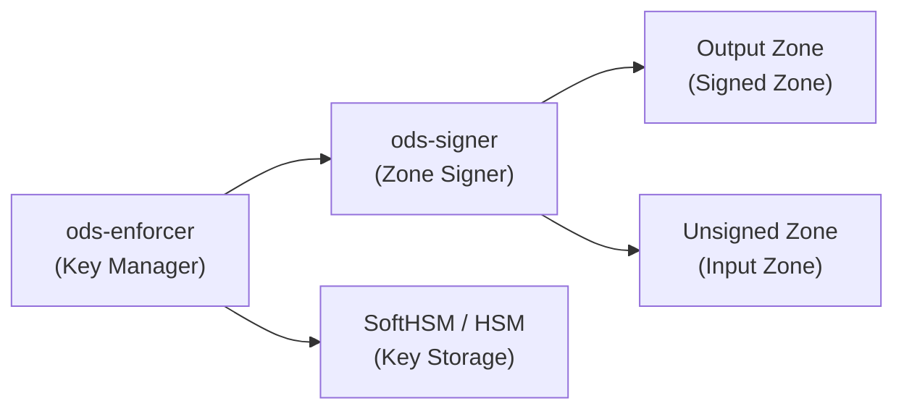

# How to Automate DNSSEC Key Management with OpenDNSSEC

Author: [nawazdhandala](https://github.com/nawazdhandala)

Tags: DNSSEC, OpenDNSSEC, DNS, Security, Automation, DevOps

Description: A comprehensive guide to automating DNSSEC key lifecycle management using OpenDNSSEC, covering installation, configuration, key policies, and operational best practices for secure DNS infrastructure.

---

DNSSEC protects your domain from cache poisoning and man-in-the-middle attacks by cryptographically signing DNS records. The problem is that key management is operationally brutal: rotate too early and you break resolution, rotate too late and you weaken security, forget to publish DS records and your entire zone goes dark. OpenDNSSEC solves this by automating the entire key lifecycle-generation, publication, rollover, and retirement-so you can focus on running infrastructure instead of babysitting keys.

## Why DNSSEC Key Management is Hard

Before diving into OpenDNSSEC, understand what you are automating:

| Key Type | Purpose | Typical Lifetime | Rollover Complexity |
| --- | --- | --- | --- |
| **KSK (Key Signing Key)** | Signs the DNSKEY RRset; anchored in parent zone via DS record | 1-2 years | Requires coordination with parent zone |
| **ZSK (Zone Signing Key)** | Signs all other RRsets in the zone | 30-90 days | Internal to your zone |

Manual key management means tracking key generation timing, pre-publication periods, activation windows, DS record submission, old key retirement, and emergency rollover procedures. Miss any step and validators will reject your zone as bogus.

## OpenDNSSEC Architecture Overview



**ods-enforcer**: The policy engine that tracks key states, schedules rollovers, and ensures timing constraints are met.

**ods-signer**: Takes unsigned zones and produces signed output using keys managed by the enforcer.

**SoftHSM / Hardware HSM**: Stores private keys securely. SoftHSM is a software-based PKCS#11 implementation for development; production environments often use hardware HSMs.

## Installing OpenDNSSEC

### Ubuntu/Debian Installation

```bash
sudo apt update
sudo apt install -y opendnssec softhsm2

# Verify installation
ods-enforcer --version
ods-signer --version
```

### RHEL/CentOS/Rocky Linux Installation

```bash
sudo dnf install -y epel-release
sudo dnf install -y opendnssec softhsm
```

### Building from Source

```bash
# Install dependencies
sudo apt install -y build-essential libxml2-dev libsqlite3-dev \
    libldns-dev libssl-dev libsofthsm2-dev autoconf automake libtool

# Download and extract
wget https://github.com/opendnssec/opendnssec/releases/download/2.1.13/opendnssec-2.1.13.tar.gz
tar xzf opendnssec-2.1.13.tar.gz
cd opendnssec-2.1.13

# Configure, build, and install
./configure --prefix=/usr/local --with-database-backend=sqlite3
make -j$(nproc)
sudo make install

# Create necessary directories
sudo mkdir -p /var/opendnssec/{tmp,unsigned,signed}
sudo chown -R opendnssec:opendnssec /var/opendnssec
```

## Configuring SoftHSM

### Initialize SoftHSM Token

```bash
sudo mkdir -p /var/lib/softhsm/tokens
sudo chown -R opendnssec:opendnssec /var/lib/softhsm

# Initialize a token for OpenDNSSEC
sudo -u opendnssec softhsm2-util --init-token --slot 0 \
    --label "OpenDNSSEC" --pin 1234 --so-pin 5678

# Verify token creation
softhsm2-util --show-slots
```

## OpenDNSSEC Configuration

### Main Configuration (conf.xml)

Edit `/etc/opendnssec/conf.xml`:

```xml
<?xml version="1.0" encoding="UTF-8"?>
<Configuration>
    <RepositoryList>
        <Repository name="SoftHSM">
            <Module>/usr/lib/softhsm/libsofthsm2.so</Module>
            <TokenLabel>OpenDNSSEC</TokenLabel>
            <PIN>1234</PIN>
            <Capacity>1000</Capacity>
        </Repository>
    </RepositoryList>
    <Common>
        <PolicyFile>/etc/opendnssec/kasp.xml</PolicyFile>
        <ZoneListFile>/etc/opendnssec/zonelist.xml</ZoneListFile>
    </Common>
    <Enforcer>
        <Datastore><SQLite>/var/opendnssec/kasp.db</SQLite></Datastore>
        <AutomaticKeyGenerationPeriod>P1Y</AutomaticKeyGenerationPeriod>
    </Enforcer>
    <Signer>
        <WorkingDirectory>/var/opendnssec/tmp</WorkingDirectory>
        <NotifyCommand>/usr/local/bin/dns-reload.sh %zone</NotifyCommand>
    </Signer>
</Configuration>
```

### Key and Signing Policy (kasp.xml)

The KASP (Key and Signing Policy) file defines how keys are generated, rolled, and retired. Edit `/etc/opendnssec/kasp.xml`:

```xml
<?xml version="1.0" encoding="UTF-8"?>
<KASP>
    <Policy name="default">
        <Description>Default production DNSSEC policy</Description>
        <Signatures>
            <Resign>PT2H</Resign>
            <Refresh>P3D</Refresh>
            <Validity><Default>P14D</Default><Denial>P14D</Denial></Validity>
            <Jitter>PT12H</Jitter>
            <InceptionOffset>PT1H</InceptionOffset>
            <MaxZoneTTL>P1D</MaxZoneTTL>
        </Signatures>
        <Denial>
            <NSEC3>
                <OptOut>false</OptOut>
                <Resalt>P100D</Resalt>
                <Hash><Algorithm>1</Algorithm><Iterations>10</Iterations><Salt length="8"/></Hash>
            </NSEC3>
        </Denial>
        <Keys>
            <TTL>PT1H</TTL>
            <RetireSafety>PT1H</RetireSafety>
            <PublishSafety>PT1H</PublishSafety>
            <KSK>
                <Algorithm length="2048">8</Algorithm>
                <Lifetime>P1Y</Lifetime>
                <Repository>SoftHSM</Repository>
                <Standby>1</Standby>
                <ManualRollover>true</ManualRollover>
            </KSK>
            <ZSK>
                <Algorithm length="1024">8</Algorithm>
                <Lifetime>P90D</Lifetime>
                <Repository>SoftHSM</Repository>
                <Standby>1</Standby>
                <ManualRollover>false</ManualRollover>
            </ZSK>
        </Keys>
        <Zone><PropagationDelay>PT1H</PropagationDelay></Zone>
        <Parent><PropagationDelay>PT1H</PropagationDelay></Parent>
    </Policy>

    <Policy name="lab">
        <Description>Fast rollover policy for testing</Description>
        <Signatures>
            <Resign>PT10M</Resign>
            <Refresh>PT30M</Refresh>
            <Validity><Default>PT1H</Default><Denial>PT1H</Denial></Validity>
            <Jitter>PT5M</Jitter>
            <InceptionOffset>PT5M</InceptionOffset>
            <MaxZoneTTL>PT30M</MaxZoneTTL>
        </Signatures>
        <Denial>
            <NSEC3>
                <OptOut>false</OptOut>
                <Resalt>PT1H</Resalt>
                <Hash><Algorithm>1</Algorithm><Iterations>5</Iterations><Salt length="8"/></Hash>
            </NSEC3>
        </Denial>
        <Keys>
            <TTL>PT10M</TTL>
            <RetireSafety>PT5M</RetireSafety>
            <PublishSafety>PT5M</PublishSafety>
            <KSK>
                <Algorithm length="2048">8</Algorithm>
                <Lifetime>PT2H</Lifetime>
                <Repository>SoftHSM</Repository>
                <ManualRollover>false</ManualRollover>
            </KSK>
            <ZSK>
                <Algorithm length="1024">8</Algorithm>
                <Lifetime>PT30M</Lifetime>
                <Repository>SoftHSM</Repository>
                <ManualRollover>false</ManualRollover>
            </ZSK>
        </Keys>
        <Zone><PropagationDelay>PT5M</PropagationDelay></Zone>
        <Parent><PropagationDelay>PT5M</PropagationDelay></Parent>
    </Policy>
</KASP>
```

### Understanding Policy Parameters

| Parameter | Description | Recommended Value |
| --- | --- | --- |
| `Resign` | How often to re-sign unchanged records | PT2H (2 hours) |
| `Refresh` | When to start refreshing signatures before expiry | P3D (3 days) |
| `Validity/Default` | Signature lifetime | P14D (14 days) |
| `KSK/Lifetime` | Time between KSK rollovers | P1Y (1 year) |
| `ZSK/Lifetime` | Time between ZSK rollovers | P90D (90 days) |
| `Standby` | Number of pre-generated standby keys | 1 |
| `ManualRollover` | Require manual trigger for rollover | true for KSK |
| `PropagationDelay` | Time for DNS changes to propagate | PT1H (1 hour) |

## Zone Configuration

### Zone List (zonelist.xml)

```xml
<?xml version="1.0" encoding="UTF-8"?>
<ZoneList>
    <Zone name="example.com">
        <Policy>default</Policy>
        <Adapters>
            <Input><Adapter type="File">/var/opendnssec/unsigned/example.com</Adapter></Input>
            <Output><Adapter type="File">/var/opendnssec/signed/example.com</Adapter></Output>
        </Adapters>
    </Zone>
</ZoneList>
```

### Unsigned Zone File

Place your unsigned zone in `/var/opendnssec/unsigned/example.com`:

```dns
$ORIGIN example.com.
$TTL 3600

@       IN      SOA     ns1.example.com. admin.example.com. (
                        2026011501 7200 3600 1209600 3600 )

@       IN      NS      ns1.example.com.
@       IN      NS      ns2.example.com.
@       IN      A       192.0.2.1
ns1     IN      A       192.0.2.2
ns2     IN      A       192.0.2.3
www     IN      A       192.0.2.1
@       IN      MX      10 mail.example.com.
mail    IN      A       192.0.2.10
```

## Initializing and Starting OpenDNSSEC

```bash
# Setup database and import configuration
sudo -u opendnssec ods-enforcer-db-setup
sudo -u opendnssec ods-enforcer policy import

# Add zones
sudo -u opendnssec ods-enforcer zone add --zone example.com --policy default \
    --input /var/opendnssec/unsigned/example.com \
    --output /var/opendnssec/signed/example.com

# Start services
sudo systemctl start opendnssec-enforcer opendnssec-signer
sudo systemctl enable opendnssec-enforcer opendnssec-signer

# Force initial signing
sudo -u opendnssec ods-signer sign --all
```

## Key Lifecycle Management

### Viewing Key Status

```bash
# List all keys
sudo -u opendnssec ods-enforcer key list --verbose

# List keys for specific zone
sudo -u opendnssec ods-enforcer key list --zone example.com
```

### Understanding Key States

| State | DNSKEY Published | Used for Signing |
| --- | --- | --- |
| `hidden` | No | No |
| `rumoured` | Yes | No |
| `omnipresent` | Yes | Yes (if active) |
| `unretentive` | Being removed | No |

### Manual KSK Rollover

```bash
# Initiate KSK rollover
sudo -u opendnssec ods-enforcer key rollover --zone example.com --keytype KSK

# Export DS record for parent zone
sudo -u opendnssec ods-enforcer key export --zone example.com --ds

# After DS is published, confirm
sudo -u opendnssec ods-enforcer key ds-seen --zone example.com --keytag 12345
```

## DNS Server Integration

### BIND Integration

```named
zone "example.com" {
    type master;
    file "/var/opendnssec/signed/example.com";
    notify yes;
};
```

Create `/usr/local/bin/dns-reload.sh`:

```bash
#!/bin/bash
ZONE=$1
/usr/sbin/rndc reload "$ZONE"
logger -t opendnssec "Reloaded zone: $ZONE"
```

### NSD Integration

```conf
zone:
    name: "example.com"
    zonefile: "/var/opendnssec/signed/example.com"
```

## Monitoring and Alerting

### Monitoring Script

```bash
#!/bin/bash
# /usr/local/bin/opendnssec-monitor.sh

ZONES=$(ods-enforcer zone list 2>/dev/null | tail -n +2)

while IFS= read -r ZONE; do
    [ -z "$ZONE" ] && continue
    ZONE_NAME=$(echo "$ZONE" | awk '{print $1}')
    SIGNED_FILE="/var/opendnssec/signed/$ZONE_NAME"

    if [ -f "$SIGNED_FILE" ]; then
        EXPIRY=$(grep -m1 'RRSIG.*SOA' "$SIGNED_FILE" | awk '{print $9}')
        echo "Zone $ZONE_NAME: Signed, expires $EXPIRY"
    else
        echo "WARNING: Zone $ZONE_NAME not signed!"
    fi
done <<< "$ZONES"
```

### Prometheus Alert Rules

```yaml
groups:
  - name: opendnssec
    rules:
      - alert: DNSSECSignatureExpiringSoon
        expr: opendnssec_signature_expiry_seconds < 86400
        labels:
          severity: warning
        annotations:
          summary: "DNSSEC signatures expiring for {{ $labels.zone }}"

      - alert: DNSSECZoneNotSigned
        expr: opendnssec_zone_signed == 0
        labels:
          severity: critical
        annotations:
          summary: "Zone {{ $labels.zone }} is not signed"
```

## Emergency Procedures

### Emergency Key Rollover

```bash
# Immediately roll compromised key
sudo -u opendnssec ods-enforcer key rollover --zone example.com --keytype ZSK
sudo -u opendnssec ods-signer sign --all

# For KSK, export new DS immediately
sudo -u opendnssec ods-enforcer key export --zone example.com --ds
```

### Disabling DNSSEC in Emergency

```bash
# Stop OpenDNSSEC
sudo systemctl stop opendnssec-signer opendnssec-enforcer

# Switch to unsigned zones in DNS server
# Then contact registrar to remove DS records from parent
```

## Backup and Recovery

### Backup Script

```bash
#!/bin/bash
BACKUP_DIR="/var/backups/opendnssec"
DATE=$(date +%Y%m%d_%H%M%S)

mkdir -p "$BACKUP_DIR"
tar czf "${BACKUP_DIR}/opendnssec-${DATE}.tar.gz" \
    /var/opendnssec/kasp.db \
    /etc/opendnssec \
    /var/lib/softhsm/tokens \
    /var/opendnssec/unsigned \
    /var/opendnssec/signed

# Keep 30 days of backups
find "$BACKUP_DIR" -name "*.tar.gz" -mtime +30 -delete
```

## Best Practices Summary

| Task | Frequency | Command |
| --- | --- | --- |
| Check key status | Daily | `ods-enforcer key list --verbose` |
| Verify signature validity | Daily | `ods-signer queue` |
| Backup database and keys | Daily | Run backup script |
| Test zone validation | Weekly | `dnssec-verify example.com` |
| Review DS records | Monthly | `dig DS example.com @parent-ns` |
| Test restoration | Quarterly | Restore in test environment |

### Algorithm Recommendations

| Algorithm | ID | Status | Recommendation |
| --- | --- | --- | --- |
| RSASHA256 | 8 | Recommended | Good default choice |
| RSASHA512 | 10 | Recommended | Better for high-security |
| ECDSAP256SHA256 | 13 | Recommended | Smaller signatures |
| ECDSAP384SHA384 | 14 | Recommended | Highest security |

### Common Pitfalls

1. **TTL Mismatches**: Ensure KASP `PropagationDelay` exceeds your zone TTLs
2. **DS Record Timing**: Never remove old DS records before new KSK is omnipresent
3. **Clock Skew**: Keep server time synchronized with NTP
4. **Backup Neglect**: HSM tokens are not recoverable without backups
5. **Monitoring Gaps**: Expired signatures cause resolution failures

## Conclusion

OpenDNSSEC transforms DNSSEC from an operational burden into a set-and-forget security layer. By defining policies once and letting the enforcer handle timing, you eliminate the human error that causes most DNSSEC outages.

The key to success:

1. Start with the lab policy in a test environment
2. Graduate to production after observing several automated rollovers
3. Monitor signature expiry and key states continuously
4. Maintain encrypted backups of your HSM tokens
5. Practice emergency procedures quarterly

With OpenDNSSEC handling the key lifecycle, you get DNS security protection without the operational overhead that historically made DNSSEC impractical for most teams.
