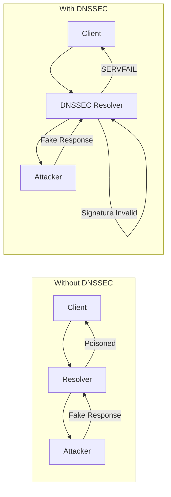
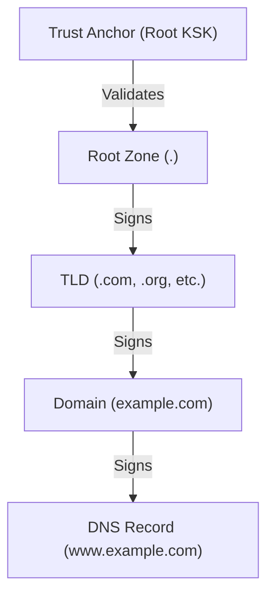

# How to Set Up BIND as a DNSSEC-Validating Recursive Resolver

Author: [nawazdhandala](https://www.github.com/nawazdhandala)

Tags: DNSSEC, BIND, DNS, Security, Linux, Infrastructure

Description: A complete guide to configuring BIND 9 as a DNSSEC-validating recursive resolver with trust anchor management, troubleshooting, and production best practices.

---

DNS cache poisoning attacks have been around since the early days of the internet. DNSSEC (Domain Name System Security Extensions) solves this by cryptographically signing DNS records. A DNSSEC-validating resolver verifies these signatures before returning results to clients, protecting your network from forged DNS responses.

This guide walks you through setting up BIND 9 as a DNSSEC-validating recursive resolver from scratch.

## Why DNSSEC Validation Matters



Without DNSSEC validation:
- Attackers can inject fake DNS responses
- Users can be redirected to malicious sites
- Man-in-the-middle attacks are trivial

With DNSSEC validation:
- All responses are cryptographically verified
- Forged responses are rejected
- Users are protected from cache poisoning

## Prerequisites

Before you begin, ensure you have:

- A Linux server (Ubuntu 22.04/24.04, Debian 12, RHEL 9, or similar)
- Root or sudo access
- BIND 9.16 or later (9.18+ recommended)
- Network connectivity to root DNS servers
- Ports 53 (TCP/UDP) available

### Install BIND on Your System

**Ubuntu/Debian:**

```bash
sudo apt update
sudo apt install bind9 bind9-utils bind9-dnsutils
```

**RHEL/CentOS/Rocky:**

```bash
sudo dnf install bind bind-utils
```

**Verify installation:**

```bash
named -v
# BIND 9.18.18-0ubuntu0.22.04.2-Ubuntu (Extended Support Version) <id:>
```

## Understanding BIND Directory Structure

Before configuring, understand where BIND stores its files:

```
/etc/bind/                    # Debian/Ubuntu
/etc/named/                   # RHEL/CentOS
|-- named.conf                # Main configuration
|-- named.conf.options        # Server options (Debian)
|-- named.conf.local          # Local zone definitions
|-- named.conf.default-zones  # Default zones
|-- bind.keys                 # DNSSEC trust anchors
|-- db.root                   # Root hints file
|-- rndc.key                  # Remote control key

/var/cache/bind/              # Zone and cache files
/var/log/named/               # Log files (if configured)
/run/named/                   # Runtime files, PID
```

## Basic Recursive Resolver Configuration

Let's start with a basic recursive resolver configuration, then add DNSSEC validation.

### Main Configuration File

Create or edit `/etc/bind/named.conf`:

```conf
// /etc/bind/named.conf
// BIND 9 Configuration for DNSSEC-Validating Recursive Resolver

// Include additional configuration files
include "/etc/bind/named.conf.options";
include "/etc/bind/named.conf.local";
include "/etc/bind/named.conf.default-zones";

// Include the RNDC key for remote management
include "/etc/bind/rndc.key";

// Logging configuration
include "/etc/bind/named.conf.logging";
```

### Options Configuration

Create `/etc/bind/named.conf.options`:

```conf
// /etc/bind/named.conf.options
// Server options for DNSSEC-validating recursive resolver

acl "trusted-networks" {
    localhost;
    localnets;
    10.0.0.0/8;        // Internal network
    172.16.0.0/12;     // Internal network
    192.168.0.0/16;    // Internal network
};

acl "blocked-networks" {
    0.0.0.0/8;         // "This" network
    127.0.0.0/8;       // Loopback (prevent amplification)
    169.254.0.0/16;    // Link-local
    224.0.0.0/4;       // Multicast
    240.0.0.0/4;       // Reserved
};

options {
    // Directory for zone files and cache
    directory "/var/cache/bind";

    // Listen on all interfaces
    listen-on port 53 { any; };
    listen-on-v6 port 53 { any; };

    // Allow queries from trusted networks only
    allow-query { trusted-networks; };

    // Allow recursion for trusted networks
    allow-recursion { trusted-networks; };

    // Disable zone transfers (we're a resolver, not authoritative)
    allow-transfer { none; };

    // Disable notify (we don't have secondary servers)
    notify no;

    // ===========================================
    // DNSSEC Configuration - The Important Part
    // ===========================================

    // Enable DNSSEC validation
    dnssec-validation auto;

    // Managed keys directory for RFC 5011 trust anchor updates
    managed-keys-directory "/var/cache/bind/managed-keys";

    // Bind keys file with root trust anchor
    bindkeys-file "/etc/bind/bind.keys";

    // ===========================================
    // Performance and Security Options
    // ===========================================

    // Limit recursive clients to prevent DoS
    recursive-clients 10000;

    // TCP connection limits
    tcp-clients 1000;

    // Query timeout
    resolver-query-timeout 30;

    // Maximum cache size (in bytes, 0 = unlimited)
    max-cache-size 512M;

    // Maximum cache TTL (1 week)
    max-cache-ttl 604800;

    // Maximum negative cache TTL (1 hour)
    max-ncache-ttl 3600;

    // Prefetch popular records before they expire
    prefetch 2 9;

    // Enable minimal responses (faster)
    minimal-responses yes;

    // Hide version string
    version "DNS Server";

    // Hide hostname
    hostname none;

    // Hide server ID
    server-id none;

    // Disable recursion for non-trusted (defense in depth)
    recursion yes;

    // Rate limiting for defense against amplification attacks
    rate-limit {
        responses-per-second 15;
        window 5;
        slip 2;
        ipv4-prefix-length 24;
        ipv6-prefix-length 56;
    };

    // EDNS buffer size
    edns-udp-size 1232;
    max-udp-size 1232;

    // Disable empty zones for reverse DNS
    empty-zones-enable yes;

    // Use /dev/urandom for randomness
    random-device "/dev/urandom";

    // Fetch glue records
    fetch-glue yes;

    // Query source randomization
    use-alt-transfer-source no;

    // Attach cache to views
    attach-cache "shared-cache";
};
```

### Logging Configuration

Create `/etc/bind/named.conf.logging`:

```conf
// /etc/bind/named.conf.logging
// Comprehensive logging for DNSSEC debugging and monitoring

logging {
    // Define log channels
    channel default_log {
        file "/var/log/named/default.log" versions 5 size 50M;
        severity info;
        print-time yes;
        print-severity yes;
        print-category yes;
    };

    channel query_log {
        file "/var/log/named/query.log" versions 10 size 100M;
        severity info;
        print-time yes;
        print-severity no;
        print-category no;
    };

    channel dnssec_log {
        file "/var/log/named/dnssec.log" versions 5 size 50M;
        severity debug 3;
        print-time yes;
        print-severity yes;
        print-category yes;
    };

    channel security_log {
        file "/var/log/named/security.log" versions 5 size 50M;
        severity info;
        print-time yes;
        print-severity yes;
        print-category yes;
    };

    channel resolver_log {
        file "/var/log/named/resolver.log" versions 5 size 50M;
        severity info;
        print-time yes;
        print-severity yes;
        print-category yes;
    };

    channel lame_log {
        file "/var/log/named/lame-servers.log" versions 3 size 20M;
        severity info;
        print-time yes;
        print-severity yes;
        print-category yes;
    };

    channel rate_limit_log {
        file "/var/log/named/rate-limit.log" versions 3 size 20M;
        severity info;
        print-time yes;
        print-severity yes;
        print-category yes;
    };

    // Direct categories to channels
    category default { default_log; };
    category queries { query_log; };
    category dnssec { dnssec_log; };
    category security { security_log; };
    category resolver { resolver_log; };
    category lame-servers { lame_log; };
    category rate-limit { rate_limit_log; };

    // Silence noisy categories
    category edns-disabled { null; };
    category update { null; };
    category update-security { null; };
};
```

### Create Log Directory

```bash
sudo mkdir -p /var/log/named
sudo chown bind:bind /var/log/named
sudo chmod 750 /var/log/named
```

## Understanding DNSSEC Trust Anchors

DNSSEC validation requires trust anchors - the public keys used to verify signatures. The root trust anchor is the foundation of the DNSSEC chain of trust.



### BIND's Trust Anchor File

BIND 9.11+ ships with the root trust anchor in `/etc/bind/bind.keys`. Here's what it looks like:

```conf
// /etc/bind/bind.keys
// Root zone trust anchors for DNSSEC validation
// This file is managed automatically by BIND with RFC 5011 updates

trust-anchors {
    // Root zone KSK (Key Signing Key)
    // This key was generated in 2017 and became active in 2018
    . initial-key 257 3 8 "AwEAAaz/tAm8yTn4Mfeh5eyI96WSVexTBAvkMgJzkKTOiW1vkIbzxeF3
        +/4RgWOq7HrxRixHlFlExOLAJr5emLvN7SWXgnLh4+B5xQlNVz8Og8kv
        ArMtNROxVQuCaSnIDdD5LKyWbRd2n9WGe2R8PzgCmr3EgVLrjyBxWezF
        0jLHwVN8efS3rCj/EWgvIWgb9tarpVUDK/b58Da+sqqls3eNbuv7pr+e
        oZG+SrDK6nWeL3c6H5Apxz7LjVc1uTIdsIXxuOLYA4/ilBmSVIzuDWfd
        RUfhHdY6+cn8HFRm+2hM8AnXGXws9555KrUB5qihylGa8subX2Nn6UwN
        R1AkUTV74bU=";
};
```

### RFC 5011 Automated Trust Anchor Management

BIND supports RFC 5011, which automatically updates trust anchors when keys roll. This is critical because:

- The root zone KSK is periodically rolled for security
- Manual updates are error-prone
- Automation ensures continuous DNSSEC validation

Configure managed keys:

```bash
# Create managed keys directory
sudo mkdir -p /var/cache/bind/managed-keys
sudo chown bind:bind /var/cache/bind/managed-keys
sudo chmod 750 /var/cache/bind/managed-keys
```

The `dnssec-validation auto;` directive in named.conf.options enables this automatic management.

## Verifying Your Configuration

Before starting BIND, verify the configuration:

```bash
# Check configuration syntax
sudo named-checkconf /etc/bind/named.conf

# Check with verbose output
sudo named-checkconf -z /etc/bind/named.conf

# If no output, configuration is valid
```

### Start BIND

```bash
# Start the service
sudo systemctl start named
# Or on some systems:
sudo systemctl start bind9

# Enable at boot
sudo systemctl enable named

# Check status
sudo systemctl status named
```

### Verify BIND is Running

```bash
# Check listening ports
sudo ss -tulnp | grep named

# Expected output:
# udp   UNCONN 0  0  *:53    *:*    users:(("named",pid=1234,fd=512))
# tcp   LISTEN 0  10 *:53    *:*    users:(("named",pid=1234,fd=513))
```

## Testing DNSSEC Validation

Now let's verify DNSSEC validation is working correctly.

### Test with dig

```bash
# Query a DNSSEC-signed domain
dig @localhost example.com +dnssec

# Look for the 'ad' flag in the response header
# ad = Authenticated Data (DNSSEC validated)
```

Expected output:

```
; <<>> DiG 9.18.18 <<>> @localhost example.com +dnssec
;; global options: +cmd
;; Got answer:
;; ->>HEADER<<- opcode: QUERY, status: NOERROR, id: 12345
;; flags: qr rd ra ad; QUERY: 1, ANSWER: 2, AUTHORITY: 0, ADDITIONAL: 1
                   ^^
                   This 'ad' flag indicates DNSSEC validation succeeded

;; OPT PSEUDOSECTION:
; EDNS: version: 0, flags: do; udp: 1232
;; QUESTION SECTION:
;example.com.                   IN      A

;; ANSWER SECTION:
example.com.            86400   IN      A       93.184.216.34
example.com.            86400   IN      RRSIG   A 13 2 86400 ...
```

### Test DNSSEC Failure Detection

Query a known-bad DNSSEC domain to verify your resolver rejects invalid signatures:

```bash
# This domain has intentionally broken DNSSEC
dig @localhost dnssec-failed.org +dnssec

# Should return SERVFAIL because the signature is invalid
```

Expected output:

```
;; Got answer:
;; ->>HEADER<<- opcode: QUERY, status: SERVFAIL, id: 54321
```

### Comprehensive DNSSEC Test

```bash
#!/bin/bash
# dnssec-test.sh - Test DNSSEC validation

RESOLVER="127.0.0.1"

echo "=== DNSSEC Validation Test Suite ==="
echo ""

# Test 1: Valid DNSSEC domain
echo "Test 1: Valid DNSSEC domain (example.com)"
RESULT=$(dig @${RESOLVER} example.com +dnssec +short)
AD_FLAG=$(dig @${RESOLVER} example.com +dnssec | grep -c "flags:.*ad")
if [ "$AD_FLAG" -gt 0 ]; then
    echo "  PASS - AD flag present, DNSSEC validated"
else
    echo "  FAIL - AD flag missing"
fi
echo ""

# Test 2: DNSSEC-signed root zone
echo "Test 2: Root zone DNSKEY"
RESULT=$(dig @${RESOLVER} . DNSKEY +dnssec | grep -c "DNSKEY")
if [ "$RESULT" -gt 0 ]; then
    echo "  PASS - Root DNSKEY retrieved"
else
    echo "  FAIL - Cannot retrieve root DNSKEY"
fi
echo ""

# Test 3: Known-bad DNSSEC domain
echo "Test 3: Invalid DNSSEC domain (should fail)"
RESULT=$(dig @${RESOLVER} dnssec-failed.org +short 2>&1)
STATUS=$(dig @${RESOLVER} dnssec-failed.org | grep "status:" | grep -c "SERVFAIL")
if [ "$STATUS" -gt 0 ]; then
    echo "  PASS - Invalid DNSSEC correctly rejected (SERVFAIL)"
else
    echo "  FAIL - Invalid DNSSEC was not rejected"
fi
echo ""

# Test 4: Unsigned domain (should still resolve)
echo "Test 4: Unsigned domain (google.com - should resolve)"
RESULT=$(dig @${RESOLVER} google.com +short)
if [ -n "$RESULT" ]; then
    echo "  PASS - Unsigned domain resolved: $RESULT"
else
    echo "  FAIL - Unsigned domain failed to resolve"
fi
echo ""

# Test 5: Check trust anchor
echo "Test 5: Trust anchor status"
rndc secroots 2>/dev/null
if [ -f /var/cache/bind/managed-keys/managed-keys.bind ]; then
    echo "  PASS - Managed keys file exists"
else
    echo "  INFO - Check managed keys configuration"
fi
echo ""

echo "=== Test Suite Complete ==="
```

### Using delv for DNSSEC Debugging

BIND includes `delv` (Domain Entity Lookup & Validation), a more detailed DNSSEC diagnostic tool:

```bash
# Validate a domain
delv @localhost example.com

# Output shows the full validation chain:
; fully validated
example.com.            86400   IN      A       93.184.216.34
example.com.            86400   IN      RRSIG   A 13 2 86400 ...
```

```bash
# Show the full trust chain
delv @localhost example.com +rtrace

# Trace the complete validation path from root to domain
```

## Advanced Configuration Options

### Configure Forwarders (Optional)

If you want to forward queries to upstream resolvers instead of doing full recursion:

```conf
// In named.conf.options
options {
    // ... other options ...

    // Forward to upstream resolvers
    forwarders {
        8.8.8.8;        // Google
        1.1.1.1;        // Cloudflare
        9.9.9.9;        // Quad9
    };

    // Forward first, then recurse if forwarders fail
    forward first;

    // Note: With forwarders, you're trusting their DNSSEC validation
    // For full security, use forward-only or no forwarders
};
```

### Response Policy Zones (RPZ)

Block malicious domains while maintaining DNSSEC:

```conf
// In named.conf.local
zone "rpz.local" {
    type master;
    file "/etc/bind/zones/rpz.local.zone";
    allow-query { none; };
};

// In named.conf.options
options {
    // ... other options ...

    response-policy {
        zone "rpz.local" policy nxdomain;
    };
};
```

Create the RPZ zone file `/etc/bind/zones/rpz.local.zone`:

```
$TTL 300
@       IN      SOA     localhost. root.localhost. (
                        2024010101      ; Serial
                        3600            ; Refresh
                        600             ; Retry
                        86400           ; Expire
                        300             ; Minimum TTL
                        )
        IN      NS      localhost.

; Block malicious domains
malware.example.com     CNAME   .
phishing.example.com    CNAME   .
```

### Views for Split-Horizon DNS

Serve different responses to internal vs external clients:

```conf
// In named.conf
view "internal" {
    match-clients { trusted-networks; };

    // Internal options
    recursion yes;
    dnssec-validation auto;

    // Include zones
    include "/etc/bind/named.conf.internal-zones";
};

view "external" {
    match-clients { any; };

    // External options - no recursion
    recursion no;
    dnssec-validation auto;

    // Include zones
    include "/etc/bind/named.conf.external-zones";
};
```

## Monitoring and Maintenance

### RNDC Commands for Management

```bash
# Reload configuration
sudo rndc reload

# Flush cache
sudo rndc flush

# Flush specific domain
sudo rndc flushname example.com

# Show server status
sudo rndc status

# Show DNSSEC trust anchors
sudo rndc secroots

# Dump cache to file
sudo rndc dumpdb -cache

# Show recursing clients
sudo rndc recursing

# Show DNSSEC validation statistics
sudo rndc dnssec -status
```

### Monitoring DNSSEC with Statistics

Enable statistics in named.conf.options:

```conf
options {
    // ... other options ...

    // Enable statistics channels
    statistics-file "/var/cache/bind/named.stats";
    zone-statistics yes;
};

// Statistics channel for monitoring
statistics-channels {
    inet 127.0.0.1 port 8053 allow { 127.0.0.1; };
};
```

Query statistics:

```bash
# Dump statistics
sudo rndc stats

# View statistics file
cat /var/cache/bind/named.stats | grep -A 20 "DNSSEC"
```

### Log Rotation

Create `/etc/logrotate.d/named`:

```
/var/log/named/*.log {
    daily
    rotate 14
    compress
    delaycompress
    missingok
    notifempty
    create 0640 bind bind
    postrotate
        /usr/sbin/rndc reopen > /dev/null 2>&1 || true
    endscript
}
```

## Troubleshooting Common Issues

### Issue 1: DNSSEC Validation Fails for All Domains

**Symptoms:** All queries return SERVFAIL

**Diagnosis:**

```bash
# Check if trust anchor is present
dig @localhost . DNSKEY +dnssec

# Check managed keys
ls -la /var/cache/bind/managed-keys/

# Check BIND logs
tail -100 /var/log/named/dnssec.log
```

**Solutions:**

```bash
# Regenerate managed keys
sudo rm -rf /var/cache/bind/managed-keys/*
sudo systemctl restart named

# Verify bind.keys file exists and is readable
sudo ls -la /etc/bind/bind.keys
```

### Issue 2: Clock Skew Causing Validation Failures

**Symptoms:** Intermittent SERVFAIL, especially for signatures near expiry

**Diagnosis:**

```bash
# Check system time
date
timedatectl status

# Compare with NTP
ntpdate -q pool.ntp.org
```

**Solution:**

```bash
# Sync time with NTP
sudo timedatectl set-ntp true
sudo systemctl restart systemd-timesyncd

# Or use chrony
sudo apt install chrony
sudo systemctl enable chrony
```

### Issue 3: Specific Domain Fails DNSSEC Validation

**Symptoms:** One domain returns SERVFAIL while others work

**Diagnosis:**

```bash
# Check the domain's DNSSEC status
delv @localhost problematic-domain.com +rtrace

# Check DS records at parent
dig @localhost problematic-domain.com DS +trace

# Use external validation tool
dig @8.8.8.8 problematic-domain.com +dnssec
```

**Solutions:**

If the domain's DNSSEC is actually broken, you have options:

```conf
// Option 1: Add negative trust anchor (temporarily disable validation)
// In named.conf
trust-anchors {
    "problematic-domain.com" initial-ds 0 0 0 "00";
};

// Option 2: Use rndc for temporary NTA
sudo rndc nta problematic-domain.com

// Check NTA list
sudo rndc nta -dump
```

### Issue 4: High Memory Usage

**Symptoms:** BIND consuming excessive memory

**Diagnosis:**

```bash
# Check cache size
sudo rndc status | grep "cache"

# Check recursing clients
sudo rndc recursing | wc -l
```

**Solution:**

```conf
// In named.conf.options
options {
    // Limit cache size
    max-cache-size 256M;

    // Limit recursive clients
    recursive-clients 5000;

    // Reduce cache TTL
    max-cache-ttl 86400;
};
```

### Issue 5: Query Timeouts

**Symptoms:** Slow or timing out queries

**Diagnosis:**

```bash
# Test with timing
dig @localhost example.com +stats

# Check resolver log
tail -100 /var/log/named/resolver.log
```

**Solutions:**

```conf
// In named.conf.options
options {
    // Adjust timeouts
    resolver-query-timeout 10;

    // Reduce retry attempts
    resolver-retry-interval 2;

    // Enable prefetching
    prefetch 2 9;
};
```

## Security Hardening

### Restrict BIND Permissions

```bash
# Run BIND in chroot (optional, advanced)
sudo mkdir -p /var/named/chroot/{etc,var/cache/bind,var/run/named}
sudo chown -R bind:bind /var/named/chroot

# In /etc/default/named:
OPTIONS="-u bind -t /var/named/chroot"
```

### AppArmor Profile (Ubuntu/Debian)

```bash
# Check AppArmor status
sudo aa-status | grep named

# If not enabled, enable the profile
sudo aa-enforce /etc/apparmor.d/usr.sbin.named
```

### Firewall Configuration

```bash
# UFW (Ubuntu)
sudo ufw allow 53/tcp
sudo ufw allow 53/udp

# firewalld (RHEL/CentOS)
sudo firewall-cmd --permanent --add-service=dns
sudo firewall-cmd --reload

# iptables
sudo iptables -A INPUT -p tcp --dport 53 -j ACCEPT
sudo iptables -A INPUT -p udp --dport 53 -j ACCEPT
```

### Limit Query Sources

```conf
// In named.conf.options
options {
    // Blackhole bad actors
    blackhole { blocked-networks; };

    // Rate limiting
    rate-limit {
        responses-per-second 10;
        errors-per-second 5;
        nxdomains-per-second 5;
        slip 2;
        window 5;
        ipv4-prefix-length 24;
        ipv6-prefix-length 56;
        all-per-second 100;
    };
};
```

## Performance Tuning

### Optimize for High Query Volume

```conf
// In named.conf.options
options {
    // Increase file descriptors
    // Also set in /etc/security/limits.conf or systemd unit

    // Parallel queries
    recursive-clients 50000;
    tcp-clients 5000;

    // Larger cache
    max-cache-size 2G;

    // Enable minimal responses
    minimal-responses yes;
    minimal-any yes;

    // QNAME minimization for privacy and performance
    qname-minimization relaxed;

    // Aggressive NSEC caching
    synth-from-dnssec yes;
};
```

### Systemd Tuning

Create `/etc/systemd/system/named.service.d/limits.conf`:

```ini
[Service]
LimitNOFILE=1048576
LimitNPROC=65535
```

Apply changes:

```bash
sudo systemctl daemon-reload
sudo systemctl restart named
```

## Complete Configuration Reference

Here's a complete, production-ready configuration:

### /etc/bind/named.conf

```conf
// BIND 9 DNSSEC-Validating Recursive Resolver
// Production Configuration

include "/etc/bind/named.conf.options";
include "/etc/bind/named.conf.logging";
include "/etc/bind/named.conf.local";
include "/etc/bind/rndc.key";

controls {
    inet 127.0.0.1 port 953 allow { 127.0.0.1; } keys { "rndc-key"; };
};
```

### /etc/bind/named.conf.options (Complete)

```conf
// Server options - Production Configuration

acl "trusted" {
    localhost;
    localnets;
    10.0.0.0/8;
    172.16.0.0/12;
    192.168.0.0/16;
};

options {
    directory "/var/cache/bind";

    // Network
    listen-on port 53 { any; };
    listen-on-v6 port 53 { any; };

    // Access Control
    allow-query { trusted; };
    allow-recursion { trusted; };
    allow-transfer { none; };
    allow-update { none; };

    // DNSSEC - Core Configuration
    dnssec-validation auto;
    managed-keys-directory "/var/cache/bind/managed-keys";
    bindkeys-file "/etc/bind/bind.keys";

    // Performance
    recursive-clients 10000;
    tcp-clients 1000;
    max-cache-size 512M;
    max-cache-ttl 604800;
    max-ncache-ttl 3600;
    prefetch 2 9;
    minimal-responses yes;
    qname-minimization relaxed;

    // Security
    version "not disclosed";
    hostname none;
    server-id none;

    rate-limit {
        responses-per-second 15;
        window 5;
        slip 2;
    };

    // EDNS
    edns-udp-size 1232;
    max-udp-size 1232;

    // Misc
    recursion yes;
    notify no;
    empty-zones-enable yes;
    auth-nxdomain no;
};

statistics-channels {
    inet 127.0.0.1 port 8053 allow { 127.0.0.1; };
};
```

## Summary Table: DNSSEC Configuration Options

| Option | Value | Description |
|--------|-------|-------------|
| `dnssec-validation` | `auto` | Enable validation with automatic trust anchor management |
| `dnssec-validation` | `yes` | Enable validation (requires manual trust anchor) |
| `dnssec-validation` | `no` | Disable DNSSEC validation (not recommended) |
| `managed-keys-directory` | Path | Directory for RFC 5011 managed trust anchors |
| `bindkeys-file` | Path | File containing built-in trust anchors |
| `max-cache-size` | Size | Maximum memory for DNS cache |
| `max-cache-ttl` | Seconds | Maximum time to cache positive responses |
| `max-ncache-ttl` | Seconds | Maximum time to cache negative responses |
| `prefetch` | `eligibility refresh` | Pre-fetch popular records before expiry |
| `qname-minimization` | `strict\|relaxed\|disabled\|off` | Privacy-preserving query behavior |
| `synth-from-dnssec` | `yes\|no` | Aggressive NSEC caching |
| `recursive-clients` | Number | Maximum concurrent recursive queries |
| `resolver-query-timeout` | Seconds | Timeout for upstream queries |

## Summary Table: DNSSEC Verification Commands

| Command | Purpose |
|---------|---------|
| `dig @localhost domain +dnssec` | Check DNSSEC validation (look for 'ad' flag) |
| `delv @localhost domain` | Detailed DNSSEC validation check |
| `delv @localhost domain +rtrace` | Trace full DNSSEC chain of trust |
| `rndc secroots` | Display current trust anchors |
| `rndc dnssec -status` | Show DNSSEC statistics |
| `rndc nta domain` | Add negative trust anchor (bypass validation) |
| `rndc nta -dump` | List all negative trust anchors |
| `rndc flush` | Clear DNS cache |
| `named-checkconf` | Verify configuration syntax |

## Summary Table: Important Files and Directories

| Path | Purpose |
|------|---------|
| `/etc/bind/named.conf` | Main BIND configuration |
| `/etc/bind/named.conf.options` | Server options |
| `/etc/bind/bind.keys` | Root trust anchors |
| `/etc/bind/rndc.key` | RNDC authentication key |
| `/var/cache/bind/` | Cache and zone files |
| `/var/cache/bind/managed-keys/` | RFC 5011 managed trust anchors |
| `/var/log/named/` | Log files |
| `/run/named/named.pid` | Process ID file |

---

Setting up BIND as a DNSSEC-validating recursive resolver protects your network from DNS cache poisoning and spoofing attacks. The key configuration is simple: `dnssec-validation auto;` with properly configured trust anchors. From there, tune performance based on your query volume, implement rate limiting to prevent abuse, and monitor your logs for validation failures.

Remember to keep BIND updated - DNSSEC implementation bugs can cause either false negatives (accepting bad signatures) or false positives (rejecting valid signatures). Both scenarios are problematic. Subscribe to BIND security announcements and test updates in staging before production deployment.

For production environments, consider pairing your DNSSEC resolver with OneUptime monitoring to track query latency, validation failures, and cache hit rates. DNS is foundational infrastructure - when it breaks, everything breaks.
