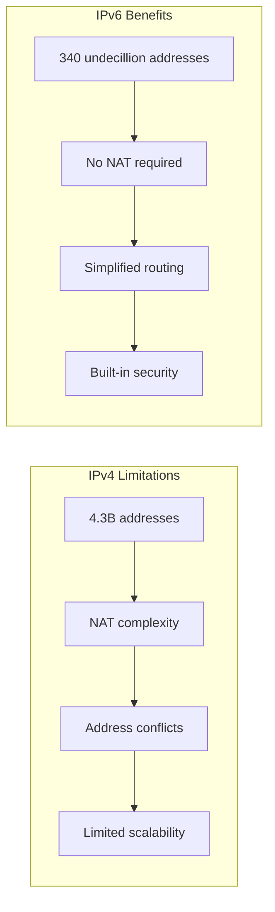
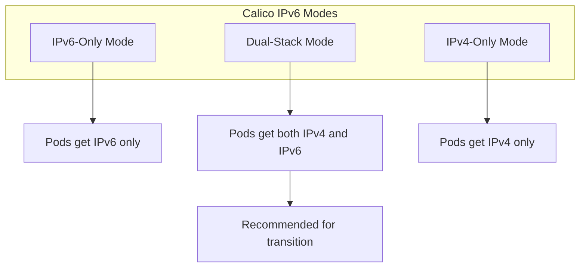

# How to Configure Calico CNI for IPv6 Networking in Kubernetes

Author: [nawazdhandala](https://github.com/nawazdhandala)

Tags: IPv6, Kubernetes, Calico, CNI, Networking, DevOps

Description: A comprehensive guide to configuring Calico CNI for IPv6 and dual-stack networking in Kubernetes, covering installation, configuration, network policies, and troubleshooting.

---

IPv4 address exhaustion is real. With 4.3 billion addresses already allocated and IoT devices multiplying exponentially, IPv6 adoption is no longer optional - it's necessary. Kubernetes clusters need to be ready for this transition, and Calico CNI provides robust IPv6 support that makes this possible.

This guide walks you through configuring Calico for IPv6-only and dual-stack networking in Kubernetes, from initial setup to advanced configurations.

## Why IPv6 in Kubernetes?

Before diving into configuration, let's understand why IPv6 matters for Kubernetes deployments:



### Key Benefits of IPv6 in Kubernetes

1. **Massive Address Space**: 340 undecillion (3.4 x 10^38) addresses eliminate IP exhaustion concerns
2. **End-to-End Connectivity**: No NAT means simplified troubleshooting and direct pod communication
3. **Improved Performance**: Simplified headers and no NAT translation overhead
4. **Better Security**: IPSec is mandatory in the IPv6 specification
5. **Future-Proof Infrastructure**: Government mandates and enterprise requirements increasingly require IPv6

## Prerequisites

Before configuring Calico for IPv6, ensure your environment meets these requirements:

### System Requirements

```bash
# Check kernel IPv6 support
cat /proc/sys/net/ipv6/conf/all/disable_ipv6
# Output should be 0 (IPv6 enabled)

# Verify IPv6 forwarding capability
sysctl net.ipv6.conf.all.forwarding
# Should return net.ipv6.conf.all.forwarding = 1

# Check Kubernetes version (1.21+ required for stable dual-stack)
kubectl version --short
```

### Enable IPv6 on All Nodes

```bash
#!/bin/bash
# enable-ipv6.sh
# Run this script on all Kubernetes nodes

# Enable IPv6 in kernel
cat <<EOF | sudo tee /etc/sysctl.d/99-kubernetes-ipv6.conf
# Enable IPv6
net.ipv6.conf.all.disable_ipv6 = 0
net.ipv6.conf.default.disable_ipv6 = 0
net.ipv6.conf.lo.disable_ipv6 = 0

# Enable IPv6 forwarding (required for Kubernetes)
net.ipv6.conf.all.forwarding = 1
net.ipv6.conf.default.forwarding = 1

# Accept Router Advertisements even when forwarding is enabled
net.ipv6.conf.all.accept_ra = 2
net.ipv6.conf.default.accept_ra = 2

# Enable neighbor discovery
net.ipv6.conf.all.accept_redirects = 0
net.ipv6.conf.default.accept_redirects = 0
EOF

# Apply sysctl settings
sudo sysctl --system

# Verify settings are applied
echo "Verifying IPv6 configuration..."
sysctl net.ipv6.conf.all.disable_ipv6
sysctl net.ipv6.conf.all.forwarding
```

### Kubernetes API Server Configuration

Your Kubernetes API server must be configured for IPv6 or dual-stack. Here's an example configuration:

```yaml
# /etc/kubernetes/manifests/kube-apiserver.yaml (relevant flags)
apiVersion: v1
kind: Pod
metadata:
  name: kube-apiserver
  namespace: kube-system
spec:
  containers:
  - command:
    - kube-apiserver
    # Enable dual-stack feature gate (stable in 1.23+)
    - --feature-gates=IPv6DualStack=true
    # Service CIDR for dual-stack
    - --service-cluster-ip-range=10.96.0.0/16,fd00:10:96::/112
    # Advertise address (use your node's IPv6 address)
    - --advertise-address=2001:db8:1::1
    # ... other flags
```

## Understanding Calico IPv6 Modes

Calico supports three networking modes for IPv6:



### Mode Comparison

| Feature | IPv4-Only | Dual-Stack | IPv6-Only |
|---------|-----------|------------|-----------|
| Pod addressing | IPv4 | IPv4 + IPv6 | IPv6 |
| Service ClusterIP | IPv4 | IPv4 + IPv6 | IPv6 |
| Legacy compatibility | Full | Full | Limited |
| Address space | Limited | Unlimited | Unlimited |
| NAT required | Often | Optional | No |
| Complexity | Low | Medium | Low |

## Installing Calico with IPv6 Support

### Option 1: Fresh Installation with Tigera Operator (Recommended)

The Tigera Operator is the recommended way to install Calico with IPv6 support.

```bash
# Install the Tigera Operator
kubectl create -f https://raw.githubusercontent.com/projectcalico/calico/v3.27.0/manifests/tigera-operator.yaml

# Wait for the operator to be ready
kubectl wait --for=condition=Available deployment/tigera-operator \
  -n tigera-operator --timeout=300s
```

### Option 2: Dual-Stack Installation

Create the Installation resource with dual-stack configuration:

```yaml
# calico-dual-stack-installation.yaml
apiVersion: operator.tigera.io/v1
kind: Installation
metadata:
  name: default
spec:
  # Dual-stack CNI configuration
  calicoNetwork:
    # Enable BGP for routing (recommended for production)
    bgp: Enabled

    # Configure IP pools for both address families
    ipPools:
      # IPv4 pool
      - name: default-ipv4-ippool
        cidr: 10.244.0.0/16
        encapsulation: VXLAN
        natOutgoing: Enabled
        nodeSelector: all()
        blockSize: 26

      # IPv6 pool
      - name: default-ipv6-ippool
        cidr: fd00:10:244::/48
        encapsulation: None
        natOutgoing: Disabled
        nodeSelector: all()
        blockSize: 122

    # Node address autodetection for dual-stack
    nodeAddressAutodetectionV4:
      firstFound: true
    nodeAddressAutodetectionV6:
      firstFound: true

  # Registry configuration (optional, for air-gapped environments)
  # registry: my-registry.example.com

  # Variant: Calico or Tigera Secure
  variant: Calico

---
# API Server configuration for Calico
apiVersion: operator.tigera.io/v1
kind: APIServer
metadata:
  name: default
spec: {}
```

Apply the installation:

```bash
# Apply the dual-stack installation
kubectl apply -f calico-dual-stack-installation.yaml

# Monitor the installation progress
kubectl get tigerastatus -w

# Verify Calico pods are running
kubectl get pods -n calico-system -o wide

# Check IP pools are created
kubectl get ippools -o wide
```

### Option 3: IPv6-Only Installation

For environments requiring pure IPv6 networking:

```yaml
# calico-ipv6-only-installation.yaml
apiVersion: operator.tigera.io/v1
kind: Installation
metadata:
  name: default
spec:
  calicoNetwork:
    bgp: Enabled

    # Single IPv6 pool
    ipPools:
      - name: default-ipv6-ippool
        cidr: fd00:10:244::/48
        encapsulation: None
        natOutgoing: Disabled
        nodeSelector: all()
        blockSize: 122

    # IPv6-only node address detection
    nodeAddressAutodetectionV6:
      firstFound: true

  variant: Calico

---
apiVersion: operator.tigera.io/v1
kind: APIServer
metadata:
  name: default
spec: {}
```

## Configuring IP Pools in Detail

IP Pools define the ranges of IP addresses that Calico assigns to pods. Understanding pool configuration is crucial for IPv6 deployments.

### IPv6 IP Pool Configuration

```yaml
# ipv6-ippool-detailed.yaml
apiVersion: crd.projectcalico.org/v1
kind: IPPool
metadata:
  name: production-ipv6-pool
spec:
  # IPv6 CIDR for pod addresses
  # Using a /48 gives you 65,536 /64 subnets
  cidr: 2001:db8:1::/48

  # Block size determines addresses per node
  # /122 = 64 addresses per block (recommended minimum for IPv6)
  # /120 = 256 addresses per block
  # /116 = 4096 addresses per block
  blockSize: 122

  # IPIP encapsulation (IPv4 only, set to Never for IPv6)
  ipipMode: Never

  # VXLAN encapsulation (optional for IPv6)
  # Use None for native IPv6 routing, VXLAN for overlay
  vxlanMode: Never

  # NAT outgoing traffic (typically disabled for IPv6)
  # IPv6 has enough addresses, NAT is unnecessary
  natOutgoing: false

  # Node selector to control which nodes use this pool
  # Use all() for all nodes, or specific labels for segmentation
  nodeSelector: all()

  # Disable this pool temporarily without deleting
  disabled: false
```

### Multiple IP Pools for Network Segmentation

```yaml
# segmented-ipv6-pools.yaml
# Production workload pool
apiVersion: crd.projectcalico.org/v1
kind: IPPool
metadata:
  name: production-pods-ipv6
spec:
  cidr: 2001:db8:1::/56
  blockSize: 122
  ipipMode: Never
  vxlanMode: Never
  natOutgoing: false
  nodeSelector: node-pool == "production"

---
# Development workload pool
apiVersion: crd.projectcalico.org/v1
kind: IPPool
metadata:
  name: development-pods-ipv6
spec:
  cidr: 2001:db8:2::/56
  blockSize: 122
  ipipMode: Never
  vxlanMode: Never
  natOutgoing: false
  nodeSelector: node-pool == "development"

---
# DMZ / External-facing services pool
apiVersion: crd.projectcalico.org/v1
kind: IPPool
metadata:
  name: dmz-pods-ipv6
spec:
  cidr: 2001:db8:3::/64
  blockSize: 122
  ipipMode: Never
  vxlanMode: Never
  natOutgoing: false
  nodeSelector: node-pool == "dmz"
```

### Assigning Pods to Specific IP Pools

```yaml
# pod-with-ipv6-pool-annotation.yaml
apiVersion: v1
kind: Pod
metadata:
  name: production-app
  namespace: production
  annotations:
    # Specify which IP pool to use for this pod
    cni.projectcalico.org/ipv6pools: '["production-pods-ipv6"]'
spec:
  containers:
  - name: app
    image: nginx:latest
    ports:
    - containerPort: 80
```

## BGP Configuration for IPv6

BGP (Border Gateway Protocol) is essential for routing IPv6 traffic efficiently in production environments.

### Basic BGP Configuration

```yaml
# bgp-configuration.yaml
apiVersion: crd.projectcalico.org/v1
kind: BGPConfiguration
metadata:
  name: default
spec:
  # Log level for BGP components
  logSeverityScreen: Info

  # Enable IPv6 in BGP
  # This allows Calico to advertise IPv6 routes
  serviceClusterIPs:
    - cidr: fd00:10:96::/112

  serviceExternalIPs:
    - cidr: 2001:db8:ff::/48

  # Node-to-node mesh for small clusters
  # Disable for large clusters using route reflectors
  nodeToNodeMeshEnabled: true

  # AS number for the cluster
  asNumber: 64512

  # Listen port for BGP connections
  listenPort: 179

  # Communities to tag routes with
  communities:
    - name: internal
      value: "64512:100"
```

### BGP Peer Configuration for External Routers

```yaml
# bgp-peer-external.yaml
apiVersion: crd.projectcalico.org/v1
kind: BGPPeer
metadata:
  name: datacenter-router-ipv6
spec:
  # IPv6 address of your external BGP router
  peerIP: 2001:db8:dc::1

  # AS number of the external router
  asNumber: 64513

  # Which nodes should peer with this router
  # Use nodeSelector to target specific nodes (e.g., border nodes)
  nodeSelector: border-router == "true"

  # Optional: password for BGP session
  # password:
  #   secretKeyRef:
  #     name: bgp-secrets
  #     key: router-password

  # Keep alive interval
  keepAliveTime: 30s

  # Hold time before considering peer down
  holdTime: 90s
```

### Route Reflector Setup for Large Clusters

For clusters with more than 50 nodes, use route reflectors instead of full mesh:

```yaml
# bgp-route-reflector.yaml
# First, label your route reflector nodes
# kubectl label node rr-node-1 route-reflector=true
# kubectl label node rr-node-2 route-reflector=true

# Disable node-to-node mesh
apiVersion: crd.projectcalico.org/v1
kind: BGPConfiguration
metadata:
  name: default
spec:
  nodeToNodeMeshEnabled: false
  asNumber: 64512

---
# Configure route reflector nodes
apiVersion: crd.projectcalico.org/v1
kind: BGPPeer
metadata:
  name: peer-with-route-reflectors
spec:
  nodeSelector: all()
  peerSelector: route-reflector == "true"

---
# Route reflectors peer with each other
apiVersion: crd.projectcalico.org/v1
kind: BGPPeer
metadata:
  name: route-reflector-mesh
spec:
  nodeSelector: route-reflector == "true"
  peerSelector: route-reflector == "true"
```

## Configuring Services for Dual-Stack

Kubernetes services need explicit configuration to work with dual-stack networking.

### Dual-Stack Service Example

```yaml
# dual-stack-service.yaml
apiVersion: v1
kind: Service
metadata:
  name: my-app
  namespace: production
spec:
  # Enable dual-stack for this service
  ipFamilyPolicy: PreferDualStack

  # Order of IP families (first is primary)
  ipFamilies:
    - IPv6
    - IPv4

  selector:
    app: my-app
  ports:
    - name: http
      port: 80
      targetPort: 8080
      protocol: TCP
    - name: https
      port: 443
      targetPort: 8443
      protocol: TCP
  type: ClusterIP
```

### Service IP Family Policies

```yaml
# IPv6-only service (requires cluster IPv6 support)
apiVersion: v1
kind: Service
metadata:
  name: ipv6-only-service
spec:
  ipFamilyPolicy: SingleStack
  ipFamilies:
    - IPv6
  selector:
    app: my-app
  ports:
    - port: 80
      targetPort: 8080
  type: ClusterIP

---
# Require both IP families (fail if not available)
apiVersion: v1
kind: Service
metadata:
  name: require-dual-stack-service
spec:
  ipFamilyPolicy: RequireDualStack
  ipFamilies:
    - IPv6
    - IPv4
  selector:
    app: my-app
  ports:
    - port: 80
      targetPort: 8080
  type: ClusterIP
```

### LoadBalancer Service with IPv6

```yaml
# loadbalancer-ipv6.yaml
apiVersion: v1
kind: Service
metadata:
  name: public-app
  namespace: production
  annotations:
    # MetalLB IPv6 pool annotation (if using MetalLB)
    metallb.universe.tf/address-pool: ipv6-pool
spec:
  ipFamilyPolicy: PreferDualStack
  ipFamilies:
    - IPv6
    - IPv4
  type: LoadBalancer
  selector:
    app: public-app
  ports:
    - name: http
      port: 80
      targetPort: 8080
    - name: https
      port: 443
      targetPort: 8443
```

## Network Policies with IPv6

Calico's Network Policies work seamlessly with IPv6 addresses.

### IPv6-Aware Network Policy

```yaml
# ipv6-network-policy.yaml
apiVersion: crd.projectcalico.org/v1
kind: NetworkPolicy
metadata:
  name: allow-ipv6-ingress
  namespace: production
spec:
  selector: app == "web"
  types:
    - Ingress
    - Egress
  ingress:
    # Allow traffic from specific IPv6 CIDR
    - action: Allow
      source:
        nets:
          - "2001:db8:1::/48"
      destination:
        ports:
          - 80
          - 443
    # Allow from pods with specific label
    - action: Allow
      source:
        selector: role == "frontend"
      destination:
        ports:
          - 8080
  egress:
    # Allow DNS resolution (IPv6)
    - action: Allow
      destination:
        selector: k8s-app == "kube-dns"
        ports:
          - 53
    # Allow outbound to external IPv6 services
    - action: Allow
      destination:
        nets:
          - "2001:db8:external::/48"
        ports:
          - 443
```

### Global Network Policy for Cluster-Wide IPv6 Rules

```yaml
# global-ipv6-policy.yaml
apiVersion: crd.projectcalico.org/v1
kind: GlobalNetworkPolicy
metadata:
  name: default-deny-ipv6-external
spec:
  # Apply to all pods in the cluster
  selector: all()
  types:
    - Egress
  egress:
    # Allow all internal cluster traffic
    - action: Allow
      destination:
        nets:
          - "fd00::/8"    # ULA range (internal)
          - "10.0.0.0/8"  # Private IPv4
    # Allow DNS
    - action: Allow
      destination:
        ports:
          - 53
    # Deny external IPv6 by default
    - action: Deny
      destination:
        nets:
          - "2000::/3"    # Global unicast IPv6

---
# Allow specific namespaces to access external IPv6
apiVersion: crd.projectcalico.org/v1
kind: GlobalNetworkPolicy
metadata:
  name: allow-external-ipv6-for-egress-pods
spec:
  selector: external-access == "allowed"
  types:
    - Egress
  egress:
    - action: Allow
      destination:
        nets:
          - "2000::/3"
```

## Felix Configuration for IPv6

Felix is Calico's per-node agent. Configure it for optimal IPv6 performance.

```yaml
# felix-configuration.yaml
apiVersion: crd.projectcalico.org/v1
kind: FelixConfiguration
metadata:
  name: default
spec:
  # Enable IPv6 support
  ipv6Support: true

  # Log level for troubleshooting
  logSeverityScreen: Info

  # Enable health checks
  healthEnabled: true
  healthHost: "::"
  healthPort: 9099

  # Prometheus metrics (IPv6 enabled)
  prometheusMetricsEnabled: true
  prometheusMetricsHost: "::"
  prometheusMetricsPort: 9091

  # Wireguard encryption (optional, for secure pod traffic)
  # wireguardEnabled: true
  # wireguardEnabledV6: true

  # Reporting interval for flow logs
  flowLogsFlushInterval: 15s

  # BPF dataplane (optional, for better performance)
  # bpfEnabled: true
  # bpfDataIfacePattern: "^(eth|ens|enp).*"

  # MTU configuration for IPv6
  # IPv6 minimum MTU is 1280, but 1500 is recommended
  mtu: 1500

  # iptables configuration
  iptablesBackend: Auto

  # Fail-safe inbound ports (allow even with deny-all policy)
  failsafeInboundHostPorts:
    - protocol: tcp
      port: 22    # SSH
    - protocol: tcp
      port: 179   # BGP
    - protocol: tcp
      port: 6443  # Kubernetes API

  # Fail-safe outbound ports
  failsafeOutboundHostPorts:
    - protocol: tcp
      port: 53   # DNS
    - protocol: udp
      port: 53   # DNS
    - protocol: tcp
      port: 179  # BGP
```

## Troubleshooting IPv6 in Calico

### Diagnostic Commands

```bash
#!/bin/bash
# calico-ipv6-diagnostics.sh

echo "=== Node IPv6 Addresses ==="
kubectl get nodes -o jsonpath='{range .items[*]}{.metadata.name}{"\t"}{.status.addresses[?(@.type=="InternalIP")].address}{"\n"}{end}'

echo -e "\n=== Calico Node Status ==="
kubectl get nodes -o custom-columns=NAME:.metadata.name,IPv4:.status.addresses[0].address,IPv6:.status.addresses[1].address

echo -e "\n=== IP Pools ==="
kubectl get ippools -o wide

echo -e "\n=== IP Pool Details ==="
kubectl get ippools -o yaml

echo -e "\n=== BGP Configuration ==="
kubectl get bgpconfigurations -o yaml

echo -e "\n=== BGP Peers ==="
kubectl get bgppeers -o yaml

echo -e "\n=== Felix Configuration ==="
kubectl get felixconfiguration default -o yaml

echo -e "\n=== Calico Nodes ==="
kubectl get pods -n calico-system -o wide

echo -e "\n=== Pod IPv6 Addresses (sample) ==="
kubectl get pods -A -o custom-columns='NAMESPACE:.metadata.namespace,NAME:.metadata.name,IPv6:.status.podIPs[?(@.ip=~".*:.*")].ip' | head -20
```

### Verify Pod IPv6 Connectivity

```bash
#!/bin/bash
# test-pod-ipv6-connectivity.sh

# Create a test namespace
kubectl create namespace ipv6-test 2>/dev/null

# Deploy test pods
cat <<EOF | kubectl apply -f -
apiVersion: v1
kind: Pod
metadata:
  name: ipv6-client
  namespace: ipv6-test
spec:
  containers:
  - name: alpine
    image: alpine:latest
    command: ["sleep", "infinity"]
---
apiVersion: v1
kind: Pod
metadata:
  name: ipv6-server
  namespace: ipv6-test
spec:
  containers:
  - name: nginx
    image: nginx:alpine
    ports:
    - containerPort: 80
EOF

# Wait for pods to be ready
echo "Waiting for test pods..."
kubectl wait --for=condition=Ready pod/ipv6-client -n ipv6-test --timeout=60s
kubectl wait --for=condition=Ready pod/ipv6-server -n ipv6-test --timeout=60s

# Get server IPv6 address
SERVER_IPV6=$(kubectl get pod ipv6-server -n ipv6-test -o jsonpath='{.status.podIPs[?(@.ip=~".*:.*")].ip}')
echo "Server IPv6 address: $SERVER_IPV6"

# Install curl in client pod
kubectl exec -n ipv6-test ipv6-client -- apk add --no-cache curl

# Test IPv6 connectivity
echo -e "\n=== Testing IPv6 Connectivity ==="
kubectl exec -n ipv6-test ipv6-client -- curl -6 -s --connect-timeout 5 "http://[$SERVER_IPV6]/" | head -5

# Test DNS resolution
echo -e "\n=== Testing DNS Resolution ==="
kubectl exec -n ipv6-test ipv6-client -- nslookup -type=AAAA kubernetes.default

# Cleanup
# kubectl delete namespace ipv6-test
```

### Common IPv6 Issues and Solutions

```bash
#!/bin/bash
# ipv6-troubleshooting-checklist.sh

echo "=== IPv6 Troubleshooting Checklist ==="

echo -e "\n1. Checking kernel IPv6 support..."
kubectl get nodes -o name | while read node; do
  echo "  Node: $node"
  kubectl debug node/${node#node/} -it --image=alpine -- cat /proc/sys/net/ipv6/conf/all/disable_ipv6 2>/dev/null | head -1
done

echo -e "\n2. Checking IPv6 forwarding..."
kubectl get nodes -o name | while read node; do
  echo "  Node: $node"
  kubectl debug node/${node#node/} -it --image=alpine -- sysctl net.ipv6.conf.all.forwarding 2>/dev/null | head -1
done

echo -e "\n3. Checking Calico IPv6 support in Felix..."
kubectl get felixconfiguration default -o jsonpath='{.spec.ipv6Support}'
echo ""

echo -e "\n4. Checking IP pool block allocations..."
kubectl get blockaffinities -o wide

echo -e "\n5. Checking BGP sessions..."
kubectl exec -n calico-system $(kubectl get pod -n calico-system -l k8s-app=calico-node -o name | head -1) -- birdcl6 show protocols

echo -e "\n6. Checking ip6tables rules..."
kubectl exec -n calico-system $(kubectl get pod -n calico-system -l k8s-app=calico-node -o name | head -1) -- ip6tables -L -n | head -30
```

### Issue: Pods Not Getting IPv6 Addresses

```yaml
# Ensure IP pool is correctly configured
apiVersion: crd.projectcalico.org/v1
kind: IPPool
metadata:
  name: ipv6-pool-fix
spec:
  cidr: fd00:10:244::/48
  blockSize: 122
  ipipMode: Never
  vxlanMode: Never
  natOutgoing: false
  nodeSelector: all()
  disabled: false    # Make sure pool is not disabled
```

```bash
# Check block allocation
kubectl get blockaffinities -o yaml

# Check if nodes have IPv6 blocks allocated
kubectl get nodes -o jsonpath='{range .items[*]}{.metadata.name}: {.spec.podCIDRs}{"\n"}{end}'

# Force Calico to recalculate blocks
kubectl delete pod -n calico-system -l k8s-app=calico-node
```

### Issue: BGP Sessions Not Establishing

```bash
# Check BGP status on Calico nodes
CALICO_POD=$(kubectl get pod -n calico-system -l k8s-app=calico-node -o name | head -1)

# Check bird6 (IPv6 BGP daemon) status
kubectl exec -n calico-system $CALICO_POD -- birdcl6 show protocols all

# Check BGP session logs
kubectl logs -n calico-system $CALICO_POD -c calico-node | grep -i bgp

# Verify BGP peer configuration
kubectl get bgppeers -o yaml
```

## Production Best Practices

### 1. Use ULA Addresses for Internal Traffic

```yaml
# Unique Local Addresses (fd00::/8) for pod networking
apiVersion: crd.projectcalico.org/v1
kind: IPPool
metadata:
  name: ula-pod-pool
spec:
  cidr: fd00:cafe:1::/48   # ULA prefix (private, not routable globally)
  blockSize: 122
  ipipMode: Never
  natOutgoing: false
  nodeSelector: all()
```

### 2. Implement Network Segmentation

```yaml
# Separate pools for different environments
apiVersion: crd.projectcalico.org/v1
kind: IPPool
metadata:
  name: production-ipv6
spec:
  cidr: fd00:prod::/48
  blockSize: 122
  ipipMode: Never
  nodeSelector: environment == "production"

---
apiVersion: crd.projectcalico.org/v1
kind: IPPool
metadata:
  name: staging-ipv6
spec:
  cidr: fd00:stag::/48
  blockSize: 122
  ipipMode: Never
  nodeSelector: environment == "staging"
```

### 3. Enable WireGuard for Encrypted Traffic

```yaml
# Felix configuration with WireGuard
apiVersion: crd.projectcalico.org/v1
kind: FelixConfiguration
metadata:
  name: default
spec:
  ipv6Support: true
  wireguardEnabled: true
  wireguardEnabledV6: true
  wireguardMTU: 1400
```

### 4. Configure Proper MTU

```yaml
# Installation with correct MTU for IPv6
apiVersion: operator.tigera.io/v1
kind: Installation
metadata:
  name: default
spec:
  calicoNetwork:
    mtu: 1500    # Standard Ethernet MTU
    # Or for tunneled traffic:
    # mtu: 1440  # Account for VXLAN overhead
    ipPools:
      - cidr: fd00:10:244::/48
        blockSize: 122
```

### 5. Monitor IPv6 Traffic

```yaml
# Prometheus ServiceMonitor for Calico metrics
apiVersion: monitoring.coreos.com/v1
kind: ServiceMonitor
metadata:
  name: calico-felix
  namespace: monitoring
spec:
  selector:
    matchLabels:
      k8s-app: calico-node
  namespaceSelector:
    matchNames:
      - calico-system
  endpoints:
    - port: metrics
      interval: 15s
      path: /metrics
```

## Complete Dual-Stack Deployment Example

Here's a complete example deploying an application with dual-stack networking:

```yaml
# complete-dual-stack-deployment.yaml

# Namespace
apiVersion: v1
kind: Namespace
metadata:
  name: dual-stack-demo
  labels:
    name: dual-stack-demo

---
# Deployment
apiVersion: apps/v1
kind: Deployment
metadata:
  name: web-app
  namespace: dual-stack-demo
spec:
  replicas: 3
  selector:
    matchLabels:
      app: web-app
  template:
    metadata:
      labels:
        app: web-app
      annotations:
        # Use both IPv4 and IPv6 pools
        cni.projectcalico.org/ipv4pools: '["default-ipv4-ippool"]'
        cni.projectcalico.org/ipv6pools: '["default-ipv6-ippool"]'
    spec:
      containers:
        - name: nginx
          image: nginx:alpine
          ports:
            - containerPort: 80
              name: http
          resources:
            requests:
              memory: "64Mi"
              cpu: "100m"
            limits:
              memory: "128Mi"
              cpu: "200m"
          readinessProbe:
            httpGet:
              path: /
              port: 80
            initialDelaySeconds: 5
            periodSeconds: 10
          livenessProbe:
            httpGet:
              path: /
              port: 80
            initialDelaySeconds: 10
            periodSeconds: 20

---
# Dual-stack Service
apiVersion: v1
kind: Service
metadata:
  name: web-app
  namespace: dual-stack-demo
spec:
  ipFamilyPolicy: RequireDualStack
  ipFamilies:
    - IPv6
    - IPv4
  selector:
    app: web-app
  ports:
    - name: http
      port: 80
      targetPort: 80
  type: ClusterIP

---
# Network Policy allowing ingress
apiVersion: networking.k8s.io/v1
kind: NetworkPolicy
metadata:
  name: web-app-ingress
  namespace: dual-stack-demo
spec:
  podSelector:
    matchLabels:
      app: web-app
  policyTypes:
    - Ingress
  ingress:
    - ports:
        - protocol: TCP
          port: 80

---
# Calico-specific network policy for IPv6
apiVersion: crd.projectcalico.org/v1
kind: NetworkPolicy
metadata:
  name: allow-ipv6-monitoring
  namespace: dual-stack-demo
spec:
  selector: app == "web-app"
  types:
    - Ingress
  ingress:
    - action: Allow
      source:
        namespaceSelector: name == "monitoring"
      destination:
        ports:
          - 9090
```

## Summary Table: Calico IPv6 Configuration Reference

| Configuration | Purpose | Recommended Value |
|---------------|---------|-------------------|
| `ipPools[].cidr` | Pod IP range | `/48` for large clusters, `/56` for smaller |
| `ipPools[].blockSize` | IPs per node block | `122` (64 addresses) to `116` (4096 addresses) |
| `ipPools[].encapsulation` | Traffic encapsulation | `None` for native routing, `VXLAN` for overlay |
| `ipPools[].natOutgoing` | NAT for external traffic | `false` for IPv6 (not needed) |
| `nodeAddressAutodetectionV6` | Node IP detection | `firstFound: true` or specific `interface` |
| `bgp` | BGP routing | `Enabled` for production |
| `felixConfiguration.ipv6Support` | Enable IPv6 in Felix | `true` |
| `felixConfiguration.mtu` | Network MTU | `1500` (or `1440` with VXLAN) |
| Service `ipFamilyPolicy` | Service IP families | `PreferDualStack` or `RequireDualStack` |
| Service `ipFamilies` | IP family order | `[IPv6, IPv4]` (IPv6 preferred) |

## Conclusion

Configuring Calico CNI for IPv6 in Kubernetes prepares your infrastructure for the future while solving real addressing challenges today. The key points to remember:

1. **Start with dual-stack**: Maintain IPv4 compatibility while adding IPv6 support
2. **Use ULA addresses** (fd00::/8) for internal pod networking
3. **Enable BGP** for efficient routing in production environments
4. **Configure network policies** to secure both IPv4 and IPv6 traffic
5. **Test thoroughly** before deploying to production
6. **Monitor IPv6-specific metrics** to catch issues early

IPv6 adoption in Kubernetes is not just about future-proofing - it simplifies networking by eliminating NAT, reduces operational overhead, and enables true end-to-end connectivity. With Calico's robust IPv6 support, you can confidently build and operate dual-stack clusters at scale.

For monitoring your IPv6-enabled Kubernetes clusters, consider using OneUptime's comprehensive observability platform to track network performance, detect connectivity issues, and ensure your dual-stack deployment operates smoothly.
