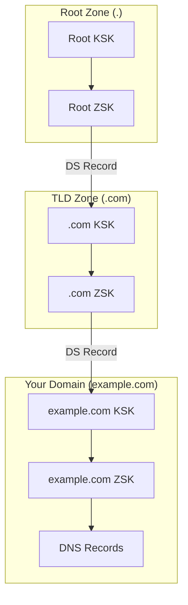

# How to Check DNSSEC Chain of Trust from Root to Your Domain

Author: [nawazdhandala](https://www.github.com/nawazdhandala)

Tags: DNSSEC, DNS, Security, Validation, Infrastructure, DevOps

Description: A comprehensive guide to verifying DNSSEC chain of trust from the root zone to your domain using dig, delv, and other validation tools with practical troubleshooting steps.

---

DNSSEC (Domain Name System Security Extensions) adds cryptographic signatures to DNS records, creating a chain of trust from the root zone down to your domain. When this chain breaks, resolvers that perform DNSSEC validation will refuse to resolve your domain, making your site unreachable for security-conscious users. Understanding how to verify this chain is essential for any DevOps engineer managing DNS infrastructure.

## Understanding the DNSSEC Chain of Trust

Before diving into verification commands, let's understand what we're validating.



### Key Components

- **KSK (Key Signing Key)**: Signs the DNSKEY RRset. Used to establish trust with the parent zone.
- **ZSK (Zone Signing Key)**: Signs all other records in the zone. Rotated more frequently than KSK.
- **DS (Delegation Signer)**: Hash of the child zone's KSK, stored in the parent zone.
- **RRSIG**: Cryptographic signature for a record set.
- **DNSKEY**: Public keys used for verification.

### The Trust Chain

1. Root zone's public keys are hardcoded in DNSSEC-validating resolvers (trust anchors)
2. Root zone signs DS record pointing to .com
3. .com zone signs DS record pointing to example.com
4. example.com zone signs all its records
5. Resolver verifies each link in the chain

## Prerequisites: Install Required Tools

```bash
# Debian/Ubuntu
sudo apt-get install dnsutils bind9-dnsutils ldnsutils

# RHEL/CentOS/Fedora
sudo dnf install bind-utils ldns

# macOS
brew install bind ldns

# Verify installation
dig -v && delv -v && drill -v
```

## Method 1: Using dig to Trace the Chain

### Step 1: Query with DNSSEC Enabled

```bash
dig +dnssec example.com A

# Expected output includes RRSIG records
;; ANSWER SECTION:
example.com.        3600    IN  A       93.184.216.34
example.com.        3600    IN  RRSIG   A 13 2 3600 20260201000000 20260115000000 12345 example.com. ABC123...
```

### Step 2: Trace from Root to Domain

```bash
dig +trace +dnssec example.com A
```

This shows each delegation step:

```
.                       518400  IN  NS      a.root-servers.net.
.                       518400  IN  RRSIG   NS 8 0 518400 ...

com.                    172800  IN  NS      a.gtld-servers.net.
com.                    86400   IN  DS      30909 8 2 E2D3C9...
com.                    86400   IN  RRSIG   DS 8 1 86400 ...

example.com.            172800  IN  NS      ns1.example.com.
example.com.            86400   IN  DS      12345 13 2 ABCDEF...
example.com.            86400   IN  RRSIG   DS 8 2 86400 ...

example.com.            3600    IN  A       93.184.216.34
example.com.            3600    IN  RRSIG   A 13 2 3600 ...
```

### Step 3: Verify DNSKEY Records

```bash
dig +dnssec example.com DNSKEY

# Expected output
;; ANSWER SECTION:
example.com.        3600    IN  DNSKEY  256 3 13 oJMRESz5E4g...  ; ZSK
example.com.        3600    IN  DNSKEY  257 3 13 mdsswUyr3DPW...  ; KSK
example.com.        3600    IN  RRSIG   DNSKEY 13 2 3600 ...
```

The flag values indicate key type: **256** = ZSK, **257** = KSK

### Step 4: Verify DS Record in Parent Zone

```bash
dig +dnssec example.com DS @a.gtld-servers.net

# Expected output
example.com.        86400   IN  DS      12345 13 2 ABCDEF0123456789...
example.com.        86400   IN  RRSIG   DS 8 2 86400 ...
```

## Method 2: Using delv for DNSSEC Validation

`delv` (Domain Entity Lookup and Validation) is specifically designed for DNSSEC verification.

```bash
# Basic validation
delv example.com A

# Successful output
; fully validated
example.com.        3600    IN  A       93.184.216.34
```

### Trace the Chain of Trust

```bash
delv +vtrace example.com A
```

Output shows each validation step:

```
;; validating example.com/A: starting
;; validating example.com/DNSKEY: starting
;; validating example.com/DS: starting
;; validating com/DNSKEY: starting
;; validating com/DS: starting
;; validating ./DNSKEY: keyset with trust anchor 'found'
;; validating com/DS: fully validated
;; validating com/DNSKEY: fully validated
;; validating example.com/DS: fully validated
;; validating example.com/DNSKEY: fully validated
;; validating example.com/A: fully validated
```

### Check Different Record Types

```bash
delv example.com MX      # Validate MX records
delv example.com AAAA    # Validate AAAA records
delv @8.8.8.8 example.com A  # Use specific resolver
```

## Method 3: Using drill for Chain Verification

```bash
# Chase signatures from root
drill -S example.com
```

Example output:

```
;; Number of trusted keys: 1
;; Chasing: example.com. A

DNSSEC Trust tree:
example.com. (A)
|---example.com. (DNSKEY keytag: 12345 alg: 13 flags: 257)
    |---example.com. (DS keytag: 12345 digest type: 2)
        |---com. (DNSKEY keytag: 30909 alg: 8 flags: 257)
            |---com. (DS keytag: 30909 digest type: 2)
                |---. (DNSKEY keytag: 20326 alg: 8 flags: 257)
;; Chase successful
```

## Method 4: Manual Step-by-Step Verification

### Verify Root Zone

```bash
dig +dnssec . DNSKEY
# Trust anchor KSK key tag: 20326
```

### Verify TLD Zone

```bash
dig +dnssec com DS @a.root-servers.net
dig +dnssec com DNSKEY @a.gtld-servers.net
```

### Verify Your Domain

```bash
dig +dnssec example.com DS @a.gtld-servers.net
dig +dnssec example.com DNSKEY @ns1.example.com
dnssec-dsfromkey -2 example.com.dnskey  # Calculate DS to verify match
```

## Automated Verification Script

```bash
#!/bin/bash
# dnssec-verify.sh - Verify DNSSEC chain of trust

DOMAIN=${1:-example.com}
RESOLVER=${2:-8.8.8.8}

echo "=========================================="
echo "DNSSEC Chain of Trust Verification"
echo "Domain: $DOMAIN"
echo "=========================================="

# Check if DNSSEC is enabled
echo -e "\n--- Checking DNSSEC Status ---"
DNSSEC_CHECK=$(dig +dnssec +short "$DOMAIN" DNSKEY @$RESOLVER 2>/dev/null)
if [ -n "$DNSSEC_CHECK" ]; then
    echo "[OK] DNSSEC is enabled for $DOMAIN"
else
    echo "[FAIL] No DNSKEY records found"
    exit 1
fi

# Verify DNSKEY records
echo -e "\n--- DNSKEY Records ---"
dig +dnssec "$DOMAIN" DNSKEY @$RESOLVER +short | while read line; do
    FLAG=$(echo $line | awk '{print $1}')
    ALG=$(echo $line | awk '{print $3}')
    [ "$FLAG" = "257" ] && echo "KSK found (Algorithm: $ALG)"
    [ "$FLAG" = "256" ] && echo "ZSK found (Algorithm: $ALG)"
done

# Verify DS record exists in parent
echo -e "\n--- DS Record in Parent Zone ---"
DS_RECORD=$(dig +short "$DOMAIN" DS @$RESOLVER 2>/dev/null)
if [ -n "$DS_RECORD" ]; then
    echo "[OK] DS record found"
    echo "$DS_RECORD"
else
    echo "[FAIL] No DS record found in parent zone"
fi

# Verify signatures are valid
echo -e "\n--- Signature Validation ---"
RRSIG=$(dig +dnssec "$DOMAIN" A @$RESOLVER | grep RRSIG)
if [ -n "$RRSIG" ]; then
    EXPIRY=$(echo $RRSIG | awk '{print $9}')
    echo "[OK] RRSIG found, expires: $EXPIRY"
else
    echo "[FAIL] No RRSIG record found"
fi

# Full chain validation with delv
echo -e "\n--- Full Chain Validation ---"
if command -v delv &> /dev/null; then
    DELV_RESULT=$(delv @$RESOLVER "$DOMAIN" A 2>&1)
    if echo "$DELV_RESULT" | grep -q "fully validated"; then
        echo "[OK] Chain of trust fully validated"
    else
        echo "[FAIL] Chain validation failed"
        echo "$DELV_RESULT"
    fi
fi

echo -e "\n=========================================="
```

## Online Verification Tools

When CLI tools are unavailable:

- **DNSViz**: `https://dnsviz.net/d/example.com/analyze/`
- **Verisign DNSSEC Debugger**: `https://dnssec-debugger.verisignlabs.com/example.com`
- **SIDN Labs Check**: `https://check.sidnlabs.nl/dane/example.com`

## Common DNSSEC Problems and Troubleshooting

### Problem 1: Missing DS Record

**Symptom**: `delv` shows "broken chain of trust"

```bash
dig +short example.com DS  # If empty, DS not published
```

**Solution**: Generate and submit DS record to registrar

```bash
dig +short example.com DNSKEY | grep "^257" > ksk.key
dnssec-dsfromkey -2 ksk.key
```

### Problem 2: DS/DNSKEY Mismatch

**Symptom**: `SERVFAIL` from validating resolvers

```bash
dig +short example.com DS @a.gtld-servers.net
dig +short example.com DNSKEY @ns1.example.com | grep "^257"
```

**Solution**: Update DS record at registrar with correct DNSKEY hash

### Problem 3: Expired Signatures

**Symptom**: Intermittent resolution failures

```bash
dig +dnssec example.com A | grep RRSIG
# Check inception and expiration dates (YYYYMMDDHHMMSS)
```

**Solution**: Re-sign the zone

```bash
rndc sign example.com
```

### Problem 4: Algorithm Mismatch

**Symptom**: Validation fails despite correct DS record

```bash
dig +short example.com DS       # Shows algorithm number
dig +short example.com DNSKEY   # Must use same algorithm
```

**Solution**: Ensure DS record uses same algorithm as DNSKEY

### Problem 5: Clock Skew

**Symptom**: Signatures appear invalid on some systems

```bash
date -u
ntpdate -q pool.ntp.org
```

**Solution**: Synchronize system clocks

### Problem 6: Key Rollover Issues

**Symptom**: Validation fails after key rollover

```bash
dig +dnssec example.com DNSKEY  # Should see both old and new keys
```

**Solution**: Follow proper key rollover procedure

```bash
# Pre-publish method:
# 1. Add new DNSKEY (both keys active)
# 2. Wait for TTL expiration
# 3. Update DS record in parent
# 4. Wait for parent TTL expiration
# 5. Remove old DNSKEY
```

## Monitoring DNSSEC Health

### Prometheus Alert Rules

```yaml
groups:
  - name: dnssec
    rules:
      - alert: DNSSECSignatureExpiringSoon
        expr: (dns_dnssec_signature_expiry - time()) < 86400
        for: 1h
        labels:
          severity: warning
        annotations:
          summary: "DNSSEC signature expiring within 24 hours"

      - alert: DNSSECValidationFailed
        expr: dns_dnssec_valid == 0
        for: 5m
        labels:
          severity: critical
        annotations:
          summary: "DNSSEC validation failed"
```

### Cron Job for Regular Checks

```bash
#!/bin/bash
# /etc/cron.daily/dnssec-check
DOMAINS="example.com example.org"
ALERT_EMAIL="admin@example.com"

for domain in $DOMAINS; do
    result=$(delv $domain A 2>&1)
    if ! echo "$result" | grep -q "fully validated"; then
        echo "DNSSEC validation failed for $domain" | \
            mail -s "DNSSEC Alert: $domain" $ALERT_EMAIL
    fi
done
```

## DNSSEC Algorithms Reference

| Algorithm | Number | Status | Notes |
|-----------|--------|--------|-------|
| RSA/SHA-256 | 8 | Recommended | Good balance of security and compatibility |
| RSA/SHA-512 | 10 | Acceptable | Larger signatures |
| ECDSA P-256 | 13 | Recommended | Smaller keys and signatures |
| ECDSA P-384 | 14 | Acceptable | Higher security margin |
| Ed25519 | 15 | Recommended | Best performance, newest |
| Ed448 | 16 | Acceptable | Highest security |

## Summary Table: Verification Commands

| Task | dig | delv | drill |
|------|-----|------|-------|
| Basic DNSSEC query | `dig +dnssec domain A` | `delv domain A` | `drill -D domain A` |
| Trace from root | `dig +trace +dnssec domain A` | `delv +vtrace domain A` | `drill -T domain A` |
| Get DNSKEY | `dig +dnssec domain DNSKEY` | `delv domain DNSKEY` | `drill domain DNSKEY` |
| Get DS record | `dig +dnssec domain DS` | `delv domain DS` | `drill domain DS` |
| Chase signatures | N/A | `delv +vtrace domain A` | `drill -S domain` |
| Custom resolver | `dig @8.8.8.8 +dnssec domain A` | `delv @8.8.8.8 domain A` | `drill @8.8.8.8 domain A` |

## Summary Table: Common Issues and Solutions

| Issue | Symptom | Diagnostic Command | Solution |
|-------|---------|-------------------|----------|
| Missing DS | Chain broken at parent | `dig +short domain DS` | Add DS at registrar |
| DS mismatch | SERVFAIL from validators | Compare DS with DNSKEY hash | Update DS record |
| Expired RRSIG | Intermittent failures | `dig +dnssec domain A \| grep RRSIG` | Re-sign zone |
| Algorithm mismatch | Validation fails | Check algorithm in DS vs DNSKEY | Use matching algorithm |
| Clock skew | Time-based failures | `date -u; ntpdate -q pool.ntp.org` | Sync NTP |
| Key rollover | Post-rollover failures | `dig +dnssec domain DNSKEY` | Follow rollover procedure |

## Conclusion

Verifying the DNSSEC chain of trust is essential for maintaining secure and reliable DNS resolution. A broken chain means security-conscious resolvers will refuse to resolve your domain, causing outages for a growing number of users as DNSSEC validation becomes more widespread.

Key takeaways:

1. **Always verify the full chain** from root to your domain, not just individual records
2. **Use multiple tools** (`dig`, `delv`, `drill`) for comprehensive verification
3. **Monitor signature expiration** proactively to prevent outages
4. **Test DS records** before and after key rollovers
5. **Set up automated monitoring** with alerts for validation failures

By incorporating these verification steps into your DNS management workflow, you can ensure that your DNSSEC implementation remains secure and functional, protecting your users from DNS spoofing and cache poisoning attacks while maintaining high availability.
