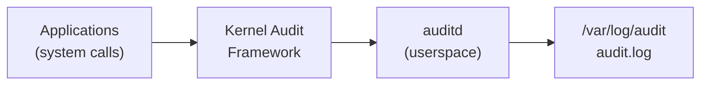

# How to Configure auditd for System Auditing on Ubuntu

Author: [nawazdhandala](https://www.github.com/nawazdhandala)

Tags: Ubuntu, auditd, Auditing, Security, Compliance, Tutorial

Description: Complete guide to configuring Linux Audit System (auditd) on Ubuntu for security monitoring and compliance.

---

System auditing is a critical component of any security-conscious infrastructure. The Linux Audit System (auditd) provides a comprehensive framework for tracking security-relevant events on your Ubuntu systems. Whether you need to meet compliance requirements like PCI-DSS, HIPAA, or CIS benchmarks, or simply want better visibility into system activities, auditd is an essential tool in your security arsenal.

## Understanding the Linux Audit System

The Linux Audit System operates at the kernel level, intercepting system calls and generating audit records based on configurable rules. This architecture provides several key advantages:



### Key Components

- **auditd**: The userspace daemon that writes audit records to disk
- **auditctl**: Command-line utility for controlling the audit system
- **ausearch**: Tool for searching audit logs
- **aureport**: Report generation utility
- **audispd**: Audit event multiplexor for sending events to other applications
- **augenrules**: Script to merge rule files into a single rules file

### How Audit Events Flow

1. An application makes a system call
2. The kernel audit framework intercepts the call
3. Rules are evaluated to determine if an audit record should be generated
4. Matching events are sent to the auditd daemon via a netlink socket
5. auditd writes records to the audit log file
6. Optional: Events can be forwarded to remote systems or SIEM solutions

## Installing auditd

On Ubuntu, the audit framework is available in the default repositories. Install it using:

```bash
# Update package lists
sudo apt update

# Install the audit daemon and utilities
sudo apt install auditd audispd-plugins

# The audit daemon starts automatically after installation
# Verify the service is running
sudo systemctl status auditd
```

You should see output indicating the service is active:

```
● auditd.service - Security Auditing Service
     Loaded: loaded (/lib/systemd/system/auditd.service; enabled; vendor preset: enabled)
     Active: active (running) since Wed 2026-01-15 10:00:00 UTC; 1min ago
       Docs: man:auditd(8)
    Process: 1234 ExecStart=/sbin/auditd (code=exited, status=0/SUCCESS)
   Main PID: 1235 (auditd)
      Tasks: 4 (limit: 4915)
     Memory: 1.2M
        CPU: 12ms
     CGroup: /system.slice/auditd.service
             └─1235 /sbin/auditd
```

### Important Configuration Files

```bash
# Main audit daemon configuration
/etc/audit/auditd.conf

# Audit rules directory (rules loaded at boot)
/etc/audit/rules.d/

# Main rules file (generated from rules.d/)
/etc/audit/audit.rules

# Audit event dispatcher configuration
/etc/audit/plugins.d/
```

## Audit Rules Syntax

Understanding audit rule syntax is fundamental to effective system auditing. There are three types of rules:

### 1. Control Rules

Control rules configure the audit system's behavior:

```bash
# Set the backlog buffer size (number of audit messages to queue)
# Increase this if you see "audit: backlog limit exceeded" messages
-b 8192

# Set failure mode: 0=silent, 1=printk, 2=panic
# Use 2 for high-security environments where audit failure is unacceptable
-f 1

# Enable auditing (1) or disable (0)
-e 1

# Make rules immutable (requires reboot to change)
# Use this in production to prevent tampering
-e 2

# Set the rate limit for audit messages per second
# 0 means unlimited; use this carefully
-r 0
```

### 2. File System Rules (Watch Rules)

File system rules monitor access to files and directories:

```bash
# Syntax: -w <path> -p <permissions> -k <key>
#
# Permissions:
#   r = read
#   w = write
#   x = execute
#   a = attribute change

# Monitor changes to the password file
-w /etc/passwd -p wa -k identity_changes

# Monitor the shadow file for any access
-w /etc/shadow -p rwxa -k shadow_access

# Monitor an entire directory
-w /etc/ssh/ -p wa -k ssh_config_changes
```

### 3. System Call Rules

System call rules are more powerful but require understanding of system call numbers and architectures:

```bash
# Syntax: -a <action>,<list> -S <syscall> -F <field>=<value> -k <key>
#
# Actions:
#   always - always generate an audit record
#   never  - never generate an audit record
#
# Lists:
#   task     - audit at task creation (fork, clone)
#   exit     - audit at syscall exit
#   user     - audit user-space events
#   exclude  - exclude events

# Monitor all execve (program execution) system calls
-a always,exit -F arch=b64 -S execve -k program_execution
-a always,exit -F arch=b32 -S execve -k program_execution

# Monitor file deletion
-a always,exit -F arch=b64 -S unlink,unlinkat,rename,renameat -F auid>=1000 -F auid!=4294967295 -k file_deletion

# Monitor privilege escalation attempts
-a always,exit -F arch=b64 -S setuid,setgid,setreuid,setregid -k privilege_escalation
```

### Field Definitions

Common fields used in system call rules:

| Field | Description | Example |
|-------|-------------|---------|
| arch | System architecture | arch=b64 (64-bit), arch=b32 (32-bit) |
| auid | Audit UID (original login UID) | auid>=1000 |
| uid | Effective user ID | uid=0 |
| gid | Effective group ID | gid=0 |
| euid | Effective user ID | euid=0 |
| pid | Process ID | pid=1234 |
| ppid | Parent process ID | ppid=1 |
| success | Syscall succeeded | success=1 |
| exit | Syscall exit code | exit=-13 |
| path | File path | path=/etc/passwd |
| key | Search key | key=passwd_changes |

## File and Directory Monitoring

Monitoring critical files and directories is one of the most common uses of auditd. Here are comprehensive examples:

```bash
# /etc/audit/rules.d/30-file-monitoring.rules
#
# This rule set monitors critical system files and directories
# for unauthorized access or modification attempts.

#----------------------------------------------------------------------
# Identity and Authentication Files
#----------------------------------------------------------------------

# Monitor user account files
-w /etc/passwd -p wa -k identity
-w /etc/shadow -p wa -k identity
-w /etc/group -p wa -k identity
-w /etc/gshadow -p wa -k identity

# Monitor user security limits
-w /etc/security/opasswd -p wa -k identity
-w /etc/security/limits.conf -p wa -k identity
-w /etc/security/limits.d/ -p wa -k identity

#----------------------------------------------------------------------
# Network Configuration
#----------------------------------------------------------------------

# Monitor network configuration changes
-w /etc/hosts -p wa -k network_config
-w /etc/hostname -p wa -k network_config
-w /etc/network/ -p wa -k network_config
-w /etc/netplan/ -p wa -k network_config
-w /etc/resolv.conf -p wa -k network_config

# Monitor firewall rules
-w /etc/ufw/ -p wa -k firewall
-w /etc/iptables/ -p wa -k firewall
-w /etc/nftables.conf -p wa -k firewall

#----------------------------------------------------------------------
# System Configuration
#----------------------------------------------------------------------

# Monitor system startup files
-w /etc/init.d/ -p wa -k init
-w /etc/systemd/ -p wa -k systemd
-w /lib/systemd/ -p wa -k systemd

# Monitor cron jobs
-w /etc/crontab -p wa -k cron
-w /etc/cron.d/ -p wa -k cron
-w /etc/cron.daily/ -p wa -k cron
-w /etc/cron.hourly/ -p wa -k cron
-w /etc/cron.weekly/ -p wa -k cron
-w /etc/cron.monthly/ -p wa -k cron
-w /var/spool/cron/ -p wa -k cron

# Monitor at jobs
-w /var/spool/at/ -p wa -k at_jobs
-w /etc/at.allow -p wa -k at_jobs
-w /etc/at.deny -p wa -k at_jobs

#----------------------------------------------------------------------
# SSH Configuration
#----------------------------------------------------------------------

# Monitor SSH server and client configuration
-w /etc/ssh/sshd_config -p wa -k sshd_config
-w /etc/ssh/sshd_config.d/ -p wa -k sshd_config
-w /etc/ssh/ssh_config -p wa -k ssh_config
-w /root/.ssh/ -p wa -k root_ssh

#----------------------------------------------------------------------
# Logging Configuration
#----------------------------------------------------------------------

# Monitor logging configuration
-w /etc/rsyslog.conf -p wa -k logging
-w /etc/rsyslog.d/ -p wa -k logging
-w /etc/audit/auditd.conf -p wa -k audit_config
-w /etc/audit/rules.d/ -p wa -k audit_config

#----------------------------------------------------------------------
# Package Management
#----------------------------------------------------------------------

# Monitor package manager configurations
-w /etc/apt/sources.list -p wa -k package_sources
-w /etc/apt/sources.list.d/ -p wa -k package_sources
-w /etc/apt/apt.conf -p wa -k package_config
-w /etc/apt/apt.conf.d/ -p wa -k package_config
```

## System Call Auditing

System call auditing provides deep visibility into program behavior. Here are essential rules:

```bash
# /etc/audit/rules.d/40-system-calls.rules
#
# Monitor critical system calls for security-relevant activity

#----------------------------------------------------------------------
# Process and Program Execution
#----------------------------------------------------------------------

# Log all program executions (critical for security monitoring)
# This captures what programs are run and by whom
-a always,exit -F arch=b64 -S execve -k exec
-a always,exit -F arch=b32 -S execve -k exec

# Log all program executions by root
-a always,exit -F arch=b64 -S execve -F euid=0 -k root_exec
-a always,exit -F arch=b32 -S execve -F euid=0 -k root_exec

#----------------------------------------------------------------------
# File System Operations
#----------------------------------------------------------------------

# Monitor file creation and deletion
-a always,exit -F arch=b64 -S creat,open,openat,open_by_handle_at -F exit=-EACCES -k access_denied
-a always,exit -F arch=b64 -S creat,open,openat,open_by_handle_at -F exit=-EPERM -k access_denied
-a always,exit -F arch=b32 -S creat,open,openat,open_by_handle_at -F exit=-EACCES -k access_denied
-a always,exit -F arch=b32 -S creat,open,openat,open_by_handle_at -F exit=-EPERM -k access_denied

# Monitor file deletions by users (not system accounts)
-a always,exit -F arch=b64 -S unlink,unlinkat,rename,renameat,rmdir -F auid>=1000 -F auid!=4294967295 -k file_deletion
-a always,exit -F arch=b32 -S unlink,unlinkat,rename,renameat,rmdir -F auid>=1000 -F auid!=4294967295 -k file_deletion

# Monitor file permission changes
-a always,exit -F arch=b64 -S chmod,fchmod,fchmodat -F auid>=1000 -F auid!=4294967295 -k permission_change
-a always,exit -F arch=b32 -S chmod,fchmod,fchmodat -F auid>=1000 -F auid!=4294967295 -k permission_change

# Monitor file ownership changes
-a always,exit -F arch=b64 -S chown,fchown,fchownat,lchown -F auid>=1000 -F auid!=4294967295 -k ownership_change
-a always,exit -F arch=b32 -S chown,fchown,fchownat,lchown -F auid>=1000 -F auid!=4294967295 -k ownership_change

# Monitor extended attribute changes (used by SELinux/AppArmor)
-a always,exit -F arch=b64 -S setxattr,lsetxattr,fsetxattr,removexattr,lremovexattr,fremovexattr -F auid>=1000 -F auid!=4294967295 -k xattr_change
-a always,exit -F arch=b32 -S setxattr,lsetxattr,fsetxattr,removexattr,lremovexattr,fremovexattr -F auid>=1000 -F auid!=4294967295 -k xattr_change

#----------------------------------------------------------------------
# Privilege Escalation
#----------------------------------------------------------------------

# Monitor setuid/setgid calls (privilege escalation)
-a always,exit -F arch=b64 -S setuid,setgid,setreuid,setregid,setresuid,setresgid -k privilege_escalation
-a always,exit -F arch=b32 -S setuid,setgid,setreuid,setregid,setresuid,setresgid -k privilege_escalation

# Monitor capability changes
-a always,exit -F arch=b64 -S capset -k capability_change
-a always,exit -F arch=b32 -S capset -k capability_change

#----------------------------------------------------------------------
# Kernel Module Operations
#----------------------------------------------------------------------

# Monitor kernel module loading (critical for rootkit detection)
-a always,exit -F arch=b64 -S init_module,finit_module,delete_module -k kernel_modules
-a always,exit -F arch=b32 -S init_module,finit_module,delete_module -k kernel_modules

# Watch the modprobe configuration
-w /etc/modprobe.d/ -p wa -k modprobe_config

#----------------------------------------------------------------------
# Time Changes
#----------------------------------------------------------------------

# Monitor system time changes (important for log integrity)
-a always,exit -F arch=b64 -S adjtimex,settimeofday,clock_settime -k time_change
-a always,exit -F arch=b32 -S adjtimex,settimeofday,clock_settime -k time_change
-w /etc/localtime -p wa -k time_change

#----------------------------------------------------------------------
# Network Operations
#----------------------------------------------------------------------

# Monitor socket creation (useful for detecting unauthorized network activity)
-a always,exit -F arch=b64 -S socket -F a0=2 -k network_socket_created  # IPv4
-a always,exit -F arch=b64 -S socket -F a0=10 -k network_socket_created # IPv6
-a always,exit -F arch=b32 -S socket -F a0=2 -k network_socket_created
-a always,exit -F arch=b32 -S socket -F a0=10 -k network_socket_created

# Monitor connections
-a always,exit -F arch=b64 -S connect -k network_connect
-a always,exit -F arch=b32 -S connect -k network_connect
```

## User Activity Monitoring

Tracking user activities is essential for security monitoring and forensic investigations:

```bash
# /etc/audit/rules.d/50-user-monitoring.rules
#
# Monitor user authentication and session activities

#----------------------------------------------------------------------
# Login and Session Events
#----------------------------------------------------------------------

# Monitor login configuration files
-w /etc/login.defs -p wa -k login_config
-w /etc/securetty -p wa -k login_config
-w /etc/pam.d/ -p wa -k pam_config

# Monitor sudoers files
-w /etc/sudoers -p wa -k sudoers
-w /etc/sudoers.d/ -p wa -k sudoers

# Monitor sudo usage (who's using sudo and when)
-w /var/log/sudo.log -p wa -k sudo_log
-w /usr/bin/sudo -p x -k sudo_execution

#----------------------------------------------------------------------
# User and Group Management
#----------------------------------------------------------------------

# Monitor user management commands
-w /usr/sbin/useradd -p x -k user_management
-w /usr/sbin/userdel -p x -k user_management
-w /usr/sbin/usermod -p x -k user_management
-w /usr/sbin/adduser -p x -k user_management

# Monitor group management commands
-w /usr/sbin/groupadd -p x -k group_management
-w /usr/sbin/groupdel -p x -k group_management
-w /usr/sbin/groupmod -p x -k group_management

# Monitor password changes
-w /usr/bin/passwd -p x -k password_change
-w /usr/sbin/chpasswd -p x -k password_change

#----------------------------------------------------------------------
# Session Monitoring
#----------------------------------------------------------------------

# Monitor session initiation
-w /var/run/utmp -p wa -k session
-w /var/log/wtmp -p wa -k session
-w /var/log/btmp -p wa -k session

# Monitor su usage
-w /usr/bin/su -p x -k su_execution
-w /etc/suauth -p wa -k su_config

#----------------------------------------------------------------------
# Terminal and TTY Monitoring
#----------------------------------------------------------------------

# Monitor terminal allocation (detecting interactive sessions)
-a always,exit -F arch=b64 -S open,openat -F path=/dev/tty -F auid>=1000 -F auid!=4294967295 -k terminal_access
-a always,exit -F arch=b32 -S open,openat -F path=/dev/tty -F auid>=1000 -F auid!=4294967295 -k terminal_access

# Monitor pseudo-terminal allocation
-a always,exit -F arch=b64 -S open,openat -F dir=/dev/pts -F auid>=1000 -F auid!=4294967295 -k pts_access
-a always,exit -F arch=b32 -S open,openat -F dir=/dev/pts -F auid>=1000 -F auid!=4294967295 -k pts_access

#----------------------------------------------------------------------
# Administrative Actions
#----------------------------------------------------------------------

# Monitor administrative commands
-w /sbin/shutdown -p x -k system_power
-w /sbin/reboot -p x -k system_power
-w /sbin/halt -p x -k system_power
-w /sbin/poweroff -p x -k system_power

# Monitor package installation
-w /usr/bin/apt -p x -k package_management
-w /usr/bin/apt-get -p x -k package_management
-w /usr/bin/dpkg -p x -k package_management
-w /usr/bin/snap -p x -k package_management
```

## Creating Audit Rules (-w, -a, -k)

Let's explore the three main rule types in detail:

### Watch Rules (-w)

Watch rules are the simplest and most commonly used:

```bash
# Syntax: -w <path> -p <permissions> -k <key>

# Basic file watch - monitor writes and attribute changes
-w /etc/passwd -p wa -k passwd_changes

# Directory watch - monitors all files in the directory
-w /etc/nginx/conf.d/ -p wa -k nginx_config

# Watch for execution of a specific binary
-w /usr/bin/wget -p x -k network_tools
-w /usr/bin/curl -p x -k network_tools

# Watch for any access to sensitive data
-w /var/lib/mysql/ -p rwxa -k database_access

# Multiple permissions example
# r=read, w=write, x=execute, a=attribute
-w /etc/ssl/private/ -p rwxa -k ssl_keys
```

### System Call Rules (-a)

System call rules provide more granular control:

```bash
# Syntax: -a <action>,<list> [options] -S <syscall> -F <filter> -k <key>

# Actions:
# - always: Always generate an audit record
# - never: Never generate (useful for exclusions)

# Lists:
# - task: Audited at task creation
# - exit: Audited at syscall exit (most common)
# - user: User-space events
# - exclude: Exclude from auditing

# Basic syscall rule - audit all execve calls
-a always,exit -F arch=b64 -S execve -k command_execution

# Audit failed file access attempts
-a always,exit -F arch=b64 -S open,openat -F exit=-EACCES -k access_denied
-a always,exit -F arch=b64 -S open,openat -F exit=-EPERM -k access_denied

# Audit only for specific users (UID >= 1000 are regular users)
-a always,exit -F arch=b64 -S execve -F auid>=1000 -F auid!=4294967295 -k user_commands

# Audit root actions only
-a always,exit -F arch=b64 -S execve -F euid=0 -k root_commands

# Exclude certain directories from auditing (performance optimization)
-a never,exit -F dir=/var/cache -k exclude_cache

# Audit based on success/failure
-a always,exit -F arch=b64 -S chmod -F success=0 -k failed_permission_change
```

### Key Tags (-k)

Keys are crucial for organizing and searching audit logs:

```bash
# Best practices for key naming:
# 1. Use descriptive names that indicate the purpose
# 2. Use consistent naming conventions
# 3. Group related rules with similar key prefixes

# Example key naming convention:
# Format: <category>_<specific_action>

# Identity-related rules
-w /etc/passwd -p wa -k identity_passwd
-w /etc/shadow -p wa -k identity_shadow
-w /etc/group -p wa -k identity_group

# Network-related rules
-w /etc/hosts -p wa -k network_hosts
-w /etc/resolv.conf -p wa -k network_dns
-a always,exit -F arch=b64 -S connect -k network_connect

# Compliance-related rules
-w /etc/audit/ -p wa -k compliance_audit_config
-w /etc/pam.d/ -p wa -k compliance_pam

# Using multiple keys (comma-separated)
-w /etc/passwd -p wa -k identity,compliance,cis_5.4.1
```

## Preconfigured Rule Sets (CIS, PCI-DSS)

Ubuntu and the audit package provide preconfigured rule sets for common compliance frameworks:

### Installing Preconfigured Rules

```bash
# List available preconfigured rules
ls -la /usr/share/doc/auditd/examples/

# Common rule sets included:
# - cis.rules          : CIS Benchmark rules
# - pci-dss.rules      : PCI-DSS compliance rules
# - stig.rules         : DISA STIG rules
# - nispom.rules       : NISPOM requirements
```

### CIS Benchmark Rules

```bash
# /etc/audit/rules.d/60-cis-benchmark.rules
#
# Rules based on CIS Ubuntu Linux Benchmark
# Reference: https://www.cisecurity.org/benchmark/ubuntu_linux

#----------------------------------------------------------------------
# CIS 4.1.3 - Ensure events that modify date and time are collected
#----------------------------------------------------------------------
-a always,exit -F arch=b64 -S adjtimex -S settimeofday -k time-change
-a always,exit -F arch=b32 -S adjtimex -S settimeofday -S stime -k time-change
-a always,exit -F arch=b64 -S clock_settime -k time-change
-a always,exit -F arch=b32 -S clock_settime -k time-change
-w /etc/localtime -p wa -k time-change

#----------------------------------------------------------------------
# CIS 4.1.4 - Ensure events that modify user/group are collected
#----------------------------------------------------------------------
-w /etc/group -p wa -k identity
-w /etc/passwd -p wa -k identity
-w /etc/gshadow -p wa -k identity
-w /etc/shadow -p wa -k identity
-w /etc/security/opasswd -p wa -k identity

#----------------------------------------------------------------------
# CIS 4.1.5 - Ensure events that modify network environment are collected
#----------------------------------------------------------------------
-a always,exit -F arch=b64 -S sethostname -S setdomainname -k system-locale
-a always,exit -F arch=b32 -S sethostname -S setdomainname -k system-locale
-w /etc/issue -p wa -k system-locale
-w /etc/issue.net -p wa -k system-locale
-w /etc/hosts -p wa -k system-locale
-w /etc/network -p wa -k system-locale

#----------------------------------------------------------------------
# CIS 4.1.6 - Ensure events that modify MAC policy are collected
#----------------------------------------------------------------------
-w /etc/apparmor/ -p wa -k MAC-policy
-w /etc/apparmor.d/ -p wa -k MAC-policy

#----------------------------------------------------------------------
# CIS 4.1.7 - Ensure login and logout events are collected
#----------------------------------------------------------------------
-w /var/log/faillog -p wa -k logins
-w /var/log/lastlog -p wa -k logins
-w /var/log/tallylog -p wa -k logins

#----------------------------------------------------------------------
# CIS 4.1.8 - Ensure session initiation information is collected
#----------------------------------------------------------------------
-w /var/run/utmp -p wa -k session
-w /var/log/wtmp -p wa -k logins
-w /var/log/btmp -p wa -k logins

#----------------------------------------------------------------------
# CIS 4.1.9 - Ensure discretionary access control permission modification
#----------------------------------------------------------------------
-a always,exit -F arch=b64 -S chmod -S fchmod -S fchmodat -F auid>=1000 -F auid!=4294967295 -k perm_mod
-a always,exit -F arch=b32 -S chmod -S fchmod -S fchmodat -F auid>=1000 -F auid!=4294967295 -k perm_mod
-a always,exit -F arch=b64 -S chown -S fchown -S fchownat -S lchown -F auid>=1000 -F auid!=4294967295 -k perm_mod
-a always,exit -F arch=b32 -S chown -S fchown -S fchownat -S lchown -F auid>=1000 -F auid!=4294967295 -k perm_mod
-a always,exit -F arch=b64 -S setxattr -S lsetxattr -S fsetxattr -S removexattr -S lremovexattr -S fremovexattr -F auid>=1000 -F auid!=4294967295 -k perm_mod
-a always,exit -F arch=b32 -S setxattr -S lsetxattr -S fsetxattr -S removexattr -S lremovexattr -S fremovexattr -F auid>=1000 -F auid!=4294967295 -k perm_mod

#----------------------------------------------------------------------
# CIS 4.1.10 - Ensure unsuccessful unauthorized file access attempts
#----------------------------------------------------------------------
-a always,exit -F arch=b64 -S creat -S open -S openat -S truncate -S ftruncate -F exit=-EACCES -F auid>=1000 -F auid!=4294967295 -k access
-a always,exit -F arch=b32 -S creat -S open -S openat -S truncate -S ftruncate -F exit=-EACCES -F auid>=1000 -F auid!=4294967295 -k access
-a always,exit -F arch=b64 -S creat -S open -S openat -S truncate -S ftruncate -F exit=-EPERM -F auid>=1000 -F auid!=4294967295 -k access
-a always,exit -F arch=b32 -S creat -S open -S openat -S truncate -S ftruncate -F exit=-EPERM -F auid>=1000 -F auid!=4294967295 -k access

#----------------------------------------------------------------------
# CIS 4.1.11 - Ensure use of privileged commands is collected
#----------------------------------------------------------------------
# Generate these rules dynamically based on your system:
# find / -xdev \( -perm -4000 -o -perm -2000 \) -type f 2>/dev/null | \
#   awk '{print "-a always,exit -F path=" $1 " -F perm=x -F auid>=1000 -F auid!=4294967295 -k privileged"}'

# Common privileged commands:
-a always,exit -F path=/usr/bin/sudo -F perm=x -F auid>=1000 -F auid!=4294967295 -k privileged
-a always,exit -F path=/usr/bin/su -F perm=x -F auid>=1000 -F auid!=4294967295 -k privileged
-a always,exit -F path=/usr/bin/passwd -F perm=x -F auid>=1000 -F auid!=4294967295 -k privileged
-a always,exit -F path=/usr/bin/chsh -F perm=x -F auid>=1000 -F auid!=4294967295 -k privileged
-a always,exit -F path=/usr/bin/chfn -F perm=x -F auid>=1000 -F auid!=4294967295 -k privileged
-a always,exit -F path=/usr/bin/newgrp -F perm=x -F auid>=1000 -F auid!=4294967295 -k privileged

#----------------------------------------------------------------------
# CIS 4.1.12 - Ensure successful file system mounts are collected
#----------------------------------------------------------------------
-a always,exit -F arch=b64 -S mount -F auid>=1000 -F auid!=4294967295 -k mounts
-a always,exit -F arch=b32 -S mount -F auid>=1000 -F auid!=4294967295 -k mounts

#----------------------------------------------------------------------
# CIS 4.1.13 - Ensure file deletion events by users are collected
#----------------------------------------------------------------------
-a always,exit -F arch=b64 -S unlink -S unlinkat -S rename -S renameat -F auid>=1000 -F auid!=4294967295 -k delete
-a always,exit -F arch=b32 -S unlink -S unlinkat -S rename -S renameat -F auid>=1000 -F auid!=4294967295 -k delete

#----------------------------------------------------------------------
# CIS 4.1.14 - Ensure changes to sudoers is collected
#----------------------------------------------------------------------
-w /etc/sudoers -p wa -k scope
-w /etc/sudoers.d/ -p wa -k scope

#----------------------------------------------------------------------
# CIS 4.1.15 - Ensure system administrator command executions are collected
#----------------------------------------------------------------------
-a always,exit -F arch=b64 -S execve -C uid!=euid -F euid=0 -k actions
-a always,exit -F arch=b32 -S execve -C uid!=euid -F euid=0 -k actions

#----------------------------------------------------------------------
# CIS 4.1.16 - Ensure kernel module loading and unloading is collected
#----------------------------------------------------------------------
-w /sbin/insmod -p x -k modules
-w /sbin/rmmod -p x -k modules
-w /sbin/modprobe -p x -k modules
-a always,exit -F arch=b64 -S init_module -S delete_module -k modules
-a always,exit -F arch=b32 -S init_module -S delete_module -k modules

#----------------------------------------------------------------------
# CIS 4.1.17 - Ensure the audit configuration is immutable
#----------------------------------------------------------------------
# This should be the LAST rule - makes rules immutable until reboot
-e 2
```

### PCI-DSS Compliance Rules

```bash
# /etc/audit/rules.d/70-pci-dss.rules
#
# Rules for PCI-DSS compliance
# Requirements: 10.2.1 - 10.2.7

#----------------------------------------------------------------------
# PCI-DSS 10.2.1 - User access to cardholder data
#----------------------------------------------------------------------
# Monitor access to directories containing cardholder data
# Adjust paths based on your environment
-w /var/lib/card_data/ -p rwxa -k pci_cardholder_data
-w /opt/payment_app/data/ -p rwxa -k pci_cardholder_data

#----------------------------------------------------------------------
# PCI-DSS 10.2.2 - Actions taken by any individual with root privileges
#----------------------------------------------------------------------
-a always,exit -F arch=b64 -S execve -F euid=0 -k pci_root_action
-a always,exit -F arch=b32 -S execve -F euid=0 -k pci_root_action

#----------------------------------------------------------------------
# PCI-DSS 10.2.3 - Access to all audit trails
#----------------------------------------------------------------------
-w /var/log/audit/ -p rwxa -k pci_audit_access
-w /etc/audit/ -p wa -k pci_audit_config

#----------------------------------------------------------------------
# PCI-DSS 10.2.4 - Invalid logical access attempts
#----------------------------------------------------------------------
-a always,exit -F arch=b64 -S open,openat -F exit=-EACCES -k pci_access_denied
-a always,exit -F arch=b64 -S open,openat -F exit=-EPERM -k pci_access_denied
-a always,exit -F arch=b32 -S open,openat -F exit=-EACCES -k pci_access_denied
-a always,exit -F arch=b32 -S open,openat -F exit=-EPERM -k pci_access_denied

#----------------------------------------------------------------------
# PCI-DSS 10.2.5 - Use of and changes to identification and authentication
#----------------------------------------------------------------------
-w /etc/pam.d/ -p wa -k pci_auth_config
-w /etc/nsswitch.conf -p wa -k pci_auth_config
-w /etc/ssh/sshd_config -p wa -k pci_auth_config
-w /etc/login.defs -p wa -k pci_auth_config
-w /etc/passwd -p wa -k pci_identity
-w /etc/shadow -p wa -k pci_identity
-w /etc/group -p wa -k pci_identity
-w /etc/gshadow -p wa -k pci_identity

#----------------------------------------------------------------------
# PCI-DSS 10.2.6 - Initialization, stopping, or pausing of audit logs
#----------------------------------------------------------------------
-w /etc/audit/auditd.conf -p wa -k pci_audit_daemon
-w /etc/audit/audit.rules -p wa -k pci_audit_rules
-w /sbin/auditctl -p x -k pci_audit_control
-w /sbin/auditd -p x -k pci_audit_control

#----------------------------------------------------------------------
# PCI-DSS 10.2.7 - Creation and deletion of system-level objects
#----------------------------------------------------------------------
-a always,exit -F arch=b64 -S mknod -k pci_system_objects
-a always,exit -F arch=b32 -S mknod -k pci_system_objects
-a always,exit -F arch=b64 -S mkdir,rmdir -k pci_system_objects
-a always,exit -F arch=b32 -S mkdir,rmdir -k pci_system_objects
```

### Loading Rules

```bash
# Regenerate and load rules from /etc/audit/rules.d/
sudo augenrules --load

# Check current rules
sudo auditctl -l

# Check for any rule errors
sudo auditctl -s

# Verify rules were loaded correctly
sudo aureport --summary
```

## Searching Audit Logs with ausearch

The `ausearch` utility is your primary tool for querying audit logs:

### Basic Searches

```bash
# Search by key (most common method)
sudo ausearch -k passwd_changes

# Search by key with interpreted output (human-readable)
sudo ausearch -k passwd_changes -i

# Search for events in the last hour
sudo ausearch -k exec -ts recent

# Search by specific time range
sudo ausearch -ts 01/15/2026 09:00:00 -te 01/15/2026 17:00:00

# Search today's events
sudo ausearch -ts today

# Search events since boot
sudo ausearch -ts boot
```

### User-Based Searches

```bash
# Search by audit UID (original login user)
sudo ausearch -ua 1000 -i

# Search by effective UID
sudo ausearch -ue 0 -i    # All actions as root

# Search by login ID
sudo ausearch -ul john -i

# Search by user ID
sudo ausearch -ui 1000 -i

# Find all commands run by a specific user
sudo ausearch -ua john -k exec -i
```

### Event Type Searches

```bash
# Search by message type
sudo ausearch -m USER_LOGIN -i        # User logins
sudo ausearch -m USER_AUTH -i         # Authentication attempts
sudo ausearch -m USER_CMD -i          # User commands (sudo)
sudo ausearch -m SYSCALL -i           # System calls
sudo ausearch -m PATH -i              # File path events
sudo ausearch -m EXECVE -i            # Command executions

# Common authentication message types
sudo ausearch -m USER_LOGIN,USER_AUTH,USER_ACCT -i

# Search for specific system call
sudo ausearch -sc execve -i
sudo ausearch -sc open -i
sudo ausearch -sc connect -i
```

### File and Process Searches

```bash
# Search by file name
sudo ausearch -f /etc/passwd -i
sudo ausearch -f /etc/shadow -i

# Search by executable
sudo ausearch -x /usr/bin/sudo -i
sudo ausearch -x /usr/bin/ssh -i

# Search by process ID
sudo ausearch -p 12345 -i

# Search by parent process ID
sudo ausearch -pp 1 -i
```

### Combining Search Criteria

```bash
# Search by multiple criteria (AND logic)
sudo ausearch -k exec -ua 1000 -ts today -i

# Search for failed events
sudo ausearch -sv no -i

# Search for successful events
sudo ausearch -sv yes -i

# Search by event ID
sudo ausearch -a 12345 -i

# Search by session ID
sudo ausearch -se 5 -i
```

### Output Formatting

```bash
# Raw output (default)
sudo ausearch -k passwd_changes

# Interpreted output (human-readable)
sudo ausearch -k passwd_changes -i

# CSV output for processing
sudo ausearch -k passwd_changes --format csv

# Text output
sudo ausearch -k passwd_changes --format text

# Output to file
sudo ausearch -k exec -ts today -i > /tmp/today_executions.txt

# Pipe to grep for further filtering
sudo ausearch -k exec -i | grep "wget"
```

### Practical Search Examples

```bash
# Find all sudo usage today
sudo ausearch -x /usr/bin/sudo -ts today -i

# Find all failed login attempts
sudo ausearch -m USER_AUTH -sv no -i

# Find all file modifications in /etc
sudo ausearch -f /etc -i | grep -E "^type=PATH.*nametype=NORMAL"

# Find all commands executed as root
sudo ausearch -k root_exec -i

# Find network connections
sudo ausearch -k network_connect -i

# Find all file deletions
sudo ausearch -k delete -i

# Find privilege escalation attempts
sudo ausearch -k privilege_escalation -i

# Find kernel module operations
sudo ausearch -k modules -i

# Find time changes
sudo ausearch -k time-change -i
```

## Generating Reports with aureport

The `aureport` utility generates summary reports from audit logs:

### Summary Reports

```bash
# Overall summary
sudo aureport --summary

# Get a quick overview of system activity
sudo aureport

# Summary for a specific time range
sudo aureport --summary -ts 01/01/2026 -te 01/15/2026
```

### Authentication Reports

```bash
# All authentication attempts
sudo aureport -au

# Authentication with interpretation
sudo aureport -au -i

# Failed authentications only
sudo aureport -au --failed

# Successful authentications
sudo aureport -au --success

# Login report
sudo aureport -l -i
```

### File and System Reports

```bash
# File access report
sudo aureport -f -i

# Executable report
sudo aureport -x -i

# System call report
sudo aureport -s -i

# Configuration change report
sudo aureport -c -i
```

### User Activity Reports

```bash
# User report (all user activity)
sudo aureport -u -i

# Report by audit UID
sudo aureport -au -i

# Modified accounts report
sudo aureport -m -i

# Terminal/TTY report
sudo aureport -t -i
```

### Security Event Reports

```bash
# Anomaly report
sudo aureport --anomaly

# Response to anomalies
sudo aureport -r -i

# Failed events report
sudo aureport --failed

# Cryptographic events
sudo aureport -cr -i

# MAC (Mandatory Access Control) events
sudo aureport -ma -i
```

### Key-Based Reports

```bash
# Report by key
sudo aureport -k -i

# Specific key report
sudo aureport -k --summary | grep passwd_changes
```

### Time-Based Reports

```bash
# Today's report
sudo aureport -ts today

# Last hour
sudo aureport -ts recent

# Since boot
sudo aureport -ts boot

# Specific date range
sudo aureport -ts 01/01/2026 00:00:00 -te 01/15/2026 23:59:59
```

### Practical Report Examples

```bash
# Daily security report script
#!/bin/bash
# /usr/local/bin/daily_audit_report.sh

REPORT_DATE=$(date +%Y-%m-%d)
REPORT_FILE="/var/log/audit/reports/daily_report_${REPORT_DATE}.txt"

{
    echo "=== Daily Audit Report for ${REPORT_DATE} ==="
    echo ""

    echo "=== Summary ==="
    aureport --summary -ts today
    echo ""

    echo "=== Failed Logins ==="
    aureport -au --failed -ts today -i
    echo ""

    echo "=== User Commands ==="
    aureport -x -ts today -i | head -50
    echo ""

    echo "=== File Modifications ==="
    aureport -f -ts today -i | head -50
    echo ""

    echo "=== Anomalies ==="
    aureport --anomaly -ts today
    echo ""

    echo "=== Key Summary ==="
    aureport -k --summary -ts today

} > "$REPORT_FILE"

echo "Report generated: $REPORT_FILE"

# Generate report aggregated by hour
sudo aureport --summary -ts today | while read line; do
    echo "$line"
done

# Export reports to CSV for analysis
sudo aureport -x -ts today --format csv > /tmp/executions.csv
```

## Sending Logs to Remote Syslog

For centralized logging and SIEM integration, configure auditd to forward logs:

### Method 1: Using audisp-syslog Plugin

```bash
# Install the syslog plugin
sudo apt install audispd-plugins

# Configure the syslog plugin
sudo nano /etc/audit/plugins.d/syslog.conf
```

```ini
# /etc/audit/plugins.d/syslog.conf
#
# This plugin sends audit events to syslog

active = yes
direction = out
path = /sbin/audisp-syslog
type = always
args = LOG_INFO
format = string
```

```bash
# Configure rsyslog to forward audit messages
sudo nano /etc/rsyslog.d/50-audit.conf
```

```bash
# /etc/rsyslog.d/50-audit.conf
#
# Forward audit messages to remote syslog server

# Log audit messages locally
:programname, isequal, "audispd" /var/log/audit/audit-syslog.log

# Forward to remote server (TCP for reliability)
:programname, isequal, "audispd" @@syslog.example.com:514

# Alternative: Forward using UDP
# :programname, isequal, "audispd" @syslog.example.com:514

# Forward with TLS (requires rsyslog-gnutls)
# :programname, isequal, "audispd" @@(o.queue.type="LinkedList" o.queue.filename="audit_fwd" o.queue.maxdiskspace="1g" o.queue.saveonshutdown="on" o.queue.type="LinkedList" o.action.resumeRetryCount="-1") syslog.example.com:6514
```

```bash
# Restart services
sudo systemctl restart rsyslog
sudo systemctl restart auditd
```

### Method 2: Using audisp-remote Plugin

For dedicated audit log forwarding:

```bash
# Configure the remote plugin
sudo nano /etc/audit/plugins.d/au-remote.conf
```

```ini
# /etc/audit/plugins.d/au-remote.conf
active = yes
direction = out
path = /sbin/audisp-remote
type = always
format = string
```

```bash
# Configure remote server settings
sudo nano /etc/audit/audisp-remote.conf
```

```ini
# /etc/audit/audisp-remote.conf
#
# Configuration for remote audit log server

# Remote server address
remote_server = audit-server.example.com

# Port (default 60)
port = 60

# Transport mode: tcp or tls
transport = tcp

# Queue settings
queue_file = /var/spool/audit/remote.log
queue_depth = 2048

# Connection handling
network_retry_time = 1
max_tries_per_record = 3
max_time_per_record = 5

# What to do on network failure
# Options: ignore, syslog, suspend, single, halt
network_failure_action = syslog
disk_low_action = syslog
disk_full_action = syslog
disk_error_action = syslog

# For TLS connections
# enable_krb5 = no
# krb5_principal =
# krb5_client_name = auditd
# krb5_key_file = /etc/audit/audit.key
```

### Method 3: Using Logstash/Filebeat

For Elastic Stack integration:

```yaml
# /etc/filebeat/filebeat.yml
filebeat.inputs:
  - type: log
    enabled: true
    paths:
      - /var/log/audit/audit.log
    # Parse aureport output format
    multiline:
      pattern: '^type='
      negate: true
      match: after
    fields:
      log_type: audit
    fields_under_root: true

output.elasticsearch:
  hosts: ["elasticsearch.example.com:9200"]
  index: "audit-%{+yyyy.MM.dd}"

# Or forward to Logstash
# output.logstash:
#   hosts: ["logstash.example.com:5044"]
```

### Method 4: Direct JSON Output

For modern SIEM systems that accept JSON:

```bash
# Create a script to convert audit logs to JSON
# /usr/local/bin/audit-to-json.sh

#!/bin/bash
ausearch -ts recent --format json | \
    while read -r line; do
        echo "$line" | curl -X POST \
            -H "Content-Type: application/json" \
            -d @- \
            "https://siem.example.com/api/audit"
    done
```

## Performance Considerations

Audit logging can impact system performance. Here are strategies to optimize:

### Backlog and Buffer Configuration

```ini
# /etc/audit/auditd.conf
#
# Performance-tuned configuration

# Increase buffer size for high-volume systems
# Default is 8192, increase for busy servers
log_format = ENRICHED
log_group = adm
priority_boost = 4
flush = INCREMENTAL_ASYNC
freq = 50
num_logs = 5
disp_qos = lossy
dispatcher = /sbin/audispd
name_format = HOSTNAME
max_log_file = 50
max_log_file_action = ROTATE
space_left = 150
space_left_action = SYSLOG
admin_space_left = 75
admin_space_left_action = SYSLOG
disk_full_action = SYSLOG
disk_error_action = SYSLOG

# Critical for performance: increase buffer
# Helps prevent "audit: backlog limit exceeded" errors
write_logs = yes
log_file = /var/log/audit/audit.log
```

### Rule Optimization

```bash
# /etc/audit/rules.d/10-performance.rules
#
# Performance optimization rules - load these first

# Increase backlog buffer size
# Default is 64, increase for high-traffic systems
-b 8192

# Set backlog wait time (milliseconds)
# -1 means wait indefinitely
--backlog_wait_time 60000

# Exclude high-volume, low-security-value events
# Adjust based on your environment

# Exclude cron jobs (can generate many events)
-a never,exit -F dir=/var/spool/cron -k exclude_cron

# Exclude package manager cache
-a never,exit -F dir=/var/cache/apt -k exclude_apt_cache

# Exclude temporary files
-a never,exit -F dir=/tmp -k exclude_tmp
-a never,exit -F dir=/var/tmp -k exclude_vartmp

# Exclude specific noisy processes
-a never,exit -F exe=/usr/sbin/cron -k exclude_cron
-a never,exit -F exe=/usr/bin/updatedb -k exclude_updatedb

# Exclude read-only access to non-sensitive files
# Only audit writes and attribute changes
# (Comment out if you need read auditing)
# -a never,exit -S read -S readv -k exclude_reads

# Exclude specific users (system accounts)
-a never,exit -F auid=4294967295 -k exclude_unset_auid

# Rate limiting for specific syscalls
# Use with caution - may miss events
-a never,exit -F arch=b64 -S getdents -k exclude_getdents
```

### Disk Space Management

```bash
# Configure log rotation in auditd.conf
# /etc/audit/auditd.conf

# Maximum log file size in MB
max_log_file = 50

# Action when max size reached: ROTATE, SYSLOG, SUSPEND, IGNORE, KEEP_LOGS
max_log_file_action = ROTATE

# Number of log files to keep
num_logs = 10

# Space monitoring (in MB)
space_left = 150
space_left_action = SYSLOG
admin_space_left = 75
admin_space_left_action = SYSLOG
disk_full_action = SYSLOG
disk_error_action = SYSLOG
```

```bash
# Additional log rotation with logrotate
# /etc/logrotate.d/audit

/var/log/audit/audit.log {
    daily
    rotate 30
    compress
    delaycompress
    missingok
    notifempty
    create 0600 root root
    postrotate
        /usr/sbin/service auditd rotate > /dev/null 2>&1 || true
    endscript
}
```

### Monitoring Audit System Health

```bash
# Check audit system status
sudo auditctl -s

# Example output:
# enabled 1
# failure 1
# pid 1234
# rate_limit 0
# backlog_limit 8192
# lost 0
# backlog 0
# backlog_wait_time 60000
# loginuid_immutable 0 unlocked

# Monitor for lost events
sudo aureport --summary | grep -i lost

# Check current backlog
watch -n 1 'auditctl -s | grep backlog'

# Create monitoring script
cat > /usr/local/bin/audit-health-check.sh << 'EOF'
#!/bin/bash
# Audit system health check

LOST=$(auditctl -s | grep "^lost" | awk '{print $2}')
BACKLOG=$(auditctl -s | grep "^backlog " | awk '{print $2}')
BACKLOG_LIMIT=$(auditctl -s | grep "^backlog_limit" | awk '{print $2}')

# Alert if events are being lost
if [ "$LOST" -gt 0 ]; then
    echo "WARNING: $LOST audit events have been lost!"
    logger -p auth.warning "Audit events lost: $LOST"
fi

# Alert if backlog is filling up (>80%)
THRESHOLD=$((BACKLOG_LIMIT * 80 / 100))
if [ "$BACKLOG" -gt "$THRESHOLD" ]; then
    echo "WARNING: Audit backlog at $BACKLOG/$BACKLOG_LIMIT"
    logger -p auth.warning "Audit backlog high: $BACKLOG/$BACKLOG_LIMIT"
fi

# Check disk space for audit logs
AUDIT_DISK_USAGE=$(df /var/log/audit | tail -1 | awk '{print $5}' | tr -d '%')
if [ "$AUDIT_DISK_USAGE" -gt 85 ]; then
    echo "WARNING: Audit log disk usage at ${AUDIT_DISK_USAGE}%"
    logger -p auth.warning "Audit disk usage: ${AUDIT_DISK_USAGE}%"
fi

echo "Audit health check complete"
echo "  Lost events: $LOST"
echo "  Backlog: $BACKLOG / $BACKLOG_LIMIT"
echo "  Disk usage: ${AUDIT_DISK_USAGE}%"
EOF
chmod +x /usr/local/bin/audit-health-check.sh
```

## Complete Configuration Example

Here is a complete, production-ready auditd configuration:

### Main Configuration File

```ini
# /etc/audit/auditd.conf
#
# Production auditd configuration
# Optimized for security monitoring and compliance

#
# Log file settings
#
log_file = /var/log/audit/audit.log
log_format = ENRICHED
log_group = adm
priority_boost = 4
flush = INCREMENTAL_ASYNC
freq = 50

#
# Log rotation settings
#
num_logs = 10
max_log_file = 100
max_log_file_action = ROTATE

#
# Disk space settings
#
space_left = 200
space_left_action = SYSLOG
admin_space_left = 100
admin_space_left_action = SYSLOG
disk_full_action = SYSLOG
disk_error_action = SYSLOG

#
# Dispatcher settings
#
disp_qos = lossy
dispatcher = /sbin/audispd
distribute_network = no

#
# Name resolution
#
name_format = HOSTNAME
name =

#
# Performance tuning
#
write_logs = yes
```

### Complete Rule Set

```bash
# /etc/audit/rules.d/audit.rules
#
# Complete audit rule set for Ubuntu
# Combines security best practices with compliance requirements
#
# Rule numbering convention:
#   10-* : Control and performance rules
#   20-* : Exclusion rules
#   30-* : File monitoring rules
#   40-* : System call rules
#   50-* : User activity rules
#   60-* : Compliance rules (CIS)
#   70-* : Compliance rules (PCI-DSS)
#   99-* : Finalization rules

#======================================================================
# CONTROL RULES (load first)
#======================================================================

# Remove any existing rules
-D

# Set buffer size (increase for high-volume systems)
-b 8192

# Set failure mode (1=printk, 2=panic)
-f 1

# Set backlog wait time
--backlog_wait_time 60000

#======================================================================
# EXCLUSION RULES (performance optimization)
#======================================================================

# Exclude events from processes with unset audit UID
-a always,exclude -F msgtype=CWD

# Exclude high-volume temporary directories (uncomment if needed)
# -a never,exit -F dir=/tmp -k exclude
# -a never,exit -F dir=/var/tmp -k exclude

#======================================================================
# SELF-AUDITING (protect audit system itself)
#======================================================================

# Monitor changes to audit configuration
-w /etc/audit/ -p wa -k auditconfig
-w /etc/audit/auditd.conf -p wa -k auditconfig
-w /etc/audit/rules.d/ -p wa -k auditconfig
-w /etc/libaudit.conf -p wa -k auditconfig

# Monitor audit tools
-w /sbin/auditctl -p x -k audittools
-w /sbin/auditd -p x -k audittools
-w /usr/sbin/auditctl -p x -k audittools
-w /usr/sbin/auditd -p x -k audittools

# Monitor audit log access
-w /var/log/audit/ -p wa -k auditlog

#======================================================================
# IDENTITY AND AUTHENTICATION
#======================================================================

# User and group management files
-w /etc/passwd -p wa -k identity
-w /etc/shadow -p wa -k identity
-w /etc/group -p wa -k identity
-w /etc/gshadow -p wa -k identity
-w /etc/security/opasswd -p wa -k identity

# PAM configuration
-w /etc/pam.d/ -p wa -k pam
-w /etc/security/ -p wa -k security

# Authentication configuration
-w /etc/nsswitch.conf -p wa -k auth_config
-w /etc/login.defs -p wa -k auth_config

# Sudoers
-w /etc/sudoers -p wa -k sudoers
-w /etc/sudoers.d/ -p wa -k sudoers

#======================================================================
# NETWORK CONFIGURATION
#======================================================================

-w /etc/hosts -p wa -k network
-w /etc/hostname -p wa -k network
-w /etc/network/ -p wa -k network
-w /etc/netplan/ -p wa -k network
-w /etc/resolv.conf -p wa -k network

# Firewall
-w /etc/ufw/ -p wa -k firewall
-w /etc/iptables/ -p wa -k firewall

#======================================================================
# SSH CONFIGURATION
#======================================================================

-w /etc/ssh/sshd_config -p wa -k sshd
-w /etc/ssh/sshd_config.d/ -p wa -k sshd
-w /root/.ssh/ -p wa -k rootkey

#======================================================================
# SYSTEM STARTUP AND SERVICES
#======================================================================

-w /etc/systemd/ -p wa -k systemd
-w /lib/systemd/ -p wa -k systemd
-w /etc/init.d/ -p wa -k init

# Cron
-w /etc/crontab -p wa -k cron
-w /etc/cron.d/ -p wa -k cron
-w /etc/cron.daily/ -p wa -k cron
-w /etc/cron.hourly/ -p wa -k cron
-w /etc/cron.weekly/ -p wa -k cron
-w /etc/cron.monthly/ -p wa -k cron
-w /var/spool/cron/ -p wa -k cron

#======================================================================
# SYSTEM CALLS - EXECUTION
#======================================================================

# Log all command executions
-a always,exit -F arch=b64 -S execve -k exec
-a always,exit -F arch=b32 -S execve -k exec

#======================================================================
# SYSTEM CALLS - FILE OPERATIONS
#======================================================================

# File deletions
-a always,exit -F arch=b64 -S unlink,unlinkat,rename,renameat -F auid>=1000 -F auid!=4294967295 -k delete
-a always,exit -F arch=b32 -S unlink,unlinkat,rename,renameat -F auid>=1000 -F auid!=4294967295 -k delete

# Permission changes
-a always,exit -F arch=b64 -S chmod,fchmod,fchmodat -F auid>=1000 -F auid!=4294967295 -k perm_mod
-a always,exit -F arch=b32 -S chmod,fchmod,fchmodat -F auid>=1000 -F auid!=4294967295 -k perm_mod

# Ownership changes
-a always,exit -F arch=b64 -S chown,fchown,fchownat,lchown -F auid>=1000 -F auid!=4294967295 -k owner_mod
-a always,exit -F arch=b32 -S chown,fchown,fchownat,lchown -F auid>=1000 -F auid!=4294967295 -k owner_mod

# Failed access attempts
-a always,exit -F arch=b64 -S open,openat -F exit=-EACCES -F auid>=1000 -F auid!=4294967295 -k access
-a always,exit -F arch=b64 -S open,openat -F exit=-EPERM -F auid>=1000 -F auid!=4294967295 -k access
-a always,exit -F arch=b32 -S open,openat -F exit=-EACCES -F auid>=1000 -F auid!=4294967295 -k access
-a always,exit -F arch=b32 -S open,openat -F exit=-EPERM -F auid>=1000 -F auid!=4294967295 -k access

#======================================================================
# SYSTEM CALLS - PRIVILEGE ESCALATION
#======================================================================

-a always,exit -F arch=b64 -S setuid,setgid,setreuid,setregid,setresuid,setresgid -k privilege
-a always,exit -F arch=b32 -S setuid,setgid,setreuid,setregid,setresuid,setresgid -k privilege

#======================================================================
# SYSTEM CALLS - KERNEL MODULES
#======================================================================

-a always,exit -F arch=b64 -S init_module,finit_module,delete_module -k modules
-a always,exit -F arch=b32 -S init_module,finit_module,delete_module -k modules
-w /sbin/insmod -p x -k modules
-w /sbin/rmmod -p x -k modules
-w /sbin/modprobe -p x -k modules

#======================================================================
# SYSTEM CALLS - TIME CHANGES
#======================================================================

-a always,exit -F arch=b64 -S adjtimex,settimeofday,clock_settime -k time
-a always,exit -F arch=b32 -S adjtimex,settimeofday,clock_settime -k time
-w /etc/localtime -p wa -k time

#======================================================================
# SYSTEM CALLS - MOUNT OPERATIONS
#======================================================================

-a always,exit -F arch=b64 -S mount,umount2 -F auid>=1000 -F auid!=4294967295 -k mount
-a always,exit -F arch=b32 -S mount,umount2 -F auid>=1000 -F auid!=4294967295 -k mount

#======================================================================
# USER ACTIVITY MONITORING
#======================================================================

# Session tracking
-w /var/run/utmp -p wa -k session
-w /var/log/wtmp -p wa -k session
-w /var/log/btmp -p wa -k session

# User management tools
-w /usr/sbin/useradd -p x -k user_mgmt
-w /usr/sbin/userdel -p x -k user_mgmt
-w /usr/sbin/usermod -p x -k user_mgmt
-w /usr/sbin/groupadd -p x -k user_mgmt
-w /usr/sbin/groupdel -p x -k user_mgmt
-w /usr/sbin/groupmod -p x -k user_mgmt

# Privileged commands
-w /usr/bin/sudo -p x -k priv_cmd
-w /usr/bin/su -p x -k priv_cmd
-w /usr/bin/passwd -p x -k priv_cmd

#======================================================================
# ADMINISTRATIVE ACTIONS
#======================================================================

# System state changes
-w /sbin/shutdown -p x -k power
-w /sbin/reboot -p x -k power
-w /sbin/halt -p x -k power

# Package management
-w /usr/bin/apt -p x -k package
-w /usr/bin/apt-get -p x -k package
-w /usr/bin/dpkg -p x -k package

#======================================================================
# MAKE RULES IMMUTABLE (must be last)
#======================================================================

# Uncomment for production - requires reboot to change rules
# -e 2
```

### Applying the Configuration

```bash
#!/bin/bash
# /usr/local/bin/apply-audit-rules.sh
#
# Script to safely apply audit rules

set -e

echo "Checking audit rule syntax..."
sudo augenrules --check

echo "Loading audit rules..."
sudo augenrules --load

echo "Verifying rules were loaded..."
RULE_COUNT=$(sudo auditctl -l | wc -l)
echo "Loaded $RULE_COUNT rules"

echo "Checking audit system status..."
sudo auditctl -s

echo "Audit rules applied successfully!"
```

## Monitoring with OneUptime

While auditd provides excellent visibility into system-level events, managing audit data across multiple servers and correlating it with application performance can be challenging. This is where [OneUptime](https://oneuptime.com) comes in.

OneUptime is a comprehensive observability platform that can complement your auditd deployment by:

- **Centralized Log Management**: Aggregate audit logs from multiple Ubuntu servers into a single dashboard for easier analysis and correlation.

- **Real-time Alerting**: Set up intelligent alerts based on audit events, such as multiple failed login attempts, unauthorized file access, or suspicious privilege escalation patterns.

- **Performance Correlation**: Correlate security events from auditd with application performance metrics to understand the full context of system behavior.

- **Compliance Reporting**: Generate automated compliance reports that combine audit data with uptime metrics and incident history.

- **Incident Management**: When audit events indicate a security issue, OneUptime's incident management system helps coordinate your response across teams.

To send your audit logs to OneUptime, you can configure the rsyslog forwarding (as shown in the remote logging section) to point to your OneUptime ingestion endpoint, or use the OneUptime agent for seamless integration.

By combining auditd's deep system-level auditing with OneUptime's comprehensive monitoring capabilities, you get complete visibility into both security events and system health, all in one place.

---

This guide covered the essential aspects of configuring auditd on Ubuntu for comprehensive system auditing. By implementing these configurations, you will have detailed visibility into system activities, meet compliance requirements, and establish a strong foundation for security monitoring. Remember to regularly review your audit logs, tune rules based on your specific environment, and integrate with centralized logging solutions for scalable security operations.
