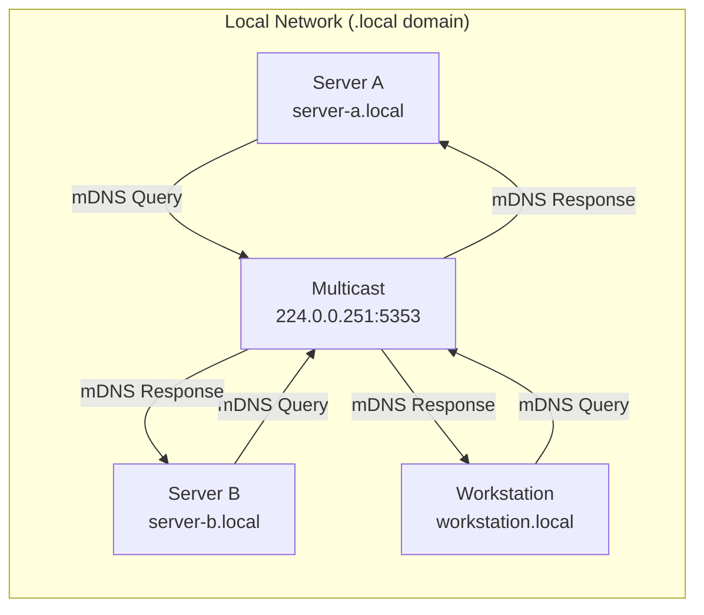

# How to Configure mDNS with Avahi on Ubuntu

Author: [nawazdhandala](https://www.github.com/nawazdhandala)

Tags: Ubuntu, mDNS, Avahi, Networking, Service Discovery, Zeroconf, Linux, DNS, Local Network

Description: A comprehensive guide to setting up and configuring mDNS with Avahi on Ubuntu for zero-configuration networking and automatic service discovery.

---

Local network service discovery shouldn't require manual IP address management or a dedicated DNS server. mDNS (Multicast DNS) with Avahi provides zero-configuration networking that lets devices find each other automatically using human-readable hostnames like `myserver.local`.

## What is mDNS and Avahi?

mDNS (Multicast DNS) is a protocol that resolves hostnames to IP addresses within small networks without a conventional DNS server. Instead of querying a central DNS server, devices multicast their queries to all other devices on the local network.

**Avahi** is the standard implementation of mDNS/DNS-SD (DNS Service Discovery) for Linux. It's the Linux equivalent of Apple's Bonjour protocol.



### Common Use Cases

- **Home labs**: Access your servers by name instead of IP (e.g., `nas.local`, `pi.local`)
- **Development environments**: Discover local services automatically
- **IoT devices**: Printers, smart devices, media servers
- **Microservices**: Service discovery on local networks
- **Network appliances**: Easy access to routers, switches, and other devices

## Prerequisites

Before configuring Avahi, ensure you have the following.

System requirements for this guide:

```bash
# Check your Ubuntu version (18.04 or later recommended)
lsb_release -a

# Ensure you have sudo privileges
sudo whoami
```

Network requirements:

- Local network with multicast support enabled
- Devices on the same subnet (mDNS doesn't route across subnets by default)
- UDP port 5353 accessible on the local network

## Installing Avahi

Install the Avahi daemon and utilities on Ubuntu.

```bash
# Update package lists
sudo apt update

# Install Avahi daemon and tools
sudo apt install -y avahi-daemon avahi-utils

# The daemon starts automatically after installation
# Verify it's running
sudo systemctl status avahi-daemon
```

For additional functionality, install these optional packages.

```bash
# Install NSS mDNS module for hostname resolution
# This allows applications to resolve .local names
sudo apt install -y libnss-mdns

# Install Avahi discovery tools for browsing services
sudo apt install -y avahi-discover

# Install Python bindings for custom scripts
sudo apt install -y python3-avahi
```

Verify the installation by checking your hostname resolution.

```bash
# Your machine should now be accessible via hostname.local
# Get your current hostname
hostname

# Test mDNS resolution (replace 'yourhostname' with your actual hostname)
avahi-resolve -n $(hostname).local
```

## Basic Configuration (avahi-daemon.conf)

The main Avahi configuration file controls the daemon's behavior.

```bash
# The primary configuration file location
sudo nano /etc/avahi/avahi-daemon.conf
```

Here's a well-documented configuration file with common settings.

```ini
# /etc/avahi/avahi-daemon.conf
# Main Avahi daemon configuration

[server]
# The hostname to publish via mDNS
# %h is replaced with the system hostname from /etc/hostname
host-name=%h

# The domain to use (.local is the standard for mDNS)
domain-name=local

# Browse multiple domains (comma-separated)
# browse-domains=local,mynetwork.local

# Enable IPv4 and/or IPv6
use-ipv4=yes
use-ipv6=yes

# Disable D-Bus interface if not needed (more secure)
# enable-dbus=no

# Allow other applications to register services
allow-interfaces=eth0,wlan0
# Or deny specific interfaces
# deny-interfaces=docker0,veth*

# Check for mDNS responses from other hosts with the same name
# and automatically rename if collision detected
allow-point-to-point=no

# Publish our host name and address records
# Required for basic mDNS functionality
ratelimit-interval-usec=1000000
ratelimit-burst=1000

[wide-area]
# Enable wide-area DNS-SD (unicast DNS)
enable-wide-area=no

[publish]
# Publish local hostname and IP addresses
publish-addresses=yes
publish-hinfo=yes
publish-workstation=yes

# Disable if you don't want to publish hostname records
# publish-domain=no

# Add machine info to the published data
publish-aaaa-on-ipv4=yes
publish-a-on-ipv6=no

# Publish DNS-SD service types
publish-dns-servers=no

[reflector]
# Enable multicast reflection across interfaces
# Useful for bridging networks
enable-reflector=no

# Reflect IPv4 queries to IPv6 and vice versa
# reflect-ipv=no

[rlimits]
# Resource limits for security
rlimit-core=0
rlimit-data=4194304
rlimit-fstack=4194304
rlimit-nofile=768
rlimit-stack=4194304
rlimit-nproc=3
```

After editing, restart the daemon to apply changes.

```bash
# Restart Avahi daemon
sudo systemctl restart avahi-daemon

# Check the daemon started without errors
sudo systemctl status avahi-daemon

# View the logs for troubleshooting
sudo journalctl -u avahi-daemon -f
```

## Publishing Services

Avahi can advertise services running on your machine so other devices can discover them.

### Static Service Files

Create service definition files in `/etc/avahi/services/`.

```bash
# Create a service file for an HTTP server
sudo nano /etc/avahi/services/http.service
```

Define an HTTP service advertisement.

```xml
<?xml version="1.0" standalone='no'?>
<!DOCTYPE service-group SYSTEM "avahi-service.dtd">
<!--
  Avahi service definition for HTTP server
  This file advertises a web server on port 80
-->
<service-group>
  <!-- Human-readable name shown in service browsers -->
  <name replace-wildcards="yes">Web Server on %h</name>

  <service>
    <!-- Service type: _http._tcp is the standard for web servers -->
    <type>_http._tcp</type>

    <!-- Port number the service listens on -->
    <port>80</port>

    <!-- Optional TXT records with additional metadata -->
    <txt-record>path=/</txt-record>
    <txt-record>version=1.0</txt-record>
  </service>
</service-group>
```

Create a service file for SSH access.

```xml
<?xml version="1.0" standalone='no'?>
<!DOCTYPE service-group SYSTEM "avahi-service.dtd">
<!--
  Avahi service definition for SSH server
  Allows automatic SSH discovery on the network
-->
<service-group>
  <name replace-wildcards="yes">SSH on %h</name>

  <service>
    <!-- Standard SSH service type -->
    <type>_ssh._tcp</type>
    <port>22</port>
  </service>
</service-group>
```

Create a service file for a database server.

```xml
<?xml version="1.0" standalone='no'?>
<!DOCTYPE service-group SYSTEM "avahi-service.dtd">
<!--
  Avahi service definition for PostgreSQL database
  Useful for development environments
-->
<service-group>
  <name replace-wildcards="yes">PostgreSQL on %h</name>

  <service>
    <type>_postgresql._tcp</type>
    <port>5432</port>
    <txt-record>database=production</txt-record>
    <txt-record>user=readonly</txt-record>
  </service>
</service-group>
```

Services are automatically published when files are added.

```bash
# Avahi watches the services directory
# Changes take effect immediately (no restart needed)
ls -la /etc/avahi/services/

# Verify your services are published
avahi-browse -a | grep $(hostname)
```

### Dynamic Service Publishing

Use `avahi-publish` to advertise services dynamically from scripts or applications.

```bash
# Publish a service from the command line
# This advertises a web server on port 8080
avahi-publish -s "My Web App" _http._tcp 8080 "path=/api" "version=2.0"

# Publish with a specific hostname
avahi-publish -s "Development Server" _http._tcp 3000 -H devserver.local

# Publish an SSH service on a non-standard port
avahi-publish -s "SSH (alt port)" _ssh._tcp 2222

# The service remains published while the command runs
# Press Ctrl+C to unpublish
```

Create a script to publish services when applications start.

```bash
#!/bin/bash
# /usr/local/bin/publish-app-service.sh
# Publishes a service when an application starts

APP_NAME="${1:-MyApp}"
SERVICE_TYPE="${2:-_http._tcp}"
PORT="${3:-8080}"

# Publish the service and keep it running
# The service is unpublished when this script exits
avahi-publish -s "$APP_NAME on $(hostname)" "$SERVICE_TYPE" "$PORT" \
    "started=$(date +%Y-%m-%d)" \
    "pid=$$"
```

## Service Discovery

Discovering services on the network is just as important as publishing them.

### Using avahi-browse

The `avahi-browse` command lists available services on the network.

```bash
# Browse all services on the network
avahi-browse -a

# Browse with resolved addresses and ports
# The -r flag resolves to actual IP addresses
avahi-browse -art

# Browse only specific service types
avahi-browse _http._tcp

# Browse SSH services with resolved addresses
avahi-browse -rt _ssh._tcp

# Browse in a specific domain
avahi-browse -d local _http._tcp
```

Example output showing discovered services.

```plaintext
+ eth0 IPv4 Web Server on fileserver      _http._tcp     local
+ eth0 IPv4 SSH on fileserver             _ssh._tcp      local
+ eth0 IPv4 Web Server on devbox          _http._tcp     local
= eth0 IPv4 Web Server on fileserver      _http._tcp     local
   hostname = [fileserver.local]
   address = [192.168.1.100]
   port = [80]
   txt = ["path=/" "version=1.0"]
```

### Using avahi-resolve

Resolve hostnames to IP addresses and vice versa.

```bash
# Resolve a .local hostname to an IP address
avahi-resolve -n fileserver.local

# Resolve an IP address to a hostname
avahi-resolve -a 192.168.1.100

# Resolve using IPv4 only
avahi-resolve -4 -n devbox.local

# Resolve using IPv6 only
avahi-resolve -6 -n devbox.local
```

### Programmatic Discovery

Use Avahi's D-Bus interface for programmatic service discovery.

```python
#!/usr/bin/env python3
"""
Service discovery using Avahi's D-Bus interface.
This script discovers HTTP services on the local network.
"""

import dbus
from gi.repository import GLib
from dbus.mainloop.glib import DBusGMainLoop

# Initialize D-Bus main loop
DBusGMainLoop(set_as_default=True)

def service_resolved(interface, protocol, name, service_type,
                     domain, host, aprotocol, address, port, txt, flags):
    """Callback when a service is fully resolved."""
    print(f"Service Resolved:")
    print(f"  Name: {name}")
    print(f"  Host: {host}")
    print(f"  Address: {address}")
    print(f"  Port: {port}")
    # Parse TXT records
    txt_records = [bytes(t).decode('utf-8') for t in txt]
    print(f"  TXT: {txt_records}")
    print()

def print_error(error):
    """Callback for resolution errors."""
    print(f"Error: {error}")

def item_new(interface, protocol, name, service_type, domain, flags):
    """Callback when a new service is found."""
    print(f"Found service: {name} ({service_type})")
    # Resolve the service to get full details
    server.ResolveService(
        interface, protocol, name, service_type, domain,
        dbus.UInt32(-1), dbus.UInt32(0),
        reply_handler=service_resolved,
        error_handler=print_error
    )

# Connect to Avahi daemon
bus = dbus.SystemBus()
server = dbus.Interface(
    bus.get_object('org.freedesktop.Avahi', '/'),
    'org.freedesktop.Avahi.Server'
)

# Create a service browser for HTTP services
browser_path = server.ServiceBrowserNew(
    -1,  # Interface: -1 means all interfaces
    0,   # Protocol: 0 means any protocol (IPv4/IPv6)
    '_http._tcp',  # Service type to browse
    'local',  # Domain
    0    # Flags
)

browser = dbus.Interface(
    bus.get_object('org.freedesktop.Avahi', browser_path),
    'org.freedesktop.Avahi.ServiceBrowser'
)

# Connect signal handlers
browser.connect_to_signal('ItemNew', item_new)

print("Browsing for HTTP services...")
print("Press Ctrl+C to stop\n")

# Run the main loop
loop = GLib.MainLoop()
try:
    loop.run()
except KeyboardInterrupt:
    pass
```

## Browsing Network Services

### GUI Service Browser

For desktop environments, use the graphical service browser.

```bash
# Launch the Avahi service browser GUI
# Requires avahi-discover package
avahi-discover
```

### Continuous Service Monitoring

Monitor services in real-time with continuous browsing.

```bash
# Monitor all service changes in real-time
# Shows services as they appear and disappear
avahi-browse -a --resolve --parsable

# Monitor with timestamps
while true; do
    echo "=== $(date) ==="
    avahi-browse -art --parsable | head -20
    sleep 30
done
```

Create a script to watch for specific services.

```bash
#!/bin/bash
# /usr/local/bin/watch-services.sh
# Watches for services and triggers actions when they appear

SERVICE_TYPE="${1:-_http._tcp}"

echo "Watching for $SERVICE_TYPE services..."

avahi-browse -r "$SERVICE_TYPE" --parsable | while read line; do
    # Parse the line
    # Format: +;interface;protocol;name;type;domain
    #     or: =;interface;protocol;name;type;domain;hostname;address;port;txt

    if [[ "$line" == "="* ]]; then
        # Service resolved - extract details
        IFS=';' read -r flag iface proto name type domain hostname address port txt <<< "$line"
        echo "Service found: $name at $address:$port"

        # Trigger custom actions here
        # For example, add to load balancer, update configuration, etc.
    fi
done
```

## Custom Service Definitions

### Common Service Types

Here are service type definitions for common applications.

```xml
<?xml version="1.0" standalone='no'?>
<!DOCTYPE service-group SYSTEM "avahi-service.dtd">
<!--
  Redis cache server service definition
-->
<service-group>
  <name replace-wildcards="yes">Redis Cache on %h</name>
  <service>
    <type>_redis._tcp</type>
    <port>6379</port>
    <txt-record>maxmemory=1gb</txt-record>
    <txt-record>version=7.0</txt-record>
  </service>
</service-group>
```

```xml
<?xml version="1.0" standalone='no'?>
<!DOCTYPE service-group SYSTEM "avahi-service.dtd">
<!--
  MQTT message broker service definition
  Useful for IoT environments
-->
<service-group>
  <name replace-wildcards="yes">MQTT Broker on %h</name>
  <service>
    <type>_mqtt._tcp</type>
    <port>1883</port>
    <txt-record>protocol=3.1.1</txt-record>
  </service>
  <!-- Also advertise secure MQTT -->
  <service>
    <type>_secure-mqtt._tcp</type>
    <port>8883</port>
    <txt-record>tls=required</txt-record>
  </service>
</service-group>
```

```xml
<?xml version="1.0" standalone='no'?>
<!DOCTYPE service-group SYSTEM "avahi-service.dtd">
<!--
  Prometheus metrics endpoint service definition
  Enables automatic service discovery for monitoring
-->
<service-group>
  <name replace-wildcards="yes">Prometheus Metrics on %h</name>
  <service>
    <type>_prometheus-http._tcp</type>
    <port>9090</port>
    <txt-record>__metrics_path__=/metrics</txt-record>
    <txt-record>__scheme__=http</txt-record>
  </service>
</service-group>
```

### Creating Custom Service Types

Define your own service types for custom applications.

```xml
<?xml version="1.0" standalone='no'?>
<!DOCTYPE service-group SYSTEM "avahi-service.dtd">
<!--
  Custom application service definition
  Service type naming convention: _applicationname._tcp or _applicationname._udp
-->
<service-group>
  <name replace-wildcards="yes">MyApp API on %h</name>

  <service>
    <!-- Custom service type for your application -->
    <type>_myapp-api._tcp</type>
    <port>8080</port>

    <!-- Subtype for more specific discovery -->
    <subtype>_myapp._sub._myapp-api._tcp</subtype>

    <!-- Metadata in TXT records -->
    <txt-record>api_version=v2</txt-record>
    <txt-record>environment=production</txt-record>
    <txt-record>cluster=east</txt-record>
    <txt-record>capabilities=read,write,admin</txt-record>
  </service>
</service-group>
```

### Service Groups for Multi-Port Applications

Advertise applications that use multiple ports.

```xml
<?xml version="1.0" standalone='no'?>
<!DOCTYPE service-group SYSTEM "avahi-service.dtd">
<!--
  Multi-service application definition
  Advertises all endpoints of an application
-->
<service-group>
  <name replace-wildcards="yes">Application Stack on %h</name>

  <!-- Main HTTP API -->
  <service>
    <type>_http._tcp</type>
    <port>8080</port>
    <txt-record>path=/api</txt-record>
    <txt-record>component=api</txt-record>
  </service>

  <!-- WebSocket endpoint -->
  <service>
    <type>_ws._tcp</type>
    <port>8081</port>
    <txt-record>path=/ws</txt-record>
    <txt-record>component=websocket</txt-record>
  </service>

  <!-- gRPC endpoint -->
  <service>
    <type>_grpc._tcp</type>
    <port>9090</port>
    <txt-record>component=grpc</txt-record>
  </service>

  <!-- Metrics endpoint -->
  <service>
    <type>_prometheus-http._tcp</type>
    <port>9091</port>
    <txt-record>__metrics_path__=/metrics</txt-record>
    <txt-record>component=metrics</txt-record>
  </service>
</service-group>
```

## Integration with systemd

### Avahi and systemd Service Management

Avahi integrates with systemd for reliable service management.

```bash
# Check Avahi daemon status
sudo systemctl status avahi-daemon

# Enable Avahi to start on boot
sudo systemctl enable avahi-daemon

# Restart Avahi daemon
sudo systemctl restart avahi-daemon

# Stop Avahi daemon
sudo systemctl stop avahi-daemon

# View Avahi logs
sudo journalctl -u avahi-daemon -f
```

### Creating systemd Services with Avahi Integration

Make your applications publish services automatically when they start.

```ini
# /etc/systemd/system/myapp.service
# Application service with Avahi integration

[Unit]
Description=My Application Server
# Start after network and Avahi are ready
After=network.target avahi-daemon.service
Wants=avahi-daemon.service

[Service]
Type=simple
User=myapp
Group=myapp
WorkingDirectory=/opt/myapp

# Start the application
ExecStart=/opt/myapp/bin/server --port 8080

# Publish service to Avahi when starting
ExecStartPost=/usr/bin/avahi-publish -s "MyApp Server" _http._tcp 8080 "version=1.0"

# Note: ExecStartPost runs in background, service will still publish
# For proper lifecycle management, use a wrapper script

Restart=always
RestartSec=10

[Install]
WantedBy=multi-user.target
```

Create a wrapper script for better service lifecycle management.

```bash
#!/bin/bash
# /opt/myapp/bin/start-with-avahi.sh
# Wrapper script that manages Avahi service publication

APP_PORT=8080
SERVICE_NAME="MyApp Server"
PID_FILE="/var/run/myapp/avahi-publish.pid"

# Ensure PID directory exists
mkdir -p /var/run/myapp

# Function to cleanup on exit
cleanup() {
    echo "Stopping Avahi service publication..."
    if [ -f "$PID_FILE" ]; then
        kill $(cat "$PID_FILE") 2>/dev/null
        rm -f "$PID_FILE"
    fi
    exit 0
}

# Set trap for cleanup
trap cleanup SIGTERM SIGINT

# Start Avahi service publication in background
avahi-publish -s "$SERVICE_NAME on $(hostname)" _http._tcp $APP_PORT \
    "version=1.0" \
    "started=$(date -Iseconds)" &
echo $! > "$PID_FILE"

# Start the actual application
exec /opt/myapp/bin/server --port $APP_PORT
```

### Avahi Socket Activation

Configure Avahi for systemd socket activation.

```bash
# Check if socket activation is available
systemctl list-sockets | grep avahi

# Avahi already uses socket activation by default
systemctl status avahi-daemon.socket
```

## Firewall Configuration

### UFW (Uncomplicated Firewall)

Configure UFW to allow mDNS traffic.

```bash
# mDNS uses UDP port 5353 with multicast address 224.0.0.251
# Allow incoming mDNS traffic
sudo ufw allow 5353/udp comment 'mDNS'

# For more restrictive rules, allow only from local network
sudo ufw allow from 192.168.1.0/24 to any port 5353 proto udp comment 'mDNS from LAN'

# Verify the rules
sudo ufw status verbose
```

### iptables

Configure iptables directly for mDNS.

```bash
# Allow mDNS incoming traffic
sudo iptables -A INPUT -p udp --dport 5353 -j ACCEPT

# Allow mDNS multicast traffic
sudo iptables -A INPUT -p udp -d 224.0.0.251 --dport 5353 -j ACCEPT

# Allow mDNS outgoing traffic
sudo iptables -A OUTPUT -p udp --dport 5353 -j ACCEPT

# Save iptables rules (on Ubuntu)
sudo netfilter-persistent save
```

### nftables

Modern firewall configuration with nftables.

```bash
# /etc/nftables.conf
# Add to your existing nftables configuration

table inet filter {
    chain input {
        # Allow mDNS traffic
        udp dport 5353 accept comment "mDNS"

        # Allow mDNS multicast
        ip daddr 224.0.0.251 udp dport 5353 accept comment "mDNS multicast IPv4"
        ip6 daddr ff02::fb udp dport 5353 accept comment "mDNS multicast IPv6"
    }

    chain output {
        # Allow outgoing mDNS
        udp dport 5353 accept comment "mDNS"
    }
}
```

Apply nftables configuration.

```bash
# Check syntax
sudo nft -c -f /etc/nftables.conf

# Apply configuration
sudo nft -f /etc/nftables.conf

# Or restart nftables service
sudo systemctl restart nftables
```

## Security Considerations

### Limiting Avahi Exposure

Restrict Avahi to specific network interfaces.

```ini
# /etc/avahi/avahi-daemon.conf
[server]
# Only allow mDNS on specific interfaces
# This prevents exposure on public or untrusted networks
allow-interfaces=eth0,eth1

# Or deny specific interfaces (like Docker networks)
deny-interfaces=docker0,br-*,veth*
```

### Restricting Published Information

Control what information Avahi publishes about your system.

```ini
# /etc/avahi/avahi-daemon.conf
[publish]
# Disable workstation info (computer type, OS)
publish-workstation=no

# Disable hardware info
publish-hinfo=no

# Only publish what's necessary
publish-addresses=yes
publish-domain=yes
```

### Running Avahi in Restricted Mode

Configure Avahi to run with minimal privileges.

```ini
# /etc/avahi/avahi-daemon.conf
[rlimits]
# Strict resource limits
rlimit-core=0
rlimit-data=4194304
rlimit-fstack=4194304
rlimit-nofile=300
rlimit-stack=4194304
rlimit-nproc=3
```

### Network Segmentation

Isolate mDNS traffic to specific network segments.

```bash
# Use VLAN tagging or network namespaces to isolate mDNS
# This example creates an isolated namespace for mDNS

# Create network namespace
sudo ip netns add mdns-isolated

# Move interface to namespace
sudo ip link set eth1 netns mdns-isolated

# Run Avahi in the namespace
sudo ip netns exec mdns-isolated avahi-daemon --no-drop-root
```

### Disabling mDNS for Specific Applications

Prevent specific applications from using mDNS resolution.

```bash
# Modify NSS configuration to control .local resolution
sudo nano /etc/nsswitch.conf

# Default configuration with mDNS:
# hosts: files mdns4_minimal [NOTFOUND=return] dns

# To disable mDNS for all applications:
# hosts: files dns

# To use mDNS only as fallback:
# hosts: files dns mdns4
```

## Cross-Platform Discovery

### Discovering macOS/iOS Devices (Bonjour)

Apple devices use Bonjour (which is compatible with Avahi/mDNS).

```bash
# Browse for Apple services
avahi-browse -art | grep -E "AirPlay|AirPrint|Apple"

# Discover AirPlay devices
avahi-browse -rt _airplay._tcp

# Discover AirPrint printers
avahi-browse -rt _ipp._tcp

# Discover Apple File Sharing
avahi-browse -rt _afpovertcp._tcp
```

### Discovering Windows Devices

Windows 10+ supports mDNS natively.

```bash
# Windows machines may advertise these services
avahi-browse -rt _workstation._tcp
avahi-browse -rt _smb._tcp

# Windows Remote Desktop
avahi-browse -rt _rdp._tcp
```

### Making Linux Visible to Other Platforms

Advertise services that other platforms can discover.

```xml
<?xml version="1.0" standalone='no'?>
<!DOCTYPE service-group SYSTEM "avahi-service.dtd">
<!--
  SMB/CIFS file sharing service
  Makes Linux Samba shares discoverable on Windows and macOS
-->
<service-group>
  <name replace-wildcards="yes">%h File Server</name>

  <service>
    <type>_smb._tcp</type>
    <port>445</port>
  </service>

  <!-- Device info for better display on Apple devices -->
  <service>
    <type>_device-info._tcp</type>
    <port>0</port>
    <txt-record>model=RackMac</txt-record>
  </service>
</service-group>
```

### Multi-Platform Service Discovery Script

Create a script to discover all devices regardless of platform.

```bash
#!/bin/bash
# /usr/local/bin/discover-all.sh
# Discovers all mDNS-advertised devices on the network

echo "=== Network Service Discovery ==="
echo "Scanning for all mDNS services..."
echo

# Common service types across platforms
SERVICES=(
    "_http._tcp"
    "_https._tcp"
    "_ssh._tcp"
    "_smb._tcp"
    "_afpovertcp._tcp"
    "_nfs._tcp"
    "_ftp._tcp"
    "_sftp-ssh._tcp"
    "_printer._tcp"
    "_ipp._tcp"
    "_airplay._tcp"
    "_raop._tcp"
    "_rdp._tcp"
    "_workstation._tcp"
)

for service in "${SERVICES[@]}"; do
    echo "--- $service ---"
    avahi-browse -rt "$service" 2>/dev/null | grep "=" | head -5
    echo
done

echo "=== All Hosts ==="
avahi-browse -art 2>/dev/null | grep "hostname" | sort -u
```

## Troubleshooting

### Common Issues and Solutions

**Issue: .local hostnames not resolving**

```bash
# Check if libnss-mdns is installed
dpkg -l | grep libnss-mdns

# Verify nsswitch.conf includes mdns
grep hosts /etc/nsswitch.conf

# The line should include mdns4_minimal or mdns4:
# hosts: files mdns4_minimal [NOTFOUND=return] dns

# If missing, edit nsswitch.conf
sudo nano /etc/nsswitch.conf
```

**Issue: Avahi daemon not starting**

```bash
# Check for configuration errors
avahi-daemon --check

# Check daemon status and logs
sudo systemctl status avahi-daemon
sudo journalctl -u avahi-daemon --no-pager -n 50

# Common causes:
# - Invalid characters in hostname
# - Port 5353 already in use
# - Missing network interfaces
```

**Issue: Services not being discovered**

```bash
# Verify Avahi is running
sudo systemctl status avahi-daemon

# Check if the service file is valid
avahi-daemon --check

# Verify the service is published
avahi-browse -a | grep "your-service-name"

# Check firewall rules
sudo ufw status | grep 5353
sudo iptables -L -n | grep 5353

# Verify multicast is enabled on the interface
ip link show eth0 | grep MULTICAST
```

**Issue: Hostname conflicts**

```bash
# Check for hostname conflicts
avahi-resolve -n $(hostname).local

# If there's a conflict, Avahi automatically renames to hostname-2.local
# Check the actual name being used
avahi-daemon --check

# Or look in the logs
sudo journalctl -u avahi-daemon | grep -i conflict
```

### Diagnostic Commands

```bash
# Full system diagnostic for Avahi
echo "=== Avahi Diagnostic Report ==="

echo -e "\n--- Avahi Daemon Status ---"
sudo systemctl status avahi-daemon --no-pager

echo -e "\n--- Avahi Configuration Check ---"
avahi-daemon --check

echo -e "\n--- Published Services ---"
avahi-browse -a --parsable 2>/dev/null | grep "^+" | head -20

echo -e "\n--- Network Interfaces ---"
ip -br link show

echo -e "\n--- Multicast Group Memberships ---"
ip maddr show

echo -e "\n--- Firewall Status (UFW) ---"
sudo ufw status 2>/dev/null || echo "UFW not installed"

echo -e "\n--- Port 5353 Status ---"
sudo ss -ulnp | grep 5353

echo -e "\n--- NSS Configuration ---"
grep hosts /etc/nsswitch.conf

echo -e "\n--- Recent Avahi Logs ---"
sudo journalctl -u avahi-daemon --no-pager -n 20
```

### Testing mDNS Resolution

```bash
# Test basic hostname resolution
avahi-resolve -n testhost.local

# Test with specific protocol
avahi-resolve -4 -n testhost.local  # IPv4 only
avahi-resolve -6 -n testhost.local  # IPv6 only

# Test reverse resolution
avahi-resolve -a 192.168.1.100

# Test with getent (uses system resolver)
getent hosts testhost.local

# Test with ping
ping -c 3 testhost.local

# If ping fails but avahi-resolve works, check nsswitch.conf
```

### Network-Level Debugging

```bash
# Capture mDNS traffic with tcpdump
sudo tcpdump -i eth0 port 5353 -n

# More verbose output
sudo tcpdump -i eth0 port 5353 -vvv

# Save capture to file for analysis
sudo tcpdump -i eth0 port 5353 -w mdns-capture.pcap

# Check if multicast is reaching the interface
sudo tcpdump -i eth0 host 224.0.0.251
```

---

mDNS with Avahi transforms local network management by eliminating the need to remember IP addresses or maintain DNS records for local services. Whether you're running a home lab, development environment, or small office network, Avahi provides reliable zero-configuration networking that just works.

For monitoring the services you discover and publish via mDNS, consider using [OneUptime](https://oneuptime.com). OneUptime provides comprehensive infrastructure monitoring, alerting, and incident management that integrates seamlessly with your network services. You can monitor service availability, track response times, and receive instant notifications when services become unavailable, ensuring your mDNS-advertised services remain reliable and accessible.
