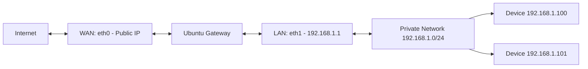

# How to Configure NAT and IP Forwarding on Ubuntu

Author: [nawazdhandala](https://www.github.com/nawazdhandala)

Tags: Ubuntu, NAT, Networking, Firewall, Router, Tutorial

Description: Complete guide to setting up NAT (Network Address Translation) and IP forwarding on Ubuntu to share internet connections.

---

NAT (Network Address Translation) allows multiple devices on a private network to share a single public IP address for internet access. Combined with IP forwarding, Ubuntu can function as a router or gateway. This guide covers NAT configuration using iptables and nftables.

## Use Cases

- Share internet connection with private network
- Create a router/gateway server
- Lab environment connectivity
- Container/VM internet access

## Prerequisites

- Ubuntu 20.04 or later
- Two network interfaces (WAN and LAN)
- Root or sudo access

## Network Topology



## Enable IP Forwarding

### Temporary (Until Reboot)

```bash
# Enable IPv4 forwarding
echo 1 | sudo tee /proc/sys/net/ipv4/ip_forward

# Enable IPv6 forwarding
echo 1 | sudo tee /proc/sys/net/ipv6/conf/all/forwarding
```

### Permanent

```bash
sudo nano /etc/sysctl.conf
```

```conf
# Enable IPv4 forwarding
net.ipv4.ip_forward = 1

# Enable IPv6 forwarding (optional)
net.ipv6.conf.all.forwarding = 1
```

```bash
# Apply changes
sudo sysctl -p

# Verify
cat /proc/sys/net/ipv4/ip_forward
```

## Configure Network Interfaces

### WAN Interface (Public/Internet)

```bash
sudo nano /etc/netplan/01-wan.yaml
```

```yaml
network:
  version: 2
  ethernets:
    eth0:
      dhcp4: true
      # Or static IP from ISP
```

### LAN Interface (Private Network)

```bash
sudo nano /etc/netplan/02-lan.yaml
```

```yaml
network:
  version: 2
  ethernets:
    eth1:
      addresses:
        - 192.168.1.1/24
      # No gateway - this is the gateway!
```

```bash
sudo netplan apply
```

## NAT with iptables

### Basic NAT (Masquerade)

```bash
# Enable NAT for outgoing traffic
sudo iptables -t nat -A POSTROUTING -o eth0 -j MASQUERADE

# Allow forwarding from LAN to WAN
sudo iptables -A FORWARD -i eth1 -o eth0 -j ACCEPT

# Allow established connections back
sudo iptables -A FORWARD -i eth0 -o eth1 -m state --state RELATED,ESTABLISHED -j ACCEPT
```

### NAT with SNAT (Static Source NAT)

```bash
# If WAN has static IP (e.g., 203.0.113.1)
sudo iptables -t nat -A POSTROUTING -o eth0 -j SNAT --to-source 203.0.113.1
```

### Save iptables Rules

```bash
# Install iptables-persistent
sudo apt install iptables-persistent -y

# Save current rules
sudo iptables-save | sudo tee /etc/iptables/rules.v4

# Rules are automatically restored on boot
```

## NAT with nftables (Modern Method)

### Install nftables

```bash
sudo apt install nftables -y
sudo systemctl enable nftables
```

### Configure NAT Rules

```bash
sudo nano /etc/nftables.conf
```

```nft
#!/usr/sbin/nft -f

flush ruleset

table inet filter {
    chain input {
        type filter hook input priority 0; policy drop;

        # Allow established connections
        ct state established,related accept

        # Allow loopback
        iif lo accept

        # Allow SSH
        tcp dport 22 accept

        # Allow ICMP
        ip protocol icmp accept
        ip6 nexthdr icmpv6 accept
    }

    chain forward {
        type filter hook forward priority 0; policy drop;

        # Allow LAN to WAN
        iifname "eth1" oifname "eth0" accept

        # Allow established connections back
        ct state established,related accept
    }

    chain output {
        type filter hook output priority 0; policy accept;
    }
}

table ip nat {
    chain prerouting {
        type nat hook prerouting priority -100;
    }

    chain postrouting {
        type nat hook postrouting priority 100;

        # Masquerade all traffic going out eth0
        oifname "eth0" masquerade
    }
}
```

```bash
# Apply rules
sudo nft -f /etc/nftables.conf

# Verify
sudo nft list ruleset
```

## Port Forwarding (DNAT)

### Forward Port to Internal Server

```bash
# Forward port 80 to internal web server (192.168.1.100)
sudo iptables -t nat -A PREROUTING -i eth0 -p tcp --dport 80 -j DNAT --to-destination 192.168.1.100:80

# Also allow this traffic in forward chain
sudo iptables -A FORWARD -i eth0 -o eth1 -p tcp --dport 80 -j ACCEPT
```

### Multiple Port Forwards

```bash
# Web server
sudo iptables -t nat -A PREROUTING -i eth0 -p tcp --dport 80 -j DNAT --to-destination 192.168.1.100:80
sudo iptables -t nat -A PREROUTING -i eth0 -p tcp --dport 443 -j DNAT --to-destination 192.168.1.100:443

# SSH to different server
sudo iptables -t nat -A PREROUTING -i eth0 -p tcp --dport 2222 -j DNAT --to-destination 192.168.1.101:22

# Mail server
sudo iptables -t nat -A PREROUTING -i eth0 -p tcp --dport 25 -j DNAT --to-destination 192.168.1.102:25
```

### Port Forwarding with nftables

```nft
table ip nat {
    chain prerouting {
        type nat hook prerouting priority -100;

        # Port forward web traffic
        iifname "eth0" tcp dport 80 dnat to 192.168.1.100:80
        iifname "eth0" tcp dport 443 dnat to 192.168.1.100:443

        # Port forward SSH
        iifname "eth0" tcp dport 2222 dnat to 192.168.1.101:22
    }

    chain postrouting {
        type nat hook postrouting priority 100;
        oifname "eth0" masquerade
    }
}
```

## NAT Hairpinning

Allow internal clients to access port-forwarded services via public IP:

```bash
# Enable hairpin NAT
sudo iptables -t nat -A POSTROUTING -s 192.168.1.0/24 -d 192.168.1.100 -p tcp --dport 80 -j MASQUERADE

# Or with nftables
# Add to postrouting chain:
# ip saddr 192.168.1.0/24 ip daddr 192.168.1.100 tcp dport 80 masquerade
```

## Complete iptables Script

```bash
#!/bin/bash
# nat-setup.sh - Configure NAT gateway

# Variables
WAN_IF="eth0"
LAN_IF="eth1"
LAN_NET="192.168.1.0/24"

# Flush existing rules
iptables -F
iptables -t nat -F
iptables -X

# Default policies
iptables -P INPUT DROP
iptables -P FORWARD DROP
iptables -P OUTPUT ACCEPT

# Allow loopback
iptables -A INPUT -i lo -j ACCEPT

# Allow established connections
iptables -A INPUT -m state --state ESTABLISHED,RELATED -j ACCEPT
iptables -A FORWARD -m state --state ESTABLISHED,RELATED -j ACCEPT

# Allow SSH to gateway
iptables -A INPUT -i $LAN_IF -p tcp --dport 22 -j ACCEPT

# Allow LAN to access gateway
iptables -A INPUT -i $LAN_IF -s $LAN_NET -j ACCEPT

# Allow ICMP
iptables -A INPUT -p icmp --icmp-type echo-request -j ACCEPT

# Enable NAT
iptables -t nat -A POSTROUTING -o $WAN_IF -j MASQUERADE

# Allow forwarding from LAN to WAN
iptables -A FORWARD -i $LAN_IF -o $WAN_IF -s $LAN_NET -j ACCEPT

# Port forwards
# Web server
iptables -t nat -A PREROUTING -i $WAN_IF -p tcp --dport 80 -j DNAT --to-destination 192.168.1.100:80
iptables -A FORWARD -i $WAN_IF -o $LAN_IF -p tcp --dport 80 -d 192.168.1.100 -j ACCEPT

# Save rules
iptables-save > /etc/iptables/rules.v4

echo "NAT configuration complete"
```

## Testing NAT

### From LAN Client

```bash
# Test internet connectivity
ping -c 4 8.8.8.8

# Test DNS
nslookup google.com

# Check external IP
curl ifconfig.me

# Trace route
traceroute 8.8.8.8
```

### From Gateway

```bash
# Check iptables counters
sudo iptables -L -v -n

# Check NAT table
sudo iptables -t nat -L -v -n

# Monitor traffic
sudo tcpdump -i eth0 -n
```

## Monitoring and Logging

### Enable Connection Tracking

```bash
# View active connections
sudo conntrack -L

# Count connections
sudo conntrack -C

# Watch connections
sudo watch -n 1 'conntrack -L | wc -l'
```

### Log NAT Traffic

```bash
# Log all forwarded traffic
sudo iptables -A FORWARD -j LOG --log-prefix "FORWARD: " --log-level 4

# View logs
sudo tail -f /var/log/syslog | grep FORWARD
```

## Troubleshooting

### Check IP Forwarding

```bash
# Verify forwarding is enabled
cat /proc/sys/net/ipv4/ip_forward

# Must return 1
```

### Verify Rules

```bash
# List all rules
sudo iptables -L -v -n

# List NAT rules
sudo iptables -t nat -L -v -n

# Check for packets hitting rules
# Counter should increase
```

### Common Issues

```bash
# No internet from LAN
# 1. Check IP forwarding
# 2. Check MASQUERADE rule exists
# 3. Verify FORWARD rules
# 4. Check default gateway on LAN clients

# Port forward not working
# 1. Check PREROUTING DNAT rule
# 2. Check FORWARD rule allows traffic
# 3. Verify target server is reachable
```

### Debug with tcpdump

```bash
# Monitor WAN interface
sudo tcpdump -i eth0 -n host 192.168.1.100

# Monitor LAN interface
sudo tcpdump -i eth1 -n

# Check specific port
sudo tcpdump -i eth0 -n port 80
```

---

NAT and IP forwarding transform Ubuntu into a capable router or gateway. This is essential for lab environments, container networking, and small office setups. For monitoring your network gateway, consider using OneUptime for comprehensive infrastructure monitoring and alerting.
