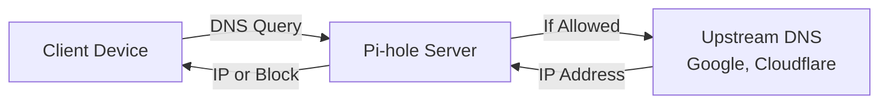

# How to Configure Pi-hole Ad Blocker on Ubuntu

Author: [nawazdhandala](https://www.github.com/nawazdhandala)

Tags: Ubuntu, Pi-hole, DNS, Ad Blocker, Network, Tutorial

Description: Complete guide to installing Pi-hole network-wide ad blocking on Ubuntu.

---

Pi-hole is a powerful network-wide ad blocker that acts as a DNS sinkhole, protecting all devices on your network from advertisements, trackers, and malicious domains. This comprehensive guide walks you through installing, configuring, and maintaining Pi-hole on Ubuntu.

## Understanding Pi-hole

Pi-hole operates as a DNS server on your network. When any device makes a DNS request, Pi-hole intercepts it and checks the requested domain against its blocklists. If the domain is on a blocklist, Pi-hole returns a null response, effectively blocking the content before it reaches your device.

### Key Benefits

- **Network-wide protection**: All devices on your network benefit without individual configuration
- **Reduced bandwidth**: Blocked ads never download, saving bandwidth
- **Improved privacy**: Trackers and telemetry domains are blocked
- **Faster browsing**: Pages load faster without ad content
- **Central management**: Single point of control for all network filtering
- **Detailed statistics**: Monitor DNS queries across your entire network

### How Pi-hole Works



## Prerequisites

Before installing Pi-hole, ensure your system meets these requirements:

### System Requirements

```bash
# Check Ubuntu version (18.04 LTS or later recommended)
lsb_release -a

# Verify system architecture
uname -m

# Check available disk space (minimum 2GB recommended)
df -h /

# Verify RAM (minimum 512MB, 1GB recommended)
free -h
```

### Network Requirements

```bash
# Ensure you have a static IP address or DHCP reservation
# Check current IP configuration
ip addr show

# Note your current IP address, gateway, and DNS servers
ip route show default
cat /etc/resolv.conf
```

### Required Packages

```bash
# Update system packages
sudo apt update && sudo apt upgrade -y

# Install essential packages
sudo apt install -y curl git

# Verify curl is installed
curl --version
```

### Firewall Configuration

```bash
# If using UFW, allow necessary ports
# DNS port (required)
sudo ufw allow 53/tcp
sudo ufw allow 53/udp

# Web interface port (required for admin panel)
sudo ufw allow 80/tcp

# DHCP ports (only if using Pi-hole as DHCP server)
sudo ufw allow 67/tcp
sudo ufw allow 67/udp

# Verify firewall rules
sudo ufw status verbose
```

## Installation Methods

Pi-hole offers multiple installation methods. Choose the one that best suits your needs.

### Method 1: One-Step Automated Install (Recommended)

```bash
# Download and run the official installer
# This method uses the official Pi-hole installation script
curl -sSL https://install.pi-hole.net | bash
```

The installer will guide you through:
1. Selecting an upstream DNS provider
2. Choosing blocklists
3. Installing the web interface
4. Setting the admin password

### Method 2: Manual Installation with Git

```bash
# Clone the Pi-hole repository
git clone --depth 1 https://github.com/pi-hole/pi-hole.git Pi-hole

# Navigate to the automated install directory
cd "Pi-hole/automated install/"

# Run the installer
sudo bash basic-install.sh
```

### Method 3: Docker Installation

```bash
# Create a directory for Pi-hole data persistence
mkdir -p ~/pihole/{etc-pihole,etc-dnsmasq.d}

# Run Pi-hole in Docker
# Replace YOUR_PASSWORD with a secure admin password
# Replace 192.168.1.100 with your server's IP address
docker run -d \
    --name pihole \
    --hostname pihole \
    -p 53:53/tcp \
    -p 53:53/udp \
    -p 80:80/tcp \
    -e TZ="America/New_York" \
    -e WEBPASSWORD="YOUR_PASSWORD" \
    -e SERVERIP="192.168.1.100" \
    -v ~/pihole/etc-pihole:/etc/pihole \
    -v ~/pihole/etc-dnsmasq.d:/etc/dnsmasq.d \
    --dns=127.0.0.1 \
    --dns=1.1.1.1 \
    --restart=unless-stopped \
    --cap-add=NET_ADMIN \
    pihole/pihole:latest

# Verify container is running
docker ps | grep pihole

# View container logs
docker logs pihole
```

### Post-Installation: Set Admin Password

```bash
# Set or change the web interface password
# You'll be prompted to enter a new password
sudo pihole -a -p

# Alternatively, generate a random password
sudo pihole -a -p $(openssl rand -base64 12)
```

## Web Interface Setup

The Pi-hole web interface provides a powerful dashboard for monitoring and configuration.

### Accessing the Web Interface

```bash
# Find your Pi-hole's IP address
hostname -I

# Access the web interface in your browser:
# http://YOUR_PI_HOLE_IP/admin
# Example: http://192.168.1.100/admin
```

### Web Interface Features

The dashboard displays:
- **Total queries**: Number of DNS requests processed
- **Queries blocked**: Number of blocked requests
- **Percent blocked**: Percentage of queries blocked
- **Domains on blocklists**: Total domains being blocked

### Configuring Web Interface Settings

```bash
# View current Pi-hole configuration
pihole -v

# Check Pi-hole status
pihole status

# View configuration file locations
ls -la /etc/pihole/

# Main configuration file
cat /etc/pihole/setupVars.conf
```

### Example setupVars.conf Configuration

```bash
# /etc/pihole/setupVars.conf
# This file stores Pi-hole's configuration settings

# Network interface Pi-hole listens on
PIHOLE_INTERFACE=eth0

# IP address configuration (IPv4)
IPV4_ADDRESS=192.168.1.100/24

# IPv6 configuration (optional)
IPV6_ADDRESS=

# Upstream DNS servers
PIHOLE_DNS_1=1.1.1.1
PIHOLE_DNS_2=1.0.0.1

# Query logging enabled
QUERY_LOGGING=true

# Install web server (lighttpd)
INSTALL_WEB_SERVER=true

# Install web interface
INSTALL_WEB_INTERFACE=true

# Enable lighttpd service
LIGHTTPD_ENABLED=true

# Web admin password hash (set via pihole -a -p)
WEBPASSWORD=your_hashed_password_here

# Block page settings
BLOCKING_ENABLED=true

# DNS hostname resolution
DNSMASQ_LISTENING=local

# Privacy level (0=show everything, 3=hide everything)
PRIVACY_LEVEL=0

# Cache size for DNS queries
CACHE_SIZE=10000
```

## Configuring Clients

There are multiple ways to configure devices to use Pi-hole.

### Method 1: Configure Individual Devices

#### Linux Clients

```bash
# Edit resolved configuration
sudo nano /etc/systemd/resolved.conf

# Add these lines:
# [Resolve]
# DNS=192.168.1.100
# FallbackDNS=1.1.1.1

# Restart systemd-resolved
sudo systemctl restart systemd-resolved

# Verify DNS settings
resolvectl status
```

#### Windows Clients

```powershell
# Open PowerShell as Administrator
# Replace "Ethernet" with your network adapter name
# Replace 192.168.1.100 with your Pi-hole IP

Set-DnsClientServerAddress -InterfaceAlias "Ethernet" -ServerAddresses "192.168.1.100"

# Verify settings
Get-DnsClientServerAddress -InterfaceAlias "Ethernet"
```

#### macOS Clients

```bash
# List network services
networksetup -listallnetworkservices

# Set DNS for Wi-Fi (replace with your Pi-hole IP)
sudo networksetup -setdnsservers Wi-Fi 192.168.1.100

# Verify settings
networksetup -getdnsservers Wi-Fi

# Clear DNS cache
sudo dscacheutil -flushcache
sudo killall -HUP mDNSResponder
```

### Method 2: Using /etc/hosts for Testing

```bash
# Add Pi-hole server to hosts file for local resolution
sudo tee -a /etc/hosts << EOF
# Pi-hole DNS server
192.168.1.100    pihole.local
EOF
```

## Router DNS Configuration

Configuring your router is the most effective method as it automatically applies to all network devices.

### Generic Router Configuration Steps

```
1. Access your router's admin panel (typically 192.168.1.1 or 192.168.0.1)
2. Navigate to: Network Settings > DHCP > DNS Settings
3. Set Primary DNS: YOUR_PI_HOLE_IP (e.g., 192.168.1.100)
4. Set Secondary DNS: Leave blank or use a fallback (not recommended for best blocking)
5. Save settings and restart router if required
```

### Common Router Brands Configuration

```bash
# After configuring your router, verify DNS propagation
# Run this from any client device:

# Check current DNS server
nslookup example.com

# On Linux, check resolv.conf
cat /etc/resolv.conf

# Force DNS cache refresh on clients
# Linux:
sudo systemd-resolve --flush-caches

# Windows:
ipconfig /flushdns

# macOS:
sudo dscacheutil -flushcache
```

### Verifying Router Configuration

```bash
# Test DNS resolution through Pi-hole
# The response should come from your Pi-hole's IP
dig @192.168.1.100 example.com

# Test blocking is working
# This should return 0.0.0.0 or be blocked
dig @192.168.1.100 ads.google.com

# Check query logs on Pi-hole server
pihole -t
```

## Adding Blocklists

Enhance Pi-hole's blocking capability by adding additional blocklists.

### Adding Blocklists via Web Interface

```
1. Navigate to: http://YOUR_PI_HOLE_IP/admin
2. Go to: Group Management > Adlists
3. Add new list URLs and click "Add"
4. Update gravity: Tools > Update Gravity
```

### Adding Blocklists via Command Line

```bash
# View current blocklists
sqlite3 /etc/pihole/gravity.db "SELECT address FROM adlist;"

# Add a new blocklist
# Replace URL with the blocklist you want to add
pihole -a adlist add "https://raw.githubusercontent.com/StevenBlack/hosts/master/hosts"

# Popular blocklists to consider:

# StevenBlack's Unified Hosts (ads + malware)
pihole -a adlist add "https://raw.githubusercontent.com/StevenBlack/hosts/master/hosts"

# OISD Full blocklist (comprehensive)
pihole -a adlist add "https://abp.oisd.nl/basic/"

# Firebog Suspicious List
pihole -a adlist add "https://v.firebog.net/hosts/static/w3kbl.txt"

# AdGuard DNS Filter
pihole -a adlist add "https://adguardteam.github.io/AdGuardSDNSFilter/Filters/filter.txt"

# Update gravity database after adding lists
pihole -g

# View update progress
tail -f /var/log/pihole/pihole.log
```

### Creating a Custom Blocklist Script

```bash
#!/bin/bash
# update-blocklists.sh
# Script to add multiple blocklists to Pi-hole

# Define blocklist URLs
BLOCKLISTS=(
    "https://raw.githubusercontent.com/StevenBlack/hosts/master/hosts"
    "https://raw.githubusercontent.com/PolishFiltersTeam/KADhosts/master/KADhosts.txt"
    "https://raw.githubusercontent.com/FadeMind/hosts.extras/master/add.Spam/hosts"
    "https://v.firebog.net/hosts/Easylist.txt"
    "https://v.firebog.net/hosts/Easyprivacy.txt"
    "https://v.firebog.net/hosts/Admiral.txt"
    "https://raw.githubusercontent.com/anudeepND/blacklist/master/adservers.txt"
    "https://hostfiles.frogeye.fr/firstparty-trackers-hosts.txt"
)

# Add each blocklist
for list in "${BLOCKLISTS[@]}"; do
    echo "Adding blocklist: $list"
    pihole -a adlist add "$list"
done

# Update gravity
echo "Updating Pi-hole gravity..."
pihole -g

echo "Blocklist update complete!"
echo "Total domains on blocklist:"
pihole -g | grep "unique domains"
```

```bash
# Make the script executable
chmod +x update-blocklists.sh

# Run the script
sudo ./update-blocklists.sh
```

## Whitelist/Blacklist Management

Fine-tune Pi-hole's blocking behavior with whitelists and blacklists.

### Whitelist Management

```bash
# Add a domain to the whitelist
# This allows the domain even if it's on a blocklist
pihole -w example.com

# Add multiple domains to whitelist
pihole -w domain1.com domain2.com domain3.com

# Add a domain with wildcard (regex whitelist)
pihole --white-regex ".*\.example\.com$"

# View current whitelist
pihole -w -l

# Remove a domain from whitelist
pihole -w -d example.com

# View whitelist from database
sqlite3 /etc/pihole/gravity.db "SELECT domain FROM domainlist WHERE type=0;"
```

### Blacklist Management

```bash
# Add a domain to the blacklist (exact match)
pihole -b annoying-site.com

# Add multiple domains to blacklist
pihole -b site1.com site2.com site3.com

# Add a domain with wildcard (regex blacklist)
# This blocks any subdomain of example.com
pihole --regex ".*\.example\.com$"

# View current blacklist
pihole -b -l

# Remove a domain from blacklist
pihole -b -d annoying-site.com

# View blacklist from database
sqlite3 /etc/pihole/gravity.db "SELECT domain FROM domainlist WHERE type=1;"
```

### Common Whitelist Entries

```bash
# Create a whitelist script for common services that may break
#!/bin/bash
# common-whitelist.sh
# Whitelist domains that are commonly needed

# Microsoft services
pihole -w login.microsoftonline.com
pihole -w login.live.com
pihole -w officeclient.microsoft.com

# Apple services
pihole -w apple.com
pihole -w icloud.com
pihole -w itunes.apple.com

# Google services (if needed)
pihole -w clients4.google.com
pihole -w clients2.google.com

# Amazon services
pihole -w amazon.com
pihole -w images-amazon.com

# Netflix
pihole -w netflix.com
pihole -w nflxvideo.net

# Banking and financial (add your banks)
# pihole -w yourbank.com

echo "Common whitelist entries added!"
```

### Managing Lists via Web Interface

```
Whitelist:
1. Navigate to: Domains
2. Select "Add domain to whitelist"
3. Enter domain and click "Add"

Blacklist:
1. Navigate to: Domains
2. Select "Add domain to blacklist"
3. Enter domain and click "Add"

Regex filters:
1. Navigate to: Domains
2. Select appropriate regex type
3. Enter regex pattern and click "Add"
```

## DHCP Server Option

Pi-hole can function as your network's DHCP server, simplifying client configuration.

### Disable Router DHCP First

```
IMPORTANT: Before enabling Pi-hole DHCP, disable DHCP on your router
to prevent conflicts. Having two DHCP servers can cause network issues.

1. Access your router's admin panel
2. Navigate to DHCP settings
3. Disable DHCP server
4. Save settings
```

### Enable Pi-hole DHCP Server

```bash
# Edit Pi-hole configuration
sudo nano /etc/pihole/setupVars.conf

# Add or modify these DHCP settings:
# DHCP_ACTIVE=true
# DHCP_START=192.168.1.50
# DHCP_END=192.168.1.200
# DHCP_ROUTER=192.168.1.1
# DHCP_LEASETIME=24
# PIHOLE_DOMAIN=lan
# DHCP_IPv6=false
```

### Configure DHCP via Web Interface

```
1. Navigate to: Settings > DHCP
2. Check "DHCP server enabled"
3. Configure:
   - Range of IP addresses to distribute
   - Router (gateway) IP address
   - DHCP lease time
   - Local domain name (optional)
4. Click "Save"
```

### DHCP Configuration File

```bash
# View DHCP configuration
cat /etc/dnsmasq.d/02-pihole-dhcp.conf

# Example DHCP configuration:
# /etc/dnsmasq.d/02-pihole-dhcp.conf

# Enable DHCP server
dhcp-range=192.168.1.50,192.168.1.200,24h

# Set gateway
dhcp-option=option:router,192.168.1.1

# Set DNS server (Pi-hole itself)
dhcp-option=option:dns-server,192.168.1.100

# Set domain
dhcp-option=option:domain-name,lan

# Static IP assignments (optional)
# Assign specific IPs to devices by MAC address
dhcp-host=aa:bb:cc:dd:ee:ff,192.168.1.10,server1
dhcp-host=11:22:33:44:55:66,192.168.1.11,server2

# Lease file location
dhcp-leasefile=/etc/pihole/dhcp.leases
```

### View DHCP Leases

```bash
# View current DHCP leases
cat /etc/pihole/dhcp.leases

# View leases via pihole command
pihole -c -j | jq '.dhcp_leases'

# Monitor DHCP activity in real-time
tail -f /var/log/pihole/pihole.log | grep DHCP
```

## Unbound for Recursive DNS

Enhance privacy by running your own recursive DNS resolver instead of relying on third-party DNS providers.

### Install Unbound

```bash
# Install Unbound DNS resolver
sudo apt install -y unbound

# Download root hints file (list of root DNS servers)
sudo wget -O /var/lib/unbound/root.hints \
    https://www.internic.net/domain/named.cache

# Verify download
ls -la /var/lib/unbound/root.hints
```

### Configure Unbound for Pi-hole

```bash
# Create Pi-hole configuration for Unbound
sudo nano /etc/unbound/unbound.conf.d/pi-hole.conf
```

```yaml
# /etc/unbound/unbound.conf.d/pi-hole.conf
# Unbound configuration optimized for Pi-hole

server:
    # Log verbosity (0=quiet, 1=errors, 2=more, etc.)
    verbosity: 0

    # Listen on localhost port 5335
    # Pi-hole will forward queries to this port
    interface: 127.0.0.1
    port: 5335

    # Allow queries from localhost only
    access-control: 127.0.0.0/8 allow

    # Perform prefetching for popular domains
    prefetch: yes

    # Privacy settings - don't send unnecessary info
    hide-identity: yes
    hide-version: yes
    qname-minimisation: yes

    # DNSSEC validation
    auto-trust-anchor-file: "/var/lib/unbound/root.key"

    # Root hints file
    root-hints: "/var/lib/unbound/root.hints"

    # Performance tuning
    num-threads: 2
    msg-cache-slabs: 4
    rrset-cache-slabs: 4
    infra-cache-slabs: 4
    key-cache-slabs: 4

    # Cache sizes
    rrset-cache-size: 100m
    msg-cache-size: 50m

    # Timeout settings
    so-rcvbuf: 1m

    # Private networks (RFC1918)
    private-address: 192.168.0.0/16
    private-address: 169.254.0.0/16
    private-address: 172.16.0.0/12
    private-address: 10.0.0.0/8
    private-address: fd00::/8
    private-address: fe80::/10
```

### Start and Enable Unbound

```bash
# Test Unbound configuration
sudo unbound-checkconf

# Start Unbound service
sudo systemctl start unbound

# Enable Unbound to start on boot
sudo systemctl enable unbound

# Check Unbound status
sudo systemctl status unbound

# Test Unbound is working
dig @127.0.0.1 -p 5335 example.com

# Verify DNSSEC is working
dig @127.0.0.1 -p 5335 sigfail.verteiltesysteme.net
# Should return SERVFAIL (DNSSEC validation failure - expected)

dig @127.0.0.1 -p 5335 sigok.verteiltesysteme.net
# Should return A record (DNSSEC validation success)
```

### Configure Pi-hole to Use Unbound

```bash
# Edit Pi-hole's DNS settings
sudo nano /etc/pihole/setupVars.conf

# Change upstream DNS to Unbound:
# PIHOLE_DNS_1=127.0.0.1#5335
# Remove or comment out PIHOLE_DNS_2

# Or configure via web interface:
# Settings > DNS
# Uncheck all upstream providers
# Add custom DNS: 127.0.0.1#5335
```

```bash
# Restart Pi-hole DNS
pihole restartdns

# Verify Pi-hole is using Unbound
pihole -t
# Make a query and check if it's being resolved
```

### Keep Root Hints Updated

```bash
# Create a cron job to update root hints monthly
sudo nano /etc/cron.monthly/update-root-hints
```

```bash
#!/bin/bash
# /etc/cron.monthly/update-root-hints
# Updates root hints file monthly for Unbound

wget -O /var/lib/unbound/root.hints \
    https://www.internic.net/domain/named.cache

# Restart Unbound to load new hints
systemctl restart unbound

logger "Root hints updated for Unbound"
```

```bash
# Make the script executable
sudo chmod +x /etc/cron.monthly/update-root-hints
```

## Updating Pi-hole

Keep Pi-hole updated for security and new features.

### Check for Updates

```bash
# Check current Pi-hole version
pihole -v

# Check for available updates
pihole -up --check-only
```

### Update Pi-hole

```bash
# Update Pi-hole to latest version
pihole -up

# The update process:
# 1. Downloads latest code
# 2. Updates core components
# 3. Updates web interface
# 4. Updates FTL (Pi-hole's DNS engine)
```

### Update Gravity (Blocklists)

```bash
# Update blocklist database (gravity)
pihole -g

# This downloads fresh copies of all blocklists
# and rebuilds the gravity database

# Schedule automatic gravity updates via cron
sudo crontab -e

# Add this line to update gravity weekly on Sundays at 3 AM:
# 0 3 * * 0 /usr/local/bin/pihole -g > /dev/null 2>&1
```

### Automated Update Script

```bash
#!/bin/bash
# pihole-maintenance.sh
# Regular maintenance script for Pi-hole

LOG_FILE="/var/log/pihole-maintenance.log"

echo "=== Pi-hole Maintenance - $(date) ===" >> "$LOG_FILE"

# Update gravity (blocklists)
echo "Updating gravity..." >> "$LOG_FILE"
pihole -g >> "$LOG_FILE" 2>&1

# Check for Pi-hole updates
echo "Checking for Pi-hole updates..." >> "$LOG_FILE"
UPDATE_CHECK=$(pihole -up --check-only)
echo "$UPDATE_CHECK" >> "$LOG_FILE"

# Flush logs older than 7 days
echo "Flushing old logs..." >> "$LOG_FILE"
pihole -f >> "$LOG_FILE" 2>&1

# Report statistics
echo "Current statistics:" >> "$LOG_FILE"
pihole -c -e >> "$LOG_FILE"

echo "Maintenance complete!" >> "$LOG_FILE"
```

```bash
# Make executable and add to cron
chmod +x pihole-maintenance.sh
sudo mv pihole-maintenance.sh /usr/local/bin/

# Add to crontab (runs weekly on Sunday at 4 AM)
sudo crontab -e
# 0 4 * * 0 /usr/local/bin/pihole-maintenance.sh
```

## Monitoring and Statistics

Pi-hole provides comprehensive monitoring and statistics capabilities.

### Command Line Statistics

```bash
# Display real-time stats in terminal
pihole -c

# Display stats in chronometer mode (updates every second)
pihole -c -e

# Output stats as JSON (useful for scripting)
pihole -c -j

# Example JSON output parsing
pihole -c -j | jq '.dns_queries_today'
pihole -c -j | jq '.ads_blocked_today'
pihole -c -j | jq '.ads_percentage_today'
```

### Query Log Analysis

```bash
# View recent queries in real-time (tail mode)
pihole -t

# View query log
cat /var/log/pihole/pihole.log

# Count queries by type
grep "query\[A\]" /var/log/pihole/pihole.log | wc -l

# Find most blocked domains
sqlite3 /etc/pihole/pihole-FTL.db \
    "SELECT domain, COUNT(*) as count FROM queries WHERE status IN (1,4,5,6,7,8,9,10,11) GROUP BY domain ORDER BY count DESC LIMIT 20;"

# Find most queried domains
sqlite3 /etc/pihole/pihole-FTL.db \
    "SELECT domain, COUNT(*) as count FROM queries GROUP BY domain ORDER BY count DESC LIMIT 20;"

# Find top clients
sqlite3 /etc/pihole/pihole-FTL.db \
    "SELECT client, COUNT(*) as count FROM queries GROUP BY client ORDER BY count DESC LIMIT 10;"
```

### Web Interface Statistics

```
Dashboard (http://YOUR_PI_HOLE_IP/admin):
- Total queries (24h, 7d, 30d views)
- Queries blocked percentage
- Domains on blocklist count
- Query types breakdown
- Client activity
- Query frequency over time

Long Term Data:
- Navigate to: Long term data > Query Log
- Filter by client, domain, or time range
- Export data for analysis
```

### API Access for Custom Monitoring

```bash
# Pi-hole provides an API for custom monitoring
# Get summary stats
curl "http://localhost/admin/api.php?summary"

# Get summary with authentication
curl "http://localhost/admin/api.php?summary&auth=YOUR_API_TOKEN"

# Get recent queries
curl "http://localhost/admin/api.php?recentBlocked"

# Get top domains
curl "http://localhost/admin/api.php?topItems=10"

# Get query types
curl "http://localhost/admin/api.php?getQueryTypes"

# Find your API token in:
cat /etc/pihole/setupVars.conf | grep WEBPASSWORD
```

### Custom Monitoring Script

```bash
#!/bin/bash
# pihole-monitor.sh
# Monitor Pi-hole stats and alert on issues

# Configuration
PIHOLE_IP="localhost"
ALERT_THRESHOLD=90  # Alert if blocking percentage drops below this

# Get current stats
STATS=$(curl -s "http://$PIHOLE_IP/admin/api.php?summary")

# Parse stats
TOTAL_QUERIES=$(echo "$STATS" | jq -r '.dns_queries_today')
BLOCKED=$(echo "$STATS" | jq -r '.ads_blocked_today')
PERCENT=$(echo "$STATS" | jq -r '.ads_percentage_today' | cut -d'.' -f1)
STATUS=$(echo "$STATS" | jq -r '.status')

# Display current stats
echo "Pi-hole Status Report - $(date)"
echo "================================"
echo "Status: $STATUS"
echo "Total Queries Today: $TOTAL_QUERIES"
echo "Blocked Queries: $BLOCKED"
echo "Block Percentage: $PERCENT%"

# Check if Pi-hole is enabled
if [ "$STATUS" != "enabled" ]; then
    echo "WARNING: Pi-hole is not enabled!"
    # Add notification logic here (email, webhook, etc.)
fi

# Check blocking percentage
if [ "$PERCENT" -lt "$ALERT_THRESHOLD" ]; then
    echo "WARNING: Blocking percentage ($PERCENT%) is below threshold ($ALERT_THRESHOLD%)"
    # Add notification logic here
fi
```

## Troubleshooting

Common issues and their solutions.

### Pi-hole Not Blocking Ads

```bash
# Verify Pi-hole is running
pihole status

# Check if client is using Pi-hole as DNS
# Run this from the client device
nslookup example.com

# The server should be your Pi-hole IP

# Verify blocking is enabled
grep BLOCKING_ENABLED /etc/pihole/setupVars.conf

# Enable blocking if disabled
pihole enable

# Clear browser cache and DNS cache on client
# Force browser to use system DNS
```

### DNS Resolution Failures

```bash
# Test DNS resolution on Pi-hole server
dig @127.0.0.1 example.com

# Check if upstream DNS is reachable
dig @1.1.1.1 example.com

# Check Pi-hole FTL (DNS engine) status
sudo systemctl status pihole-FTL

# Restart FTL if needed
sudo systemctl restart pihole-FTL

# Check FTL logs for errors
cat /var/log/pihole/FTL.log | tail -50

# Verify FTL is listening
sudo netstat -tulnp | grep pihole-FTL
```

### Web Interface Not Loading

```bash
# Check lighttpd status
sudo systemctl status lighttpd

# Restart lighttpd
sudo systemctl restart lighttpd

# Check for port conflicts
sudo netstat -tulnp | grep :80

# Verify lighttpd configuration
lighttpd -tt -f /etc/lighttpd/lighttpd.conf

# Check lighttpd error log
sudo tail -50 /var/log/lighttpd/error.log

# Repair web interface
pihole -r
# Select "Repair" option
```

### High Memory Usage

```bash
# Check Pi-hole memory usage
pihole -c -j | jq '.memory_usage'

# Check system memory
free -h

# Flush query logs (keeps last 24 hours by default)
pihole -f

# Reduce log retention in /etc/pihole/pihole-FTL.conf
# Add or modify:
# MAXDBDAYS=7

# Restart FTL
sudo systemctl restart pihole-FTL
```

### Slow DNS Resolution

```bash
# Check DNS response times
dig @127.0.0.1 example.com | grep "Query time"

# Check if upstream DNS is slow
dig @1.1.1.1 example.com | grep "Query time"
dig @8.8.8.8 example.com | grep "Query time"

# Try different upstream DNS servers
# Edit via web interface: Settings > DNS

# If using Unbound, check its status
sudo systemctl status unbound
dig @127.0.0.1 -p 5335 example.com | grep "Query time"

# Increase cache size in pihole-FTL.conf
# CACHE_SIZE=20000
```

### Checking Pi-hole Logs

```bash
# View all Pi-hole related logs
pihole -l

# View real-time DNS queries
pihole -t

# View FTL log
sudo tail -f /var/log/pihole/FTL.log

# View pihole.log
sudo tail -f /var/log/pihole/pihole.log

# Check system journal for Pi-hole
sudo journalctl -u pihole-FTL -f

# Debug mode
pihole -d
# This creates a debug log and can upload for support
```

### Complete Reset

```bash
# If all else fails, reconfigure Pi-hole
pihole -r

# Options:
# 1. Repair - Fixes common issues while keeping settings
# 2. Reconfigure - Full reconfiguration wizard

# Complete removal and reinstall
# WARNING: This removes all Pi-hole data
pihole uninstall

# Then reinstall
curl -sSL https://install.pi-hole.net | bash
```

### Useful Debug Commands

```bash
# Complete system check
pihole -d

# Test DNS configuration
pihole -q example.com

# Check gravity database
pihole -g --check

# Verify Pi-hole version and components
pihole -v

# List all Pi-hole commands
pihole --help

# Check network configuration
ip addr show
ip route show

# Test if specific domain is blocked
pihole -q doubleclick.net
```

## Summary

Pi-hole provides powerful network-wide ad blocking that protects all devices on your network. Here's a quick reference for the most common tasks:

| Task | Command |
|------|---------|
| Check status | `pihole status` |
| Update blocklists | `pihole -g` |
| Update Pi-hole | `pihole -up` |
| Whitelist domain | `pihole -w domain.com` |
| Blacklist domain | `pihole -b domain.com` |
| View real-time queries | `pihole -t` |
| View statistics | `pihole -c` |
| Enable/Disable | `pihole enable` / `pihole disable` |
| Restart DNS | `pihole restartdns` |
| Change password | `pihole -a -p` |

### Key Configuration Files

```bash
/etc/pihole/setupVars.conf      # Main configuration
/etc/pihole/pihole-FTL.conf     # FTL DNS engine settings
/etc/pihole/custom.list         # Custom DNS records
/etc/pihole/local.list          # Local DNS entries
/etc/dnsmasq.d/                  # Additional dnsmasq config
/var/log/pihole/                 # Log files
```

With proper configuration and maintenance, Pi-hole significantly improves your network's security and browsing experience by blocking ads, trackers, and malicious domains at the DNS level.

---

**Monitoring Your Pi-hole with OneUptime**

While Pi-hole provides excellent local monitoring, for comprehensive infrastructure monitoring that includes your Pi-hole server alongside your other services, consider using [OneUptime](https://oneuptime.com). OneUptime can monitor your Pi-hole's DNS service availability, track response times, alert you when your ad blocker goes down, and provide historical uptime data. This ensures your network protection remains active 24/7 and gives you visibility into your Pi-hole's performance as part of your broader infrastructure monitoring strategy.
