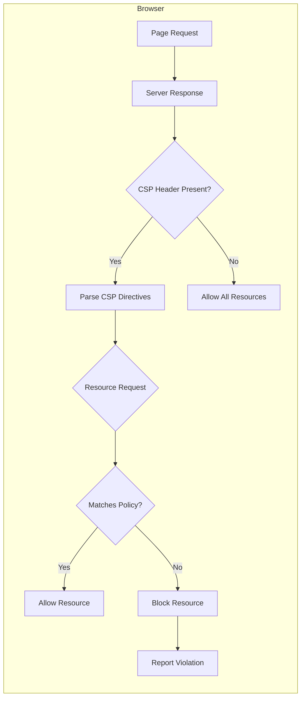

# How to Implement Content Security Policy (CSP) for React Apps

Author: [nawazdhandala](https://github.com/nawazdhandala)

Tags: React, Security, CSP, Content Security Policy, Frontend, OWASP

Description: A comprehensive guide to implementing Content Security Policy in React applications, covering CSP directives, nonce-based scripts, meta tags, HTTP headers, and handling common React-specific challenges like inline styles and third-party libraries.

---

Cross-site scripting (XSS) remains one of the most prevalent web vulnerabilities. Content Security Policy (CSP) is your browser-level defense that tells the browser exactly which resources are allowed to load and execute. For React applications, implementing CSP requires careful consideration of how React handles styles, scripts, and dynamic content.

This guide walks through everything you need to know to implement a robust CSP in your React application, from basic directives to advanced nonce-based configurations.

---

## What is Content Security Policy?

Content Security Policy is an HTTP response header (or meta tag) that instructs browsers which content sources are trusted. When a resource violates the policy, the browser blocks it and optionally reports the violation.



### Why CSP Matters for React Apps

- **XSS Mitigation**: Blocks inline scripts injected by attackers
- **Data Exfiltration Prevention**: Controls where data can be sent
- **Clickjacking Defense**: Works alongside frame-ancestors
- **Supply Chain Protection**: Limits which third-party scripts can run
- **Compliance Requirements**: Often required for SOC 2, PCI-DSS, and HIPAA

---

## CSP Delivery Methods

### Method 1: HTTP Response Header (Recommended)

The most secure and flexible approach is setting CSP via HTTP headers.

**Express.js / Node.js:**

```javascript
const express = require('express');
const app = express();

app.use((req, res, next) => {
  res.setHeader(
    'Content-Security-Policy',
    "default-src 'self'; script-src 'self'; style-src 'self' 'unsafe-inline'; img-src 'self' data: https:; font-src 'self'; connect-src 'self' https://api.example.com; frame-ancestors 'none';"
  );
  next();
});
```

**Next.js (next.config.js):**

```javascript
const securityHeaders = [
  {
    key: 'Content-Security-Policy',
    value: `
      default-src 'self';
      script-src 'self';
      style-src 'self' 'unsafe-inline';
      img-src 'self' data: https:;
      font-src 'self';
      connect-src 'self' https://api.example.com;
      frame-ancestors 'none';
    `.replace(/\s{2,}/g, ' ').trim()
  }
];

module.exports = {
  async headers() {
    return [
      {
        source: '/:path*',
        headers: securityHeaders,
      },
    ];
  },
};
```

**Nginx:**

```nginx
server {
    listen 443 ssl;
    server_name example.com;

    add_header Content-Security-Policy "default-src 'self'; script-src 'self'; style-src 'self' 'unsafe-inline'; img-src 'self' data: https:; font-src 'self'; connect-src 'self' https://api.example.com; frame-ancestors 'none';" always;

    location / {
        root /var/www/html;
        try_files $uri /index.html;
    }
}
```

### Method 2: HTML Meta Tag

For static hosting without header control, use a meta tag. Note: Some directives like `frame-ancestors` and `report-uri` are ignored in meta tags.

```html
<!DOCTYPE html>
<html lang="en">
<head>
  <meta charset="UTF-8">
  <meta http-equiv="Content-Security-Policy"
        content="default-src 'self'; script-src 'self'; style-src 'self' 'unsafe-inline'; img-src 'self' data: https:;">
  <title>React App</title>
</head>
<body>
  <div id="root"></div>
</body>
</html>
```

---

## Understanding CSP Directives

### Core Directives Reference

| Directive | Purpose | Common Values |
|-----------|---------|---------------|
| `default-src` | Fallback for all resource types | `'self'` |
| `script-src` | JavaScript sources | `'self'`, `'nonce-xxx'`, `'strict-dynamic'` |
| `style-src` | CSS sources | `'self'`, `'unsafe-inline'`, `'nonce-xxx'` |
| `img-src` | Image sources | `'self'`, `data:`, `https:` |
| `font-src` | Font file sources | `'self'`, `https://fonts.gstatic.com` |
| `connect-src` | XHR, fetch, WebSocket | `'self'`, API domains |
| `media-src` | Audio and video | `'self'`, CDN domains |
| `object-src` | Plugins (Flash, Java) | `'none'` |
| `frame-src` | iframe sources | `'self'`, allowed domains |
| `frame-ancestors` | Who can embed this page | `'none'`, `'self'` |
| `base-uri` | Base URL restrictions | `'self'` |
| `form-action` | Form submission targets | `'self'` |
| `upgrade-insecure-requests` | Upgrade HTTP to HTTPS | (no value needed) |
| `report-uri` | Violation report endpoint | URL |
| `report-to` | Reporting API endpoint | Group name |

### Source Values Explained

| Value | Meaning |
|-------|---------|
| `'self'` | Same origin as the document |
| `'none'` | Block all sources |
| `'unsafe-inline'` | Allow inline scripts/styles (avoid if possible) |
| `'unsafe-eval'` | Allow eval() and similar (avoid) |
| `'strict-dynamic'` | Trust scripts loaded by trusted scripts |
| `'nonce-<base64>'` | Allow specific inline scripts with matching nonce |
| `'sha256-<hash>'` | Allow inline scripts matching the hash |
| `data:` | Allow data: URIs |
| `https:` | Allow any HTTPS source |
| `*.example.com` | Wildcard subdomain matching |

---

## Starting Point: A Restrictive Base Policy

Begin with the most restrictive policy and relax as needed:

```
Content-Security-Policy:
  default-src 'none';
  script-src 'self';
  style-src 'self';
  img-src 'self';
  font-src 'self';
  connect-src 'self';
  base-uri 'self';
  form-action 'self';
  frame-ancestors 'none';
  object-src 'none';
  upgrade-insecure-requests;
```

This policy:
- Blocks everything by default
- Allows scripts, styles, images, fonts only from same origin
- Allows API calls only to same origin
- Prevents the page from being embedded
- Blocks plugins entirely
- Upgrades HTTP requests to HTTPS

---

## React-Specific CSP Challenges

### Challenge 1: Inline Styles from CSS-in-JS

React libraries like styled-components, Emotion, and Material-UI inject inline styles. This breaks `style-src 'self'`.

**Quick Fix (Less Secure):**

```
style-src 'self' 'unsafe-inline';
```

**Better Fix: Nonce-Based Styles**

Configure your CSS-in-JS library to use nonces.

**styled-components with nonce:**

```javascript
// server.js
import { ServerStyleSheet, StyleSheetManager } from 'styled-components';

const nonce = crypto.randomBytes(16).toString('base64');

const sheet = new ServerStyleSheet();
const html = renderToString(
  <StyleSheetManager nonce={nonce}>
    <App />
  </StyleSheetManager>
);

const styleTags = sheet.getStyleTags();
// styleTags will include nonce attribute
```

**Emotion with nonce:**

```javascript
import createCache from '@emotion/cache';
import { CacheProvider } from '@emotion/react';

const nonce = window.__CSP_NONCE__;

const emotionCache = createCache({
  key: 'css',
  nonce: nonce,
});

function App() {
  return (
    <CacheProvider value={emotionCache}>
      <YourApp />
    </CacheProvider>
  );
}
```

### Challenge 2: Inline Event Handlers

React's synthetic event system handles most events, but some legacy code might use inline handlers.

**Bad (blocked by CSP):**

```jsx
<button onclick="handleClick()">Click</button>
```

**Good (React way):**

```jsx
<button onClick={handleClick}>Click</button>
```

### Challenge 3: Dynamic Script Injection

Some third-party libraries dynamically inject scripts. Use `'strict-dynamic'` to allow scripts loaded by trusted scripts.

```
script-src 'self' 'nonce-${nonce}' 'strict-dynamic';
```

### Challenge 4: eval() and new Function()

Some libraries use eval() for template parsing. This requires `'unsafe-eval'` which is dangerous.

**Instead of:**

```
script-src 'self' 'unsafe-eval';
```

**Find alternatives:**
- Use pre-compiled templates
- Switch to libraries that don't require eval
- For Webpack, use source maps instead of eval in development

---

## Implementing Nonce-Based CSP

Nonces provide the best security for inline scripts and styles. Each page load gets a unique nonce.

### Server-Side Nonce Generation

**Express.js with crypto:**

```javascript
const crypto = require('crypto');
const express = require('express');
const path = require('path');
const fs = require('fs');

const app = express();

app.get('*', (req, res) => {
  // Generate cryptographically secure nonce
  const nonce = crypto.randomBytes(16).toString('base64');

  // Set CSP header with nonce
  res.setHeader(
    'Content-Security-Policy',
    `default-src 'self'; script-src 'self' 'nonce-${nonce}'; style-src 'self' 'nonce-${nonce}'; img-src 'self' data: https:; font-src 'self'; connect-src 'self' https://api.example.com; frame-ancestors 'none'; base-uri 'self'; form-action 'self';`
  );

  // Read index.html and inject nonce
  let html = fs.readFileSync(path.join(__dirname, 'build', 'index.html'), 'utf8');

  // Replace nonce placeholder
  html = html.replace(/__CSP_NONCE__/g, nonce);

  // Add nonce to existing script tags
  html = html.replace(/<script/g, `<script nonce="${nonce}"`);

  res.send(html);
});

app.listen(3000);
```

### React HTML Template with Nonce Placeholder

**public/index.html:**

```html
<!DOCTYPE html>
<html lang="en">
<head>
  <meta charset="utf-8" />
  <meta name="viewport" content="width=device-width, initial-scale=1" />
  <title>React App</title>
  <script nonce="__CSP_NONCE__">
    window.__CSP_NONCE__ = '__CSP_NONCE__';
  </script>
</head>
<body>
  <noscript>You need to enable JavaScript to run this app.</noscript>
  <div id="root"></div>
</body>
</html>
```

### Next.js Nonce Implementation

**middleware.ts:**

```typescript
import { NextResponse } from 'next/server';
import type { NextRequest } from 'next/server';

export function middleware(request: NextRequest) {
  const nonce = Buffer.from(crypto.randomUUID()).toString('base64');

  const cspHeader = `
    default-src 'self';
    script-src 'self' 'nonce-${nonce}' 'strict-dynamic';
    style-src 'self' 'nonce-${nonce}';
    img-src 'self' blob: data:;
    font-src 'self';
    object-src 'none';
    base-uri 'self';
    form-action 'self';
    frame-ancestors 'none';
    upgrade-insecure-requests;
  `.replace(/\s{2,}/g, ' ').trim();

  const requestHeaders = new Headers(request.headers);
  requestHeaders.set('x-nonce', nonce);

  const response = NextResponse.next({
    request: {
      headers: requestHeaders,
    },
  });

  response.headers.set('Content-Security-Policy', cspHeader);

  return response;
}
```

**app/layout.tsx:**

```typescript
import { headers } from 'next/headers';

export default function RootLayout({
  children,
}: {
  children: React.ReactNode;
}) {
  const nonce = headers().get('x-nonce') || '';

  return (
    <html lang="en">
      <head>
        <script
          nonce={nonce}
          dangerouslySetInnerHTML={{
            __html: `window.__NONCE__ = '${nonce}';`,
          }}
        />
      </head>
      <body>{children}</body>
    </html>
  );
}
```

---

## Handling Third-Party Scripts

### Google Analytics

```
script-src 'self' 'nonce-${nonce}' https://www.googletagmanager.com https://www.google-analytics.com;
img-src 'self' https://www.google-analytics.com https://www.googletagmanager.com;
connect-src 'self' https://www.google-analytics.com https://analytics.google.com;
```

**With nonce:**

```jsx
<script nonce={nonce}>
  {`
    window.dataLayer = window.dataLayer || [];
    function gtag(){dataLayer.push(arguments);}
    gtag('js', new Date());
    gtag('config', 'GA_MEASUREMENT_ID');
  `}
</script>
<script nonce={nonce} src="https://www.googletagmanager.com/gtag/js?id=GA_MEASUREMENT_ID" async></script>
```

### Stripe

```
script-src 'self' 'nonce-${nonce}' https://js.stripe.com;
frame-src https://js.stripe.com https://hooks.stripe.com;
connect-src 'self' https://api.stripe.com;
```

### Google Fonts

```
style-src 'self' 'nonce-${nonce}' https://fonts.googleapis.com;
font-src 'self' https://fonts.gstatic.com;
```

### Intercom

```
script-src 'self' 'nonce-${nonce}' https://widget.intercom.io https://js.intercomcdn.com;
connect-src 'self' https://api-iam.intercom.io wss://nexus-websocket-a.intercom.io;
img-src 'self' https://static.intercomassets.com https://downloads.intercomcdn.com;
frame-src https://intercom-sheets.com;
```

---

## CSP Violation Reporting

### Setting Up Report-Only Mode

Start with report-only to identify violations without breaking functionality:

```
Content-Security-Policy-Report-Only:
  default-src 'self';
  script-src 'self';
  style-src 'self';
  report-uri /csp-violation-report;
```

### Creating a Report Endpoint

**Express.js:**

```javascript
const express = require('express');
const app = express();

app.use(express.json({ type: 'application/csp-report' }));

app.post('/csp-violation-report', (req, res) => {
  const violation = req.body['csp-report'];

  console.log('CSP Violation:', {
    documentUri: violation['document-uri'],
    blockedUri: violation['blocked-uri'],
    violatedDirective: violation['violated-directive'],
    originalPolicy: violation['original-policy'],
    sourceFile: violation['source-file'],
    lineNumber: violation['line-number'],
    columnNumber: violation['column-number'],
  });

  // Send to your logging service
  // logService.warn('CSP Violation', violation);

  res.status(204).send();
});
```

### Using the Reporting API (Modern Browsers)

```
Content-Security-Policy:
  default-src 'self';
  report-to csp-endpoint;

Report-To: {"group":"csp-endpoint","max_age":10886400,"endpoints":[{"url":"/csp-report"}]}
```

### Sample Violation Report

```json
{
  "csp-report": {
    "document-uri": "https://example.com/page",
    "referrer": "",
    "violated-directive": "script-src 'self'",
    "effective-directive": "script-src",
    "original-policy": "default-src 'self'; script-src 'self'; report-uri /csp-report",
    "disposition": "enforce",
    "blocked-uri": "https://evil.com/malicious.js",
    "line-number": 42,
    "column-number": 8,
    "source-file": "https://example.com/page"
  }
}
```

---

## Development vs Production CSP

### Development Configuration

More permissive for hot reloading and debugging:

```javascript
const isDevelopment = process.env.NODE_ENV === 'development';

const cspPolicy = {
  'default-src': ["'self'"],
  'script-src': isDevelopment
    ? ["'self'", "'unsafe-eval'"] // Required for webpack hot reload
    : ["'self'", `'nonce-${nonce}'`],
  'style-src': isDevelopment
    ? ["'self'", "'unsafe-inline'"]
    : ["'self'", `'nonce-${nonce}'`],
  'connect-src': isDevelopment
    ? ["'self'", 'ws://localhost:*'] // WebSocket for HMR
    : ["'self'", 'https://api.example.com'],
  'img-src': ["'self'", 'data:', 'https:'],
  'font-src': ["'self'"],
  'frame-ancestors': ["'none'"],
  'base-uri': ["'self'"],
  'form-action': ["'self'"],
};

const cspString = Object.entries(cspPolicy)
  .map(([key, values]) => `${key} ${values.join(' ')}`)
  .join('; ');
```

### Production Configuration

Maximum security:

```javascript
const cspPolicy = `
  default-src 'none';
  script-src 'self' 'nonce-${nonce}' 'strict-dynamic';
  style-src 'self' 'nonce-${nonce}';
  img-src 'self' data: https://cdn.example.com;
  font-src 'self' https://fonts.gstatic.com;
  connect-src 'self' https://api.example.com;
  media-src 'self';
  object-src 'none';
  frame-src 'none';
  frame-ancestors 'none';
  base-uri 'self';
  form-action 'self';
  upgrade-insecure-requests;
  report-uri /csp-violation-report;
`.replace(/\s+/g, ' ').trim();
```

---

## Using Helmet.js for Express Apps

Helmet simplifies security header management including CSP.

**Installation:**

```bash
npm install helmet
```

**Basic Usage:**

```javascript
const express = require('express');
const helmet = require('helmet');
const crypto = require('crypto');

const app = express();

app.use((req, res, next) => {
  res.locals.nonce = crypto.randomBytes(16).toString('base64');
  next();
});

app.use(
  helmet({
    contentSecurityPolicy: {
      directives: {
        defaultSrc: ["'self'"],
        scriptSrc: [
          "'self'",
          (req, res) => `'nonce-${res.locals.nonce}'`,
        ],
        styleSrc: [
          "'self'",
          (req, res) => `'nonce-${res.locals.nonce}'`,
        ],
        imgSrc: ["'self'", 'data:', 'https:'],
        fontSrc: ["'self'", 'https://fonts.gstatic.com'],
        connectSrc: ["'self'", 'https://api.example.com'],
        objectSrc: ["'none'"],
        frameAncestors: ["'none'"],
        baseUri: ["'self'"],
        formAction: ["'self'"],
        upgradeInsecureRequests: [],
      },
      reportOnly: false,
    },
  })
);
```

---

## Complete Implementation Examples

### Example 1: Create React App with Express Server

**server.js:**

```javascript
const express = require('express');
const path = require('path');
const fs = require('fs');
const crypto = require('crypto');

const app = express();
const PORT = process.env.PORT || 3000;

// Serve static files
app.use(express.static(path.join(__dirname, 'build'), {
  index: false, // Don't serve index.html automatically
}));

// Handle all routes
app.get('*', (req, res) => {
  const nonce = crypto.randomBytes(16).toString('base64');

  // Set security headers
  res.setHeader('X-Content-Type-Options', 'nosniff');
  res.setHeader('X-Frame-Options', 'DENY');
  res.setHeader('X-XSS-Protection', '1; mode=block');
  res.setHeader('Referrer-Policy', 'strict-origin-when-cross-origin');
  res.setHeader(
    'Content-Security-Policy',
    [
      "default-src 'self'",
      `script-src 'self' 'nonce-${nonce}'`,
      `style-src 'self' 'nonce-${nonce}' https://fonts.googleapis.com`,
      "img-src 'self' data: https:",
      "font-src 'self' https://fonts.gstatic.com",
      "connect-src 'self' https://api.example.com",
      "object-src 'none'",
      "frame-ancestors 'none'",
      "base-uri 'self'",
      "form-action 'self'",
      "upgrade-insecure-requests",
    ].join('; ')
  );

  // Read and modify index.html
  const indexPath = path.join(__dirname, 'build', 'index.html');
  let html = fs.readFileSync(indexPath, 'utf8');

  // Inject nonce into script tags
  html = html.replace(
    /<script>/g,
    `<script nonce="${nonce}">`
  );
  html = html.replace(
    /<script src/g,
    `<script nonce="${nonce}" src`
  );

  // Inject nonce into style tags
  html = html.replace(
    /<style>/g,
    `<style nonce="${nonce}">`
  );
  html = html.replace(
    /<link rel="stylesheet"/g,
    `<link nonce="${nonce}" rel="stylesheet"`
  );

  // Make nonce available to client
  html = html.replace(
    '</head>',
    `<script nonce="${nonce}">window.__CSP_NONCE__='${nonce}';</script></head>`
  );

  res.send(html);
});

app.listen(PORT, () => {
  console.log(`Server running on port ${PORT}`);
});
```

### Example 2: Next.js App Router with Full CSP

**middleware.ts:**

```typescript
import { NextResponse } from 'next/server';
import type { NextRequest } from 'next/server';

export function middleware(request: NextRequest) {
  const nonce = Buffer.from(crypto.randomUUID()).toString('base64');

  const cspHeader = `
    default-src 'self';
    script-src 'self' 'nonce-${nonce}' 'strict-dynamic' https: http:;
    style-src 'self' 'nonce-${nonce}';
    img-src 'self' blob: data: https:;
    font-src 'self' https://fonts.gstatic.com;
    connect-src 'self' https://api.example.com wss://ws.example.com;
    media-src 'self';
    object-src 'none';
    child-src 'self';
    frame-src 'self' https://www.youtube.com;
    worker-src 'self' blob:;
    frame-ancestors 'none';
    form-action 'self';
    base-uri 'self';
    manifest-src 'self';
    upgrade-insecure-requests;
  `.replace(/\s{2,}/g, ' ').trim();

  const requestHeaders = new Headers(request.headers);
  requestHeaders.set('x-nonce', nonce);

  const response = NextResponse.next({
    request: {
      headers: requestHeaders,
    },
  });

  response.headers.set('Content-Security-Policy', cspHeader);
  response.headers.set('X-Content-Type-Options', 'nosniff');
  response.headers.set('X-Frame-Options', 'DENY');
  response.headers.set('Referrer-Policy', 'strict-origin-when-cross-origin');
  response.headers.set('Permissions-Policy', 'camera=(), microphone=(), geolocation=()');

  return response;
}

export const config = {
  matcher: [
    '/((?!api|_next/static|_next/image|favicon.ico).*)',
  ],
};
```

**app/layout.tsx:**

```typescript
import { headers } from 'next/headers';
import Script from 'next/script';

export default function RootLayout({
  children,
}: {
  children: React.ReactNode;
}) {
  const headersList = headers();
  const nonce = headersList.get('x-nonce') ?? '';

  return (
    <html lang="en">
      <head>
        <Script
          strategy="beforeInteractive"
          nonce={nonce}
        >
          {`window.__NONCE__ = '${nonce}';`}
        </Script>
      </head>
      <body>
        {children}
        <Script
          src="https://www.googletagmanager.com/gtag/js?id=GA_ID"
          strategy="afterInteractive"
          nonce={nonce}
        />
        <Script
          id="google-analytics"
          strategy="afterInteractive"
          nonce={nonce}
        >
          {`
            window.dataLayer = window.dataLayer || [];
            function gtag(){dataLayer.push(arguments);}
            gtag('js', new Date());
            gtag('config', 'GA_ID');
          `}
        </Script>
      </body>
    </html>
  );
}
```

### Example 3: Vite React App

**vite.config.ts:**

```typescript
import { defineConfig } from 'vite';
import react from '@vitejs/plugin-react';

export default defineConfig({
  plugins: [react()],
  server: {
    headers: {
      'Content-Security-Policy': [
        "default-src 'self'",
        "script-src 'self' 'unsafe-eval'", // Required for Vite HMR
        "style-src 'self' 'unsafe-inline'", // Required for Vite
        "connect-src 'self' ws://localhost:*", // WebSocket for HMR
        "img-src 'self' data:",
      ].join('; '),
    },
  },
});
```

**Production server (Express):**

```javascript
// Same as Create React App example above
```

---

## Testing Your CSP

### Browser DevTools

1. Open Chrome DevTools (F12)
2. Go to Console tab
3. Look for CSP violation errors
4. Go to Network tab > select a request > Headers to see CSP header

### Online Validators

- [CSP Evaluator by Google](https://csp-evaluator.withgoogle.com/)
- [Mozilla Observatory](https://observatory.mozilla.org/)
- [SecurityHeaders.com](https://securityheaders.com/)

### Automated Testing

```javascript
// csp.test.js
const axios = require('axios');

describe('CSP Headers', () => {
  it('should include Content-Security-Policy header', async () => {
    const response = await axios.get('http://localhost:3000');
    const csp = response.headers['content-security-policy'];

    expect(csp).toBeDefined();
    expect(csp).toContain("default-src 'self'");
    expect(csp).toContain("script-src");
    expect(csp).toContain("object-src 'none'");
    expect(csp).toContain("frame-ancestors 'none'");
  });

  it('should not include unsafe-eval in production', async () => {
    const response = await axios.get('http://localhost:3000');
    const csp = response.headers['content-security-policy'];

    expect(csp).not.toContain("'unsafe-eval'");
  });

  it('should include nonce in script-src', async () => {
    const response = await axios.get('http://localhost:3000');
    const csp = response.headers['content-security-policy'];

    expect(csp).toMatch(/script-src[^;]*'nonce-[A-Za-z0-9+/=]+'/);
  });
});
```

---

## Common Issues and Solutions

### Issue: React Hot Reload Broken

**Symptom:** Development server shows errors, changes don't reflect

**Solution:**

```
// Development only
script-src 'self' 'unsafe-eval';
connect-src 'self' ws://localhost:*;
```

### Issue: Styled-Components Not Working

**Symptom:** Styles not applied, CSP violations for inline styles

**Solution:**

```javascript
// Use nonce with styled-components
import { StyleSheetManager } from 'styled-components';

const nonce = window.__CSP_NONCE__;

<StyleSheetManager nonce={nonce}>
  <App />
</StyleSheetManager>
```

### Issue: Web Workers Blocked

**Symptom:** Workers fail to load

**Solution:**

```
worker-src 'self' blob:;
```

### Issue: Service Worker Registration Failed

**Symptom:** PWA not working

**Solution:**

```
worker-src 'self';
script-src 'self' 'nonce-xxx';
```

### Issue: Images from Data URIs Blocked

**Symptom:** Base64 images not displaying

**Solution:**

```
img-src 'self' data:;
```

### Issue: WebSocket Connections Blocked

**Symptom:** Real-time features not working

**Solution:**

```
connect-src 'self' wss://ws.example.com;
```

### Issue: Fonts Not Loading

**Symptom:** Custom fonts showing fallbacks

**Solution:**

```
font-src 'self' https://fonts.gstatic.com;
style-src 'self' 'nonce-xxx' https://fonts.googleapis.com;
```

---

## CSP Directive Quick Reference Table

| Use Case | Directive | Recommended Value |
|----------|-----------|-------------------|
| Block everything by default | `default-src` | `'none'` |
| Allow same-origin scripts | `script-src` | `'self'` |
| Allow nonce-based inline scripts | `script-src` | `'nonce-{random}'` |
| Allow hash-based inline scripts | `script-src` | `'sha256-{hash}'` |
| Trust dynamically loaded scripts | `script-src` | `'strict-dynamic'` |
| Allow same-origin styles | `style-src` | `'self'` |
| Allow inline styles (less secure) | `style-src` | `'unsafe-inline'` |
| Allow images from CDN | `img-src` | `'self' https://cdn.example.com` |
| Allow data URI images | `img-src` | `'self' data:` |
| Allow API calls | `connect-src` | `'self' https://api.example.com` |
| Allow WebSocket | `connect-src` | `wss://ws.example.com` |
| Allow Google Fonts | `font-src` | `'self' https://fonts.gstatic.com` |
| Block iframes | `frame-src` | `'none'` |
| Allow YouTube embeds | `frame-src` | `https://www.youtube.com` |
| Prevent clickjacking | `frame-ancestors` | `'none'` |
| Block plugins | `object-src` | `'none'` |
| Restrict base URL | `base-uri` | `'self'` |
| Restrict form targets | `form-action` | `'self'` |
| Upgrade HTTP to HTTPS | `upgrade-insecure-requests` | (no value) |
| Report violations | `report-uri` | `/csp-report` |

---

## Security Best Practices Summary

1. **Start Strict**: Begin with `default-src 'none'` and add permissions as needed
2. **Use Nonces**: Prefer nonces over `'unsafe-inline'` for inline scripts/styles
3. **Avoid unsafe-eval**: Find alternatives to libraries requiring eval()
4. **Block Plugins**: Always set `object-src 'none'`
5. **Prevent Framing**: Use `frame-ancestors 'none'` unless embedding is required
6. **Report Violations**: Set up violation reporting to catch issues early
7. **Test in Report-Only**: Use `Content-Security-Policy-Report-Only` before enforcing
8. **Environment-Specific**: Different CSP for development vs production
9. **Regular Audits**: Review and tighten CSP as dependencies change
10. **Defense in Depth**: CSP is one layer; combine with other security measures

---

## Conclusion

Content Security Policy is essential for protecting React applications against XSS and other injection attacks. While React's architecture already provides some protection through its virtual DOM and automatic escaping, CSP adds a crucial browser-enforced security layer.

Key takeaways:

- **Start with report-only mode** to understand your application's resource needs
- **Use nonces** instead of `'unsafe-inline'` for better security
- **Configure CSS-in-JS libraries** to support nonces
- **Whitelist third-party services** carefully and specifically
- **Set up violation reporting** to catch issues in production
- **Maintain separate policies** for development and production environments

Implementing CSP requires upfront investment, but the security benefits far outweigh the initial configuration effort. Once in place, CSP acts as a powerful safety net that protects your users even when other defenses fail.

---

## Additional Resources

- [MDN Web Docs: Content Security Policy](https://developer.mozilla.org/en-US/docs/Web/HTTP/CSP)
- [OWASP CSP Cheat Sheet](https://cheatsheetseries.owasp.org/cheatsheets/Content_Security_Policy_Cheat_Sheet.html)
- [Google CSP Evaluator](https://csp-evaluator.withgoogle.com/)
- [W3C CSP Specification](https://www.w3.org/TR/CSP3/)
- [React Security Best Practices](https://legacy.reactjs.org/docs/faq-internals.html)
