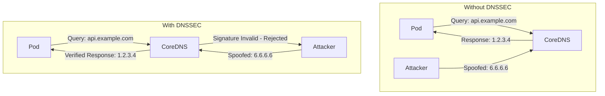
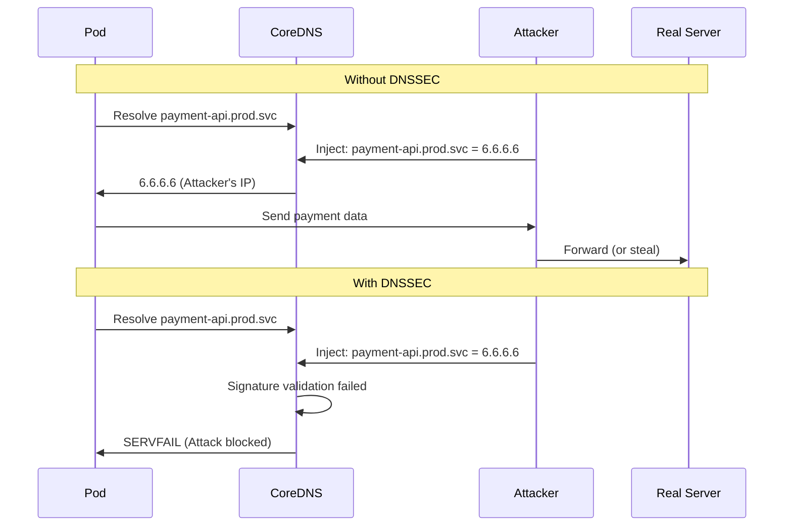

# How to Enable DNSSEC Validation in CoreDNS for Kubernetes

Author: [nawazdhandala](https://github.com/nawazdhandala)

Tags: DNSSEC, CoreDNS, Kubernetes, DNS, Security, DevOps

Description: A comprehensive guide to configuring DNSSEC validation in CoreDNS to protect your Kubernetes cluster from DNS spoofing and cache poisoning attacks.

---

DNS is the backbone of service discovery in Kubernetes. Every time a pod resolves a service name, it trusts the DNS response blindly. Without DNSSEC validation, your cluster is vulnerable to DNS spoofing, cache poisoning, and man-in-the-middle attacks. This guide shows you how to enable DNSSEC validation in CoreDNS to cryptographically verify DNS responses.

## Understanding DNSSEC

DNSSEC (Domain Name System Security Extensions) adds cryptographic signatures to DNS records. When enabled, your DNS resolver verifies these signatures against a chain of trust anchored at the DNS root servers.



### How DNSSEC Works

1. **Zone signing**: Domain owners sign their DNS records with private keys
2. **Chain of trust**: Each zone's public key is signed by the parent zone
3. **Root trust anchor**: The chain ends at the DNS root, which has a well-known public key
4. **Validation**: Resolvers verify signatures from root to leaf

### DNSSEC Record Types

| Record Type | Purpose |
|-------------|---------|
| **RRSIG** | Contains the cryptographic signature for a DNS record set |
| **DNSKEY** | Contains the public key used to verify signatures |
| **DS** | Delegation Signer - links child zone's key to parent zone |
| **NSEC/NSEC3** | Proves non-existence of a domain (authenticated denial) |

## Why Enable DNSSEC in Kubernetes

### Security Threats Mitigated

1. **DNS Cache Poisoning**: Attackers inject false records into DNS cache
2. **DNS Spoofing**: Man-in-the-middle attacks return fake IP addresses
3. **DNS Hijacking**: Redirecting queries to malicious servers
4. **BGP Hijacking**: Route DNS traffic through attacker-controlled networks

### Real-World Attack Scenarios



## CoreDNS Architecture in Kubernetes

CoreDNS is the default DNS server in Kubernetes since version 1.13. It runs as a Deployment in the `kube-system` namespace and is configured via a ConfigMap.

### Default CoreDNS Setup

```bash
# Check CoreDNS deployment
kubectl get deployment coredns -n kube-system

# View current configuration
kubectl get configmap coredns -n kube-system -o yaml
```

### Default Corefile

```
.:53 {
    errors
    health {
        lameduck 5s
    }
    ready
    kubernetes cluster.local in-addr.arpa ip6.arpa {
        pods insecure
        fallthrough in-addr.arpa ip6.arpa
        ttl 30
    }
    prometheus :9153
    forward . /etc/resolv.conf {
        max_concurrent 1000
    }
    cache 30
    loop
    reload
    loadbalance
}
```

This default configuration does NOT validate DNSSEC. External queries are forwarded to upstream resolvers without verification.

## Enabling DNSSEC Validation

CoreDNS supports DNSSEC validation through two approaches:

1. **Using a validating upstream resolver** (simpler)
2. **Native DNSSEC validation with the `dnssec` plugin** (more control)

### Approach 1: Validating Upstream Resolver

The simplest method is to forward queries to a resolver that performs DNSSEC validation.

#### Using Cloudflare's 1.1.1.1

```yaml
apiVersion: v1
kind: ConfigMap
metadata:
  name: coredns
  namespace: kube-system
data:
  Corefile: |
    .:53 {
        errors
        health {
            lameduck 5s
        }
        ready
        kubernetes cluster.local in-addr.arpa ip6.arpa {
            pods insecure
            fallthrough in-addr.arpa ip6.arpa
            ttl 30
        }
        prometheus :9153
        forward . 1.1.1.1 1.0.0.1 {
            max_concurrent 1000
            policy sequential
        }
        cache 30
        loop
        reload
        loadbalance
    }
```

#### Using Google's 8.8.8.8

```yaml
apiVersion: v1
kind: ConfigMap
metadata:
  name: coredns
  namespace: kube-system
data:
  Corefile: |
    .:53 {
        errors
        health {
            lameduck 5s
        }
        ready
        kubernetes cluster.local in-addr.arpa ip6.arpa {
            pods insecure
            fallthrough in-addr.arpa ip6.arpa
            ttl 30
        }
        prometheus :9153
        forward . 8.8.8.8 8.8.4.4 {
            max_concurrent 1000
            policy sequential
        }
        cache 30
        loop
        reload
        loadbalance
    }
```

#### Using Quad9 (Recommended for Security)

Quad9 blocks known malicious domains in addition to DNSSEC validation.

```yaml
apiVersion: v1
kind: ConfigMap
metadata:
  name: coredns
  namespace: kube-system
data:
  Corefile: |
    .:53 {
        errors
        health {
            lameduck 5s
        }
        ready
        kubernetes cluster.local in-addr.arpa ip6.arpa {
            pods insecure
            fallthrough in-addr.arpa ip6.arpa
            ttl 30
        }
        prometheus :9153
        forward . 9.9.9.9 149.112.112.112 {
            max_concurrent 1000
            policy sequential
        }
        cache 30
        loop
        reload
        loadbalance
    }
```

### Approach 2: Native DNSSEC Validation

For full control, use CoreDNS's native DNSSEC capabilities with the `dnssec` plugin.

#### Full Corefile with DNSSEC Plugin

```yaml
apiVersion: v1
kind: ConfigMap
metadata:
  name: coredns
  namespace: kube-system
data:
  Corefile: |
    .:53 {
        errors
        health {
            lameduck 5s
        }
        ready
        kubernetes cluster.local in-addr.arpa ip6.arpa {
            pods insecure
            fallthrough in-addr.arpa ip6.arpa
            ttl 30
        }
        prometheus :9153
        dnssec {
            cache_capacity 10000
        }
        forward . 1.1.1.1 8.8.8.8 {
            max_concurrent 1000
        }
        cache 30 {
            success 9984 30
            denial 9984 5
        }
        loop
        reload
        loadbalance
    }
```

#### DNSSEC Plugin Configuration Options

```
dnssec [ZONES...] {
    cache_capacity CAPACITY
}
```

| Option | Description | Default |
|--------|-------------|---------|
| `cache_capacity` | Number of DNSSEC records to cache | 10000 |
| `ZONES` | Zones to enable DNSSEC for | . (root) |

### Signing Internal Zones

If you want to sign your internal Kubernetes DNS zone (cluster.local), you need to generate keys and configure signing.

#### Generate DNSSEC Keys

```bash
# Create a directory for keys
mkdir -p /tmp/dnssec-keys

# Generate Zone Signing Key (ZSK)
dnssec-keygen -a ECDSAP256SHA256 -n ZONE cluster.local

# Generate Key Signing Key (KSK)
dnssec-keygen -a ECDSAP256SHA256 -n ZONE -f KSK cluster.local
```

#### Corefile with Zone Signing

```yaml
apiVersion: v1
kind: ConfigMap
metadata:
  name: coredns
  namespace: kube-system
data:
  Corefile: |
    cluster.local:53 {
        errors
        health {
            lameduck 5s
        }
        ready
        kubernetes cluster.local in-addr.arpa ip6.arpa {
            pods insecure
            fallthrough in-addr.arpa ip6.arpa
            ttl 30
        }
        dnssec {
            key file /etc/coredns/keys/Kcluster.local
            cache_capacity 10000
        }
        prometheus :9153
        cache 30
        loop
        reload
        loadbalance
    }

    .:53 {
        errors
        health {
            lameduck 5s
        }
        ready
        prometheus :9153
        dnssec {
            cache_capacity 10000
        }
        forward . 9.9.9.9 149.112.112.112 {
            max_concurrent 1000
        }
        cache 30
        loop
        reload
        loadbalance
    }
```

## Complete Kubernetes Deployment

### Step 1: Create the ConfigMap

```yaml
# coredns-configmap.yaml
apiVersion: v1
kind: ConfigMap
metadata:
  name: coredns
  namespace: kube-system
  labels:
    app.kubernetes.io/name: coredns
    app.kubernetes.io/part-of: kube-dns
data:
  Corefile: |
    .:53 {
        errors
        health {
            lameduck 5s
        }
        ready
        kubernetes cluster.local in-addr.arpa ip6.arpa {
            pods insecure
            fallthrough in-addr.arpa ip6.arpa
            ttl 30
        }
        prometheus :9153
        dnssec {
            cache_capacity 10000
        }
        forward . tls://1.1.1.1 tls://1.0.0.1 {
            tls_servername cloudflare-dns.com
            max_concurrent 1000
            health_check 5s
        }
        cache 30 {
            success 9984 30
            denial 9984 5
        }
        loop
        reload
        loadbalance
    }
```

### Step 2: Create the Deployment

```yaml
# coredns-deployment.yaml
apiVersion: apps/v1
kind: Deployment
metadata:
  name: coredns
  namespace: kube-system
  labels:
    k8s-app: kube-dns
    kubernetes.io/name: CoreDNS
spec:
  replicas: 2
  strategy:
    type: RollingUpdate
    rollingUpdate:
      maxUnavailable: 1
      maxSurge: 1
  selector:
    matchLabels:
      k8s-app: kube-dns
  template:
    metadata:
      labels:
        k8s-app: kube-dns
      annotations:
        prometheus.io/scrape: "true"
        prometheus.io/port: "9153"
    spec:
      serviceAccountName: coredns
      priorityClassName: system-cluster-critical
      tolerations:
        - key: CriticalAddonsOnly
          operator: Exists
        - key: node-role.kubernetes.io/control-plane
          effect: NoSchedule
        - key: node-role.kubernetes.io/master
          effect: NoSchedule
      affinity:
        podAntiAffinity:
          preferredDuringSchedulingIgnoredDuringExecution:
            - weight: 100
              podAffinityTerm:
                labelSelector:
                  matchLabels:
                    k8s-app: kube-dns
                topologyKey: kubernetes.io/hostname
      containers:
        - name: coredns
          image: coredns/coredns:1.11.1
          imagePullPolicy: IfNotPresent
          resources:
            limits:
              memory: 256Mi
              cpu: 200m
            requests:
              memory: 128Mi
              cpu: 100m
          args: ["-conf", "/etc/coredns/Corefile"]
          volumeMounts:
            - name: config-volume
              mountPath: /etc/coredns
              readOnly: true
          ports:
            - containerPort: 53
              name: dns
              protocol: UDP
            - containerPort: 53
              name: dns-tcp
              protocol: TCP
            - containerPort: 9153
              name: metrics
              protocol: TCP
          securityContext:
            allowPrivilegeEscalation: false
            capabilities:
              add:
                - NET_BIND_SERVICE
              drop:
                - ALL
            readOnlyRootFilesystem: true
          livenessProbe:
            httpGet:
              path: /health
              port: 8080
              scheme: HTTP
            initialDelaySeconds: 60
            timeoutSeconds: 5
            successThreshold: 1
            failureThreshold: 5
          readinessProbe:
            httpGet:
              path: /ready
              port: 8181
              scheme: HTTP
            initialDelaySeconds: 10
            timeoutSeconds: 5
            successThreshold: 1
            failureThreshold: 3
      dnsPolicy: Default
      volumes:
        - name: config-volume
          configMap:
            name: coredns
            items:
              - key: Corefile
                path: Corefile
```

### Step 3: Create the Service

```yaml
# coredns-service.yaml
apiVersion: v1
kind: Service
metadata:
  name: kube-dns
  namespace: kube-system
  labels:
    k8s-app: kube-dns
    kubernetes.io/name: CoreDNS
  annotations:
    prometheus.io/scrape: "true"
    prometheus.io/port: "9153"
spec:
  selector:
    k8s-app: kube-dns
  clusterIP: 10.96.0.10
  ports:
    - name: dns
      port: 53
      protocol: UDP
      targetPort: 53
    - name: dns-tcp
      port: 53
      protocol: TCP
      targetPort: 53
    - name: metrics
      port: 9153
      protocol: TCP
      targetPort: 9153
```

### Step 4: Create RBAC Resources

```yaml
# coredns-rbac.yaml
apiVersion: v1
kind: ServiceAccount
metadata:
  name: coredns
  namespace: kube-system
  labels:
    kubernetes.io/name: CoreDNS
---
apiVersion: rbac.authorization.k8s.io/v1
kind: ClusterRole
metadata:
  name: system:coredns
  labels:
    kubernetes.io/bootstrapping: rbac-defaults
rules:
  - apiGroups: [""]
    resources: ["endpoints", "services", "pods", "namespaces"]
    verbs: ["list", "watch"]
  - apiGroups: ["discovery.k8s.io"]
    resources: ["endpointslices"]
    verbs: ["list", "watch"]
---
apiVersion: rbac.authorization.k8s.io/v1
kind: ClusterRoleBinding
metadata:
  name: system:coredns
  labels:
    kubernetes.io/bootstrapping: rbac-defaults
roleRef:
  apiGroup: rbac.authorization.k8s.io
  kind: ClusterRole
  name: system:coredns
subjects:
  - kind: ServiceAccount
    name: coredns
    namespace: kube-system
```

### Step 5: Apply All Resources

```bash
# Apply the configuration
kubectl apply -f coredns-rbac.yaml
kubectl apply -f coredns-configmap.yaml
kubectl apply -f coredns-deployment.yaml
kubectl apply -f coredns-service.yaml

# Restart CoreDNS to pick up changes
kubectl rollout restart deployment/coredns -n kube-system

# Watch rollout status
kubectl rollout status deployment/coredns -n kube-system
```

## DNS over TLS (DoT) Configuration

For enhanced security, use DNS over TLS to encrypt queries to upstream resolvers.

### Corefile with DoT

```yaml
apiVersion: v1
kind: ConfigMap
metadata:
  name: coredns
  namespace: kube-system
data:
  Corefile: |
    .:53 {
        errors
        health {
            lameduck 5s
        }
        ready
        kubernetes cluster.local in-addr.arpa ip6.arpa {
            pods insecure
            fallthrough in-addr.arpa ip6.arpa
            ttl 30
        }
        prometheus :9153
        dnssec {
            cache_capacity 10000
        }
        forward . tls://9.9.9.9 tls://149.112.112.112 {
            tls_servername dns.quad9.net
            max_concurrent 1000
            health_check 5s
            expire 10s
        }
        cache 30 {
            success 9984 30
            denial 9984 5
        }
        loop
        reload
        loadbalance
    }
```

### DoT Provider Options

| Provider | Address | TLS Server Name |
|----------|---------|-----------------|
| Cloudflare | tls://1.1.1.1, tls://1.0.0.1 | cloudflare-dns.com |
| Google | tls://8.8.8.8, tls://8.8.4.4 | dns.google |
| Quad9 | tls://9.9.9.9, tls://149.112.112.112 | dns.quad9.net |
| CleanBrowsing | tls://185.228.168.168 | security-filter-dns.cleanbrowsing.org |

## Testing DNSSEC Validation

### Verify CoreDNS is Running

```bash
# Check pods are healthy
kubectl get pods -n kube-system -l k8s-app=kube-dns

# View logs
kubectl logs -n kube-system -l k8s-app=kube-dns --tail=50
```

### Test DNSSEC Validation

Create a test pod to run DNS queries.

```yaml
# dns-test-pod.yaml
apiVersion: v1
kind: Pod
metadata:
  name: dns-test
  namespace: default
spec:
  containers:
    - name: dns-test
      image: alpine:3.19
      command: ["sleep", "infinity"]
  restartPolicy: Never
```

```bash
# Apply test pod
kubectl apply -f dns-test-pod.yaml

# Wait for pod to be ready
kubectl wait --for=condition=Ready pod/dns-test

# Install dig
kubectl exec -it dns-test -- apk add --no-cache bind-tools
```

### Query a DNSSEC-Signed Domain

```bash
# Query a domain with DNSSEC
kubectl exec -it dns-test -- dig @10.96.0.10 dnssec-failed.org +dnssec +short

# This should return SERVFAIL because dnssec-failed.org has intentionally broken DNSSEC
```

### Query a Valid DNSSEC Domain

```bash
# Query a valid DNSSEC-signed domain
kubectl exec -it dns-test -- dig @10.96.0.10 cloudflare.com +dnssec

# Look for the 'ad' flag (Authenticated Data) in the response
# ;; flags: qr rd ra ad; QUERY: 1, ANSWER: 2, AUTHORITY: 0, ADDITIONAL: 1
```

### Verify AD Flag

```bash
# Check for the AD (Authenticated Data) flag
kubectl exec -it dns-test -- dig @10.96.0.10 google.com +dnssec | grep flags

# Output should include 'ad' flag:
# ;; flags: qr rd ra ad; QUERY: 1, ANSWER: 1, AUTHORITY: 0, ADDITIONAL: 1
```

### Test with Known-Bad DNSSEC Domains

```bash
# These domains have intentionally broken DNSSEC for testing
# Should return SERVFAIL

# Expired signatures
kubectl exec -it dns-test -- dig @10.96.0.10 dnssec-failed.org +short

# Missing RRSIG
kubectl exec -it dns-test -- dig @10.96.0.10 sigfail.verteiltesysteme.net +short

# Wrong signature
kubectl exec -it dns-test -- dig @10.96.0.10 bogus.d.]ns-oarc.net +short
```

## Monitoring DNSSEC

### Prometheus Metrics

CoreDNS exposes metrics that can be scraped by Prometheus.

```yaml
# coredns-servicemonitor.yaml
apiVersion: monitoring.coreos.com/v1
kind: ServiceMonitor
metadata:
  name: coredns
  namespace: monitoring
  labels:
    app: coredns
spec:
  selector:
    matchLabels:
      k8s-app: kube-dns
  namespaceSelector:
    matchNames:
      - kube-system
  endpoints:
    - port: metrics
      interval: 15s
      path: /metrics
```

### Key Metrics to Monitor

| Metric | Description |
|--------|-------------|
| `coredns_dns_requests_total` | Total DNS requests |
| `coredns_dns_responses_total` | Total DNS responses by rcode |
| `coredns_forward_requests_total` | Forwarded requests |
| `coredns_forward_responses_total` | Forwarded responses |
| `coredns_cache_hits_total` | Cache hits |
| `coredns_cache_misses_total` | Cache misses |
| `coredns_dnssec_cache_hits_total` | DNSSEC cache hits |
| `coredns_dnssec_cache_misses_total` | DNSSEC cache misses |

### Grafana Dashboard

```json
{
  "panels": [
    {
      "title": "DNS Requests per Second",
      "type": "graph",
      "targets": [
        {
          "expr": "sum(rate(coredns_dns_requests_total[5m])) by (type)",
          "legendFormat": "{{type}}"
        }
      ]
    },
    {
      "title": "DNSSEC Validation Failures",
      "type": "graph",
      "targets": [
        {
          "expr": "sum(rate(coredns_dns_responses_total{rcode=\"SERVFAIL\"}[5m]))",
          "legendFormat": "SERVFAIL"
        }
      ]
    },
    {
      "title": "DNSSEC Cache Hit Rate",
      "type": "gauge",
      "targets": [
        {
          "expr": "sum(coredns_dnssec_cache_hits_total) / (sum(coredns_dnssec_cache_hits_total) + sum(coredns_dnssec_cache_misses_total)) * 100"
        }
      ]
    }
  ]
}
```

### Alerting Rules

```yaml
# coredns-alerts.yaml
apiVersion: monitoring.coreos.com/v1
kind: PrometheusRule
metadata:
  name: coredns-alerts
  namespace: monitoring
spec:
  groups:
    - name: coredns
      rules:
        - alert: CoreDNSDown
          expr: absent(up{job="coredns"} == 1)
          for: 5m
          labels:
            severity: critical
          annotations:
            summary: CoreDNS is down
            description: CoreDNS has been down for more than 5 minutes

        - alert: HighDNSSECFailureRate
          expr: |
            sum(rate(coredns_dns_responses_total{rcode="SERVFAIL"}[5m]))
            / sum(rate(coredns_dns_responses_total[5m])) > 0.1
          for: 10m
          labels:
            severity: warning
          annotations:
            summary: High DNSSEC validation failure rate
            description: More than 10% of DNS queries are failing DNSSEC validation

        - alert: CoreDNSLatencyHigh
          expr: |
            histogram_quantile(0.99, sum(rate(coredns_dns_request_duration_seconds_bucket[5m])) by (le)) > 0.5
          for: 10m
          labels:
            severity: warning
          annotations:
            summary: CoreDNS latency is high
            description: 99th percentile DNS latency is above 500ms
```

## Troubleshooting

### Common Issues and Solutions

#### Issue 1: SERVFAIL for All External Domains

**Symptoms**: All external DNS queries return SERVFAIL

**Cause**: Upstream resolver unreachable or DNSSEC validation failing

**Solution**:

```bash
# Check CoreDNS logs
kubectl logs -n kube-system -l k8s-app=kube-dns --tail=100

# Test upstream connectivity
kubectl exec -n kube-system deploy/coredns -- nslookup google.com 1.1.1.1

# Temporarily disable DNSSEC to isolate the issue
# Remove the dnssec block from Corefile and reload
```

#### Issue 2: Slow DNS Resolution

**Symptoms**: DNS queries take several seconds

**Cause**: Upstream resolver latency or DNSSEC validation overhead

**Solution**:

```bash
# Check forward health
kubectl exec -n kube-system deploy/coredns -- dig @1.1.1.1 google.com

# Increase cache TTL in Corefile
# cache 300 {
#     success 9984 300
#     denial 9984 30
# }

# Add more upstream resolvers for failover
# forward . 1.1.1.1 8.8.8.8 9.9.9.9
```

#### Issue 3: Internal Services Not Resolving

**Symptoms**: cluster.local domains return NXDOMAIN

**Cause**: kubernetes plugin misconfigured

**Solution**:

```bash
# Verify kubernetes plugin configuration
kubectl get configmap coredns -n kube-system -o yaml | grep -A5 kubernetes

# Check endpoints
kubectl get endpoints -n kube-system kube-dns

# Verify service account permissions
kubectl auth can-i list endpoints --as=system:serviceaccount:kube-system:coredns
```

#### Issue 4: DNSSEC Validation Errors

**Symptoms**: Specific domains return SERVFAIL even though they should work

**Cause**: Domain's DNSSEC misconfigured or clock skew

**Solution**:

```bash
# Check if domain's DNSSEC is valid
dig +dnssec +cd example.com  # CD flag disables validation

# Verify system time is correct
kubectl exec -n kube-system deploy/coredns -- date

# Check DNSSEC status of domain
# Visit: https://dnsviz.net/
```

### Debug Logging

Enable debug logging for troubleshooting.

```yaml
apiVersion: v1
kind: ConfigMap
metadata:
  name: coredns
  namespace: kube-system
data:
  Corefile: |
    .:53 {
        log
        debug
        errors
        health {
            lameduck 5s
        }
        ready
        kubernetes cluster.local in-addr.arpa ip6.arpa {
            pods insecure
            fallthrough in-addr.arpa ip6.arpa
            ttl 30
        }
        prometheus :9153
        dnssec {
            cache_capacity 10000
        }
        forward . 1.1.1.1 8.8.8.8 {
            max_concurrent 1000
        }
        cache 30
        loop
        reload
        loadbalance
    }
```

```bash
# Apply and watch logs
kubectl apply -f coredns-configmap.yaml
kubectl rollout restart deployment/coredns -n kube-system
kubectl logs -n kube-system -l k8s-app=kube-dns -f
```

## Performance Tuning

### Optimize Cache Settings

```
cache 300 {
    success 9984 300    # Cache successful responses for 300s
    denial 9984 30      # Cache NXDOMAIN for 30s
    prefetch 10 1h 10%  # Prefetch entries with >10 hits
}
```

### Increase DNSSEC Cache

```
dnssec {
    cache_capacity 50000  # Increase for high-traffic clusters
}
```

### Scale CoreDNS

```bash
# Scale replicas based on cluster size
# Rule of thumb: 1 replica per 1000 pods

kubectl scale deployment/coredns -n kube-system --replicas=3
```

### Resource Allocation

```yaml
resources:
  limits:
    memory: 512Mi
    cpu: 500m
  requests:
    memory: 256Mi
    cpu: 200m
```

## Security Best Practices

### 1. Use DNS over TLS

Always encrypt DNS queries to upstream resolvers.

```
forward . tls://1.1.1.1 {
    tls_servername cloudflare-dns.com
}
```

### 2. Limit CoreDNS Network Access

```yaml
apiVersion: networking.k8s.io/v1
kind: NetworkPolicy
metadata:
  name: coredns-network-policy
  namespace: kube-system
spec:
  podSelector:
    matchLabels:
      k8s-app: kube-dns
  policyTypes:
    - Ingress
    - Egress
  ingress:
    - from:
        - podSelector: {}
      ports:
        - protocol: UDP
          port: 53
        - protocol: TCP
          port: 53
  egress:
    - to:
        - ipBlock:
            cidr: 0.0.0.0/0
      ports:
        - protocol: UDP
          port: 53
        - protocol: TCP
          port: 53
        - protocol: TCP
          port: 853  # DoT
```

### 3. Enable Pod Security Standards

```yaml
apiVersion: v1
kind: Namespace
metadata:
  name: kube-system
  labels:
    pod-security.kubernetes.io/enforce: privileged
    pod-security.kubernetes.io/audit: restricted
    pod-security.kubernetes.io/warn: restricted
```

### 4. Regular Updates

```bash
# Check for CoreDNS updates
kubectl get deployment coredns -n kube-system -o jsonpath='{.spec.template.spec.containers[0].image}'

# Update to latest version
kubectl set image deployment/coredns coredns=coredns/coredns:1.11.1 -n kube-system
```

## Summary Table

| Configuration | Purpose | Recommendation |
|---------------|---------|----------------|
| **DNSSEC Plugin** | Native DNSSEC validation | Enable for external queries |
| **DoT Forward** | Encrypted upstream queries | Always enable in production |
| **Cache Settings** | Reduce latency and load | 300s success, 30s denial |
| **Replicas** | High availability | 2-3 for production |
| **Health Checks** | Automatic recovery | Enable liveness and readiness |
| **Monitoring** | Visibility | Prometheus + Grafana |
| **Network Policy** | Access control | Restrict egress to DNS ports |
| **Resource Limits** | Stability | 256Mi-512Mi memory |

## Quick Reference

### Minimal Production Corefile

```
.:53 {
    errors
    health { lameduck 5s }
    ready
    kubernetes cluster.local in-addr.arpa ip6.arpa {
        pods insecure
        fallthrough in-addr.arpa ip6.arpa
        ttl 30
    }
    prometheus :9153
    dnssec { cache_capacity 10000 }
    forward . tls://9.9.9.9 tls://149.112.112.112 {
        tls_servername dns.quad9.net
        health_check 5s
    }
    cache 300 { prefetch 10 1h 10% }
    loop
    reload
    loadbalance
}
```

### Apply Changes Checklist

- [ ] Backup current ConfigMap
- [ ] Validate Corefile syntax
- [ ] Apply ConfigMap
- [ ] Restart CoreDNS deployment
- [ ] Verify pods are healthy
- [ ] Test internal DNS resolution
- [ ] Test external DNS resolution
- [ ] Verify DNSSEC validation (AD flag)
- [ ] Check monitoring metrics

---

DNSSEC validation in CoreDNS adds a critical layer of security to your Kubernetes cluster. By cryptographically verifying DNS responses, you protect your workloads from cache poisoning and spoofing attacks. Start with a validating upstream resolver for simplicity, then consider native DNSSEC validation for more control. Always use DNS over TLS to encrypt queries in transit.
