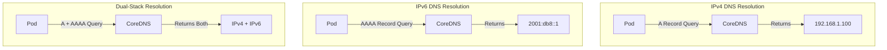

# How to Configure CoreDNS for IPv6 DNS Resolution in Kubernetes

Author: [nawazdhandala](https://www.github.com/nawazdhandala)

Tags: IPv6, Kubernetes, CoreDNS, DNS, Networking, DevOps

Description: A comprehensive guide to configuring CoreDNS for IPv6 DNS resolution in Kubernetes clusters, covering dual-stack setups, AAAA record handling, and troubleshooting common issues.

---

IPv6 adoption in Kubernetes is accelerating. With IPv4 address exhaustion becoming a real concern and cloud providers increasingly supporting dual-stack networking, understanding how to configure CoreDNS for IPv6 is no longer optional. This guide walks you through everything from basic IPv6 DNS concepts to advanced CoreDNS configurations.

## Understanding IPv6 DNS in Kubernetes

Before diving into configuration, let's understand how DNS works differently with IPv6.



### Key Differences Between IPv4 and IPv6 DNS

| Aspect | IPv4 | IPv6 |
|--------|------|------|
| Record Type | A Record | AAAA Record |
| Address Format | 32-bit (e.g., 192.168.1.1) | 128-bit (e.g., 2001:db8::1) |
| Reverse DNS | in-addr.arpa | ip6.arpa |
| Address Size | 4 bytes | 16 bytes |
| PTR Record Format | 1.168.192.in-addr.arpa | 1.0.0.0.8.b.d.0.1.0.0.2.ip6.arpa |

### Prerequisites

Before configuring IPv6 DNS, ensure your cluster supports it:

```bash
# Check if your cluster is running dual-stack
kubectl get nodes -o jsonpath='{.items[*].status.addresses}' | jq .

# Verify CoreDNS is running
kubectl get pods -n kube-system -l k8s-app=kube-dns

# Check CoreDNS version (IPv6 support improved significantly in 1.8+)
kubectl get deployment coredns -n kube-system -o jsonpath='{.spec.template.spec.containers[0].image}'
```

## Enabling Dual-Stack in Your Kubernetes Cluster

First, your cluster must support dual-stack networking. Here's how to verify and enable it.

### Check Current Cluster Configuration

```bash
# Check kube-apiserver flags for dual-stack support
kubectl get pods -n kube-system -l component=kube-apiserver -o yaml | grep -A5 "command:"

# Verify service CIDR includes IPv6
kubectl cluster-info dump | grep -i "service-cluster-ip-range"

# Check pod CIDR for IPv6
kubectl cluster-info dump | grep -i "cluster-cidr"
```

### kubeadm Configuration for Dual-Stack

If you're setting up a new cluster with kubeadm, use this configuration:

```yaml
# kubeadm-config.yaml
# This configuration enables dual-stack networking for both pods and services
apiVersion: kubeadm.k8s.io/v1beta3
kind: ClusterConfiguration
networking:
  # Define both IPv4 and IPv6 pod network CIDRs
  # The first CIDR determines the primary IP family
  podSubnet: "10.244.0.0/16,fd00:10:244::/56"
  # Service network CIDRs for both IP families
  serviceSubnet: "10.96.0.0/16,fd00:10:96::/112"
---
apiVersion: kubeadm.k8s.io/v1beta3
kind: InitConfiguration
nodeRegistration:
  kubeletExtraArgs:
    # Enable dual-stack feature gate (default in K8s 1.23+)
    feature-gates: "IPv6DualStack=true"
```

### Verify Dual-Stack Services

```bash
# Create a dual-stack service to verify configuration
kubectl apply -f - <<EOF
apiVersion: v1
kind: Service
metadata:
  name: dual-stack-test
  namespace: default
spec:
  # ipFamilyPolicy determines how IP families are assigned
  # RequireDualStack: Service must have both IPv4 and IPv6 addresses
  ipFamilyPolicy: RequireDualStack
  # Order determines preference - IPv6 first in this case
  ipFamilies:
    - IPv6
    - IPv4
  selector:
    app: test
  ports:
    - port: 80
      targetPort: 8080
EOF

# Check the assigned IPs
kubectl get svc dual-stack-test -o jsonpath='{.spec.clusterIPs}'
```

## CoreDNS Configuration Deep Dive

CoreDNS in Kubernetes is configured via a ConfigMap. Let's explore the default configuration and how to extend it for IPv6.

### View Current CoreDNS Configuration

```bash
# Get the current CoreDNS ConfigMap
kubectl get configmap coredns -n kube-system -o yaml
```

### Default Corefile Structure

```yaml
# coredns-configmap.yaml
# This is the default CoreDNS configuration with annotations explaining each block
apiVersion: v1
kind: ConfigMap
metadata:
  name: coredns
  namespace: kube-system
data:
  Corefile: |
    # Root zone configuration - handles all DNS queries by default
    .:53 {
        # errors: Log errors to stdout
        errors

        # health: Exposes health check endpoint on port 8080
        # lameduck ensures graceful shutdown over 5 seconds
        health {
           lameduck 5s
        }

        # ready: Exposes readiness endpoint on port 8181
        ready

        # kubernetes: Plugin for cluster DNS resolution
        # Handles DNS for pods and services in the cluster
        kubernetes cluster.local in-addr.arpa ip6.arpa {
           # pods insecure: Enable pod DNS records (A/AAAA)
           pods insecure
           # fallthrough: Pass unresolved queries to next plugin
           fallthrough in-addr.arpa ip6.arpa
           # ttl: Time-to-live for DNS responses (30 seconds)
           ttl 30
        }

        # prometheus: Expose metrics on port 9153
        prometheus :9153

        # forward: Forward non-cluster queries to upstream DNS
        # /etc/resolv.conf contains the node's DNS servers
        forward . /etc/resolv.conf {
           # max_concurrent: Limit concurrent upstream queries
           max_concurrent 1000
        }

        # cache: Cache DNS responses for performance
        # 30 second cache TTL
        cache 30

        # loop: Detect and break DNS forwarding loops
        loop

        # reload: Automatically reload Corefile on changes
        reload

        # loadbalance: Round-robin DNS responses
        loadbalance
    }
```

## Configuring CoreDNS for IPv6-Only Resolution

For environments that require IPv6-only DNS resolution:

```yaml
# coredns-ipv6-only.yaml
# Configuration optimized for IPv6-only Kubernetes clusters
apiVersion: v1
kind: ConfigMap
metadata:
  name: coredns
  namespace: kube-system
data:
  Corefile: |
    .:53 {
        errors
        health {
           lameduck 5s
        }
        ready

        # kubernetes plugin configuration for IPv6
        kubernetes cluster.local ip6.arpa {
           # pods verified: More secure pod DNS, verifies pod existence
           pods verified
           # endpoint_pod_names: Use pod names in endpoint DNS
           endpoint_pod_names
           # fallthrough: Continue to next plugin for reverse DNS
           fallthrough ip6.arpa
           ttl 30
        }

        prometheus :9153

        # forward to IPv6 DNS servers only
        # Using Google and Cloudflare IPv6 DNS
        forward . 2001:4860:4860::8888 2001:4860:4860::8844 2606:4700:4700::1111 {
           max_concurrent 1000
           # prefer_udp: Use UDP for better performance
           prefer_udp
        }

        cache 30
        loop
        reload
        loadbalance
    }
```

### Apply IPv6-Only Configuration

```bash
# Backup current configuration
kubectl get configmap coredns -n kube-system -o yaml > coredns-backup.yaml

# Apply new configuration
kubectl apply -f coredns-ipv6-only.yaml

# Restart CoreDNS to pick up changes
kubectl rollout restart deployment coredns -n kube-system

# Verify rollout completed
kubectl rollout status deployment coredns -n kube-system
```

## Configuring CoreDNS for Dual-Stack Resolution

Most production environments need both IPv4 and IPv6. Here's a comprehensive dual-stack configuration:

```yaml
# coredns-dual-stack.yaml
# Full dual-stack CoreDNS configuration with advanced features
apiVersion: v1
kind: ConfigMap
metadata:
  name: coredns
  namespace: kube-system
data:
  Corefile: |
    # Main cluster zone handling both IP families
    .:53 {
        # Enable error logging with full details
        errors

        # Health endpoint with graceful shutdown
        health {
           lameduck 5s
        }

        # Readiness probe endpoint
        ready

        # Log DNS queries for debugging (disable in production for performance)
        # log

        # Kubernetes DNS plugin - the heart of cluster DNS
        kubernetes cluster.local in-addr.arpa ip6.arpa {
           # pods insecure: Allow A/AAAA records for pods
           # Options: disabled, insecure, verified
           pods insecure

           # endpoint_pod_names: Include pod names in endpoint DNS records
           # Useful for headless services
           endpoint_pod_names

           # fallthrough: Pass reverse lookup queries to next plugin
           # Essential for proper PTR record resolution
           fallthrough in-addr.arpa ip6.arpa

           # ttl: DNS record time-to-live
           # Lower values = faster updates, higher DNS load
           ttl 30
        }

        # Prometheus metrics endpoint
        prometheus :9153

        # Forward external queries to dual-stack upstream DNS
        # Order matters: first responding server wins
        forward . 8.8.8.8 8.8.4.4 2001:4860:4860::8888 2001:4860:4860::8844 {
           # max_concurrent: Prevent overwhelming upstream DNS
           max_concurrent 1000
           # health_check: Periodically check upstream server health
           health_check 5s
           # prefer_udp: Prefer UDP over TCP for better latency
           prefer_udp
        }

        # Cache with separate TTL settings
        cache {
           # success: Cache successful responses for 30 seconds
           success 9984 30
           # denial: Cache NXDOMAIN responses for 5 seconds
           denial 9984 5
        }

        # Detect forwarding loops
        loop

        # Auto-reload configuration
        reload

        # Round-robin load balancing for DNS responses
        loadbalance round_robin
    }
```

## Advanced CoreDNS Plugins for IPv6

### DNS64 - NAT64 Translation Support

DNS64 synthesizes AAAA records from A records for IPv6-only clients that need to reach IPv4-only servers.

```yaml
# coredns-dns64.yaml
# Configuration for DNS64 to enable IPv6-only pods to reach IPv4 services
apiVersion: v1
kind: ConfigMap
metadata:
  name: coredns
  namespace: kube-system
data:
  Corefile: |
    .:53 {
        errors
        health {
           lameduck 5s
        }
        ready

        kubernetes cluster.local in-addr.arpa ip6.arpa {
           pods insecure
           fallthrough in-addr.arpa ip6.arpa
           ttl 30
        }

        # dns64: Synthesize AAAA records for IPv4-only destinations
        # This enables IPv6-only pods to communicate with IPv4 services
        # The prefix must match your NAT64 gateway configuration
        dns64 {
           # NAT64 well-known prefix (RFC 6052)
           # 64:ff9b::/96 is the standard prefix
           prefix 64:ff9b::/96

           # translate_all: Synthesize AAAA even if real AAAA exists
           # Useful when native IPv6 path is unreliable
           # translate_all
        }

        prometheus :9153

        # Forward to upstream DNS servers
        forward . /etc/resolv.conf {
           max_concurrent 1000
        }

        cache 30
        loop
        reload
        loadbalance
    }
```

### Custom Zone for IPv6 PTR Records

```yaml
# coredns-custom-zone.yaml
# Add custom reverse DNS zones for your IPv6 allocations
apiVersion: v1
kind: ConfigMap
metadata:
  name: coredns
  namespace: kube-system
data:
  Corefile: |
    # Custom reverse DNS zone for internal IPv6 addresses
    # This handles PTR queries for 2001:db8::/32 prefix
    8.b.d.0.1.0.0.2.ip6.arpa:53 {
        errors

        # file: Serve records from a zone file
        file /etc/coredns/db.2001.db8.ip6.arpa

        # log queries for debugging
        log

        cache 30
    }

    # Main zone configuration
    .:53 {
        errors
        health {
           lameduck 5s
        }
        ready

        kubernetes cluster.local in-addr.arpa ip6.arpa {
           pods insecure
           fallthrough in-addr.arpa ip6.arpa
           ttl 30
        }

        prometheus :9153

        forward . /etc/resolv.conf {
           max_concurrent 1000
        }

        cache 30
        loop
        reload
        loadbalance
    }

  # Zone file for custom IPv6 reverse DNS
  db.2001.db8.ip6.arpa: |
    ; Zone file for 2001:db8::/32 reverse DNS
    ; SOA record defines zone authority
    $ORIGIN 8.b.d.0.1.0.0.2.ip6.arpa.
    $TTL 3600
    @   IN  SOA ns1.example.com. admin.example.com. (
                2026011501  ; Serial (YYYYMMDDNN format)
                3600        ; Refresh (1 hour)
                600         ; Retry (10 minutes)
                604800      ; Expire (1 week)
                3600        ; Minimum TTL (1 hour)
            )
        IN  NS  ns1.example.com.

    ; PTR records for specific IPv6 addresses
    ; 2001:db8::1 -> host1.example.com
    1.0.0.0.0.0.0.0.0.0.0.0.0.0.0.0.0.0.0.0.0.0.0.0   IN  PTR host1.example.com.
    ; 2001:db8::2 -> host2.example.com
    2.0.0.0.0.0.0.0.0.0.0.0.0.0.0.0.0.0.0.0.0.0.0.0   IN  PTR host2.example.com.
```

## Configuring Upstream DNS for IPv6

### Using Multiple Upstream DNS Servers

```yaml
# coredns-upstream-ipv6.yaml
# Configuration with robust upstream DNS handling
apiVersion: v1
kind: ConfigMap
metadata:
  name: coredns
  namespace: kube-system
data:
  Corefile: |
    .:53 {
        errors
        health {
           lameduck 5s
        }
        ready

        kubernetes cluster.local in-addr.arpa ip6.arpa {
           pods insecure
           fallthrough in-addr.arpa ip6.arpa
           ttl 30
        }

        prometheus :9153

        # Primary upstream: Cloudflare DNS (IPv4 and IPv6)
        # Known for fast response times and privacy focus
        forward . 1.1.1.1 1.0.0.1 2606:4700:4700::1111 2606:4700:4700::1001 {
           max_concurrent 1000
           # health_check: Remove unhealthy servers from rotation
           health_check 5s
           # expire: Time before marking server as down
           expire 10s
           # policy: Server selection strategy
           # Options: random, round_robin, sequential
           policy round_robin
           prefer_udp
        }

        # Alternative: Forward specific domains to different DNS
        # Useful for split-horizon DNS or internal domains
        # forward internal.company.com 10.0.0.53 fd00::53

        cache 30
        loop
        reload
        loadbalance
    }
```

### Split-Horizon DNS Configuration

```yaml
# coredns-split-horizon.yaml
# Route different domains to different DNS servers
apiVersion: v1
kind: ConfigMap
metadata:
  name: coredns
  namespace: kube-system
data:
  Corefile: |
    # Internal corporate domain - forward to internal DNS
    corp.internal:53 {
        errors
        log

        # Forward to internal IPv6 DNS servers
        forward . fd00:10:0:1::53 fd00:10:0:2::53 {
           max_concurrent 500
           health_check 10s
           policy sequential
        }

        cache 60
    }

    # Cloud provider metadata service
    # Some clouds use IPv6 for metadata
    metadata.cloud.internal:53 {
        errors

        # Hosts plugin for static entries
        hosts {
           # Map metadata hostname to link-local address
           fe80::1 metadata.cloud.internal
           fallthrough
        }

        cache 300
    }

    # Default zone - handles everything else
    .:53 {
        errors
        health {
           lameduck 5s
        }
        ready

        kubernetes cluster.local in-addr.arpa ip6.arpa {
           pods insecure
           fallthrough in-addr.arpa ip6.arpa
           ttl 30
        }

        prometheus :9153

        # External DNS with both IP families
        forward . 8.8.8.8 2001:4860:4860::8888 {
           max_concurrent 1000
           health_check 5s
           prefer_udp
        }

        cache 30
        loop
        reload
        loadbalance
    }
```

## CoreDNS Performance Tuning for IPv6

### Resource Configuration

```yaml
# coredns-deployment.yaml
# Optimized CoreDNS deployment for high-traffic IPv6 environments
apiVersion: apps/v1
kind: Deployment
metadata:
  name: coredns
  namespace: kube-system
  labels:
    k8s-app: kube-dns
spec:
  # replicas: Scale based on cluster size
  # Rule of thumb: 1 replica per 1000 pods, minimum 2
  replicas: 3
  strategy:
    type: RollingUpdate
    rollingUpdate:
      # maxUnavailable: Ensure DNS availability during updates
      maxUnavailable: 1
      maxSurge: 1
  selector:
    matchLabels:
      k8s-app: kube-dns
  template:
    metadata:
      labels:
        k8s-app: kube-dns
    spec:
      # priorityClassName: Ensure CoreDNS gets scheduled
      priorityClassName: system-cluster-critical
      serviceAccountName: coredns
      # dnsPolicy: CoreDNS must use node DNS, not itself
      dnsPolicy: Default
      # tolerations: Run on control plane nodes if needed
      tolerations:
        - key: "CriticalAddonsOnly"
          operator: "Exists"
        - key: "node-role.kubernetes.io/control-plane"
          operator: "Exists"
          effect: "NoSchedule"
      # affinity: Spread across nodes for HA
      affinity:
        podAntiAffinity:
          preferredDuringSchedulingIgnoredDuringExecution:
            - weight: 100
              podAffinityTerm:
                labelSelector:
                  matchLabels:
                    k8s-app: kube-dns
                topologyKey: kubernetes.io/hostname
      containers:
        - name: coredns
          image: coredns/coredns:1.11.1
          imagePullPolicy: IfNotPresent
          # resources: Size appropriately for your cluster
          resources:
            limits:
              # memory: 256Mi handles ~20k pods
              memory: 256Mi
              cpu: 200m
            requests:
              memory: 70Mi
              cpu: 100m
          args: ["-conf", "/etc/coredns/Corefile"]
          volumeMounts:
            - name: config-volume
              mountPath: /etc/coredns
              readOnly: true
          ports:
            - containerPort: 53
              name: dns
              protocol: UDP
            - containerPort: 53
              name: dns-tcp
              protocol: TCP
            - containerPort: 9153
              name: metrics
              protocol: TCP
          # securityContext: Run with minimal privileges
          securityContext:
            allowPrivilegeEscalation: false
            capabilities:
              add:
                - NET_BIND_SERVICE
              drop:
                - all
            readOnlyRootFilesystem: true
          # livenessProbe: Restart unhealthy pods
          livenessProbe:
            httpGet:
              path: /health
              port: 8080
              scheme: HTTP
            initialDelaySeconds: 60
            periodSeconds: 10
            timeoutSeconds: 5
            failureThreshold: 5
          # readinessProbe: Remove from service when not ready
          readinessProbe:
            httpGet:
              path: /ready
              port: 8181
              scheme: HTTP
            initialDelaySeconds: 10
            periodSeconds: 5
            timeoutSeconds: 3
            failureThreshold: 3
      volumes:
        - name: config-volume
          configMap:
            name: coredns
            items:
              - key: Corefile
                path: Corefile
```

### CoreDNS Service for Dual-Stack

```yaml
# coredns-service.yaml
# Dual-stack service configuration for CoreDNS
apiVersion: v1
kind: Service
metadata:
  name: kube-dns
  namespace: kube-system
  labels:
    k8s-app: kube-dns
  annotations:
    prometheus.io/scrape: "true"
    prometheus.io/port: "9153"
spec:
  # ipFamilyPolicy: Support both IPv4 and IPv6 clients
  ipFamilyPolicy: PreferDualStack
  ipFamilies:
    - IPv4
    - IPv6
  selector:
    k8s-app: kube-dns
  # clusterIP: Must match kubelet's --cluster-dns setting
  # clusterIP: 10.96.0.10
  ports:
    - name: dns
      port: 53
      targetPort: 53
      protocol: UDP
    - name: dns-tcp
      port: 53
      targetPort: 53
      protocol: TCP
    - name: metrics
      port: 9153
      targetPort: 9153
      protocol: TCP
```

## Testing IPv6 DNS Resolution

### Create Test Pods

```bash
# Create a test namespace
kubectl create namespace dns-test

# Deploy a dual-stack test pod with DNS tools
kubectl apply -f - <<EOF
apiVersion: v1
kind: Pod
metadata:
  name: dns-test-pod
  namespace: dns-test
spec:
  containers:
    - name: dnsutils
      image: registry.k8s.io/e2e-test-images/jessie-dnsutils:1.5
      command:
        - sleep
        - "infinity"
      resources:
        limits:
          memory: "64Mi"
          cpu: "100m"
EOF

# Wait for pod to be ready
kubectl wait --for=condition=Ready pod/dns-test-pod -n dns-test --timeout=60s
```

### Test DNS Resolution Commands

```bash
# Test A record resolution (IPv4)
kubectl exec -n dns-test dns-test-pod -- nslookup -type=A kubernetes.default.svc.cluster.local

# Test AAAA record resolution (IPv6)
kubectl exec -n dns-test dns-test-pod -- nslookup -type=AAAA kubernetes.default.svc.cluster.local

# Test external domain A record
kubectl exec -n dns-test dns-test-pod -- nslookup -type=A google.com

# Test external domain AAAA record
kubectl exec -n dns-test dns-test-pod -- nslookup -type=AAAA google.com

# Test reverse DNS (PTR) for IPv6
kubectl exec -n dns-test dns-test-pod -- nslookup -type=PTR 1.0.0.0.0.0.0.0.0.0.0.0.0.0.0.0.0.0.0.0.0.0.0.0.8.8.8.8.8.8.b.d.0.1.0.0.2.ip6.arpa

# Use dig for more detailed output
kubectl exec -n dns-test dns-test-pod -- dig AAAA kubernetes.default.svc.cluster.local @10.96.0.10
```

### Comprehensive DNS Test Script

```bash
#!/bin/bash
# dns-test.sh - Comprehensive DNS testing script for dual-stack Kubernetes

NAMESPACE="${1:-dns-test}"
POD_NAME="${2:-dns-test-pod}"
DNS_SERVER="${3:-10.96.0.10}"

echo "========================================"
echo "DNS Test Suite for Dual-Stack Kubernetes"
echo "========================================"
echo "Namespace: $NAMESPACE"
echo "Pod: $POD_NAME"
echo "DNS Server: $DNS_SERVER"
echo ""

# Function to run DNS tests
run_test() {
    local description="$1"
    local command="$2"
    echo "----------------------------------------"
    echo "Test: $description"
    echo "Command: $command"
    echo "----------------------------------------"
    kubectl exec -n "$NAMESPACE" "$POD_NAME" -- $command 2>&1
    echo ""
}

# Test 1: Check /etc/resolv.conf
run_test "Check resolv.conf" "cat /etc/resolv.conf"

# Test 2: IPv4 service resolution
run_test "IPv4 Service Resolution (kubernetes)" \
    "dig +short A kubernetes.default.svc.cluster.local @$DNS_SERVER"

# Test 3: IPv6 service resolution
run_test "IPv6 Service Resolution (kubernetes)" \
    "dig +short AAAA kubernetes.default.svc.cluster.local @$DNS_SERVER"

# Test 4: External IPv4 resolution
run_test "External IPv4 Resolution (google.com)" \
    "dig +short A google.com @$DNS_SERVER"

# Test 5: External IPv6 resolution
run_test "External IPv6 Resolution (google.com)" \
    "dig +short AAAA google.com @$DNS_SERVER"

# Test 6: DNS response time
run_test "DNS Response Time Test" \
    "dig +stats kubernetes.default.svc.cluster.local @$DNS_SERVER | grep 'Query time'"

# Test 7: Check for SERVFAIL or NXDOMAIN errors
run_test "Error Check (should return NOERROR)" \
    "dig kubernetes.default.svc.cluster.local @$DNS_SERVER | grep -E 'status:'"

# Test 8: Verify CoreDNS is responding
run_test "CoreDNS Health Check" \
    "dig +short chaos.bind txt version.bind @$DNS_SERVER"

echo "========================================"
echo "DNS Test Suite Complete"
echo "========================================"
```

## Monitoring CoreDNS IPv6 Performance

### Prometheus Metrics to Monitor

```yaml
# prometheus-rules.yaml
# Alert rules for CoreDNS IPv6 monitoring
apiVersion: monitoring.coreos.com/v1
kind: PrometheusRule
metadata:
  name: coredns-alerts
  namespace: monitoring
spec:
  groups:
    - name: coredns.rules
      rules:
        # Alert: High DNS query latency
        - alert: CoreDNSHighLatency
          expr: |
            histogram_quantile(0.99, sum(rate(coredns_dns_request_duration_seconds_bucket[5m])) by (le)) > 0.1
          for: 5m
          labels:
            severity: warning
          annotations:
            summary: "CoreDNS query latency is high"
            description: "99th percentile DNS query latency is {{ $value }}s"

        # Alert: High DNS error rate
        - alert: CoreDNSHighErrorRate
          expr: |
            sum(rate(coredns_dns_responses_total{rcode=~"SERVFAIL|REFUSED"}[5m])) /
            sum(rate(coredns_dns_responses_total[5m])) > 0.01
          for: 5m
          labels:
            severity: critical
          annotations:
            summary: "CoreDNS error rate is high"
            description: "DNS error rate is {{ $value | humanizePercentage }}"

        # Alert: CoreDNS pod down
        - alert: CoreDNSDown
          expr: |
            absent(up{job="coredns"} == 1)
          for: 2m
          labels:
            severity: critical
          annotations:
            summary: "CoreDNS is down"
            description: "CoreDNS has been down for more than 2 minutes"

        # Alert: AAAA query failures
        - alert: CoreDNSIPv6ResolutionFailing
          expr: |
            sum(rate(coredns_dns_responses_total{qtype="AAAA",rcode!="NOERROR"}[5m])) /
            sum(rate(coredns_dns_responses_total{qtype="AAAA"}[5m])) > 0.1
          for: 5m
          labels:
            severity: warning
          annotations:
            summary: "IPv6 DNS resolution has high failure rate"
            description: "AAAA query failure rate is {{ $value | humanizePercentage }}"
```

### Grafana Dashboard Queries

```promql
# Total DNS queries by type (A vs AAAA)
sum(rate(coredns_dns_requests_total[5m])) by (type)

# IPv6 (AAAA) query rate
sum(rate(coredns_dns_requests_total{type="AAAA"}[5m]))

# DNS response codes distribution
sum(rate(coredns_dns_responses_total[5m])) by (rcode)

# Cache hit ratio
sum(rate(coredns_cache_hits_total[5m])) /
(sum(rate(coredns_cache_hits_total[5m])) + sum(rate(coredns_cache_misses_total[5m])))

# Forward request latency by upstream server
histogram_quantile(0.95, sum(rate(coredns_forward_request_duration_seconds_bucket[5m])) by (le, to))

# IPv6 upstream server health
coredns_forward_healthcheck_broken_total{to=~".*:.*:.*"}
```

## Troubleshooting IPv6 DNS Issues

### Common Problems and Solutions

#### Problem 1: AAAA Queries Returning Empty

```bash
# Check if upstream DNS supports IPv6
kubectl exec -n dns-test dns-test-pod -- dig AAAA google.com @8.8.8.8

# Verify CoreDNS can reach IPv6 upstream
kubectl exec -n kube-system $(kubectl get pods -n kube-system -l k8s-app=kube-dns -o jsonpath='{.items[0].metadata.name}') -- nslookup -type=AAAA google.com 2001:4860:4860::8888

# Check CoreDNS logs for errors
kubectl logs -n kube-system -l k8s-app=kube-dns --tail=100 | grep -i "AAAA\|IPv6\|error"
```

#### Problem 2: Services Not Resolving to IPv6 Address

```bash
# Verify service has IPv6 ClusterIP
kubectl get svc -o wide --all-namespaces | grep -v "None"

# Check if service is dual-stack
kubectl get svc <service-name> -o jsonpath='{.spec.clusterIPs}'

# Verify kube-dns service has IPv6
kubectl get svc kube-dns -n kube-system -o jsonpath='{.spec.clusterIPs}'
```

#### Problem 3: Reverse DNS (PTR) Not Working

```bash
# Verify PTR zone is configured in CoreDNS
kubectl get configmap coredns -n kube-system -o yaml | grep ip6.arpa

# Test PTR resolution manually
# Convert IPv6 address to PTR format and query
kubectl exec -n dns-test dns-test-pod -- dig -x 2001:db8::1

# Check CoreDNS logs for PTR queries
kubectl logs -n kube-system -l k8s-app=kube-dns | grep PTR
```

#### Problem 4: DNS64 Not Synthesizing Records

```bash
# Verify dns64 plugin is loaded
kubectl get configmap coredns -n kube-system -o yaml | grep dns64

# Test DNS64 synthesis
# Query for IPv4-only domain
kubectl exec -n dns-test dns-test-pod -- dig AAAA ipv4only.arpa @10.96.0.10

# Expected: Synthesized AAAA record using 64:ff9b:: prefix
```

### Debug Mode CoreDNS Configuration

```yaml
# coredns-debug.yaml
# Enable detailed logging for troubleshooting
apiVersion: v1
kind: ConfigMap
metadata:
  name: coredns
  namespace: kube-system
data:
  Corefile: |
    .:53 {
        # Enable detailed logging - DISABLE IN PRODUCTION
        log . {
           class all
        }

        # Enable debug mode
        debug

        errors
        health {
           lameduck 5s
        }
        ready

        kubernetes cluster.local in-addr.arpa ip6.arpa {
           pods insecure
           fallthrough in-addr.arpa ip6.arpa
           ttl 30
        }

        prometheus :9153

        forward . /etc/resolv.conf {
           max_concurrent 1000
        }

        cache 30
        loop
        reload
        loadbalance
    }
```

### Network Debugging Commands

```bash
# Check pod's IPv6 connectivity
kubectl exec -n dns-test dns-test-pod -- ping6 -c 3 2001:4860:4860::8888

# Verify DNS server reachability over IPv6
kubectl exec -n dns-test dns-test-pod -- nc -zvu 2001:4860:4860::8888 53

# Check iptables/ip6tables rules for DNS
kubectl exec -n kube-system $(kubectl get pods -n kube-system -l k8s-app=kube-dns -o jsonpath='{.items[0].metadata.name}') -- ip6tables -L -n -v

# Verify IPv6 routing in pod
kubectl exec -n dns-test dns-test-pod -- ip -6 route

# Check IPv6 address assignment
kubectl exec -n dns-test dns-test-pod -- ip -6 addr
```

## Security Considerations for IPv6 DNS

### Restrict DNS Traffic with Network Policies

```yaml
# dns-network-policy.yaml
# Secure DNS traffic in a dual-stack cluster
apiVersion: networking.k8s.io/v1
kind: NetworkPolicy
metadata:
  name: allow-dns-egress
  namespace: production
spec:
  podSelector: {}
  policyTypes:
    - Egress
  egress:
    # Allow DNS to CoreDNS (kube-system namespace)
    - to:
        - namespaceSelector:
            matchLabels:
              kubernetes.io/metadata.name: kube-system
          podSelector:
            matchLabels:
              k8s-app: kube-dns
      ports:
        # UDP DNS - most queries
        - protocol: UDP
          port: 53
        # TCP DNS - large responses, zone transfers
        - protocol: TCP
          port: 53
    # Allow DNS over TLS to external resolvers (optional)
    - to:
        - ipBlock:
            # Cloudflare DNS over TLS
            cidr: 2606:4700:4700::1111/128
        - ipBlock:
            cidr: 2606:4700:4700::1001/128
      ports:
        - protocol: TCP
          port: 853
```

### DNSSEC Configuration

```yaml
# coredns-dnssec.yaml
# Enable DNSSEC validation for secure DNS resolution
apiVersion: v1
kind: ConfigMap
metadata:
  name: coredns
  namespace: kube-system
data:
  Corefile: |
    .:53 {
        errors
        health {
           lameduck 5s
        }
        ready

        kubernetes cluster.local in-addr.arpa ip6.arpa {
           pods insecure
           fallthrough in-addr.arpa ip6.arpa
           ttl 30
        }

        prometheus :9153

        # dnssec: Enable DNSSEC validation
        # Only enable if your upstream DNS supports DNSSEC
        dnssec {
           # Trust anchors for root zone
           # Updated periodically - check IANA for current values
        }

        # Forward to DNSSEC-validating resolvers
        forward . 9.9.9.9 149.112.112.112 2620:fe::fe 2620:fe::9 {
           max_concurrent 1000
           health_check 5s
           prefer_udp
        }

        cache 30
        loop
        reload
        loadbalance
    }
```

## Best Practices Summary Table

| Category | Best Practice | Why It Matters |
|----------|--------------|----------------|
| **Configuration** | Use `pods verified` instead of `pods insecure` | Prevents DNS spoofing within cluster |
| **High Availability** | Deploy at least 2 CoreDNS replicas | Ensures DNS survives pod failures |
| **Performance** | Set appropriate cache TTLs (30-60s) | Reduces upstream DNS load |
| **IPv6 Upstream** | Configure both IPv4 and IPv6 DNS servers | Resilience if one IP family fails |
| **Monitoring** | Alert on AAAA query failures | Catch IPv6 issues early |
| **Security** | Use Network Policies for DNS egress | Prevent DNS exfiltration |
| **Troubleshooting** | Keep debug config ready but disabled | Quick enable for incident response |
| **Dual-Stack** | Test both A and AAAA resolution | Ensure full dual-stack functionality |
| **DNS64** | Configure if running IPv6-only pods | Enable IPv4 connectivity for IPv6 pods |
| **PTR Records** | Include `ip6.arpa` in fallthrough | Proper reverse DNS for IPv6 |
| **Resources** | Scale CoreDNS with cluster size | 1 replica per 1000 pods minimum |
| **Updates** | Use rolling updates for CoreDNS | Zero-downtime DNS updates |

## Quick Reference: CoreDNS IPv6 Commands

```bash
# View CoreDNS configuration
kubectl get configmap coredns -n kube-system -o yaml

# Edit CoreDNS configuration
kubectl edit configmap coredns -n kube-system

# Restart CoreDNS to apply changes
kubectl rollout restart deployment coredns -n kube-system

# Check CoreDNS pod status
kubectl get pods -n kube-system -l k8s-app=kube-dns -o wide

# View CoreDNS logs
kubectl logs -n kube-system -l k8s-app=kube-dns -f

# Test AAAA resolution from inside cluster
kubectl run test-dns --rm -it --image=busybox --restart=Never -- nslookup -type=AAAA google.com

# Check CoreDNS metrics
kubectl port-forward -n kube-system svc/kube-dns 9153:9153 &
curl http://localhost:9153/metrics | grep coredns_dns

# Verify dual-stack service IPs
kubectl get svc -A -o custom-columns='NAME:.metadata.name,IPv4:.spec.clusterIP,IPs:.spec.clusterIPs'
```

---

Configuring CoreDNS for IPv6 in Kubernetes is essential as the internet transitions to dual-stack networking. Start with a solid dual-stack configuration, monitor your AAAA query success rates, and always test both IP families before declaring victory. The commands and configurations in this guide should handle most production scenarios, from simple dual-stack setups to complex DNS64 deployments.
