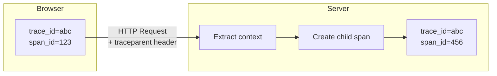

# How to Correlate Frontend Traces with Backend Traces in React

Author: [nawazdhandala](https://github.com/nawazdhandala)

Tags: React, OpenTelemetry, Distributed Tracing, Frontend, Backend, Observability

Description: A complete guide to correlating frontend and backend traces in React applications using OpenTelemetry, enabling end-to-end visibility across your entire stack.

---

> You can trace every database query on the backend. You can capture every click on the frontend. But if you cannot connect them, you are still debugging in the dark.

Modern web applications span multiple layers: browser, CDN, API gateway, microservices, databases. When a user reports "the page is slow," the question is always: where? Frontend rendering? Network latency? Backend processing? Database queries?

The answer lies in **trace correlation** - connecting the dots between what happens in the browser and what happens on your servers. This guide walks through implementing end-to-end distributed tracing in React applications using OpenTelemetry, with practical patterns you can apply immediately.

---

## Table of Contents

1. Why Frontend-Backend Trace Correlation Matters
2. The Trace Propagation Challenge
3. Setting Up OpenTelemetry in React
4. Instrumenting Fetch and Axios Requests
5. Context Propagation: W3C Trace Context
6. Backend Extraction of Trace Context
7. Correlating User Interactions with API Calls
8. Page Load and Navigation Tracing
9. Error Correlation Across the Stack
10. React Component-Level Tracing
11. Performance Optimization with Sampling
12. Real-World Correlation Patterns
13. Debugging with Correlated Traces
14. Common Pitfalls and Solutions
15. Summary and Best Practices

---

## 1. Why Frontend-Backend Trace Correlation Matters

Without correlation, you have two separate stories:

**Frontend view**: "User clicked checkout at 10:42:15, page rendered in 3.2 seconds"

**Backend view**: "POST /api/checkout took 450ms at 10:42:16"

With correlation, you have one complete story:

**Correlated view**: "User clicked checkout, triggering a request that spent 2.7s waiting for network, 450ms on the server (200ms in payment service, 180ms in inventory service, 70ms in database), and 50ms rendering the response"

This visibility enables:

- **Root cause analysis**: Pinpoint whether slowness is frontend, network, or backend
- **User journey debugging**: See exactly what happened for a specific user session
- **SLA attribution**: Know which service is responsible for SLA breaches
- **Performance budgeting**: Allocate time budgets across the stack

---

## 2. The Trace Propagation Challenge

Distributed tracing works by passing a **trace context** through every hop in a request's journey. The context contains:

| Field | Purpose |
|-------|---------|
| `trace_id` | Unique identifier for the entire transaction |
| `span_id` | Identifier for the current operation |
| `trace_flags` | Sampling decision (sampled or not) |
| `trace_state` | Vendor-specific metadata |

The challenge: HTTP requests cross a trust boundary between browser and server. The frontend must inject context into outgoing requests, and the backend must extract and continue it.



Without proper propagation, traces break at the browser-server boundary, leaving you with disconnected fragments.

---

## 3. Setting Up OpenTelemetry in React

### Installation

```bash
npm install @opentelemetry/api \
  @opentelemetry/sdk-trace-web \
  @opentelemetry/sdk-trace-base \
  @opentelemetry/resources \
  @opentelemetry/semantic-conventions \
  @opentelemetry/context-zone \
  @opentelemetry/instrumentation-fetch \
  @opentelemetry/instrumentation-xml-http-request \
  @opentelemetry/exporter-trace-otlp-http \
  @opentelemetry/instrumentation
```

### Basic Setup: tracing.ts

Create a tracing initialization file that loads before your React app mounts:

```typescript
// src/tracing.ts
import { WebTracerProvider } from '@opentelemetry/sdk-trace-web';
import { BatchSpanProcessor } from '@opentelemetry/sdk-trace-base';
import { OTLPTraceExporter } from '@opentelemetry/exporter-trace-otlp-http';
import { Resource } from '@opentelemetry/resources';
import { SemanticResourceAttributes } from '@opentelemetry/semantic-conventions';
import { ZoneContextManager } from '@opentelemetry/context-zone';
import { registerInstrumentations } from '@opentelemetry/instrumentation';
import { FetchInstrumentation } from '@opentelemetry/instrumentation-fetch';
import { XMLHttpRequestInstrumentation } from '@opentelemetry/instrumentation-xml-http-request';

// Define service identity
const resource = new Resource({
  [SemanticResourceAttributes.SERVICE_NAME]: 'react-frontend',
  [SemanticResourceAttributes.SERVICE_VERSION]: '1.0.0',
  [SemanticResourceAttributes.DEPLOYMENT_ENVIRONMENT]:
    process.env.NODE_ENV || 'development',
});

// Configure the trace exporter
const exporter = new OTLPTraceExporter({
  url: process.env.REACT_APP_OTLP_ENDPOINT || 'https://oneuptime.com/otlp/v1/traces',
  headers: {
    'x-oneuptime-token': process.env.REACT_APP_ONEUPTIME_TOKEN || '',
  },
});

// Create and configure the tracer provider
const provider = new WebTracerProvider({
  resource,
});

// Use batch processor for efficiency
provider.addSpanProcessor(new BatchSpanProcessor(exporter, {
  maxQueueSize: 100,
  maxExportBatchSize: 10,
  scheduledDelayMillis: 500,
}));

// Register the provider globally
provider.register({
  contextManager: new ZoneContextManager(),
});

// Register auto-instrumentations
registerInstrumentations({
  instrumentations: [
    new FetchInstrumentation({
      propagateTraceHeaderCorsUrls: [
        // Allow trace propagation to your API domains
        /https:\/\/api\.yourdomain\.com\/.*/,
        /https:\/\/.*\.yourdomain\.com\/.*/,
        new RegExp(process.env.REACT_APP_API_URL || ''),
      ],
      clearTimingResources: true,
    }),
    new XMLHttpRequestInstrumentation({
      propagateTraceHeaderCorsUrls: [
        /https:\/\/api\.yourdomain\.com\/.*/,
      ],
    }),
  ],
});

export const tracer = provider.getTracer('react-frontend');
```

### Loading Order in React

Import tracing before React initializes:

```typescript
// src/index.tsx
import './tracing'; // MUST be first import
import React from 'react';
import ReactDOM from 'react-dom/client';
import App from './App';

const root = ReactDOM.createRoot(
  document.getElementById('root') as HTMLElement
);
root.render(
  <React.StrictMode>
    <App />
  </React.StrictMode>
);
```

---

## 4. Instrumenting Fetch and Axios Requests

### Auto-Instrumented Fetch

With `FetchInstrumentation` registered, all fetch calls are automatically traced:

```typescript
// This is automatically traced
const response = await fetch('/api/users');
```

The instrumentation:
1. Creates a span for the request
2. Injects `traceparent` header
3. Records timing, status code, and errors
4. Ends the span when response completes

### Custom Axios Instrumentation

For Axios, create a traced wrapper:

```typescript
// src/lib/tracedAxios.ts
import axios, { AxiosRequestConfig, AxiosResponse } from 'axios';
import { trace, context, SpanStatusCode, propagation, SpanKind } from '@opentelemetry/api';

const tracer = trace.getTracer('axios-client');

export async function tracedRequest<T>(config: AxiosRequestConfig): Promise<AxiosResponse<T>> {
  const url = new URL(config.url || '', config.baseURL);
  const spanName = `HTTP ${config.method?.toUpperCase()} ${url.pathname}`;

  return tracer.startActiveSpan(spanName, {
    kind: SpanKind.CLIENT,
    attributes: {
      'http.method': config.method?.toUpperCase(),
      'http.url': url.toString(),
      'http.target': url.pathname,
      'net.peer.name': url.hostname,
    },
  }, async (span) => {
    try {
      // Inject trace context into headers
      const headers: Record<string, string> = { ...config.headers as Record<string, string> };
      propagation.inject(context.active(), headers);

      const response = await axios({
        ...config,
        headers,
      });

      span.setAttributes({
        'http.status_code': response.status,
        'http.response_content_length': response.headers['content-length'],
      });
      span.setStatus({ code: SpanStatusCode.OK });

      return response;
    } catch (error: any) {
      span.recordException(error);
      span.setStatus({
        code: SpanStatusCode.ERROR,
        message: error.message,
      });

      if (error.response) {
        span.setAttribute('http.status_code', error.response.status);
      }

      throw error;
    } finally {
      span.end();
    }
  });
}

// Convenience methods
export const tracedAxios = {
  get: <T>(url: string, config?: AxiosRequestConfig) =>
    tracedRequest<T>({ ...config, method: 'GET', url }),
  post: <T>(url: string, data?: any, config?: AxiosRequestConfig) =>
    tracedRequest<T>({ ...config, method: 'POST', url, data }),
  put: <T>(url: string, data?: any, config?: AxiosRequestConfig) =>
    tracedRequest<T>({ ...config, method: 'PUT', url, data }),
  delete: <T>(url: string, config?: AxiosRequestConfig) =>
    tracedRequest<T>({ ...config, method: 'DELETE', url }),
};
```

---

## 5. Context Propagation: W3C Trace Context

The W3C Trace Context specification defines two headers:

### traceparent Header

Format: `version-traceid-parentid-flags`

```
traceparent: 00-0af7651916cd43dd8448eb211c80319c-b7ad6b7169203331-01
             |  |                                |                |
             |  |                                |                +-- flags (01 = sampled)
             |  |                                +------------------- parent span id
             |  +---------------------------------------------------- trace id
             +------------------------------------------------------- version
```

### tracestate Header

Vendor-specific key-value pairs:

```
tracestate: vendor1=value1,vendor2=value2
```

### Viewing Propagated Headers

Use browser DevTools to verify headers are being sent:

```typescript
// Debug: Log outgoing trace headers
const originalFetch = window.fetch;
window.fetch = async (...args) => {
  const [url, options] = args;
  console.log('Outgoing request:', url);
  console.log('traceparent:', (options?.headers as any)?.traceparent);
  return originalFetch(...args);
};
```

---

## 6. Backend Extraction of Trace Context

### Node.js/Express Backend

```typescript
// backend/tracing.ts
import { NodeSDK } from '@opentelemetry/sdk-node';
import { getNodeAutoInstrumentations } from '@opentelemetry/auto-instrumentations-node';
import { OTLPTraceExporter } from '@opentelemetry/exporter-trace-otlp-http';
import { Resource } from '@opentelemetry/resources';
import { SemanticResourceAttributes } from '@opentelemetry/semantic-conventions';

const sdk = new NodeSDK({
  resource: new Resource({
    [SemanticResourceAttributes.SERVICE_NAME]: 'api-backend',
    [SemanticResourceAttributes.SERVICE_VERSION]: '1.0.0',
  }),
  traceExporter: new OTLPTraceExporter({
    url: process.env.OTLP_ENDPOINT || 'https://oneuptime.com/otlp/v1/traces',
    headers: { 'x-oneuptime-token': process.env.ONEUPTIME_TOKEN || '' },
  }),
  instrumentations: [getNodeAutoInstrumentations()],
});

sdk.start();
```

With auto-instrumentation, the backend automatically:
1. Extracts `traceparent` from incoming requests
2. Creates a child span with the same `trace_id`
3. Propagates context through the request lifecycle

### Manual Context Extraction

For custom scenarios:

```typescript
import { propagation, context, trace } from '@opentelemetry/api';
import express from 'express';

const app = express();

app.use((req, res, next) => {
  // Extract context from incoming headers
  const extractedContext = propagation.extract(context.active(), req.headers);

  // Run the rest of the request in this context
  context.with(extractedContext, () => {
    const span = trace.getActiveSpan();
    if (span) {
      // Add request metadata
      span.setAttributes({
        'http.client_ip': req.ip,
        'http.user_agent': req.headers['user-agent'],
      });
    }
    next();
  });
});
```

### Python/FastAPI Backend

```python
# backend/tracing.py
from opentelemetry import trace
from opentelemetry.sdk.trace import TracerProvider
from opentelemetry.sdk.trace.export import BatchSpanProcessor
from opentelemetry.exporter.otlp.proto.http.trace_exporter import OTLPSpanExporter
from opentelemetry.instrumentation.fastapi import FastAPIInstrumentor
from opentelemetry.sdk.resources import Resource, SERVICE_NAME

resource = Resource(attributes={SERVICE_NAME: "api-backend-python"})

provider = TracerProvider(resource=resource)
processor = BatchSpanProcessor(OTLPSpanExporter(
    endpoint="https://oneuptime.com/otlp/v1/traces"
))
provider.add_span_processor(processor)
trace.set_tracer_provider(provider)

# In your FastAPI app
from fastapi import FastAPI
app = FastAPI()
FastAPIInstrumentor.instrument_app(app)
```

---

## 7. Correlating User Interactions with API Calls

### Tracing User Actions

Create spans for user interactions that trigger API calls:

```typescript
// src/hooks/useTracedAction.ts
import { trace, context, SpanStatusCode } from '@opentelemetry/api';

const tracer = trace.getTracer('user-interactions');

export function useTracedAction() {
  const traceAction = async <T>(
    actionName: string,
    action: () => Promise<T>,
    attributes: Record<string, string | number | boolean> = {}
  ): Promise<T> => {
    return tracer.startActiveSpan(actionName, {
      attributes: {
        'interaction.type': 'user_action',
        ...attributes,
      },
    }, async (span) => {
      try {
        const result = await action();
        span.setStatus({ code: SpanStatusCode.OK });
        return result;
      } catch (error: any) {
        span.recordException(error);
        span.setStatus({
          code: SpanStatusCode.ERROR,
          message: error.message,
        });
        throw error;
      } finally {
        span.end();
      }
    });
  };

  return { traceAction };
}
```

### Using in Components

```typescript
// src/components/CheckoutButton.tsx
import React from 'react';
import { useTracedAction } from '../hooks/useTracedAction';
import { tracedAxios } from '../lib/tracedAxios';

interface CheckoutButtonProps {
  cartId: string;
  total: number;
}

export function CheckoutButton({ cartId, total }: CheckoutButtonProps) {
  const { traceAction } = useTracedAction();

  const handleCheckout = async () => {
    await traceAction(
      'checkout.initiated',
      async () => {
        // All these API calls will be children of checkout.initiated
        await tracedAxios.post('/api/cart/validate', { cartId });
        await tracedAxios.post('/api/payment/process', { cartId, total });
        await tracedAxios.post('/api/order/create', { cartId });
      },
      {
        'cart.id': cartId,
        'cart.total': total,
      }
    );
  };

  return (
    <button onClick={handleCheckout}>
      Complete Checkout
    </button>
  );
}
```

The resulting trace shows:

```
checkout.initiated (2.5s)
├── HTTP POST /api/cart/validate (150ms)
│   └── [backend] validate_cart (140ms)
│       └── db.query.cart.select (50ms)
├── HTTP POST /api/payment/process (1.8s)
│   └── [backend] process_payment (1.7s)
│       ├── payment_gateway.charge (1.5s)
│       └── db.query.payment.insert (100ms)
└── HTTP POST /api/order/create (400ms)
    └── [backend] create_order (380ms)
        ├── db.query.order.insert (80ms)
        └── notification.send (200ms)
```

---

## 8. Page Load and Navigation Tracing

### Tracing Initial Page Load

```typescript
// src/tracing/pageLoad.ts
import { trace, SpanStatusCode } from '@opentelemetry/api';

const tracer = trace.getTracer('page-load');

export function tracePageLoad() {
  // Use Performance API for timing data
  const [navigation] = performance.getEntriesByType('navigation') as PerformanceNavigationTiming[];

  if (!navigation) return;

  const span = tracer.startSpan('page.load', {
    startTime: navigation.startTime,
    attributes: {
      'page.url': window.location.href,
      'page.referrer': document.referrer,
      'navigation.type': navigation.type,
    },
  });

  // Add timing milestones as events
  span.addEvent('dns.lookup', { 'duration_ms': navigation.domainLookupEnd - navigation.domainLookupStart }, navigation.domainLookupEnd);
  span.addEvent('tcp.connect', { 'duration_ms': navigation.connectEnd - navigation.connectStart }, navigation.connectEnd);
  span.addEvent('request.start', {}, navigation.requestStart);
  span.addEvent('response.start', { 'ttfb_ms': navigation.responseStart - navigation.requestStart }, navigation.responseStart);
  span.addEvent('response.end', {}, navigation.responseEnd);
  span.addEvent('dom.interactive', {}, navigation.domInteractive);
  span.addEvent('dom.complete', {}, navigation.domComplete);
  span.addEvent('load.complete', {}, navigation.loadEventEnd);

  // Set overall metrics
  span.setAttributes({
    'timing.dns_ms': navigation.domainLookupEnd - navigation.domainLookupStart,
    'timing.tcp_ms': navigation.connectEnd - navigation.connectStart,
    'timing.ttfb_ms': navigation.responseStart - navigation.requestStart,
    'timing.download_ms': navigation.responseEnd - navigation.responseStart,
    'timing.dom_processing_ms': navigation.domComplete - navigation.responseEnd,
    'timing.total_ms': navigation.loadEventEnd - navigation.startTime,
  });

  span.setStatus({ code: SpanStatusCode.OK });
  span.end(navigation.loadEventEnd);
}

// Call after page load
window.addEventListener('load', () => {
  // Wait for all timing data to be available
  setTimeout(tracePageLoad, 0);
});
```

### Tracing React Router Navigation

```typescript
// src/tracing/routeTracing.tsx
import React, { useEffect, useRef } from 'react';
import { useLocation } from 'react-router-dom';
import { trace, SpanStatusCode, Span } from '@opentelemetry/api';

const tracer = trace.getTracer('router');

export function RouteTracer({ children }: { children: React.ReactNode }) {
  const location = useLocation();
  const spanRef = useRef<Span | null>(null);
  const previousLocation = useRef(location.pathname);

  useEffect(() => {
    // End previous navigation span
    if (spanRef.current) {
      spanRef.current.setStatus({ code: SpanStatusCode.OK });
      spanRef.current.end();
    }

    // Start new navigation span
    spanRef.current = tracer.startSpan('route.navigation', {
      attributes: {
        'route.from': previousLocation.current,
        'route.to': location.pathname,
        'route.search': location.search,
        'route.hash': location.hash,
      },
    });

    previousLocation.current = location.pathname;

    return () => {
      if (spanRef.current) {
        spanRef.current.end();
        spanRef.current = null;
      }
    };
  }, [location]);

  return <>{children}</>;
}

// Usage in App.tsx
import { BrowserRouter } from 'react-router-dom';
import { RouteTracer } from './tracing/routeTracing';

function App() {
  return (
    <BrowserRouter>
      <RouteTracer>
        {/* Your routes */}
      </RouteTracer>
    </BrowserRouter>
  );
}
```

---

## 9. Error Correlation Across the Stack

### Frontend Error Tracking

```typescript
// src/tracing/errorBoundary.tsx
import React, { Component, ErrorInfo } from 'react';
import { trace, SpanStatusCode, context } from '@opentelemetry/api';

const tracer = trace.getTracer('error-boundary');

interface Props {
  children: React.ReactNode;
  fallback?: React.ReactNode;
}

interface State {
  hasError: boolean;
  error?: Error;
  traceId?: string;
}

export class TracedErrorBoundary extends Component<Props, State> {
  state: State = { hasError: false };

  static getDerivedStateFromError(error: Error): Partial<State> {
    return { hasError: true, error };
  }

  componentDidCatch(error: Error, errorInfo: ErrorInfo) {
    const span = tracer.startSpan('react.error', {
      attributes: {
        'error.type': error.name,
        'error.message': error.message,
        'error.component_stack': errorInfo.componentStack || '',
      },
    });

    span.recordException(error);
    span.setStatus({
      code: SpanStatusCode.ERROR,
      message: error.message,
    });

    // Capture trace ID for error reporting
    const traceId = span.spanContext().traceId;
    this.setState({ traceId });

    // Report to backend with trace context
    this.reportError(error, errorInfo, traceId);

    span.end();
  }

  async reportError(error: Error, errorInfo: ErrorInfo, traceId: string) {
    try {
      await fetch('/api/errors', {
        method: 'POST',
        headers: {
          'Content-Type': 'application/json',
        },
        body: JSON.stringify({
          message: error.message,
          stack: error.stack,
          componentStack: errorInfo.componentStack,
          traceId,
          url: window.location.href,
          userAgent: navigator.userAgent,
          timestamp: new Date().toISOString(),
        }),
      });
    } catch (e) {
      console.error('Failed to report error:', e);
    }
  }

  render() {
    if (this.state.hasError) {
      return this.props.fallback || (
        <div className="error-fallback">
          <h2>Something went wrong</h2>
          <p>Error ID: {this.state.traceId}</p>
          <p>Please contact support with this ID</p>
        </div>
      );
    }

    return this.props.children;
  }
}
```

### API Error Correlation

```typescript
// src/lib/apiClient.ts
import { trace, SpanStatusCode, context } from '@opentelemetry/api';

const tracer = trace.getTracer('api-client');

interface ApiError extends Error {
  traceId?: string;
  statusCode?: number;
  serverTraceId?: string;
}

export async function apiRequest<T>(
  url: string,
  options: RequestInit = {}
): Promise<T> {
  return tracer.startActiveSpan(`API ${options.method || 'GET'} ${url}`, async (span) => {
    const traceId = span.spanContext().traceId;

    try {
      const response = await fetch(url, {
        ...options,
        headers: {
          'Content-Type': 'application/json',
          ...options.headers,
        },
      });

      // Capture server's trace ID if returned
      const serverTraceId = response.headers.get('x-trace-id');
      if (serverTraceId) {
        span.setAttribute('server.trace_id', serverTraceId);
      }

      span.setAttribute('http.status_code', response.status);

      if (!response.ok) {
        const errorBody = await response.json().catch(() => ({}));

        const error: ApiError = new Error(
          errorBody.message || `HTTP ${response.status}`
        );
        error.traceId = traceId;
        error.statusCode = response.status;
        error.serverTraceId = serverTraceId || undefined;

        span.recordException(error);
        span.setStatus({
          code: SpanStatusCode.ERROR,
          message: error.message,
        });

        throw error;
      }

      span.setStatus({ code: SpanStatusCode.OK });
      return response.json();
    } catch (error: any) {
      if (!error.traceId) {
        error.traceId = traceId;
      }
      span.recordException(error);
      span.setStatus({
        code: SpanStatusCode.ERROR,
        message: error.message,
      });
      throw error;
    } finally {
      span.end();
    }
  });
}
```

---

## 10. React Component-Level Tracing

### Tracing Component Render Performance

```typescript
// src/hooks/useTracedRender.ts
import { useEffect, useRef } from 'react';
import { trace, SpanStatusCode, Span } from '@opentelemetry/api';

const tracer = trace.getTracer('react-components');

export function useTracedRender(componentName: string) {
  const renderCount = useRef(0);
  const spanRef = useRef<Span | null>(null);

  // Start span before render
  if (!spanRef.current) {
    spanRef.current = tracer.startSpan(`render.${componentName}`, {
      attributes: {
        'component.name': componentName,
        'render.count': renderCount.current,
      },
    });
  }

  useEffect(() => {
    // End span after render completes
    if (spanRef.current) {
      spanRef.current.setAttribute('render.count', renderCount.current);
      spanRef.current.setStatus({ code: SpanStatusCode.OK });
      spanRef.current.end();
      spanRef.current = null;
    }

    renderCount.current += 1;
  });

  return { renderCount: renderCount.current };
}

// Usage
function ProductList({ products }: { products: Product[] }) {
  useTracedRender('ProductList');

  return (
    <ul>
      {products.map(p => <ProductItem key={p.id} product={p} />)}
    </ul>
  );
}
```

### Tracing Data Fetching Hooks

```typescript
// src/hooks/useTracedQuery.ts
import { useState, useEffect, useCallback } from 'react';
import { trace, SpanStatusCode, context } from '@opentelemetry/api';

const tracer = trace.getTracer('data-fetching');

interface QueryState<T> {
  data: T | null;
  loading: boolean;
  error: Error | null;
  traceId: string | null;
}

export function useTracedQuery<T>(
  queryKey: string,
  queryFn: () => Promise<T>,
  deps: any[] = []
) {
  const [state, setState] = useState<QueryState<T>>({
    data: null,
    loading: true,
    error: null,
    traceId: null,
  });

  const executeQuery = useCallback(async () => {
    const span = tracer.startSpan(`query.${queryKey}`, {
      attributes: {
        'query.key': queryKey,
      },
    });

    const traceId = span.spanContext().traceId;
    setState(prev => ({ ...prev, loading: true, traceId }));

    try {
      // Execute query within span context
      const data = await context.with(
        trace.setSpan(context.active(), span),
        () => queryFn()
      );

      span.setStatus({ code: SpanStatusCode.OK });
      setState({ data, loading: false, error: null, traceId });
    } catch (error: any) {
      span.recordException(error);
      span.setStatus({
        code: SpanStatusCode.ERROR,
        message: error.message,
      });
      setState(prev => ({ ...prev, loading: false, error, traceId }));
    } finally {
      span.end();
    }
  }, [queryKey, ...deps]);

  useEffect(() => {
    executeQuery();
  }, [executeQuery]);

  return { ...state, refetch: executeQuery };
}

// Usage
function UserProfile({ userId }: { userId: string }) {
  const { data: user, loading, error, traceId } = useTracedQuery(
    `user.${userId}`,
    () => fetch(`/api/users/${userId}`).then(r => r.json()),
    [userId]
  );

  if (loading) return <div>Loading... (Trace: {traceId})</div>;
  if (error) return <div>Error: {error.message} (Trace: {traceId})</div>;

  return <div>Hello, {user.name}</div>;
}
```

---

## 11. Performance Optimization with Sampling

### Frontend Sampling Strategies

```typescript
// src/tracing/sampler.ts
import { Sampler, SamplingResult, SamplingDecision, Context, Link, Attributes } from '@opentelemetry/api';

// Sample based on URL patterns
export class UrlBasedSampler implements Sampler {
  private alwaysSamplePatterns: RegExp[];
  private neverSamplePatterns: RegExp[];
  private defaultRate: number;

  constructor(config: {
    alwaysSample?: string[];
    neverSample?: string[];
    defaultRate?: number;
  }) {
    this.alwaysSamplePatterns = (config.alwaysSample || []).map(p => new RegExp(p));
    this.neverSamplePatterns = (config.neverSample || []).map(p => new RegExp(p));
    this.defaultRate = config.defaultRate || 0.1;
  }

  shouldSample(
    context: Context,
    traceId: string,
    spanName: string,
    spanKind: number,
    attributes: Attributes,
    links: Link[]
  ): SamplingResult {
    const url = attributes['http.url'] as string || spanName;

    // Always sample certain patterns (errors, important flows)
    if (this.alwaysSamplePatterns.some(p => p.test(url))) {
      return { decision: SamplingDecision.RECORD_AND_SAMPLED };
    }

    // Never sample certain patterns (health checks, static assets)
    if (this.neverSamplePatterns.some(p => p.test(url))) {
      return { decision: SamplingDecision.NOT_RECORD };
    }

    // Probabilistic sampling for everything else
    const random = parseInt(traceId.slice(-8), 16) / 0xffffffff;
    if (random < this.defaultRate) {
      return { decision: SamplingDecision.RECORD_AND_SAMPLED };
    }

    return { decision: SamplingDecision.NOT_RECORD };
  }

  toString(): string {
    return 'UrlBasedSampler';
  }
}

// Usage in tracing setup
const sampler = new UrlBasedSampler({
  alwaysSample: [
    '/checkout',
    '/payment',
    '/api/orders',
  ],
  neverSample: [
    '/health',
    '/favicon.ico',
    '\\.js$',
    '\\.css$',
  ],
  defaultRate: 0.1, // 10% for everything else
});
```

### Session-Based Sampling

```typescript
// src/tracing/sessionSampler.ts
import { Sampler, SamplingResult, SamplingDecision, Context, Link, Attributes } from '@opentelemetry/api';

// Sample entire sessions to get complete user journeys
export class SessionSampler implements Sampler {
  private sessionSampled: boolean;
  private sampleRate: number;

  constructor(sampleRate: number = 0.1) {
    this.sampleRate = sampleRate;
    this.sessionSampled = this.decideSessionSampling();
  }

  private decideSessionSampling(): boolean {
    // Check if decision already made for this session
    const stored = sessionStorage.getItem('otel_sampled');
    if (stored !== null) {
      return stored === 'true';
    }

    // Make decision for new session
    const sampled = Math.random() < this.sampleRate;
    sessionStorage.setItem('otel_sampled', String(sampled));
    return sampled;
  }

  shouldSample(
    context: Context,
    traceId: string,
    spanName: string,
    spanKind: number,
    attributes: Attributes,
    links: Link[]
  ): SamplingResult {
    if (this.sessionSampled) {
      return { decision: SamplingDecision.RECORD_AND_SAMPLED };
    }
    return { decision: SamplingDecision.NOT_RECORD };
  }

  toString(): string {
    return `SessionSampler(${this.sampleRate})`;
  }
}
```

---

## 12. Real-World Correlation Patterns

### Pattern 1: User Session Correlation

```typescript
// src/tracing/sessionContext.ts
import { trace, context, propagation, Span } from '@opentelemetry/api';

const tracer = trace.getTracer('session');

// Generate or retrieve session ID
function getSessionId(): string {
  let sessionId = sessionStorage.getItem('session_id');
  if (!sessionId) {
    sessionId = crypto.randomUUID();
    sessionStorage.setItem('session_id', sessionId);
  }
  return sessionId;
}

// Add session context to all spans
export function withSessionContext<T>(fn: () => T): T {
  const sessionId = getSessionId();
  const span = trace.getActiveSpan();

  if (span) {
    span.setAttribute('session.id', sessionId);
    span.setAttribute('user.id', getCurrentUserId() || 'anonymous');
  }

  return fn();
}

// Middleware to add session to all API calls
export function sessionMiddleware(config: RequestInit): RequestInit {
  return {
    ...config,
    headers: {
      ...config.headers,
      'x-session-id': getSessionId(),
      'x-user-id': getCurrentUserId() || 'anonymous',
    },
  };
}
```

### Pattern 2: Feature Flag Correlation

```typescript
// src/tracing/featureFlags.ts
import { trace } from '@opentelemetry/api';

interface FeatureFlags {
  [key: string]: boolean | string | number;
}

export function addFeatureFlagContext(flags: FeatureFlags) {
  const span = trace.getActiveSpan();
  if (!span) return;

  // Add feature flag state to span
  for (const [key, value] of Object.entries(flags)) {
    span.setAttribute(`feature_flag.${key}`, value);
  }
}

// Usage in components
function CheckoutFlow() {
  const flags = useFeatureFlags();

  useEffect(() => {
    addFeatureFlagContext({
      'new_payment_ui': flags.newPaymentUI,
      'express_checkout': flags.expressCheckout,
      'ab_test_variant': flags.checkoutVariant,
    });
  }, [flags]);

  // ...
}
```

### Pattern 3: A/B Test Correlation

```typescript
// src/tracing/abTest.ts
import { trace, SpanStatusCode } from '@opentelemetry/api';

const tracer = trace.getTracer('ab-testing');

interface ABTestConfig {
  testName: string;
  variant: string;
  userId: string;
}

export function trackABTestExposure(config: ABTestConfig) {
  const span = tracer.startSpan('ab_test.exposure', {
    attributes: {
      'ab_test.name': config.testName,
      'ab_test.variant': config.variant,
      'ab_test.user_id': config.userId,
    },
  });

  span.setStatus({ code: SpanStatusCode.OK });
  span.end();

  // Also add to active span for correlation
  const activeSpan = trace.getActiveSpan();
  if (activeSpan) {
    activeSpan.setAttribute(`ab_test.${config.testName}`, config.variant);
  }
}

export function trackABTestConversion(
  testName: string,
  conversionType: string,
  value?: number
) {
  const span = tracer.startSpan('ab_test.conversion', {
    attributes: {
      'ab_test.name': testName,
      'ab_test.conversion_type': conversionType,
      'ab_test.conversion_value': value || 0,
    },
  });

  span.setStatus({ code: SpanStatusCode.OK });
  span.end();
}
```

---

## 13. Debugging with Correlated Traces

### Adding Debug Context

```typescript
// src/tracing/debug.ts
import { trace, context } from '@opentelemetry/api';

export function addDebugContext(debugInfo: Record<string, any>) {
  const span = trace.getActiveSpan();
  if (!span) return;

  // Add debugging attributes
  span.setAttributes({
    'debug.timestamp': Date.now(),
    'debug.url': window.location.href,
    'debug.viewport': `${window.innerWidth}x${window.innerHeight}`,
    'debug.memory': (performance as any).memory?.usedJSHeapSize,
    ...Object.fromEntries(
      Object.entries(debugInfo).map(([k, v]) => [`debug.${k}`, String(v)])
    ),
  });
}

// Get trace ID for support tickets
export function getTraceIdForSupport(): string | null {
  const span = trace.getActiveSpan();
  return span?.spanContext().traceId || null;
}
```

### Trace ID Display Component

```typescript
// src/components/TraceIdDisplay.tsx
import React from 'react';
import { trace } from '@opentelemetry/api';

export function TraceIdDisplay() {
  const [traceId, setTraceId] = React.useState<string | null>(null);

  React.useEffect(() => {
    const span = trace.getActiveSpan();
    if (span) {
      setTraceId(span.spanContext().traceId);
    }
  }, []);

  if (!traceId || process.env.NODE_ENV === 'production') {
    return null;
  }

  return (
    <div style={{
      position: 'fixed',
      bottom: 10,
      right: 10,
      background: '#333',
      color: '#fff',
      padding: '5px 10px',
      fontSize: '12px',
      borderRadius: 4,
      fontFamily: 'monospace',
    }}>
      Trace: {traceId.slice(0, 8)}...
      <button
        onClick={() => navigator.clipboard.writeText(traceId)}
        style={{ marginLeft: 10 }}
      >
        Copy
      </button>
    </div>
  );
}
```

---

## 14. Common Pitfalls and Solutions

### Pitfall 1: CORS Blocking Trace Headers

**Problem**: Browser blocks `traceparent` header to cross-origin requests.

**Solution**: Configure CORS on your backend and whitelist domains in frontend:

```typescript
// Backend (Express)
app.use(cors({
  origin: ['https://app.yourdomain.com'],
  allowedHeaders: ['Content-Type', 'Authorization', 'traceparent', 'tracestate'],
  exposedHeaders: ['x-trace-id'],
}));

// Frontend instrumentation
new FetchInstrumentation({
  propagateTraceHeaderCorsUrls: [
    /https:\/\/api\.yourdomain\.com/,
  ],
});
```

### Pitfall 2: Context Lost in Async Operations

**Problem**: Spans created in callbacks or promises lose parent context.

**Solution**: Use `context.with()` or `startActiveSpan()`:

```typescript
// Wrong - context lost
setTimeout(() => {
  const span = tracer.startSpan('delayed-work'); // No parent!
  span.end();
}, 1000);

// Correct - preserve context
const currentContext = context.active();
setTimeout(() => {
  context.with(currentContext, () => {
    const span = tracer.startSpan('delayed-work'); // Has correct parent
    span.end();
  });
}, 1000);
```

### Pitfall 3: Missing Zone.js Context

**Problem**: Context propagation fails without Zone.js.

**Solution**: Ensure ZoneContextManager is properly configured:

```typescript
import { ZoneContextManager } from '@opentelemetry/context-zone';
import 'zone.js'; // Must be imported

provider.register({
  contextManager: new ZoneContextManager(),
});
```

### Pitfall 4: Trace IDs Not Matching

**Problem**: Frontend and backend show different trace IDs.

**Solution**: Verify header propagation:

```typescript
// Debug middleware on backend
app.use((req, res, next) => {
  console.log('Received traceparent:', req.headers.traceparent);
  const span = trace.getActiveSpan();
  console.log('Active trace ID:', span?.spanContext().traceId);
  next();
});
```

### Pitfall 5: High Cardinality Span Names

**Problem**: Span names include dynamic IDs, causing explosion in observability backend.

**Solution**: Use attributes for dynamic values:

```typescript
// Wrong
tracer.startSpan(`GET /users/${userId}`);

// Correct
tracer.startSpan('GET /users/:id', {
  attributes: { 'user.id': userId },
});
```

---

## 15. Summary and Best Practices

### Correlation Checklist

| Step | Frontend | Backend | Notes |
|------|----------|---------|-------|
| Initialize tracing | Load before app | Load before app | Must patch HTTP before use |
| Configure exporter | OTLP endpoint | OTLP endpoint | Same backend for correlation |
| Set service name | Unique per service | Unique per service | e.g., `web-frontend`, `api-gateway` |
| Enable propagation | `propagateTraceHeaderCorsUrls` | Auto-instrumentation | Must allow headers in CORS |
| Add session context | Session ID attribute | Extract from header | Links user journey |
| Handle errors | Record exception + status | Record exception + status | Include trace ID in UI |
| Implement sampling | Session or URL based | Head + tail sampling | Reduce cost, keep important traces |

### Best Practices Summary

| Practice | Description |
|----------|-------------|
| Single trace ID | Same trace ID should appear in browser and all backend services |
| Session correlation | Add session ID to all spans for user journey analysis |
| Error trace IDs | Display trace ID to users for support correlation |
| Semantic attributes | Use standard OpenTelemetry semantic conventions |
| Low cardinality names | Keep span names stable, use attributes for dynamic values |
| Sampling strategy | Sample complete sessions, not random requests |
| CORS configuration | Explicitly allow trace headers in cross-origin requests |
| Context preservation | Use context managers to preserve parent-child relationships |

### Quick Reference: Trace Propagation Flow

```
1. User clicks button
   └── Frontend creates span (trace_id=abc123)

2. Frontend makes API request
   └── Injects traceparent: 00-abc123-span456-01

3. API Gateway receives request
   ├── Extracts trace_id=abc123
   └── Creates child span (trace_id=abc123, parent=span456)

4. Backend service processes
   ├── Continues trace_id=abc123
   └── Creates child spans for DB, external calls

5. Response returns
   └── All spans export with trace_id=abc123

6. Observability backend
   └── Correlates all spans into single trace view
```

---

## Conclusion

Correlating frontend and backend traces transforms debugging from guesswork into precision. When a user reports "the app is slow," you can see exactly where time was spent - whether in browser rendering, network transit, API processing, or database queries.

The key ingredients are:

1. **Consistent setup**: Same trace ID propagated through every hop
2. **Proper CORS**: Headers allowed across origins
3. **Context preservation**: Parent-child relationships maintained
4. **Session correlation**: User journeys linked together
5. **Error attribution**: Problems traced to their source

With these patterns in place, you have true end-to-end visibility across your entire React application stack.

---

*Ready to see your traces? Send them to [OneUptime](https://oneuptime.com) and get correlated frontend-backend traces with metrics and logs in one place.*

---

### Related Reading

- [What are Traces and Spans in OpenTelemetry](https://oneuptime.com/blog/post/2025-08-27-traces-and-spans-in-opentelemetry/view) - Deep dive into tracing fundamentals
- [How to Instrument Express.js with OpenTelemetry](https://oneuptime.com/blog/post/2026-01-06-nodejs-express-opentelemetry-instrumentation/view) - Backend instrumentation guide
- [How to Structure Logs Properly in OpenTelemetry](https://oneuptime.com/blog/post/2025-08-28-how-to-structure-logs-properly-in-opentelemetry/view) - Correlating logs with traces
