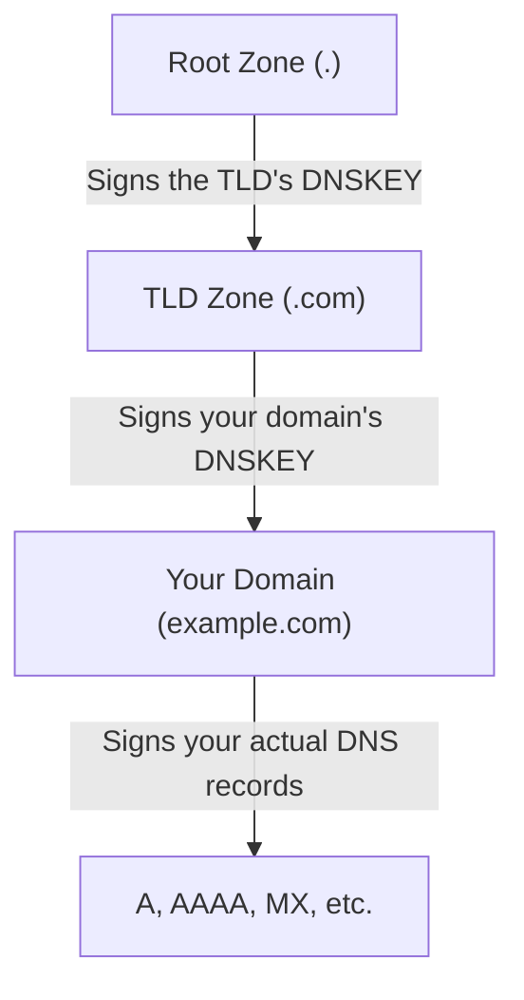

# How to Debug DNSSEC Validation Failures Step by Step

Author: [nawazdhandala](https://github.com/nawazdhandala)

Tags: DNSSEC, DNS, Security, Troubleshooting, Debugging, DevOps

Description: A comprehensive guide to diagnosing and resolving DNSSEC validation failures, covering essential tools, common failure patterns, and systematic debugging techniques for production environments.

---

DNSSEC validation failures are among the most frustrating issues to debug. Your domain was working fine yesterday. Now users report "DNS resolution failed" errors, browsers refuse to load your site, and your monitoring is screaming. You check your DNS records - they look correct. But somewhere between your authoritative nameserver and the end user, DNSSEC validation is failing.

This guide walks you through systematic debugging of DNSSEC validation failures. By the end, you'll understand not just *how* to fix these issues, but *why* they occur in the first place.

---

## Understanding DNSSEC: A Quick Refresher

Before diving into debugging, let's establish a mental model of how DNSSEC works.

### The Trust Chain

DNSSEC creates a chain of trust from the root zone down to your domain:



Each level in the hierarchy has:
- **DNSKEY records**: Public keys used for signing
- **DS records**: Delegation Signer records that link child zones to parent zones
- **RRSIG records**: Digital signatures over DNS record sets

### What Validation Means

When a validating resolver (like Google's 8.8.8.8 or Cloudflare's 1.1.1.1) queries your domain:

1. It retrieves your DNS records along with their RRSIG signatures
2. It fetches your DNSKEY records to verify those signatures
3. It validates your DNSKEY against the DS record in the parent zone
4. This continues up the chain to the root zone

If any link in this chain is broken, validation fails. The resolver returns SERVFAIL instead of your records.

---

## Essential Tools for DNSSEC Debugging

Before starting your investigation, ensure you have these tools available.

### dig (Domain Information Groper)

The most essential tool for DNSSEC debugging. Available on most Unix systems:

```bash
# Basic DNSSEC query
dig example.com +dnssec

# Query with full validation chain
dig example.com +dnssec +multi +trace

# Query specific record types
dig example.com DNSKEY +dnssec
dig example.com DS +dnssec
```

### delv (Domain Entity Lookup & Validation)

Part of BIND tools, specifically designed for DNSSEC validation:

```bash
# Validate a domain with detailed output
delv example.com

# Trace the full validation chain
delv example.com +vtrace

# Check specific record types
delv example.com A +vtrace
```

### drill

An alternative to dig with DNSSEC-focused features:

```bash
# Basic query with DNSSEC
drill -D example.com

# Trace from root
drill -TD example.com

# Chase DNSSEC signatures
drill -S example.com
```

### Online Tools

When you need a second opinion or don't have command-line access:

- **DNSViz** (dnsviz.net): Visualizes the complete DNSSEC chain
- **Verisign DNSSEC Debugger**: Tests validation from multiple locations
- **DNSSEC Analyzer** (dnssec-analyzer.verisignlabs.com): Comprehensive analysis

---

## Step 1: Confirm DNSSEC Is Actually the Problem

Before diving deep into DNSSEC debugging, verify that DNSSEC validation is actually causing your issue.

### Test with Validation Disabled

Query your domain using a resolver that doesn't validate DNSSEC:

```bash
# Use Google's non-validating resolver
dig example.com @8.8.4.4 +cd

# The +cd flag sets the "Checking Disabled" bit
# This tells the resolver to return answers without DNSSEC validation
```

If this query succeeds but normal queries fail, DNSSEC is likely your problem.

### Compare Validating vs Non-Validating Resolvers

```bash
# Query a validating resolver
dig example.com @8.8.8.8

# Query a non-validating resolver (or with CD flag)
dig example.com @8.8.8.8 +cd
```

If the first returns SERVFAIL and the second returns your records, you've confirmed a DNSSEC validation failure.

### Check the Response Flags

```bash
dig example.com @8.8.8.8 +dnssec
```

Look at the flags in the response:

```
;; flags: qr rd ra ad; QUERY: 1, ANSWER: 2, AUTHORITY: 0, ADDITIONAL: 1
```

- **AD (Authentic Data)**: Set if DNSSEC validation succeeded
- **If AD is missing** and you expect DNSSEC to work, something is wrong

---

## Step 2: Examine the Trust Chain

Once you've confirmed a DNSSEC issue, examine the complete trust chain.

### Trace from Root

```bash
dig example.com +trace +dnssec
```

This shows each step of the resolution:

```
.                       518400  IN      NS      a.root-servers.net.
.                       518400  IN      RRSIG   NS 8 0 518400 ...
;; Received 1097 bytes from 192.168.1.1#53(192.168.1.1) in 24 ms

com.                    172800  IN      NS      a.gtld-servers.net.
com.                    86400   IN      DS      30909 8 2 E2D3C916...
com.                    86400   IN      RRSIG   DS 8 1 86400 ...
;; Received 1173 bytes from 199.7.91.13#53(d.root-servers.net) in 89 ms

example.com.            172800  IN      NS      ns1.example.com.
example.com.            86400   IN      DS      12345 13 2 ABC123...
example.com.            86400   IN      RRSIG   DS 8 2 86400 ...
;; Received 597 bytes from 192.5.6.30#53(a.gtld-servers.net) in 45 ms
```

At each step, verify:
1. DS records exist and match the child zone's DNSKEY
2. RRSIG records are present and not expired
3. NS records point to responsive nameservers

### Use delv for Detailed Validation

```bash
delv example.com +vtrace
```

This provides more verbose output about validation:

```
;; validating example.com/A: starting
;; validating example.com/A: attempting positive response validation
;; validating example.com/DNSKEY: starting
;; validating example.com/DNSKEY: attempting positive response validation
;; validating example.com/DNSKEY: checking DS
;; validating example.com/DNSKEY: DS set validated
;; validating example.com/DNSKEY: marking as secure
;; validating example.com/A: marking as secure
; fully validated
```

If validation fails, you'll see where it fails:

```
;; validating example.com/DNSKEY: no valid signature found
;; RRSIG validity period has expired
```

---

## Step 3: Check DNSKEY and DS Record Alignment

The most common DNSSEC failures occur when DNSKEY and DS records don't match.

### Retrieve Current DNSKEY Records

```bash
dig example.com DNSKEY +dnssec +multi
```

Output shows your domain's keys:

```
example.com.            3600 IN DNSKEY 256 3 13 (
                                oJMRESz5E4gYzS/q6XDrvU1qMPYIjCWzJaOau8XNEZeq
                                YmVfTgEmbWWQA0tHkbXb...
                                ) ; ZSK; alg = ECDSAP256SHA256 ; key id = 34567

example.com.            3600 IN DNSKEY 257 3 13 (
                                mdsswUyr3DPW132mOi8V9xESWE8jTo0dxCjjnopKl+GqJ
                                xpVXckHAeF+KkxLbxILfDLUT0rAK9iUzy1L53eKGQ==
                                ) ; KSK; alg = ECDSAP256SHA256 ; key id = 12345
```

Note the key IDs (34567 and 12345 in this example).

### Retrieve DS Records from Parent Zone

```bash
dig example.com DS +dnssec @a.gtld-servers.net
```

Or query your registrar's nameservers directly:

```bash
# For .com domains
dig example.com DS +dnssec @a.gtld-servers.net

# For .org domains
dig example.com DS +dnssec @a0.org.afilias-nst.info
```

Output:

```
example.com.            86400   IN      DS      12345 13 2 49FD46E6C4B4...
```

### Verify the DS Record Matches

The DS record should reference your KSK (key ID 12345 in this example):
- First number (12345) = Key ID
- Second number (13) = Algorithm (13 = ECDSAP256SHA256)
- Third number (2) = Digest type (2 = SHA-256)
- Hex string = Hash of the DNSKEY

Calculate what the DS record *should* be:

```bash
# Using BIND's dnssec-dsfromkey
dig example.com DNSKEY | dnssec-dsfromkey -2 -f - example.com
```

Compare this output to the DS record at the parent. They must match exactly.

---

## Step 4: Validate Signatures

DNSSEC signatures (RRSIG records) have expiration times. Expired signatures cause validation failures.

### Check RRSIG Validity

```bash
dig example.com +dnssec +multi
```

Look at the RRSIG records:

```
example.com.            3600 IN RRSIG A 13 2 3600 (
                                20260215000000 20260115000000 34567 example.com.
                                J5wxRq8ngBvHZj5xXXX... )
```

The two timestamps are:
- **20260215000000**: Signature expiration (February 15, 2026)
- **20260115000000**: Signature inception (January 15, 2026)

If current time is outside this window, validation fails.

### Common Signature Issues

**Expired Signatures**: The most common problem. Your signing process stopped, or automatic re-signing failed.

```bash
# Check if any signatures are expired
dig example.com +dnssec +multi | grep RRSIG
```

Compare the expiration dates to current time.

**Clock Skew**: If your authoritative server's clock is wrong, signatures may appear valid there but invalid elsewhere.

```bash
# Check time on your nameserver
ssh ns1.example.com date -u
```

**Future-Dated Signatures**: If inception time is in the future, validation also fails. This happens with clock skew in the opposite direction.

---

## Step 5: Verify Zone Signing

If signatures are missing or incorrect, examine your zone signing setup.

### For BIND

Check if named is signing the zone:

```bash
# View zone signing status
rndc signing -list example.com

# Check for signing errors in logs
grep "zone example.com" /var/log/named/named.log | tail -50
```

Verify zone configuration:

```bash
# In named.conf
zone "example.com" {
    type master;
    file "/var/named/example.com.zone";
    auto-dnssec maintain;
    inline-signing yes;
    key-directory "/var/named/keys";
};
```

### For PowerDNS

```bash
# Check DNSSEC status
pdnsutil show-zone example.com

# List keys
pdnsutil list-keys example.com

# Check for signing issues
pdnsutil check-zone example.com
```

### For Managed DNS Providers

If you're using a managed DNS provider (Cloudflare, Route53, etc.), check their dashboard for DNSSEC status. Most providers have a DNSSEC configuration section showing:

- Whether DNSSEC is enabled
- Current DS record to publish
- Key rotation status

---

## Step 6: Check for NSEC/NSEC3 Issues

DNSSEC uses NSEC or NSEC3 records to prove that certain records don't exist (authenticated denial of existence).

### Query Non-Existent Record

```bash
dig nonexistent.example.com +dnssec
```

You should see NSEC or NSEC3 records proving the name doesn't exist:

```
example.com.            3600 IN NSEC www.example.com. A NS SOA MX RRSIG NSEC DNSKEY
example.com.            3600 IN RRSIG NSEC ...
```

Or for NSEC3:

```
abc123def456....example.com. 3600 IN NSEC3 1 0 10 AABB (
                                ghi789jkl012... A RRSIG )
```

### Common NSEC/NSEC3 Problems

**Missing NSEC Records**: Zone not properly signed

```bash
# Verify NSEC records exist
dig example.com NSEC +dnssec
```

**NSEC3 Salt Rotation Issues**: If using NSEC3 with salt, ensure salt hasn't changed mid-rotation

**Zone Walking Exposure**: Not a validation failure, but a reason some use NSEC3 over NSEC

---

## Step 7: Algorithm and Key Strength Issues

Different DNS software supports different DNSSEC algorithms. Mismatches cause failures.

### Check Algorithm Support

```bash
dig example.com DNSKEY +dnssec +multi
```

Look at the algorithm number:
- 5 = RSASHA1 (deprecated)
- 7 = RSASHA1-NSEC3-SHA1 (deprecated)
- 8 = RSASHA256
- 10 = RSASHA512
- 13 = ECDSAP256SHA256 (recommended)
- 14 = ECDSAP384SHA384
- 15 = ED25519 (recommended)
- 16 = ED448

### Algorithm Support by Resolver

Some older resolvers don't support newer algorithms:

| Algorithm | Support Level |
|-----------|---------------|
| RSA/SHA-1 | Universal (but deprecated) |
| RSA/SHA-256 | Very widespread |
| RSA/SHA-512 | Widespread |
| ECDSA P-256 | Widespread |
| ECDSA P-384 | Widespread |
| ED25519 | Growing support |
| ED448 | Limited support |

If you're using ED25519 or ED448 and see failures from specific resolvers, algorithm support might be the issue.

### Key Size Requirements

For RSA keys:
- Minimum 1024 bits (but don't use this)
- Recommended 2048 bits
- Maximum practical: 4096 bits

Larger keys increase response sizes and can cause UDP truncation issues.

---

## Step 8: Handle Response Size Issues

DNSSEC adds significant data to DNS responses. Large responses can cause problems.

### Check Response Sizes

```bash
dig example.com ANY +dnssec +bufsize=4096
```

Look at the response size:

```
;; MSG SIZE  rcvd: 1847
```

If responses exceed 1232 bytes (conservative UDP limit), issues may occur.

### UDP vs TCP Fallback

Large responses should trigger TCP fallback:

```bash
# Force TCP
dig example.com +dnssec +tcp

# Compare to UDP
dig example.com +dnssec
```

If TCP works but UDP doesn't, you might have:
- Firewall blocking DNS over TCP (port 53)
- Path MTU issues
- Middleboxes interfering with large UDP packets

### EDNS Buffer Size

```bash
# Test with different buffer sizes
dig example.com +dnssec +bufsize=512
dig example.com +dnssec +bufsize=1232
dig example.com +dnssec +bufsize=4096
```

If smaller buffer sizes fail, your nameserver might not handle truncation correctly.

---

## Step 9: Investigate Timing and Propagation Issues

DNSSEC issues often appear during or after changes. Timing matters.

### TTL Considerations

After making changes, old records may be cached:

```bash
# Check TTL values
dig example.com +dnssec | grep -E "^example.com.*IN"
```

Note the TTL values. You may need to wait for caches to expire.

### Check Multiple Resolvers

Test from different locations and resolvers:

```bash
# Major public resolvers
dig example.com @8.8.8.8 +dnssec    # Google
dig example.com @1.1.1.1 +dnssec    # Cloudflare
dig example.com @9.9.9.9 +dnssec    # Quad9
dig example.com @208.67.222.222 +dnssec  # OpenDNS
```

If one fails and others succeed, the failing resolver may have stale cache.

### Flush Resolver Caches

For public resolvers:

- **Google**: developers.google.com/speed/public-dns/cache
- **Cloudflare**: 1.1.1.1/purge-cache/
- **OpenDNS**: cachecheck.opendns.com/

For your own resolver:

```bash
# BIND
rndc flush

# Unbound
unbound-control flush_zone example.com

# systemd-resolved
systemd-resolve --flush-caches
```

---

## Step 10: Key Rollover Problems

DNSSEC keys should be rotated periodically. Rollovers done incorrectly cause validation failures.

### Understand Rollover States

A proper KSK rollover takes time:

1. **Generate new KSK**: Add to zone, sign DNSKEY RRset
2. **Publish DS at parent**: Submit new DS to registrar
3. **Wait for propagation**: DS must propagate and old DS TTL must expire
4. **Remove old KSK**: After old DS is gone from caches

### Check for Rollover Issues

```bash
# Get current DNSKEY records
dig example.com DNSKEY +dnssec

# Get current DS records from parent
dig example.com DS +trace
```

Common rollover problems:

**DS Removed Too Early**: Parent doesn't have DS for current KSK

**Old KSK Removed Too Early**: Caches still have old DS pointing to removed key

**Multiple DS Records Mismatch**: More than one DS, but none matches current KSK

### Check Rollover Timing

If using automated key management (BIND auto-dnssec, OpenDNSSEC):

```bash
# BIND - check key timings
ls -la /var/named/keys/

# Key files show activation/retirement dates
cat /var/named/keys/Kexample.com.+013+12345.key
```

---

## Common DNSSEC Failures: Quick Reference

### Failure: SERVFAIL on All Queries

**Symptoms**: All DNS queries return SERVFAIL from validating resolvers

**Likely Causes**:
1. DS record doesn't match DNSKEY
2. All signatures expired
3. Zone not signed at all

**Quick Check**:
```bash
dig example.com +cd    # Works? DNSSEC problem confirmed
dig example.com DNSKEY # Empty? Zone not signed
delv example.com +vtrace # Shows specific failure
```

---

### Failure: Intermittent SERVFAIL

**Symptoms**: Sometimes works, sometimes fails

**Likely Causes**:
1. Different nameservers have different states
2. Key rollover in progress
3. Clock skew between nameservers

**Quick Check**:
```bash
# Query each nameserver directly
dig example.com @ns1.example.com +dnssec
dig example.com @ns2.example.com +dnssec
```

---

### Failure: Specific Record Types Fail

**Symptoms**: A records validate, MX records don't (or vice versa)

**Likely Causes**:
1. Missing RRSIG for that record type
2. Incorrect zone serial after changes
3. Partial zone transfer

**Quick Check**:
```bash
dig example.com MX +dnssec
dig example.com A +dnssec
# Compare RRSIG presence and validity
```

---

### Failure: Subdomains Fail, Apex Works

**Symptoms**: example.com validates, sub.example.com fails

**Likely Causes**:
1. Subdomain delegation issues
2. Missing or incorrect DS for delegated subzone
3. Unsigned delegated zone

**Quick Check**:
```bash
dig sub.example.com +trace +dnssec
# Look for missing DS at delegation point
```

---

### Failure: Works Everywhere Except One Resolver

**Symptoms**: Google DNS fails, Cloudflare works

**Likely Causes**:
1. Stale cache on failing resolver
2. Resolver-specific algorithm support
3. Resolver configuration differences

**Quick Check**:
```bash
dig example.com @8.8.8.8 +dnssec
dig example.com @1.1.1.1 +dnssec
# Try purging cache on failing resolver
```

---

## Resolution Techniques

### Regenerate Signatures

If signatures expired, re-sign the zone:

```bash
# BIND with inline-signing
rndc sign example.com

# BIND manual signing
dnssec-signzone -A -N INCREMENT -o example.com -t example.com.zone

# PowerDNS
pdnsutil rectify-zone example.com
```

### Fix DS Record Mismatch

1. Generate correct DS from current KSK:

```bash
dig example.com DNSKEY | dnssec-dsfromkey -2 -f - example.com
```

2. Update DS at registrar with the correct value

3. Wait for propagation (check parent zone):

```bash
dig example.com DS @a.gtld-servers.net
```

### Emergency: Disable DNSSEC

If you need immediate resolution and can't fix DNSSEC:

1. Remove DS record from parent zone (via registrar)
2. Wait for DS TTL to expire (typically 24-48 hours)
3. Zone will resolve as unsigned

This is a last resort - you lose DNSSEC protection.

### Re-establish DNSSEC from Scratch

If the zone is badly broken:

1. Remove DS from parent (wait for expiration)
2. Remove all DNSSEC records from zone
3. Generate new keys
4. Sign zone
5. Publish new DS to parent

```bash
# BIND example
cd /var/named/keys
dnssec-keygen -a ECDSAP256SHA256 -b 256 -n ZONE example.com  # ZSK
dnssec-keygen -a ECDSAP256SHA256 -b 256 -n ZONE -f KSK example.com  # KSK

# Enable signing
rndc sign example.com

# Get new DS record
dig example.com DNSKEY | dnssec-dsfromkey -2 -f - example.com
# Submit this to registrar
```

---

## Prevention and Monitoring

### Automated Monitoring

Set up monitoring for DNSSEC issues before they cause outages:

```bash
# Simple monitoring script
#!/bin/bash
DOMAIN="example.com"

# Check if DNSSEC validates
if ! delv $DOMAIN > /dev/null 2>&1; then
    echo "DNSSEC validation failed for $DOMAIN"
    exit 1
fi

# Check signature expiration
EXPIRY=$(dig $DOMAIN +dnssec +short RRSIG | head -1 | awk '{print $5}')
EXPIRY_EPOCH=$(date -d "${EXPIRY:0:8}" +%s 2>/dev/null || echo 0)
NOW_EPOCH=$(date +%s)
DAYS_LEFT=$(( (EXPIRY_EPOCH - NOW_EPOCH) / 86400 ))

if [ $DAYS_LEFT -lt 7 ]; then
    echo "DNSSEC signatures expire in $DAYS_LEFT days"
    exit 1
fi

echo "DNSSEC OK - signatures valid for $DAYS_LEFT days"
```

### Use OneUptime for DNSSEC Monitoring

OneUptime can monitor your DNSSEC-signed domains:

1. Create a DNS monitor for your domain
2. Enable DNSSEC validation checks
3. Set up alerts for validation failures
4. Monitor signature expiration proactively

This catches issues before they affect users.

### Key Management Best Practices

1. **Automate key rollovers**: Use tools like BIND's auto-dnssec or OpenDNSSEC
2. **Set signature validity appropriately**: 2-4 weeks is common, with re-signing before expiration
3. **Monitor key expiration**: Track when keys and signatures expire
4. **Document your DNSSEC setup**: Record key IDs, algorithms, and rollover schedules
5. **Test in staging first**: If possible, test DNSSEC changes on a test domain

---

## DNSSEC Debugging Summary Table

| Issue | Symptoms | Diagnostic Command | Resolution |
|-------|----------|-------------------|------------|
| DS/DNSKEY mismatch | SERVFAIL everywhere | `dig DNSKEY` + `dig DS +trace` | Update DS at registrar |
| Expired signatures | SERVFAIL, delv shows expired | `dig +dnssec +multi` | Re-sign zone |
| Missing signatures | Specific records fail | `dig RECORD +dnssec` | Re-sign zone |
| Algorithm unsupported | Fails on some resolvers | `dig DNSKEY +multi` | Use widely-supported algorithm |
| Clock skew | Intermittent failures | Check server time | Sync NTP |
| Key rollover failure | Failures during maintenance | `dig DNSKEY`, `dig DS +trace` | Follow proper rollover procedure |
| Partial zone transfer | Secondary NS fails | Query each NS directly | Force zone transfer |
| Response too large | UDP fails, TCP works | `dig +dnssec +tcp` | Ensure TCP allowed |
| NSEC/NSEC3 issues | NXDOMAIN queries fail | `dig nonexistent.domain +dnssec` | Check zone signing config |
| Delegated subdomain | Subdomain fails, apex works | `dig sub.domain +trace +dnssec` | Check DS at delegation |

---

## Conclusion

DNSSEC validation failures are systematic problems with systematic solutions. The key is methodical debugging:

1. **Confirm** DNSSEC is the actual problem
2. **Trace** the trust chain from root to your domain
3. **Check** DNSKEY and DS alignment
4. **Validate** signatures aren't expired
5. **Verify** zone signing is working
6. **Test** from multiple resolvers

Most DNSSEC failures come down to one of three issues:
- DS record doesn't match the DNSKEY
- Signatures have expired
- Key rollover was done incorrectly

With the tools and techniques in this guide, you can diagnose any of these problems and get your domain validating again.

DNSSEC adds real security to DNS - it prevents cache poisoning and DNS spoofing attacks. The debugging complexity is worth the protection. Set up monitoring, automate your key management, and these failures will become rare events rather than emergencies.

---

## Quick Reference Commands

```bash
# Confirm DNSSEC problem
dig example.com @8.8.8.8 +cd  # Should work if DNSSEC is the issue

# Full validation trace
delv example.com +vtrace

# Check trust chain
dig example.com +trace +dnssec

# Get DNSKEY records
dig example.com DNSKEY +dnssec +multi

# Get DS from parent
dig example.com DS +trace

# Check signature expiration
dig example.com +dnssec +multi | grep RRSIG

# Generate correct DS from DNSKEY
dig example.com DNSKEY | dnssec-dsfromkey -2 -f - example.com

# Force zone re-sign (BIND)
rndc sign example.com

# Flush resolver cache (BIND)
rndc flush

# Test from multiple resolvers
for ns in 8.8.8.8 1.1.1.1 9.9.9.9; do
    echo "Testing $ns:"
    dig example.com @$ns +dnssec +short
done
```

---

## Additional Resources

- **RFC 4033-4035**: DNSSEC specifications
- **RFC 6781**: DNSSEC operational practices
- **DNSViz**: dnsviz.net - Visual DNSSEC chain analysis
- **DNSSEC Deployment Guide**: ICANN's comprehensive guide
- **BIND Administrator Reference Manual**: DNSSEC chapter
- **PowerDNS DNSSEC Documentation**: doc.powerdns.com

Understanding DNSSEC deeply takes time, but the ability to debug validation failures quickly is worth the investment. Your users - and your security posture - will thank you.
