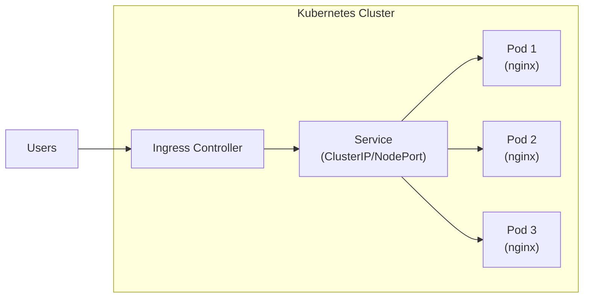

# How to Deploy React Applications to Kubernetes

Author: [nawazdhandala](https://github.com/nawazdhandala)

Tags: React, Kubernetes, Deployment, DevOps, Containers, Infrastructure

Description: A comprehensive guide to containerizing React applications and deploying them to Kubernetes with production-ready configurations, Ingress setup, and best practices.

---

Deploying React applications to Kubernetes might seem daunting at first, but it opens up a world of scalability, reliability, and operational excellence. In this comprehensive guide, we will walk through every step of the process, from containerizing your React application to setting up production-ready Kubernetes deployments with Ingress controllers.

## Table of Contents

1. [Prerequisites](#prerequisites)
2. [Understanding the Architecture](#understanding-the-architecture)
3. [Preparing Your React Application](#preparing-your-react-application)
4. [Creating the Dockerfile](#creating-the-dockerfile)
5. [Building and Testing the Docker Image](#building-and-testing-the-docker-image)
6. [Kubernetes Fundamentals](#kubernetes-fundamentals)
7. [Creating Kubernetes Manifests](#creating-kubernetes-manifests)
8. [Setting Up Ingress](#setting-up-ingress)
9. [ConfigMaps and Secrets](#configmaps-and-secrets)
10. [Health Checks and Probes](#health-checks-and-probes)
11. [Horizontal Pod Autoscaling](#horizontal-pod-autoscaling)
12. [Monitoring and Logging](#monitoring-and-logging)
13. [CI/CD Integration](#cicd-integration)
14. [Best Practices](#best-practices)
15. [Troubleshooting Common Issues](#troubleshooting-common-issues)
16. [Summary](#summary)

## Prerequisites

Before we begin, ensure you have the following tools installed and configured:

- **Node.js** (v18 or later) - For building your React application
- **Docker** - For containerizing your application
- **kubectl** - Kubernetes command-line tool
- **A Kubernetes cluster** - Can be local (minikube, kind) or cloud-based (GKE, EKS, AKS)
- **Helm** (optional) - For managing Kubernetes packages

```bash
# Verify your installations
node --version
docker --version
kubectl version --client
```

## Understanding the Architecture

When deploying a React application to Kubernetes, the typical architecture looks like this:



The key components are:

1. **Ingress Controller** - Routes external traffic to your services
2. **Service** - Provides stable networking for your pods
3. **Deployment** - Manages your application pods
4. **Pods** - Run your containerized React application (served via nginx)

## Preparing Your React Application

First, let us ensure your React application is production-ready. If you are starting fresh, create a new React application:

```bash
npx create-react-app my-react-app
cd my-react-app
```

For an existing application, make sure it builds correctly:

```bash
npm install
npm run build
```

The `build` command creates an optimized production build in the `build/` directory. This is what we will serve in our container.

### Optimizing for Production

Before containerizing, consider these optimizations:

```javascript
// src/index.js - Enable strict mode for better error detection
import React from 'react';
import ReactDOM from 'react-dom/client';
import App from './App';

const root = ReactDOM.createRoot(document.getElementById('root'));
root.render(
  <React.StrictMode>
    <App />
  </React.StrictMode>
);
```

Add environment-specific configurations in your `.env` files:

```bash
# .env.production
REACT_APP_API_URL=https://api.yourdomain.com
REACT_APP_ENVIRONMENT=production
```

## Creating the Dockerfile

The Dockerfile is crucial for containerizing your React application. We will use a multi-stage build to keep the final image small and secure.

### Multi-Stage Dockerfile

Create a `Dockerfile` in your project root:

```dockerfile
# Stage 1: Build the React application
FROM node:20-alpine AS builder

# Set working directory
WORKDIR /app

# Copy package files first for better caching
COPY package*.json ./

# Install dependencies
RUN npm ci --only=production=false

# Copy source code
COPY . .

# Build the application
RUN npm run build

# Stage 2: Serve with nginx
FROM nginx:1.25-alpine AS production

# Remove default nginx configuration
RUN rm /etc/nginx/conf.d/default.conf

# Copy custom nginx configuration
COPY nginx.conf /etc/nginx/conf.d/

# Copy built assets from builder stage
COPY --from=builder /app/build /usr/share/nginx/html

# Add non-root user for security
RUN addgroup -g 1001 -S appgroup && \
    adduser -u 1001 -S appuser -G appgroup && \
    chown -R appuser:appgroup /usr/share/nginx/html && \
    chown -R appuser:appgroup /var/cache/nginx && \
    chown -R appuser:appgroup /var/log/nginx && \
    touch /var/run/nginx.pid && \
    chown -R appuser:appgroup /var/run/nginx.pid

# Expose port 80
EXPOSE 80

# Health check
HEALTHCHECK --interval=30s --timeout=3s --start-period=5s --retries=3 \
    CMD wget --no-verbose --tries=1 --spider http://localhost:80/ || exit 1

# Start nginx
CMD ["nginx", "-g", "daemon off;"]
```

### Nginx Configuration

Create an `nginx.conf` file for serving your React application:

```nginx
server {
    listen 80;
    server_name localhost;
    root /usr/share/nginx/html;
    index index.html;

    # Gzip compression
    gzip on;
    gzip_vary on;
    gzip_min_length 1024;
    gzip_proxied expired no-cache no-store private auth;
    gzip_types text/plain text/css text/xml text/javascript application/x-javascript application/xml application/javascript;
    gzip_disable "MSIE [1-6]\.";

    # Security headers
    add_header X-Frame-Options "SAMEORIGIN" always;
    add_header X-Content-Type-Options "nosniff" always;
    add_header X-XSS-Protection "1; mode=block" always;
    add_header Referrer-Policy "strict-origin-when-cross-origin" always;

    # Cache static assets
    location ~* \.(js|css|png|jpg|jpeg|gif|ico|svg|woff|woff2|ttf|eot)$ {
        expires 1y;
        add_header Cache-Control "public, immutable";
        access_log off;
    }

    # Handle React Router (SPA routing)
    location / {
        try_files $uri $uri/ /index.html;
    }

    # Health check endpoint
    location /health {
        access_log off;
        return 200 "healthy\n";
        add_header Content-Type text/plain;
    }

    # Deny access to hidden files
    location ~ /\. {
        deny all;
        access_log off;
        log_not_found off;
    }
}
```

### Docker Ignore File

Create a `.dockerignore` file to exclude unnecessary files:

```
node_modules
npm-debug.log
build
.git
.gitignore
.env.local
.env.development.local
.env.test.local
.env.production.local
Dockerfile
docker-compose.yml
.dockerignore
README.md
.DS_Store
coverage
.nyc_output
```

## Building and Testing the Docker Image

Now let us build and test our Docker image:

```bash
# Build the Docker image
docker build -t my-react-app:latest .

# Run the container locally to test
docker run -d -p 8080:80 --name react-test my-react-app:latest

# Verify it is running
curl http://localhost:8080

# Check container logs
docker logs react-test

# Stop and remove test container
docker stop react-test && docker rm react-test
```

### Pushing to a Container Registry

Push your image to a container registry (Docker Hub, ECR, GCR, or ACR):

```bash
# Tag the image for your registry
docker tag my-react-app:latest your-registry/my-react-app:v1.0.0

# Push to registry
docker push your-registry/my-react-app:v1.0.0
```

For private registries, ensure you are authenticated:

```bash
# Docker Hub
docker login

# AWS ECR
aws ecr get-login-password --region us-east-1 | docker login --username AWS --password-stdin your-account.dkr.ecr.us-east-1.amazonaws.com

# Google GCR
gcloud auth configure-docker

# Azure ACR
az acr login --name yourregistry
```

## Kubernetes Fundamentals

Before diving into manifests, let us understand the key Kubernetes resources we will use:

| Resource | Purpose | Key Features |
|----------|---------|--------------|
| **Namespace** | Logical isolation | Resource quotas, network policies |
| **Deployment** | Manages pods | Rolling updates, replicas, rollbacks |
| **Service** | Network abstraction | Load balancing, service discovery |
| **Ingress** | External access | TLS termination, routing rules |
| **ConfigMap** | Configuration data | Environment variables, config files |
| **Secret** | Sensitive data | Base64 encoded, encrypted at rest |
| **HPA** | Auto-scaling | CPU/memory-based scaling |

## Creating Kubernetes Manifests

Let us create a complete set of Kubernetes manifests for our React application.

### Directory Structure

```
k8s/
├── namespace.yaml
├── deployment.yaml
├── service.yaml
├── ingress.yaml
├── configmap.yaml
├── secret.yaml
├── hpa.yaml
└── network-policy.yaml
```

### Namespace

Create `k8s/namespace.yaml`:

```yaml
apiVersion: v1
kind: Namespace
metadata:
  name: react-app
  labels:
    app: react-app
    environment: production
```

### Deployment

Create `k8s/deployment.yaml`:

```yaml
apiVersion: apps/v1
kind: Deployment
metadata:
  name: react-app
  namespace: react-app
  labels:
    app: react-app
    version: v1.0.0
spec:
  replicas: 3
  selector:
    matchLabels:
      app: react-app
  strategy:
    type: RollingUpdate
    rollingUpdate:
      maxSurge: 1
      maxUnavailable: 0
  template:
    metadata:
      labels:
        app: react-app
        version: v1.0.0
      annotations:
        prometheus.io/scrape: "true"
        prometheus.io/port: "80"
    spec:
      serviceAccountName: react-app-sa
      securityContext:
        runAsNonRoot: true
        runAsUser: 1001
        runAsGroup: 1001
        fsGroup: 1001
      containers:
        - name: react-app
          image: your-registry/my-react-app:v1.0.0
          imagePullPolicy: Always
          ports:
            - name: http
              containerPort: 80
              protocol: TCP
          env:
            - name: NODE_ENV
              value: "production"
          envFrom:
            - configMapRef:
                name: react-app-config
          resources:
            requests:
              cpu: "100m"
              memory: "128Mi"
            limits:
              cpu: "500m"
              memory: "256Mi"
          livenessProbe:
            httpGet:
              path: /health
              port: http
            initialDelaySeconds: 10
            periodSeconds: 10
            timeoutSeconds: 5
            failureThreshold: 3
          readinessProbe:
            httpGet:
              path: /health
              port: http
            initialDelaySeconds: 5
            periodSeconds: 5
            timeoutSeconds: 3
            failureThreshold: 3
          securityContext:
            allowPrivilegeEscalation: false
            readOnlyRootFilesystem: false
            capabilities:
              drop:
                - ALL
      affinity:
        podAntiAffinity:
          preferredDuringSchedulingIgnoredDuringExecution:
            - weight: 100
              podAffinityTerm:
                labelSelector:
                  matchExpressions:
                    - key: app
                      operator: In
                      values:
                        - react-app
                topologyKey: kubernetes.io/hostname
      topologySpreadConstraints:
        - maxSkew: 1
          topologyKey: topology.kubernetes.io/zone
          whenUnsatisfiable: ScheduleAnyway
          labelSelector:
            matchLabels:
              app: react-app
```

### Service Account

Create `k8s/service-account.yaml`:

```yaml
apiVersion: v1
kind: ServiceAccount
metadata:
  name: react-app-sa
  namespace: react-app
  labels:
    app: react-app
---
apiVersion: rbac.authorization.k8s.io/v1
kind: Role
metadata:
  name: react-app-role
  namespace: react-app
rules:
  - apiGroups: [""]
    resources: ["configmaps"]
    verbs: ["get", "list", "watch"]
---
apiVersion: rbac.authorization.k8s.io/v1
kind: RoleBinding
metadata:
  name: react-app-rolebinding
  namespace: react-app
roleRef:
  apiGroup: rbac.authorization.k8s.io
  kind: Role
  name: react-app-role
subjects:
  - kind: ServiceAccount
    name: react-app-sa
    namespace: react-app
```

### Service

Create `k8s/service.yaml`:

```yaml
apiVersion: v1
kind: Service
metadata:
  name: react-app-service
  namespace: react-app
  labels:
    app: react-app
spec:
  type: ClusterIP
  selector:
    app: react-app
  ports:
    - name: http
      protocol: TCP
      port: 80
      targetPort: http
---
# Optional: NodePort service for direct access
apiVersion: v1
kind: Service
metadata:
  name: react-app-nodeport
  namespace: react-app
  labels:
    app: react-app
spec:
  type: NodePort
  selector:
    app: react-app
  ports:
    - name: http
      protocol: TCP
      port: 80
      targetPort: http
      nodePort: 30080
```

## Setting Up Ingress

The Ingress resource exposes your application to external traffic with features like TLS termination, path-based routing, and load balancing.

### Installing an Ingress Controller

First, install an Ingress controller. We will use nginx-ingress:

```bash
# Using Helm
helm repo add ingress-nginx https://kubernetes.github.io/ingress-nginx
helm repo update

helm install ingress-nginx ingress-nginx/ingress-nginx \
  --namespace ingress-nginx \
  --create-namespace \
  --set controller.replicaCount=2 \
  --set controller.metrics.enabled=true
```

Or using kubectl:

```bash
kubectl apply -f https://raw.githubusercontent.com/kubernetes/ingress-nginx/controller-v1.9.4/deploy/static/provider/cloud/deploy.yaml
```

### Ingress Resource

Create `k8s/ingress.yaml`:

```yaml
apiVersion: networking.k8s.io/v1
kind: Ingress
metadata:
  name: react-app-ingress
  namespace: react-app
  labels:
    app: react-app
  annotations:
    kubernetes.io/ingress.class: nginx
    nginx.ingress.kubernetes.io/ssl-redirect: "true"
    nginx.ingress.kubernetes.io/proxy-body-size: "10m"
    nginx.ingress.kubernetes.io/proxy-read-timeout: "60"
    nginx.ingress.kubernetes.io/proxy-send-timeout: "60"
    nginx.ingress.kubernetes.io/configuration-snippet: |
      add_header X-Frame-Options "SAMEORIGIN" always;
      add_header X-Content-Type-Options "nosniff" always;
      add_header X-XSS-Protection "1; mode=block" always;
    cert-manager.io/cluster-issuer: "letsencrypt-prod"
spec:
  ingressClassName: nginx
  tls:
    - hosts:
        - myapp.yourdomain.com
      secretName: react-app-tls
  rules:
    - host: myapp.yourdomain.com
      http:
        paths:
          - path: /
            pathType: Prefix
            backend:
              service:
                name: react-app-service
                port:
                  number: 80
```

### TLS Certificate with cert-manager

Install cert-manager for automatic TLS certificate management:

```bash
# Install cert-manager
kubectl apply -f https://github.com/cert-manager/cert-manager/releases/download/v1.13.2/cert-manager.yaml
```

Create a ClusterIssuer for Let's Encrypt:

```yaml
# k8s/cluster-issuer.yaml
apiVersion: cert-manager.io/v1
kind: ClusterIssuer
metadata:
  name: letsencrypt-prod
spec:
  acme:
    server: https://acme-v02.api.letsencrypt.org/directory
    email: your-email@yourdomain.com
    privateKeySecretRef:
      name: letsencrypt-prod-key
    solvers:
      - http01:
          ingress:
            class: nginx
---
apiVersion: cert-manager.io/v1
kind: ClusterIssuer
metadata:
  name: letsencrypt-staging
spec:
  acme:
    server: https://acme-staging-v02.api.letsencrypt.org/directory
    email: your-email@yourdomain.com
    privateKeySecretRef:
      name: letsencrypt-staging-key
    solvers:
      - http01:
          ingress:
            class: nginx
```

### Multiple Environments with Ingress

For staging and production environments:

```yaml
# k8s/ingress-staging.yaml
apiVersion: networking.k8s.io/v1
kind: Ingress
metadata:
  name: react-app-ingress-staging
  namespace: react-app-staging
  annotations:
    cert-manager.io/cluster-issuer: "letsencrypt-staging"
spec:
  ingressClassName: nginx
  tls:
    - hosts:
        - staging.myapp.yourdomain.com
      secretName: react-app-staging-tls
  rules:
    - host: staging.myapp.yourdomain.com
      http:
        paths:
          - path: /
            pathType: Prefix
            backend:
              service:
                name: react-app-service
                port:
                  number: 80
```

## ConfigMaps and Secrets

### ConfigMap

Create `k8s/configmap.yaml`:

```yaml
apiVersion: v1
kind: ConfigMap
metadata:
  name: react-app-config
  namespace: react-app
  labels:
    app: react-app
data:
  REACT_APP_API_URL: "https://api.yourdomain.com"
  REACT_APP_ENVIRONMENT: "production"
  REACT_APP_VERSION: "1.0.0"
  REACT_APP_FEATURE_FLAGS: "true"
```

### Secrets

Create `k8s/secret.yaml`:

```yaml
apiVersion: v1
kind: Secret
metadata:
  name: react-app-secrets
  namespace: react-app
  labels:
    app: react-app
type: Opaque
stringData:
  REACT_APP_API_KEY: "your-api-key-here"
  REACT_APP_SECRET_TOKEN: "your-secret-token"
```

For production, use sealed-secrets or external secret management:

```bash
# Using kubeseal for sealed secrets
kubeseal --format yaml < secret.yaml > sealed-secret.yaml
```

### Runtime Configuration

For runtime configuration injection, create a configuration script:

```nginx
# nginx.conf with runtime env substitution
server {
    listen 80;

    location /config.js {
        default_type application/javascript;
        return 200 'window.RUNTIME_CONFIG = { API_URL: "$API_URL", ENVIRONMENT: "$ENVIRONMENT" };';
    }

    location / {
        root /usr/share/nginx/html;
        try_files $uri $uri/ /index.html;
    }
}
```

## Health Checks and Probes

Kubernetes uses three types of probes to determine pod health:

### Liveness Probe

Determines if a container is running. If it fails, Kubernetes restarts the container.

```yaml
livenessProbe:
  httpGet:
    path: /health
    port: 80
  initialDelaySeconds: 10
  periodSeconds: 10
  timeoutSeconds: 5
  failureThreshold: 3
  successThreshold: 1
```

### Readiness Probe

Determines if a container is ready to accept traffic. Pods are removed from service endpoints if this fails.

```yaml
readinessProbe:
  httpGet:
    path: /health
    port: 80
  initialDelaySeconds: 5
  periodSeconds: 5
  timeoutSeconds: 3
  failureThreshold: 3
  successThreshold: 1
```

### Startup Probe

Used for slow-starting containers. Other probes are disabled until this succeeds.

```yaml
startupProbe:
  httpGet:
    path: /health
    port: 80
  initialDelaySeconds: 0
  periodSeconds: 10
  timeoutSeconds: 3
  failureThreshold: 30
  successThreshold: 1
```

## Horizontal Pod Autoscaling

Create `k8s/hpa.yaml`:

```yaml
apiVersion: autoscaling/v2
kind: HorizontalPodAutoscaler
metadata:
  name: react-app-hpa
  namespace: react-app
  labels:
    app: react-app
spec:
  scaleTargetRef:
    apiVersion: apps/v1
    kind: Deployment
    name: react-app
  minReplicas: 3
  maxReplicas: 10
  metrics:
    - type: Resource
      resource:
        name: cpu
        target:
          type: Utilization
          averageUtilization: 70
    - type: Resource
      resource:
        name: memory
        target:
          type: Utilization
          averageUtilization: 80
  behavior:
    scaleDown:
      stabilizationWindowSeconds: 300
      policies:
        - type: Percent
          value: 10
          periodSeconds: 60
    scaleUp:
      stabilizationWindowSeconds: 0
      policies:
        - type: Percent
          value: 100
          periodSeconds: 15
        - type: Pods
          value: 4
          periodSeconds: 15
      selectPolicy: Max
```

### Pod Disruption Budget

Create `k8s/pdb.yaml`:

```yaml
apiVersion: policy/v1
kind: PodDisruptionBudget
metadata:
  name: react-app-pdb
  namespace: react-app
spec:
  minAvailable: 2
  selector:
    matchLabels:
      app: react-app
```

## Monitoring and Logging

### Prometheus Metrics

Add Prometheus annotations to your deployment:

```yaml
metadata:
  annotations:
    prometheus.io/scrape: "true"
    prometheus.io/port: "80"
    prometheus.io/path: "/metrics"
```

### ServiceMonitor for Prometheus Operator

```yaml
apiVersion: monitoring.coreos.com/v1
kind: ServiceMonitor
metadata:
  name: react-app-monitor
  namespace: react-app
  labels:
    app: react-app
spec:
  selector:
    matchLabels:
      app: react-app
  endpoints:
    - port: http
      interval: 30s
      path: /metrics
```

### Logging Configuration

Configure structured logging with Fluentd or Fluent Bit:

```yaml
apiVersion: v1
kind: ConfigMap
metadata:
  name: fluent-bit-config
  namespace: logging
data:
  fluent-bit.conf: |
    [SERVICE]
        Flush         1
        Log_Level     info
        Daemon        off

    [INPUT]
        Name              tail
        Path              /var/log/containers/react-app*.log
        Parser            docker
        Tag               react-app.*
        Refresh_Interval  5

    [OUTPUT]
        Name            es
        Match           react-app.*
        Host            elasticsearch.logging.svc.cluster.local
        Port            9200
        Index           react-app-logs
```

## CI/CD Integration

### GitHub Actions Workflow

Create `.github/workflows/deploy.yaml`:

```yaml
name: Build and Deploy to Kubernetes

on:
  push:
    branches: [main]
  pull_request:
    branches: [main]

env:
  REGISTRY: ghcr.io
  IMAGE_NAME: ${{ github.repository }}

jobs:
  build:
    runs-on: ubuntu-latest
    permissions:
      contents: read
      packages: write

    steps:
      - name: Checkout repository
        uses: actions/checkout@v4

      - name: Set up Node.js
        uses: actions/setup-node@v4
        with:
          node-version: '20'
          cache: 'npm'

      - name: Install dependencies
        run: npm ci

      - name: Run tests
        run: npm test -- --coverage --watchAll=false

      - name: Build application
        run: npm run build

      - name: Set up Docker Buildx
        uses: docker/setup-buildx-action@v3

      - name: Log in to Container Registry
        uses: docker/login-action@v3
        with:
          registry: ${{ env.REGISTRY }}
          username: ${{ github.actor }}
          password: ${{ secrets.GITHUB_TOKEN }}

      - name: Extract metadata
        id: meta
        uses: docker/metadata-action@v5
        with:
          images: ${{ env.REGISTRY }}/${{ env.IMAGE_NAME }}
          tags: |
            type=sha,prefix=
            type=ref,event=branch
            type=semver,pattern={{version}}

      - name: Build and push Docker image
        uses: docker/build-push-action@v5
        with:
          context: .
          push: true
          tags: ${{ steps.meta.outputs.tags }}
          labels: ${{ steps.meta.outputs.labels }}
          cache-from: type=gha
          cache-to: type=gha,mode=max

  deploy:
    needs: build
    runs-on: ubuntu-latest
    if: github.ref == 'refs/heads/main'

    steps:
      - name: Checkout repository
        uses: actions/checkout@v4

      - name: Set up kubectl
        uses: azure/setup-kubectl@v3
        with:
          version: 'v1.28.0'

      - name: Configure kubectl
        run: |
          echo "${{ secrets.KUBE_CONFIG }}" | base64 -d > kubeconfig
          export KUBECONFIG=kubeconfig

      - name: Update deployment image
        run: |
          kubectl set image deployment/react-app \
            react-app=${{ env.REGISTRY }}/${{ env.IMAGE_NAME }}:${{ github.sha }} \
            -n react-app

      - name: Wait for rollout
        run: |
          kubectl rollout status deployment/react-app -n react-app --timeout=300s
```

### ArgoCD Application

For GitOps-based deployments with ArgoCD:

```yaml
apiVersion: argoproj.io/v1alpha1
kind: Application
metadata:
  name: react-app
  namespace: argocd
spec:
  project: default
  source:
    repoURL: https://github.com/your-org/your-repo.git
    targetRevision: HEAD
    path: k8s
  destination:
    server: https://kubernetes.default.svc
    namespace: react-app
  syncPolicy:
    automated:
      prune: true
      selfHeal: true
    syncOptions:
      - CreateNamespace=true
```

## Best Practices

### Security Best Practices

1. **Run as non-root user**
2. **Use read-only root filesystem where possible**
3. **Drop all capabilities**
4. **Use network policies**
5. **Scan images for vulnerabilities**

```yaml
# Network Policy
apiVersion: networking.k8s.io/v1
kind: NetworkPolicy
metadata:
  name: react-app-network-policy
  namespace: react-app
spec:
  podSelector:
    matchLabels:
      app: react-app
  policyTypes:
    - Ingress
    - Egress
  ingress:
    - from:
        - namespaceSelector:
            matchLabels:
              name: ingress-nginx
      ports:
        - protocol: TCP
          port: 80
  egress:
    - to:
        - namespaceSelector: {}
      ports:
        - protocol: UDP
          port: 53
    - to:
        - ipBlock:
            cidr: 0.0.0.0/0
      ports:
        - protocol: TCP
          port: 443
```

### Resource Management

| Component | CPU Request | CPU Limit | Memory Request | Memory Limit |
|-----------|-------------|-----------|----------------|--------------|
| Small App | 50m | 200m | 64Mi | 128Mi |
| Medium App | 100m | 500m | 128Mi | 256Mi |
| Large App | 200m | 1000m | 256Mi | 512Mi |

### Image Optimization

1. Use multi-stage builds
2. Minimize layers
3. Use .dockerignore
4. Pin dependency versions
5. Use slim base images

## Troubleshooting Common Issues

### Pod Not Starting

```bash
# Check pod status
kubectl get pods -n react-app

# Describe pod for events
kubectl describe pod <pod-name> -n react-app

# Check logs
kubectl logs <pod-name> -n react-app

# Check previous container logs
kubectl logs <pod-name> -n react-app --previous
```

### Service Not Accessible

```bash
# Verify service endpoints
kubectl get endpoints react-app-service -n react-app

# Test service from within cluster
kubectl run test-pod --rm -it --image=busybox -- wget -qO- http://react-app-service.react-app.svc.cluster.local

# Check ingress status
kubectl describe ingress react-app-ingress -n react-app
```

### Image Pull Errors

```bash
# Check image pull secrets
kubectl get secrets -n react-app

# Create docker registry secret
kubectl create secret docker-registry regcred \
  --docker-server=your-registry \
  --docker-username=your-username \
  --docker-password=your-password \
  -n react-app
```

### Resource Issues

```bash
# Check resource usage
kubectl top pods -n react-app

# Check node resources
kubectl top nodes

# Check events
kubectl get events -n react-app --sort-by='.lastTimestamp'
```

## Deployment Commands Summary

Here is a complete deployment workflow:

```bash
# 1. Create namespace
kubectl apply -f k8s/namespace.yaml

# 2. Create service account and RBAC
kubectl apply -f k8s/service-account.yaml

# 3. Create ConfigMap and Secrets
kubectl apply -f k8s/configmap.yaml
kubectl apply -f k8s/secret.yaml

# 4. Deploy the application
kubectl apply -f k8s/deployment.yaml

# 5. Create service
kubectl apply -f k8s/service.yaml

# 6. Create Ingress
kubectl apply -f k8s/ingress.yaml

# 7. Create HPA
kubectl apply -f k8s/hpa.yaml

# 8. Create PDB
kubectl apply -f k8s/pdb.yaml

# 9. Verify deployment
kubectl get all -n react-app

# 10. Watch rollout
kubectl rollout status deployment/react-app -n react-app
```

Or apply everything at once:

```bash
kubectl apply -f k8s/
```

## Summary

Deploying React applications to Kubernetes provides a robust, scalable, and maintainable infrastructure for your frontend applications. Here is a summary of the key components and their purposes:

| Component | File | Purpose |
|-----------|------|---------|
| **Dockerfile** | `Dockerfile` | Multi-stage build for optimized images |
| **Nginx Config** | `nginx.conf` | Web server configuration with caching and security |
| **Namespace** | `k8s/namespace.yaml` | Logical isolation for resources |
| **Deployment** | `k8s/deployment.yaml` | Pod management with rolling updates |
| **Service** | `k8s/service.yaml` | Internal load balancing and discovery |
| **Ingress** | `k8s/ingress.yaml` | External access with TLS termination |
| **ConfigMap** | `k8s/configmap.yaml` | Non-sensitive configuration |
| **Secret** | `k8s/secret.yaml` | Sensitive data management |
| **HPA** | `k8s/hpa.yaml` | Automatic horizontal scaling |
| **PDB** | `k8s/pdb.yaml` | High availability during disruptions |
| **NetworkPolicy** | `k8s/network-policy.yaml` | Network security rules |

### Key Takeaways

1. **Use multi-stage Docker builds** to create small, secure images
2. **Configure nginx properly** for SPA routing and caching
3. **Implement health checks** for reliable deployments
4. **Use Ingress with TLS** for secure external access
5. **Configure HPA and PDB** for scalability and availability
6. **Apply security best practices** including network policies and non-root users
7. **Set up CI/CD pipelines** for automated deployments
8. **Monitor and log** your applications for observability

By following this guide, you have learned how to deploy a production-ready React application to Kubernetes with all the necessary components for a robust, scalable, and secure deployment. The patterns and practices described here will serve as a solid foundation for deploying any frontend application to Kubernetes.

Happy deploying!
