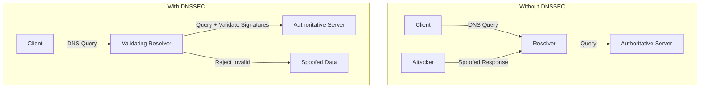
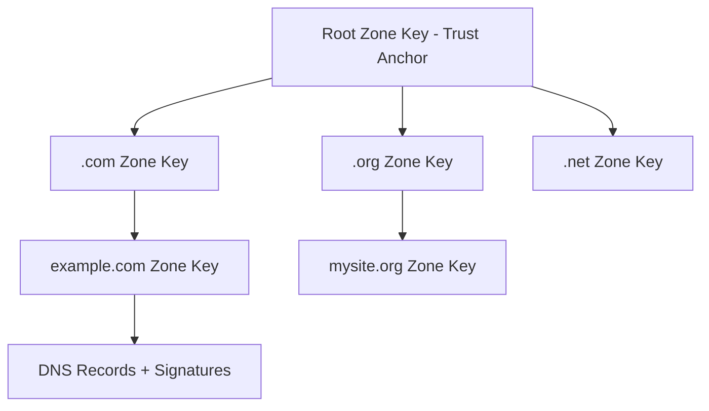

# How to Configure dnsmasq with DNSSEC Validation

Author: [nawazdhandala](https://github.com/nawazdhandala)

Tags: DNSSEC, dnsmasq, DNS, Security, Linux, Infrastructure

Description: A comprehensive guide to configuring dnsmasq as a validating DNS resolver with DNSSEC support, including trust anchor management, troubleshooting, and security best practices.

---

DNS is one of the oldest and most critical internet protocols, yet it was designed without security in mind. DNSSEC (Domain Name System Security Extensions) adds cryptographic signatures to DNS records, protecting against cache poisoning and man-in-the-middle attacks. This guide shows you how to configure dnsmasq to perform DNSSEC validation, ensuring your DNS queries return authentic results.

## Why DNSSEC Matters

Without DNSSEC, DNS responses can be spoofed. An attacker could redirect your traffic to malicious servers without you knowing. DNSSEC prevents this by:

1. **Authenticating responses** - Cryptographic signatures prove the response came from the authoritative source
2. **Ensuring integrity** - Any modification to DNS data breaks the signature
3. **Establishing chain of trust** - From root DNS servers down to individual domains



## Prerequisites

Before configuring DNSSEC validation, ensure you have:

- **dnsmasq version 2.80 or later** (DNSSEC support improved significantly)
- **Root access** to your Linux system
- **Basic understanding of DNS concepts**

Check your dnsmasq version:

```bash
dnsmasq --version
```

Expected output should show DNSSEC compilation options:

```
Dnsmasq version 2.89  Copyright (c) 2000-2023 Simon Kelley
Compile time options: IPv6 GNU-getopt DBus no-UBus no-i18n IDN2 DHCP DHCPv6 no-Lua TFTP conntrack ipset nftset auth cryptohash DNSSEC loop-detect inotify dumpfile
```

Look for `DNSSEC` in the compile time options. If it's missing, you'll need to install a version with DNSSEC support or compile from source.

## Installing dnsmasq with DNSSEC Support

### On Debian/Ubuntu

```bash
sudo apt update
sudo apt install dnsmasq
```

### On RHEL/CentOS/Rocky Linux

```bash
sudo dnf install dnsmasq
```

### On Arch Linux

```bash
sudo pacman -S dnsmasq
```

### Compiling from Source with DNSSEC

If your distribution's package lacks DNSSEC support:

```bash
# Install dependencies
sudo apt install build-essential libnetfilter-conntrack-dev libidn2-dev libgmp-dev nettle-dev

# Download and extract
wget https://thekelleys.org.uk/dnsmasq/dnsmasq-2.89.tar.xz
tar xf dnsmasq-2.89.tar.xz
cd dnsmasq-2.89

# Compile with DNSSEC
make COPTS="-DHAVE_DNSSEC"

# Install
sudo make install
```

## Understanding DNSSEC Trust Anchors

DNSSEC validation requires a trust anchor - the cryptographic key for the DNS root zone. This is the foundation of the chain of trust.

### The Root Trust Anchor

The root zone key is managed by ICANN and IANA. It's the starting point for validating all DNSSEC-signed domains.



### Trust Anchor Format

Trust anchors are stored in a specific format. Here's what the root trust anchor looks like:

```
. IN DS 20326 8 2 E06D44B80B8F1D39A95C0B0D7C65D08458E880409BBC683457104237C7F8EC8D
```

Breaking this down:
- `.` - The root zone
- `IN DS` - Delegation Signer record type
- `20326` - Key tag
- `8` - Algorithm (RSA/SHA-256)
- `2` - Digest type (SHA-256)
- `E06D44B80B8F1D39...` - The digest

## Basic DNSSEC Configuration

Let's start with a minimal dnsmasq configuration that enables DNSSEC validation.

### Step 1: Create the Configuration File

```bash
sudo nano /etc/dnsmasq.d/dnssec.conf
```

Add the following configuration:

```ini
# Enable DNSSEC validation
dnssec

# Trust anchor file location
trust-anchors-file=/etc/dnsmasq.d/trust-anchors.conf

# Check DNSSEC signatures (return SERVFAIL for invalid)
dnssec-check-unsigned

# Log DNSSEC validation for debugging
log-queries

# Cache size for DNS records
cache-size=10000

# Listen on localhost
listen-address=127.0.0.1

# Don't read /etc/resolv.conf
no-resolv

# Upstream DNS servers (must support DNSSEC)
server=9.9.9.9
server=149.112.112.112
server=1.1.1.1
server=8.8.8.8
```

### Step 2: Create the Trust Anchors File

```bash
sudo nano /etc/dnsmasq.d/trust-anchors.conf
```

Add the root trust anchor:

```ini
# Root zone trust anchor (KSK-2017)
# Updated: 2017-10-11
# This is the current root zone Key Signing Key
.,20326,8,2,E06D44B80B8F1D39A95C0B0D7C65D08458E880409BBC683457104237C7F8EC8D
```

### Step 3: Set Proper Permissions

```bash
sudo chmod 644 /etc/dnsmasq.d/dnssec.conf
sudo chmod 644 /etc/dnsmasq.d/trust-anchors.conf
sudo chown root:root /etc/dnsmasq.d/dnssec.conf
sudo chown root:root /etc/dnsmasq.d/trust-anchors.conf
```

### Step 4: Restart dnsmasq

```bash
sudo systemctl restart dnsmasq
sudo systemctl status dnsmasq
```

## Advanced DNSSEC Configuration

### Complete Configuration Reference

Here's a comprehensive dnsmasq configuration with all DNSSEC-related options:

```ini
# ===========================================
# dnsmasq DNSSEC Configuration
# /etc/dnsmasq.d/dnssec-full.conf
# ===========================================

# -----------------
# Basic DNS Settings
# -----------------

# Listen interfaces
interface=lo
interface=eth0
bind-interfaces

# Port to listen on
port=53

# Don't forward plain names (without dots)
domain-needed

# Don't forward addresses in non-routed address spaces
bogus-priv

# -----------------
# DNSSEC Settings
# -----------------

# Enable DNSSEC validation
dnssec

# Path to trust anchors file
trust-anchors-file=/etc/dnsmasq.d/trust-anchors.conf

# DNSSEC timestamp file for preventing replay attacks
dnssec-timestamp=/var/lib/dnsmasq/dnssec-timestamp

# Check unsigned replies are really unsigned
# Returns SERVFAIL for unsigned replies from signed zones
dnssec-check-unsigned

# Enable DNSSEC debugging
# Remove in production for performance
dnssec-debug

# Do not perform DNSSEC validation for these domains
# Use carefully - only for known unsigned internal domains
# dnssec-no-timecheck

# -----------------
# Upstream Servers
# -----------------

# Don't read /etc/resolv.conf
no-resolv

# Primary upstream (Quad9 - DNSSEC validating)
server=9.9.9.9
server=149.112.112.112

# Secondary upstream (Cloudflare - DNSSEC validating)
server=1.1.1.1
server=1.0.0.1

# Tertiary upstream (Google - DNSSEC validating)
server=8.8.8.8
server=8.8.4.4

# Use strict order of servers
strict-order

# -----------------
# Caching Settings
# -----------------

# Cache size (number of entries)
cache-size=10000

# Minimum TTL (don't cache shorter than this)
min-cache-ttl=300

# Maximum TTL (don't cache longer than this)
max-cache-ttl=86400

# Cache negative responses (NXDOMAIN)
neg-ttl=300

# -----------------
# Logging Settings
# -----------------

# Log all queries
log-queries

# Log facility
log-facility=/var/log/dnsmasq.log

# Log asynchronously
log-async=25

# -----------------
# Security Settings
# -----------------

# Drop privileges to this user
user=dnsmasq

# Drop privileges to this group
group=dnsmasq

# Chroot to this directory
# chroot=/var/lib/dnsmasq

# -----------------
# Performance Tuning
# -----------------

# Number of concurrent DNS queries to upstream
dns-forward-max=1000

# Timeout for upstream queries (seconds)
# Default is 10, increase for slow networks
# query-retry=10

# Enable EDNS(0) for larger packets
edns-packet-max=4096
```

### Trust Anchors File with Comments

```ini
# ===========================================
# DNSSEC Trust Anchors
# /etc/dnsmasq.d/trust-anchors.conf
# ===========================================

# Root Zone Trust Anchor
# -----------------------
# This is the trust anchor for the DNS root zone
# Format: zone,keytag,algorithm,digesttype,digest
#
# Current root KSK (Key Signing Key) - KSK-2017
# Key tag: 20326
# Algorithm: 8 (RSA/SHA-256)
# Digest type: 2 (SHA-256)
# Rolled in October 2017
#
# IMPORTANT: If ICANN performs another root key rollover,
# this must be updated!
# Check: https://data.iana.org/root-anchors/root-anchors.xml

.,20326,8,2,E06D44B80B8F1D39A95C0B0D7C65D08458E880409BBC683457104237C7F8EC8D

# Previous root KSK (KSK-2010) - RETIRED
# Kept for reference only, DO NOT use
# .,19036,8,2,49AAC11D7B6F6446702E54A1607371607A1A41855200FD2CE1CDDE32F24E8FB5

# Internal Domain Trust Anchors (Example)
# -----------------------------------------
# If you have internal domains with DNSSEC, add their trust anchors here
# internal.company.com.,12345,8,2,ABCDEF123456789...

# IMPORTANT NOTES:
# ----------------
# 1. Trust anchors should come from official sources only
# 2. Root anchor: https://data.iana.org/root-anchors/
# 3. Verify with: dig . DNSKEY +dnssec
# 4. Monitor ICANN announcements for key rollovers
```

## Automatic Trust Anchor Management

Manually managing trust anchors is error-prone. Here's how to automate it.

### Using RFC 5011 Automated Updates

dnsmasq supports RFC 5011 automated trust anchor updates. This allows dnsmasq to automatically track root key rollovers.

```ini
# Enable RFC 5011 automated trust anchor management
# This requires a writable timestamp file
dnssec-timestamp=/var/lib/dnsmasq/dnssec-timestamp
```

Create the directory and timestamp file:

```bash
sudo mkdir -p /var/lib/dnsmasq
sudo touch /var/lib/dnsmasq/dnssec-timestamp
sudo chown dnsmasq:dnsmasq /var/lib/dnsmasq/dnssec-timestamp
```

### Script to Fetch and Update Root Trust Anchor

Create an automated update script:

```bash
#!/bin/bash
# /usr/local/bin/update-root-trust-anchor.sh
# Fetches the latest root trust anchor from IANA

set -euo pipefail

ANCHOR_URL="https://data.iana.org/root-anchors/root-anchors.xml"
ANCHOR_FILE="/etc/dnsmasq.d/trust-anchors.conf"
TEMP_FILE=$(mktemp)
BACKUP_FILE="${ANCHOR_FILE}.backup"

log() {
    echo "[$(date '+%Y-%m-%d %H:%M:%S')] $1"
}

log "Fetching root trust anchors from IANA..."

# Download the XML file
if ! curl -sSL "$ANCHOR_URL" -o "$TEMP_FILE"; then
    log "ERROR: Failed to download trust anchors"
    rm -f "$TEMP_FILE"
    exit 1
fi

# Parse the XML and extract key data
# Using xmllint if available, otherwise grep/sed
if command -v xmllint &>/dev/null; then
    log "Parsing XML with xmllint..."

    # Extract KeyDigest elements
    ANCHORS=$(xmllint --xpath '//KeyDigest' "$TEMP_FILE" 2>/dev/null | \
        grep -oP 'KeyTag>\K[0-9]+|Algorithm>\K[0-9]+|DigestType>\K[0-9]+|Digest>\K[A-F0-9]+' | \
        paste -d',' - - - -)
else
    log "Parsing XML with grep/sed..."

    # Fallback parsing
    KEYTAG=$(grep -oP '<KeyTag>\K[0-9]+' "$TEMP_FILE" | head -1)
    ALGORITHM=$(grep -oP '<Algorithm>\K[0-9]+' "$TEMP_FILE" | head -1)
    DIGESTTYPE=$(grep -oP '<DigestType>\K[0-9]+' "$TEMP_FILE" | head -1)
    DIGEST=$(grep -oP '<Digest>\K[A-F0-9]+' "$TEMP_FILE" | head -1)

    ANCHORS="${KEYTAG},${ALGORITHM},${DIGESTTYPE},${DIGEST}"
fi

if [ -z "$ANCHORS" ]; then
    log "ERROR: Failed to parse trust anchors"
    rm -f "$TEMP_FILE"
    exit 1
fi

# Create new trust anchors file
cat > "$TEMP_FILE" << EOF
# DNSSEC Root Trust Anchor
# Auto-generated by update-root-trust-anchor.sh
# Last updated: $(date '+%Y-%m-%d %H:%M:%S')
# Source: $ANCHOR_URL

# Root zone trust anchor
.,${ANCHORS}
EOF

# Backup existing file
if [ -f "$ANCHOR_FILE" ]; then
    cp "$ANCHOR_FILE" "$BACKUP_FILE"
    log "Backed up existing trust anchors to $BACKUP_FILE"
fi

# Compare and update if different
if [ -f "$ANCHOR_FILE" ] && diff -q "$TEMP_FILE" "$ANCHOR_FILE" >/dev/null 2>&1; then
    log "Trust anchors are up to date, no changes needed"
    rm -f "$TEMP_FILE"
else
    mv "$TEMP_FILE" "$ANCHOR_FILE"
    chmod 644 "$ANCHOR_FILE"
    chown root:root "$ANCHOR_FILE"

    log "Trust anchors updated successfully"

    # Restart dnsmasq to apply changes
    if systemctl is-active --quiet dnsmasq; then
        log "Restarting dnsmasq..."
        systemctl restart dnsmasq
        log "dnsmasq restarted"
    fi
fi

rm -f "$TEMP_FILE"
log "Done"
```

Make it executable and add to cron:

```bash
sudo chmod +x /usr/local/bin/update-root-trust-anchor.sh

# Run monthly
echo "0 0 1 * * root /usr/local/bin/update-root-trust-anchor.sh >> /var/log/trust-anchor-update.log 2>&1" | sudo tee /etc/cron.d/update-trust-anchor
```

## Testing DNSSEC Validation

### Basic Validation Test

Test that DNSSEC validation is working:

```bash
# Query a signed domain
dig @127.0.0.1 dnssec-tools.org +dnssec

# Look for the 'ad' flag (Authenticated Data)
# This indicates the response was DNSSEC validated
```

Expected output should include:

```
;; flags: qr rd ra ad; QUERY: 1, ANSWER: 2, AUTHORITY: 0, ADDITIONAL: 1
                   ^^
                   |
                   Authenticated Data flag - DNSSEC validated!
```

### Testing with Known Good and Bad Domains

DNSSEC-tools.org provides test domains:

```bash
# This should succeed (valid DNSSEC)
dig @127.0.0.1 good.dnssec-or-not.com A +dnssec

# This should fail (invalid DNSSEC signature)
dig @127.0.0.1 bad.dnssec-or-not.com A +dnssec
```

For the bad domain, you should see a SERVFAIL response:

```
;; Got answer:
;; ->>HEADER<<- opcode: QUERY, status: SERVFAIL, id: 12345
```

### Comprehensive Test Script

```bash
#!/bin/bash
# /usr/local/bin/test-dnssec.sh
# Test DNSSEC validation

DNS_SERVER="127.0.0.1"
PASS=0
FAIL=0

test_domain() {
    local domain=$1
    local expected=$2
    local description=$3

    echo -n "Testing: $description... "

    result=$(dig @$DNS_SERVER "$domain" A +short +dnssec 2>/dev/null)
    status=$(dig @$DNS_SERVER "$domain" A +short 2>/dev/null | head -1)
    flags=$(dig @$DNS_SERVER "$domain" A +dnssec 2>/dev/null | grep "flags:" | head -1)

    if [ "$expected" = "pass" ]; then
        if echo "$flags" | grep -q " ad"; then
            echo "PASS (AD flag present)"
            ((PASS++))
        else
            echo "FAIL (AD flag missing)"
            ((FAIL++))
        fi
    elif [ "$expected" = "fail" ]; then
        if dig @$DNS_SERVER "$domain" A +short 2>/dev/null | grep -q "SERVFAIL\|connection timed out"; then
            echo "PASS (SERVFAIL as expected)"
            ((PASS++))
        elif [ -z "$status" ]; then
            echo "PASS (No response as expected)"
            ((PASS++))
        else
            echo "FAIL (Should have failed validation)"
            echo "  Got: $status"
            ((FAIL++))
        fi
    fi
}

echo "========================================"
echo "DNSSEC Validation Test Suite"
echo "DNS Server: $DNS_SERVER"
echo "========================================"
echo

echo "--- Testing Signed Domains ---"
test_domain "dnssec-tools.org" "pass" "dnssec-tools.org (should validate)"
test_domain "isc.org" "pass" "isc.org (should validate)"
test_domain "cloudflare.com" "pass" "cloudflare.com (should validate)"
test_domain "verisign.com" "pass" "verisign.com (should validate)"

echo
echo "--- Testing Unsigned Domains ---"
# Unsigned domains should still resolve, just without AD flag
test_domain "example.com" "unsigned" "example.com (unsigned, should resolve)"

echo
echo "--- Testing Invalid DNSSEC ---"
test_domain "dnssec-failed.org" "fail" "dnssec-failed.org (invalid, should fail)"

echo
echo "========================================"
echo "Results: $PASS passed, $FAIL failed"
echo "========================================"

if [ $FAIL -gt 0 ]; then
    exit 1
fi
```

## Troubleshooting DNSSEC Issues

### Common Problems and Solutions

#### Problem 1: SERVFAIL for All DNSSEC Queries

**Symptoms:**
```bash
$ dig @127.0.0.1 cloudflare.com
;; ->>HEADER<<- opcode: QUERY, status: SERVFAIL
```

**Causes and Solutions:**

1. **Invalid or missing trust anchor**
   ```bash
   # Verify trust anchor file exists and is readable
   cat /etc/dnsmasq.d/trust-anchors.conf

   # Check dnsmasq can read it
   sudo -u dnsmasq cat /etc/dnsmasq.d/trust-anchors.conf
   ```

2. **System clock is wrong**
   ```bash
   # DNSSEC signatures have validity periods
   # Check system time
   date
   timedatectl status

   # Fix time sync
   sudo systemctl enable --now systemd-timesyncd
   ```

3. **Upstream DNS doesn't support DNSSEC**
   ```bash
   # Test upstream directly
   dig @9.9.9.9 cloudflare.com +dnssec

   # Look for RRSIG records and AD flag
   ```

#### Problem 2: AD Flag Not Set

**Symptoms:**
```bash
$ dig @127.0.0.1 cloudflare.com +dnssec
;; flags: qr rd ra; QUERY: 1, ANSWER: 2
# Note: no 'ad' flag
```

**Solutions:**

1. **Ensure dnssec is enabled in config**
   ```bash
   grep -r "dnssec" /etc/dnsmasq.d/
   # Should show: dnssec
   ```

2. **Check trust anchors are loaded**
   ```bash
   grep -r "trust-anchors" /etc/dnsmasq.d/
   # Should show path to trust anchors file
   ```

3. **Restart dnsmasq after config changes**
   ```bash
   sudo systemctl restart dnsmasq
   sudo journalctl -u dnsmasq -f
   ```

#### Problem 3: Slow DNS Responses

**Symptoms:** DNS queries take several seconds to complete.

**Causes and Solutions:**

1. **DNSSEC validation adds latency**
   ```ini
   # Increase cache size to reduce repeated validations
   cache-size=20000

   # Increase minimum TTL
   min-cache-ttl=600
   ```

2. **Upstream servers are slow**
   ```bash
   # Test upstream latency
   for server in 9.9.9.9 1.1.1.1 8.8.8.8; do
       echo -n "$server: "
       dig @$server cloudflare.com +dnssec +stats | grep "Query time"
   done
   ```

3. **Enable parallel queries**
   ```ini
   # Query all upstream servers simultaneously
   all-servers
   ```

### Debug Mode Configuration

Enable detailed logging for troubleshooting:

```ini
# /etc/dnsmasq.d/debug.conf
# TEMPORARY - Remove after debugging

# Log all queries
log-queries

# Extra logging for DNSSEC
log-dnssec

# Log to specific file
log-facility=/var/log/dnsmasq-debug.log

# Log asynchronously to prevent slowdown
log-async=50
```

Restart and watch logs:

```bash
sudo systemctl restart dnsmasq
sudo tail -f /var/log/dnsmasq-debug.log
```

### Checking DNSSEC Chain of Trust

Verify the complete chain of trust for a domain:

```bash
#!/bin/bash
# check-dnssec-chain.sh

DOMAIN=$1

if [ -z "$DOMAIN" ]; then
    echo "Usage: $0 <domain>"
    exit 1
fi

echo "Checking DNSSEC chain for: $DOMAIN"
echo "=================================="

# Get the domain parts
IFS='.' read -ra PARTS <<< "$DOMAIN"

# Build zone hierarchy
ZONES=(".")
CURRENT=""
for ((i=${#PARTS[@]}-1; i>=0; i--)); do
    CURRENT="${PARTS[i]}.${CURRENT}"
    ZONES+=("$CURRENT")
done

# Check each zone
for zone in "${ZONES[@]}"; do
    echo
    echo "Zone: ${zone:-.}"
    echo "---"

    # Check for DNSKEY
    dnskey=$(dig "$zone" DNSKEY +short 2>/dev/null | head -3)
    if [ -n "$dnskey" ]; then
        echo "DNSKEY: Present"
    else
        echo "DNSKEY: Not found"
    fi

    # Check for DS record (except for root)
    if [ "$zone" != "." ]; then
        ds=$(dig "$zone" DS +short 2>/dev/null | head -1)
        if [ -n "$ds" ]; then
            echo "DS: Present"
        else
            echo "DS: Not found (zone may be unsigned)"
        fi
    fi
done

echo
echo "=================================="
echo "Full validation test:"
dig @127.0.0.1 "$DOMAIN" A +dnssec | grep -E "status:|flags:|RRSIG"
```

## Security Best Practices

### Hardening dnsmasq Configuration

```ini
# /etc/dnsmasq.d/security.conf

# --- Privilege Separation ---
# Run as non-root user
user=dnsmasq
group=dnsmasq

# --- Network Restrictions ---
# Only listen on specific interfaces
interface=lo
bind-interfaces

# Or bind to specific addresses
# listen-address=127.0.0.1
# listen-address=192.168.1.1

# --- Query Restrictions ---
# Don't forward non-FQDN queries
domain-needed

# Don't forward queries for private IP ranges
bogus-priv

# Block queries for sensitive TLDs
server=/local/
server=/localhost/
server=/onion/

# --- DNSSEC ---
# Enable strict DNSSEC validation
dnssec
dnssec-check-unsigned
trust-anchors-file=/etc/dnsmasq.d/trust-anchors.conf

# --- Rate Limiting ---
# Limit cache size to prevent memory exhaustion
cache-size=10000

# --- Logging ---
# Log suspicious queries (adjust path as needed)
log-facility=/var/log/dnsmasq/dnsmasq.log

# Don't log routine queries in production
# log-queries
```

### Firewall Rules for dnsmasq

```bash
#!/bin/bash
# setup-dns-firewall.sh

# Allow DNS on localhost
iptables -A INPUT -i lo -p udp --dport 53 -j ACCEPT
iptables -A INPUT -i lo -p tcp --dport 53 -j ACCEPT

# Allow DNS from local network only
iptables -A INPUT -s 192.168.1.0/24 -p udp --dport 53 -j ACCEPT
iptables -A INPUT -s 192.168.1.0/24 -p tcp --dport 53 -j ACCEPT

# Block external DNS queries
iptables -A INPUT -p udp --dport 53 -j DROP
iptables -A INPUT -p tcp --dport 53 -j DROP

# Allow outbound DNS to upstream servers
iptables -A OUTPUT -p udp --dport 53 -j ACCEPT
iptables -A OUTPUT -p tcp --dport 53 -j ACCEPT

# Save rules
iptables-save > /etc/iptables/rules.v4
```

### Monitoring DNSSEC Validation

Create a monitoring script for your observability platform:

```bash
#!/bin/bash
# /usr/local/bin/monitor-dnssec.sh
# Outputs metrics in Prometheus format

DNS_SERVER="127.0.0.1"
METRICS_FILE="/var/lib/prometheus/node-exporter/dnssec.prom"

# Test domains
SIGNED_DOMAINS="cloudflare.com isc.org verisign.com"
UNSIGNED_DOMAINS="example.com"

# Initialize counters
VALID=0
INVALID=0
UNSIGNED=0
ERRORS=0

# Test signed domains
for domain in $SIGNED_DOMAINS; do
    result=$(dig @$DNS_SERVER "$domain" A +dnssec 2>/dev/null | grep "flags:")

    if echo "$result" | grep -q " ad"; then
        ((VALID++))
    elif echo "$result" | grep -q "SERVFAIL"; then
        ((INVALID++))
    else
        ((ERRORS++))
    fi
done

# Test unsigned domains (should resolve but without AD flag)
for domain in $UNSIGNED_DOMAINS; do
    result=$(dig @$DNS_SERVER "$domain" A +short 2>/dev/null)

    if [ -n "$result" ]; then
        ((UNSIGNED++))
    else
        ((ERRORS++))
    fi
done

# Query timing
QUERY_TIME=$(dig @$DNS_SERVER cloudflare.com A +stats 2>/dev/null | grep "Query time" | awk '{print $4}')
QUERY_TIME=${QUERY_TIME:-0}

# Cache statistics (if available)
CACHE_SIZE=$(dig @$DNS_SERVER +short chaos txt cachesize.bind 2>/dev/null | tr -d '"')
CACHE_SIZE=${CACHE_SIZE:-0}

# Write Prometheus metrics
cat > "$METRICS_FILE.tmp" << EOF
# HELP dnssec_valid_responses Number of DNSSEC validated responses
# TYPE dnssec_valid_responses gauge
dnssec_valid_responses $VALID

# HELP dnssec_invalid_responses Number of DNSSEC validation failures
# TYPE dnssec_invalid_responses gauge
dnssec_invalid_responses $INVALID

# HELP dnssec_unsigned_responses Number of unsigned domain responses
# TYPE dnssec_unsigned_responses gauge
dnssec_unsigned_responses $UNSIGNED

# HELP dnssec_errors Number of DNS query errors
# TYPE dnssec_errors gauge
dnssec_errors $ERRORS

# HELP dns_query_time_ms DNS query time in milliseconds
# TYPE dns_query_time_ms gauge
dns_query_time_ms $QUERY_TIME

# HELP dns_cache_size Current DNS cache size
# TYPE dns_cache_size gauge
dns_cache_size $CACHE_SIZE
EOF

mv "$METRICS_FILE.tmp" "$METRICS_FILE"
```

## Integrating with systemd

### systemd Service File

```ini
# /etc/systemd/system/dnsmasq.service
[Unit]
Description=dnsmasq - A lightweight DHCP and caching DNS server
Documentation=man:dnsmasq(8)
Requires=network.target
Wants=nss-lookup.target
Before=nss-lookup.target
After=network-online.target

[Service]
Type=forking
PIDFile=/run/dnsmasq/dnsmasq.pid

# Create runtime directory
RuntimeDirectory=dnsmasq
RuntimeDirectoryMode=0755

# Security hardening
User=dnsmasq
Group=dnsmasq
CapabilityBoundingSet=CAP_NET_BIND_SERVICE CAP_NET_RAW
AmbientCapabilities=CAP_NET_BIND_SERVICE CAP_NET_RAW
ProtectSystem=strict
ProtectHome=yes
PrivateTmp=yes
PrivateDevices=yes
ProtectKernelTunables=yes
ProtectKernelModules=yes
ProtectControlGroups=yes
RestrictAddressFamilies=AF_UNIX AF_INET AF_INET6 AF_NETLINK
RestrictNamespaces=yes
NoNewPrivileges=yes
ReadWritePaths=/var/lib/dnsmasq /var/log/dnsmasq

# Start command
ExecStartPre=/usr/sbin/dnsmasq --test
ExecStart=/usr/sbin/dnsmasq -x /run/dnsmasq/dnsmasq.pid
ExecReload=/bin/kill -HUP $MAINPID

# Restart on failure
Restart=on-failure
RestartSec=5s

[Install]
WantedBy=multi-user.target
```

Apply and enable:

```bash
sudo systemctl daemon-reload
sudo systemctl enable dnsmasq
sudo systemctl restart dnsmasq
```

## Configuration Reference Table

| Option | Description | Example Value | Required |
|--------|-------------|---------------|----------|
| `dnssec` | Enable DNSSEC validation | (flag, no value) | Yes |
| `trust-anchors-file` | Path to trust anchors file | `/etc/dnsmasq.d/trust-anchors.conf` | Yes |
| `dnssec-check-unsigned` | Return SERVFAIL for unsigned replies from signed zones | (flag, no value) | Recommended |
| `dnssec-timestamp` | File for RFC 5011 timestamp | `/var/lib/dnsmasq/dnssec-timestamp` | Optional |
| `dnssec-debug` | Enable DNSSEC debugging output | (flag, no value) | Debug only |
| `dnssec-no-timecheck` | Disable signature time validation | (flag, no value) | Not recommended |
| `server` | Upstream DNS server | `9.9.9.9` | Yes |
| `cache-size` | DNS cache size (entries) | `10000` | Recommended |
| `min-cache-ttl` | Minimum cache TTL (seconds) | `300` | Optional |
| `max-cache-ttl` | Maximum cache TTL (seconds) | `86400` | Optional |
| `log-queries` | Log all DNS queries | (flag, no value) | Debug only |
| `log-dnssec` | Log DNSSEC validation details | (flag, no value) | Debug only |
| `user` | Run as this user | `dnsmasq` | Recommended |
| `group` | Run as this group | `dnsmasq` | Recommended |

## DNSSEC-Supporting Upstream Resolvers

| Provider | Primary IP | Secondary IP | DNSSEC Support | Privacy |
|----------|-----------|--------------|----------------|---------|
| Quad9 | 9.9.9.9 | 149.112.112.112 | Yes | No logging |
| Cloudflare | 1.1.1.1 | 1.0.0.1 | Yes | 24h logs |
| Google | 8.8.8.8 | 8.8.4.4 | Yes | Logs retained |
| OpenDNS | 208.67.222.222 | 208.67.220.220 | Yes | Logs retained |
| CleanBrowsing | 185.228.168.168 | 185.228.169.168 | Yes | No logging |

## DNSSEC Record Types Reference

| Record Type | Purpose | Example |
|-------------|---------|---------|
| `DNSKEY` | Public key for zone signing | Zone's public key for verifying signatures |
| `DS` | Delegation Signer | Hash of child zone's DNSKEY, stored in parent zone |
| `RRSIG` | Resource Record Signature | Cryptographic signature of DNS records |
| `NSEC` | Next Secure | Proves non-existence of a name (allows zone walking) |
| `NSEC3` | Next Secure v3 | Proves non-existence without zone walking |
| `NSEC3PARAM` | NSEC3 Parameters | Parameters for NSEC3 records |

## Algorithm Support

| Algorithm ID | Name | Status | Recommendation |
|--------------|------|--------|----------------|
| 5 | RSA/SHA-1 | Deprecated | Do not use |
| 7 | RSASHA1-NSEC3-SHA1 | Deprecated | Do not use |
| 8 | RSA/SHA-256 | Current | Recommended |
| 10 | RSA/SHA-512 | Current | Acceptable |
| 13 | ECDSA P-256/SHA-256 | Current | Recommended |
| 14 | ECDSA P-384/SHA-384 | Current | Acceptable |
| 15 | Ed25519 | Current | Recommended (if supported) |
| 16 | Ed448 | Current | Acceptable |

## Summary

Configuring dnsmasq with DNSSEC validation provides a critical security layer for your DNS infrastructure. Here are the key takeaways:

1. **Always use DNSSEC validation** - It protects against DNS spoofing and cache poisoning attacks

2. **Keep trust anchors updated** - Use automated scripts or RFC 5011 to manage root key rollovers

3. **Choose DNSSEC-validating upstream resolvers** - Quad9, Cloudflare, and Google all support DNSSEC

4. **Test your configuration** - Use the provided test scripts to verify validation is working

5. **Monitor and log** - Set up monitoring to catch validation failures early

6. **Harden your installation** - Run dnsmasq with minimal privileges and proper firewall rules

DNSSEC isn't perfect, but it's a significant improvement over unauthenticated DNS. Combined with DNS over HTTPS (DoH) or DNS over TLS (DoT) for transport security, you can build a robust DNS infrastructure that resists both spoofing and eavesdropping attacks.

---

For more information on DNS security and monitoring your infrastructure, check out [OneUptime's monitoring solutions](https://oneuptime.com) which can alert you when your DNS resolvers experience issues or validation failures.
