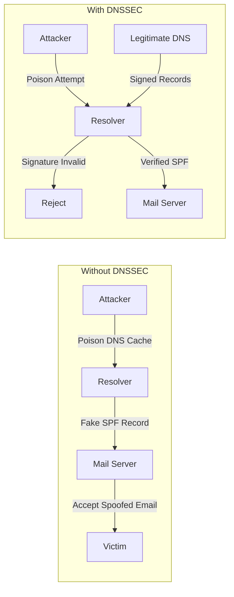
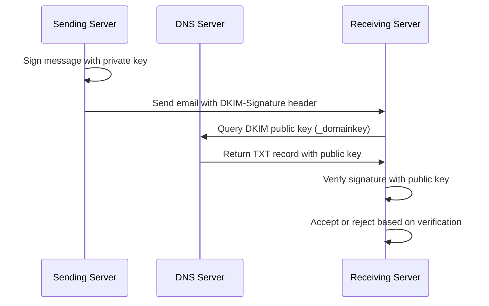
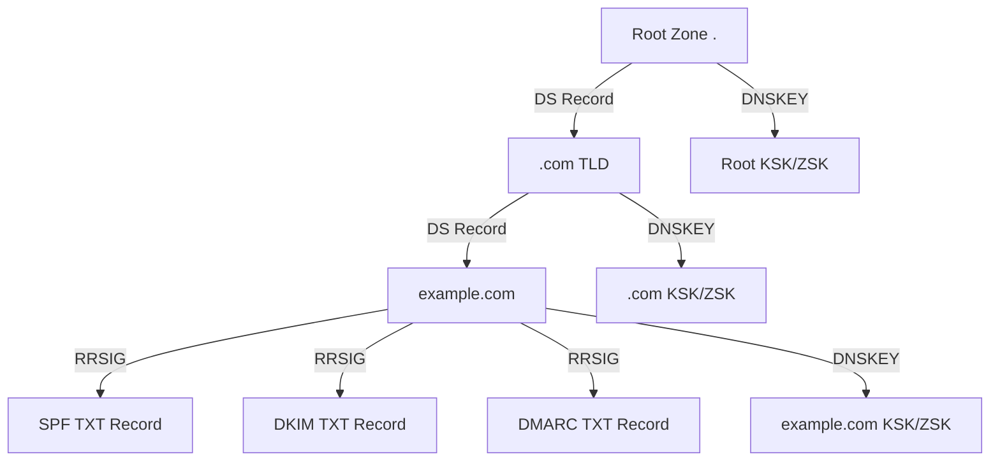

# How to Implement DNSSEC for Email Security (DKIM, DMARC, SPF)

Author: [nawazdhandala](https://github.com/nawazdhandala)

Tags: DNSSEC, Email, Security, DKIM, DMARC, SPF

Description: A comprehensive guide to implementing DNSSEC alongside SPF, DKIM, and DMARC to protect your domain from email spoofing, phishing attacks, and DNS-based vulnerabilities.

---

Email remains the primary attack vector for phishing, business email compromise, and malware distribution. While SPF, DKIM, and DMARC provide essential email authentication, they rely on DNS records that can be spoofed through DNS cache poisoning attacks. DNSSEC adds cryptographic signatures to your DNS records, ensuring that when a receiving mail server queries your SPF, DKIM, or DMARC records, they get authentic, untampered responses.

This guide walks through implementing each layer of email security, from basic DNS records to full DNSSEC integration.

---

## Why Email Authentication Needs DNSSEC

Traditional email authentication has a blind spot: it trusts DNS responses implicitly.



### The Attack Surface

- **DNS cache poisoning**: Attackers inject false DNS records into resolver caches
- **Man-in-the-middle**: Intercepted DNS queries return attacker-controlled responses
- **BGP hijacking**: Traffic rerouted to malicious DNS servers
- **Registrar compromise**: Domain records modified at the source

DNSSEC mitigates all these by cryptographically signing DNS records at the authoritative level.

---

## Understanding the Email Authentication Stack

Before diving into implementation, understand how these technologies work together:

| Technology | Purpose | DNS Record Type | What It Protects |
|------------|---------|-----------------|------------------|
| SPF | Authorize sending servers | TXT | Envelope sender (MAIL FROM) |
| DKIM | Cryptographic message signing | TXT | Message headers and body |
| DMARC | Policy enforcement and reporting | TXT | From header alignment |
| DNSSEC | DNS record integrity | RRSIG, DNSKEY, DS | All DNS lookups |

### How They Chain Together

1. Sending server connects to recipient's mail server
2. Recipient queries SPF record via DNS
3. Recipient queries DKIM public key via DNS
4. Recipient queries DMARC policy via DNS
5. With DNSSEC, each DNS response is cryptographically verified
6. Authentication passes only if DNS records are authentic AND policies align

---

## Part 1: Implementing SPF (Sender Policy Framework)

SPF tells receiving servers which IP addresses are authorized to send email for your domain.

### Basic SPF Record Structure

```
v=spf1 [mechanisms] [modifiers] [qualifier]all
```

### SPF Mechanisms Explained

| Mechanism | Description | Example |
|-----------|-------------|---------|
| `ip4` | IPv4 address or CIDR range | `ip4:192.168.1.1` |
| `ip6` | IPv6 address or CIDR range | `ip6:2001:db8::/32` |
| `a` | Domain's A record | `a:mail.example.com` |
| `mx` | Domain's MX records | `mx` |
| `include` | Include another domain's SPF | `include:_spf.google.com` |
| `exists` | Check if domain resolves | `exists:%{i}.spf.example.com` |

### SPF Qualifiers

| Qualifier | Meaning | Result |
|-----------|---------|--------|
| `+` | Pass (default) | Allow |
| `-` | Fail | Reject |
| `~` | SoftFail | Accept but mark |
| `?` | Neutral | No policy |

### Example SPF Records

**Basic setup with Google Workspace:**

```dns
example.com.  IN  TXT  "v=spf1 include:_spf.google.com ~all"
```

**Multiple email providers:**

```dns
example.com.  IN  TXT  "v=spf1 include:_spf.google.com include:sendgrid.net include:amazonses.com ~all"
```

**On-premise mail server with cloud backup:**

```dns
example.com.  IN  TXT  "v=spf1 ip4:203.0.113.0/24 ip4:198.51.100.25 include:_spf.google.com -all"
```

**Enterprise setup with multiple mechanisms:**

```dns
example.com.  IN  TXT  "v=spf1 mx a:mail.example.com ip4:192.0.2.0/24 ip6:2001:db8::/32 include:_spf.google.com include:spf.protection.outlook.com -all"
```

### SPF Lookup Limit

SPF has a 10 DNS lookup limit. Each `include`, `a`, `mx`, and `redirect` counts as one lookup.

**Check your lookup count:**

```bash
# Using dig
dig +short TXT example.com | grep spf

# Using online tools or local scripts
spf-lookup example.com
```

**Flattening SPF to avoid lookup limits:**

Instead of multiple includes, resolve them to IP addresses:

```dns
# Before: 6 lookups
example.com.  IN  TXT  "v=spf1 include:_spf.google.com include:sendgrid.net include:amazonses.com include:spf.mailjet.com ~all"

# After: 0 lookups (flattened)
example.com.  IN  TXT  "v=spf1 ip4:209.85.128.0/17 ip4:74.125.0.0/16 ip4:167.89.0.0/17 ip4:54.240.0.0/18 ip4:87.253.232.0/21 ~all"
```

**Caution**: Flattened records require maintenance when providers change IPs.

### SPF Macros for Dynamic Records

```dns
# Use sender IP in existence check
example.com.  IN  TXT  "v=spf1 exists:%{i}._spf.example.com -all"

# Create individual TXT records for each authorized IP
192.0.2.1._spf.example.com.  IN  TXT  "v=spf1 +all"
192.0.2.2._spf.example.com.  IN  TXT  "v=spf1 +all"
```

### Validating SPF Configuration

```bash
# Query SPF record
dig TXT example.com +short

# Test SPF evaluation
# Using mxtoolbox.com/spf.aspx or command line tools:
spfquery -ip 192.0.2.1 -sender user@example.com
```

---

## Part 2: Implementing DKIM (DomainKeys Identified Mail)

DKIM adds a cryptographic signature to email headers, proving the message hasn't been modified in transit.

### DKIM Architecture



### DKIM Key Generation

**Generate a 2048-bit RSA key pair:**

```bash
# Generate private key
openssl genrsa -out dkim_private.pem 2048

# Extract public key
openssl rsa -in dkim_private.pem -pubout -out dkim_public.pem

# Format public key for DNS (remove headers and newlines)
cat dkim_public.pem | grep -v "PUBLIC KEY" | tr -d '\n'
```

**Example output:**

```
MIIBIjANBgkqhkiG9w0BAQEFAAOCAQ8AMIIBCgKCAQEA3x7...base64...IDAQAB
```

### DKIM DNS Record Structure

```dns
selector._domainkey.example.com.  IN  TXT  "v=DKIM1; k=rsa; p=PUBLIC_KEY_HERE"
```

**DKIM record fields:**

| Field | Required | Description |
|-------|----------|-------------|
| `v` | Yes | Version (always DKIM1) |
| `k` | No | Key type (rsa, ed25519) |
| `p` | Yes | Public key (base64) |
| `h` | No | Hash algorithms (sha256) |
| `s` | No | Service type (email, *) |
| `t` | No | Flags (y=testing, s=strict) |

### DKIM Selector Naming Conventions

```dns
# Date-based selectors (recommended for rotation)
202601._domainkey.example.com.  IN  TXT  "v=DKIM1; k=rsa; p=..."

# Provider-based selectors
google._domainkey.example.com.  IN  TXT  "v=DKIM1; k=rsa; p=..."
sendgrid._domainkey.example.com.  IN  TXT  "v=DKIM1; k=rsa; p=..."

# Environment-based selectors
prod._domainkey.example.com.  IN  TXT  "v=DKIM1; k=rsa; p=..."
staging._domainkey.example.com.  IN  TXT  "v=DKIM1; k=rsa; p=..."
```

### DKIM Records for Major Email Providers

**Google Workspace:**

```dns
google._domainkey.example.com.  IN  TXT  "v=DKIM1; k=rsa; p=MIGfMA0GCSqGSIb3DQEBAQUAA4GNADCBiQKBgQC..."
```

**Microsoft 365:**

```dns
selector1._domainkey.example.com.  IN  CNAME  selector1-example-com._domainkey.example.onmicrosoft.com.
selector2._domainkey.example.com.  IN  CNAME  selector2-example-com._domainkey.example.onmicrosoft.com.
```

**Amazon SES:**

```dns
xxxxxxxx._domainkey.example.com.  IN  CNAME  xxxxxxxx.dkim.amazonses.com.
```

**SendGrid:**

```dns
s1._domainkey.example.com.  IN  CNAME  s1.domainkey.u12345.wl.sendgrid.net.
s2._domainkey.example.com.  IN  CNAME  s2.domainkey.u12345.wl.sendgrid.net.
```

### Handling Long DKIM Keys

DNS TXT records have a 255-character limit per string. Split long keys:

```dns
selector._domainkey.example.com.  IN  TXT  (
    "v=DKIM1; k=rsa; p=MIIBIjANBgkqhkiG9w0BAQEFAAOCAQ8AMIIBCgKCAQEA"
    "3x7SDpGSfcwPQ4/uP4FVsqLuDQxGMEBzlSwsR6L5V+Xz"
    "FIRST_PART_OF_KEY_HERE"
    "SECOND_PART_OF_KEY_HERE"
    "REMAINING_KEY_IDAQAB" )
```

### DKIM Signature Header Example

```
DKIM-Signature: v=1; a=rsa-sha256; c=relaxed/relaxed;
    d=example.com; s=202601;
    h=from:to:subject:date:message-id;
    bh=uI/CwYsNAJLjQk/6F3bVRnLWkVeJAyqHq3gVxQxJfX0=;
    b=XYZ123...signature...ABC789=
```

### DKIM Key Rotation Strategy

```bash
#!/bin/bash
# DKIM key rotation script

DOMAIN="example.com"
NEW_SELECTOR="$(date +%Y%m)"
OLD_SELECTOR="$(date -d '-1 month' +%Y%m)"

# Generate new key pair
openssl genrsa -out /etc/dkim/${NEW_SELECTOR}.private 2048
openssl rsa -in /etc/dkim/${NEW_SELECTOR}.private -pubout -out /etc/dkim/${NEW_SELECTOR}.public

# Output DNS record
PUBLIC_KEY=$(cat /etc/dkim/${NEW_SELECTOR}.public | grep -v "PUBLIC KEY" | tr -d '\n')
echo "Add this DNS record:"
echo "${NEW_SELECTOR}._domainkey.${DOMAIN}. IN TXT \"v=DKIM1; k=rsa; p=${PUBLIC_KEY}\""

# Wait for DNS propagation (run separately after DNS update)
echo "After DNS propagation, update mail server to use new selector: ${NEW_SELECTOR}"
echo "Keep old selector ${OLD_SELECTOR} for 7 days to handle in-flight messages"
```

### Validating DKIM Configuration

```bash
# Query DKIM record
dig TXT selector._domainkey.example.com +short

# Verify DKIM is working
# Send test email to: check-auth@verifier.port25.com
# Or use: mail-tester.com
```

---

## Part 3: Implementing DMARC (Domain-based Message Authentication)

DMARC ties SPF and DKIM together with a policy that tells receivers what to do when authentication fails.

### DMARC Policy Options

| Policy | Action | Use Case |
|--------|--------|----------|
| `p=none` | Monitor only | Initial deployment |
| `p=quarantine` | Send to spam | Testing phase |
| `p=reject` | Block delivery | Full enforcement |

### DMARC Record Structure

```dns
_dmarc.example.com.  IN  TXT  "v=DMARC1; p=policy; [options]"
```

### DMARC Tags Reference

| Tag | Required | Description | Example |
|-----|----------|-------------|---------|
| `v` | Yes | Version | `v=DMARC1` |
| `p` | Yes | Policy for domain | `p=reject` |
| `sp` | No | Policy for subdomains | `sp=quarantine` |
| `rua` | No | Aggregate report URI | `rua=mailto:dmarc@example.com` |
| `ruf` | No | Forensic report URI | `ruf=mailto:forensic@example.com` |
| `pct` | No | Percentage to apply policy | `pct=50` |
| `adkim` | No | DKIM alignment mode | `adkim=s` (strict) |
| `aspf` | No | SPF alignment mode | `aspf=r` (relaxed) |
| `fo` | No | Failure reporting options | `fo=1` |
| `rf` | No | Report format | `rf=afrf` |
| `ri` | No | Report interval (seconds) | `ri=86400` |

### DMARC Alignment Modes

**Relaxed alignment (default):**
- SPF: Organizational domain matches
- DKIM: Organizational domain matches

**Strict alignment:**
- SPF: Exact domain match required
- DKIM: Exact domain match required

```dns
# Relaxed (mail.example.com aligns with example.com)
_dmarc.example.com.  IN  TXT  "v=DMARC1; p=reject; adkim=r; aspf=r"

# Strict (only example.com matches example.com)
_dmarc.example.com.  IN  TXT  "v=DMARC1; p=reject; adkim=s; aspf=s"
```

### DMARC Deployment Phases

**Phase 1: Monitor mode (2-4 weeks)**

```dns
_dmarc.example.com.  IN  TXT  "v=DMARC1; p=none; rua=mailto:dmarc-reports@example.com; ruf=mailto:dmarc-forensic@example.com"
```

**Phase 2: Quarantine with percentage (2-4 weeks)**

```dns
_dmarc.example.com.  IN  TXT  "v=DMARC1; p=quarantine; pct=25; rua=mailto:dmarc-reports@example.com"
```

**Phase 3: Increase quarantine percentage**

```dns
_dmarc.example.com.  IN  TXT  "v=DMARC1; p=quarantine; pct=50; rua=mailto:dmarc-reports@example.com"
```

**Phase 4: Full quarantine**

```dns
_dmarc.example.com.  IN  TXT  "v=DMARC1; p=quarantine; pct=100; rua=mailto:dmarc-reports@example.com"
```

**Phase 5: Reject policy (final)**

```dns
_dmarc.example.com.  IN  TXT  "v=DMARC1; p=reject; rua=mailto:dmarc-reports@example.com; ruf=mailto:dmarc-forensic@example.com"
```

### Enterprise DMARC Record Example

```dns
_dmarc.example.com.  IN  TXT  "v=DMARC1; p=reject; sp=reject; adkim=s; aspf=s; pct=100; rua=mailto:dmarc-aggregate@example.com,mailto:example@dmarc-service.com; ruf=mailto:dmarc-forensic@example.com; fo=1; ri=86400"
```

### Subdomain DMARC Policies

```dns
# Main domain: strict reject
_dmarc.example.com.  IN  TXT  "v=DMARC1; p=reject; sp=reject"

# Marketing subdomain: separate policy
_dmarc.marketing.example.com.  IN  TXT  "v=DMARC1; p=quarantine"

# Development: no policy
_dmarc.dev.example.com.  IN  TXT  "v=DMARC1; p=none"
```

### DMARC Report Parsing

Aggregate reports are XML. Here's a basic parser:

```python
#!/usr/bin/env python3
"""Parse DMARC aggregate reports"""

import xml.etree.ElementTree as ET
import gzip
import sys
from collections import defaultdict

def parse_dmarc_report(filename):
    """Parse a DMARC aggregate report XML file"""

    # Handle gzipped files
    if filename.endswith('.gz'):
        with gzip.open(filename, 'rt') as f:
            tree = ET.parse(f)
    else:
        tree = ET.parse(filename)

    root = tree.getroot()

    # Extract report metadata
    org_name = root.find('.//org_name').text
    date_begin = root.find('.//date_range/begin').text
    date_end = root.find('.//date_range/end').text

    print(f"Report from: {org_name}")
    print(f"Period: {date_begin} - {date_end}")
    print("-" * 50)

    # Parse records
    results = defaultdict(lambda: {'pass': 0, 'fail': 0})

    for record in root.findall('.//record'):
        source_ip = record.find('.//source_ip').text
        count = int(record.find('.//count').text)

        dkim_result = record.find('.//dkim').text if record.find('.//dkim') is not None else 'none'
        spf_result = record.find('.//spf').text if record.find('.//spf') is not None else 'none'

        disposition = record.find('.//disposition').text

        if dkim_result == 'pass' and spf_result == 'pass':
            results[source_ip]['pass'] += count
        else:
            results[source_ip]['fail'] += count
            print(f"FAIL: {source_ip} - Count: {count}, DKIM: {dkim_result}, SPF: {spf_result}, Action: {disposition}")

    # Summary
    total_pass = sum(r['pass'] for r in results.values())
    total_fail = sum(r['fail'] for r in results.values())

    print("-" * 50)
    print(f"Total Pass: {total_pass}")
    print(f"Total Fail: {total_fail}")
    print(f"Pass Rate: {total_pass / (total_pass + total_fail) * 100:.2f}%")

if __name__ == "__main__":
    if len(sys.argv) != 2:
        print("Usage: python parse_dmarc.py report.xml")
        sys.exit(1)
    parse_dmarc_report(sys.argv[1])
```

---

## Part 4: Implementing DNSSEC

DNSSEC adds cryptographic signatures to DNS records, preventing tampering and cache poisoning.

### DNSSEC Key Types

| Key Type | Purpose | Recommended Algorithm |
|----------|---------|----------------------|
| KSK (Key Signing Key) | Signs DNSKEY records | ECDSAP256SHA256 (13) |
| ZSK (Zone Signing Key) | Signs zone records | ECDSAP256SHA256 (13) |

### DNSSEC Record Types

| Record | Purpose |
|--------|---------|
| DNSKEY | Contains public keys |
| RRSIG | Signature for each record set |
| DS | Delegation Signer (child zone fingerprint) |
| NSEC/NSEC3 | Authenticated denial of existence |

### DNSSEC Chain of Trust



### Enabling DNSSEC with BIND

**Generate zone signing keys:**

```bash
# Create key directory
mkdir -p /etc/bind/keys
cd /etc/bind/keys

# Generate KSK (Key Signing Key)
dnssec-keygen -a ECDSAP256SHA256 -f KSK -n ZONE example.com

# Generate ZSK (Zone Signing Key)
dnssec-keygen -a ECDSAP256SHA256 -n ZONE example.com
```

**Configure named.conf:**

```
options {
    dnssec-validation auto;
    dnssec-enable yes;
};

zone "example.com" {
    type master;
    file "/etc/bind/zones/example.com.zone";
    key-directory "/etc/bind/keys";
    auto-dnssec maintain;
    inline-signing yes;
};
```

**Sign the zone:**

```bash
# Sign zone manually (if not using auto-dnssec)
dnssec-signzone -A -3 $(head -c 1000 /dev/urandom | sha1sum | cut -b 1-16) \
    -N INCREMENT -o example.com -t example.com.zone

# Reload BIND
rndc reload example.com
```

### Enabling DNSSEC with PowerDNS

**Enable DNSSEC in configuration:**

```
# pdns.conf
dnssec=yes
default-ksk-algorithm=ecdsa256
default-zsk-algorithm=ecdsa256
```

**Secure a zone:**

```bash
# Secure the zone
pdnsutil secure-zone example.com

# Show DS record for registrar
pdnsutil show-zone example.com

# Verify zone
pdnsutil check-zone example.com
```

### Enabling DNSSEC with Cloud Providers

**AWS Route 53:**

```bash
# Enable DNSSEC signing
aws route53 create-key-signing-key \
    --hosted-zone-id Z1234567890ABC \
    --key-signing-key-name example-ksk \
    --status ACTIVE \
    --key-management-service-arn arn:aws:kms:us-east-1:123456789012:key/example-key

# Enable DNSSEC for zone
aws route53 enable-hosted-zone-dnssec \
    --hosted-zone-id Z1234567890ABC

# Get DS record for registrar
aws route53 get-dnssec \
    --hosted-zone-id Z1234567890ABC
```

**Cloudflare:**

```bash
# Enable via API
curl -X PATCH "https://api.cloudflare.com/client/v4/zones/{zone_id}/dnssec" \
    -H "Authorization: Bearer {api_token}" \
    -H "Content-Type: application/json" \
    --data '{"status":"active"}'

# Get DS record
curl -X GET "https://api.cloudflare.com/client/v4/zones/{zone_id}/dnssec" \
    -H "Authorization: Bearer {api_token}"
```

**Google Cloud DNS:**

```bash
# Enable DNSSEC
gcloud dns managed-zones update example-zone --dnssec-state on

# Get DS records
gcloud dns managed-zones describe example-zone --format='value(dnssecConfig.dsRecords)'
```

### Publishing DS Record at Registrar

After enabling DNSSEC, you must publish the DS record with your domain registrar:

```
DS Record Format:
example.com. 3600 IN DS 12345 13 2 49FD46E6C4B45C55D4AC69C3C25A6D3C1A23B4F5D6E7F8A9B0C1D2E3F4A5B6C7

Components:
- Key Tag: 12345
- Algorithm: 13 (ECDSAP256SHA256)
- Digest Type: 2 (SHA-256)
- Digest: 49FD46E6C4B45C55D4AC69C3C25A6D3C1A23B4F5D6E7F8A9B0C1D2E3F4A5B6C7
```

### DNSSEC Validation Testing

```bash
# Check if DNSSEC is enabled
dig +dnssec example.com

# Verify DNSSEC chain
dig +trace +dnssec example.com

# Check DS record at parent
dig DS example.com @a.gtld-servers.net

# Use online validators
# - dnsviz.net
# - dnssec-debugger.verisignlabs.com
# - https://dnssec-analyzer.verisignlabs.com/
```

**Using delv for validation:**

```bash
# Validate DNSSEC
delv @8.8.8.8 example.com A +rtrace

# Expected output for valid DNSSEC:
# ; fully validated
# example.com.    300 IN  A   93.184.216.34
# example.com.    300 IN  RRSIG   A 13 2 300 ...
```

---

## Part 5: Complete Implementation Example

### Full Zone File with SPF, DKIM, DMARC, and DNSSEC

```dns
$ORIGIN example.com.
$TTL 3600

; SOA Record
@   IN  SOA ns1.example.com. admin.example.com. (
            2026011501  ; Serial (YYYYMMDDNN)
            7200        ; Refresh (2 hours)
            3600        ; Retry (1 hour)
            1209600     ; Expire (2 weeks)
            3600        ; Minimum TTL
        )

; Name Servers
@       IN  NS      ns1.example.com.
@       IN  NS      ns2.example.com.
ns1     IN  A       192.0.2.1
ns2     IN  A       192.0.2.2

; Mail Servers
@       IN  MX  10  mail.example.com.
@       IN  MX  20  mail-backup.example.com.
mail    IN  A       192.0.2.10
mail-backup IN A    192.0.2.11

; SPF Record
@       IN  TXT     "v=spf1 mx ip4:192.0.2.0/24 include:_spf.google.com -all"

; DKIM Records
202601._domainkey   IN  TXT ( "v=DKIM1; k=rsa; "
    "p=MIIBIjANBgkqhkiG9w0BAQEFAAOCAQ8AMIIBCgKCAQEA"
    "3x7SDpGSfcwPQ4/uP4FVsqLuDQxGMEBzlSwsR6L5V+Xz"
    "Kv0sFmFXGHPW8YkqPnSYNQ7r5H9KLMZ3TQhCv6lZfnJd"
    "PUBLIC_KEY_CONTINUATION_HERE"
    "IDAQAB" )

google._domainkey   IN  TXT "v=DKIM1; k=rsa; p=MIGfMA0GCSqGSIb3DQEBAQUAA4..."

; DMARC Record
_dmarc  IN  TXT     "v=DMARC1; p=reject; sp=reject; adkim=s; aspf=s; rua=mailto:dmarc@example.com; ruf=mailto:forensic@example.com; fo=1"

; MTA-STS (bonus: additional email security)
_mta-sts    IN  TXT "v=STSv1; id=20260115"

; BIMI (bonus: brand indicators)
default._bimi   IN  TXT "v=BIMI1; l=https://example.com/bimi/logo.svg; a=https://example.com/bimi/cert.pem"

; DNSSEC will add these automatically when zone is signed:
; DNSKEY records (KSK and ZSK public keys)
; RRSIG records (signatures for each record set)
; NSEC3 records (authenticated denial of existence)
```

### Verification Commands

```bash
#!/bin/bash
# Email security verification script

DOMAIN="example.com"

echo "=== Email Security Verification for ${DOMAIN} ==="
echo ""

echo "1. SPF Record:"
dig +short TXT ${DOMAIN} | grep "v=spf1"
echo ""

echo "2. DKIM Record (selector: 202601):"
dig +short TXT 202601._domainkey.${DOMAIN}
echo ""

echo "3. DMARC Record:"
dig +short TXT _dmarc.${DOMAIN}
echo ""

echo "4. DNSSEC Status:"
dig +dnssec ${DOMAIN} | grep -E "(RRSIG|flags:.*ad)"
echo ""

echo "5. MX Records:"
dig +short MX ${DOMAIN}
echo ""

echo "6. DANE/TLSA (if configured):"
dig +short TLSA _25._tcp.mail.${DOMAIN}
echo ""

echo "=== Validation Links ==="
echo "- SPF: https://mxtoolbox.com/spf.aspx?domain=${DOMAIN}"
echo "- DKIM: https://mxtoolbox.com/dkim.aspx"
echo "- DMARC: https://mxtoolbox.com/dmarc.aspx?domain=${DOMAIN}"
echo "- DNSSEC: https://dnsviz.net/d/${DOMAIN}/dnssec/"
```

---

## Part 6: Monitoring and Troubleshooting

### Common SPF Issues

| Problem | Symptom | Solution |
|---------|---------|----------|
| Too many lookups | PermError | Flatten includes to IP addresses |
| Missing include | SoftFail/Fail | Add missing provider's SPF |
| Wrong IP range | Fail | Verify sending server IPs |
| No SPF record | None | Create TXT record |

### Common DKIM Issues

| Problem | Symptom | Solution |
|---------|---------|----------|
| Key mismatch | Fail | Regenerate and update DNS |
| Wrong selector | Fail | Verify selector in email headers |
| Truncated key | Fail | Split into multiple strings |
| DNS propagation | PermError | Wait 24-48 hours |

### Common DMARC Issues

| Problem | Symptom | Solution |
|---------|---------|----------|
| Alignment failure | Fail | Check adkim/aspf settings |
| No reports | - | Verify rua email works |
| Subdomain mail fails | Fail | Add sp= policy or subdomain record |
| Third-party senders | Fail | Add to SPF, configure DKIM |

### Common DNSSEC Issues

| Problem | Symptom | Solution |
|---------|---------|----------|
| Expired signatures | SERVFAIL | Re-sign zone or check auto-signing |
| DS record mismatch | Bogus | Update DS at registrar |
| Algorithm rollover | Validation failure | Follow proper rollover procedure |
| Clock skew | Signature invalid | Sync server time (NTP) |

### Monitoring Script

```bash
#!/bin/bash
# Email security monitoring

DOMAIN="${1:-example.com}"
ALERT_EMAIL="admin@${DOMAIN}"

check_spf() {
    SPF=$(dig +short TXT ${DOMAIN} | grep "v=spf1")
    if [ -z "$SPF" ]; then
        echo "CRITICAL: No SPF record found"
        return 1
    fi
    echo "OK: SPF record present"
    return 0
}

check_dkim() {
    SELECTORS="202601 google default"
    for SEL in $SELECTORS; do
        DKIM=$(dig +short TXT ${SEL}._domainkey.${DOMAIN})
        if [ -n "$DKIM" ]; then
            echo "OK: DKIM record found for selector ${SEL}"
            return 0
        fi
    done
    echo "WARNING: No DKIM record found for common selectors"
    return 1
}

check_dmarc() {
    DMARC=$(dig +short TXT _dmarc.${DOMAIN})
    if [ -z "$DMARC" ]; then
        echo "CRITICAL: No DMARC record found"
        return 1
    fi

    if echo "$DMARC" | grep -q "p=none"; then
        echo "WARNING: DMARC policy is none (monitoring only)"
        return 1
    fi

    echo "OK: DMARC record present with enforcement"
    return 0
}

check_dnssec() {
    RESULT=$(dig +dnssec ${DOMAIN} 2>&1)
    if echo "$RESULT" | grep -q "ad"; then
        echo "OK: DNSSEC validated (AD flag set)"
        return 0
    fi

    if echo "$RESULT" | grep -q "RRSIG"; then
        echo "WARNING: DNSSEC signatures present but not validating"
        return 1
    fi

    echo "WARNING: DNSSEC not enabled"
    return 1
}

echo "=== Email Security Check: ${DOMAIN} ==="
echo "Date: $(date)"
echo ""

ERRORS=0

check_spf || ((ERRORS++))
check_dkim || ((ERRORS++))
check_dmarc || ((ERRORS++))
check_dnssec || ((ERRORS++))

echo ""
if [ $ERRORS -gt 0 ]; then
    echo "RESULT: ${ERRORS} issue(s) found"
    exit 1
else
    echo "RESULT: All checks passed"
    exit 0
fi
```

---

## Summary Table: Complete Email Security Stack

| Layer | Record Type | Location | Purpose | Example |
|-------|-------------|----------|---------|---------|
| **SPF** | TXT | `example.com` | Authorize sending IPs | `v=spf1 include:_spf.google.com -all` |
| **DKIM** | TXT | `selector._domainkey.example.com` | Sign messages | `v=DKIM1; k=rsa; p=...` |
| **DMARC** | TXT | `_dmarc.example.com` | Policy and reporting | `v=DMARC1; p=reject; rua=...` |
| **DNSSEC** | DNSKEY, RRSIG, DS | Zone-wide | Cryptographic DNS validation | Automatic with signing |
| **MTA-STS** | TXT | `_mta-sts.example.com` | Enforce TLS for mail | `v=STSv1; id=20260115` |
| **DANE/TLSA** | TLSA | `_25._tcp.mail.example.com` | Certificate pinning | `3 1 1 abc123...` |
| **BIMI** | TXT | `default._bimi.example.com` | Brand logo in inbox | `v=BIMI1; l=https://...` |

---

## Implementation Checklist

### Phase 1: Baseline (Week 1)

- [ ] Audit existing email infrastructure
- [ ] Identify all legitimate sending sources
- [ ] Document current mail flows

### Phase 2: SPF (Week 2)

- [ ] Create SPF record with all authorized senders
- [ ] Verify lookup count is under 10
- [ ] Test with SPF validators

### Phase 3: DKIM (Week 3)

- [ ] Generate DKIM key pairs
- [ ] Publish DKIM DNS records
- [ ] Configure mail servers to sign
- [ ] Verify signatures in received mail

### Phase 4: DMARC (Weeks 4-8)

- [ ] Deploy DMARC with p=none
- [ ] Set up aggregate report processing
- [ ] Analyze reports for failures
- [ ] Gradually increase policy strength
- [ ] Deploy p=reject after validation

### Phase 5: DNSSEC (Week 9)

- [ ] Enable DNSSEC on authoritative servers
- [ ] Publish DS record at registrar
- [ ] Verify DNSSEC validation
- [ ] Monitor for signature expiration

### Phase 6: Maintenance (Ongoing)

- [ ] Rotate DKIM keys quarterly
- [ ] Review DMARC reports weekly
- [ ] Monitor DNSSEC signature validity
- [ ] Update SPF when adding senders
- [ ] Document all changes

---

## Conclusion

Email security is a layered defense. SPF authorizes your sending infrastructure, DKIM proves message integrity, DMARC enforces policy, and DNSSEC ensures these DNS records cannot be forged. Implementing all four creates a robust defense against email spoofing and phishing attacks.

Start with monitoring (SPF and DMARC p=none), validate your configuration with aggregate reports, then progressively enforce stricter policies. DNSSEC adds the final layer of trust by cryptographically securing the DNS infrastructure that everything else depends on.

The investment in proper email authentication pays dividends in reduced phishing risk, improved deliverability, and compliance with security frameworks that increasingly require these controls.
