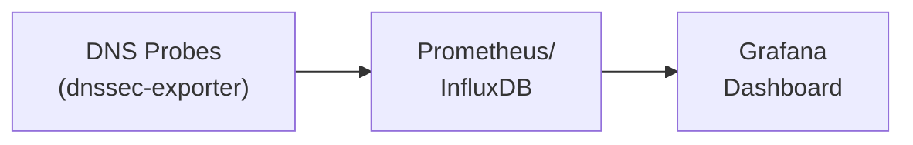

# How to Build a DNSSEC Health Dashboard with Grafana

Author: [nawazdhandala](https://github.com/nawazdhandala)

Tags: DNSSEC, Grafana, Monitoring, Dashboard, DNS, Visualization

Description: A comprehensive guide to building a real-time DNSSEC health monitoring dashboard with Grafana, including data collection, panel configurations, alerting, and best practices.

---

DNSSEC protects your domains from DNS spoofing and cache poisoning attacks. But signing your zones is only half the battle. Without proper monitoring, you won't know when keys expire, signatures become invalid, or validation chains break until users start complaining.

This guide walks you through building a comprehensive DNSSEC health dashboard in Grafana.

## Why Monitor DNSSEC?

DNSSEC failures are silent killers. When DNSSEC validation fails:
- Resolvers return SERVFAIL instead of actual records
- Users see "DNS server not responding" errors
- Your uptime goes from 99.9% to zero in affected regions

Common failure scenarios:
- **Key expiration**: KSK or ZSK expires without rotation
- **Signature expiration**: RRSIG records exceed their validity period
- **Chain of trust breaks**: DS record mismatch between parent and child zones
- **Algorithm rollover failures**: Incomplete or misconfigured algorithm changes

## Architecture Overview



## Prerequisites

1. **Grafana 9.0+** (or Grafana Cloud)
2. **Data source**: Prometheus or InfluxDB
3. **DNSSEC metrics collector**
4. **Domains to monitor**

## Setting Up DNSSEC Metrics Collection

### Option 1: Prometheus with dnssec_exporter

```bash
# Install and configure dnssec_exporter
cat > config.yaml << 'EOF'
domains:
  - name: example.com
    resolver: 8.8.8.8
  - name: yourdomain.com
    resolver: 1.1.1.1
check_interval: 60s
EOF

./dnssec_exporter --config=config.yaml --listen=:9204
```

Add to Prometheus:

```yaml
scrape_configs:
  - job_name: 'dnssec'
    static_configs:
      - targets: ['localhost:9204']
    scrape_interval: 60s
```

### Option 2: Custom Script with Telegraf

```bash
#!/bin/bash
# dnssec_check.sh

DOMAINS=("example.com" "yourdomain.com")
RESOLVER="8.8.8.8"

for domain in "${DOMAINS[@]}"; do
    dnskey_count=$(dig DNSKEY "$domain" +short @"$RESOLVER" | wc -l)
    rrsig=$(dig RRSIG "$domain" @"$RESOLVER" +short | head -1)

    if [ -n "$rrsig" ]; then
        expiry=$(echo "$rrsig" | awk '{print $5}')
        expiry_epoch=$(date -d "${expiry:0:4}-${expiry:4:2}-${expiry:6:2}" +%s 2>/dev/null || echo 0)
        days_until_expiry=$(( (expiry_epoch - $(date +%s)) / 86400 ))
    else
        days_until_expiry=-1
    fi

    validation_result=$(dig +dnssec "$domain" @"$RESOLVER")
    [[ "$validation_result" =~ "ad" ]] && valid=1 || valid=0

    ds_count=$(dig DS "$domain" +short @"$RESOLVER" | wc -l)

    echo "dnssec,domain=$domain valid=${valid}i,dnskey_count=${dnskey_count}i,ds_count=${ds_count}i,days_until_expiry=${days_until_expiry}i"
done
```

## Building the Grafana Dashboard

### Panel 1: Overall DNSSEC Health Status

**Prometheus Query:**
```promql
sum(dnssec_valid{job="dnssec"}) / count(dnssec_valid{job="dnssec"}) * 100
```

**Panel Configuration:**
```json
{
  "type": "stat",
  "title": "Overall DNSSEC Health",
  "gridPos": { "x": 0, "y": 0, "w": 6, "h": 4 },
  "fieldConfig": {
    "defaults": {
      "unit": "percent",
      "thresholds": {
        "steps": [
          { "color": "red", "value": null },
          { "color": "yellow", "value": 90 },
          { "color": "green", "value": 100 }
        ]
      }
    }
  }
}
```

### Panel 2: Domain Validation Status Table

**Prometheus Query:**
```promql
dnssec_valid{job="dnssec"}
```

**Panel Configuration:**
```json
{
  "type": "table",
  "title": "Domain DNSSEC Status",
  "gridPos": { "x": 6, "y": 0, "w": 18, "h": 8 },
  "fieldConfig": {
    "overrides": [{
      "matcher": { "id": "byName", "options": "valid" },
      "properties": [{
        "id": "mappings",
        "value": [
          { "type": "value", "options": { "1": { "text": "Valid", "color": "green" } } },
          { "type": "value", "options": { "0": { "text": "Invalid", "color": "red" } } }
        ]
      }]
    }]
  }
}
```

### Panel 3: RRSIG Expiration Timeline

**Prometheus Query:**
```promql
dnssec_rrsig_expiry_days{job="dnssec"}
```

**Panel Configuration:**
```json
{
  "type": "timeseries",
  "title": "RRSIG Expiration Timeline",
  "gridPos": { "x": 0, "y": 8, "w": 12, "h": 8 },
  "fieldConfig": {
    "defaults": {
      "unit": "d",
      "thresholds": {
        "steps": [
          { "color": "red", "value": null },
          { "color": "yellow", "value": 7 },
          { "color": "green", "value": 14 }
        ]
      }
    }
  }
}
```

### Panel 4: DNS Response Time

**Prometheus Query:**
```promql
histogram_quantile(0.95, sum(rate(dnssec_query_duration_seconds_bucket[5m])) by (le, domain))
```

**Panel Configuration:**
```json
{
  "type": "timeseries",
  "title": "DNS Response Time (DNSSEC Queries)",
  "gridPos": { "x": 12, "y": 8, "w": 12, "h": 8 },
  "fieldConfig": {
    "defaults": {
      "unit": "ms",
      "thresholds": {
        "steps": [
          { "color": "green", "value": null },
          { "color": "yellow", "value": 100 },
          { "color": "red", "value": 500 }
        ]
      }
    }
  }
}
```

### Panel 5: DNSKEY and DS Record Counts

**Prometheus Query:**
```promql
dnssec_dnskey_count{job="dnssec"}
```

**Panel Configuration:**
```json
{
  "type": "timeseries",
  "title": "DNSKEY and DS Record Counts",
  "gridPos": { "x": 0, "y": 16, "w": 12, "h": 8 },
  "fieldConfig": {
    "defaults": {
      "unit": "short",
      "custom": { "drawStyle": "bars", "fillOpacity": 80 }
    }
  }
}
```

### Panel 6: Validation Failures Over Time

**Prometheus Query:**
```promql
sum(rate(dnssec_validation_failures_total{job="dnssec"}[5m])) by (domain)
```

**Panel Configuration:**
```json
{
  "type": "timeseries",
  "title": "DNSSEC Validation Failures",
  "gridPos": { "x": 12, "y": 16, "w": 12, "h": 8 },
  "fieldConfig": {
    "defaults": {
      "thresholds": {
        "steps": [
          { "color": "green", "value": null },
          { "color": "red", "value": 1 }
        ]
      }
    }
  }
}
```

### Panel 7: Chain of Trust Status

**Prometheus Query:**
```promql
dnssec_chain_valid{job="dnssec"}
```

**Panel Configuration:**
```json
{
  "type": "gauge",
  "title": "Chain of Trust Status",
  "gridPos": { "x": 0, "y": 24, "w": 12, "h": 8 },
  "fieldConfig": {
    "defaults": {
      "unit": "percentunit",
      "min": 0,
      "max": 1,
      "thresholds": {
        "steps": [
          { "color": "red", "value": null },
          { "color": "yellow", "value": 0.9 },
          { "color": "green", "value": 1 }
        ]
      }
    }
  }
}
```

## Setting Up Alerts

### Alert 1: DNSSEC Validation Failure

```yaml
groups:
  - name: dnssec_alerts
    rules:
      - alert: DNSSECValidationFailure
        expr: dnssec_valid{job="dnssec"} == 0
        for: 5m
        labels:
          severity: critical
        annotations:
          summary: "DNSSEC validation failed for {{ $labels.domain }}"
          description: "Domain {{ $labels.domain }} has been failing DNSSEC validation for more than 5 minutes."
```

### Alert 2: RRSIG Expiration Warning

```yaml
- alert: DNSSECSignatureExpiring
  expr: dnssec_rrsig_expiry_days{job="dnssec"} < 7
  for: 1h
  labels:
    severity: warning
  annotations:
    summary: "DNSSEC signatures expiring soon for {{ $labels.domain }}"
    description: "Domain {{ $labels.domain }} has RRSIG records expiring in {{ $value }} days."

- alert: DNSSECSignatureCritical
  expr: dnssec_rrsig_expiry_days{job="dnssec"} < 2
  for: 15m
  labels:
    severity: critical
  annotations:
    summary: "DNSSEC signatures critically low for {{ $labels.domain }}"
```

### Alert 3: DS Record Mismatch

```yaml
- alert: DNSSECDSRecordMissing
  expr: dnssec_ds_count{job="dnssec"} == 0 and dnssec_dnskey_count{job="dnssec"} > 0
  for: 10m
  labels:
    severity: warning
  annotations:
    summary: "Missing DS record for {{ $labels.domain }}"
    description: "Domain {{ $labels.domain }} has DNSKEY records but no DS record at parent zone."
```

### Alert 4: High Query Latency

```yaml
- alert: DNSSECHighLatency
  expr: histogram_quantile(0.95, sum(rate(dnssec_query_duration_seconds_bucket[5m])) by (le, domain)) > 0.5
  for: 10m
  labels:
    severity: warning
  annotations:
    summary: "High DNSSEC query latency for {{ $labels.domain }}"
```

## Multi-Resolver Validation

Monitor DNSSEC from multiple resolver perspectives:

```bash
#!/bin/bash
RESOLVERS=("8.8.8.8:Google" "1.1.1.1:Cloudflare" "9.9.9.9:Quad9")
DOMAIN="$1"

for resolver_info in "${RESOLVERS[@]}"; do
    IFS=':' read -r resolver name <<< "$resolver_info"
    ad_flag=$(dig +dnssec "$DOMAIN" @"$resolver" | grep -c "flags:.*ad")
    [[ "$ad_flag" -gt 0 ]] && valid=1 || valid=0
    echo "dnssec_multi,domain=$DOMAIN,resolver=$name valid=${valid}i"
done
```

## Integration with OneUptime

OneUptime provides built-in DNS monitoring that complements your DNSSEC dashboard:

1. **DNS Monitor Setup**: Create DNS monitors in OneUptime to track availability
2. **Alert Integration**: Forward DNSSEC alerts to OneUptime incident management
3. **Status Page**: Display DNSSEC health on your public status page

```yaml
contact_points:
  - name: oneuptime
    webhook_configs:
      - url: 'https://oneuptime.com/api/v1/webhooks/incoming/YOUR_WEBHOOK_ID'
        send_resolved: true
```

## Summary Tables

### Monitoring Coverage

| What to Monitor | Why | Recommended Interval |
|----------------|-----|---------------------|
| Validation status | Detect failures immediately | 1 minute |
| RRSIG expiration | Plan renewals | 1 hour |
| DS record presence | Chain of trust | 5 minutes |
| Response latency | Performance impact | 1 minute |
| Key counts | Detect rollover issues | 15 minutes |
| Algorithm usage | Security compliance | Daily |

### Alert Thresholds

| Alert | Warning Threshold | Critical Threshold |
|-------|------------------|-------------------|
| RRSIG Expiration | 7 days | 2 days |
| Validation Failure | 1 failure | 5 minutes continuous |
| Response Latency | 200ms | 500ms |
| DS Record Missing | 10 minutes | 30 minutes |

### Retention Policies

| Metric Type | Hot Retention | Warm Retention | Cold Retention |
|-------------|--------------|----------------|----------------|
| Validation status | 7 days | 30 days | 1 year |
| Response times | 7 days | 30 days | 90 days |
| Key counts | 30 days | 90 days | 2 years |
| Event logs | 30 days | 90 days | 1 year |

## Troubleshooting Common Issues

### DNSSEC Validation Failures

```bash
# Debug validation chain
dig +trace +dnssec example.com

# Check specific record types
dig DNSKEY example.com +dnssec
dig DS example.com +dnssec
dig RRSIG example.com +dnssec

# Verify chain of trust
delv @8.8.8.8 example.com +rtrace
```

### Signature Expiration Analysis

```bash
dig RRSIG example.com +short | while read line; do
    expiry=$(echo "$line" | awk '{print $5}')
    echo "Expires: ${expiry:0:4}-${expiry:4:2}-${expiry:6:2}"
done
```

### DS Record Verification

```bash
# Compare DS at parent with DNSKEY hash
dig DS example.com +short
dig DNSKEY example.com +short | dnssec-dsfromkey -f - example.com
```

## Conclusion

A comprehensive DNSSEC health dashboard provides visibility into your DNS security posture before problems affect users. Key takeaways:

1. **Automate collection**: Use exporters or custom scripts to gather DNSSEC metrics continuously
2. **Visualize holistically**: Combine validation status, expiration timelines, and performance metrics
3. **Alert proactively**: Set thresholds that give you time to react before outages
4. **Test regularly**: Verify your monitoring catches real issues with periodic tests
5. **Document runbooks**: Create playbooks for common DNSSEC issues

DNSSEC monitoring is not optional for production domains. Build this dashboard, integrate it with your incident management workflow, and sleep better knowing you will catch DNS security issues before they become outages.

---

**Related Reading:**
- [Why You Need a Status Page](https://oneuptime.com/blog/post/2025-10-27-why-you-need-a-status-page/view)
- [SRE Metrics to Track](https://oneuptime.com/blog/post/2025-11-28-sre-metrics-to-track/view)
- [Three Pillars of Observability](https://oneuptime.com/blog/post/2025-08-20-three-pillars-of-observability-logs-metrics-traces/view)
