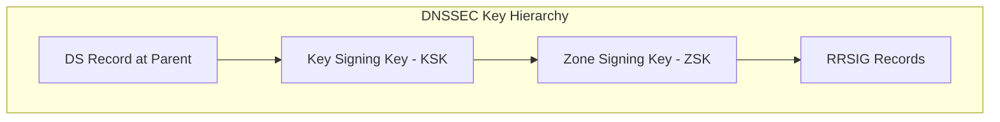
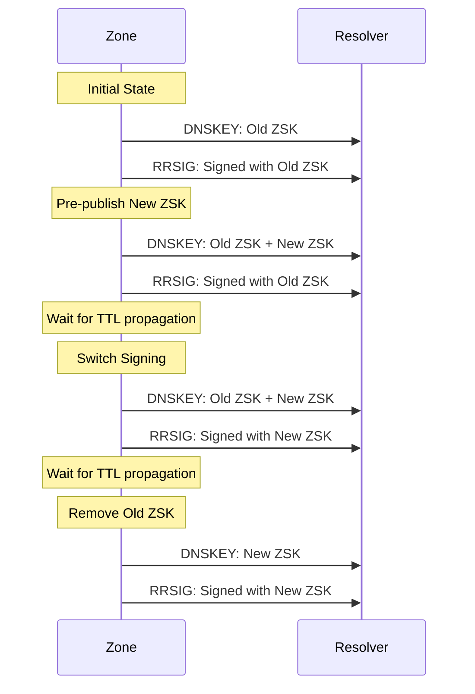
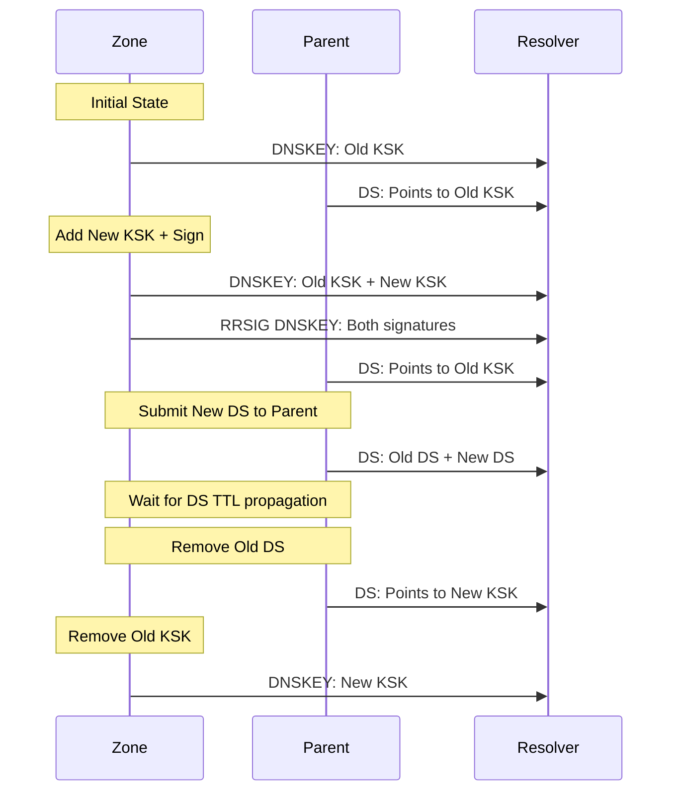

# How to Set Up DNSSEC Key Rollover Automation

Author: [nawazdhandala](https://github.com/nawazdhandala)

Tags: DNSSEC, DNS, Security, Automation, Infrastructure, DevOps

Description: A comprehensive guide to automating DNSSEC key rollovers, including ZSK and KSK procedures, automation scripts, monitoring strategies, and best practices for maintaining DNS security without service disruption.

---

DNSSEC protects your domain from cache poisoning and man-in-the-middle attacks by cryptographically signing DNS records. But those cryptographic keys have a shelf life. Regular key rollovers are essential for maintaining security, yet manual rollovers are error-prone and can cause DNS resolution failures. Automation is the answer.

## Understanding DNSSEC Keys

Before diving into automation, you need to understand the two types of DNSSEC keys and their different rollover requirements.



### Key Signing Key (KSK)

- Signs the DNSKEY record set
- Published as a DS record in the parent zone
- Longer key (2048-4096 bits RSA or 256-384 bits ECDSA)
- Rolled less frequently (annually or less)
- Requires coordination with parent zone (registrar)

### Zone Signing Key (ZSK)

- Signs all other records in the zone
- Not published in parent zone
- Shorter key (1024-2048 bits RSA or 256 bits ECDSA)
- Rolled more frequently (monthly to quarterly)
- Self-contained within your zone

## Rollover Methods

There are three primary methods for DNSSEC key rollovers. Each has trade-offs between complexity, timing, and zone size impact.

### Pre-Publication Method

Best for ZSK rollovers. New key is published before being used.



### Double-Signature Method

Best for KSK rollovers. Both keys sign during transition.



### Double-DS Method

Alternative KSK rollover. DS records updated before key change.

This method publishes the new DS record at the parent before introducing the new KSK. It's simpler but requires careful timing.

## Prerequisites

### Software Requirements

Ensure you have the necessary tools installed:

```bash
# Check BIND version (requires 9.9+)
named -v

# Check for dnssec-keygen
which dnssec-keygen

# Check for dnssec-signzone
which dnssec-signzone

# For automation scripts
which jq
which curl
```

### DNS Infrastructure Check

```bash
# Verify current DNSSEC status
dig +dnssec example.com DNSKEY
dig +dnssec example.com SOA

# Check DS record at parent
dig example.com DS @ns1.parent-zone.com

# Validate DNSSEC chain
delv example.com @8.8.8.8
```

## Manual Key Generation Reference

Understanding manual key generation helps when automating.

### Generate a New ZSK

```bash
#!/bin/bash
ZONE="example.com"
KEY_DIR="/etc/bind/keys"

# Generate ECDSA P-256 ZSK (recommended)
dnssec-keygen -a ECDSAP256SHA256 -n ZONE -K $KEY_DIR $ZONE

# Or RSA 2048-bit ZSK
dnssec-keygen -a RSASHA256 -b 2048 -n ZONE -K $KEY_DIR $ZONE
```

### Generate a New KSK

```bash
#!/bin/bash
ZONE="example.com"
KEY_DIR="/etc/bind/keys"

# Generate ECDSA P-384 KSK (recommended)
dnssec-keygen -a ECDSAP384SHA384 -n ZONE -f KSK -K $KEY_DIR $ZONE

# Or RSA 4096-bit KSK
dnssec-keygen -a RSASHA256 -b 4096 -n ZONE -f KSK -K $KEY_DIR $ZONE
```

## Automated ZSK Rollover with BIND

BIND supports automatic ZSK rollovers with the `auto-dnssec` and `dnssec-policy` features.

### Using dnssec-policy (BIND 9.16+)

The modern approach using `dnssec-policy`:

```named.conf
// /etc/bind/named.conf

dnssec-policy "standard" {
    // Key algorithms
    keys {
        ksk key-directory lifetime unlimited algorithm ecdsap384sha384;
        zsk key-directory lifetime 90d algorithm ecdsap256sha256;
    };

    // Timing parameters
    dnskey-ttl 3600;
    publish-safety 1h;
    retire-safety 1h;
    purge-keys 90d;

    // Signature parameters
    signatures-refresh 5d;
    signatures-validity 14d;
    signatures-validity-dnskey 14d;

    // Parent DS parameters (for KSK)
    parent-ds-ttl 3600;
    parent-propagation-delay 1h;
};

zone "example.com" {
    type primary;
    file "/etc/bind/zones/example.com.zone";
    dnssec-policy "standard";
    inline-signing yes;
};
```

### Using auto-dnssec (Legacy BIND)

For older BIND versions:

```named.conf
// /etc/bind/named.conf

options {
    dnssec-enable yes;
    dnssec-validation yes;
    sig-validity-interval 14 5;
};

zone "example.com" {
    type primary;
    file "/etc/bind/zones/example.com.zone";
    key-directory "/etc/bind/keys";
    auto-dnssec maintain;
    inline-signing yes;
    update-policy local;
};
```

### Key Timing Configuration

Configure key timing with `dnssec-settime`:

```bash
#!/bin/bash
# Set ZSK timing for rollover

ZONE="example.com"
KEY_DIR="/etc/bind/keys"
NEW_KEY="Kexample.com.+013+12345"  # Your new key file basename

# Current time
NOW=$(date +%Y%m%d%H%M%S)

# Calculate timing
PUBLISH=$(date -d "+0 days" +%Y%m%d%H%M%S)
ACTIVATE=$(date -d "+1 day" +%Y%m%d%H%M%S)
INACTIVE=$(date -d "+91 days" +%Y%m%d%H%M%S)
DELETE=$(date -d "+95 days" +%Y%m%d%H%M%S)

# Set key timing
dnssec-settime -K $KEY_DIR \
    -P $PUBLISH \
    -A $ACTIVATE \
    -I $INACTIVE \
    -D $DELETE \
    $NEW_KEY
```

## Automated KSK Rollover Script

KSK rollovers require parent zone coordination. Here's a comprehensive automation script:

```bash
#!/bin/bash
# dnssec-ksk-rollover.sh
# Automated KSK rollover with parent zone notification

set -euo pipefail

# Configuration
ZONE="example.com"
KEY_DIR="/etc/bind/keys"
LOG_FILE="/var/log/dnssec-rollover.log"
REGISTRAR_API="https://api.registrar.com/v1"
API_KEY="${REGISTRAR_API_KEY:-}"

# Logging function
log() {
    echo "[$(date '+%Y-%m-%d %H:%M:%S')] $1" | tee -a "$LOG_FILE"
}

# Verify DNSSEC is working
verify_dnssec() {
    local domain=$1
    log "Verifying DNSSEC for $domain..."

    if delv "$domain" @8.8.8.8 2>&1 | grep -q "fully validated"; then
        log "DNSSEC validation successful"
        return 0
    else
        log "ERROR: DNSSEC validation failed"
        return 1
    fi
}

# Get current KSK
get_current_ksk() {
    local zone=$1
    local key_dir=$2

    # Find active KSK
    for key in "$key_dir"/K"$zone".+*+*.key; do
        if grep -q "257" "$key" 2>/dev/null; then
            # Check if active (not yet inactive)
            local basename=$(basename "$key" .key)
            local inactive=$(dnssec-settime -u -I "$key_dir/$basename" 2>/dev/null | grep "Inactive:" | awk '{print $2}')
            local now=$(date +%s)

            if [[ -z "$inactive" ]] || [[ "$inactive" -gt "$now" ]]; then
                echo "$basename"
                return 0
            fi
        fi
    done
    return 1
}

# Generate new KSK
generate_new_ksk() {
    local zone=$1
    local key_dir=$2

    log "Generating new KSK for $zone..."

    # Generate ECDSA P-384 KSK
    local new_key=$(dnssec-keygen -a ECDSAP384SHA384 -n ZONE -f KSK -K "$key_dir" "$zone" 2>&1)

    if [[ $? -eq 0 ]]; then
        log "Generated new KSK: $new_key"
        echo "$new_key"
        return 0
    else
        log "ERROR: Failed to generate KSK"
        return 1
    fi
}

# Extract DS record from key
extract_ds_record() {
    local key_file=$1

    log "Extracting DS record..."

    # Generate DS record in multiple digest formats
    dnssec-dsfromkey -2 "$key_file"  # SHA-256
}

# Submit DS to registrar via API
submit_ds_to_parent() {
    local ds_record=$1
    local zone=$2

    log "Submitting DS record to registrar..."

    # Parse DS record
    local key_tag=$(echo "$ds_record" | awk '{print $4}')
    local algorithm=$(echo "$ds_record" | awk '{print $5}')
    local digest_type=$(echo "$ds_record" | awk '{print $6}')
    local digest=$(echo "$ds_record" | awk '{print $7}')

    # Submit via registrar API
    local response=$(curl -s -X POST \
        -H "Authorization: Bearer $API_KEY" \
        -H "Content-Type: application/json" \
        -d "{
            \"domain\": \"$zone\",
            \"ds_records\": [{
                \"key_tag\": $key_tag,
                \"algorithm\": $algorithm,
                \"digest_type\": $digest_type,
                \"digest\": \"$digest\"
            }]
        }" \
        "$REGISTRAR_API/domains/$zone/dnssec")

    if echo "$response" | jq -e '.success' > /dev/null 2>&1; then
        log "DS record submitted successfully"
        return 0
    else
        log "ERROR: Failed to submit DS record: $response"
        return 1
    fi
}

# Wait for DS propagation
wait_for_ds_propagation() {
    local zone=$1
    local key_tag=$2
    local max_wait=86400  # 24 hours
    local check_interval=300  # 5 minutes
    local waited=0

    log "Waiting for DS record propagation (key tag: $key_tag)..."

    while [[ $waited -lt $max_wait ]]; do
        # Check if DS is visible at multiple resolvers
        local found=0

        for resolver in "8.8.8.8" "1.1.1.1" "9.9.9.9"; do
            if dig DS "$zone" @"$resolver" +short | grep -q "^$key_tag "; then
                ((found++))
            fi
        done

        if [[ $found -ge 2 ]]; then
            log "DS record propagated to public resolvers"
            return 0
        fi

        log "DS not yet propagated, waiting ${check_interval}s..."
        sleep $check_interval
        ((waited += check_interval))
    done

    log "ERROR: DS propagation timeout"
    return 1
}

# Remove old DS from registrar
remove_old_ds() {
    local zone=$1
    local old_key_tag=$2

    log "Removing old DS record (key tag: $old_key_tag)..."

    local response=$(curl -s -X DELETE \
        -H "Authorization: Bearer $API_KEY" \
        "$REGISTRAR_API/domains/$zone/dnssec/$old_key_tag")

    if echo "$response" | jq -e '.success' > /dev/null 2>&1; then
        log "Old DS record removed successfully"
        return 0
    else
        log "WARNING: Failed to remove old DS record: $response"
        return 1
    fi
}

# Set key timing for rollover
set_ksk_timing() {
    local key_dir=$1
    local old_key=$2
    local new_key=$3

    log "Setting key timing..."

    # New key timing
    local publish_time=$(date +%Y%m%d%H%M%S)
    local activate_time=$(date -d "+2 days" +%Y%m%d%H%M%S)

    dnssec-settime -K "$key_dir" \
        -P "$publish_time" \
        -A "$activate_time" \
        "$new_key"

    # Old key timing
    local inactive_time=$(date -d "+7 days" +%Y%m%d%H%M%S)
    local delete_time=$(date -d "+14 days" +%Y%m%d%H%M%S)

    dnssec-settime -K "$key_dir" \
        -I "$inactive_time" \
        -D "$delete_time" \
        "$old_key"

    log "Key timing configured"
}

# Reload BIND
reload_bind() {
    log "Reloading BIND..."

    if rndc reload "$ZONE" 2>&1; then
        log "BIND reloaded successfully"
        return 0
    else
        log "ERROR: Failed to reload BIND"
        return 1
    fi
}

# Main rollover procedure
main() {
    log "=========================================="
    log "Starting KSK rollover for $ZONE"
    log "=========================================="

    # Step 1: Verify current DNSSEC
    verify_dnssec "$ZONE" || exit 1

    # Step 2: Get current KSK
    local old_ksk=$(get_current_ksk "$ZONE" "$KEY_DIR")
    if [[ -z "$old_ksk" ]]; then
        log "ERROR: No active KSK found"
        exit 1
    fi
    log "Current KSK: $old_ksk"

    # Step 3: Generate new KSK
    local new_ksk=$(generate_new_ksk "$ZONE" "$KEY_DIR")
    if [[ -z "$new_ksk" ]]; then
        exit 1
    fi

    # Step 4: Set key timing
    set_ksk_timing "$KEY_DIR" "$old_ksk" "$new_ksk"

    # Step 5: Reload BIND to publish new KSK
    reload_bind || exit 1

    # Step 6: Wait for DNSKEY TTL
    log "Waiting for DNSKEY TTL propagation..."
    sleep 7200  # 2 hours

    # Step 7: Extract and submit new DS
    local ds_record=$(extract_ds_record "$KEY_DIR/$new_ksk.key")
    local new_key_tag=$(echo "$ds_record" | awk '{print $4}')

    submit_ds_to_parent "$ds_record" "$ZONE" || exit 1

    # Step 8: Wait for DS propagation
    wait_for_ds_propagation "$ZONE" "$new_key_tag" || exit 1

    # Step 9: Get old key tag
    local old_key_tag=$(dnssec-dsfromkey -2 "$KEY_DIR/$old_ksk.key" | awk '{print $4}')

    # Step 10: Wait for old DS TTL before removal
    log "Waiting for old DS TTL before removal..."
    sleep 86400  # 24 hours

    # Step 11: Remove old DS
    remove_old_ds "$ZONE" "$old_key_tag"

    # Step 12: Verify DNSSEC still works
    sleep 3600  # Wait 1 hour
    verify_dnssec "$ZONE" || {
        log "ERROR: DNSSEC validation failed after rollover!"
        exit 1
    }

    log "=========================================="
    log "KSK rollover completed successfully"
    log "=========================================="
}

# Run main
main "$@"
```

## PowerDNS DNSSEC Automation

PowerDNS has built-in DNSSEC key management. Here's how to automate it:

### Enable DNSSEC with pdnsutil

```bash
#!/bin/bash
# powerdns-dnssec-setup.sh

ZONE="example.com"

# Secure zone with DNSSEC
pdnsutil secure-zone $ZONE

# Set algorithm preference
pdnsutil set-nsec3 $ZONE '1 0 1 ab'

# Display DS records for parent
pdnsutil show-zone $ZONE
pdnsutil ds-hash $ZONE
```

### Automated ZSK Rollover for PowerDNS

```bash
#!/bin/bash
# powerdns-zsk-rollover.sh

set -euo pipefail

ZONE="example.com"
LOG="/var/log/pdns-rollover.log"

log() {
    echo "[$(date '+%Y-%m-%d %H:%M:%S')] $1" | tee -a "$LOG"
}

# Get active ZSK key IDs
get_zsk_ids() {
    pdnsutil show-zone "$ZONE" | grep -E "ID = .* \(ZSK\)" | grep "Active" | awk -F'=' '{print $2}' | awk '{print $1}'
}

# Add new ZSK
add_new_zsk() {
    log "Adding new ZSK..."
    pdnsutil add-zone-key "$ZONE" zsk active 256
}

# Deactivate old ZSK
deactivate_old_zsk() {
    local key_id=$1
    log "Deactivating ZSK $key_id..."
    pdnsutil deactivate-zone-key "$ZONE" "$key_id"
}

# Remove old ZSK
remove_old_zsk() {
    local key_id=$1
    log "Removing ZSK $key_id..."
    pdnsutil remove-zone-key "$ZONE" "$key_id"
}

# Rectify zone
rectify_zone() {
    log "Rectifying zone..."
    pdnsutil rectify-zone "$ZONE"
}

main() {
    log "Starting ZSK rollover for $ZONE"

    # Get current ZSKs
    local old_zsks=$(get_zsk_ids)
    log "Current ZSKs: $old_zsks"

    # Add new ZSK
    add_new_zsk
    rectify_zone

    # Wait for propagation
    log "Waiting for propagation..."
    sleep 86400  # 24 hours

    # Deactivate old ZSKs
    for key_id in $old_zsks; do
        deactivate_old_zsk "$key_id"
    done
    rectify_zone

    # Wait before removal
    sleep 86400  # Another 24 hours

    # Remove old ZSKs
    for key_id in $old_zsks; do
        remove_old_zsk "$key_id"
    done
    rectify_zone

    log "ZSK rollover completed"
}

main
```

## Knot DNS DNSSEC Automation

Knot DNS has excellent automatic DNSSEC support:

### Knot DNS Configuration

```yaml
# /etc/knot/knot.conf

server:
    rundir: "/run/knot"
    user: knot:knot
    listen: [ 0.0.0.0@53, ::@53 ]

database:
    storage: "/var/lib/knot"

keystore:
  - id: default
    backend: pem
    config: "/var/lib/knot/keys"

policy:
  - id: ecdsa-rollover
    algorithm: ecdsap256sha256
    ksk-lifetime: 365d
    zsk-lifetime: 90d
    propagation-delay: 1h
    dnskey-ttl: 3600
    zone-max-ttl: 86400
    ksk-submission: parent-ds-check
    cds-cdnskey-publish: always

submission:
  - id: parent-ds-check
    check-interval: 1h
    parent: [ 8.8.8.8, 1.1.1.1 ]

template:
  - id: default
    storage: "/var/lib/knot/zones"
    dnssec-signing: on
    dnssec-policy: ecdsa-rollover

zone:
  - domain: example.com
    template: default
    file: "example.com.zone"
```

### Knot Automatic Key Management Commands

```bash
# Check DNSSEC status
knotc zone-status example.com

# Force immediate key rollover
knotc zone-key-rollover example.com zsk

# List keys
keymgr example.com list

# Manual key operations
keymgr example.com generate algorithm=ecdsap256sha256 ksk=yes
keymgr example.com import-pem ./ksk.pem ksk=yes

# Check for pending DS submissions
knotc zone-status example.com dnssec
```

## Cloud DNS Provider Automation

### AWS Route 53 DNSSEC Automation

```python
#!/usr/bin/env python3
"""
AWS Route 53 DNSSEC Key Rotation Script
"""

import boto3
import time
import logging
from datetime import datetime, timedelta

logging.basicConfig(level=logging.INFO)
logger = logging.getLogger(__name__)

class Route53DNSSECManager:
    def __init__(self, hosted_zone_id: str):
        self.route53 = boto3.client('route53')
        self.hosted_zone_id = hosted_zone_id

    def get_dnssec_status(self) -> dict:
        """Get current DNSSEC status for the hosted zone."""
        response = self.route53.get_dnssec(
            HostedZoneId=self.hosted_zone_id
        )
        return response

    def enable_dnssec(self, kms_key_arn: str) -> dict:
        """Enable DNSSEC signing for the hosted zone."""
        logger.info(f"Enabling DNSSEC for zone {self.hosted_zone_id}")

        response = self.route53.create_key_signing_key(
            HostedZoneId=self.hosted_zone_id,
            CallerReference=f"ksk-{datetime.now().strftime('%Y%m%d%H%M%S')}",
            Name=f"ksk-{datetime.now().strftime('%Y%m%d')}",
            KeyManagementServiceArn=kms_key_arn,
            Status='ACTIVE'
        )

        logger.info(f"Created KSK: {response['KeySigningKey']['Name']}")

        # Enable DNSSEC signing
        self.route53.enable_hosted_zone_dnssec(
            HostedZoneId=self.hosted_zone_id
        )

        return response

    def create_new_ksk(self, kms_key_arn: str) -> dict:
        """Create a new Key Signing Key for rotation."""
        logger.info("Creating new KSK for rotation")

        response = self.route53.create_key_signing_key(
            HostedZoneId=self.hosted_zone_id,
            CallerReference=f"ksk-{datetime.now().strftime('%Y%m%d%H%M%S')}",
            Name=f"ksk-{datetime.now().strftime('%Y%m%d')}",
            KeyManagementServiceArn=kms_key_arn,
            Status='ACTIVE'
        )

        return response

    def deactivate_ksk(self, ksk_name: str) -> dict:
        """Deactivate an existing KSK."""
        logger.info(f"Deactivating KSK: {ksk_name}")

        response = self.route53.deactivate_key_signing_key(
            HostedZoneId=self.hosted_zone_id,
            Name=ksk_name
        )

        return response

    def delete_ksk(self, ksk_name: str) -> dict:
        """Delete a deactivated KSK."""
        logger.info(f"Deleting KSK: {ksk_name}")

        response = self.route53.delete_key_signing_key(
            HostedZoneId=self.hosted_zone_id,
            Name=ksk_name
        )

        return response

    def get_ds_record(self) -> str:
        """Get DS record for parent zone registration."""
        status = self.get_dnssec_status()

        for ksk in status.get('KeySigningKeys', []):
            if ksk['Status'] == 'ACTIVE':
                return ksk['DSRecord']

        return None

    def perform_ksk_rotation(self, new_kms_key_arn: str) -> bool:
        """
        Perform a complete KSK rotation.
        This is a multi-day process.
        """
        logger.info("Starting KSK rotation")

        # Get current active KSK
        status = self.get_dnssec_status()
        old_ksk = None

        for ksk in status.get('KeySigningKeys', []):
            if ksk['Status'] == 'ACTIVE':
                old_ksk = ksk['Name']
                break

        if not old_ksk:
            logger.error("No active KSK found")
            return False

        # Step 1: Create new KSK
        new_ksk_response = self.create_new_ksk(new_kms_key_arn)
        new_ksk = new_ksk_response['KeySigningKey']['Name']

        logger.info(f"New KSK created: {new_ksk}")
        logger.info("DS record for new KSK:")
        logger.info(new_ksk_response['KeySigningKey']['DSRecord'])
        logger.info("")
        logger.info("ACTION REQUIRED: Add this DS record to your registrar")
        logger.info("Wait for DS propagation before continuing")

        return True


def main():
    import argparse

    parser = argparse.ArgumentParser(description='Route 53 DNSSEC Management')
    parser.add_argument('--zone-id', required=True, help='Hosted Zone ID')
    parser.add_argument('--action', choices=['status', 'enable', 'rotate', 'ds'],
                        required=True, help='Action to perform')
    parser.add_argument('--kms-key', help='KMS Key ARN for signing')

    args = parser.parse_args()

    manager = Route53DNSSECManager(args.zone_id)

    if args.action == 'status':
        status = manager.get_dnssec_status()
        print(f"DNSSEC Status: {status['Status']['ServeSignature']}")
        for ksk in status.get('KeySigningKeys', []):
            print(f"  KSK: {ksk['Name']} - {ksk['Status']}")

    elif args.action == 'enable':
        if not args.kms_key:
            print("ERROR: --kms-key required for enable action")
            return
        manager.enable_dnssec(args.kms_key)

    elif args.action == 'rotate':
        if not args.kms_key:
            print("ERROR: --kms-key required for rotate action")
            return
        manager.perform_ksk_rotation(args.kms_key)

    elif args.action == 'ds':
        ds = manager.get_ds_record()
        if ds:
            print(f"DS Record: {ds}")
        else:
            print("No active DS record found")


if __name__ == '__main__':
    main()
```

### Google Cloud DNS DNSSEC Automation

```bash
#!/bin/bash
# gcloud-dnssec-rollover.sh

set -euo pipefail

PROJECT="your-gcp-project"
ZONE="example-com"  # Note: dots replaced with dashes
DOMAIN="example.com"

log() {
    echo "[$(date '+%Y-%m-%d %H:%M:%S')] $1"
}

# Get current DNSSEC state
get_dnssec_state() {
    gcloud dns managed-zones describe $ZONE \
        --project=$PROJECT \
        --format="json" | jq '.dnssecConfig'
}

# Get current key info
get_key_specs() {
    gcloud dns managed-zones describe $ZONE \
        --project=$PROJECT \
        --format="json" | jq '.dnssecConfig.defaultKeySpecs'
}

# Enable DNSSEC
enable_dnssec() {
    log "Enabling DNSSEC..."

    gcloud dns managed-zones update $ZONE \
        --project=$PROJECT \
        --dnssec-state=on
}

# Get DS records for registrar
get_ds_records() {
    log "Fetching DS records..."

    gcloud dns dns-keys list \
        --zone=$ZONE \
        --project=$PROJECT \
        --filter="type=keySigning" \
        --format="json" | jq -r '.[].ds_record'
}

# Trigger key rotation
rotate_keys() {
    local key_type=$1  # keySigning or zoneSigning

    log "Rotating $key_type keys..."

    # Get current key ID
    local current_key=$(gcloud dns dns-keys list \
        --zone=$ZONE \
        --project=$PROJECT \
        --filter="type=$key_type AND is_active=true" \
        --format="value(id)")

    log "Current active key: $current_key"

    # GCP handles rotation automatically when you update key specs
    # This triggers the creation of a new key
    gcloud dns managed-zones update $ZONE \
        --project=$PROJECT \
        --update-labels="last-key-rotation=$(date +%Y%m%d)"
}

# Main
case "${1:-status}" in
    enable)
        enable_dnssec
        ;;
    status)
        get_dnssec_state
        ;;
    ds)
        get_ds_records
        ;;
    rotate-zsk)
        rotate_keys "zoneSigning"
        ;;
    rotate-ksk)
        rotate_keys "keySigning"
        log ""
        log "New DS record:"
        get_ds_records
        log ""
        log "ACTION REQUIRED: Update DS record at registrar"
        ;;
    *)
        echo "Usage: $0 {enable|status|ds|rotate-zsk|rotate-ksk}"
        exit 1
        ;;
esac
```

## Monitoring and Alerting

### DNSSEC Health Check Script

```bash
#!/bin/bash
# dnssec-monitor.sh

set -euo pipefail

DOMAINS="example.com example.org example.net"
ALERT_WEBHOOK="${ALERT_WEBHOOK:-}"
LOG_FILE="/var/log/dnssec-monitor.log"

log() {
    echo "[$(date '+%Y-%m-%d %H:%M:%S')] $1" | tee -a "$LOG_FILE"
}

send_alert() {
    local severity=$1
    local message=$2

    log "ALERT [$severity]: $message"

    if [[ -n "$ALERT_WEBHOOK" ]]; then
        curl -s -X POST "$ALERT_WEBHOOK" \
            -H "Content-Type: application/json" \
            -d "{
                \"severity\": \"$severity\",
                \"message\": \"DNSSEC Alert: $message\",
                \"timestamp\": \"$(date -u +%Y-%m-%dT%H:%M:%SZ)\"
            }" > /dev/null
    fi
}

# Check DNSSEC validation
check_validation() {
    local domain=$1

    # Use delv for DNSSEC validation
    if delv "$domain" @8.8.8.8 2>&1 | grep -q "fully validated"; then
        return 0
    else
        return 1
    fi
}

# Check RRSIG expiration
check_rrsig_expiry() {
    local domain=$1
    local min_days=${2:-7}

    # Get RRSIG expiration for SOA record
    local rrsig=$(dig +dnssec "$domain" SOA +short | grep RRSIG | head -1)

    if [[ -z "$rrsig" ]]; then
        log "WARNING: No RRSIG found for $domain"
        return 1
    fi

    # Extract expiration date (field 5 in RRSIG)
    local expiry=$(echo "$rrsig" | awk '{print $5}')
    local expiry_unix=$(date -d "${expiry:0:4}-${expiry:4:2}-${expiry:6:2} ${expiry:8:2}:${expiry:10:2}:${expiry:12:2}" +%s 2>/dev/null || echo 0)
    local now=$(date +%s)
    local days_left=$(( (expiry_unix - now) / 86400 ))

    if [[ $days_left -lt $min_days ]]; then
        log "WARNING: $domain RRSIG expires in $days_left days"
        return 1
    fi

    log "OK: $domain RRSIG expires in $days_left days"
    return 0
}

# Check DS record consistency
check_ds_consistency() {
    local domain=$1

    # Get DS from parent zone
    local parent_ds=$(dig DS "$domain" +short | sort)

    # Get DNSKEY and derive DS
    local dnskey=$(dig DNSKEY "$domain" +short | grep "257 ")

    if [[ -z "$parent_ds" ]]; then
        log "WARNING: No DS record found at parent for $domain"
        return 1
    fi

    if [[ -z "$dnskey" ]]; then
        log "WARNING: No KSK found for $domain"
        return 1
    fi

    log "OK: DS record present for $domain"
    return 0
}

# Check key algorithm strength
check_algorithm() {
    local domain=$1

    # Get DNSKEY records
    local dnskeys=$(dig DNSKEY "$domain" +short)

    # Check for weak algorithms (algorithm 5, 7, 8 are older RSA)
    # Prefer algorithm 13 (ECDSA P-256) or 14 (ECDSA P-384)
    if echo "$dnskeys" | grep -qE "^257 [0-9]+ (5|7) "; then
        log "WARNING: $domain uses deprecated algorithm (RSA/SHA-1)"
        return 1
    fi

    if echo "$dnskeys" | grep -qE "^257 [0-9]+ (13|14|15) "; then
        log "OK: $domain uses modern algorithm"
        return 0
    fi

    return 0
}

# Main monitoring loop
main() {
    local errors=0

    log "=========================================="
    log "DNSSEC Health Check Started"
    log "=========================================="

    for domain in $DOMAINS; do
        log "Checking $domain..."

        # Check validation
        if ! check_validation "$domain"; then
            send_alert "critical" "$domain DNSSEC validation failed"
            ((errors++))
            continue
        fi

        # Check RRSIG expiry
        if ! check_rrsig_expiry "$domain" 7; then
            send_alert "warning" "$domain RRSIG expiring soon"
            ((errors++))
        fi

        # Check DS consistency
        if ! check_ds_consistency "$domain"; then
            send_alert "warning" "$domain DS record issue"
            ((errors++))
        fi

        # Check algorithm
        if ! check_algorithm "$domain"; then
            send_alert "info" "$domain using older algorithm"
        fi
    done

    log "=========================================="
    log "Health check completed. Errors: $errors"
    log "=========================================="

    exit $errors
}

main
```

### Prometheus Metrics Exporter

```python
#!/usr/bin/env python3
"""
DNSSEC Prometheus Metrics Exporter
"""

import dns.resolver
import dns.dnssec
import dns.rdatatype
from prometheus_client import start_http_server, Gauge, Counter
import time
import logging
from datetime import datetime

logging.basicConfig(level=logging.INFO)
logger = logging.getLogger(__name__)

# Prometheus metrics
DNSSEC_VALID = Gauge('dnssec_validation_valid',
                     'DNSSEC validation status (1=valid, 0=invalid)',
                     ['domain'])
DNSSEC_RRSIG_EXPIRY = Gauge('dnssec_rrsig_expiry_seconds',
                            'Seconds until RRSIG expiration',
                            ['domain', 'record_type'])
DNSSEC_KEY_AGE = Gauge('dnssec_key_age_days',
                       'Age of DNSSEC key in days',
                       ['domain', 'key_type'])
DNSSEC_CHECK_ERRORS = Counter('dnssec_check_errors_total',
                              'Total DNSSEC check errors',
                              ['domain', 'error_type'])


class DNSSECMonitor:
    def __init__(self, domains: list, resolver_ip: str = '8.8.8.8'):
        self.domains = domains
        self.resolver = dns.resolver.Resolver()
        self.resolver.nameservers = [resolver_ip]

    def check_validation(self, domain: str) -> bool:
        """Check if DNSSEC validates for a domain."""
        try:
            # Query with DNSSEC validation
            self.resolver.use_dnssec = True
            response = self.resolver.resolve(domain, 'A')

            # Check AD flag (Authenticated Data)
            if response.response.flags & dns.flags.AD:
                DNSSEC_VALID.labels(domain=domain).set(1)
                return True
            else:
                DNSSEC_VALID.labels(domain=domain).set(0)
                return False

        except Exception as e:
            logger.error(f"Validation check failed for {domain}: {e}")
            DNSSEC_CHECK_ERRORS.labels(domain=domain, error_type='validation').inc()
            DNSSEC_VALID.labels(domain=domain).set(0)
            return False

    def check_rrsig_expiry(self, domain: str) -> int:
        """Check RRSIG expiration time."""
        try:
            response = self.resolver.resolve(domain, 'SOA')

            # Find RRSIG for SOA
            for rrset in response.response.answer:
                if rrset.rdtype == dns.rdatatype.RRSIG:
                    for rrsig in rrset:
                        expiry = rrsig.expiration
                        expiry_dt = datetime.utcfromtimestamp(expiry)
                        now = datetime.utcnow()
                        seconds_left = int((expiry_dt - now).total_seconds())

                        DNSSEC_RRSIG_EXPIRY.labels(
                            domain=domain,
                            record_type='SOA'
                        ).set(seconds_left)

                        return seconds_left

            return -1

        except Exception as e:
            logger.error(f"RRSIG check failed for {domain}: {e}")
            DNSSEC_CHECK_ERRORS.labels(domain=domain, error_type='rrsig').inc()
            return -1

    def check_dnskey(self, domain: str):
        """Check DNSKEY records and key information."""
        try:
            response = self.resolver.resolve(domain, 'DNSKEY')

            for rrset in response.response.answer:
                if rrset.rdtype == dns.rdatatype.DNSKEY:
                    for key in rrset:
                        key_type = 'KSK' if key.flags == 257 else 'ZSK'

                        # Note: Actual key age requires key metadata
                        # This is a placeholder - real implementation would
                        # track key creation times
                        DNSSEC_KEY_AGE.labels(
                            domain=domain,
                            key_type=key_type
                        ).set(0)

        except Exception as e:
            logger.error(f"DNSKEY check failed for {domain}: {e}")
            DNSSEC_CHECK_ERRORS.labels(domain=domain, error_type='dnskey').inc()

    def run_checks(self):
        """Run all checks for all domains."""
        for domain in self.domains:
            logger.info(f"Checking {domain}")
            self.check_validation(domain)
            self.check_rrsig_expiry(domain)
            self.check_dnskey(domain)


def main():
    import argparse

    parser = argparse.ArgumentParser()
    parser.add_argument('--domains', nargs='+', required=True,
                        help='Domains to monitor')
    parser.add_argument('--port', type=int, default=9153,
                        help='Prometheus metrics port')
    parser.add_argument('--interval', type=int, default=300,
                        help='Check interval in seconds')

    args = parser.parse_args()

    # Start Prometheus HTTP server
    start_http_server(args.port)
    logger.info(f"Prometheus metrics available on port {args.port}")

    monitor = DNSSECMonitor(args.domains)

    while True:
        monitor.run_checks()
        time.sleep(args.interval)


if __name__ == '__main__':
    main()
```

## Cron-Based Automation

### ZSK Rollover Cron Job

```bash
# /etc/cron.d/dnssec-rollover

# Run ZSK rollover check weekly on Sunday at 2 AM
0 2 * * 0 root /usr/local/bin/dnssec-zsk-rollover.sh >> /var/log/dnssec-rollover.log 2>&1

# Run DNSSEC health check every hour
0 * * * * root /usr/local/bin/dnssec-monitor.sh >> /var/log/dnssec-monitor.log 2>&1

# Run KSK rollover reminder annually (manual process)
0 9 1 1 * root echo "REMINDER: Annual KSK rollover due" | mail -s "DNSSEC KSK Rollover" admin@example.com
```

### Systemd Timer for Automation

```ini
# /etc/systemd/system/dnssec-rollover.timer
[Unit]
Description=DNSSEC Key Rollover Timer

[Timer]
OnCalendar=weekly
RandomizedDelaySec=3600
Persistent=true

[Install]
WantedBy=timers.target
```

```ini
# /etc/systemd/system/dnssec-rollover.service
[Unit]
Description=DNSSEC Key Rollover Service
After=network.target

[Service]
Type=oneshot
ExecStart=/usr/local/bin/dnssec-zsk-rollover.sh
User=root
StandardOutput=journal
StandardError=journal

[Install]
WantedBy=multi-user.target
```

Enable the timer:

```bash
systemctl daemon-reload
systemctl enable dnssec-rollover.timer
systemctl start dnssec-rollover.timer
```

## Troubleshooting Common Issues

### Issue 1: DNSSEC Validation Failures After Rollover

**Symptoms:**
- SERVFAIL responses from resolvers
- `delv` shows "resolution failed"

**Diagnosis:**

```bash
# Check chain of trust
drill -TD example.com

# Verify DS matches DNSKEY
dig +dnssec example.com DNSKEY
dig example.com DS @parent-ns.com

# Compare key tags
dnssec-dsfromkey /path/to/Kexample.com.*.key
```

**Solutions:**
1. Ensure DS record at parent matches active KSK
2. Check TTL propagation times were respected
3. Verify both old and new signatures during transition

### Issue 2: RRSIG Expiration

**Symptoms:**
- Gradual DNSSEC failures
- Signatures expired error

**Diagnosis:**

```bash
# Check RRSIG expiration
dig +dnssec example.com SOA | grep RRSIG

# Parse expiration timestamp
# Format: YYYYMMDDHHMMSS
```

**Solutions:**
1. Re-sign zone immediately: `rndc sign example.com`
2. Check signing daemon is running
3. Verify key accessibility

### Issue 3: Algorithm Rollover

**Symptoms:**
- Mixed algorithm support issues
- Validation failures with specific resolvers

**Diagnosis:**

```bash
# List all algorithms in use
dig +dnssec example.com DNSKEY | grep -oP 'algorithm: \K[0-9]+'
```

**Solutions:**
1. Perform algorithm rollover using double-signature method
2. Ensure all keys use same algorithm during transition
3. Wait for full TTL propagation

### Issue 4: Key Timing Misconfiguration

**Symptoms:**
- Keys activated before published
- Old keys deleted while still needed

**Diagnosis:**

```bash
# Check key timing
dnssec-settime -p all /path/to/key
```

**Solutions:**
1. Follow timing: Publish > Activate > Inactive > Delete
2. Respect DNSKEY TTL between each phase
3. Use automation to enforce correct timing

## Best Practices Summary

### Key Management

1. **Use Strong Algorithms**: Prefer ECDSA P-256/P-384 (algorithms 13/14) over RSA
2. **Appropriate Key Sizes**: If using RSA, use 2048+ bits for ZSK, 4096 bits for KSK
3. **Regular Rotations**: ZSK every 1-3 months, KSK annually
4. **Key Backup**: Securely backup KSK material offline
5. **HSM for KSK**: Consider Hardware Security Modules for KSK storage

### Automation

1. **Use Built-in Features**: Leverage `dnssec-policy` in BIND 9.16+
2. **Monitor Continuously**: Set up alerts for RRSIG expiry and validation failures
3. **Test in Staging**: Always test rollover procedures in a non-production zone
4. **Document Procedures**: Maintain runbooks for manual intervention
5. **Plan for Failures**: Have rollback procedures ready

### Timing

1. **Respect TTLs**: Wait for full TTL propagation between phases
2. **Add Safety Margins**: Use publish-safety and retire-safety intervals
3. **Avoid Weekends**: Schedule rollovers during business hours
4. **Consider Global Propagation**: International TTL caches may take longer

## Summary Table

| Aspect | ZSK | KSK |
|--------|-----|-----|
| **Purpose** | Signs zone records | Signs DNSKEY RRset |
| **Typical Size** | ECDSA P-256 or RSA 2048 | ECDSA P-384 or RSA 4096 |
| **Rollover Frequency** | 30-90 days | 1-2 years |
| **Rollover Method** | Pre-publication | Double-signature |
| **Parent Coordination** | Not required | Required (DS update) |
| **Automation Complexity** | Low | Medium-High |
| **Risk Level** | Low | High |
| **Recovery Time** | Minutes | Hours-Days |

| Rollover Method | Best For | Advantages | Disadvantages |
|----------------|----------|------------|---------------|
| **Pre-publication** | ZSK | Simple, no size increase | Longer rollover time |
| **Double-signature** | KSK | Robust, failsafe | Doubles DNSKEY size |
| **Double-DS** | KSK | Simpler parent interaction | Timing-sensitive |

| DNS Software | Auto ZSK | Auto KSK | Configuration |
|-------------|----------|----------|---------------|
| **BIND 9.16+** | Yes | Partial | `dnssec-policy` |
| **BIND 9.9-9.15** | Yes | No | `auto-dnssec maintain` |
| **PowerDNS** | Manual | Manual | `pdnsutil` commands |
| **Knot DNS** | Yes | Yes | Policy-based |
| **NSD** | No | No | External tools |

| Monitoring Metric | Warning Threshold | Critical Threshold |
|------------------|-------------------|-------------------|
| RRSIG Expiry | 7 days | 2 days |
| Key Age (ZSK) | 60 days | 90 days |
| Key Age (KSK) | 300 days | 365 days |
| Validation Status | N/A | Any failure |
| DS Consistency | N/A | Mismatch |

---

DNSSEC key rollover automation is essential for maintaining DNS security without operational burden. Start with automatic ZSK rollovers using your DNS software's built-in features, then build monitoring and alerting before tackling KSK automation. The goal is predictable, tested, and observable key management that keeps your zones secure while you sleep.
