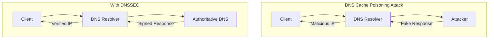
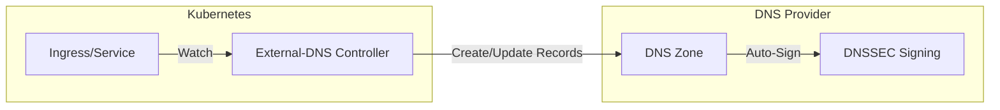
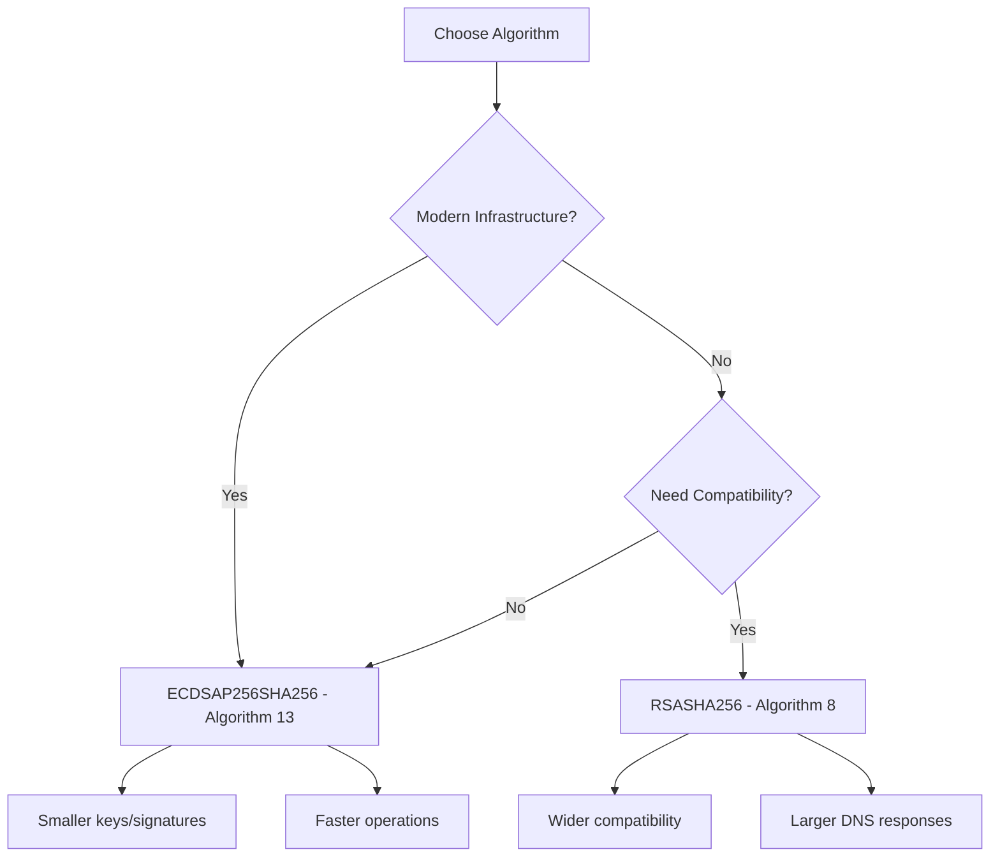

# How to Implement DNSSEC for Kubernetes External DNS Records

Author: [nawazdhandala](https://github.com/nawazdhandala)

Tags: DNSSEC, Kubernetes, External-DNS, DNS, Security, DevOps

Description: A comprehensive guide to securing your Kubernetes DNS records with DNSSEC using External-DNS, covering provider integration, key management, and validation strategies.

---

DNS is the phone book of the internet, and like any critical infrastructure, it needs protection. DNSSEC (Domain Name System Security Extensions) adds cryptographic signatures to DNS records, preventing attackers from hijacking your domain traffic through cache poisoning or man-in-the-middle attacks. When combined with Kubernetes External-DNS, you get automated, secure DNS management for your cluster workloads.

## Understanding DNSSEC Fundamentals

Before diving into implementation, let's understand what DNSSEC protects against and how it works.



### The DNSSEC Trust Chain

DNSSEC works through a chain of trust from the root DNS servers down to your domain:

1. **Root Zone** - Signs the TLD (e.g., .com, .org)
2. **TLD Zone** - Signs your domain's DS record
3. **Your Domain** - Signs your actual DNS records

### Key Types in DNSSEC

| Key Type | Purpose | Rotation Frequency | Location |
|----------|---------|-------------------|----------|
| **KSK (Key Signing Key)** | Signs the DNSKEY record set | Annually | Parent zone via DS record |
| **ZSK (Zone Signing Key)** | Signs all other records | Monthly/Quarterly | Your DNS zone |

### DNSSEC Record Types

```
DNSKEY  - Contains the public keys used for signing
RRSIG   - Contains the signature for a record set
DS      - Delegation Signer, links child zone to parent
NSEC/NSEC3 - Proves non-existence of records
```

## External-DNS Overview

External-DNS is a Kubernetes controller that synchronizes exposed Kubernetes Services and Ingresses with DNS providers. It watches for changes in your cluster and automatically creates, updates, or deletes DNS records.



### Installing External-DNS

First, deploy External-DNS to your cluster:

```yaml
apiVersion: v1
kind: ServiceAccount
metadata:
  name: external-dns
  namespace: external-dns
---
apiVersion: rbac.authorization.k8s.io/v1
kind: ClusterRole
metadata:
  name: external-dns
rules:
  - apiGroups: [""]
    resources: ["services", "endpoints", "pods"]
    verbs: ["get", "watch", "list"]
  - apiGroups: ["extensions", "networking.k8s.io"]
    resources: ["ingresses"]
    verbs: ["get", "watch", "list"]
  - apiGroups: [""]
    resources: ["nodes"]
    verbs: ["list", "watch"]
---
apiVersion: rbac.authorization.k8s.io/v1
kind: ClusterRoleBinding
metadata:
  name: external-dns-viewer
roleRef:
  apiGroup: rbac.authorization.k8s.io
  kind: ClusterRole
  name: external-dns
subjects:
  - kind: ServiceAccount
    name: external-dns
    namespace: external-dns
```

## Provider-Specific DNSSEC Configuration

Different DNS providers handle DNSSEC differently. Here's how to configure External-DNS with DNSSEC for major providers.

### AWS Route 53

Route 53 supports DNSSEC signing for public hosted zones.

#### Step 1: Enable DNSSEC Signing in Route 53

```bash
# Create a KMS key for DNSSEC signing
aws kms create-key \
  --description "DNSSEC signing key for example.com" \
  --key-spec ECC_NIST_P256 \
  --key-usage SIGN_VERIFY \
  --customer-master-key-spec ECC_NIST_P256 \
  --region us-east-1

# Note the KeyId from the output
KMS_KEY_ID="arn:aws:kms:us-east-1:123456789012:key/12345678-1234-1234-1234-123456789012"

# Enable DNSSEC signing
aws route53 enable-hosted-zone-dnssec \
  --hosted-zone-id Z1234567890ABC

# Create key signing key
aws route53 create-key-signing-key \
  --hosted-zone-id Z1234567890ABC \
  --name example-com-ksk \
  --key-management-service-arn $KMS_KEY_ID \
  --status ACTIVE
```

#### Step 2: Configure External-DNS for Route 53

```yaml
apiVersion: apps/v1
kind: Deployment
metadata:
  name: external-dns
  namespace: external-dns
spec:
  replicas: 1
  selector:
    matchLabels:
      app: external-dns
  template:
    metadata:
      labels:
        app: external-dns
    spec:
      serviceAccountName: external-dns
      containers:
        - name: external-dns
          image: registry.k8s.io/external-dns/external-dns:v0.14.0
          args:
            - --source=service
            - --source=ingress
            - --provider=aws
            - --aws-zone-type=public
            - --registry=txt
            - --txt-owner-id=my-cluster
            - --domain-filter=example.com
            - --policy=sync
          env:
            - name: AWS_DEFAULT_REGION
              value: us-east-1
```

#### Step 3: Create IAM Policy for External-DNS

```json
{
  "Version": "2012-10-17",
  "Statement": [
    {
      "Effect": "Allow",
      "Action": [
        "route53:ChangeResourceRecordSets"
      ],
      "Resource": [
        "arn:aws:route53:::hostedzone/Z1234567890ABC"
      ]
    },
    {
      "Effect": "Allow",
      "Action": [
        "route53:ListHostedZones",
        "route53:ListResourceRecordSets"
      ],
      "Resource": ["*"]
    }
  ]
}
```

#### Step 4: Establish the Chain of Trust

```bash
# Get the DS record to add to your domain registrar
aws route53 get-dnssec \
  --hosted-zone-id Z1234567890ABC

# Output includes DS record details to add at your registrar
```

### Google Cloud DNS

Google Cloud DNS provides managed DNSSEC with automatic key rotation.

#### Step 1: Enable DNSSEC on the Zone

```bash
# Enable DNSSEC with automatic key management
gcloud dns managed-zones update example-zone \
  --dnssec-state on \
  --ksk-algorithm ECDSAP256SHA256 \
  --zsk-algorithm ECDSAP256SHA256 \
  --ksk-key-length 256 \
  --zsk-key-length 256

# Get DS records for your registrar
gcloud dns dns-keys list --zone=example-zone \
  --filter="type=KEY_SIGNING" \
  --format="value(ds_record())"
```

#### Step 2: Configure External-DNS for GCP

```yaml
apiVersion: apps/v1
kind: Deployment
metadata:
  name: external-dns
  namespace: external-dns
spec:
  replicas: 1
  selector:
    matchLabels:
      app: external-dns
  template:
    metadata:
      labels:
        app: external-dns
    spec:
      serviceAccountName: external-dns
      containers:
        - name: external-dns
          image: registry.k8s.io/external-dns/external-dns:v0.14.0
          args:
            - --source=service
            - --source=ingress
            - --provider=google
            - --google-project=my-project
            - --google-zone-visibility=public
            - --registry=txt
            - --txt-owner-id=my-cluster
            - --domain-filter=example.com
            - --policy=sync
          env:
            - name: GOOGLE_APPLICATION_CREDENTIALS
              value: /etc/secrets/gcp-credentials.json
          volumeMounts:
            - name: gcp-credentials
              mountPath: /etc/secrets
              readOnly: true
      volumes:
        - name: gcp-credentials
          secret:
            secretName: external-dns-gcp-credentials
```

#### Step 3: Create Service Account with Permissions

```bash
# Create service account
gcloud iam service-accounts create external-dns \
  --display-name "External DNS"

# Grant permissions
gcloud projects add-iam-policy-binding my-project \
  --member "serviceAccount:external-dns@my-project.iam.gserviceaccount.com" \
  --role "roles/dns.admin"

# Create and download key
gcloud iam service-accounts keys create credentials.json \
  --iam-account external-dns@my-project.iam.gserviceaccount.com

# Create Kubernetes secret
kubectl create secret generic external-dns-gcp-credentials \
  --from-file=gcp-credentials.json=credentials.json \
  -n external-dns
```

### Cloudflare

Cloudflare automatically enables DNSSEC for domains using their nameservers.

#### Step 1: Enable DNSSEC in Cloudflare

```bash
# Using Cloudflare API
curl -X PATCH "https://api.cloudflare.com/client/v4/zones/ZONE_ID/dnssec" \
  -H "Authorization: Bearer $CLOUDFLARE_API_TOKEN" \
  -H "Content-Type: application/json" \
  --data '{"status":"active"}'

# Get DS record for registrar
curl -X GET "https://api.cloudflare.com/client/v4/zones/ZONE_ID/dnssec" \
  -H "Authorization: Bearer $CLOUDFLARE_API_TOKEN"
```

#### Step 2: Configure External-DNS for Cloudflare

```yaml
apiVersion: apps/v1
kind: Deployment
metadata:
  name: external-dns
  namespace: external-dns
spec:
  replicas: 1
  selector:
    matchLabels:
      app: external-dns
  template:
    metadata:
      labels:
        app: external-dns
    spec:
      serviceAccountName: external-dns
      containers:
        - name: external-dns
          image: registry.k8s.io/external-dns/external-dns:v0.14.0
          args:
            - --source=service
            - --source=ingress
            - --provider=cloudflare
            - --cloudflare-proxied
            - --registry=txt
            - --txt-owner-id=my-cluster
            - --domain-filter=example.com
            - --policy=sync
          env:
            - name: CF_API_TOKEN
              valueFrom:
                secretKeyRef:
                  name: cloudflare-api-token
                  key: token
```

#### Step 3: Create Cloudflare API Token

```bash
# Create secret with API token
kubectl create secret generic cloudflare-api-token \
  --from-literal=token=YOUR_CLOUDFLARE_API_TOKEN \
  -n external-dns
```

### Azure DNS

Azure DNS supports DNSSEC for public zones.

#### Step 1: Enable DNSSEC on Azure DNS Zone

```bash
# Enable DNSSEC signing
az network dns dnssec-config create \
  --resource-group myResourceGroup \
  --zone-name example.com

# Get DS records for registrar
az network dns dnssec-config show \
  --resource-group myResourceGroup \
  --zone-name example.com \
  --query "signingKeys[?keyType=='KEY_SIGNING'].dsRecord" \
  --output table
```

#### Step 2: Configure External-DNS for Azure

```yaml
apiVersion: apps/v1
kind: Deployment
metadata:
  name: external-dns
  namespace: external-dns
spec:
  replicas: 1
  selector:
    matchLabels:
      app: external-dns
  template:
    metadata:
      labels:
        app: external-dns
    spec:
      serviceAccountName: external-dns
      containers:
        - name: external-dns
          image: registry.k8s.io/external-dns/external-dns:v0.14.0
          args:
            - --source=service
            - --source=ingress
            - --provider=azure
            - --azure-resource-group=myResourceGroup
            - --azure-subscription-id=SUBSCRIPTION_ID
            - --registry=txt
            - --txt-owner-id=my-cluster
            - --domain-filter=example.com
            - --policy=sync
          volumeMounts:
            - name: azure-config
              mountPath: /etc/kubernetes
              readOnly: true
      volumes:
        - name: azure-config
          secret:
            secretName: azure-config-file
```

#### Step 3: Create Azure Credentials

```json
{
  "tenantId": "TENANT_ID",
  "subscriptionId": "SUBSCRIPTION_ID",
  "resourceGroup": "myResourceGroup",
  "aadClientId": "CLIENT_ID",
  "aadClientSecret": "CLIENT_SECRET"
}
```

```bash
kubectl create secret generic azure-config-file \
  --from-file=azure.json \
  -n external-dns
```

## Self-Managed DNSSEC with PowerDNS

For organizations running their own DNS infrastructure, PowerDNS provides excellent DNSSEC support.

### Deploy PowerDNS with DNSSEC

```yaml
apiVersion: apps/v1
kind: Deployment
metadata:
  name: powerdns
  namespace: dns
spec:
  replicas: 2
  selector:
    matchLabels:
      app: powerdns
  template:
    metadata:
      labels:
        app: powerdns
    spec:
      containers:
        - name: powerdns
          image: powerdns/pdns-auth-master:latest
          ports:
            - containerPort: 53
              protocol: UDP
            - containerPort: 53
              protocol: TCP
            - containerPort: 8081
              protocol: TCP
          env:
            - name: PDNS_launch
              value: gpgsql
            - name: PDNS_gpgsql_host
              value: postgres-dns
            - name: PDNS_gpgsql_dbname
              value: pdns
            - name: PDNS_gpgsql_user
              valueFrom:
                secretKeyRef:
                  name: pdns-db-credentials
                  key: username
            - name: PDNS_gpgsql_password
              valueFrom:
                secretKeyRef:
                  name: pdns-db-credentials
                  key: password
            - name: PDNS_api
              value: "yes"
            - name: PDNS_api_key
              valueFrom:
                secretKeyRef:
                  name: pdns-api-key
                  key: api-key
            - name: PDNS_webserver
              value: "yes"
            - name: PDNS_webserver_address
              value: "0.0.0.0"
            - name: PDNS_webserver_allow_from
              value: "10.0.0.0/8,172.16.0.0/12,192.168.0.0/16"
            - name: PDNS_default_soa_content
              value: "ns1.example.com hostmaster.@ 0 10800 3600 604800 3600"
---
apiVersion: v1
kind: Service
metadata:
  name: powerdns
  namespace: dns
spec:
  type: LoadBalancer
  selector:
    app: powerdns
  ports:
    - name: dns-udp
      port: 53
      protocol: UDP
    - name: dns-tcp
      port: 53
      protocol: TCP
    - name: api
      port: 8081
      protocol: TCP
```

### Enable DNSSEC for a Zone

```bash
# Create zone
pdnsutil create-zone example.com ns1.example.com

# Enable DNSSEC
pdnsutil secure-zone example.com

# Add KSK
pdnsutil add-zone-key example.com ksk active ecdsa256

# Add ZSK
pdnsutil add-zone-key example.com zsk active ecdsa256

# Verify DNSSEC setup
pdnsutil check-zone example.com

# Get DS records for registrar
pdnsutil show-zone example.com
```

### Configure External-DNS for PowerDNS

```yaml
apiVersion: apps/v1
kind: Deployment
metadata:
  name: external-dns
  namespace: external-dns
spec:
  replicas: 1
  selector:
    matchLabels:
      app: external-dns
  template:
    metadata:
      labels:
        app: external-dns
    spec:
      serviceAccountName: external-dns
      containers:
        - name: external-dns
          image: registry.k8s.io/external-dns/external-dns:v0.14.0
          args:
            - --source=service
            - --source=ingress
            - --provider=pdns
            - --pdns-server=http://powerdns.dns.svc.cluster.local:8081
            - --pdns-api-key=$(PDNS_API_KEY)
            - --registry=txt
            - --txt-owner-id=my-cluster
            - --domain-filter=example.com
            - --policy=sync
          env:
            - name: PDNS_API_KEY
              valueFrom:
                secretKeyRef:
                  name: pdns-api-key
                  key: api-key
```

## Automated Key Rotation

DNSSEC key rotation is critical for maintaining security. Here's how to automate it.

### Key Rotation CronJob

```yaml
apiVersion: batch/v1
kind: CronJob
metadata:
  name: dnssec-key-rotation
  namespace: dns
spec:
  schedule: "0 2 1 */3 *"  # Quarterly at 2 AM on the 1st
  jobTemplate:
    spec:
      template:
        spec:
          containers:
            - name: key-rotation
              image: powerdns/pdns-auth-master:latest
              command:
                - /bin/bash
                - -c
                - |
                  set -e

                  # Rotate ZSK (more frequent)
                  echo "Starting ZSK rotation for example.com"

                  # Add new ZSK
                  pdnsutil add-zone-key example.com zsk inactive ecdsa256
                  NEW_KEY_ID=$(pdnsutil list-keys example.com | grep "ZSK.*inactive" | awk '{print $2}' | tail -1)

                  # Activate new key (both active during transition)
                  pdnsutil activate-zone-key example.com $NEW_KEY_ID

                  # Wait for propagation (2x TTL)
                  sleep 7200

                  # Deactivate old ZSK
                  OLD_KEY_ID=$(pdnsutil list-keys example.com | grep "ZSK.*active" | awk '{print $2}' | head -1)
                  pdnsutil deactivate-zone-key example.com $OLD_KEY_ID

                  # Remove old key after another TTL
                  sleep 3600
                  pdnsutil remove-zone-key example.com $OLD_KEY_ID

                  echo "ZSK rotation complete"
              env:
                - name: PDNS_HOST
                  value: powerdns.dns.svc.cluster.local
          restartPolicy: OnFailure
```

### KSK Rotation Script (Annual)

```bash
#!/bin/bash
# ksk-rotation.sh - Run annually with careful coordination

ZONE="example.com"
PDNS_API="http://powerdns.dns.svc.cluster.local:8081"

# Step 1: Add new KSK in inactive state
echo "Adding new KSK..."
pdnsutil add-zone-key $ZONE ksk inactive ecdsa256

# Step 2: Get the new DS record
echo "New DS record to add at registrar:"
pdnsutil show-zone $ZONE | grep "DS"

echo "
IMPORTANT:
1. Add the new DS record at your registrar
2. Wait 48 hours for propagation
3. Run ksk-rotation-complete.sh to finish rotation
"
```

## DNSSEC Monitoring and Validation

Proper monitoring ensures your DNSSEC setup remains healthy.

### Validation Script

```bash
#!/bin/bash
# dnssec-validate.sh

DOMAIN=$1

echo "=== DNSSEC Validation for $DOMAIN ==="

# Check if DNSSEC is enabled
echo -e "\n[1] Checking DNSSEC records..."
dig +short DNSKEY $DOMAIN
if [ $? -ne 0 ]; then
    echo "ERROR: No DNSKEY records found"
    exit 1
fi

# Validate signatures
echo -e "\n[2] Validating RRSIG..."
dig +dnssec +short A $DOMAIN | head -5

# Check chain of trust
echo -e "\n[3] Checking DS record at parent..."
dig +short DS $DOMAIN

# Full validation with drill
echo -e "\n[4] Full chain validation..."
drill -S $DOMAIN

# Check for algorithm support
echo -e "\n[5] Algorithm check..."
dig +short DNSKEY $DOMAIN | while read line; do
    ALG=$(echo $line | awk '{print $3}')
    case $ALG in
        13) echo "Algorithm 13 (ECDSAP256SHA256) - Recommended" ;;
        14) echo "Algorithm 14 (ECDSAP384SHA384) - Recommended" ;;
        8)  echo "Algorithm 8 (RSASHA256) - Acceptable" ;;
        *)  echo "Algorithm $ALG - Check compatibility" ;;
    esac
done

echo -e "\n=== Validation Complete ==="
```

### Prometheus Monitoring

```yaml
apiVersion: monitoring.coreos.com/v1
kind: PrometheusRule
metadata:
  name: dnssec-alerts
  namespace: monitoring
spec:
  groups:
    - name: dnssec
      interval: 5m
      rules:
        - alert: DNSSECSignatureExpiringSoon
          expr: dnssec_signature_expiry_seconds < 86400 * 7
          for: 1h
          labels:
            severity: warning
          annotations:
            summary: "DNSSEC signature expiring soon"
            description: "DNSSEC signature for {{ $labels.zone }} expires in {{ $value | humanizeDuration }}"

        - alert: DNSSECValidationFailure
          expr: dnssec_validation_failures_total > 0
          for: 5m
          labels:
            severity: critical
          annotations:
            summary: "DNSSEC validation failing"
            description: "DNSSEC validation failures detected for {{ $labels.zone }}"

        - alert: DNSSECKeyRotationOverdue
          expr: dnssec_key_age_days > 90
          for: 1h
          labels:
            severity: warning
          annotations:
            summary: "DNSSEC key rotation overdue"
            description: "ZSK for {{ $labels.zone }} is {{ $value }} days old"
```

### Custom DNSSEC Exporter

```yaml
apiVersion: apps/v1
kind: Deployment
metadata:
  name: dnssec-exporter
  namespace: monitoring
spec:
  replicas: 1
  selector:
    matchLabels:
      app: dnssec-exporter
  template:
    metadata:
      labels:
        app: dnssec-exporter
      annotations:
        prometheus.io/scrape: "true"
        prometheus.io/port: "9199"
    spec:
      containers:
        - name: exporter
          image: your-registry/dnssec-exporter:latest
          ports:
            - containerPort: 9199
          env:
            - name: DOMAINS
              value: "example.com,api.example.com,app.example.com"
          args:
            - --check-interval=5m
            - --port=9199
```

## Troubleshooting DNSSEC Issues

### Common Problems and Solutions

#### Problem 1: SERVFAIL Responses

```bash
# Check if DNSSEC validation is causing issues
dig +cd example.com  # Bypass DNSSEC validation
dig example.com      # With validation

# If +cd works but normal query fails, DNSSEC is misconfigured
```

#### Problem 2: Missing DS Record at Registrar

```bash
# Verify DS record exists
dig +short DS example.com @8.8.8.8

# If empty, add DS record at your registrar
# Get DS record from your DNS provider
```

#### Problem 3: Signature Expired

```bash
# Check RRSIG expiration
dig +dnssec example.com | grep RRSIG

# Look for expiration timestamp
# Re-sign zone if expired
pdnsutil rectify-zone example.com
```

#### Problem 4: Algorithm Mismatch

```bash
# Check algorithms in use
dig +short DNSKEY example.com | awk '{print $3}'

# Ensure DS record uses matching algorithm
dig +short DS example.com | awk '{print $2}'
```

### Debug Script

```bash
#!/bin/bash
# dnssec-debug.sh

DOMAIN=$1
echo "=== DNSSEC Debug for $DOMAIN ==="

echo -e "\n[Step 1] Basic Resolution"
dig +short A $DOMAIN

echo -e "\n[Step 2] DNSSEC Records"
echo "DNSKEY:"
dig +short DNSKEY $DOMAIN
echo -e "\nDS at parent:"
dig +short DS $DOMAIN

echo -e "\n[Step 3] Signature Check"
dig +dnssec A $DOMAIN | grep -E "(RRSIG|DNSKEY)"

echo -e "\n[Step 4] Chain Validation"
delv @8.8.8.8 $DOMAIN A +rtrace

echo -e "\n[Step 5] NSEC/NSEC3 Check"
dig +dnssec NSEC $DOMAIN

echo -e "\n[Step 6] External Validators"
echo "DNSViz: https://dnsviz.net/d/$DOMAIN/dnssec/"
echo "Verisign: https://dnssec-debugger.verisignlabs.com/$DOMAIN"
```

## Best Practices and Security Considerations

### Algorithm Selection



### TTL Recommendations

| Record Type | Recommended TTL | Reason |
|-------------|-----------------|--------|
| DNSKEY | 3600 (1 hour) | Balance between caching and key rotation |
| RRSIG | Match signed record | Consistency |
| DS | 3600-86400 | Longer for stability |
| A/AAAA | 300-3600 | Based on change frequency |

### Security Checklist

- [ ] Use ECDSA algorithms (13 or 14) for new deployments
- [ ] Enable NSEC3 with opt-out disabled for zone enumeration protection
- [ ] Rotate ZSK quarterly, KSK annually
- [ ] Monitor signature expiration with alerts
- [ ] Keep DS records updated at registrar during KSK rotation
- [ ] Test DNSSEC validation from multiple locations
- [ ] Document key material backup procedures
- [ ] Implement automated key rotation where possible
- [ ] Use hardware security modules (HSM) for KSK in high-security environments
- [ ] Enable DNSSEC validation on recursive resolvers

## Provider Comparison Summary

| Provider | DNSSEC Support | Key Management | Auto-Rotation | External-DNS Support |
|----------|---------------|----------------|---------------|---------------------|
| **AWS Route 53** | Yes | KMS-based | Manual | Full |
| **Google Cloud DNS** | Yes | Managed | Automatic | Full |
| **Cloudflare** | Yes | Managed | Automatic | Full |
| **Azure DNS** | Yes | Managed | Automatic | Full |
| **DigitalOcean** | Yes | Managed | Automatic | Full |
| **PowerDNS** | Yes | Self-managed | Manual/Script | Full |
| **Bind9** | Yes | Self-managed | Manual/Script | Limited |
| **NS1** | Yes | Managed | Automatic | Full |

## Complete Deployment Example

Here's a complete Helm values file for deploying External-DNS with DNSSEC-enabled providers:

```yaml
# values.yaml for external-dns helm chart
replicaCount: 2

image:
  repository: registry.k8s.io/external-dns/external-dns
  tag: v0.14.0

provider: aws  # or google, cloudflare, azure, pdns

sources:
  - service
  - ingress
  - istio-gateway
  - istio-virtualservice

domainFilters:
  - example.com
  - api.example.com

policy: sync
registry: txt
txtOwnerId: my-k8s-cluster

aws:
  region: us-east-1
  zoneType: public
  # DNSSEC is enabled at the Route 53 zone level
  # External-DNS creates records, Route 53 signs them

resources:
  requests:
    cpu: 50m
    memory: 128Mi
  limits:
    cpu: 200m
    memory: 256Mi

serviceAccount:
  create: true
  annotations:
    eks.amazonaws.com/role-arn: arn:aws:iam::123456789012:role/external-dns

podSecurityContext:
  runAsNonRoot: true
  runAsUser: 65534
  fsGroup: 65534

securityContext:
  readOnlyRootFilesystem: true
  capabilities:
    drop:
      - ALL

metrics:
  enabled: true
  serviceMonitor:
    enabled: true

tolerations:
  - key: "node-role.kubernetes.io/control-plane"
    operator: "Exists"
    effect: "NoSchedule"

affinity:
  podAntiAffinity:
    preferredDuringSchedulingIgnoredDuringExecution:
      - weight: 100
        podAffinityTerm:
          labelSelector:
            matchExpressions:
              - key: app.kubernetes.io/name
                operator: In
                values:
                  - external-dns
          topologyKey: kubernetes.io/hostname
```

### Deploy with Helm

```bash
# Add the external-dns repository
helm repo add external-dns https://kubernetes-sigs.github.io/external-dns/
helm repo update

# Install with custom values
helm install external-dns external-dns/external-dns \
  -n external-dns \
  --create-namespace \
  -f values.yaml

# Verify deployment
kubectl get pods -n external-dns
kubectl logs -n external-dns -l app.kubernetes.io/name=external-dns
```

## Verifying Your Setup

After deployment, verify everything works:

```bash
# 1. Create a test service
kubectl apply -f - <<EOF
apiVersion: v1
kind: Service
metadata:
  name: test-dnssec
  annotations:
    external-dns.alpha.kubernetes.io/hostname: test.example.com
spec:
  type: LoadBalancer
  ports:
    - port: 80
  selector:
    app: test
EOF

# 2. Wait for External-DNS to create the record
kubectl logs -n external-dns -l app.kubernetes.io/name=external-dns -f

# 3. Verify DNS resolution
dig +short test.example.com

# 4. Verify DNSSEC
dig +dnssec test.example.com

# 5. Full chain validation
delv @8.8.8.8 test.example.com A +rtrace

# 6. Clean up
kubectl delete service test-dnssec
```

---

DNSSEC adds a critical layer of security to your DNS infrastructure, protecting your Kubernetes workloads from DNS-based attacks. By combining External-DNS with a DNSSEC-enabled provider, you get the best of both worlds: automated DNS management and cryptographic verification. Start with a single zone, verify everything works, then roll out to production. Your users may never notice the extra security, but attackers certainly will.
