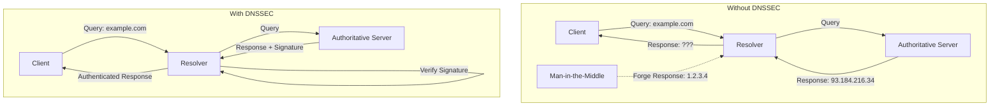

# How to Configure DNSSEC with PowerDNS Authoritative Server

Author: [nawazdhandala](https://www.github.com/nawazdhandala)

Tags: DNSSEC, PowerDNS, DNS, Security, Linux, Infrastructure

Description: A comprehensive guide to implementing DNSSEC on PowerDNS Authoritative Server, covering key generation, zone signing, key rotation, and troubleshooting for production deployments.

---

DNS was designed in the 1980s without security in mind. Anyone sitting between you and a DNS server can forge responses, redirect traffic to malicious servers, and intercept sensitive data. DNSSEC solves this by cryptographically signing DNS records, allowing resolvers to verify that responses are authentic and unmodified.

PowerDNS Authoritative Server has excellent DNSSEC support with automatic key management, making it one of the best choices for hosting signed zones. This guide walks through everything from initial configuration to production-ready key rotation.

## Understanding DNSSEC Fundamentals

Before diving into configuration, let's understand what DNSSEC actually does.



### Key Components

**Zone Signing Key (ZSK)**: Signs individual DNS records. Rotated frequently (every 1-3 months).

**Key Signing Key (KSK)**: Signs the ZSK and creates the trust chain to the parent zone. Rotated less frequently (every 1-2 years).

**DS Record**: Delegation Signer record published in the parent zone, linking the parent to the child's KSK.

**RRSIG Records**: Digital signatures attached to DNS record sets.

**NSEC/NSEC3 Records**: Prove that a domain name doesn't exist (authenticated denial of existence).

## Prerequisites

### System Requirements

- PowerDNS Authoritative Server 4.4 or later
- Backend database (PostgreSQL, MySQL, or SQLite)
- Root or sudo access
- Domain registered with a registrar that supports DNSSEC

### Install PowerDNS Authoritative Server

**On Ubuntu/Debian:**

```bash
# Add PowerDNS repository
echo "deb [arch=amd64] http://repo.powerdns.com/ubuntu $(lsb_release -cs)-auth-48 main" | sudo tee /etc/apt/sources.list.d/pdns.list

# Add repository key
curl -fsSL https://repo.powerdns.com/FD380FBB-pub.asc | sudo gpg --dearmor -o /etc/apt/trusted.gpg.d/pdns.gpg

# Install PowerDNS
sudo apt update
sudo apt install pdns-server pdns-backend-pgsql
```

**On RHEL/CentOS/Rocky:**

```bash
# Add PowerDNS repository
sudo curl -o /etc/yum.repos.d/powerdns-auth-48.repo https://repo.powerdns.com/repo-files/el-auth-48.repo

# Install PowerDNS
sudo dnf install pdns pdns-backend-postgresql
```

### Set Up PostgreSQL Backend

```bash
# Install PostgreSQL
sudo apt install postgresql postgresql-contrib

# Create database and user
sudo -u postgres psql <<EOF
CREATE USER pdns WITH PASSWORD 'your_secure_password';
CREATE DATABASE pdns OWNER pdns;
GRANT ALL PRIVILEGES ON DATABASE pdns TO pdns;
EOF

# Import PowerDNS schema
sudo -u postgres psql pdns < /usr/share/doc/pdns-backend-pgsql/schema.pgsql.sql
```

## Basic PowerDNS Configuration

### Configure the Backend

Edit `/etc/powerdns/pdns.conf`:

```ini
# Backend configuration
launch=gpgsql

gpgsql-host=127.0.0.1
gpgsql-port=5432
gpgsql-dbname=pdns
gpgsql-user=pdns
gpgsql-password=your_secure_password
gpgsql-dnssec=yes

# Server settings
local-address=0.0.0.0
local-port=53

# API for management (optional but recommended)
api=yes
api-key=your_api_key_here
webserver=yes
webserver-address=127.0.0.1
webserver-port=8081
webserver-allow-from=127.0.0.1

# Logging
log-dns-queries=yes
log-dns-details=yes
loglevel=4

# DNSSEC settings
default-soa-content=ns1.example.com hostmaster.@ 0 10800 3600 604800 3600
```

### Create a Test Zone

```bash
# Create zone using pdnsutil
sudo pdnsutil create-zone example.com ns1.example.com

# Add records
sudo pdnsutil add-record example.com @ A 93.184.216.34
sudo pdnsutil add-record example.com @ MX "10 mail.example.com"
sudo pdnsutil add-record example.com www A 93.184.216.34
sudo pdnsutil add-record example.com mail A 93.184.216.35
```

Verify the zone:

```bash
sudo pdnsutil list-zone example.com
```

## Enabling DNSSEC on a Zone

### Method 1: Automatic Key Generation (Recommended)

PowerDNS can generate keys automatically using secure defaults:

```bash
# Enable DNSSEC with automatic key management
sudo pdnsutil secure-zone example.com
```

This command:
1. Generates a 256-bit ECDSA ZSK (algorithm 13)
2. Generates a 256-bit ECDSA KSK (algorithm 13)
3. Signs all existing records
4. Creates NSEC3 records for authenticated denial

### Method 2: Manual Key Generation

For more control over key parameters:

```bash
# Generate KSK (Key Signing Key)
sudo pdnsutil add-zone-key example.com ksk active ecdsa256

# Generate ZSK (Zone Signing Key)
sudo pdnsutil add-zone-key example.com zsk active ecdsa256

# Or use RSA for compatibility with older resolvers
sudo pdnsutil add-zone-key example.com ksk active rsasha256 2048
sudo pdnsutil add-zone-key example.com zsk active rsasha256 1024
```

### View Generated Keys

```bash
# List all keys for a zone
sudo pdnsutil show-zone example.com
```

Example output:

```
Zone is signed with NSEC3 narrow mode
keys:
ID = 1 (KSK), flags = 257, tag = 12345, algo = 13, bits = 256    Active    Published  ( ECDSAP256SHA256 )
ID = 2 (ZSK), flags = 256, tag = 54321, algo = 13, bits = 256    Active    Published  ( ECDSAP256SHA256 )
```

### Get DS Records for Parent Zone

```bash
# Generate DS records to publish at your registrar
sudo pdnsutil show-zone example.com
```

You'll see output like:

```
DS records for example.com:
example.com. IN DS 12345 13 2 49a9d6b2e2d8912f66de24c925a9a846d8b8b22e...
example.com. IN DS 12345 13 4 c7ce43f8b9d99d17f8c9c2f9f8e9f7a6b5c4d3e2...
```

The DS record with digest type 2 (SHA-256) is recommended for most registrars.

## NSEC vs NSEC3 Configuration

### Understanding NSEC and NSEC3

**NSEC**: Links domain names in alphabetical order. Simple but allows zone walking (enumeration of all names in the zone).

**NSEC3**: Hashes domain names before linking. Prevents zone walking but adds computational overhead.

### Configure NSEC3

```bash
# Enable NSEC3 with recommended parameters
sudo pdnsutil set-nsec3 example.com '1 0 10 aabbccdd'
```

Parameters explained:
- `1`: Hash algorithm (1 = SHA-1)
- `0`: Opt-out flag (0 = no opt-out)
- `10`: Number of hash iterations
- `aabbccdd`: Salt (hex string)

### Use NSEC3 Narrow Mode

NSEC3 narrow mode generates NSEC3 records on-the-fly, reducing database size:

```bash
# Enable narrow mode (default in PowerDNS)
sudo pdnsutil set-nsec3 example.com '1 0 10 aabbccdd' narrow
```

### Disable NSEC3 (Use Plain NSEC)

```bash
sudo pdnsutil unset-nsec3 example.com
```

## Algorithm Selection Guide

### Recommended Algorithms

| Algorithm | Name | Security | Performance | Compatibility |
|-----------|------|----------|-------------|---------------|
| 13 | ECDSAP256SHA256 | High | Excellent | Good |
| 14 | ECDSAP384SHA384 | Very High | Good | Good |
| 15 | ED25519 | High | Excellent | Growing |
| 8 | RSASHA256 | High | Good | Excellent |

### Configure Algorithm

```bash
# Use ECDSA P-256 (recommended)
sudo pdnsutil add-zone-key example.com ksk active ecdsa256
sudo pdnsutil add-zone-key example.com zsk active ecdsa256

# Use ED25519 (modern, compact signatures)
sudo pdnsutil add-zone-key example.com ksk active ed25519
sudo pdnsutil add-zone-key example.com zsk active ed25519

# Use RSA (maximum compatibility)
sudo pdnsutil add-zone-key example.com ksk active rsasha256 2048
sudo pdnsutil add-zone-key example.com zsk active rsasha256 1024
```

## Key Rollover Procedures

Key rotation is essential for security. PowerDNS supports both pre-publish and double-signature rollover methods.

### ZSK Rollover (Pre-Publish Method)

```bash
# Step 1: Generate new inactive ZSK
sudo pdnsutil add-zone-key example.com zsk inactive ecdsa256

# Step 2: Publish the new key (wait for TTL expiration)
sudo pdnsutil activate-zone-key example.com <new-key-id>

# Step 3: Wait for propagation (at least 2x TTL)
sleep $((2 * 3600))

# Step 4: Deactivate old ZSK
sudo pdnsutil deactivate-zone-key example.com <old-key-id>

# Step 5: Remove old key after TTL expiration
sudo pdnsutil remove-zone-key example.com <old-key-id>
```

### KSK Rollover (Double-DS Method)

```bash
# Step 1: Generate new inactive KSK
sudo pdnsutil add-zone-key example.com ksk inactive ecdsa256

# Step 2: Get DS record for new KSK
sudo pdnsutil show-zone example.com | grep DS

# Step 3: Add new DS record at registrar (keep old DS too)
# Wait for DS propagation (check with: dig DS example.com)

# Step 4: Activate new KSK
sudo pdnsutil activate-zone-key example.com <new-ksk-id>

# Step 5: Wait for propagation
sleep $((2 * 86400))

# Step 6: Remove old DS at registrar

# Step 7: Deactivate and remove old KSK
sudo pdnsutil deactivate-zone-key example.com <old-ksk-id>
sudo pdnsutil remove-zone-key example.com <old-ksk-id>
```

### Automated Key Rollover Script

```bash
#!/bin/bash
# zsk-rollover.sh - Automated ZSK rollover for PowerDNS

ZONE=$1
TTL=3600

if [ -z "$ZONE" ]; then
    echo "Usage: $0 <zone>"
    exit 1
fi

echo "Starting ZSK rollover for $ZONE"

# Get current active ZSK
OLD_KEY=$(pdnsutil show-zone $ZONE | grep "ZSK.*Active" | awk '{print $3}')

if [ -z "$OLD_KEY" ]; then
    echo "Error: No active ZSK found"
    exit 1
fi

echo "Current ZSK ID: $OLD_KEY"

# Generate new ZSK
echo "Generating new ZSK..."
pdnsutil add-zone-key $ZONE zsk inactive ecdsa256

# Get new key ID
NEW_KEY=$(pdnsutil show-zone $ZONE | grep "ZSK.*Inactive" | awk '{print $3}' | tail -1)

echo "New ZSK ID: $NEW_KEY"

# Activate new key
echo "Activating new ZSK..."
pdnsutil activate-zone-key $ZONE $NEW_KEY

echo "Waiting for propagation ($(($TTL * 2)) seconds)..."
sleep $(($TTL * 2))

# Deactivate old key
echo "Deactivating old ZSK..."
pdnsutil deactivate-zone-key $ZONE $OLD_KEY

echo "Waiting for cache expiration ($(($TTL)) seconds)..."
sleep $TTL

# Remove old key
echo "Removing old ZSK..."
pdnsutil remove-zone-key $ZONE $OLD_KEY

echo "ZSK rollover complete!"
pdnsutil show-zone $ZONE
```

## Publishing DS Records

### At Your Registrar

Most registrars have a web interface for DNSSEC. You'll need:

1. **Key Tag**: The 5-digit identifier (e.g., 12345)
2. **Algorithm**: The algorithm number (e.g., 13 for ECDSA P-256)
3. **Digest Type**: Usually 2 (SHA-256)
4. **Digest**: The hash value

Get these values:

```bash
sudo pdnsutil show-zone example.com | grep "^example.com. IN DS"
```

### Common Registrar Interfaces

**Cloudflare Registrar:**
1. Go to Domain Registration > Manage Domains
2. Select your domain > DNS > DNSSEC
3. Enable DNSSEC and enter DS record details

**GoDaddy:**
1. My Domains > DNS > DNSSEC
2. Add DS record with key tag, algorithm, digest type, digest

**Namecheap:**
1. Domain List > Manage > Advanced DNS
2. DNSSEC section > Add DS record

### Using the Registry API

For automation, many registries support EPP or REST APIs:

```bash
# Example: Using ClouDNS API
curl -X POST "https://api.cloudns.net/dns/dnssec-ds-records.json" \
  -d "auth-id=YOUR_AUTH_ID" \
  -d "auth-password=YOUR_AUTH_PASSWORD" \
  -d "domain-name=example.com" \
  -d "key-tag=12345" \
  -d "algorithm=13" \
  -d "digest-type=2" \
  -d "digest=49a9d6b2e2d8912f66de24c925a9a846d8b8b22e..."
```

## Validating DNSSEC Configuration

### Using dig

```bash
# Query with DNSSEC validation
dig +dnssec example.com A

# Check for AD (Authenticated Data) flag
dig +dnssec +multiline example.com A | grep flags

# Get DNSKEY records
dig example.com DNSKEY +short

# Get DS records from parent
dig example.com DS +short

# Trace DNSSEC chain
dig +trace +dnssec example.com A
```

### Using delv (DNSSEC Lookup Validation)

```bash
# Validate DNSSEC chain
delv @8.8.8.8 example.com A +rtrace

# Check specific trust anchor
delv @8.8.8.8 example.com A +vtrace
```

### Online Validation Tools

**DNSViz**: https://dnsviz.net/
```bash
# Generate DNSViz analysis URL
echo "https://dnsviz.net/d/example.com/dnssec/"
```

**Verisign DNSSEC Debugger**: https://dnssec-debugger.verisignlabs.com/

**DNSSEC Analyzer**: https://dnssec-analyzer.verisignlabs.com/

### PowerDNS Built-in Validation

```bash
# Check zone for DNSSEC issues
sudo pdnsutil check-zone example.com

# Verify all signatures
sudo pdnsutil check-all-zones
```

## Monitoring DNSSEC Health

### Monitoring Script

```bash
#!/bin/bash
# dnssec-monitor.sh - Monitor DNSSEC health

ZONE=$1
RESOLVER="8.8.8.8"

if [ -z "$ZONE" ]; then
    echo "Usage: $0 <zone>"
    exit 1
fi

echo "=== DNSSEC Health Check for $ZONE ==="

# Check if zone is signed
echo -e "\n[1] Checking zone signing status..."
DNSKEY=$(dig @$RESOLVER $ZONE DNSKEY +short)
if [ -z "$DNSKEY" ]; then
    echo "ERROR: No DNSKEY records found"
    exit 1
else
    echo "OK: DNSKEY records present"
    echo "$DNSKEY" | head -2
fi

# Check DS record
echo -e "\n[2] Checking DS record at parent..."
DS=$(dig @$RESOLVER $ZONE DS +short)
if [ -z "$DS" ]; then
    echo "ERROR: No DS record at parent zone"
    exit 1
else
    echo "OK: DS record present"
    echo "$DS"
fi

# Check RRSIG
echo -e "\n[3] Checking RRSIG signatures..."
RRSIG=$(dig @$RESOLVER $ZONE A +dnssec +short | grep RRSIG)
if [ -z "$RRSIG" ]; then
    echo "WARNING: No RRSIG returned for A record"
else
    echo "OK: RRSIG present"
fi

# Check AD flag
echo -e "\n[4] Checking AD (Authenticated Data) flag..."
AD_FLAG=$(dig @$RESOLVER +dnssec $ZONE A | grep "flags:" | grep " ad")
if [ -z "$AD_FLAG" ]; then
    echo "WARNING: AD flag not set - validation may have failed"
else
    echo "OK: AD flag set - DNSSEC validation successful"
fi

# Check signature expiration
echo -e "\n[5] Checking signature expiration..."
EXPIRY=$(dig @$RESOLVER $ZONE A +dnssec | grep RRSIG | awk '{print $9}')
if [ -n "$EXPIRY" ]; then
    EXPIRY_DATE=$(echo $EXPIRY | sed 's/\(....\)\(..\)\(..\).*/\1-\2-\3/')
    echo "Signature expires: $EXPIRY_DATE"

    EXPIRY_EPOCH=$(date -d "$EXPIRY_DATE" +%s 2>/dev/null || date -j -f "%Y-%m-%d" "$EXPIRY_DATE" +%s 2>/dev/null)
    NOW_EPOCH=$(date +%s)
    DAYS_LEFT=$(( ($EXPIRY_EPOCH - $NOW_EPOCH) / 86400 ))

    if [ $DAYS_LEFT -lt 7 ]; then
        echo "WARNING: Signature expires in $DAYS_LEFT days!"
    else
        echo "OK: Signature valid for $DAYS_LEFT more days"
    fi
fi

echo -e "\n=== Health check complete ==="
```

### Prometheus Metrics

PowerDNS exports metrics compatible with Prometheus:

```yaml
# prometheus.yml
scrape_configs:
  - job_name: 'powerdns'
    static_configs:
      - targets: ['localhost:8081']
    metrics_path: /metrics
```

Key DNSSEC metrics to monitor:
- `pdns_signatures_created_total`
- `pdns_signatures_expired_total`
- `pdns_dnssec_key_cache_size`

### Alert Rules

```yaml
# prometheus-alerts.yml
groups:
  - name: dnssec
    rules:
      - alert: DNSSECSignatureExpiringSoon
        expr: pdns_signatures_expired_total > 0
        for: 5m
        labels:
          severity: warning
        annotations:
          summary: "DNSSEC signatures expiring"

      - alert: DNSSECKeyRolloverNeeded
        expr: time() - pdns_key_creation_timestamp > 7776000
        for: 1h
        labels:
          severity: info
        annotations:
          summary: "DNSSEC key older than 90 days"
```

## Troubleshooting Common Issues

### Issue 1: SERVFAIL Responses

**Symptoms:** Queries return SERVFAIL instead of valid responses.

**Causes:**
- Expired signatures
- Missing DS record at parent
- Algorithm mismatch

**Fix:**

```bash
# Check signature validity
dig +dnssec example.com SOA | grep RRSIG

# Re-sign zone if signatures expired
sudo pdnsutil rectify-zone example.com

# Check DS record matches DNSKEY
dig example.com DS +short
dig example.com DNSKEY +short
```

### Issue 2: DS Record Mismatch

**Symptoms:** Validation fails even though zone is properly signed.

**Causes:**
- DS record not published at parent
- Wrong DS record published
- Key rolled over without updating DS

**Fix:**

```bash
# Get current DS record that should be at parent
sudo pdnsutil show-zone example.com | grep "^example.com. IN DS"

# Compare with what's actually at parent
dig example.com DS +short

# Update at registrar if different
```

### Issue 3: NSEC/NSEC3 Issues

**Symptoms:** NXDOMAIN responses don't validate.

**Causes:**
- Missing NSEC/NSEC3 records
- Corrupted denial records

**Fix:**

```bash
# Rebuild NSEC/NSEC3 chain
sudo pdnsutil rectify-zone example.com

# Verify NSEC3 configuration
sudo pdnsutil show-zone example.com | grep NSEC
```

### Issue 4: Key Not Active

**Symptoms:** Signatures not appearing in responses.

**Causes:**
- Key generated but not activated
- Key deactivated accidentally

**Fix:**

```bash
# Check key status
sudo pdnsutil show-zone example.com

# Activate inactive key
sudo pdnsutil activate-zone-key example.com <key-id>
```

### Issue 5: Mixed Algorithm Deployment

**Symptoms:** Some resolvers validate, others fail.

**Causes:**
- Multiple algorithms in zone
- Resolver doesn't support algorithm

**Fix:**

```bash
# List all keys and algorithms
sudo pdnsutil show-zone example.com

# Remove keys with unsupported algorithms
sudo pdnsutil remove-zone-key example.com <key-id>

# Use widely supported algorithm
sudo pdnsutil add-zone-key example.com ksk active ecdsa256
```

## Production Configuration Checklist

### Pre-Deployment

- [ ] PowerDNS version 4.4+ installed
- [ ] Database backend configured with `gpgsql-dnssec=yes`
- [ ] Zone created and populated with records
- [ ] Test queries working without DNSSEC

### DNSSEC Enablement

- [ ] Zone secured with `pdnsutil secure-zone`
- [ ] Algorithm 13 (ECDSA) or 8 (RSA) selected
- [ ] NSEC3 configured for zone walking protection
- [ ] DS record obtained from `pdnsutil show-zone`

### Parent Zone Configuration

- [ ] DS record submitted to registrar
- [ ] DS record visible via `dig example.com DS`
- [ ] Wait for DNS propagation (24-48 hours)

### Validation

- [ ] `dig +dnssec` returns AD flag
- [ ] DNSViz shows green chain
- [ ] Verisign debugger passes all checks
- [ ] `pdnsutil check-zone` returns no errors

### Monitoring

- [ ] Signature expiration alerts configured
- [ ] Key age monitoring in place
- [ ] SERVFAIL rate alerting enabled
- [ ] Regular validation checks scheduled

### Key Management

- [ ] ZSK rotation procedure documented
- [ ] KSK rotation procedure documented
- [ ] Rollover scripts tested
- [ ] Emergency key compromise procedure ready

## DNSSEC Summary Table

| Component | Purpose | Typical Lifetime | Location |
|-----------|---------|------------------|----------|
| KSK | Signs DNSKEY RRset | 1-2 years | Authoritative server |
| ZSK | Signs zone records | 1-3 months | Authoritative server |
| DS | Links parent to child | Matches KSK | Parent zone |
| DNSKEY | Contains public keys | Matches KSK/ZSK | Authoritative server |
| RRSIG | Signature on records | Days to weeks | Authoritative server |
| NSEC/NSEC3 | Denial of existence | Matches zone TTL | Authoritative server |

## PowerDNS DNSSEC Commands Reference

| Command | Description |
|---------|-------------|
| `pdnsutil secure-zone <zone>` | Enable DNSSEC with default keys |
| `pdnsutil show-zone <zone>` | Display zone DNSSEC status and keys |
| `pdnsutil add-zone-key <zone> <ksk/zsk> <active/inactive> <algo>` | Add a new key |
| `pdnsutil remove-zone-key <zone> <id>` | Remove a key |
| `pdnsutil activate-zone-key <zone> <id>` | Activate a key |
| `pdnsutil deactivate-zone-key <zone> <id>` | Deactivate a key |
| `pdnsutil set-nsec3 <zone> '<params>'` | Configure NSEC3 |
| `pdnsutil unset-nsec3 <zone>` | Switch to NSEC |
| `pdnsutil rectify-zone <zone>` | Fix DNSSEC records |
| `pdnsutil check-zone <zone>` | Validate zone DNSSEC |
| `pdnsutil check-all-zones` | Validate all zones |
| `pdnsutil export-zone-dnskey <zone>` | Export DNSKEY records |
| `pdnsutil export-zone-ds <zone>` | Export DS records |

## Conclusion

DNSSEC protects your domain from DNS spoofing and cache poisoning attacks. With PowerDNS Authoritative Server, enabling DNSSEC is straightforward:

1. Configure your backend with DNSSEC support
2. Create and sign your zone with `pdnsutil secure-zone`
3. Publish DS records at your registrar
4. Monitor signature expiration and key health
5. Rotate keys regularly following documented procedures

The initial setup takes about an hour. The ongoing maintenance is minimal with proper monitoring. The security benefits are substantial - your users can trust that DNS responses for your domain are authentic.

Start with a non-critical domain to gain experience, then roll out DNSSEC to production domains. Your security posture will thank you.
