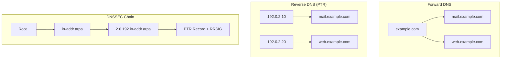

# How to Set Up DNSSEC for Reverse DNS (PTR Records)

Author: [nawazdhandala](https://github.com/nawazdhandala)

Tags: DNSSEC, DNS, Reverse DNS, PTR, Security, Infrastructure

Description: A comprehensive guide to securing your reverse DNS zones with DNSSEC, covering key generation, zone signing, DS record delegation, and troubleshooting for both IPv4 and IPv6 PTR records.

---

Reverse DNS lookups are critical for email deliverability, network diagnostics, and security verification. Yet most organizations leave their PTR records unsigned and vulnerable to spoofing. DNSSEC for reverse zones works differently than forward zones, and getting it wrong can break your entire IP allocation.

## Understanding Reverse DNS and DNSSEC

Reverse DNS maps IP addresses back to hostnames using PTR (Pointer) records. Unlike forward DNS where you control the zone, reverse DNS zones follow a strict hierarchy based on IP address allocation.



### Why DNSSEC Matters for Reverse DNS

Without DNSSEC, attackers can:
- **Spoof PTR records** to bypass email authentication
- **Poison reverse lookups** to mask malicious IP origins
- **Manipulate network diagnostics** during incident response
- **Bypass IP-based access controls** relying on reverse verification

### The Reverse DNS Hierarchy

For IPv4, reverse zones use the `.in-addr.arpa` domain:
- IP: `192.0.2.10`
- Reverse zone: `2.0.192.in-addr.arpa`
- PTR record: `10.2.0.192.in-addr.arpa. IN PTR mail.example.com.`

For IPv6, reverse zones use `.ip6.arpa`:
- IP: `2001:db8::1`
- Reverse zone: `8.b.d.0.1.0.0.2.ip6.arpa`
- PTR record expands each nibble in reverse

## Prerequisites

Before setting up DNSSEC for reverse DNS:

1. **Authoritative DNS server** with DNSSEC support (BIND 9.9+, PowerDNS 4.0+, Knot DNS)
2. **Control over your reverse zone** - delegated from your ISP/RIR or self-managed
3. **Access to parent zone** for DS record submission (usually your IP provider)
4. **NTP configured** - DNSSEC signatures are time-sensitive

Check your current setup:

```bash
# Verify BIND version supports DNSSEC
named -v

# Check if dnssec-keygen is available
which dnssec-keygen

# Verify your reverse zone is delegated
dig NS 2.0.192.in-addr.arpa +short
```

## Step 1: Configure Your Reverse Zone

First, set up your unsigned reverse zone properly.

### IPv4 Reverse Zone Configuration

Create the zone file at `/etc/bind/zones/db.192.0.2`:

```dns
$TTL 86400
$ORIGIN 2.0.192.in-addr.arpa.

@       IN      SOA     ns1.example.com. admin.example.com. (
                        2026011501      ; Serial (YYYYMMDDNN)
                        3600            ; Refresh (1 hour)
                        900             ; Retry (15 minutes)
                        604800          ; Expire (1 week)
                        86400           ; Minimum TTL (1 day)
                        )

; Name servers
@       IN      NS      ns1.example.com.
@       IN      NS      ns2.example.com.

; PTR Records
10      IN      PTR     mail.example.com.
20      IN      PTR     web.example.com.
30      IN      PTR     api.example.com.
40      IN      PTR     db1.example.com.
50      IN      PTR     db2.example.com.
100     IN      PTR     vpn.example.com.
200     IN      PTR     monitoring.example.com.
```

### IPv6 Reverse Zone Configuration

Create the zone file at `/etc/bind/zones/db.2001:db8`:

```dns
$TTL 86400
$ORIGIN 8.b.d.0.1.0.0.2.ip6.arpa.

@       IN      SOA     ns1.example.com. admin.example.com. (
                        2026011501      ; Serial
                        3600            ; Refresh
                        900             ; Retry
                        604800          ; Expire
                        86400           ; Minimum TTL
                        )

; Name servers
@       IN      NS      ns1.example.com.
@       IN      NS      ns2.example.com.

; PTR Records (for 2001:db8::1, 2001:db8::2, etc.)
1.0.0.0.0.0.0.0.0.0.0.0.0.0.0.0.0.0.0.0.0.0.0.0   IN   PTR   mail.example.com.
2.0.0.0.0.0.0.0.0.0.0.0.0.0.0.0.0.0.0.0.0.0.0.0   IN   PTR   web.example.com.
```

### BIND named.conf Configuration

Add your reverse zones to `/etc/bind/named.conf.local`:

```conf
// IPv4 Reverse Zone
zone "2.0.192.in-addr.arpa" {
    type master;
    file "/etc/bind/zones/db.192.0.2";
    allow-transfer { 10.0.0.2; };  // Secondary NS
    allow-update { none; };
};

// IPv6 Reverse Zone
zone "8.b.d.0.1.0.0.2.ip6.arpa" {
    type master;
    file "/etc/bind/zones/db.2001:db8";
    allow-transfer { 10.0.0.2; };
    allow-update { none; };
};
```

Verify your zone loads correctly:

```bash
# Check named configuration
named-checkconf

# Check zone file syntax
named-checkzone 2.0.192.in-addr.arpa /etc/bind/zones/db.192.0.2

# Reload BIND
rndc reload

# Test PTR resolution
dig -x 192.0.2.10 @localhost +short
```

## Step 2: Generate DNSSEC Keys

DNSSEC uses two types of keys:
- **KSK (Key Signing Key)** - Signs the DNSKEY RRset, used for trust chain
- **ZSK (Zone Signing Key)** - Signs all other records, rotated more frequently

### Generate Keys for IPv4 Reverse Zone

```bash
# Create key directory
mkdir -p /etc/bind/keys
cd /etc/bind/keys

# Generate KSK (Key Signing Key)
# Algorithm 13 = ECDSAP256SHA256 (recommended)
dnssec-keygen -a ECDSAP256SHA256 -f KSK -n ZONE 2.0.192.in-addr.arpa

# Generate ZSK (Zone Signing Key)
dnssec-keygen -a ECDSAP256SHA256 -n ZONE 2.0.192.in-addr.arpa
```

This creates four files:
```
K2.0.192.in-addr.arpa.+013+12345.key      # KSK public key
K2.0.192.in-addr.arpa.+013+12345.private  # KSK private key
K2.0.192.in-addr.arpa.+013+54321.key      # ZSK public key
K2.0.192.in-addr.arpa.+013+54321.private  # ZSK private key
```

### Generate Keys for IPv6 Reverse Zone

```bash
cd /etc/bind/keys

# Generate KSK
dnssec-keygen -a ECDSAP256SHA256 -f KSK -n ZONE 8.b.d.0.1.0.0.2.ip6.arpa

# Generate ZSK
dnssec-keygen -a ECDSAP256SHA256 -n ZONE 8.b.d.0.1.0.0.2.ip6.arpa
```

### Alternative: Using RSA Keys (Legacy Compatibility)

If you need RSA for compatibility with older resolvers:

```bash
# RSA KSK (2048-bit minimum, 4096 recommended)
dnssec-keygen -a RSASHA256 -b 4096 -f KSK -n ZONE 2.0.192.in-addr.arpa

# RSA ZSK (2048-bit)
dnssec-keygen -a RSASHA256 -b 2048 -n ZONE 2.0.192.in-addr.arpa
```

### Set Proper Key Permissions

```bash
# Secure key files
chmod 640 /etc/bind/keys/*.private
chmod 644 /etc/bind/keys/*.key
chown -R bind:bind /etc/bind/keys/
```

## Step 3: Sign Your Reverse Zones

### Include Keys in Zone File

Add key references to your zone file:

```dns
$TTL 86400
$ORIGIN 2.0.192.in-addr.arpa.

; Include DNSSEC keys
$INCLUDE "/etc/bind/keys/K2.0.192.in-addr.arpa.+013+12345.key"
$INCLUDE "/etc/bind/keys/K2.0.192.in-addr.arpa.+013+54321.key"

@       IN      SOA     ns1.example.com. admin.example.com. (
                        2026011502      ; Serial - INCREMENT THIS
                        3600
                        900
                        604800
                        86400
                        )

@       IN      NS      ns1.example.com.
@       IN      NS      ns2.example.com.

10      IN      PTR     mail.example.com.
20      IN      PTR     web.example.com.
30      IN      PTR     api.example.com.
```

### Sign the Zone

```bash
cd /etc/bind/zones

# Sign IPv4 reverse zone
dnssec-signzone -A -3 $(head -c 1000 /dev/urandom | sha1sum | cut -b 1-16) \
    -N INCREMENT \
    -o 2.0.192.in-addr.arpa \
    -t \
    -K /etc/bind/keys \
    db.192.0.2

# Sign IPv6 reverse zone
dnssec-signzone -A -3 $(head -c 1000 /dev/urandom | sha1sum | cut -b 1-16) \
    -N INCREMENT \
    -o 8.b.d.0.1.0.0.2.ip6.arpa \
    -t \
    -K /etc/bind/keys \
    db.2001:db8
```

Command options explained:
- `-A` - Use NSEC3 with opt-out for unsigned delegations
- `-3 <salt>` - Random salt for NSEC3 hashing
- `-N INCREMENT` - Automatically increment serial number
- `-o <zone>` - Zone origin
- `-t` - Print statistics
- `-K <dir>` - Key directory

### Understanding the Signed Zone Output

The signing process creates `db.192.0.2.signed` with:

```dns
; Signed zone file
2.0.192.in-addr.arpa.   86400   IN      SOA     ns1.example.com. admin.example.com. 2026011502 3600 900 604800 86400
2.0.192.in-addr.arpa.   86400   IN      RRSIG   SOA 13 4 86400 20260215000000 20260115000000 54321 2.0.192.in-addr.arpa. ABC123...
2.0.192.in-addr.arpa.   86400   IN      NS      ns1.example.com.
2.0.192.in-addr.arpa.   86400   IN      NS      ns2.example.com.
2.0.192.in-addr.arpa.   86400   IN      RRSIG   NS 13 4 86400 20260215000000 20260115000000 54321 2.0.192.in-addr.arpa. DEF456...
2.0.192.in-addr.arpa.   86400   IN      DNSKEY  256 3 13 ZSK_PUBLIC_KEY...
2.0.192.in-addr.arpa.   86400   IN      DNSKEY  257 3 13 KSK_PUBLIC_KEY...
2.0.192.in-addr.arpa.   86400   IN      RRSIG   DNSKEY 13 4 86400 20260215000000 20260115000000 12345 2.0.192.in-addr.arpa. GHI789...
10.2.0.192.in-addr.arpa. 86400  IN      PTR     mail.example.com.
10.2.0.192.in-addr.arpa. 86400  IN      RRSIG   PTR 13 5 86400 20260215000000 20260115000000 54321 2.0.192.in-addr.arpa. JKL012...
; NSEC3 records for authenticated denial
```

## Step 4: Update BIND Configuration

Update `named.conf.local` to use signed zones:

```conf
// Enable DNSSEC validation
options {
    dnssec-validation auto;
    dnssec-lookaside auto;
};

// IPv4 Reverse Zone - SIGNED
zone "2.0.192.in-addr.arpa" {
    type master;
    file "/etc/bind/zones/db.192.0.2.signed";
    allow-transfer { 10.0.0.2; };
    allow-update { none; };

    // Auto-resign before expiry
    auto-dnssec maintain;
    inline-signing yes;
    key-directory "/etc/bind/keys";
};

// IPv6 Reverse Zone - SIGNED
zone "8.b.d.0.1.0.0.2.ip6.arpa" {
    type master;
    file "/etc/bind/zones/db.2001:db8.signed";
    allow-transfer { 10.0.0.2; };
    allow-update { none; };

    auto-dnssec maintain;
    inline-signing yes;
    key-directory "/etc/bind/keys";
};
```

Reload BIND:

```bash
# Test configuration
named-checkconf

# Reload with new configuration
rndc reload

# Verify zone is loaded
rndc zonestatus 2.0.192.in-addr.arpa
```

## Step 5: Submit DS Records to Parent Zone

The DS (Delegation Signer) record establishes the chain of trust from the parent zone to your signed zone.

### Generate DS Records

```bash
# Generate DS record from KSK
dnssec-dsfromkey -2 /etc/bind/keys/K2.0.192.in-addr.arpa.+013+12345.key
```

Output:
```
2.0.192.in-addr.arpa. IN DS 12345 13 2 E2D3C9F8A7B6E5D4C3B2A1F0E9D8C7B6A5F4E3D2C1B0A9F8E7D6C5B4A3F2E1D0
```

### DS Record Components

| Field | Value | Description |
|-------|-------|-------------|
| Key Tag | 12345 | Identifier for the KSK |
| Algorithm | 13 | ECDSAP256SHA256 |
| Digest Type | 2 | SHA-256 |
| Digest | E2D3... | Hash of the DNSKEY |

### Submit to Your IP Provider

For reverse DNS, the parent zone is controlled by:
- **RIRs** (ARIN, RIPE, APNIC, AFRINIC, LACNIC) for direct allocations
- **ISPs** for delegated subnets
- **Hosting providers** for cloud IP ranges

#### RIPE NCC (Europe/Middle East)

Submit via RIPE Database:

```
domain:         2.0.192.in-addr.arpa
descr:          Example Company reverse zone
admin-c:        ADMIN-RIPE
tech-c:         TECH-RIPE
zone-c:         ZONE-RIPE
nserver:        ns1.example.com
nserver:        ns2.example.com
ds-rdata:       12345 13 2 E2D3C9F8A7B6E5D4C3B2A1F0E9D8C7B6A5F4E3D2C1B0A9F8E7D6C5B4A3F2E1D0
mnt-by:         EXAMPLE-MNT
source:         RIPE
```

#### ARIN (North America)

Use ARIN Online portal or REST API:

```bash
# Via ARIN REST API
curl -X PUT \
  -H "Content-Type: application/xml" \
  -H "Api-Key: YOUR_API_KEY" \
  --data @ds-record.xml \
  https://reg.arin.net/rest/delegation/2.0.192.in-addr.arpa/ds
```

#### Cloud Providers

| Provider | DS Record Submission |
|----------|---------------------|
| AWS Route 53 | Not supported for reverse zones |
| Google Cloud | Contact support for /24 allocations |
| Azure | Submit via support ticket |
| DigitalOcean | Not supported |
| Vultr | Contact support |

## Step 6: Verify DNSSEC Configuration

### Basic Verification

```bash
# Check DNSKEY records exist
dig DNSKEY 2.0.192.in-addr.arpa +short

# Check DS record is published in parent
dig DS 2.0.192.in-addr.arpa +short

# Verify RRSIG on PTR record
dig -x 192.0.2.10 +dnssec

# Check full validation chain
dig -x 192.0.2.10 +trace +dnssec
```

### Using delv for DNSSEC Validation

```bash
# Validate PTR record
delv -x 192.0.2.10 @8.8.8.8

# Expected output for valid DNSSEC:
; fully validated
10.2.0.192.in-addr.arpa. 86400 IN PTR mail.example.com.
10.2.0.192.in-addr.arpa. 86400 IN RRSIG PTR 13 5 86400 ...
```

### Online Validation Tools

Use these tools to verify your setup:

```bash
# DNSViz - Visual DNSSEC validation
open "https://dnsviz.net/d/2.0.192.in-addr.arpa/dnssec/"

# Verisign DNSSEC Analyzer
open "https://dnssec-analyzer.verisignlabs.com/2.0.192.in-addr.arpa"

# DANE SMTP Validator (for mail servers)
open "https://www.huque.com/bin/danecheck"
```

### Validation Script

```bash
#!/bin/bash
# validate-reverse-dnssec.sh

ZONE="2.0.192.in-addr.arpa"
TEST_IP="192.0.2.10"

echo "=== DNSSEC Validation for $ZONE ==="

echo -e "\n1. Checking DNSKEY records..."
dig DNSKEY $ZONE +short | head -5

echo -e "\n2. Checking DS record in parent..."
dig DS $ZONE +short

echo -e "\n3. Validating PTR record with DNSSEC..."
delv -x $TEST_IP @8.8.8.8 2>&1

echo -e "\n4. Checking signature expiry..."
dig RRSIG $ZONE +short | while read line; do
    expiry=$(echo $line | awk '{print $5}')
    echo "Signature expires: $expiry"
done

echo -e "\n5. Testing with multiple resolvers..."
for resolver in 8.8.8.8 1.1.1.1 9.9.9.9; do
    echo -n "  $resolver: "
    dig -x $TEST_IP @$resolver +short +dnssec > /dev/null 2>&1 && echo "OK" || echo "FAIL"
done
```

## Step 7: Set Up Automatic Key Rollover

### Configure BIND for Automatic Maintenance

```conf
// named.conf options
options {
    dnssec-validation auto;

    // Key maintenance settings
    sig-validity-interval 30 7;  // Sign for 30 days, re-sign at 7 days
};

zone "2.0.192.in-addr.arpa" {
    type master;
    file "/etc/bind/zones/db.192.0.2";

    auto-dnssec maintain;
    inline-signing yes;
    key-directory "/etc/bind/keys";

    // DNSSEC policy (BIND 9.16+)
    dnssec-policy "default";
};
```

### DNSSEC Policy (BIND 9.16+)

```conf
dnssec-policy "reverse-zone-policy" {
    // KSK settings
    keys {
        ksk key-directory lifetime P1Y algorithm ecdsap256sha256;
        zsk key-directory lifetime P30D algorithm ecdsap256sha256;
    };

    // Signature settings
    signatures-refresh P5D;
    signatures-validity P14D;
    signatures-validity-dnskey P14D;

    // NSEC3 parameters
    nsec3param iterations 10 optout no salt-length 16;

    // Parent DS submission timing
    parent-ds-ttl P1D;
    parent-propagation-delay PT1H;
    parent-registration-delay P1D;
};
```

### Manual ZSK Rollover

```bash
# Generate new ZSK
cd /etc/bind/keys
dnssec-keygen -a ECDSAP256SHA256 -n ZONE 2.0.192.in-addr.arpa

# Pre-publish new key (add to zone without signing)
dnssec-settime -P now -A +1w K2.0.192.in-addr.arpa.+013+NEW_KEY_ID

# After 1 week, activate new key
dnssec-settime -A now K2.0.192.in-addr.arpa.+013+NEW_KEY_ID

# After another week, retire old key
dnssec-settime -I now -D +1w K2.0.192.in-addr.arpa.+013+OLD_KEY_ID

# Reload BIND
rndc reload 2.0.192.in-addr.arpa
```

### Manual KSK Rollover (Double-DS Method)

```bash
# 1. Generate new KSK
dnssec-keygen -a ECDSAP256SHA256 -f KSK -n ZONE 2.0.192.in-addr.arpa

# 2. Publish new DNSKEY
dnssec-settime -P now K2.0.192.in-addr.arpa.+013+NEW_KSK_ID
rndc reload 2.0.192.in-addr.arpa

# 3. Generate new DS record
dnssec-dsfromkey -2 K2.0.192.in-addr.arpa.+013+NEW_KSK_ID.key

# 4. Add new DS to parent (keep old DS)
# Submit to RIR/ISP

# 5. Wait for DS propagation (24-48 hours)

# 6. Activate new KSK for signing
dnssec-settime -A now K2.0.192.in-addr.arpa.+013+NEW_KSK_ID

# 7. Retire old KSK
dnssec-settime -I now K2.0.192.in-addr.arpa.+013+OLD_KSK_ID
rndc reload 2.0.192.in-addr.arpa

# 8. Remove old DS from parent

# 9. Delete old KSK
dnssec-settime -D now K2.0.192.in-addr.arpa.+013+OLD_KSK_ID
```

## PowerDNS Configuration

If you're using PowerDNS instead of BIND:

### Enable DNSSEC Backend

```ini
# /etc/powerdns/pdns.conf
launch=gpgsql
gpgsql-host=127.0.0.1
gpgsql-dbname=powerdns
gpgsql-user=powerdns
gpgsql-password=secret

# DNSSEC settings
default-soa-content=ns1.example.com admin.example.com 0 10800 3600 604800 3600
```

### Secure the Reverse Zone

```bash
# Add reverse zone
pdnsutil create-zone 2.0.192.in-addr.arpa ns1.example.com

# Add PTR records
pdnsutil add-record 2.0.192.in-addr.arpa 10 PTR mail.example.com.
pdnsutil add-record 2.0.192.in-addr.arpa 20 PTR web.example.com.

# Secure with DNSSEC
pdnsutil secure-zone 2.0.192.in-addr.arpa

# Set NSEC3
pdnsutil set-nsec3 2.0.192.in-addr.arpa '1 0 10 abcd' narrow

# Show DS records for parent
pdnsutil show-zone 2.0.192.in-addr.arpa

# Rectify zone
pdnsutil rectify-zone 2.0.192.in-addr.arpa
```

### PowerDNS Key Management

```bash
# List keys
pdnsutil list-keys 2.0.192.in-addr.arpa

# Export DS record
pdnsutil export-zone-ds 2.0.192.in-addr.arpa

# Rollover ZSK
pdnsutil activate-zone-key 2.0.192.in-addr.arpa NEW_KEY_ID
pdnsutil deactivate-zone-key 2.0.192.in-addr.arpa OLD_KEY_ID
```

## Troubleshooting Common Issues

### Issue: SERVFAIL on PTR Queries

```bash
# Check if DNSSEC validation is failing
dig -x 192.0.2.10 +cd  # Bypass validation

# If +cd works but normal query fails, check:
# 1. DS record matches DNSKEY
dig DS 2.0.192.in-addr.arpa +short
dig DNSKEY 2.0.192.in-addr.arpa +short

# 2. Signatures haven't expired
dig RRSIG 2.0.192.in-addr.arpa +short

# 3. Clock sync
ntpq -p
```

### Issue: DS Record Not Propagated

```bash
# Check parent zone nameservers directly
dig NS 0.192.in-addr.arpa +short  # Get parent NS

# Query parent directly for DS
dig DS 2.0.192.in-addr.arpa @<parent-ns> +short

# Typical propagation: 24-72 hours for RIRs
```

### Issue: Signature Expired

```bash
# Check signature dates
dig RRSIG 2.0.192.in-addr.arpa +short

# Re-sign zone immediately
cd /etc/bind/zones
dnssec-signzone -A -N INCREMENT -o 2.0.192.in-addr.arpa -t -K /etc/bind/keys db.192.0.2

# Reload
rndc reload 2.0.192.in-addr.arpa
```

### Issue: NSEC3 Chain Broken

```bash
# Verify NSEC3 chain
named-checkzone -j 2.0.192.in-addr.arpa /etc/bind/zones/db.192.0.2.signed

# Rebuild NSEC3 chain
dnssec-signzone -A -3 $(openssl rand -hex 8) -N INCREMENT -o 2.0.192.in-addr.arpa -K /etc/bind/keys db.192.0.2
```

### Issue: Secondary Server Not Syncing Signed Zone

```bash
# On primary, ensure signed zone is transferred
rndc retransfer 2.0.192.in-addr.arpa

# Check zone transfer includes DNSSEC records
dig AXFR 2.0.192.in-addr.arpa @ns1.example.com | grep -E "(DNSKEY|RRSIG|NSEC)"

# Verify secondary has DNSSEC records
dig DNSKEY 2.0.192.in-addr.arpa @ns2.example.com +short
```

## Monitoring DNSSEC Health

### Nagios/Icinga Check

```bash
#!/bin/bash
# check_reverse_dnssec.sh

ZONE=$1
TEST_IP=$2
WARNING_DAYS=14
CRITICAL_DAYS=7

# Check DNSSEC validation
result=$(delv -x $TEST_IP @8.8.8.8 2>&1)
if echo "$result" | grep -q "fully validated"; then
    # Check signature expiry
    expiry=$(dig RRSIG $ZONE +short | head -1 | awk '{print $5}')
    expiry_epoch=$(date -d "${expiry:0:4}-${expiry:4:2}-${expiry:6:2}" +%s 2>/dev/null || echo 0)
    now_epoch=$(date +%s)
    days_left=$(( ($expiry_epoch - $now_epoch) / 86400 ))

    if [ $days_left -lt $CRITICAL_DAYS ]; then
        echo "CRITICAL: DNSSEC signature expires in $days_left days"
        exit 2
    elif [ $days_left -lt $WARNING_DAYS ]; then
        echo "WARNING: DNSSEC signature expires in $days_left days"
        exit 1
    else
        echo "OK: DNSSEC valid, signature expires in $days_left days"
        exit 0
    fi
else
    echo "CRITICAL: DNSSEC validation failed - $result"
    exit 2
fi
```

### Prometheus Metrics

```yaml
# prometheus-dnssec-exporter config
zones:
  - name: "2.0.192.in-addr.arpa"
    type: "reverse"
    test_record: "10"
  - name: "8.b.d.0.1.0.0.2.ip6.arpa"
    type: "reverse-ipv6"
    test_record: "1.0.0.0.0.0.0.0.0.0.0.0.0.0.0.0.0.0.0.0.0.0.0.0"

metrics:
  - dnssec_valid{zone}
  - dnssec_signature_expiry_seconds{zone}
  - dnssec_key_age_seconds{zone,key_type}
```

### Alert Rules

```yaml
# Prometheus alerting rules
groups:
  - name: dnssec
    rules:
      - alert: DNSSECSignatureExpiringSoon
        expr: dnssec_signature_expiry_seconds < 7 * 24 * 3600
        for: 1h
        labels:
          severity: warning
        annotations:
          summary: "DNSSEC signature expiring soon for {{ $labels.zone }}"

      - alert: DNSSECValidationFailed
        expr: dnssec_valid == 0
        for: 5m
        labels:
          severity: critical
        annotations:
          summary: "DNSSEC validation failing for {{ $labels.zone }}"
```

## Security Best Practices

### Key Storage

```bash
# Use HSM for production KSK storage
# PKCS#11 provider configuration
pkcs11-modules {
    "opensc-pkcs11.so" {
        path "/usr/lib/opensc-pkcs11.so";
    };
};

# Generate key on HSM
dnssec-keygen -E pkcs11 -a ECDSAP256SHA256 -f KSK -n ZONE 2.0.192.in-addr.arpa
```

### Algorithm Selection

| Algorithm | ID | Security | Recommendation |
|-----------|----|---------:|----------------|
| RSA/SHA-256 | 8 | Good | Legacy systems |
| RSA/SHA-512 | 10 | Good | Legacy systems |
| ECDSA P-256 | 13 | Excellent | Recommended |
| ECDSA P-384 | 14 | Excellent | High security |
| Ed25519 | 15 | Excellent | Future-proof |
| Ed448 | 16 | Excellent | Maximum security |

### Audit Logging

```conf
# BIND logging for DNSSEC events
logging {
    channel dnssec_log {
        file "/var/log/named/dnssec.log" versions 10 size 10m;
        severity info;
        print-time yes;
        print-category yes;
    };

    category dnssec { dnssec_log; };
};
```

## Summary Table: DNSSEC Reverse Zone Setup

| Step | Command/Action | Verification |
|------|---------------|--------------|
| 1. Create zone | Edit zone file | `named-checkzone` |
| 2. Generate KSK | `dnssec-keygen -f KSK` | Check `.key` file exists |
| 3. Generate ZSK | `dnssec-keygen` | Check `.key` file exists |
| 4. Sign zone | `dnssec-signzone` | Check `.signed` file |
| 5. Update config | Use `.signed` zone file | `named-checkconf` |
| 6. Reload BIND | `rndc reload` | `rndc zonestatus` |
| 7. Generate DS | `dnssec-dsfromkey` | Copy output |
| 8. Submit DS | RIR/ISP portal | `dig DS zone` |
| 9. Verify | `delv -x IP` | "fully validated" |
| 10. Monitor | Check signature expiry | Alerting configured |

## IPv4 vs IPv6 Reverse Zone Differences

| Aspect | IPv4 | IPv6 |
|--------|------|------|
| Parent zone | `.in-addr.arpa` | `.ip6.arpa` |
| Octet order | Reversed by octet | Reversed by nibble |
| Zone delegation | /8, /16, /24 boundaries | /32, /48, /64 boundaries |
| PTR format | `10.2.0.192.in-addr.arpa` | `1.0.0...8.b.d.0.1.0.0.2.ip6.arpa` |
| Common delegations | /24 from ISP | /48 from RIR |

## Key Timings Reference

| Action | Recommended Interval |
|--------|---------------------|
| ZSK rotation | 30-90 days |
| KSK rotation | 1-2 years |
| Signature validity | 14-30 days |
| Re-sign threshold | 7 days before expiry |
| DS propagation wait | 24-48 hours |
| DNSKEY pre-publish | 1 week before activation |

---

Securing your reverse DNS with DNSSEC protects the integrity of PTR lookups that many systems depend on for security decisions. While the setup requires coordination with your IP provider for DS record submission, the cryptographic protection is worth the effort. Start with your most critical reverse zones - mail servers and API endpoints - and expand from there. Monitor signature expiry religiously, because an expired signature means complete resolution failure, not just reduced security.
