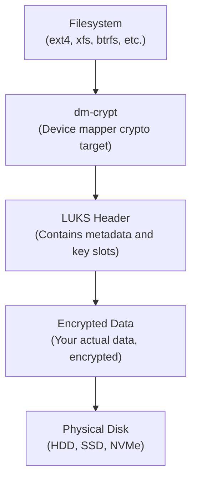

# How to Encrypt Disk Partitions with LUKS on Ubuntu

Author: [nawazdhandala](https://www.github.com/nawazdhandala)

Tags: Ubuntu, LUKS, Encryption, Security, Disk Encryption, Tutorial

Description: Complete guide to encrypting disk partitions using LUKS on Ubuntu for data security.

---

Protecting sensitive data is a fundamental requirement in today's computing environment. Whether you're safeguarding personal files, business data, or meeting compliance requirements, encrypting your disk partitions ensures that your data remains secure even if physical access to the drive is compromised. This comprehensive guide walks you through encrypting disk partitions using LUKS (Linux Unified Key Setup) on Ubuntu.

## Understanding LUKS Encryption

LUKS is the standard for Linux hard disk encryption. It provides a platform-independent standard format for encrypted volumes, making it portable across different Linux distributions.

### How LUKS Works

LUKS operates at the block device level, encrypting entire partitions. Here's the architecture:



### Key LUKS Features

- **Multiple Key Slots**: LUKS supports up to 8 key slots, allowing multiple passphrases or key files
- **Strong Encryption**: Uses AES-256 by default with secure cipher modes
- **Header Contains Metadata**: All encryption parameters are stored in the header
- **Anti-Forensic Information Splitter**: Protects against key recovery attacks
- **Standardized Format**: LUKS2 is the current version with improved features

### LUKS1 vs LUKS2

| Feature | LUKS1 | LUKS2 |
|---------|-------|-------|
| Key Slots | 8 | 32 |
| Header Size | 2 MB | 16 MB (default) |
| Metadata Format | Binary | JSON |
| Integrity Support | No | Yes (dm-integrity) |
| Token Support | No | Yes |
| Argon2 KDF | No | Yes |

## Prerequisites and Planning

Before encrypting your partitions, careful planning is essential.

### System Requirements

```bash
# Check your Ubuntu version
lsb_release -a

# Verify kernel supports dm-crypt
grep -i dm_crypt /proc/modules
# Or load the module if not present
sudo modprobe dm-crypt

# Check available disk space
df -h

# List all block devices
lsblk
```

### Planning Considerations

1. **Backup Your Data**: Encryption is destructive to existing data on the partition
2. **Choose the Right Partition**: Identify which partition(s) to encrypt
3. **Password Strength**: Use a strong passphrase (20+ characters recommended)
4. **Recovery Plan**: Plan for header backup and recovery scenarios
5. **Performance Impact**: Consider SSD vs HDD performance implications

### Identify Target Partition

```bash
# List all partitions with details
sudo fdisk -l

# Show partition information with filesystem type
lsblk -f

# Example output:
# NAME   FSTYPE      LABEL UUID                                 MOUNTPOINT
# sda
# ├─sda1 vfat              ABCD-1234                            /boot/efi
# ├─sda2 ext4              12345678-abcd-ef00-1234-567890abcdef /boot
# └─sda3 ext4              87654321-dcba-00fe-4321-fedcba098765 /
# sdb
# └─sdb1 ext4              11111111-2222-3333-4444-555555555555 /data
```

## Installing cryptsetup

The `cryptsetup` package provides the tools needed for LUKS encryption.

```bash
# Update package lists
sudo apt update

# Install cryptsetup and related tools
sudo apt install -y cryptsetup cryptsetup-initramfs

# Verify installation
cryptsetup --version
# Output: cryptsetup 2.6.1

# Check available ciphers and their performance
cryptsetup benchmark
```

### Benchmark Output Explained

```bash
# Run encryption benchmark
sudo cryptsetup benchmark

# Sample output:
# PBKDF2-sha1      1234567 iterations per second for 256-bit key
# PBKDF2-sha256     987654 iterations per second for 256-bit key
# PBKDF2-sha512     654321 iterations per second for 256-bit key
# argon2i           4 iterations, 1048576 memory, 4 parallel threads
# argon2id          4 iterations, 1048576 memory, 4 parallel threads
#
# Algorithm |       Key |      Encryption |      Decryption
#    aes-cbc        128b       1234.5 MiB/s       4567.8 MiB/s
#    aes-cbc        256b       1000.2 MiB/s       3456.7 MiB/s
#    aes-xts        256b       2345.6 MiB/s       2345.6 MiB/s
#    aes-xts        512b       2000.3 MiB/s       2000.3 MiB/s

# Note: aes-xts with 512b key means 256-bit AES encryption
# (XTS mode uses two keys, each 256-bit)
```

## Encrypting a New Partition

This section covers encrypting a fresh partition that doesn't contain data you need to preserve.

### Step 1: Create the Partition (if needed)

```bash
# Using fdisk to create a new partition
# WARNING: This is destructive - make sure you select the correct disk!
sudo fdisk /dev/sdb

# In fdisk:
# n - create new partition
# p - primary partition
# 1 - partition number
# [Enter] - default first sector
# [Enter] - default last sector (use entire disk)
# w - write changes and exit

# Alternatively, use parted for GPT disks
sudo parted /dev/sdb mklabel gpt
sudo parted /dev/sdb mkpart primary 0% 100%
```

### Step 2: Initialize LUKS Encryption

```bash
# Initialize LUKS2 encryption on the partition
# WARNING: This will destroy all data on the partition!
sudo cryptsetup luksFormat /dev/sdb1

# You'll see a warning and be prompted to type YES (uppercase)
# Then enter and verify your passphrase

# For more control over encryption parameters:
sudo cryptsetup luksFormat \
    --type luks2 \                    # Use LUKS2 format
    --cipher aes-xts-plain64 \        # Cipher specification
    --key-size 512 \                  # 512 bits for XTS (256-bit AES)
    --hash sha256 \                   # Hash algorithm for PBKDF
    --iter-time 5000 \                # PBKDF iteration time in ms
    --pbkdf argon2id \                # Use Argon2id for key derivation
    --pbkdf-memory 1048576 \          # 1GB memory for Argon2
    --pbkdf-parallel 4 \              # 4 parallel threads
    /dev/sdb1

# Verify the LUKS header
sudo cryptsetup luksDump /dev/sdb1
```

### Step 3: Open the Encrypted Partition

```bash
# Open (unlock) the encrypted partition
# This creates a mapping at /dev/mapper/encrypted_data
sudo cryptsetup open /dev/sdb1 encrypted_data

# Verify the mapping exists
ls -la /dev/mapper/encrypted_data

# Check the status
sudo cryptsetup status encrypted_data
# Output shows cipher, key size, device, etc.
```

### Step 4: Create a Filesystem

```bash
# Create an ext4 filesystem on the encrypted partition
sudo mkfs.ext4 -L "Encrypted Data" /dev/mapper/encrypted_data

# For better SSD performance, use:
sudo mkfs.ext4 -L "Encrypted Data" -E discard /dev/mapper/encrypted_data

# Other filesystem options:
# XFS (good for large files):
sudo mkfs.xfs -L "Encrypted Data" /dev/mapper/encrypted_data

# Btrfs (with compression):
sudo mkfs.btrfs -L "Encrypted Data" /dev/mapper/encrypted_data
```

### Step 5: Mount and Use

```bash
# Create a mount point
sudo mkdir -p /mnt/encrypted

# Mount the encrypted filesystem
sudo mount /dev/mapper/encrypted_data /mnt/encrypted

# Set appropriate permissions
sudo chown $USER:$USER /mnt/encrypted

# Verify the mount
df -h /mnt/encrypted
mount | grep encrypted_data

# Create a test file
echo "This data is encrypted at rest" > /mnt/encrypted/test.txt
```

### Step 6: Unmount and Close

```bash
# When done, unmount the filesystem
sudo umount /mnt/encrypted

# Close (lock) the encrypted partition
sudo cryptsetup close encrypted_data

# Verify it's closed
ls /dev/mapper/ | grep encrypted_data
# Should return nothing
```

## Adding LUKS to Existing Data (with backup)

If you have existing data that you want to encrypt, you must back it up first.

### Complete Backup Procedure

```bash
# Step 1: Identify the partition with existing data
lsblk -f
# Let's say /dev/sdc1 is mounted at /data with important files

# Step 2: Calculate required backup space
du -sh /data
# Example output: 50G    /data

# Step 3: Create backup (multiple options)

# Option A: Use rsync for file-level backup
sudo mkdir -p /backup/data_backup
sudo rsync -avhP --progress /data/ /backup/data_backup/

# Option B: Use tar for compressed archive
sudo tar -cvzf /backup/data_backup.tar.gz -C /data .

# Option C: Use dd for exact partition copy (requires equal or larger target)
sudo dd if=/dev/sdc1 of=/backup/sdc1_backup.img bs=4M status=progress

# Step 4: Verify backup integrity
# For rsync:
diff -rq /data /backup/data_backup

# For tar:
tar -tvzf /backup/data_backup.tar.gz | head -20

# For dd:
sudo mount -o loop /backup/sdc1_backup.img /mnt/verify
ls /mnt/verify
sudo umount /mnt/verify

# Step 5: Unmount the original partition
sudo umount /data

# Step 6: Encrypt the partition (destroys existing data!)
sudo cryptsetup luksFormat /dev/sdc1

# Step 7: Open and format
sudo cryptsetup open /dev/sdc1 encrypted_data
sudo mkfs.ext4 /dev/mapper/encrypted_data

# Step 8: Mount and restore data
sudo mount /dev/mapper/encrypted_data /data
sudo rsync -avhP /backup/data_backup/ /data/

# Step 9: Verify restoration
ls -la /data
du -sh /data

# Step 10: Clean up backup (only after confirming everything works!)
# sudo rm -rf /backup/data_backup
```

### In-Place Encryption (Advanced)

For advanced users, `cryptsetup-reencrypt` can encrypt in-place, but it's risky.

```bash
# WARNING: This is risky - backup first anyway!
# Only works with LUKS2 and requires free space in the partition

# Shrink the filesystem first to make room for LUKS header
sudo e2fsck -f /dev/sdc1
sudo resize2fs /dev/sdc1 $(($(blockdev --getsize64 /dev/sdc1)/1024/1024 - 32))M

# Perform in-place encryption
sudo cryptsetup reencrypt --encrypt --reduce-device-size 32M /dev/sdc1

# This process can take hours depending on partition size
# Do NOT interrupt it or you'll lose data!
```

## Key Management (Key Slots)

LUKS supports multiple key slots, allowing different passphrases or key files to unlock the same volume.

### Viewing Key Slots

```bash
# Display LUKS header information including key slots
sudo cryptsetup luksDump /dev/sdb1

# Output shows:
# Keyslots:
#   0: luks2
#      Key:        512 bits
#      Priority:   normal
#      Cipher:     aes-xts-plain64
#      ...
#   1: luks2
#      ...
# (slots 0-7 for LUKS1, 0-31 for LUKS2)
```

### Adding a New Key

```bash
# Add a new passphrase to slot 1
# You'll need an existing passphrase to authorize adding a new one
sudo cryptsetup luksAddKey /dev/sdb1

# Specify a particular slot
sudo cryptsetup luksAddKey --key-slot 2 /dev/sdb1

# Add key from a key file
sudo cryptsetup luksAddKey /dev/sdb1 /path/to/keyfile

# Add key using existing key file for authentication
sudo cryptsetup luksAddKey --key-file /existing/keyfile /dev/sdb1 /new/keyfile
```

### Removing a Key

```bash
# Remove a key by slot number
sudo cryptsetup luksKillSlot /dev/sdb1 1

# Remove a key by passphrase (enter the passphrase to remove)
sudo cryptsetup luksRemoveKey /dev/sdb1

# WARNING: Never remove all keys! You'll lose access to your data!
```

### Changing a Passphrase

```bash
# Change an existing passphrase
sudo cryptsetup luksChangeKey /dev/sdb1

# You'll be prompted for:
# 1. The old passphrase
# 2. The new passphrase (twice for confirmation)

# Change passphrase in a specific slot
sudo cryptsetup luksChangeKey --key-slot 0 /dev/sdb1
```

### Key Slot Best Practices

```bash
# Example key slot organization:
# Slot 0: Primary user passphrase (strong, memorized)
# Slot 1: Recovery passphrase (very strong, stored securely offline)
# Slot 2: Key file for automated unlocking
# Slot 3: Emergency recovery key (stored in safe)

# View which slots are in use
sudo cryptsetup luksDump /dev/sdb1 | grep -A 5 "Keyslots:"

# Test a specific key slot
sudo cryptsetup open --test-passphrase --key-slot 0 /dev/sdb1
echo $?  # 0 means success
```

## Automatic Unlocking at Boot

To automatically unlock and mount encrypted partitions at boot, configure `/etc/crypttab` and `/etc/fstab`.

### Method 1: Passphrase Prompt at Boot

```bash
# Step 1: Get the UUID of the LUKS partition
sudo blkid /dev/sdb1
# Output: /dev/sdb1: UUID="12345678-1234-1234-1234-123456789abc" TYPE="crypto_LUKS"

# Step 2: Add entry to /etc/crypttab
# Format: <name> <device> <keyfile> <options>
sudo nano /etc/crypttab

# Add this line:
encrypted_data UUID=12345678-1234-1234-1234-123456789abc none luks,discard

# Explanation:
# encrypted_data - Name for the mapped device (/dev/mapper/encrypted_data)
# UUID=...       - The UUID of the LUKS partition
# none           - No key file (prompt for passphrase)
# luks,discard   - Options (discard enables TRIM for SSDs)

# Step 3: Get the UUID of the decrypted filesystem
sudo cryptsetup open /dev/sdb1 encrypted_data
sudo blkid /dev/mapper/encrypted_data
# Output: /dev/mapper/encrypted_data: UUID="abcd1234-..." TYPE="ext4"

# Step 4: Add entry to /etc/fstab
sudo nano /etc/fstab

# Add this line:
/dev/mapper/encrypted_data /mnt/encrypted ext4 defaults,noatime 0 2

# Or using UUID of the filesystem:
UUID=abcd1234-... /mnt/encrypted ext4 defaults,noatime 0 2

# Step 5: Create mount point
sudo mkdir -p /mnt/encrypted

# Step 6: Update initramfs
sudo update-initramfs -u

# Step 7: Test the configuration
sudo mount -a
df -h /mnt/encrypted
```

### Method 2: Using systemd-cryptsetup

```bash
# systemd reads /etc/crypttab automatically
# Additional options for systemd:

# In /etc/crypttab:
encrypted_data UUID=12345678-... none luks,discard,timeout=60,tries=3

# Options explained:
# timeout=60  - Wait 60 seconds for passphrase
# tries=3     - Allow 3 attempts before failing
# nofail      - Don't fail boot if unlock fails (useful for removable drives)
# noauto      - Don't unlock automatically at boot

# View systemd-cryptsetup status
systemctl status systemd-cryptsetup@encrypted_data
```

## Using Key Files

Key files allow passwordless unlocking, useful for automated systems or additional security layers.

### Creating a Key File

```bash
# Method 1: Random data key file (most secure)
sudo dd if=/dev/urandom of=/root/.luks_keyfile bs=4096 count=1

# Method 2: Random data with specific size
sudo head -c 4096 /dev/urandom > /root/.luks_keyfile

# Set secure permissions
sudo chmod 400 /root/.luks_keyfile
sudo chown root:root /root/.luks_keyfile

# Optional: Use a USB drive as key file location
# Mount USB drive first
sudo mount /dev/sdd1 /mnt/usb
sudo dd if=/dev/urandom of=/mnt/usb/.luks_keyfile bs=4096 count=1
sudo chmod 400 /mnt/usb/.luks_keyfile
```

### Adding Key File to LUKS

```bash
# Add the key file to an available slot
sudo cryptsetup luksAddKey /dev/sdb1 /root/.luks_keyfile

# Verify the key file works
sudo cryptsetup open --key-file /root/.luks_keyfile /dev/sdb1 test_open
sudo cryptsetup close test_open
```

### Configuring Automatic Unlock with Key File

```bash
# Update /etc/crypttab to use the key file
sudo nano /etc/crypttab

# Change from:
# encrypted_data UUID=12345678-... none luks,discard

# To:
encrypted_data UUID=12345678-... /root/.luks_keyfile luks,discard

# Update initramfs to include the key file
sudo nano /etc/cryptsetup-initramfs/conf-hook
# Add: KEYFILE_PATTERN="/root/.luks_keyfile"

# Or for multiple key files:
# KEYFILE_PATTERN="/root/*.keyfile"

# Update initramfs
sudo update-initramfs -u

# Note: The initramfs will contain the key file
# This is secure if /boot is encrypted or physically secured
```

### Key File on USB Drive

```bash
# Use a USB drive for two-factor authentication (something you have)

# Step 1: Prepare the USB drive
sudo fdisk /dev/sdd  # Create a small partition
sudo mkfs.ext4 -L "LUKS_KEY" /dev/sdd1

# Step 2: Create key file on USB
sudo mount /dev/sdd1 /mnt/usb
sudo dd if=/dev/urandom of=/mnt/usb/.key bs=4096 count=1
sudo chmod 400 /mnt/usb/.key
sudo umount /mnt/usb

# Step 3: Add to crypttab with USB identification
# First, get the USB partition's UUID
sudo blkid /dev/sdd1
# UUID="USB-PART-UUID"

# Step 4: Configure crypttab
sudo nano /etc/crypttab

# Add:
encrypted_data UUID=LUKS-UUID /dev/disk/by-uuid/USB-PART-UUID:/.key luks,keyscript=/lib/cryptsetup/scripts/passdev

# The keyscript will:
# 1. Wait for the USB device
# 2. Mount it temporarily
# 3. Read the key file
# 4. Unmount the USB
```

## LUKS Header Backup and Restore

The LUKS header contains all encryption metadata and key slots. Losing it means losing your data forever.

### Backing Up the LUKS Header

```bash
# Create a header backup
sudo cryptsetup luksHeaderBackup /dev/sdb1 \
    --header-backup-file /root/luks_header_backup_sdb1.img

# Verify the backup
file /root/luks_header_backup_sdb1.img
# Output: LUKS encrypted file, ver 2...

sudo cryptsetup luksDump /root/luks_header_backup_sdb1.img

# Store the backup securely:
# 1. Encrypt the backup file
gpg --symmetric --cipher-algo AES256 /root/luks_header_backup_sdb1.img

# 2. Copy to multiple secure locations
sudo cp /root/luks_header_backup_sdb1.img.gpg /mnt/backup_drive/
# Also store offline (USB drive in safe, etc.)

# 3. Document the partition it belongs to
echo "Backup for /dev/sdb1 (UUID: $(blkid -s UUID -o value /dev/sdb1))" \
    > /root/luks_header_backup_sdb1.txt
echo "Created: $(date)" >> /root/luks_header_backup_sdb1.txt
```

### Restoring a LUKS Header

```bash
# WARNING: Restoring a header will overwrite the current header!
# This includes all key slots - old passphrases from before backup won't work

# Restore header from backup
sudo cryptsetup luksHeaderRestore /dev/sdb1 \
    --header-backup-file /root/luks_header_backup_sdb1.img

# After restore, you must use passphrases from when the backup was created
```

### Detached LUKS Headers

For extra security, store the LUKS header separately from the data.

```bash
# Create encrypted partition with detached header
sudo cryptsetup luksFormat \
    --header /root/detached_header.img \
    /dev/sdb1

# Open with detached header
sudo cryptsetup open \
    --header /root/detached_header.img \
    /dev/sdb1 encrypted_data

# Benefits:
# 1. The partition looks like random data without the header
# 2. Physical theft of drive doesn't include encryption metadata
# 3. Header can be stored on separate secure media

# Store header on USB drive for two-factor protection
sudo cp /root/detached_header.img /mnt/secure_usb/
```

## Encrypting Swap Partition

Swap contains sensitive data from RAM. Encrypting it prevents data leaks.

### Method 1: Random Key (Recommended for most users)

```bash
# Step 1: Identify your swap partition
cat /proc/swaps
swapon --show
lsblk | grep swap

# Step 2: Disable swap
sudo swapoff -a

# Step 3: Configure encrypted swap in crypttab
sudo nano /etc/crypttab

# Add (use your swap partition):
cryptswap /dev/sda3 /dev/urandom swap,cipher=aes-xts-plain64,size=256

# Explanation:
# cryptswap    - Name for the mapped device
# /dev/sda3    - Your swap partition
# /dev/urandom - Generate random key at each boot
# swap         - Format as swap after decryption
# cipher,size  - Encryption parameters

# Step 4: Update fstab
sudo nano /etc/fstab

# Change swap line from:
# UUID=swap-uuid none swap sw 0 0

# To:
/dev/mapper/cryptswap none swap sw 0 0

# Step 5: Reboot and verify
sudo reboot

# After reboot:
swapon --show
# Should show /dev/mapper/cryptswap

# Note: Hibernation won't work with random key encryption
```

### Method 2: Persistent Key (Required for hibernation)

```bash
# For hibernation support, swap needs a persistent key

# Step 1: Create encrypted swap with passphrase
sudo swapoff -a
sudo cryptsetup luksFormat /dev/sda3
sudo cryptsetup open /dev/sda3 cryptswap
sudo mkswap /dev/mapper/cryptswap

# Step 2: Configure crypttab with key file
sudo nano /etc/crypttab

# Add:
cryptswap UUID=<swap-partition-uuid> /root/.swap_keyfile luks,discard

# Step 3: Create and add key file
sudo dd if=/dev/urandom of=/root/.swap_keyfile bs=4096 count=1
sudo chmod 400 /root/.swap_keyfile
sudo cryptsetup luksAddKey /dev/sda3 /root/.swap_keyfile

# Step 4: Update fstab
sudo nano /etc/fstab

# Add:
/dev/mapper/cryptswap none swap sw 0 0

# Step 5: Update initramfs for hibernation
sudo nano /etc/initramfs-tools/conf.d/resume
# Add: RESUME=/dev/mapper/cryptswap

sudo update-initramfs -u
```

## Full Disk Encryption During Install

Ubuntu supports full disk encryption during installation.

### During Ubuntu Installation

```
1. Boot Ubuntu installer (live USB)
2. Choose "Install Ubuntu"
3. Select "Erase disk and install Ubuntu"
4. Check "Encrypt the new Ubuntu installation for security"
5. Check "Use LVM with the new Ubuntu installation" (recommended)
6. Choose a security key (passphrase)
7. Optionally check "Overwrite empty disk space" (slower but more secure)
8. Complete installation

The installer creates:
- /boot (unencrypted, needed for bootloader)
- LUKS-encrypted partition containing:
  - LVM physical volume
  - Root filesystem (/)
  - Swap
  - (Optional) Home partition
```

### Post-Install Verification

```bash
# Verify encryption is active
lsblk -f

# Example output:
# NAME                    FSTYPE      LABEL MOUNTPOINT
# nvme0n1
# ├─nvme0n1p1             vfat              /boot/efi
# ├─nvme0n1p2             ext4              /boot
# └─nvme0n1p3             crypto_LUKS
#   └─nvme0n1p3_crypt     LVM2_member
#     ├─vgubuntu-root     ext4              /
#     └─vgubuntu-swap     swap              [SWAP]

# Check LUKS details
sudo cryptsetup luksDump /dev/nvme0n1p3

# View LVM setup
sudo lvs
sudo vgs
sudo pvs
```

### Manual Full Disk Encryption

```bash
# For custom installations (advanced users)

# Step 1: Boot live environment
# Step 2: Partition the disk
sudo parted /dev/nvme0n1 mklabel gpt
sudo parted /dev/nvme0n1 mkpart primary fat32 1MiB 512MiB    # EFI
sudo parted /dev/nvme0n1 mkpart primary ext4 512MiB 1536MiB  # Boot
sudo parted /dev/nvme0n1 mkpart primary 1536MiB 100%         # LUKS

sudo parted /dev/nvme0n1 set 1 esp on

# Step 3: Setup LUKS
sudo cryptsetup luksFormat /dev/nvme0n1p3
sudo cryptsetup open /dev/nvme0n1p3 cryptroot

# Step 4: Setup LVM
sudo pvcreate /dev/mapper/cryptroot
sudo vgcreate vgubuntu /dev/mapper/cryptroot
sudo lvcreate -L 8G -n swap vgubuntu
sudo lvcreate -l 100%FREE -n root vgubuntu

# Step 5: Create filesystems
sudo mkfs.fat -F32 /dev/nvme0n1p1
sudo mkfs.ext4 /dev/nvme0n1p2
sudo mkfs.ext4 /dev/mapper/vgubuntu-root
sudo mkswap /dev/mapper/vgubuntu-swap

# Step 6: Install Ubuntu using the graphical installer
# Choose "Something else" and manually assign partitions
```

## Performance Considerations

LUKS encryption has minimal performance impact on modern hardware.

### Hardware Acceleration

```bash
# Check for AES-NI support (Intel/AMD)
grep -o aes /proc/cpuinfo | head -1
# Output: aes (if supported)

# Check if AES-NI is being used
sudo cryptsetup benchmark

# With AES-NI, expect:
# aes-xts: 2000-4000 MiB/s (faster than most SSDs)
# Without AES-NI: 200-500 MiB/s (noticeable slowdown)

# For ARM systems, check for crypto extensions
grep -i crypto /proc/cpuinfo
```

### SSD Optimization (TRIM/Discard)

```bash
# Enable TRIM for SSDs in crypttab
# Edit /etc/crypttab:
encrypted_data UUID=... none luks,discard

# Or when opening manually:
sudo cryptsetup open --allow-discards /dev/sdb1 encrypted_data

# Verify TRIM is working
sudo fstrim -v /mnt/encrypted
# Should report trimmed bytes

# Security note: TRIM can leak information about which blocks are used
# For maximum security, disable TRIM (at cost of SSD performance/lifespan)
```

### Performance Benchmarking

```bash
# Install benchmarking tools
sudo apt install fio hdparm

# Test raw disk speed
sudo hdparm -Tt /dev/sdb

# Test encrypted volume speed
sudo hdparm -Tt /dev/mapper/encrypted_data

# More thorough benchmark with fio
# Sequential read:
sudo fio --name=seqread --rw=read --bs=1M --size=1G \
    --filename=/mnt/encrypted/testfile --direct=1

# Sequential write:
sudo fio --name=seqwrite --rw=write --bs=1M --size=1G \
    --filename=/mnt/encrypted/testfile --direct=1

# Random read (4K blocks):
sudo fio --name=randread --rw=randread --bs=4K --size=256M \
    --filename=/mnt/encrypted/testfile --direct=1

# Clean up
rm /mnt/encrypted/testfile
```

### Performance Tuning

```bash
# Increase queue depth for better throughput
echo 256 | sudo tee /sys/block/dm-0/queue/nr_requests

# Use faster cipher (if AES-NI available)
sudo cryptsetup luksFormat --cipher aes-xts-plain64 /dev/sdb1

# For systems without AES-NI, consider:
# --cipher serpent-xts-plain64 (slower but doesn't need hardware)
# --cipher chacha20,poly1305 (LUKS2 only, good for older CPUs)

# Check current cipher
sudo cryptsetup status encrypted_data
```

## Troubleshooting

### Common Issues and Solutions

#### Cannot Open LUKS Device

```bash
# Error: No key available with this passphrase
# Cause: Wrong passphrase or corrupted header

# Try different key slots
for i in {0..7}; do
    echo "Testing slot $i..."
    sudo cryptsetup open --test-passphrase --key-slot $i /dev/sdb1 2>/dev/null && echo "Slot $i works"
done

# Check if LUKS header is intact
sudo cryptsetup luksDump /dev/sdb1
# If this fails, header is corrupted - restore from backup

# Try with verbose output
sudo cryptsetup -v open /dev/sdb1 encrypted_data
```

#### Boot Fails After Encryption Setup

```bash
# Boot from live USB
# Mount the encrypted partition manually

sudo cryptsetup open /dev/sda3 cryptroot
sudo mount /dev/mapper/vgubuntu-root /mnt
sudo mount /dev/sda2 /mnt/boot
sudo mount /dev/sda1 /mnt/boot/efi

# Chroot into the system
sudo mount --bind /dev /mnt/dev
sudo mount --bind /proc /mnt/proc
sudo mount --bind /sys /mnt/sys
sudo chroot /mnt

# Regenerate initramfs
update-initramfs -u -k all

# Verify crypttab
cat /etc/crypttab

# Verify fstab
cat /etc/fstab

# Exit and reboot
exit
sudo umount -R /mnt
sudo reboot
```

#### Slow Boot with LUKS

```bash
# Reduce PBKDF iteration time (trades security for speed)
# Note: This reduces resistance to brute-force attacks

# Check current settings
sudo cryptsetup luksDump /dev/sdb1 | grep -A 10 "Keyslot"

# Add a new key with faster settings
sudo cryptsetup luksAddKey --pbkdf pbkdf2 --iter-time 1000 /dev/sdb1

# Or for LUKS2 with Argon2:
sudo cryptsetup luksAddKey \
    --pbkdf argon2id \
    --pbkdf-memory 524288 \
    --iter-time 2000 \
    /dev/sdb1

# Remove old slow key after verifying new one works
```

#### LUKS Header Corruption Recovery

```bash
# If you have a header backup:
sudo cryptsetup luksHeaderRestore /dev/sdb1 \
    --header-backup-file /path/to/backup.img

# If no backup exists and only partial corruption:
# Try to repair (may not work)
sudo cryptsetup repair /dev/sdb1

# If repair fails and no backup:
# Data is likely unrecoverable
# This is why header backups are critical!
```

#### Passphrase Not Accepted During Boot

```bash
# Possible causes:
# 1. Keyboard layout different from when passphrase was set
# 2. Num Lock status affecting numeric passwords
# 3. Special characters interpreted differently

# Solutions:
# Boot live USB and add a new simpler passphrase
sudo cryptsetup luksAddKey /dev/sda3

# Use only ASCII characters for boot passphrase
# Avoid special characters that vary by keyboard layout

# Test passphrases from command line first
sudo cryptsetup open --test-passphrase /dev/sda3
```

### Diagnostic Commands

```bash
# Check dm-crypt kernel module
lsmod | grep dm_crypt

# View kernel messages about crypto
dmesg | grep -i crypt

# Check for errors in journal
journalctl -b | grep -i crypt

# View LUKS operations in real-time
sudo cryptsetup -v open /dev/sdb1 test

# Verify LUKS integrity
sudo cryptsetup luksDump /dev/sdb1
# Look for:
# - Correct UUID
# - Expected number of keyslots
# - Proper cipher specification

# Test all keyslots
for slot in {0..7}; do
    sudo cryptsetup open --test-passphrase --key-slot $slot /dev/sdb1 2>/dev/null \
        && echo "Slot $slot: ACTIVE" \
        || echo "Slot $slot: EMPTY or FAILED"
done
```

## Complete Example: Setting Up an Encrypted Data Drive

Here's a complete, production-ready example:

```bash
#!/bin/bash
# encrypt_data_drive.sh
# Complete LUKS setup for a secondary data drive

# Exit on any error
set -e

# Configuration
DEVICE="/dev/sdb"          # The disk to encrypt (adjust as needed)
PARTITION="${DEVICE}1"     # The partition to encrypt
MAPPER_NAME="secure_data"  # Name for device mapper
MOUNT_POINT="/mnt/secure"  # Where to mount
BACKUP_DIR="/root/luks_backups"

echo "=== LUKS Encrypted Drive Setup ==="
echo "WARNING: This will DESTROY all data on ${DEVICE}"
read -p "Are you sure? Type 'YES' to continue: " confirm

if [ "$confirm" != "YES" ]; then
    echo "Aborted."
    exit 1
fi

# Create backup directory
mkdir -p "$BACKUP_DIR"
chmod 700 "$BACKUP_DIR"

# Step 1: Wipe and partition the disk
echo "Step 1: Creating partition..."
sudo wipefs -a "$DEVICE"
sudo parted -s "$DEVICE" mklabel gpt
sudo parted -s "$DEVICE" mkpart primary 0% 100%
sudo parted -s "$DEVICE" name 1 "encrypted_data"
sleep 1  # Wait for partition to appear

# Step 2: Setup LUKS encryption
echo "Step 2: Setting up LUKS encryption..."
sudo cryptsetup luksFormat \
    --type luks2 \
    --cipher aes-xts-plain64 \
    --key-size 512 \
    --hash sha256 \
    --pbkdf argon2id \
    --pbkdf-memory 1048576 \
    --pbkdf-parallel 4 \
    --iter-time 5000 \
    --label "ENCRYPTED_DATA" \
    "$PARTITION"

# Step 3: Backup LUKS header immediately
echo "Step 3: Backing up LUKS header..."
sudo cryptsetup luksHeaderBackup "$PARTITION" \
    --header-backup-file "${BACKUP_DIR}/luks_header_$(date +%Y%m%d).img"
chmod 400 "${BACKUP_DIR}/luks_header_$(date +%Y%m%d).img"

# Step 4: Create key file for automated unlocking
echo "Step 4: Creating key file..."
sudo dd if=/dev/urandom of="${BACKUP_DIR}/.keyfile" bs=4096 count=1
chmod 400 "${BACKUP_DIR}/.keyfile"
sudo cryptsetup luksAddKey "$PARTITION" "${BACKUP_DIR}/.keyfile"

# Step 5: Open and format
echo "Step 5: Opening encrypted partition..."
sudo cryptsetup open --key-file "${BACKUP_DIR}/.keyfile" "$PARTITION" "$MAPPER_NAME"

echo "Step 6: Creating filesystem..."
sudo mkfs.ext4 -L "SecureData" "/dev/mapper/${MAPPER_NAME}"

# Step 7: Setup mount point
echo "Step 7: Setting up mount point..."
sudo mkdir -p "$MOUNT_POINT"
sudo mount "/dev/mapper/${MAPPER_NAME}" "$MOUNT_POINT"

# Step 8: Configure automatic mounting (optional)
LUKS_UUID=$(sudo blkid -s UUID -o value "$PARTITION")
FS_UUID=$(sudo blkid -s UUID -o value "/dev/mapper/${MAPPER_NAME}")

echo "Step 8: Configuring crypttab and fstab..."
echo "${MAPPER_NAME} UUID=${LUKS_UUID} ${BACKUP_DIR}/.keyfile luks,discard" | sudo tee -a /etc/crypttab
echo "/dev/mapper/${MAPPER_NAME} ${MOUNT_POINT} ext4 defaults,noatime 0 2" | sudo tee -a /etc/fstab

# Step 9: Set permissions
echo "Step 9: Setting permissions..."
sudo chown $USER:$USER "$MOUNT_POINT"
sudo chmod 755 "$MOUNT_POINT"

# Update initramfs
echo "Updating initramfs..."
sudo update-initramfs -u

echo ""
echo "=== Setup Complete ==="
echo "Encrypted device: ${PARTITION}"
echo "LUKS UUID: ${LUKS_UUID}"
echo "Mapped to: /dev/mapper/${MAPPER_NAME}"
echo "Mounted at: ${MOUNT_POINT}"
echo "Header backup: ${BACKUP_DIR}/luks_header_$(date +%Y%m%d).img"
echo "Key file: ${BACKUP_DIR}/.keyfile"
echo ""
echo "IMPORTANT: Store the header backup and key file securely!"
echo "The partition will unlock automatically on boot."

# Display current status
df -h "$MOUNT_POINT"
sudo cryptsetup status "$MAPPER_NAME"
```

## Summary

LUKS provides robust disk encryption for Ubuntu systems. Key takeaways:

1. **Always backup the LUKS header** - Store it securely offline
2. **Use strong passphrases** - At least 20 characters recommended
3. **Multiple key slots** - Set up recovery keys in additional slots
4. **Test before production** - Verify boot process works before relying on encryption
5. **Performance is minimal** - Modern CPUs with AES-NI have negligible overhead
6. **Plan for recovery** - Document your setup and test recovery procedures

## Monitoring Your Encrypted Systems

After implementing disk encryption, maintaining visibility into your system's health and performance is crucial. Encrypted volumes add another layer that needs monitoring for issues like decryption failures, performance degradation, or unauthorized access attempts.

[OneUptime](https://oneuptime.com) provides comprehensive infrastructure monitoring that can help you track:

- **System Health**: Monitor CPU, memory, and disk I/O metrics to detect encryption-related performance issues
- **Service Availability**: Ensure systems with encrypted drives boot successfully and remain accessible
- **Log Monitoring**: Capture and alert on LUKS-related kernel messages and authentication failures
- **Custom Alerts**: Set up notifications for disk space, SMART status, and other critical metrics

With proper monitoring in place, you can ensure your encrypted systems remain secure, performant, and reliable around the clock.
