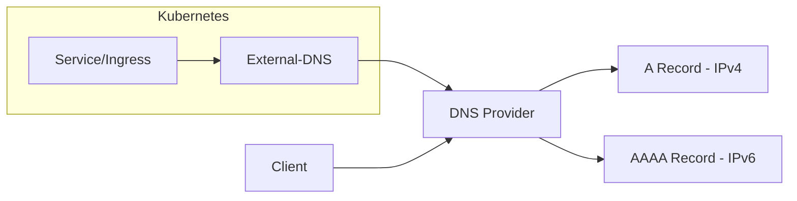

# How to Set Up External-DNS for IPv6 in Kubernetes

Author: [nawazdhandala](https://www.github.com/nawazdhandala)

Tags: IPv6, Kubernetes, External-DNS, DNS, Networking, DevOps

Description: A complete guide to configuring External-DNS for IPv6 support in Kubernetes clusters, including provider-specific setups, dual-stack configurations, and production best practices.

---

IPv6 adoption is accelerating. With IPv4 exhaustion becoming a real constraint and cloud providers charging for public IPv4 addresses, IPv6 is no longer optional. External-DNS automates DNS record management in Kubernetes, but getting it to work with IPv6 requires specific configuration. This guide covers everything you need to know.

## What is External-DNS?

External-DNS watches Kubernetes resources (Services, Ingresses, Gateway API) and automatically creates DNS records in your DNS provider. When you deploy a LoadBalancer service, External-DNS creates the corresponding A (IPv4) or AAAA (IPv6) records.



### Why IPv6 Matters

- **IPv4 exhaustion**: AWS charges $0.005/hour per public IPv4 address
- **Better performance**: No NAT overhead in many scenarios
- **Future-proofing**: Many mobile carriers are IPv6-only
- **Regulatory requirements**: Some regions mandate IPv6 support

## Prerequisites

Before configuring External-DNS for IPv6, ensure your cluster supports IPv6.

### Check Cluster IPv6 Support

```bash
# Check if nodes have IPv6 addresses
kubectl get nodes -o wide

# Check node IPv6 addresses directly
kubectl get nodes -o jsonpath='{range .items[*]}{.metadata.name}{"\t"}{.status.addresses[*].address}{"\n"}{end}'

# Verify pod CIDR includes IPv6
kubectl cluster-info dump | grep -i cidr
```

### Verify Dual-Stack Configuration

```bash
# Check if services can be dual-stack
kubectl get svc kubernetes -o yaml | grep -A5 ipFamilies

# Expected output for dual-stack:
# ipFamilies:
# - IPv4
# - IPv6
# ipFamilyPolicy: PreferDualStack
```

### CNI Requirements

Your CNI must support IPv6. Common options:

| CNI | IPv6 Support | Dual-Stack | Notes |
|-----|--------------|------------|-------|
| Calico | Full | Yes | Most mature IPv6 support |
| Cilium | Full | Yes | eBPF-based, excellent performance |
| Flannel | Partial | Limited | Requires specific configuration |
| Weave | Full | Yes | Automatic IPv6 allocation |
| AWS VPC CNI | Full | Yes | Native AWS integration |
| Azure CNI | Full | Yes | Native Azure integration |

## Installing External-DNS

### Helm Installation

```bash
# Add the External-DNS helm repository
helm repo add external-dns https://kubernetes-sigs.github.io/external-dns/
helm repo update

# Create namespace
kubectl create namespace external-dns
```

### Basic Helm Values for IPv6

```yaml
# values.yaml
image:
  repository: registry.k8s.io/external-dns/external-dns
  tag: v0.14.0

provider: cloudflare  # or your provider

env:
  - name: CF_API_TOKEN
    valueFrom:
      secretKeyRef:
        name: cloudflare-api-token
        key: api-token

extraArgs:
  - --source=service
  - --source=ingress
  - --publish-internal-services
  # IPv6 specific arguments
  - --txt-owner-id=k8s-cluster-1
  - --txt-prefix=external-dns-

# Enable both A and AAAA record creation
policy: sync
registry: txt

serviceAccount:
  create: true
  name: external-dns

resources:
  requests:
    memory: 64Mi
    cpu: 50m
  limits:
    memory: 128Mi
    cpu: 100m
```

Install with Helm:

```bash
helm install external-dns external-dns/external-dns \
  -n external-dns \
  -f values.yaml
```

## Provider-Specific IPv6 Configuration

### Cloudflare

Cloudflare has excellent IPv6 support. It automatically proxies both IPv4 and IPv6 traffic.

```yaml
# cloudflare-external-dns.yaml
apiVersion: v1
kind: Secret
metadata:
  name: cloudflare-api-token
  namespace: external-dns
type: Opaque
stringData:
  api-token: "your-cloudflare-api-token"
---
apiVersion: apps/v1
kind: Deployment
metadata:
  name: external-dns
  namespace: external-dns
spec:
  replicas: 1
  selector:
    matchLabels:
      app: external-dns
  template:
    metadata:
      labels:
        app: external-dns
    spec:
      serviceAccountName: external-dns
      containers:
        - name: external-dns
          image: registry.k8s.io/external-dns/external-dns:v0.14.0
          args:
            - --source=service
            - --source=ingress
            - --provider=cloudflare
            - --cloudflare-proxied
            - --policy=sync
            - --registry=txt
            - --txt-owner-id=k8s-cluster-1
            - --txt-prefix=_externaldns.
            # Cloudflare zone filter
            - --domain-filter=example.com
            # Enable both A and AAAA records
            - --cloudflare-dns-records-per-page=5000
          env:
            - name: CF_API_TOKEN
              valueFrom:
                secretKeyRef:
                  name: cloudflare-api-token
                  key: api-token
          resources:
            requests:
              memory: 64Mi
              cpu: 50m
            limits:
              memory: 128Mi
              cpu: 100m
```

### AWS Route 53

Route 53 supports both A and AAAA records. For IPv6, you need alias records pointing to IPv6-enabled load balancers.

```yaml
# route53-external-dns.yaml
apiVersion: v1
kind: ServiceAccount
metadata:
  name: external-dns
  namespace: external-dns
  annotations:
    eks.amazonaws.com/role-arn: arn:aws:iam::ACCOUNT_ID:role/external-dns-role
---
apiVersion: apps/v1
kind: Deployment
metadata:
  name: external-dns
  namespace: external-dns
spec:
  replicas: 1
  selector:
    matchLabels:
      app: external-dns
  template:
    metadata:
      labels:
        app: external-dns
    spec:
      serviceAccountName: external-dns
      containers:
        - name: external-dns
          image: registry.k8s.io/external-dns/external-dns:v0.14.0
          args:
            - --source=service
            - --source=ingress
            - --provider=aws
            - --aws-zone-type=public
            - --registry=txt
            - --txt-owner-id=k8s-cluster-1
            - --txt-prefix=_externaldns.
            - --domain-filter=example.com
            # AWS-specific settings
            - --aws-batch-change-size=1000
            - --aws-batch-change-interval=10s
            # Prefer ALIAS records for AWS resources
            - --aws-prefer-cname=false
          resources:
            requests:
              memory: 64Mi
              cpu: 50m
            limits:
              memory: 128Mi
              cpu: 100m
```

#### IAM Policy for Route 53

```json
{
  "Version": "2012-10-17",
  "Statement": [
    {
      "Effect": "Allow",
      "Action": [
        "route53:ChangeResourceRecordSets"
      ],
      "Resource": [
        "arn:aws:route53:::hostedzone/*"
      ]
    },
    {
      "Effect": "Allow",
      "Action": [
        "route53:ListHostedZones",
        "route53:ListResourceRecordSets",
        "route53:ListTagsForResource"
      ],
      "Resource": ["*"]
    }
  ]
}
```

### Google Cloud DNS

Google Cloud DNS fully supports IPv6 with AAAA records.

```yaml
# google-cloud-dns-external-dns.yaml
apiVersion: v1
kind: Secret
metadata:
  name: gcp-credentials
  namespace: external-dns
type: Opaque
stringData:
  credentials.json: |
    {
      "type": "service_account",
      "project_id": "your-project-id",
      ...
    }
---
apiVersion: apps/v1
kind: Deployment
metadata:
  name: external-dns
  namespace: external-dns
spec:
  replicas: 1
  selector:
    matchLabels:
      app: external-dns
  template:
    metadata:
      labels:
        app: external-dns
    spec:
      serviceAccountName: external-dns
      containers:
        - name: external-dns
          image: registry.k8s.io/external-dns/external-dns:v0.14.0
          args:
            - --source=service
            - --source=ingress
            - --provider=google
            - --google-project=your-project-id
            - --google-zone-visibility=public
            - --registry=txt
            - --txt-owner-id=k8s-cluster-1
            - --txt-prefix=_externaldns.
            - --domain-filter=example.com
            - --policy=sync
          env:
            - name: GOOGLE_APPLICATION_CREDENTIALS
              value: /etc/gcp/credentials.json
          volumeMounts:
            - name: gcp-credentials
              mountPath: /etc/gcp
              readOnly: true
          resources:
            requests:
              memory: 64Mi
              cpu: 50m
            limits:
              memory: 128Mi
              cpu: 100m
      volumes:
        - name: gcp-credentials
          secret:
            secretName: gcp-credentials
```

### Azure DNS

Azure DNS supports both A and AAAA record types.

```yaml
# azure-dns-external-dns.yaml
apiVersion: v1
kind: Secret
metadata:
  name: azure-config
  namespace: external-dns
type: Opaque
stringData:
  azure.json: |
    {
      "tenantId": "your-tenant-id",
      "subscriptionId": "your-subscription-id",
      "resourceGroup": "your-dns-resource-group",
      "aadClientId": "your-client-id",
      "aadClientSecret": "your-client-secret"
    }
---
apiVersion: apps/v1
kind: Deployment
metadata:
  name: external-dns
  namespace: external-dns
spec:
  replicas: 1
  selector:
    matchLabels:
      app: external-dns
  template:
    metadata:
      labels:
        app: external-dns
    spec:
      serviceAccountName: external-dns
      containers:
        - name: external-dns
          image: registry.k8s.io/external-dns/external-dns:v0.14.0
          args:
            - --source=service
            - --source=ingress
            - --provider=azure
            - --azure-resource-group=your-dns-resource-group
            - --azure-subscription-id=your-subscription-id
            - --registry=txt
            - --txt-owner-id=k8s-cluster-1
            - --txt-prefix=_externaldns.
            - --domain-filter=example.com
            - --policy=sync
          volumeMounts:
            - name: azure-config
              mountPath: /etc/kubernetes
              readOnly: true
          resources:
            requests:
              memory: 64Mi
              cpu: 50m
            limits:
              memory: 128Mi
              cpu: 100m
      volumes:
        - name: azure-config
          secret:
            secretName: azure-config
```

### CoreDNS (Self-Hosted)

For self-hosted DNS with CoreDNS:

```yaml
# coredns-external-dns.yaml
apiVersion: apps/v1
kind: Deployment
metadata:
  name: external-dns
  namespace: external-dns
spec:
  replicas: 1
  selector:
    matchLabels:
      app: external-dns
  template:
    metadata:
      labels:
        app: external-dns
    spec:
      serviceAccountName: external-dns
      containers:
        - name: external-dns
          image: registry.k8s.io/external-dns/external-dns:v0.14.0
          args:
            - --source=service
            - --source=ingress
            - --provider=coredns
            - --registry=txt
            - --txt-owner-id=k8s-cluster-1
            - --txt-prefix=_externaldns.
            - --domain-filter=example.com
            - --policy=sync
            # CoreDNS etcd settings
            - --coredns-prefix=/skydns/
          env:
            - name: ETCD_URLS
              value: "http://etcd-client.etcd:2379"
          resources:
            requests:
              memory: 64Mi
              cpu: 50m
            limits:
              memory: 128Mi
              cpu: 100m
```

## Dual-Stack Service Configuration

### Creating Dual-Stack Services

To get both A and AAAA records, create dual-stack services:

```yaml
# dual-stack-service.yaml
apiVersion: v1
kind: Service
metadata:
  name: my-web-app
  namespace: default
  annotations:
    external-dns.alpha.kubernetes.io/hostname: myapp.example.com
    external-dns.alpha.kubernetes.io/ttl: "300"
spec:
  type: LoadBalancer
  # Enable dual-stack
  ipFamilyPolicy: PreferDualStack
  ipFamilies:
    - IPv4
    - IPv6
  selector:
    app: my-web-app
  ports:
    - name: http
      port: 80
      targetPort: 8080
    - name: https
      port: 443
      targetPort: 8443
```

### IPv6-Only Service

For IPv6-only services:

```yaml
# ipv6-only-service.yaml
apiVersion: v1
kind: Service
metadata:
  name: my-ipv6-app
  namespace: default
  annotations:
    external-dns.alpha.kubernetes.io/hostname: ipv6.example.com
    external-dns.alpha.kubernetes.io/ttl: "300"
spec:
  type: LoadBalancer
  ipFamilyPolicy: SingleStack
  ipFamilies:
    - IPv6
  selector:
    app: my-ipv6-app
  ports:
    - port: 80
      targetPort: 8080
```

### IPv4-Preferred Service

For environments where IPv4 should be primary:

```yaml
# ipv4-preferred-service.yaml
apiVersion: v1
kind: Service
metadata:
  name: my-ipv4-first-app
  namespace: default
  annotations:
    external-dns.alpha.kubernetes.io/hostname: www.example.com
    external-dns.alpha.kubernetes.io/ttl: "60"
spec:
  type: LoadBalancer
  ipFamilyPolicy: PreferDualStack
  ipFamilies:
    - IPv4
    - IPv6
  selector:
    app: my-app
  ports:
    - port: 443
      targetPort: 8443
```

## Ingress Configuration for IPv6

### NGINX Ingress with IPv6

```yaml
# nginx-ingress-values.yaml
controller:
  service:
    ipFamilyPolicy: PreferDualStack
    ipFamilies:
      - IPv4
      - IPv6
    annotations:
      external-dns.alpha.kubernetes.io/hostname: "*.example.com"

  config:
    use-forwarded-headers: "true"
    compute-full-forwarded-for: "true"
    # Enable IPv6
    use-proxy-protocol: "false"
```

### Ingress Resource with External-DNS

```yaml
# ingress-with-external-dns.yaml
apiVersion: networking.k8s.io/v1
kind: Ingress
metadata:
  name: my-ingress
  namespace: default
  annotations:
    kubernetes.io/ingress.class: nginx
    external-dns.alpha.kubernetes.io/hostname: app.example.com,www.example.com
    external-dns.alpha.kubernetes.io/ttl: "300"
    # Target for AAAA record (if using specific target)
    external-dns.alpha.kubernetes.io/target: "2001:db8::1"
spec:
  rules:
    - host: app.example.com
      http:
        paths:
          - path: /
            pathType: Prefix
            backend:
              service:
                name: my-app
                port:
                  number: 80
    - host: www.example.com
      http:
        paths:
          - path: /
            pathType: Prefix
            backend:
              service:
                name: my-app
                port:
                  number: 80
  tls:
    - hosts:
        - app.example.com
        - www.example.com
      secretName: my-app-tls
```

## Gateway API Configuration

External-DNS supports the new Gateway API for IPv6 configurations.

### HTTPRoute with External-DNS

```yaml
# gateway-api-httproute.yaml
apiVersion: gateway.networking.k8s.io/v1
kind: Gateway
metadata:
  name: main-gateway
  namespace: default
  annotations:
    external-dns.alpha.kubernetes.io/hostname: gateway.example.com
spec:
  gatewayClassName: istio
  listeners:
    - name: http
      port: 80
      protocol: HTTP
      allowedRoutes:
        namespaces:
          from: Same
    - name: https
      port: 443
      protocol: HTTPS
      tls:
        mode: Terminate
        certificateRefs:
          - name: gateway-tls
      allowedRoutes:
        namespaces:
          from: Same
  addresses:
    - type: IPAddress
      value: "203.0.113.10"
    - type: IPAddress
      value: "2001:db8::10"
---
apiVersion: gateway.networking.k8s.io/v1
kind: HTTPRoute
metadata:
  name: my-app-route
  namespace: default
spec:
  parentRefs:
    - name: main-gateway
  hostnames:
    - "app.example.com"
  rules:
    - matches:
        - path:
            type: PathPrefix
            value: /
      backendRefs:
        - name: my-app
          port: 80
```

## Advanced Configuration Options

### Multiple Hostnames

```yaml
# service-multiple-hostnames.yaml
apiVersion: v1
kind: Service
metadata:
  name: multi-hostname-app
  namespace: default
  annotations:
    external-dns.alpha.kubernetes.io/hostname: "api.example.com,api.example.org,api.example.net"
    external-dns.alpha.kubernetes.io/ttl: "120"
spec:
  type: LoadBalancer
  ipFamilyPolicy: PreferDualStack
  ipFamilies:
    - IPv6
    - IPv4
  selector:
    app: api-server
  ports:
    - port: 443
      targetPort: 8443
```

### Custom Targets

Override the automatically detected IP:

```yaml
# custom-target-service.yaml
apiVersion: v1
kind: Service
metadata:
  name: cdn-backed-app
  namespace: default
  annotations:
    external-dns.alpha.kubernetes.io/hostname: cdn.example.com
    # IPv4 target
    external-dns.alpha.kubernetes.io/target: "198.51.100.10"
    # For IPv6, you can also specify
    # external-dns.alpha.kubernetes.io/target: "2001:db8::1"
spec:
  type: ClusterIP
  selector:
    app: cdn-origin
  ports:
    - port: 80
```

### Alias Records (AWS)

```yaml
# alias-record-service.yaml
apiVersion: v1
kind: Service
metadata:
  name: alb-app
  namespace: default
  annotations:
    external-dns.alpha.kubernetes.io/hostname: app.example.com
    external-dns.alpha.kubernetes.io/alias: "true"
    service.beta.kubernetes.io/aws-load-balancer-type: "nlb"
    service.beta.kubernetes.io/aws-load-balancer-ip-address-type: "dualstack"
spec:
  type: LoadBalancer
  ipFamilyPolicy: PreferDualStack
  ipFamilies:
    - IPv4
    - IPv6
  selector:
    app: alb-app
  ports:
    - port: 443
      targetPort: 8443
```

## Load Balancer IPv6 Configuration

### AWS Network Load Balancer (Dual-Stack)

```yaml
# aws-nlb-dualstack.yaml
apiVersion: v1
kind: Service
metadata:
  name: aws-nlb-ipv6
  namespace: default
  annotations:
    external-dns.alpha.kubernetes.io/hostname: nlb.example.com
    service.beta.kubernetes.io/aws-load-balancer-type: "nlb"
    service.beta.kubernetes.io/aws-load-balancer-scheme: "internet-facing"
    service.beta.kubernetes.io/aws-load-balancer-ip-address-type: "dualstack"
    service.beta.kubernetes.io/aws-load-balancer-cross-zone-load-balancing-enabled: "true"
spec:
  type: LoadBalancer
  ipFamilyPolicy: PreferDualStack
  ipFamilies:
    - IPv4
    - IPv6
  selector:
    app: my-app
  ports:
    - port: 443
      targetPort: 8443
```

### Google Cloud Load Balancer

```yaml
# gcp-lb-ipv6.yaml
apiVersion: v1
kind: Service
metadata:
  name: gcp-lb-ipv6
  namespace: default
  annotations:
    external-dns.alpha.kubernetes.io/hostname: gcp.example.com
    cloud.google.com/l4-rbs: "enabled"
    networking.gke.io/load-balancer-type: "External"
spec:
  type: LoadBalancer
  ipFamilyPolicy: PreferDualStack
  ipFamilies:
    - IPv4
    - IPv6
  selector:
    app: my-app
  ports:
    - port: 80
      targetPort: 8080
```

### MetalLB for Bare Metal IPv6

```yaml
# metallb-ipv6-pool.yaml
apiVersion: metallb.io/v1beta1
kind: IPAddressPool
metadata:
  name: ipv6-pool
  namespace: metallb-system
spec:
  addresses:
    - 2001:db8:1::1-2001:db8:1::ff
---
apiVersion: metallb.io/v1beta1
kind: IPAddressPool
metadata:
  name: ipv4-pool
  namespace: metallb-system
spec:
  addresses:
    - 192.168.1.100-192.168.1.200
---
apiVersion: metallb.io/v1beta1
kind: L2Advertisement
metadata:
  name: l2-advertisement
  namespace: metallb-system
spec:
  ipAddressPools:
    - ipv4-pool
    - ipv6-pool
```

## Troubleshooting IPv6 with External-DNS

### Check External-DNS Logs

```bash
# View External-DNS logs
kubectl logs -n external-dns -l app=external-dns -f

# Check for IPv6-related issues
kubectl logs -n external-dns -l app=external-dns | grep -i "AAAA\|ipv6\|error"
```

### Verify DNS Records

```bash
# Check A record (IPv4)
dig A myapp.example.com +short

# Check AAAA record (IPv6)
dig AAAA myapp.example.com +short

# Check both with full details
dig myapp.example.com ANY

# Use specific DNS server
dig @8.8.8.8 AAAA myapp.example.com
dig @2001:4860:4860::8888 AAAA myapp.example.com
```

### Verify Service IP Families

```bash
# Check service IP configuration
kubectl get svc my-service -o yaml | grep -A5 "ipFamilies\|clusterIP"

# Verify LoadBalancer IPs
kubectl get svc my-service -o jsonpath='{.status.loadBalancer.ingress[*]}'
```

### Common Issues and Solutions

**Issue: AAAA records not being created**

```bash
# Check if service has IPv6 address
kubectl get svc my-service -o jsonpath='{.spec.ipFamilies}'
# Should show: ["IPv4","IPv6"] or ["IPv6"]

# Check External-DNS source filtering
kubectl logs -n external-dns deploy/external-dns | grep "my-service"
```

Solution: Ensure `ipFamilyPolicy: PreferDualStack` or `SingleStack` with IPv6 is set.

**Issue: Load balancer not getting IPv6 address**

```bash
# Check cloud provider support
# AWS: Verify VPC has IPv6 CIDR
aws ec2 describe-vpcs --vpc-ids vpc-xxx | grep -i ipv6

# Check subnet IPv6 configuration
aws ec2 describe-subnets --subnet-ids subnet-xxx | grep -i ipv6
```

Solution: Enable IPv6 on your VPC and subnets.

**Issue: External-DNS not detecting changes**

```bash
# Check External-DNS sync interval
kubectl get deploy external-dns -n external-dns -o yaml | grep interval

# Force resync by restarting
kubectl rollout restart deployment/external-dns -n external-dns
```

### Debug Deployment

```yaml
# debug-external-dns.yaml
apiVersion: apps/v1
kind: Deployment
metadata:
  name: external-dns-debug
  namespace: external-dns
spec:
  replicas: 1
  selector:
    matchLabels:
      app: external-dns-debug
  template:
    metadata:
      labels:
        app: external-dns-debug
    spec:
      containers:
        - name: external-dns
          image: registry.k8s.io/external-dns/external-dns:v0.14.0
          args:
            - --source=service
            - --source=ingress
            - --provider=cloudflare
            - --policy=sync
            - --registry=txt
            - --txt-owner-id=debug
            - --domain-filter=example.com
            # Debug options
            - --log-level=debug
            - --log-format=text
            - --dry-run  # Don't make actual changes
          env:
            - name: CF_API_TOKEN
              valueFrom:
                secretKeyRef:
                  name: cloudflare-api-token
                  key: api-token
```

## Security Best Practices

### RBAC Configuration

```yaml
# external-dns-rbac.yaml
apiVersion: v1
kind: ServiceAccount
metadata:
  name: external-dns
  namespace: external-dns
---
apiVersion: rbac.authorization.k8s.io/v1
kind: ClusterRole
metadata:
  name: external-dns
rules:
  - apiGroups: [""]
    resources: ["services", "endpoints", "pods"]
    verbs: ["get", "watch", "list"]
  - apiGroups: ["extensions", "networking.k8s.io"]
    resources: ["ingresses"]
    verbs: ["get", "watch", "list"]
  - apiGroups: [""]
    resources: ["nodes"]
    verbs: ["get", "watch", "list"]
  # Gateway API support
  - apiGroups: ["gateway.networking.k8s.io"]
    resources: ["gateways", "httproutes", "tlsroutes", "tcproutes", "udproutes"]
    verbs: ["get", "watch", "list"]
---
apiVersion: rbac.authorization.k8s.io/v1
kind: ClusterRoleBinding
metadata:
  name: external-dns-viewer
roleRef:
  apiGroup: rbac.authorization.k8s.io
  kind: ClusterRole
  name: external-dns
subjects:
  - kind: ServiceAccount
    name: external-dns
    namespace: external-dns
```

### Network Policy for External-DNS

```yaml
# external-dns-network-policy.yaml
apiVersion: networking.k8s.io/v1
kind: NetworkPolicy
metadata:
  name: external-dns-egress
  namespace: external-dns
spec:
  podSelector:
    matchLabels:
      app: external-dns
  policyTypes:
    - Egress
  egress:
    # Allow DNS resolution
    - to: []
      ports:
        - protocol: UDP
          port: 53
        - protocol: TCP
          port: 53
    # Allow HTTPS to DNS providers
    - to: []
      ports:
        - protocol: TCP
          port: 443
    # Allow Kubernetes API access
    - to:
        - ipBlock:
            cidr: 0.0.0.0/0
      ports:
        - protocol: TCP
          port: 443
    # Allow IPv6 egress
    - to:
        - ipBlock:
            cidr: ::/0
      ports:
        - protocol: TCP
          port: 443
```

### Secret Management

```yaml
# external-secrets-integration.yaml
apiVersion: external-secrets.io/v1beta1
kind: ExternalSecret
metadata:
  name: cloudflare-api-token
  namespace: external-dns
spec:
  refreshInterval: 1h
  secretStoreRef:
    kind: ClusterSecretStore
    name: vault-backend
  target:
    name: cloudflare-api-token
    creationPolicy: Owner
  data:
    - secretKey: api-token
      remoteRef:
        key: external-dns/cloudflare
        property: api-token
```

## Monitoring External-DNS

### Prometheus Metrics

External-DNS exposes Prometheus metrics on port 7979.

```yaml
# external-dns-with-metrics.yaml
apiVersion: apps/v1
kind: Deployment
metadata:
  name: external-dns
  namespace: external-dns
spec:
  replicas: 1
  selector:
    matchLabels:
      app: external-dns
  template:
    metadata:
      labels:
        app: external-dns
      annotations:
        prometheus.io/scrape: "true"
        prometheus.io/port: "7979"
        prometheus.io/path: "/metrics"
    spec:
      containers:
        - name: external-dns
          image: registry.k8s.io/external-dns/external-dns:v0.14.0
          args:
            - --source=service
            - --source=ingress
            - --provider=cloudflare
            - --policy=sync
            - --metrics-address=:7979
          ports:
            - name: metrics
              containerPort: 7979
---
apiVersion: v1
kind: Service
metadata:
  name: external-dns-metrics
  namespace: external-dns
  labels:
    app: external-dns
spec:
  ports:
    - name: metrics
      port: 7979
      targetPort: metrics
  selector:
    app: external-dns
```

### ServiceMonitor for Prometheus Operator

```yaml
# external-dns-servicemonitor.yaml
apiVersion: monitoring.coreos.com/v1
kind: ServiceMonitor
metadata:
  name: external-dns
  namespace: external-dns
  labels:
    app: external-dns
spec:
  selector:
    matchLabels:
      app: external-dns
  endpoints:
    - port: metrics
      interval: 30s
      path: /metrics
```

### Key Metrics to Watch

| Metric | Description |
|--------|-------------|
| `external_dns_source_endpoints_total` | Number of endpoints discovered |
| `external_dns_registry_endpoints_total` | Number of endpoints in registry |
| `external_dns_controller_last_sync_timestamp_seconds` | Last successful sync time |
| `external_dns_source_errors_total` | Errors reading from sources |
| `external_dns_registry_errors_total` | Errors interacting with registry |

## Best Practices Summary

### Configuration Checklist

- [ ] Enable dual-stack on your Kubernetes cluster
- [ ] Configure CNI for IPv6 support
- [ ] Use `ipFamilyPolicy: PreferDualStack` on services
- [ ] Configure load balancer for dual-stack (cloud-specific)
- [ ] Set appropriate TTL values (lower for dynamic, higher for stable)
- [ ] Use TXT registry to track ownership
- [ ] Enable metrics for monitoring
- [ ] Configure RBAC with least privilege
- [ ] Use external secrets management
- [ ] Test IPv6 connectivity before production rollout

### TTL Recommendations

| Use Case | Recommended TTL | Notes |
|----------|-----------------|-------|
| Static services | 3600 (1 hour) | Reduces DNS queries |
| Dynamic services | 60-300 | Faster failover |
| Development | 30-60 | Quick iteration |
| CDN endpoints | 86400 (24 hours) | Rarely change |

### Provider Feature Matrix

| Feature | Cloudflare | Route 53 | Cloud DNS | Azure DNS | CoreDNS |
|---------|------------|----------|-----------|-----------|---------|
| A Records | Yes | Yes | Yes | Yes | Yes |
| AAAA Records | Yes | Yes | Yes | Yes | Yes |
| Alias/CNAME | Yes | Alias | CNAME | Alias | CNAME |
| Proxy/CDN | Yes | No | No | No | No |
| TXT Registry | Yes | Yes | Yes | Yes | Yes |
| Wildcard | Yes | Yes | Yes | Yes | Yes |
| Split Horizon | Yes | Yes | Yes | Yes | Yes |

---

External-DNS makes IPv6 DNS management in Kubernetes straightforward. The key is ensuring your entire stack supports IPv6: cluster networking, CNI, load balancers, and DNS provider. Start with dual-stack configuration to maintain IPv4 compatibility while you transition to IPv6. With proper configuration, External-DNS handles both A and AAAA records automatically, letting you focus on your applications instead of DNS plumbing.
