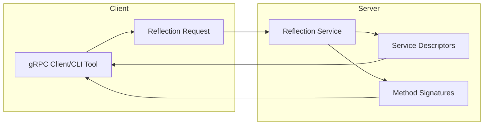

# How to Implement gRPC Reflection for Dynamic Service Discovery

Author: [nawazdhandala](https://github.com/nawazdhandala)

Tags: gRPC, Service Discovery, Microservices, DevOps, Kubernetes, API

Description: Learn how to implement gRPC reflection to enable dynamic service discovery, allowing clients to query available services and methods at runtime without pre-compiled protobuf definitions.

---

gRPC reflection is a powerful feature that allows clients to discover services, methods, and message types at runtime without requiring pre-compiled protobuf definitions. This capability is essential for building dynamic tooling, debugging services, and creating generic gRPC clients that can interact with any service.

## Understanding gRPC Reflection

gRPC reflection exposes service metadata through a standard reflection API. When enabled, clients can query a server to discover what services it provides, what methods each service exposes, and the structure of request and response messages.



### Why Use gRPC Reflection

| Use Case | Benefit |
|----------|---------|
| **Dynamic Debugging** | Query services without .proto files |
| **Generic Clients** | Build tools that work with any gRPC service |
| **Service Discovery** | Automatically discover available endpoints |
| **API Documentation** | Generate documentation from live services |
| **Testing Tools** | Create flexible testing frameworks |

## Prerequisites

Before implementing gRPC reflection, ensure you have the following installed.

For Go:

```bash
# Install the gRPC Go packages
go get google.golang.org/grpc
go get google.golang.org/grpc/reflection
go get google.golang.org/protobuf/cmd/protoc-gen-go@latest
go get google.golang.org/grpc/cmd/protoc-gen-go-grpc@latest
```

For Node.js:

```bash
# Install the gRPC Node.js packages
npm install @grpc/grpc-js @grpc/proto-loader @grpc/reflection
```

For Python:

```bash
# Install the gRPC Python packages
pip install grpcio grpcio-reflection grpcio-tools
```

## Defining a Sample Service

First, let's create a sample protobuf definition that we'll use throughout this tutorial.

Create a file named `service.proto`:

```protobuf
// service.proto
// This file defines our sample service for demonstrating gRPC reflection

syntax = "proto3";

package example.v1;

// Import empty message type for health checks
import "google/protobuf/empty.proto";

option go_package = "github.com/example/grpc-reflection/proto";

// UserService provides user management operations
// This service will be discoverable via gRPC reflection
service UserService {
  // GetUser retrieves a user by their unique identifier
  rpc GetUser(GetUserRequest) returns (User);

  // ListUsers returns all users with optional filtering
  rpc ListUsers(ListUsersRequest) returns (ListUsersResponse);

  // CreateUser creates a new user in the system
  rpc CreateUser(CreateUserRequest) returns (User);

  // UpdateUser modifies an existing user's information
  rpc UpdateUser(UpdateUserRequest) returns (User);

  // DeleteUser removes a user from the system
  rpc DeleteUser(DeleteUserRequest) returns (google.protobuf.Empty);

  // StreamUsers provides a server-streaming endpoint for large datasets
  rpc StreamUsers(ListUsersRequest) returns (stream User);
}

// HealthService provides service health checking capabilities
service HealthService {
  // Check performs a health check on the service
  rpc Check(HealthCheckRequest) returns (HealthCheckResponse);

  // Watch streams health status updates
  rpc Watch(HealthCheckRequest) returns (stream HealthCheckResponse);
}

// GetUserRequest contains the user ID to retrieve
message GetUserRequest {
  // The unique identifier of the user to retrieve
  string user_id = 1;
}

// ListUsersRequest contains optional filtering parameters
message ListUsersRequest {
  // Maximum number of users to return
  int32 page_size = 1;

  // Token for pagination
  string page_token = 2;

  // Optional filter by status
  UserStatus status_filter = 3;
}

// ListUsersResponse contains the paginated list of users
message ListUsersResponse {
  // The list of users matching the request criteria
  repeated User users = 1;

  // Token for retrieving the next page
  string next_page_token = 2;

  // Total count of users matching the filter
  int32 total_count = 3;
}

// CreateUserRequest contains the data for creating a new user
message CreateUserRequest {
  // The user's email address (required, must be unique)
  string email = 1;

  // The user's display name
  string name = 2;

  // Optional metadata key-value pairs
  map<string, string> metadata = 3;
}

// UpdateUserRequest contains the user ID and fields to update
message UpdateUserRequest {
  // The unique identifier of the user to update
  string user_id = 1;

  // The updated display name (optional)
  string name = 2;

  // Updated status
  UserStatus status = 3;

  // Updated metadata (replaces existing metadata)
  map<string, string> metadata = 4;
}

// DeleteUserRequest contains the user ID to delete
message DeleteUserRequest {
  // The unique identifier of the user to delete
  string user_id = 1;
}

// User represents a user in the system
message User {
  // Unique identifier for the user
  string id = 1;

  // User's email address
  string email = 2;

  // User's display name
  string name = 3;

  // Current status of the user
  UserStatus status = 4;

  // Timestamp when the user was created (Unix epoch seconds)
  int64 created_at = 5;

  // Timestamp when the user was last updated (Unix epoch seconds)
  int64 updated_at = 6;

  // Custom metadata associated with the user
  map<string, string> metadata = 7;
}

// UserStatus defines the possible states of a user account
enum UserStatus {
  // Default unspecified status
  USER_STATUS_UNSPECIFIED = 0;

  // User account is active and can access the system
  USER_STATUS_ACTIVE = 1;

  // User account is inactive and cannot access the system
  USER_STATUS_INACTIVE = 2;

  // User account is pending verification
  USER_STATUS_PENDING = 3;

  // User account has been suspended
  USER_STATUS_SUSPENDED = 4;
}

// HealthCheckRequest contains the service name to check
message HealthCheckRequest {
  // The name of the service to check (empty for overall health)
  string service = 1;
}

// HealthCheckResponse contains the health status
message HealthCheckResponse {
  // The health status of the service
  ServingStatus status = 1;
}

// ServingStatus indicates whether a service is healthy
enum ServingStatus {
  // Unknown status
  SERVING_STATUS_UNKNOWN = 0;

  // Service is healthy and serving requests
  SERVING_STATUS_SERVING = 1;

  // Service is not serving requests
  SERVING_STATUS_NOT_SERVING = 2;

  // Used for Watch method to indicate service not found
  SERVING_STATUS_SERVICE_UNKNOWN = 3;
}
```

## Implementing gRPC Reflection in Go

Go provides excellent support for gRPC reflection through the official `google.golang.org/grpc/reflection` package.

### Basic Server Setup with Reflection

Create a file named `main.go`:

```go
// main.go
// This file demonstrates how to set up a gRPC server with reflection enabled

package main

import (
    "context"
    "fmt"
    "log"
    "net"
    "os"
    "os/signal"
    "syscall"
    "time"

    "google.golang.org/grpc"
    "google.golang.org/grpc/codes"
    "google.golang.org/grpc/reflection"
    "google.golang.org/grpc/status"
    "google.golang.org/protobuf/types/known/emptypb"

    pb "github.com/example/grpc-reflection/proto"
)

// userServer implements the UserService interface
// This struct holds any dependencies needed by the service
type userServer struct {
    // Embed the unimplemented server for forward compatibility
    // This ensures we implement all required methods
    pb.UnimplementedUserServiceServer

    // In-memory store for demonstration purposes
    // In production, this would be a database connection
    users map[string]*pb.User
}

// NewUserServer creates a new instance of the user service
// Initialize any dependencies here
func NewUserServer() *userServer {
    return &userServer{
        users: make(map[string]*pb.User),
    }
}

// GetUser retrieves a user by ID
// This method will be discoverable via gRPC reflection
func (s *userServer) GetUser(ctx context.Context, req *pb.GetUserRequest) (*pb.User, error) {
    // Validate the request
    if req.UserId == "" {
        return nil, status.Error(codes.InvalidArgument, "user_id is required")
    }

    // Look up the user in our store
    user, exists := s.users[req.UserId]
    if !exists {
        return nil, status.Errorf(codes.NotFound, "user with id %s not found", req.UserId)
    }

    return user, nil
}

// ListUsers returns a paginated list of users
// Supports filtering and pagination
func (s *userServer) ListUsers(ctx context.Context, req *pb.ListUsersRequest) (*pb.ListUsersResponse, error) {
    // Set default page size if not specified
    pageSize := req.PageSize
    if pageSize <= 0 {
        pageSize = 10
    }

    // Collect users matching the filter
    var matchingUsers []*pb.User
    for _, user := range s.users {
        // Apply status filter if specified
        if req.StatusFilter != pb.UserStatus_USER_STATUS_UNSPECIFIED {
            if user.Status != req.StatusFilter {
                continue
            }
        }
        matchingUsers = append(matchingUsers, user)
    }

    // Return the response with pagination info
    return &pb.ListUsersResponse{
        Users:      matchingUsers,
        TotalCount: int32(len(matchingUsers)),
    }, nil
}

// CreateUser creates a new user in the system
// Generates a unique ID and sets timestamps
func (s *userServer) CreateUser(ctx context.Context, req *pb.CreateUserRequest) (*pb.User, error) {
    // Validate required fields
    if req.Email == "" {
        return nil, status.Error(codes.InvalidArgument, "email is required")
    }

    // Generate a unique ID for the new user
    userID := fmt.Sprintf("user_%d", time.Now().UnixNano())

    // Create the user object with timestamps
    now := time.Now().Unix()
    user := &pb.User{
        Id:        userID,
        Email:     req.Email,
        Name:      req.Name,
        Status:    pb.UserStatus_USER_STATUS_ACTIVE,
        CreatedAt: now,
        UpdatedAt: now,
        Metadata:  req.Metadata,
    }

    // Store the user
    s.users[userID] = user

    return user, nil
}

// UpdateUser modifies an existing user's information
// Only updates fields that are provided
func (s *userServer) UpdateUser(ctx context.Context, req *pb.UpdateUserRequest) (*pb.User, error) {
    // Validate the request
    if req.UserId == "" {
        return nil, status.Error(codes.InvalidArgument, "user_id is required")
    }

    // Find the existing user
    user, exists := s.users[req.UserId]
    if !exists {
        return nil, status.Errorf(codes.NotFound, "user with id %s not found", req.UserId)
    }

    // Update fields if provided
    if req.Name != "" {
        user.Name = req.Name
    }
    if req.Status != pb.UserStatus_USER_STATUS_UNSPECIFIED {
        user.Status = req.Status
    }
    if req.Metadata != nil {
        user.Metadata = req.Metadata
    }
    user.UpdatedAt = time.Now().Unix()

    return user, nil
}

// DeleteUser removes a user from the system
// Returns empty response on success
func (s *userServer) DeleteUser(ctx context.Context, req *pb.DeleteUserRequest) (*emptypb.Empty, error) {
    // Validate the request
    if req.UserId == "" {
        return nil, status.Error(codes.InvalidArgument, "user_id is required")
    }

    // Check if user exists
    if _, exists := s.users[req.UserId]; !exists {
        return nil, status.Errorf(codes.NotFound, "user with id %s not found", req.UserId)
    }

    // Delete the user
    delete(s.users, req.UserId)

    return &emptypb.Empty{}, nil
}

// StreamUsers streams all users matching the filter
// Useful for large datasets that shouldn't be loaded all at once
func (s *userServer) StreamUsers(req *pb.ListUsersRequest, stream pb.UserService_StreamUsersServer) error {
    // Iterate through users and stream each one
    for _, user := range s.users {
        // Apply status filter if specified
        if req.StatusFilter != pb.UserStatus_USER_STATUS_UNSPECIFIED {
            if user.Status != req.StatusFilter {
                continue
            }
        }

        // Send the user to the client
        if err := stream.Send(user); err != nil {
            return status.Errorf(codes.Internal, "failed to send user: %v", err)
        }
    }

    return nil
}

// healthServer implements the HealthService interface
type healthServer struct {
    pb.UnimplementedHealthServiceServer
}

// Check returns the current health status
func (s *healthServer) Check(ctx context.Context, req *pb.HealthCheckRequest) (*pb.HealthCheckResponse, error) {
    // In a real implementation, you would check actual dependencies here
    // For example: database connections, external service availability, etc.
    return &pb.HealthCheckResponse{
        Status: pb.ServingStatus_SERVING_STATUS_SERVING,
    }, nil
}

// Watch streams health status updates
func (s *healthServer) Watch(req *pb.HealthCheckRequest, stream pb.HealthService_WatchServer) error {
    // Send periodic health updates
    // In production, you would implement actual health monitoring
    ticker := time.NewTicker(5 * time.Second)
    defer ticker.Stop()

    for {
        select {
        case <-stream.Context().Done():
            return nil
        case <-ticker.C:
            if err := stream.Send(&pb.HealthCheckResponse{
                Status: pb.ServingStatus_SERVING_STATUS_SERVING,
            }); err != nil {
                return err
            }
        }
    }
}

func main() {
    // Define the port to listen on
    port := os.Getenv("GRPC_PORT")
    if port == "" {
        port = "50051"
    }

    // Create a TCP listener
    listener, err := net.Listen("tcp", fmt.Sprintf(":%s", port))
    if err != nil {
        log.Fatalf("Failed to listen on port %s: %v", port, err)
    }

    // Create a new gRPC server with options
    // You can add interceptors, TLS config, etc. here
    server := grpc.NewServer(
        // Add any server options here
        // grpc.UnaryInterceptor(loggingInterceptor),
        // grpc.StreamInterceptor(streamLoggingInterceptor),
    )

    // Register our services with the gRPC server
    pb.RegisterUserServiceServer(server, NewUserServer())
    pb.RegisterHealthServiceServer(server, &healthServer{})

    // CRITICAL: Enable gRPC reflection
    // This single line enables dynamic service discovery
    // Clients can now query this server to discover available services
    reflection.Register(server)

    // Log that we're starting with reflection enabled
    log.Printf("Starting gRPC server on port %s with reflection enabled", port)

    // Handle graceful shutdown
    // This ensures in-flight requests complete before the server stops
    go func() {
        sigChan := make(chan os.Signal, 1)
        signal.Notify(sigChan, syscall.SIGINT, syscall.SIGTERM)
        <-sigChan

        log.Println("Received shutdown signal, gracefully stopping server...")
        server.GracefulStop()
    }()

    // Start serving requests
    if err := server.Serve(listener); err != nil {
        log.Fatalf("Failed to serve: %v", err)
    }
}
```

### Building a Reflection Client in Go

Create a file named `client/main.go` to demonstrate how to use reflection from a client:

```go
// client/main.go
// This file demonstrates how to use gRPC reflection to discover and call services

package main

import (
    "context"
    "fmt"
    "log"
    "time"

    "google.golang.org/grpc"
    "google.golang.org/grpc/credentials/insecure"
    "google.golang.org/grpc/reflection/grpc_reflection_v1alpha"
    "google.golang.org/protobuf/proto"
    "google.golang.org/protobuf/reflect/protodesc"
    "google.golang.org/protobuf/reflect/protoreflect"
    "google.golang.org/protobuf/types/descriptorpb"
)

// ReflectionClient provides methods to query gRPC reflection API
type ReflectionClient struct {
    conn   *grpc.ClientConn
    client grpc_reflection_v1alpha.ServerReflectionClient
}

// NewReflectionClient creates a new reflection client connected to the given address
func NewReflectionClient(address string) (*ReflectionClient, error) {
    // Establish connection to the gRPC server
    // In production, use proper credentials instead of insecure
    conn, err := grpc.Dial(
        address,
        grpc.WithTransportCredentials(insecure.NewCredentials()),
        grpc.WithBlock(),
        grpc.WithTimeout(10*time.Second),
    )
    if err != nil {
        return nil, fmt.Errorf("failed to connect: %w", err)
    }

    // Create the reflection client
    client := grpc_reflection_v1alpha.NewServerReflectionClient(conn)

    return &ReflectionClient{
        conn:   conn,
        client: client,
    }, nil
}

// Close closes the underlying connection
func (rc *ReflectionClient) Close() error {
    return rc.conn.Close()
}

// ListServices returns all services available on the server
// This is the primary method for service discovery
func (rc *ReflectionClient) ListServices(ctx context.Context) ([]string, error) {
    // Create a bidirectional stream for reflection requests
    stream, err := rc.client.ServerReflectionInfo(ctx)
    if err != nil {
        return nil, fmt.Errorf("failed to create reflection stream: %w", err)
    }

    // Send request to list all services
    if err := stream.Send(&grpc_reflection_v1alpha.ServerReflectionRequest{
        MessageRequest: &grpc_reflection_v1alpha.ServerReflectionRequest_ListServices{
            ListServices: "*",
        },
    }); err != nil {
        return nil, fmt.Errorf("failed to send list services request: %w", err)
    }

    // Receive the response
    resp, err := stream.Recv()
    if err != nil {
        return nil, fmt.Errorf("failed to receive response: %w", err)
    }

    // Extract service names from the response
    listResp := resp.GetListServicesResponse()
    if listResp == nil {
        return nil, fmt.Errorf("unexpected response type")
    }

    var services []string
    for _, svc := range listResp.GetService() {
        services = append(services, svc.GetName())
    }

    return services, nil
}

// GetServiceDescriptor retrieves the full descriptor for a service
// This includes all methods, input/output message types, and options
func (rc *ReflectionClient) GetServiceDescriptor(ctx context.Context, serviceName string) (*descriptorpb.FileDescriptorProto, error) {
    // Create reflection stream
    stream, err := rc.client.ServerReflectionInfo(ctx)
    if err != nil {
        return nil, fmt.Errorf("failed to create reflection stream: %w", err)
    }

    // Request the file descriptor containing this service
    if err := stream.Send(&grpc_reflection_v1alpha.ServerReflectionRequest{
        MessageRequest: &grpc_reflection_v1alpha.ServerReflectionRequest_FileContainingSymbol{
            FileContainingSymbol: serviceName,
        },
    }); err != nil {
        return nil, fmt.Errorf("failed to send descriptor request: %w", err)
    }

    // Receive the response
    resp, err := stream.Recv()
    if err != nil {
        return nil, fmt.Errorf("failed to receive response: %w", err)
    }

    // Parse the file descriptor response
    fdResp := resp.GetFileDescriptorResponse()
    if fdResp == nil {
        return nil, fmt.Errorf("unexpected response type")
    }

    // Unmarshal the first file descriptor (the one containing our service)
    if len(fdResp.GetFileDescriptorProto()) == 0 {
        return nil, fmt.Errorf("no file descriptors returned")
    }

    fd := &descriptorpb.FileDescriptorProto{}
    if err := proto.Unmarshal(fdResp.GetFileDescriptorProto()[0], fd); err != nil {
        return nil, fmt.Errorf("failed to unmarshal file descriptor: %w", err)
    }

    return fd, nil
}

// DescribeService returns a human-readable description of a service
func (rc *ReflectionClient) DescribeService(ctx context.Context, serviceName string) error {
    fd, err := rc.GetServiceDescriptor(ctx, serviceName)
    if err != nil {
        return err
    }

    // Build file descriptor set for proper type resolution
    fdSet := &descriptorpb.FileDescriptorSet{
        File: []*descriptorpb.FileDescriptorProto{fd},
    }

    // Create proper protoreflect types
    files, err := protodesc.NewFiles(fdSet)
    if err != nil {
        // Fall back to basic output if we can't fully resolve types
        fmt.Printf("\nService: %s\n", serviceName)
        fmt.Println("Methods:")
        for _, svc := range fd.GetService() {
            if svc.GetName() == getShortName(serviceName) {
                for _, method := range svc.GetMethod() {
                    fmt.Printf("  - %s\n", method.GetName())
                    fmt.Printf("      Input:  %s\n", method.GetInputType())
                    fmt.Printf("      Output: %s\n", method.GetOutputType())
                    if method.GetClientStreaming() {
                        fmt.Println("      Client Streaming: true")
                    }
                    if method.GetServerStreaming() {
                        fmt.Println("      Server Streaming: true")
                    }
                }
            }
        }
        return nil
    }

    // Find and describe the service using protoreflect
    files.RangeFiles(func(f protoreflect.FileDescriptor) bool {
        services := f.Services()
        for i := 0; i < services.Len(); i++ {
            svc := services.Get(i)
            if string(svc.FullName()) == serviceName {
                fmt.Printf("\nService: %s\n", svc.FullName())
                fmt.Printf("Package: %s\n", f.Package())
                fmt.Println("\nMethods:")

                methods := svc.Methods()
                for j := 0; j < methods.Len(); j++ {
                    method := methods.Get(j)
                    fmt.Printf("\n  %s:\n", method.Name())
                    fmt.Printf("    Input:  %s\n", method.Input().FullName())
                    fmt.Printf("    Output: %s\n", method.Output().FullName())

                    if method.IsStreamingClient() {
                        fmt.Println("    Client Streaming: true")
                    }
                    if method.IsStreamingServer() {
                        fmt.Println("    Server Streaming: true")
                    }
                }
            }
        }
        return true
    })

    return nil
}

// getShortName extracts the service name from a fully qualified name
func getShortName(fullName string) string {
    for i := len(fullName) - 1; i >= 0; i-- {
        if fullName[i] == '.' {
            return fullName[i+1:]
        }
    }
    return fullName
}

func main() {
    // Connect to the gRPC server with reflection enabled
    serverAddr := "localhost:50051"

    client, err := NewReflectionClient(serverAddr)
    if err != nil {
        log.Fatalf("Failed to create reflection client: %v", err)
    }
    defer client.Close()

    ctx := context.Background()

    // Step 1: List all available services
    fmt.Println("=== Discovering Services ===")
    services, err := client.ListServices(ctx)
    if err != nil {
        log.Fatalf("Failed to list services: %v", err)
    }

    fmt.Println("Available services:")
    for _, svc := range services {
        fmt.Printf("  - %s\n", svc)
    }

    // Step 2: Describe each service (excluding reflection service itself)
    fmt.Println("\n=== Service Details ===")
    for _, svc := range services {
        // Skip the reflection service itself
        if svc == "grpc.reflection.v1alpha.ServerReflection" {
            continue
        }

        if err := client.DescribeService(ctx, svc); err != nil {
            log.Printf("Failed to describe service %s: %v", svc, err)
        }
    }
}
```

## Implementing gRPC Reflection in Node.js

Node.js also provides excellent support for gRPC reflection through the `@grpc/reflection` package.

### Server Setup with Reflection

Create a file named `server.js`:

```javascript
// server.js
// This file demonstrates how to set up a gRPC server with reflection in Node.js

const grpc = require('@grpc/grpc-js');
const protoLoader = require('@grpc/proto-loader');
const { ReflectionService } = require('@grpc/reflection');
const path = require('path');

// Load the protobuf definition
// We need to specify options for proper type handling
const PROTO_PATH = path.join(__dirname, 'service.proto');

const packageDefinition = protoLoader.loadSync(PROTO_PATH, {
    // Keep field names as defined in proto (not camelCase)
    keepCase: true,
    // Enable long number support
    longs: String,
    // Enable enum string support
    enums: String,
    // Use default values for missing fields
    defaults: true,
    // Include all nested types
    oneofs: true,
    // Include google protobuf well-known types
    includeDirs: [path.join(__dirname, 'proto')],
});

// Create the gRPC package from the loaded definition
const protoDescriptor = grpc.loadPackageDefinition(packageDefinition);
const exampleV1 = protoDescriptor.example.v1;

// In-memory user storage for demonstration
// In production, this would be a database
const users = new Map();

// Implementation of UserService methods
// Each method corresponds to an RPC defined in the proto file
const userServiceImplementation = {
    // GetUser retrieves a single user by ID
    GetUser: (call, callback) => {
        const userId = call.request.user_id;

        // Validate input
        if (!userId) {
            return callback({
                code: grpc.status.INVALID_ARGUMENT,
                message: 'user_id is required',
            });
        }

        // Look up the user
        const user = users.get(userId);
        if (!user) {
            return callback({
                code: grpc.status.NOT_FOUND,
                message: `User with id ${userId} not found`,
            });
        }

        callback(null, user);
    },

    // ListUsers returns a paginated list of all users
    ListUsers: (call, callback) => {
        const pageSize = call.request.page_size || 10;
        const statusFilter = call.request.status_filter;

        // Filter users based on status if specified
        let filteredUsers = Array.from(users.values());
        if (statusFilter && statusFilter !== 'USER_STATUS_UNSPECIFIED') {
            filteredUsers = filteredUsers.filter(u => u.status === statusFilter);
        }

        // Return the paginated response
        callback(null, {
            users: filteredUsers.slice(0, pageSize),
            total_count: filteredUsers.length,
            next_page_token: '',
        });
    },

    // CreateUser creates a new user in the system
    CreateUser: (call, callback) => {
        const { email, name, metadata } = call.request;

        // Validate required fields
        if (!email) {
            return callback({
                code: grpc.status.INVALID_ARGUMENT,
                message: 'email is required',
            });
        }

        // Generate a unique ID
        const userId = `user_${Date.now()}_${Math.random().toString(36).substr(2, 9)}`;
        const now = Math.floor(Date.now() / 1000);

        // Create the user object
        const user = {
            id: userId,
            email: email,
            name: name || '',
            status: 'USER_STATUS_ACTIVE',
            created_at: now,
            updated_at: now,
            metadata: metadata || {},
        };

        // Store the user
        users.set(userId, user);

        console.log(`Created user: ${userId}`);
        callback(null, user);
    },

    // UpdateUser modifies an existing user
    UpdateUser: (call, callback) => {
        const { user_id, name, status, metadata } = call.request;

        // Validate input
        if (!user_id) {
            return callback({
                code: grpc.status.INVALID_ARGUMENT,
                message: 'user_id is required',
            });
        }

        // Find existing user
        const user = users.get(user_id);
        if (!user) {
            return callback({
                code: grpc.status.NOT_FOUND,
                message: `User with id ${user_id} not found`,
            });
        }

        // Update fields if provided
        if (name) user.name = name;
        if (status && status !== 'USER_STATUS_UNSPECIFIED') user.status = status;
        if (metadata) user.metadata = metadata;
        user.updated_at = Math.floor(Date.now() / 1000);

        console.log(`Updated user: ${user_id}`);
        callback(null, user);
    },

    // DeleteUser removes a user from the system
    DeleteUser: (call, callback) => {
        const userId = call.request.user_id;

        // Validate input
        if (!userId) {
            return callback({
                code: grpc.status.INVALID_ARGUMENT,
                message: 'user_id is required',
            });
        }

        // Check if user exists
        if (!users.has(userId)) {
            return callback({
                code: grpc.status.NOT_FOUND,
                message: `User with id ${userId} not found`,
            });
        }

        // Delete the user
        users.delete(userId);
        console.log(`Deleted user: ${userId}`);

        callback(null, {});
    },

    // StreamUsers is a server-streaming method that sends users one by one
    StreamUsers: (call) => {
        const statusFilter = call.request.status_filter;

        // Stream each user to the client
        for (const user of users.values()) {
            // Apply filter if specified
            if (statusFilter && statusFilter !== 'USER_STATUS_UNSPECIFIED') {
                if (user.status !== statusFilter) {
                    continue;
                }
            }

            // Send user to the stream
            call.write(user);
        }

        // Signal end of stream
        call.end();
    },
};

// Implementation of HealthService methods
const healthServiceImplementation = {
    // Check returns the current health status
    Check: (call, callback) => {
        callback(null, {
            status: 'SERVING_STATUS_SERVING',
        });
    },

    // Watch streams health status updates
    Watch: (call) => {
        // Send initial status
        call.write({ status: 'SERVING_STATUS_SERVING' });

        // Send periodic updates
        const interval = setInterval(() => {
            call.write({ status: 'SERVING_STATUS_SERVING' });
        }, 5000);

        // Clean up on stream end
        call.on('cancelled', () => {
            clearInterval(interval);
        });

        call.on('error', () => {
            clearInterval(interval);
        });
    },
};

// Create and configure the gRPC server
function createServer() {
    const server = new grpc.Server();

    // Register the UserService
    server.addService(exampleV1.UserService.service, userServiceImplementation);

    // Register the HealthService
    server.addService(exampleV1.HealthService.service, healthServiceImplementation);

    // CRITICAL: Add the reflection service
    // This enables clients to discover our services dynamically
    const reflection = new ReflectionService(packageDefinition);
    reflection.addToServer(server);

    return server;
}

// Start the server
function main() {
    const server = createServer();
    const port = process.env.GRPC_PORT || '50051';

    server.bindAsync(
        `0.0.0.0:${port}`,
        grpc.ServerCredentials.createInsecure(),
        (error, port) => {
            if (error) {
                console.error('Failed to bind server:', error);
                process.exit(1);
            }

            console.log(`gRPC server listening on port ${port} with reflection enabled`);

            // Handle graceful shutdown
            process.on('SIGINT', () => {
                console.log('Received SIGINT, shutting down gracefully...');
                server.tryShutdown(() => {
                    console.log('Server shut down');
                    process.exit(0);
                });
            });

            process.on('SIGTERM', () => {
                console.log('Received SIGTERM, shutting down gracefully...');
                server.tryShutdown(() => {
                    console.log('Server shut down');
                    process.exit(0);
                });
            });
        }
    );
}

main();
```

### Reflection Client in Node.js

Create a file named `client.js` to query the reflection service:

```javascript
// client.js
// This file demonstrates how to use gRPC reflection for service discovery in Node.js

const grpc = require('@grpc/grpc-js');
const protoLoader = require('@grpc/proto-loader');
const path = require('path');

// Load the reflection service proto
// The reflection proto is a standard gRPC proto included with most gRPC implementations
const REFLECTION_PROTO_PATH = path.join(
    __dirname,
    'node_modules/@grpc/reflection/proto/grpc/reflection/v1alpha/reflection.proto'
);

// Load the proto definition with standard options
const reflectionPackageDefinition = protoLoader.loadSync(REFLECTION_PROTO_PATH, {
    keepCase: true,
    longs: String,
    enums: String,
    defaults: true,
    oneofs: true,
});

const reflectionProto = grpc.loadPackageDefinition(reflectionPackageDefinition);
const ReflectionService = reflectionProto.grpc.reflection.v1alpha.ServerReflection;

// ReflectionClient provides methods to query gRPC reflection
class ReflectionClient {
    constructor(address) {
        // Create the reflection client
        this.client = new ReflectionService(
            address,
            grpc.credentials.createInsecure()
        );
        this.address = address;
    }

    // listServices returns all available services on the server
    async listServices() {
        return new Promise((resolve, reject) => {
            // Create bidirectional stream for reflection
            const stream = this.client.ServerReflectionInfo();

            // Collect responses
            const services = [];

            stream.on('data', (response) => {
                if (response.list_services_response) {
                    for (const service of response.list_services_response.service) {
                        services.push(service.name);
                    }
                }
            });

            stream.on('error', (error) => {
                reject(error);
            });

            stream.on('end', () => {
                resolve(services);
            });

            // Send the list services request
            stream.write({
                list_services: '*',
            });

            // End the stream after sending our request
            stream.end();
        });
    }

    // getFileDescriptor retrieves the file descriptor for a symbol
    async getFileDescriptor(symbol) {
        return new Promise((resolve, reject) => {
            const stream = this.client.ServerReflectionInfo();

            stream.on('data', (response) => {
                if (response.file_descriptor_response) {
                    resolve(response.file_descriptor_response);
                } else if (response.error_response) {
                    reject(new Error(response.error_response.error_message));
                }
            });

            stream.on('error', (error) => {
                reject(error);
            });

            // Request the file descriptor containing this symbol
            stream.write({
                file_containing_symbol: symbol,
            });

            stream.end();
        });
    }

    // describeService prints human-readable information about a service
    async describeService(serviceName) {
        try {
            const fdResponse = await this.getFileDescriptor(serviceName);

            console.log(`\nService: ${serviceName}`);
            console.log('File descriptors returned:', fdResponse.file_descriptor_proto.length);

            // Note: Full parsing of file descriptors requires additional protobuf libraries
            // For production use, consider using @grpc/proto-loader to parse the descriptors

        } catch (error) {
            console.error(`Failed to describe service ${serviceName}:`, error.message);
        }
    }

    // close cleans up the client connection
    close() {
        this.client.close();
    }
}

// Main function demonstrating service discovery
async function main() {
    const serverAddress = process.env.GRPC_SERVER || 'localhost:50051';
    const client = new ReflectionClient(serverAddress);

    try {
        console.log(`Connecting to gRPC server at ${serverAddress}`);
        console.log('=== Discovering Services via Reflection ===\n');

        // List all available services
        const services = await client.listServices();

        console.log('Available services:');
        for (const service of services) {
            console.log(`  - ${service}`);
        }

        // Describe each non-reflection service
        console.log('\n=== Service Details ===');
        for (const service of services) {
            // Skip the reflection service itself
            if (service.includes('ServerReflection')) {
                continue;
            }
            await client.describeService(service);
        }

    } catch (error) {
        console.error('Error during service discovery:', error);
    } finally {
        client.close();
    }
}

main();
```

## Implementing gRPC Reflection in Python

Python's grpcio-reflection package provides straightforward reflection support.

### Server Setup with Reflection

Create a file named `server.py`:

```python
# server.py
# This file demonstrates how to set up a gRPC server with reflection in Python

import grpc
from concurrent import futures
import time
import signal
import sys
import uuid
from google.protobuf import empty_pb2

# Import the reflection service
from grpc_reflection.v1alpha import reflection

# Import generated protobuf modules
# These would be generated from service.proto using:
# python -m grpc_tools.protoc -I. --python_out=. --grpc_python_out=. service.proto
import service_pb2
import service_pb2_grpc


class UserServiceServicer(service_pb2_grpc.UserServiceServicer):
    """Implementation of the UserService.

    This class provides all the RPC methods defined in the UserService.
    Each method will be discoverable via gRPC reflection.
    """

    def __init__(self):
        # In-memory storage for demonstration
        # In production, use a proper database
        self.users = {}

    def GetUser(self, request, context):
        """Retrieves a user by their unique identifier.

        Args:
            request: GetUserRequest containing the user_id
            context: gRPC context for handling errors and metadata

        Returns:
            User object if found

        Raises:
            INVALID_ARGUMENT: If user_id is not provided
            NOT_FOUND: If user doesn't exist
        """
        # Validate the request
        if not request.user_id:
            context.set_code(grpc.StatusCode.INVALID_ARGUMENT)
            context.set_details('user_id is required')
            return service_pb2.User()

        # Look up the user
        user = self.users.get(request.user_id)
        if not user:
            context.set_code(grpc.StatusCode.NOT_FOUND)
            context.set_details(f'User with id {request.user_id} not found')
            return service_pb2.User()

        return user

    def ListUsers(self, request, context):
        """Returns a paginated list of users.

        Args:
            request: ListUsersRequest with pagination and filter options
            context: gRPC context

        Returns:
            ListUsersResponse containing matching users
        """
        page_size = request.page_size if request.page_size > 0 else 10
        status_filter = request.status_filter

        # Filter users if status filter is specified
        matching_users = []
        for user in self.users.values():
            if status_filter != service_pb2.USER_STATUS_UNSPECIFIED:
                if user.status != status_filter:
                    continue
            matching_users.append(user)

        # Apply pagination
        paginated_users = matching_users[:page_size]

        return service_pb2.ListUsersResponse(
            users=paginated_users,
            total_count=len(matching_users),
            next_page_token=''
        )

    def CreateUser(self, request, context):
        """Creates a new user in the system.

        Args:
            request: CreateUserRequest with user details
            context: gRPC context

        Returns:
            The newly created User object

        Raises:
            INVALID_ARGUMENT: If email is not provided
        """
        # Validate required fields
        if not request.email:
            context.set_code(grpc.StatusCode.INVALID_ARGUMENT)
            context.set_details('email is required')
            return service_pb2.User()

        # Generate unique ID
        user_id = f'user_{uuid.uuid4().hex[:12]}'
        current_time = int(time.time())

        # Create user object
        user = service_pb2.User(
            id=user_id,
            email=request.email,
            name=request.name,
            status=service_pb2.USER_STATUS_ACTIVE,
            created_at=current_time,
            updated_at=current_time,
        )

        # Copy metadata
        for key, value in request.metadata.items():
            user.metadata[key] = value

        # Store the user
        self.users[user_id] = user

        print(f'Created user: {user_id}')
        return user

    def UpdateUser(self, request, context):
        """Updates an existing user's information.

        Args:
            request: UpdateUserRequest with user_id and fields to update
            context: gRPC context

        Returns:
            The updated User object

        Raises:
            INVALID_ARGUMENT: If user_id is not provided
            NOT_FOUND: If user doesn't exist
        """
        # Validate request
        if not request.user_id:
            context.set_code(grpc.StatusCode.INVALID_ARGUMENT)
            context.set_details('user_id is required')
            return service_pb2.User()

        # Find existing user
        user = self.users.get(request.user_id)
        if not user:
            context.set_code(grpc.StatusCode.NOT_FOUND)
            context.set_details(f'User with id {request.user_id} not found')
            return service_pb2.User()

        # Update fields if provided
        if request.name:
            user.name = request.name
        if request.status != service_pb2.USER_STATUS_UNSPECIFIED:
            user.status = request.status
        if request.metadata:
            user.metadata.clear()
            for key, value in request.metadata.items():
                user.metadata[key] = value

        user.updated_at = int(time.time())

        print(f'Updated user: {request.user_id}')
        return user

    def DeleteUser(self, request, context):
        """Removes a user from the system.

        Args:
            request: DeleteUserRequest with user_id
            context: gRPC context

        Returns:
            Empty response on success

        Raises:
            INVALID_ARGUMENT: If user_id is not provided
            NOT_FOUND: If user doesn't exist
        """
        # Validate request
        if not request.user_id:
            context.set_code(grpc.StatusCode.INVALID_ARGUMENT)
            context.set_details('user_id is required')
            return empty_pb2.Empty()

        # Check if user exists
        if request.user_id not in self.users:
            context.set_code(grpc.StatusCode.NOT_FOUND)
            context.set_details(f'User with id {request.user_id} not found')
            return empty_pb2.Empty()

        # Delete the user
        del self.users[request.user_id]

        print(f'Deleted user: {request.user_id}')
        return empty_pb2.Empty()

    def StreamUsers(self, request, context):
        """Streams all users matching the filter criteria.

        This is a server-streaming RPC that sends users one at a time.
        Useful for large datasets that shouldn't be loaded all at once.

        Args:
            request: ListUsersRequest with optional filters
            context: gRPC context

        Yields:
            User objects matching the filter
        """
        status_filter = request.status_filter

        for user in self.users.values():
            # Apply filter if specified
            if status_filter != service_pb2.USER_STATUS_UNSPECIFIED:
                if user.status != status_filter:
                    continue

            # Yield each user to the stream
            yield user


class HealthServiceServicer(service_pb2_grpc.HealthServiceServicer):
    """Implementation of the HealthService.

    Provides health checking capabilities for the service.
    """

    def Check(self, request, context):
        """Returns the current health status of the service.

        Args:
            request: HealthCheckRequest with optional service name
            context: gRPC context

        Returns:
            HealthCheckResponse with the status
        """
        # In production, you would check actual dependencies here
        return service_pb2.HealthCheckResponse(
            status=service_pb2.SERVING_STATUS_SERVING
        )

    def Watch(self, request, context):
        """Streams health status updates.

        Args:
            request: HealthCheckRequest with optional service name
            context: gRPC context

        Yields:
            HealthCheckResponse at regular intervals
        """
        while context.is_active():
            yield service_pb2.HealthCheckResponse(
                status=service_pb2.SERVING_STATUS_SERVING
            )
            time.sleep(5)


def serve():
    """Creates and starts the gRPC server with reflection enabled."""

    # Create a thread pool for handling requests
    # Adjust max_workers based on expected load
    server = grpc.server(
        futures.ThreadPoolExecutor(max_workers=10),
        options=[
            # Maximum receive message size (10MB)
            ('grpc.max_receive_message_length', 10 * 1024 * 1024),
            # Maximum send message size (10MB)
            ('grpc.max_send_message_length', 10 * 1024 * 1024),
        ]
    )

    # Register our service implementations
    service_pb2_grpc.add_UserServiceServicer_to_server(
        UserServiceServicer(), server
    )
    service_pb2_grpc.add_HealthServiceServicer_to_server(
        HealthServiceServicer(), server
    )

    # CRITICAL: Enable gRPC reflection
    # This allows clients to discover our services dynamically
    # We pass the list of service names that should be exposed
    service_names = (
        service_pb2.DESCRIPTOR.services_by_name['UserService'].full_name,
        service_pb2.DESCRIPTOR.services_by_name['HealthService'].full_name,
        reflection.SERVICE_NAME,  # Include the reflection service itself
    )
    reflection.enable_server_reflection(service_names, server)

    # Bind to the port
    port = '50051'
    server.add_insecure_port(f'[::]:{port}')

    # Start the server
    server.start()
    print(f'gRPC server listening on port {port} with reflection enabled')

    # Handle graceful shutdown
    def shutdown_handler(signum, frame):
        print('\nReceived shutdown signal, stopping gracefully...')
        # Grace period for in-flight requests
        server.stop(grace=5)
        sys.exit(0)

    signal.signal(signal.SIGINT, shutdown_handler)
    signal.signal(signal.SIGTERM, shutdown_handler)

    # Block until shutdown
    server.wait_for_termination()


if __name__ == '__main__':
    serve()
```

### Reflection Client in Python

Create a file named `client.py`:

```python
# client.py
# This file demonstrates how to use gRPC reflection for service discovery in Python

import grpc
from grpc_reflection.v1alpha.proto_reflection_descriptor_database import ProtoReflectionDescriptorDatabase
from google.protobuf.descriptor_pool import DescriptorPool
from google.protobuf import descriptor_pb2


class ReflectionClient:
    """Client for querying gRPC reflection API.

    This class provides methods to discover services, methods, and message
    types available on a gRPC server with reflection enabled.
    """

    def __init__(self, address):
        """Initialize the reflection client.

        Args:
            address: The server address in host:port format
        """
        self.address = address
        # Create an insecure channel
        # In production, use proper credentials
        self.channel = grpc.insecure_channel(address)

        # Create a reflection database that fetches descriptors on demand
        self.reflection_db = ProtoReflectionDescriptorDatabase(self.channel)

        # Create a descriptor pool using the reflection database
        self.descriptor_pool = DescriptorPool(self.reflection_db)

    def list_services(self):
        """List all services available on the server.

        Returns:
            List of service names (fully qualified)
        """
        return self.reflection_db.get_services()

    def get_service_descriptor(self, service_name):
        """Get the descriptor for a specific service.

        Args:
            service_name: The fully qualified service name

        Returns:
            ServiceDescriptor object
        """
        return self.descriptor_pool.FindServiceByName(service_name)

    def describe_service(self, service_name):
        """Print detailed information about a service.

        Args:
            service_name: The fully qualified service name
        """
        try:
            service_desc = self.get_service_descriptor(service_name)

            print(f'\nService: {service_desc.full_name}')
            print(f'File: {service_desc.file.name}')
            print(f'Package: {service_desc.file.package}')

            print('\nMethods:')
            for method in service_desc.methods:
                print(f'\n  {method.name}:')
                print(f'    Input:  {method.input_type.full_name}')
                print(f'    Output: {method.output_type.full_name}')

                # Check streaming types
                if method.client_streaming:
                    print('    Client Streaming: true')
                if method.server_streaming:
                    print('    Server Streaming: true')

                # Describe input message fields
                print('    Input Fields:')
                for field in method.input_type.fields:
                    print(f'      - {field.name}: {self._get_field_type(field)}')

        except KeyError as e:
            print(f'Failed to describe service {service_name}: {e}')

    def describe_message(self, message_name):
        """Print detailed information about a message type.

        Args:
            message_name: The fully qualified message name
        """
        try:
            message_desc = self.descriptor_pool.FindMessageTypeByName(message_name)

            print(f'\nMessage: {message_desc.full_name}')
            print('Fields:')

            for field in message_desc.fields:
                print(f'  - {field.name}: {self._get_field_type(field)}')
                if field.has_default_value:
                    print(f'    Default: {field.default_value}')

        except KeyError as e:
            print(f'Failed to describe message {message_name}: {e}')

    def _get_field_type(self, field):
        """Get a human-readable type name for a field.

        Args:
            field: FieldDescriptor object

        Returns:
            String representation of the field type
        """
        # Map protobuf type numbers to names
        type_names = {
            1: 'double',
            2: 'float',
            3: 'int64',
            4: 'uint64',
            5: 'int32',
            6: 'fixed64',
            7: 'fixed32',
            8: 'bool',
            9: 'string',
            10: 'group',
            11: 'message',
            12: 'bytes',
            13: 'uint32',
            14: 'enum',
            15: 'sfixed32',
            16: 'sfixed64',
            17: 'sint32',
            18: 'sint64',
        }

        type_name = type_names.get(field.type, f'type_{field.type}')

        # For message and enum types, use the actual type name
        if field.type == 11:  # Message
            type_name = field.message_type.full_name
        elif field.type == 14:  # Enum
            type_name = field.enum_type.full_name

        # Handle repeated fields
        if field.label == 3:  # LABEL_REPEATED
            return f'repeated {type_name}'

        # Handle map fields
        if field.message_type and field.message_type.GetOptions().map_entry:
            key_type = self._get_field_type(field.message_type.fields_by_name['key'])
            value_type = self._get_field_type(field.message_type.fields_by_name['value'])
            return f'map<{key_type}, {value_type}>'

        return type_name

    def close(self):
        """Close the underlying channel."""
        self.channel.close()


def main():
    """Demonstrate service discovery using gRPC reflection."""

    server_address = 'localhost:50051'
    client = ReflectionClient(server_address)

    try:
        print(f'Connecting to gRPC server at {server_address}')
        print('=== Discovering Services via Reflection ===\n')

        # List all available services
        services = client.list_services()

        print('Available services:')
        for service in services:
            print(f'  - {service}')

        # Describe each service
        print('\n=== Service Details ===')
        for service in services:
            # Skip the reflection service itself
            if 'ServerReflection' in service:
                continue
            client.describe_service(service)

        # Example: Describe a specific message type
        print('\n=== Message Details ===')
        client.describe_message('example.v1.User')

    except Exception as e:
        print(f'Error during service discovery: {e}')
    finally:
        client.close()


if __name__ == '__main__':
    main()
```

## Using grpcurl for Dynamic Service Discovery

grpcurl is a command-line tool that uses gRPC reflection to interact with gRPC servers without requiring .proto files.

### Installing grpcurl

```bash
# macOS
brew install grpcurl

# Linux (using Go)
go install github.com/fullstorydev/grpcurl/cmd/grpcurl@latest

# Docker
docker pull fullstorydev/grpcurl
```

### Listing Services

```bash
# List all services available on a server
# The -plaintext flag disables TLS (use only for local development)
grpcurl -plaintext localhost:50051 list

# Example output:
# example.v1.HealthService
# example.v1.UserService
# grpc.reflection.v1alpha.ServerReflection
```

### Describing Services and Methods

```bash
# Describe a specific service
# Shows all methods with their request/response types
grpcurl -plaintext localhost:50051 describe example.v1.UserService

# Describe a specific method
# Shows detailed input and output message structures
grpcurl -plaintext localhost:50051 describe example.v1.UserService.CreateUser

# Describe a message type
# Shows all fields with their types
grpcurl -plaintext localhost:50051 describe example.v1.User
```

### Calling Methods Dynamically

```bash
# Call a unary method with JSON input
# The -d flag specifies the request body as JSON
grpcurl -plaintext \
  -d '{"email": "user@example.com", "name": "John Doe"}' \
  localhost:50051 example.v1.UserService/CreateUser

# Call a method with complex nested data
grpcurl -plaintext \
  -d '{
    "email": "admin@example.com",
    "name": "Admin User",
    "metadata": {
      "role": "admin",
      "department": "engineering"
    }
  }' \
  localhost:50051 example.v1.UserService/CreateUser

# Call a streaming method
# The -d flag can contain multiple JSON objects for client streaming
grpcurl -plaintext \
  -d '{"status_filter": "USER_STATUS_ACTIVE"}' \
  localhost:50051 example.v1.UserService/StreamUsers
```

### Using grpcurl with Headers

```bash
# Add custom headers (e.g., authentication)
# The -H flag adds headers to the request
grpcurl -plaintext \
  -H "Authorization: Bearer your-token-here" \
  -H "X-Request-ID: unique-request-id" \
  -d '{"user_id": "user_12345"}' \
  localhost:50051 example.v1.UserService/GetUser
```

## Securing gRPC Reflection

While reflection is powerful, it exposes your service structure. Here are security considerations and implementation patterns.

### Conditional Reflection Based on Environment

```go
// Enable reflection only in development/staging environments
// This prevents production exposure of service metadata

package main

import (
    "os"

    "google.golang.org/grpc"
    "google.golang.org/grpc/reflection"
)

func createServer() *grpc.Server {
    server := grpc.NewServer()

    // Register your services here
    // pb.RegisterUserServiceServer(server, &userServer{})

    // Only enable reflection in non-production environments
    // Check environment variable to determine whether to enable
    env := os.Getenv("ENVIRONMENT")
    if env != "production" {
        reflection.Register(server)
        log.Println("gRPC reflection enabled (non-production environment)")
    } else {
        log.Println("gRPC reflection disabled (production environment)")
    }

    return server
}
```

### Authentication Interceptor for Reflection

```go
// Protect reflection with authentication
// Only authenticated clients can access service metadata

package main

import (
    "context"
    "strings"

    "google.golang.org/grpc"
    "google.golang.org/grpc/codes"
    "google.golang.org/grpc/metadata"
    "google.golang.org/grpc/status"
)

// authInterceptor validates authentication for reflection requests
func authInterceptor(
    ctx context.Context,
    req interface{},
    info *grpc.UnaryServerInfo,
    handler grpc.UnaryHandler,
) (interface{}, error) {
    // Check if this is a reflection request
    if strings.Contains(info.FullMethod, "grpc.reflection") {
        // Require authentication for reflection
        if err := validateReflectionAuth(ctx); err != nil {
            return nil, err
        }
    }

    return handler(ctx, req)
}

// streamAuthInterceptor validates authentication for streaming reflection
func streamAuthInterceptor(
    srv interface{},
    ss grpc.ServerStream,
    info *grpc.StreamServerInfo,
    handler grpc.StreamHandler,
) error {
    // Check if this is a reflection request
    if strings.Contains(info.FullMethod, "grpc.reflection") {
        // Require authentication for reflection
        if err := validateReflectionAuth(ss.Context()); err != nil {
            return err
        }
    }

    return handler(srv, ss)
}

// validateReflectionAuth checks for valid authentication credentials
func validateReflectionAuth(ctx context.Context) error {
    // Extract metadata from context
    md, ok := metadata.FromIncomingContext(ctx)
    if !ok {
        return status.Error(codes.Unauthenticated, "no metadata provided")
    }

    // Check for authorization header
    authHeaders := md.Get("authorization")
    if len(authHeaders) == 0 {
        return status.Error(codes.Unauthenticated, "authorization required for reflection")
    }

    // Validate the token (implement your own validation logic)
    token := strings.TrimPrefix(authHeaders[0], "Bearer ")
    if !isValidReflectionToken(token) {
        return status.Error(codes.PermissionDenied, "invalid reflection token")
    }

    return nil
}

// isValidReflectionToken validates the provided token
func isValidReflectionToken(token string) bool {
    // Implement your token validation logic here
    // This could check against an API key, JWT, etc.
    expectedToken := os.Getenv("REFLECTION_API_KEY")
    return token == expectedToken
}

func createSecureServer() *grpc.Server {
    server := grpc.NewServer(
        grpc.UnaryInterceptor(authInterceptor),
        grpc.StreamInterceptor(streamAuthInterceptor),
    )

    // Register services and reflection
    reflection.Register(server)

    return server
}
```

## Integrating with Kubernetes Service Discovery

gRPC reflection works well with Kubernetes for dynamic service discovery in microservices architectures.

### Kubernetes Service Configuration

```yaml
# kubernetes/service.yaml
# Kubernetes Service configuration for gRPC with reflection

apiVersion: v1
kind: Service
metadata:
  name: user-service
  labels:
    app: user-service
  annotations:
    # Indicate this service supports gRPC reflection
    grpc.reflection.enabled: "true"
spec:
  type: ClusterIP
  ports:
    - port: 50051
      targetPort: grpc
      protocol: TCP
      name: grpc
  selector:
    app: user-service

---
apiVersion: apps/v1
kind: Deployment
metadata:
  name: user-service
spec:
  replicas: 3
  selector:
    matchLabels:
      app: user-service
  template:
    metadata:
      labels:
        app: user-service
    spec:
      containers:
        - name: user-service
          image: myregistry/user-service:v1.0.0
          ports:
            - containerPort: 50051
              name: grpc
          env:
            # Enable reflection in non-production
            - name: GRPC_REFLECTION_ENABLED
              value: "true"
          readinessProbe:
            exec:
              command:
                - grpc_health_probe
                - -addr=:50051
            initialDelaySeconds: 5
            periodSeconds: 10
          livenessProbe:
            exec:
              command:
                - grpc_health_probe
                - -addr=:50051
            initialDelaySeconds: 10
            periodSeconds: 15
```

### Service Discovery Script for Kubernetes

```bash
#!/bin/bash
# discover-services.sh
# Script to discover all gRPC services with reflection in a Kubernetes cluster

# Get all services with the gRPC reflection annotation
echo "=== Discovering gRPC Services with Reflection ==="

# Find services with the reflection annotation
services=$(kubectl get services -A \
  -o jsonpath='{range .items[?(@.metadata.annotations.grpc\.reflection\.enabled=="true")]}{.metadata.namespace}/{.metadata.name}:{.spec.ports[0].port}{"\n"}{end}')

if [ -z "$services" ]; then
    echo "No services with gRPC reflection found"
    exit 0
fi

echo "Found services with reflection enabled:"
echo "$services"
echo ""

# For each service, list available gRPC services
for svc in $services; do
    namespace=$(echo $svc | cut -d'/' -f1)
    name_port=$(echo $svc | cut -d'/' -f2)

    echo "=== $namespace/$name_port ==="

    # Use kubectl port-forward to access the service
    # In production, use proper service mesh or ingress
    kubectl port-forward -n $namespace svc/${name_port%:*} 50051:${name_port#*:} &
    PF_PID=$!
    sleep 2

    # List services using grpcurl
    grpcurl -plaintext localhost:50051 list 2>/dev/null || echo "Failed to connect"

    # Clean up port-forward
    kill $PF_PID 2>/dev/null

    echo ""
done
```

## Best Practices

Following these best practices ensures secure, efficient, and maintainable gRPC reflection implementations.

### 1. Environment-Based Configuration

Always control reflection availability based on the environment. Production systems should carefully consider whether to expose service metadata.

### 2. Authentication and Authorization

Implement authentication for reflection endpoints, especially in environments where service discovery information could be sensitive.

### 3. Use Proper Error Handling

Handle reflection errors gracefully in clients, as servers may have reflection disabled or be unreachable.

### 4. Cache Reflection Results

Cache service descriptors on the client side to reduce reflection API calls, especially in service mesh environments.

### 5. Document Your Services

Even with reflection, maintain documentation. Reflection shows structure but not business context or usage guidelines.

### 6. Monitor Reflection Usage

Log and monitor reflection API usage to detect potential reconnaissance activities.

### 7. Version Your APIs

Use proper package versioning in your proto files to allow clients to discover API versions via reflection.

### 8. Health Check Integration

Combine reflection with gRPC health checking for comprehensive service discovery.

## Summary

| Topic | Key Points |
|-------|------------|
| **What is Reflection** | Runtime service discovery without pre-compiled protos |
| **Go Implementation** | Use `google.golang.org/grpc/reflection` package |
| **Node.js Implementation** | Use `@grpc/reflection` package |
| **Python Implementation** | Use `grpcio-reflection` package |
| **grpcurl** | CLI tool for dynamic service interaction |
| **Security** | Conditionally enable, add authentication |
| **Kubernetes** | Annotate services, use for dynamic discovery |
| **Best Practices** | Environment config, auth, caching, monitoring |

gRPC reflection transforms how you build and interact with microservices. By enabling runtime service discovery, you can build more dynamic tooling, simplify debugging, and create flexible integration patterns. Combined with proper security measures and Kubernetes integration, reflection becomes an essential tool for modern distributed systems.
