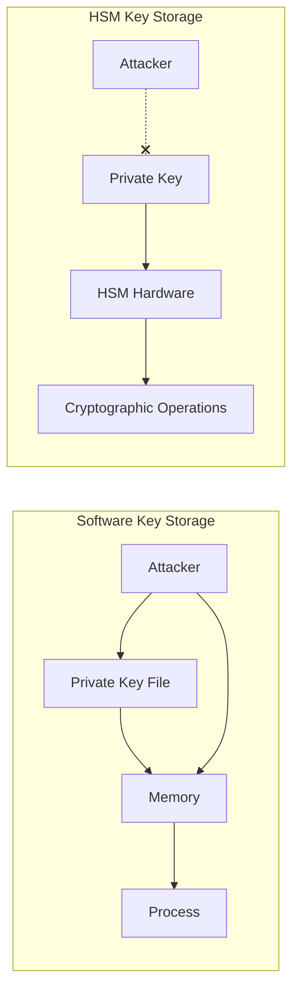
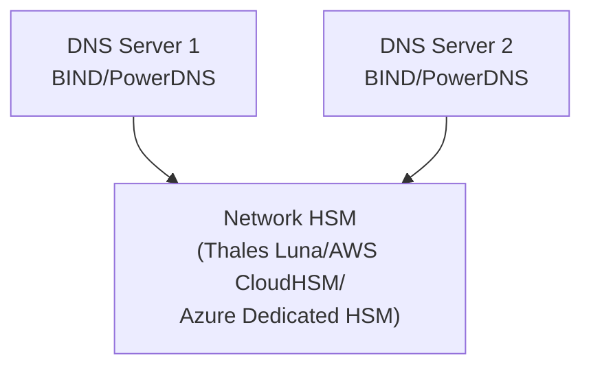
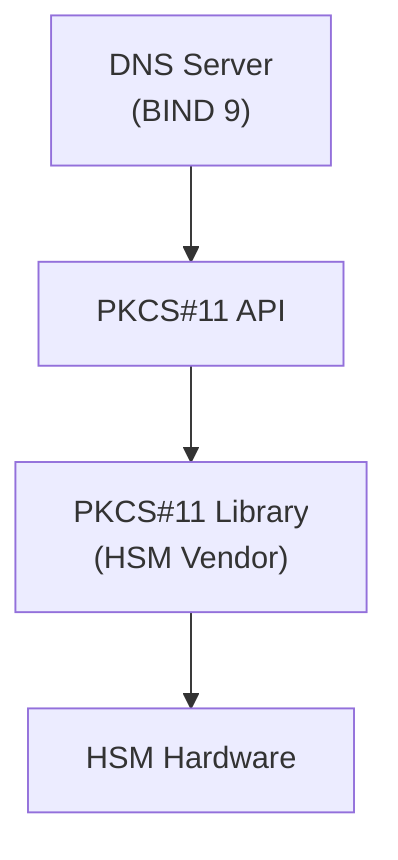
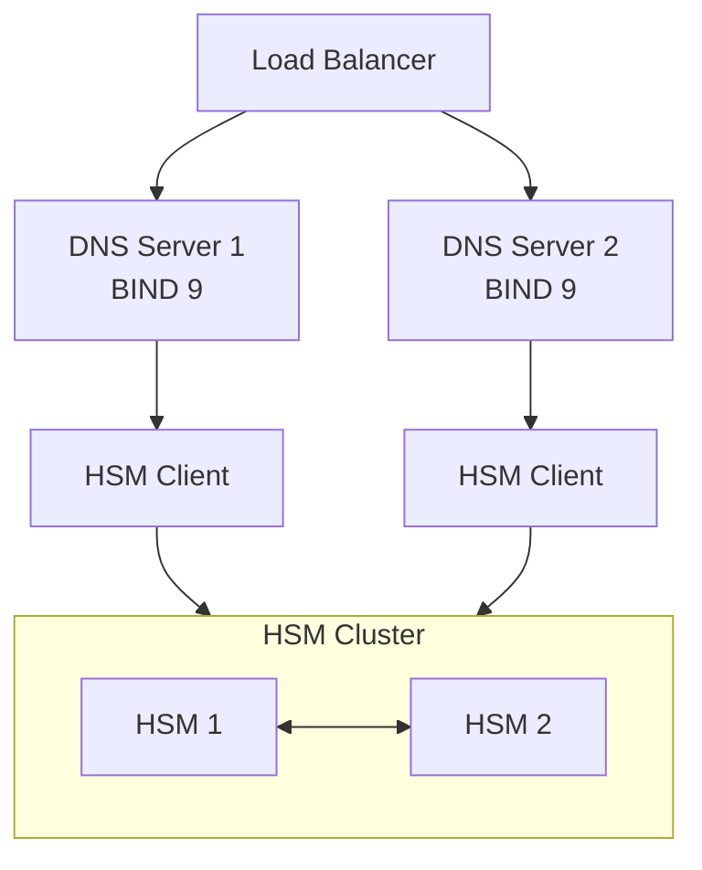

# How to Use Hardware Security Modules (HSM) for DNSSEC Key Storage

Author: [nawazdhandala](https://www.github.com/nawazdhandala)

Tags: DNSSEC, HSM, Security, Key Management, Infrastructure, Compliance

Description: A comprehensive guide to securing DNSSEC signing keys using Hardware Security Modules (HSM) with PKCS#11 integration, covering setup, configuration, key ceremonies, and operational best practices.

---

DNSSEC protects DNS from spoofing and cache poisoning attacks by cryptographically signing DNS records. But those signing keys are the crown jewels. If an attacker steals your Zone Signing Key (ZSK) or Key Signing Key (KSK), they can sign malicious records and redirect your users anywhere. Hardware Security Modules (HSMs) provide tamper-resistant storage that keeps your keys secure even if your servers are compromised.

## Why HSMs for DNSSEC?

Software-based key storage has fundamental weaknesses:



### The Security Model

| Risk | Software Keys | HSM Keys |
|------|--------------|----------|
| Key extraction from disk | Vulnerable | Protected |
| Key extraction from memory | Vulnerable | Protected |
| Unauthorized signing | Possible | Access-controlled |
| Key backup theft | High risk | Encrypted backups |
| Compliance (PCI-DSS, SOC2) | Difficult | Supported |

HSMs provide:
- **Tamper resistance** - Physical attacks trigger key destruction
- **Access control** - Multi-factor authentication for key operations
- **Audit logging** - Every key usage is recorded
- **Cryptographic boundary** - Keys never leave the HSM in plaintext

## HSM Options for DNSSEC

### Network HSMs (Recommended for Production)



Popular options:
- **Thales Luna Network HSM** - Industry standard, FIPS 140-2 Level 3
- **AWS CloudHSM** - Cloud-native, FIPS 140-2 Level 3
- **Azure Dedicated HSM** - Thales Luna-based
- **Google Cloud HSM** - Cloud KMS with HSM backend
- **Entrust nShield** - Enterprise-grade

### USB/PCIe HSMs (Smaller Deployments)

- **YubiHSM 2** - Cost-effective, good for smaller zones
- **Thales Luna PCIe** - Server-attached
- **Utimaco CryptoServer** - Versatile form factors

## PKCS#11: The HSM Interface Standard

PKCS#11 (Cryptoki) is the standard API for HSM communication. DNS servers like BIND and PowerDNS use PKCS#11 to interact with HSMs.

### PKCS#11 Architecture



### Key PKCS#11 Concepts

| Concept | Description |
|---------|-------------|
| Slot | Logical reader that contains a token |
| Token | The HSM or a partition within it |
| Session | Connection to a token |
| PIN | Authentication credential |
| Key Object | Cryptographic key stored on token |
| CKA_ID | Key identifier attribute |
| CKA_LABEL | Human-readable key name |

## Setting Up Thales Luna HSM for DNSSEC

### Step 1: Initialize the HSM Partition

```bash
# Connect to HSM admin console
ssh admin@hsm.example.com

# Create a new partition for DNSSEC
lunacm:> partition create -name dnssec-production

# Set the partition SO (Security Officer) PIN
lunacm:> role init -name SO -partition dnssec-production

# Initialize the Crypto Officer role
lunacm:> role init -name CO -partition dnssec-production
```

### Step 2: Register the Client

```bash
# On the DNS server, generate a client certificate
/usr/safenet/lunaclient/bin/vtl createCert -n dns-server-01

# On the HSM, register the client
lunacm:> client register -client dns-server-01 -hostname dns01.example.com

# Assign partition access
lunacm:> client assignPartition -client dns-server-01 -partition dnssec-production
```

### Step 3: Configure the PKCS#11 Library

Create `/etc/lunaclient/Chrystoki.conf`:

```ini
Chrystoki2 = {
  LibUNIX = /usr/safenet/lunaclient/lib/libCryptoki2.so;
  LibUNIX64 = /usr/safenet/lunaclient/lib/libCryptoki2_64.so;
}

Luna = {
  DefaultTimeOut = 500000;
  PEDTimeout1 = 100000;
  PEDTimeout2 = 200000;
  PEDTimeout3 = 10000;
  KeypairGenTimeOut = 2700000;
  CloningCommandTimeOut = 300000;
}

CardReader = {
  RemoteCommand = 1;
}

LunaSA Client = {
  ReceiveTimeout = 20000;
  NetClient = 1;
  TCPKeepAlive = 1;
  ServerCAFile = /usr/safenet/lunaclient/cert/server/CAFile.pem;
  ClientCertFile = /usr/safenet/lunaclient/cert/client/dns-server-01Cert.pem;
  ClientPrivKeyFile = /usr/safenet/lunaclient/cert/client/dns-server-01Key.pem;

  ServerName00 = hsm.example.com;
  ServerPort00 = 1792;
  ServerHtl00 = 0;
}

Misc = {
  PE1746Enabled = 0;
}
```

### Step 4: Verify HSM Connectivity

```bash
# List available slots
/usr/safenet/lunaclient/bin/cmu list

# Test authentication
/usr/safenet/lunaclient/bin/cmu verify -slot 0 -pin <your-pin>

# List objects in the slot
/usr/safenet/lunaclient/bin/cmu listobjects -slot 0 -pin <your-pin>
```

## Setting Up AWS CloudHSM for DNSSEC

### Step 1: Create CloudHSM Cluster

```bash
# Create the cluster
aws cloudhsmv2 create-cluster \
  --hsm-type hsm1.medium \
  --subnet-ids subnet-0123456789abcdef0 subnet-fedcba9876543210f

# Initialize the cluster
aws cloudhsmv2 initialize-cluster \
  --cluster-id cluster-abcdefg123456 \
  --signed-cert file://customerCA.crt \
  --trust-anchor file://customerCA.crt

# Create an HSM in the cluster
aws cloudhsmv2 create-hsm \
  --cluster-id cluster-abcdefg123456 \
  --availability-zone us-east-1a
```

### Step 2: Activate and Configure Users

```bash
# Connect to CloudHSM CLI
/opt/cloudhsm/bin/cloudhsm_mgmt_util /opt/cloudhsm/etc/cloudhsm_mgmt_util.cfg

# Login as PRECO (default user)
aws-cloudhsm> loginHSM PRECO admin password

# Change admin password
aws-cloudhsm> changePswd PRECO admin <new-password>

# Create Crypto User for DNSSEC operations
aws-cloudhsm> createUser CU dnssec-user <password>

# Logout
aws-cloudhsm> logoutHSM
```

### Step 3: Install CloudHSM Client

```bash
# Download and install the client
wget https://s3.amazonaws.com/cloudhsmv2-software/CloudHsmClient/EL7/cloudhsm-client-latest.el7.x86_64.rpm
sudo yum install -y cloudhsm-client-latest.el7.x86_64.rpm

# Configure the client
sudo /opt/cloudhsm/bin/configure -a <hsm-ip-address>

# Start the client daemon
sudo systemctl start cloudhsm-client
sudo systemctl enable cloudhsm-client
```

### Step 4: Set Up PKCS#11 Library

```bash
# Install PKCS#11 library
wget https://s3.amazonaws.com/cloudhsmv2-software/CloudHsmClient/EL7/cloudhsm-client-pkcs11-latest.el7.x86_64.rpm
sudo yum install -y cloudhsm-client-pkcs11-latest.el7.x86_64.rpm

# The PKCS#11 library is at:
# /opt/cloudhsm/lib/libcloudhsm_pkcs11.so

# Set environment variable for PKCS#11
export CLOUDHSM_PKCS11_PIN="dnssec-user:<password>"
```

## Setting Up YubiHSM 2 for DNSSEC

YubiHSM 2 is an affordable option for smaller deployments.

### Step 1: Install YubiHSM Software

```bash
# Add Yubico repository
sudo apt-add-repository ppa:yubico/stable
sudo apt update

# Install YubiHSM tools
sudo apt install -y yubihsm-connector yubihsm-shell libyubihsm1

# Start the connector
sudo systemctl start yubihsm-connector
sudo systemctl enable yubihsm-connector
```

### Step 2: Initialize YubiHSM

```bash
# Connect to YubiHSM shell
yubihsm-shell

# Connect to the device
yubihsm> connect

# Open session with default auth key (change this!)
yubihsm> session open 1 password

# Create a new authentication key
yubihsm> put authkey 0 2 dnssec-admin 1 \
  generate-asymmetric-key:sign-ecdsa:sign-pkcs:exportable-under-wrap \
  sign-ecdsa:sign-pkcs \
  <new-password>

# Delete default auth key (security!)
yubihsm> delete 0 1 authkey
```

### Step 3: Configure PKCS#11

Create `/etc/yubihsm_pkcs11.conf`:

```ini
connector = http://127.0.0.1:12345
```

Set the library path:

```bash
# The PKCS#11 library is at:
# /usr/lib/x86_64-linux-gnu/pkcs11/yubihsm_pkcs11.so

# For BIND, export:
export PKCS11_LIBRARY="/usr/lib/x86_64-linux-gnu/pkcs11/yubihsm_pkcs11.so"
```

## Configuring BIND 9 with HSM

### Step 1: Build BIND with PKCS#11 Support

```bash
# Install dependencies
sudo apt install -y libssl-dev libcap-dev libuv1-dev libnghttp2-dev

# Download BIND source
wget https://downloads.isc.org/isc/bind9/9.18.24/bind-9.18.24.tar.xz
tar xf bind-9.18.24.tar.xz
cd bind-9.18.24

# Configure with PKCS#11 native support
./configure \
  --prefix=/usr/local/bind9 \
  --with-openssl \
  --enable-native-pkcs11 \
  --with-pkcs11=/usr/safenet/lunaclient/lib/libCryptoki2_64.so

# Build and install
make -j$(nproc)
sudo make install
```

### Step 2: Configure BIND for HSM

Edit `/usr/local/bind9/etc/named.conf`:

```c
options {
    directory "/var/named";

    dnssec-validation auto;

    // HSM configuration
    // Use PKCS#11 URI for key reference
};

// Include HSM key configuration
include "/usr/local/bind9/etc/dnssec-keys.conf";
```

Create `/usr/local/bind9/etc/dnssec-keys.conf`:

```c
// Key Signing Key (KSK) - stored in HSM
// PKCS#11 URI format: pkcs11:token=<token>;object=<label>;pin-source=<file>
key-store "hsm-store" {
    pkcs11-lib "/usr/safenet/lunaclient/lib/libCryptoki2_64.so";
    pkcs11-slot 0;
    pkcs11-pin-file "/usr/local/bind9/etc/hsm-pin";
};
```

### Step 3: Generate DNSSEC Keys in HSM

```bash
# Generate KSK (Key Signing Key)
pkcs11-keygen -a RSASHA256 -b 2048 -l ksk-example-com \
  -m /usr/safenet/lunaclient/lib/libCryptoki2_64.so \
  -s 0 -p <pin>

# Generate ZSK (Zone Signing Key)
pkcs11-keygen -a RSASHA256 -b 1024 -l zsk-example-com \
  -m /usr/safenet/lunaclient/lib/libCryptoki2_64.so \
  -s 0 -p <pin>

# Alternative: ECDSA keys (recommended for new deployments)
pkcs11-keygen -a ECDSAP256SHA256 -l ksk-example-com-ecdsa \
  -m /usr/safenet/lunaclient/lib/libCryptoki2_64.so \
  -s 0 -p <pin>
```

### Step 4: Create DNSKEY Files

```bash
# List keys in HSM
pkcs11-list -m /usr/safenet/lunaclient/lib/libCryptoki2_64.so -s 0 -p <pin>

# Export public key to DNSKEY format
pkcs11-keyfromlabel -a RSASHA256 -l ksk-example-com \
  -m /usr/safenet/lunaclient/lib/libCryptoki2_64.so \
  -s 0 -p <pin> \
  example.com > Kexample.com.+008+12345.key

# Create private key reference file
cat > Kexample.com.+008+12345.private << EOF
Private-key-format: v1.3
Algorithm: 8 (RSASHA256)
Engine: pkcs11
Label: ksk-example-com
EOF
```

### Step 5: Sign the Zone

```bash
# Sign zone with HSM keys
dnssec-signzone -S -K /var/named/keys \
  -o example.com \
  -e +31536000 \
  /var/named/example.com.zone

# The -S flag uses smart signing with key management
# -K specifies the key directory
# -e sets signature expiration (1 year)
```

## Configuring PowerDNS with HSM

### Step 1: Install PowerDNS with PKCS#11 Support

```bash
# Install PowerDNS
sudo apt install -y pdns-server pdns-backend-sqlite3

# PowerDNS uses SoftHSM or hardware HSM via PKCS#11
# Install PKCS#11 development files
sudo apt install -y libp11-kit-dev softhsm2
```

### Step 2: Configure PowerDNS for HSM

Edit `/etc/powerdns/pdns.conf`:

```ini
# Enable DNSSEC
dnssec=yes

# Use PKCS#11 for key storage
module-dir=/usr/lib/x86_64-linux-gnu/pdns

# PKCS#11 configuration
# Use pkcs11-token-config to specify HSM
```

Create `/etc/powerdns/pkcs11.conf`:

```ini
# Luna HSM configuration
pkcs11-module=/usr/safenet/lunaclient/lib/libCryptoki2_64.so
pkcs11-token=dnssec-production
pkcs11-pin-file=/etc/powerdns/hsm-pin
pkcs11-slot=0

# Or for AWS CloudHSM
# pkcs11-module=/opt/cloudhsm/lib/libcloudhsm_pkcs11.so
# pkcs11-token=hsm
# pkcs11-pin=CU:dnssec-user:password
```

### Step 3: Generate Keys in HSM via PowerDNS

```bash
# Add a zone
pdnsutil create-zone example.com

# Secure the zone (generates keys in HSM)
pdnsutil secure-zone example.com

# View DNSSEC status
pdnsutil show-zone example.com

# Export DS records for parent zone
pdnsutil export-zone-ds example.com
```

## OpenDNSSEC with HSM Integration

OpenDNSSEC provides automated key management and zone signing with HSM support.

### Step 1: Install OpenDNSSEC

```bash
sudo apt install -y opendnssec opendnssec-enforcer opendnssec-signer

# Or build from source for latest version
wget https://github.com/opendnssec/opendnssec/releases/download/2.1.13/opendnssec-2.1.13.tar.gz
tar xzf opendnssec-2.1.13.tar.gz
cd opendnssec-2.1.13
./configure --with-pkcs11-module=/usr/safenet/lunaclient/lib/libCryptoki2_64.so
make && sudo make install
```

### Step 2: Configure OpenDNSSEC

Edit `/etc/opendnssec/conf.xml`:

```xml
<?xml version="1.0" encoding="UTF-8"?>
<Configuration>
    <RepositoryList>
        <Repository name="LunaHSM">
            <Module>/usr/safenet/lunaclient/lib/libCryptoki2_64.so</Module>
            <TokenLabel>dnssec-production</TokenLabel>
            <PIN>/etc/opendnssec/hsm-pin</PIN>
            <SkipPublicKey/>
        </Repository>
    </RepositoryList>

    <Common>
        <Logging>
            <Syslog><Facility>local0</Facility></Syslog>
        </Logging>
        <PolicyFile>/etc/opendnssec/kasp.xml</PolicyFile>
        <ZoneListFile>/etc/opendnssec/zonelist.xml</ZoneListFile>
    </Common>

    <Enforcer>
        <Datastore><SQLite>/var/lib/opendnssec/kasp.db</SQLite></Datastore>
        <AutomaticKeyGenerationPeriod>P1Y</AutomaticKeyGenerationPeriod>
    </Enforcer>

    <Signer>
        <WorkingDirectory>/var/lib/opendnssec/signer</WorkingDirectory>
        <WorkerThreads>4</WorkerThreads>
    </Signer>
</Configuration>
```

### Step 3: Define Key and Signing Policy (KASP)

Edit `/etc/opendnssec/kasp.xml`:

```xml
<?xml version="1.0" encoding="UTF-8"?>
<KASP>
    <Policy name="default">
        <Description>Default DNSSEC policy using HSM</Description>

        <Signatures>
            <Resign>PT2H</Resign>
            <Refresh>P3D</Refresh>
            <Validity>
                <Default>P14D</Default>
                <Denial>P14D</Denial>
            </Validity>
            <Jitter>PT12H</Jitter>
            <InceptionOffset>PT1H</InceptionOffset>
            <MaxZoneTTL>P1D</MaxZoneTTL>
        </Signatures>

        <Denial>
            <NSEC3>
                <OptOut/>
                <Resalt>P100D</Resalt>
                <Hash>
                    <Algorithm>1</Algorithm>
                    <Iterations>10</Iterations>
                    <Salt length="8"/>
                </Hash>
            </NSEC3>
        </Denial>

        <Keys>
            <TTL>PT3600S</TTL>
            <RetireSafety>PT3600S</RetireSafety>
            <PublishSafety>PT3600S</PublishSafety>
            <Purge>P14D</Purge>

            <KSK>
                <Algorithm length="2048">8</Algorithm>
                <Lifetime>P1Y</Lifetime>
                <Repository>LunaHSM</Repository>
            </KSK>

            <ZSK>
                <Algorithm length="1024">8</Algorithm>
                <Lifetime>P30D</Lifetime>
                <Repository>LunaHSM</Repository>
            </ZSK>
        </Keys>

        <Zone>
            <PropagationDelay>PT9999S</PropagationDelay>
            <SOA>
                <TTL>PT3600S</TTL>
                <Minimum>PT3600S</Minimum>
                <Serial>unixtime</Serial>
            </SOA>
        </Zone>

        <Parent>
            <PropagationDelay>PT9999S</PropagationDelay>
            <DS>
                <TTL>PT3600S</TTL>
            </DS>
            <SOA>
                <TTL>PT3600S</TTL>
                <Minimum>PT3600S</Minimum>
            </SOA>
        </Parent>
    </Policy>
</KASP>
```

### Step 4: Initialize and Run OpenDNSSEC

```bash
# Initialize the datastore
ods-enforcer-db-setup

# Verify HSM connectivity
ods-hsmutil list

# Import the policy
ods-enforcer policy import

# Add a zone
ods-enforcer zone add --zone example.com --policy default

# Start the services
systemctl start opendnssec-enforcer
systemctl start opendnssec-signer

# Monitor key states
ods-enforcer key list --verbose
```

## Key Ceremonies and Procedures

### KSK Key Ceremony Checklist

A proper KSK ceremony ensures audit compliance and key security.

```markdown
## KSK Generation Ceremony Checklist

### Pre-Ceremony (1 week before)
- [ ] Schedule ceremony with all required personnel
- [ ] Prepare ceremony room (no windows, camera disabled)
- [ ] Test HSM connectivity
- [ ] Prepare ceremony scripts
- [ ] Print ceremony documentation
- [ ] Notify auditors

### Personnel Required
- [ ] Ceremony Administrator (CA)
- [ ] Internal Witness 1 (IW1)
- [ ] Internal Witness 2 (IW2)
- [ ] External Auditor (optional)
- [ ] Security Officer (SO)

### Equipment Check
- [ ] HSM is operational
- [ ] Ceremony laptop (air-gapped)
- [ ] USB drives (new, sealed)
- [ ] Tamper-evident bags
- [ ] Camera for evidence (if allowed)
- [ ] Safe for credential storage

### Ceremony Steps
1. [ ] Verify attendee identities
2. [ ] Open tamper-evident bags for smart cards
3. [ ] Initialize HSM partition (if new)
4. [ ] Generate KSK key pair
5. [ ] Export public key
6. [ ] Generate DS record
7. [ ] Sign ceremony log
8. [ ] Store credentials in tamper-evident bags
9. [ ] Place bags in safe
10. [ ] Complete ceremony documentation

### Post-Ceremony
- [ ] Distribute DS record to registrar
- [ ] Verify DS record publication
- [ ] Store ceremony documentation
- [ ] Update key inventory
```

### KSK Generation Script

```bash
#!/bin/bash
# ksk-ceremony.sh - KSK Generation Script for HSM
set -euo pipefail

ZONE="example.com"
HSM_LIB="/usr/safenet/lunaclient/lib/libCryptoki2_64.so"
HSM_SLOT="0"
ALGORITHM="RSASHA256"
KEY_SIZE="2048"
DATE=$(date +%Y%m%d)
LABEL="ksk-${ZONE}-${DATE}"

echo "=========================================="
echo "KSK Generation Ceremony"
echo "Zone: ${ZONE}"
echo "Date: $(date)"
echo "=========================================="

# Verify HSM connectivity
echo "[1/6] Verifying HSM connectivity..."
pkcs11-tokens -m ${HSM_LIB}

# Prompt for HSM PIN (entered by Security Officer)
echo "[2/6] HSM PIN required (Security Officer to enter):"
read -s -p "HSM PIN: " HSM_PIN
echo

# Generate the KSK
echo "[3/6] Generating KSK..."
pkcs11-keygen -a ${ALGORITHM} -b ${KEY_SIZE} \
  -l ${LABEL} \
  -m ${HSM_LIB} \
  -s ${HSM_SLOT} \
  -p ${HSM_PIN} \
  -E  # Extractable flag for backup

echo "[4/6] Exporting public key..."
PUBLIC_KEY_FILE="K${ZONE}.+008+$(date +%s).key"
pkcs11-keyfromlabel -a ${ALGORITHM} -l ${LABEL} \
  -m ${HSM_LIB} \
  -s ${HSM_SLOT} \
  -p ${HSM_PIN} \
  ${ZONE} > ${PUBLIC_KEY_FILE}

echo "[5/6] Calculating DS record..."
dnssec-dsfromkey -2 ${PUBLIC_KEY_FILE}

echo "[6/6] Ceremony complete"
echo "=========================================="
echo "Public Key File: ${PUBLIC_KEY_FILE}"
echo "DS Record: Submit to parent zone registrar"
echo "=========================================="

# Zero out PIN from memory
HSM_PIN=""
```

### ZSK Rollover Procedure

```bash
#!/bin/bash
# zsk-rollover.sh - Automated ZSK Rollover
set -euo pipefail

ZONE="example.com"
HSM_LIB="/usr/safenet/lunaclient/lib/libCryptoki2_64.so"
HSM_SLOT="0"
OLD_ZSK_LABEL="zsk-${ZONE}-old"
NEW_ZSK_LABEL="zsk-${ZONE}-$(date +%Y%m%d)"

echo "Starting ZSK rollover for ${ZONE}"

# Phase 1: Pre-publication
echo "[Phase 1] Generating new ZSK..."
pkcs11-keygen -a RSASHA256 -b 1024 \
  -l ${NEW_ZSK_LABEL} \
  -m ${HSM_LIB} \
  -s ${HSM_SLOT}

echo "[Phase 1] Adding new ZSK to zone (not signing yet)..."
# Publish new DNSKEY but don't use for signing
rndc signing -nsec3param none ${ZONE}
rndc reload ${ZONE}

echo "[Phase 1] Waiting for DNSKEY propagation..."
sleep 86400  # Wait 1 day for TTL to expire

# Phase 2: New ZSK active
echo "[Phase 2] Activating new ZSK for signing..."
# Update signing configuration to use new ZSK
rndc sign ${ZONE}

echo "[Phase 2] Waiting for old signatures to expire..."
sleep 604800  # Wait 7 days

# Phase 3: Old ZSK removal
echo "[Phase 3] Removing old ZSK from zone..."
# Remove old DNSKEY RR
rndc reload ${ZONE}

echo "[Phase 3] Archiving old key..."
pkcs11-destroy -l ${OLD_ZSK_LABEL} \
  -m ${HSM_LIB} \
  -s ${HSM_SLOT}

echo "ZSK rollover complete"
```

## High Availability HSM Setup

### Active-Active HSM Configuration



### Luna HSM HA Group Configuration

```bash
# Create HA group
/usr/safenet/lunaclient/bin/vtl createCert -n ha-group

# Add HSMs to the group
/usr/safenet/lunaclient/bin/lunacm hagroup addmember \
  -group dnssec-ha \
  -serialnum 123456 \
  -serialnum 789012

# Configure HA mode
cat >> /etc/lunaclient/Chrystoki.conf << EOF
VirtualToken = {
  VirtualToken00Label = dnssec-ha;
  VirtualToken00SN = 123456,789012;
  VirtualToken00Members = 123456,789012;
}

HASynchronize = {
  AutoReconnect = 1;
  HAOnly = 1;
}
EOF
```

### AWS CloudHSM HA Configuration

```bash
# CloudHSM clusters are HA by default
# Add HSMs to different AZs

# HSM 1 in AZ-a
aws cloudhsmv2 create-hsm \
  --cluster-id cluster-abcdefg \
  --availability-zone us-east-1a

# HSM 2 in AZ-b
aws cloudhsmv2 create-hsm \
  --cluster-id cluster-abcdefg \
  --availability-zone us-east-1b

# Configure client for HA
cat > /opt/cloudhsm/etc/cloudhsm_client.cfg << EOF
{
  "cluster": {
    "hsm_ca_file": "/opt/cloudhsm/etc/customerCA.crt"
  },
  "server": {
    "hostname": "10.0.1.100,10.0.2.100"
  }
}
EOF
```

## Monitoring HSM Health

### Prometheus Metrics for HSM

```yaml
# prometheus-hsm-exporter.yaml
apiVersion: apps/v1
kind: Deployment
metadata:
  name: hsm-exporter
spec:
  replicas: 1
  template:
    spec:
      containers:
        - name: hsm-exporter
          image: hsm-exporter:latest
          ports:
            - containerPort: 9100
          env:
            - name: HSM_LIBRARY
              value: "/usr/safenet/lunaclient/lib/libCryptoki2_64.so"
            - name: HSM_SLOT
              value: "0"
          volumeMounts:
            - name: hsm-config
              mountPath: /etc/lunaclient
```

### HSM Health Check Script

```bash
#!/bin/bash
# hsm-health-check.sh

HSM_LIB="/usr/safenet/lunaclient/lib/libCryptoki2_64.so"
ALERT_EMAIL="security@example.com"

check_hsm_status() {
    local status=$(pkcs11-tokens -m ${HSM_LIB} 2>&1)
    if echo "$status" | grep -q "Token present"; then
        echo "HSM Status: OK"
        return 0
    else
        echo "HSM Status: FAILED"
        return 1
    fi
}

check_key_count() {
    local expected=$1
    local count=$(pkcs11-list -m ${HSM_LIB} -s 0 2>&1 | grep -c "Private Key")
    if [ "$count" -ge "$expected" ]; then
        echo "Key Count: OK ($count keys)"
        return 0
    else
        echo "Key Count: WARNING (expected $expected, found $count)"
        return 1
    fi
}

check_session() {
    local result=$(pkcs11-tool --module ${HSM_LIB} --slot 0 --login --pin env:HSM_PIN --list-objects 2>&1)
    if echo "$result" | grep -q "error"; then
        echo "Session: FAILED"
        return 1
    else
        echo "Session: OK"
        return 0
    fi
}

# Run checks
echo "=========================================="
echo "HSM Health Check - $(date)"
echo "=========================================="

ERRORS=0

check_hsm_status || ((ERRORS++))
check_key_count 4 || ((ERRORS++))  # Expect at least 4 keys (2 KSK + 2 ZSK)
check_session || ((ERRORS++))

if [ $ERRORS -gt 0 ]; then
    echo "=========================================="
    echo "ALERT: $ERRORS check(s) failed"
    echo "=========================================="

    # Send alert
    echo "HSM health check failed with $ERRORS errors" | \
      mail -s "HSM Alert: Health Check Failed" ${ALERT_EMAIL}

    exit 1
fi

echo "=========================================="
echo "All checks passed"
echo "=========================================="
exit 0
```

### OneUptime Integration for HSM Monitoring

```bash
# Configure OneUptime to monitor HSM health endpoint
curl -X POST "https://api.oneuptime.com/v1/monitors" \
  -H "Authorization: Bearer ${ONEUPTIME_API_KEY}" \
  -H "Content-Type: application/json" \
  -d '{
    "name": "HSM Health Check",
    "type": "script",
    "interval": 300,
    "script": {
      "type": "bash",
      "content": "/opt/scripts/hsm-health-check.sh"
    },
    "alertThreshold": 1,
    "alertContacts": ["security-team"]
  }'
```

## Disaster Recovery

### HSM Key Backup Procedure

```bash
#!/bin/bash
# hsm-backup.sh - Export encrypted key backup

BACKUP_DIR="/secure/hsm-backups"
DATE=$(date +%Y%m%d-%H%M%S)
HSM_LIB="/usr/safenet/lunaclient/lib/libCryptoki2_64.so"

# Create backup directory
mkdir -p ${BACKUP_DIR}/${DATE}

# Export wrapped keys (encrypted with HSM backup key)
# Luna HSM specific
/usr/safenet/lunaclient/bin/lunacm backup \
  -partition dnssec-production \
  -f ${BACKUP_DIR}/${DATE}/partition-backup.bak

# Generate checksum
sha256sum ${BACKUP_DIR}/${DATE}/partition-backup.bak > \
  ${BACKUP_DIR}/${DATE}/checksum.sha256

# Encrypt backup manifest
cat > ${BACKUP_DIR}/${DATE}/manifest.txt << EOF
Backup Date: $(date)
Partition: dnssec-production
HSM Serial: $(pkcs11-tokens -m ${HSM_LIB} | grep Serial)
Key Count: $(pkcs11-list -m ${HSM_LIB} -s 0 | grep -c "Private Key")
EOF

# Store off-site (encrypted)
gpg --encrypt --recipient backup@example.com \
  ${BACKUP_DIR}/${DATE}/partition-backup.bak

echo "Backup complete: ${BACKUP_DIR}/${DATE}"
```

### HSM Recovery Procedure

```bash
#!/bin/bash
# hsm-restore.sh - Restore from encrypted backup

BACKUP_FILE=$1
HSM_LIB="/usr/safenet/lunaclient/lib/libCryptoki2_64.so"

if [ -z "$BACKUP_FILE" ]; then
    echo "Usage: $0 <backup-file>"
    exit 1
fi

# Verify checksum
echo "Verifying backup integrity..."
sha256sum -c $(dirname ${BACKUP_FILE})/checksum.sha256

# Decrypt if necessary
if [[ ${BACKUP_FILE} == *.gpg ]]; then
    gpg --decrypt ${BACKUP_FILE} > ${BACKUP_FILE%.gpg}
    BACKUP_FILE=${BACKUP_FILE%.gpg}
fi

# Restore to HSM
echo "Restoring to HSM..."
/usr/safenet/lunaclient/bin/lunacm restore \
  -partition dnssec-production \
  -f ${BACKUP_FILE}

# Verify restoration
echo "Verifying restored keys..."
pkcs11-list -m ${HSM_LIB} -s 0

echo "Restore complete"
```

## Security Best Practices

### Access Control Matrix

| Role | HSM Access | Key Generation | Signing | Backup | Audit |
|------|-----------|----------------|---------|--------|-------|
| Security Officer | Full | Yes | No | Yes | Yes |
| DNS Administrator | Limited | No | Yes | No | View |
| Crypto Officer | Limited | Yes | No | No | Yes |
| Auditor | None | No | No | No | Yes |
| Application | Token | No | Yes | No | No |

### PIN/Credential Management

```bash
# Store HSM PIN securely using HashiCorp Vault
vault kv put secret/hsm/dnssec-production \
  pin="<hsm-pin>" \
  backup-passphrase="<backup-passphrase>"

# Retrieve PIN at runtime
export HSM_PIN=$(vault kv get -field=pin secret/hsm/dnssec-production)

# Use PIN file with restricted permissions
install -m 0400 -o named -g named /dev/null /etc/bind/hsm-pin
vault kv get -field=pin secret/hsm/dnssec-production > /etc/bind/hsm-pin
```

### Audit Logging Configuration

```bash
# Configure HSM audit logging (Luna)
/usr/safenet/lunaclient/bin/lunacm audit config \
  -partition dnssec-production \
  -log all \
  -rotation daily

# Forward logs to SIEM
cat >> /etc/rsyslog.d/hsm.conf << EOF
local0.* @@siem.example.com:514
EOF

# Parse HSM logs for security events
grep -E "(login|keygen|sign|error)" /var/log/hsm/audit.log | \
  logger -t hsm-security
```

## Troubleshooting

### Common Issues and Solutions

| Issue | Cause | Solution |
|-------|-------|----------|
| CKR_TOKEN_NOT_PRESENT | HSM not connected | Check network/USB connection |
| CKR_PIN_INCORRECT | Wrong PIN | Verify PIN, check caps lock |
| CKR_SESSION_HANDLE_INVALID | Session timeout | Reconnect, increase timeout |
| CKR_KEY_NOT_FOUND | Wrong key label | List keys, verify label |
| CKR_DEVICE_ERROR | HSM hardware issue | Check HSM status, contact vendor |
| CKR_USER_NOT_LOGGED_IN | Session not authenticated | Login before operations |

### Debugging PKCS#11 Operations

```bash
# Enable PKCS#11 debug logging
export PKCS11_DEBUG=1
export PKCS11_DEBUG_FILE=/tmp/pkcs11-debug.log

# Test with pkcs11-tool
pkcs11-tool --module ${HSM_LIB} \
  --slot 0 \
  --login \
  --pin ${HSM_PIN} \
  --list-objects \
  --verbose

# Trace PKCS#11 calls
strace -f -e trace=open,read,write,ioctl \
  pkcs11-list -m ${HSM_LIB} -s 0 2>&1 | \
  tee /tmp/pkcs11-strace.log
```

### HSM Connectivity Test Script

```bash
#!/bin/bash
# test-hsm-connectivity.sh

HSM_LIB=$1
HSM_SLOT=${2:-0}

if [ -z "$HSM_LIB" ]; then
    echo "Usage: $0 <hsm-library-path> [slot]"
    exit 1
fi

echo "Testing HSM connectivity..."
echo "Library: ${HSM_LIB}"
echo "Slot: ${HSM_SLOT}"
echo "=========================================="

# Test 1: Library loads
echo -n "[1/5] Library loads: "
if [ -f "${HSM_LIB}" ]; then
    echo "PASS"
else
    echo "FAIL - Library not found"
    exit 1
fi

# Test 2: Library executes
echo -n "[2/5] Library executes: "
if pkcs11-tool --module ${HSM_LIB} --list-slots 2>/dev/null; then
    echo "PASS"
else
    echo "FAIL - Cannot execute library"
    exit 1
fi

# Test 3: Slot accessible
echo -n "[3/5] Slot accessible: "
if pkcs11-tool --module ${HSM_LIB} --slot ${HSM_SLOT} --list-token-slots 2>/dev/null | grep -q "Slot"; then
    echo "PASS"
else
    echo "FAIL - Slot not accessible"
    exit 1
fi

# Test 4: Token present
echo -n "[4/5] Token present: "
if pkcs11-tool --module ${HSM_LIB} --slot ${HSM_SLOT} --list-token-slots 2>/dev/null | grep -q "token present"; then
    echo "PASS"
else
    echo "FAIL - Token not present"
    exit 1
fi

# Test 5: Login works (requires PIN)
echo -n "[5/5] Login works: "
read -s -p "Enter PIN: " PIN
echo
if pkcs11-tool --module ${HSM_LIB} --slot ${HSM_SLOT} --login --pin ${PIN} --list-objects 2>/dev/null; then
    echo "PASS"
else
    echo "FAIL - Login failed"
    exit 1
fi

echo "=========================================="
echo "All connectivity tests passed"
```

## Summary Table

| Component | Purpose | Configuration File | Key Command |
|-----------|---------|-------------------|-------------|
| HSM | Hardware key storage | Vendor-specific | pkcs11-tool |
| PKCS#11 | HSM interface API | N/A | pkcs11-keygen |
| BIND 9 | DNS server | named.conf | dnssec-signzone |
| PowerDNS | DNS server | pdns.conf | pdnsutil |
| OpenDNSSEC | Key management | conf.xml, kasp.xml | ods-enforcer |
| KSK | Signs DNSKEY RRset | In HSM | pkcs11-keygen |
| ZSK | Signs zone data | In HSM | pkcs11-keygen |
| DS Record | Parent zone link | Registrar | dnssec-dsfromkey |

### Quick Reference Commands

```bash
# List HSM tokens
pkcs11-tool --module ${HSM_LIB} --list-tokens

# List keys in HSM
pkcs11-tool --module ${HSM_LIB} --slot 0 --login --pin ${PIN} --list-objects

# Generate RSA key
pkcs11-keygen -a RSASHA256 -b 2048 -l key-label -m ${HSM_LIB} -s 0

# Generate ECDSA key
pkcs11-keygen -a ECDSAP256SHA256 -l key-label -m ${HSM_LIB} -s 0

# Export public key
pkcs11-keyfromlabel -a RSASHA256 -l key-label -m ${HSM_LIB} -s 0 zone.com

# Sign zone
dnssec-signzone -S -K /path/to/keys -o zone.com zone.com.zone

# OpenDNSSEC key status
ods-enforcer key list --verbose

# Check DS record
dig DS example.com @8.8.8.8
```

---

Using HSMs for DNSSEC key storage transforms your DNS security from "hope attackers don't get root" to "keys are physically protected." The upfront investment in hardware and ceremony complexity pays off with keys that can't be extracted even from a fully compromised server. For organizations handling sensitive zones or requiring compliance certifications, HSMs aren't optional - they're the foundation of trustworthy DNSSEC deployment.
