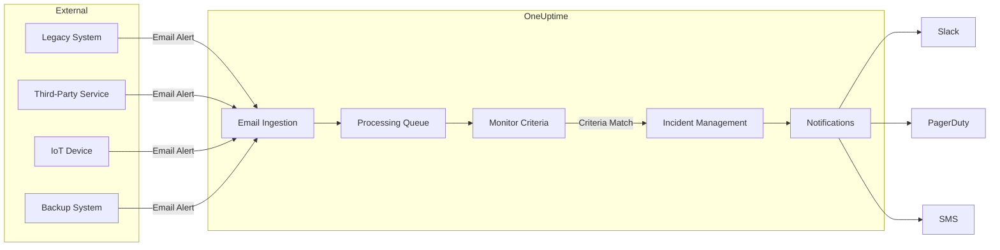

# How to Use Incoming Email Monitor in OneUptime

Author: [nawazdhandala](https://www.github.com/nawazdhandala)

Tags: Email, Monitoring, Incoming Email, Alerts, DevOps, Reliability, Uptime Monitoring, Automation

Description: A comprehensive guide to monitoring email-based alerts with OneUptime's Incoming Email Monitor. Learn how to capture alerts from legacy systems, third-party services, and IoT devices that send notifications via email.

---

Monitoring your email-based alerts and notifications is crucial for maintaining system reliability. Many third-party services, legacy systems, and IoT devices send critical alerts via email. With OneUptime's **Incoming Email Monitor**, you can capture these emails and trigger incidents based on configurable criteria.

In this guide, we'll walk you through setting up and using the Incoming Email Monitor feature.

---

## TL;DR

- OneUptime assigns a unique email address to each Incoming Email Monitor
- When emails arrive at this address, they're evaluated against your configured criteria
- Trigger incidents based on email subject, sender, body content, or timing
- Perfect for legacy systems, third-party services, and devices that only support email notifications
- Set up heartbeat-style monitoring to alert when expected emails don't arrive

---

## What is Incoming Email Monitor?

The Incoming Email Monitor watches for incoming emails at a unique email address assigned to your monitor. When an email arrives and matches your configured criteria, OneUptime can change the monitor status, trigger incidents, or send notifications to your team.

This is particularly useful for:

- **Legacy system alerts**: Capture alerts from older systems that only support email notifications
- **Third-party service monitoring**: Monitor emails from services that don't have webhook integrations
- **IoT device alerts**: Receive and process alerts from IoT devices that send email notifications
- **Backup monitoring**: Get notified when backup completion emails don't arrive on schedule
- **Report monitoring**: Ensure scheduled reports arrive as expected

---

## How OneUptime Processes Incoming Emails

The diagram below illustrates how emails flow through the Incoming Email Monitor system. When an email is sent to your monitor's unique address, it's received via SendGrid's Inbound Parse webhook, queued for processing, evaluated against your criteria, and can trigger incidents if conditions are met.



---

## Creating an Incoming Email Monitor

### Step 1: Navigate to Monitors

1. Log in to your OneUptime dashboard
2. Select your project
3. Click on **Monitors** in the sidebar
4. Click the **Create Monitor** button

### Step 2: Select Monitor Type

From the list of monitor types, select **Incoming Email**. You'll see the description: *"This monitor type triggers alerts when emails are received at a unique email address with matching criteria."*

### Step 3: Configure Basic Settings

Fill in the basic monitor details:

- **Name**: Give your monitor a descriptive name (e.g., "Backup Completion Alerts")
- **Description**: Add details about what this monitor tracks
- **Labels**: Add labels for organization and filtering

### Step 4: Get Your Unique Email Address

Once created, each Incoming Email Monitor is assigned a unique email address in the format:

```
monitor-{secret-key}@{your-inbound-domain}
```

For example:
```
monitor-550e8400-e29b-41d4-a716-446655440000@inbound.oneuptime.com
```

You can find this email address in:
- The **Documentation** tab of your monitor
- The **Settings** tab of your monitor

Copy this email address and configure your source system to send emails to it.

---

## Configuring Monitoring Criteria

The power of Incoming Email Monitor lies in its flexible criteria system. You can set up rules to determine when your monitor should change status based on incoming emails.

### Available Check Fields

| Field | Description |
|-------|-------------|
| **Email Received At** | Check based on when emails arrive or don't arrive |
| **Email Subject** | Match content in the email subject line |
| **Email From** | Match the sender's email address |
| **Email Body** | Match content in the email body |
| **Email To** | Match the recipient email address |
| **JavaScript Expression** | Write custom logic for complex matching |

### Filter Types

#### For Email Received At

- **Received In Minutes**: Email was received within X minutes
- **Not Received In Minutes**: Email was NOT received within X minutes

This is perfect for heartbeat-style monitoring. For example, if your backup system should email every hour, you can set criteria for "Not Received In Minutes: 70" to trigger an alert if the email is late.

#### For Text Fields (Subject, From, Body, To)

- **Contains**: Field contains the specified text
- **Not Contains**: Field does not contain the specified text
- **Equal To**: Field exactly matches the specified text
- **Not Equal To**: Field does not exactly match
- **Starts With**: Field begins with the specified text
- **Ends With**: Field ends with the specified text
- **Is Empty**: Field is empty
- **Is Not Empty**: Field has content

---

## Example Criteria Configurations

### Example 1: Alert on Backup Failure

Monitor for backup failure notifications. This configuration detects when your backup system sends failure notifications.

**Criteria for "Offline" status:**
- Check: `Email Subject`
- Filter: `Contains`
- Value: `FAILED`

**Criteria for "Online" status:**
- Check: `Email Subject`
- Filter: `Contains`
- Value: `SUCCESS`

### Example 2: Monitor Scheduled Reports

Ensure daily reports arrive on time. This is useful when you expect regular reports via email.

**Criteria for "Offline" status:**
- Check: `Email Received At`
- Filter: `Not Received In Minutes`
- Value: `1500` (25 hours)

### Example 3: Filter by Sender and Content

Only process emails from a specific sender with critical content. This allows you to focus on high-priority alerts.

**Criteria:**
- Check: `Email From`
- Filter: `Equal To`
- Value: `alerts@your-service.com`

Combined with:
- Check: `Email Body`
- Filter: `Contains`
- Value: `CRITICAL`

### Example 4: JavaScript Expression for Complex Logic

Use JavaScript for advanced filtering scenarios. The expression has access to the email object with properties like `subject`, `from`, `body`, and `to`.

**Criteria:**
- Check: `JavaScript Expression`
- Filter: `Evaluates To True`
- Value:
```javascript
// Check if the email is a high-priority alert
// by examining multiple conditions
const isHighPriority = subject.includes('URGENT') || subject.includes('CRITICAL');
const isFromAlertSystem = from.includes('alerts@');
const hasErrorKeyword = body.toLowerCase().includes('error');

// Return true to trigger the criteria match
isHighPriority && isFromAlertSystem && hasErrorKeyword;
```

---

## Viewing Monitor Status

Once your monitor is receiving emails, you can view detailed information in the monitor's summary view:

### Info Cards

- **Last Email Received At**: When the most recent email arrived
- **From**: The sender's email address
- **Subject**: The email's subject line
- **Monitor Status Check At**: When criteria were last evaluated

### Detailed Information

Click "Show More" to view:

- **Email Headers**: Full email headers in JSON format
- **Email Body (Text)**: Plain text version of the email
- **Email Body (HTML)**: HTML version of the email

---

## How It Works Behind the Scenes

1. **Email Reception**: Emails sent to your monitor's unique address are received via SendGrid's Inbound Parse webhook
2. **Queuing**: Incoming emails are queued for processing to ensure reliable handling
3. **Criteria Evaluation**: The email is evaluated against your configured criteria
4. **Status Update**: Monitor status is updated based on matching criteria
5. **Incident Creation**: If configured, incidents are created when status changes
6. **Heartbeat Checks**: Background jobs periodically re-evaluate time-based criteria (like "Not Received In Minutes")

---

## Best Practices

### 1. Use Specific Criteria

Instead of broad matches, use specific criteria to avoid false positives.

```
Bad:  Subject Contains "error"
Good: Subject Contains "[CRITICAL] Database Error" AND From Equals "monitoring@db.example.com"
```

### 2. Set Up Multiple Criteria Levels

Configure different severity levels for granular alerting:

- **Degraded**: Subject contains "WARNING"
- **Offline**: Subject contains "CRITICAL" or "FAILED"
- **Online**: Subject contains "RESOLVED" or "SUCCESS"

### 3. Use Time-Based Criteria for Heartbeats

For systems that should send regular emails:

- Calculate expected interval plus buffer time
- Set "Not Received In Minutes" slightly longer than expected interval
- Example: For hourly emails, use 70-75 minutes to account for slight delays

### 4. Test Your Configuration

Send test emails to your monitor's address to verify:

- Emails are being received
- Criteria are matching correctly
- Status changes are triggering as expected

### 5. Monitor Multiple Sources

Create separate monitors for different email sources to:

- Track each source independently
- Apply source-specific criteria
- Generate focused incident reports

---

## When to Use Incoming Email vs Incoming Request Monitors

OneUptime offers two types of incoming monitors:

| Feature | Incoming Email Monitor | Incoming Request Monitor |
|---------|----------------------|-------------------------|
| **Protocol** | Email (SMTP) | HTTP/HTTPS |
| **Best For** | Legacy systems, email-only services | Modern APIs, scripts, IoT devices |
| **Setup** | Configure source to send email | Add HTTP call to scripts/code |
| **Payload** | Email subject, body, headers | JSON/form data in request body |

**Choose Incoming Email Monitor when:**
- Your source system only supports email alerts
- You're monitoring third-party services with email notifications
- You can't modify the source to make HTTP requests

**Choose Incoming Request Monitor when:**
- You can modify scripts or code to make HTTP calls
- You need structured JSON payloads
- You want lower latency (HTTP is typically faster than email)

For HTTP-based monitoring, check out our guides on [Monitoring IoT Devices](https://oneuptime.com/blog/post/2025-09-24-monitoring-iot-devices-with-oneuptime/view) and [Monitoring Backup Jobs](https://oneuptime.com/blog/post/2025-09-25-monitoring-backup-jobs-with-oneuptime/view).

---

## Troubleshooting

### Emails Not Being Received

1. Verify the email address is correct - check for typos in the secret key portion
2. Check if your email provider allows sending to the inbound domain
3. Ensure emails aren't being blocked by spam filters on the sending side
4. Verify the sending system isn't rate-limited

### Criteria Not Matching

1. Check case sensitivity in your criteria - most string matches are case-insensitive but verify
2. View the email content in the monitor's summary view to see exactly what was received
3. Test with simpler criteria first, then add complexity
4. Use the JavaScript Expression option for debugging complex conditions

### Status Not Updating

1. Confirm criteria are configured for the expected status transition
2. Check if time-based criteria need more time to evaluate
3. Review the monitor's evaluation summary in the dashboard
4. Verify the monitor isn't paused or disabled

---

## Conclusion

The Incoming Email Monitor is a powerful tool for integrating email-based alerts into your unified monitoring strategy. Whether you're monitoring legacy systems, third-party services, or devices that only support email notifications, this feature helps ensure no critical alert goes unnoticed.

Start by identifying systems that send email alerts, create your first Incoming Email Monitor, and configure criteria that match your alerting needs. With proper setup, you'll have comprehensive visibility into all your email-based notifications alongside your other monitors in OneUptime.

---

**Related Resources:**
- [Monitoring IoT Devices with OneUptime](https://oneuptime.com/blog/post/2025-09-24-monitoring-iot-devices-with-oneuptime/view)
- [Monitoring Backup Jobs with OneUptime](https://oneuptime.com/blog/post/2025-09-25-monitoring-backup-jobs-with-oneuptime/view)
- [SSL Certificate Monitoring with OneUptime](https://oneuptime.com/blog/post/2025-09-23-ssl-certificate-monitoring-with-oneuptime/view)
