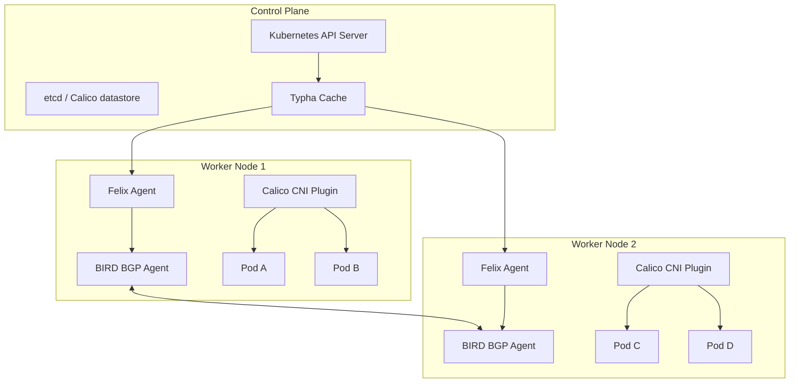

# How to Install Calico CNI on Kubernetes

Author: [nawazdhandala](https://www.github.com/nawazdhandala)

Tags: Kubernetes, Calico, CNI, Networking, Ubuntu, Network Policies, BGP, eBPF, Security, DevOps

Description: A comprehensive guide to installing, configuring, and managing Calico CNI on Ubuntu Kubernetes clusters, covering network policies, BGP peering, eBPF dataplane, and troubleshooting.

---

Calico is the most widely deployed container networking solution in production Kubernetes clusters. It provides networking and network security for containers, virtual machines, and native host-based workloads. This guide walks you through everything from basic installation to advanced configurations on Ubuntu-based Kubernetes clusters.

## What is Calico?

Calico is an open-source networking and network security solution for containers, virtual machines, and native host workloads. It was created by Tigera and is now a CNCF project.

### Key Features

- **Pure Layer 3 Networking**: Uses BGP to distribute routes, avoiding overlay network overhead
- **Network Policy Enforcement**: Full implementation of Kubernetes Network Policies plus extended Calico policies
- **Flexible Dataplane Options**: Standard Linux networking, eBPF, or Windows HNS
- **BGP Peering**: Native BGP support for integration with physical network infrastructure
- **IPAM**: Flexible IP address management with support for multiple IP pools
- **Encryption**: WireGuard-based encryption for pod-to-pod traffic
- **Scalability**: Proven at scale with thousands of nodes

### Calico Architecture



## Prerequisites

Before installing Calico, ensure your Ubuntu Kubernetes cluster meets these requirements.

### System Requirements

Verify your system meets the minimum requirements for Calico.

```bash
# Check Ubuntu version (20.04 LTS or later recommended)
lsb_release -a

# Verify kernel version (4.9.17 or later required)
uname -r

# Check available memory (minimum 2GB per node)
free -h

# Ensure required kernel modules are available
lsmod | grep -E 'ip_tables|iptable_nat|iptable_mangle|iptable_filter'
```

### Kubernetes Cluster Requirements

Ensure your Kubernetes cluster is properly configured.

```bash
# Verify Kubernetes version (1.24 or later recommended)
kubectl version --short

# Ensure no other CNI is installed
ls /etc/cni/net.d/

# Check that the cluster was initialized without a CNI
kubectl get pods -n kube-system | grep -E 'flannel|weave|cilium'

# Verify pod CIDR is configured (needed for Calico IPAM)
kubectl cluster-info dump | grep -m 1 cluster-cidr
```

### Network Requirements

Configure network prerequisites on all nodes.

```bash
# Enable IP forwarding
sudo sysctl -w net.ipv4.ip_forward=1
sudo sysctl -w net.ipv6.conf.all.forwarding=1

# Make persistent
cat <<EOF | sudo tee /etc/sysctl.d/99-kubernetes-cni.conf
net.ipv4.ip_forward = 1
net.ipv6.conf.all.forwarding = 1
net.bridge.bridge-nf-call-iptables = 1
net.bridge.bridge-nf-call-ip6tables = 1
EOF

# Apply sysctl settings
sudo sysctl --system

# Ensure firewall allows required ports
# BGP: TCP 179
# VXLAN: UDP 4789
# Typha: TCP 5473
# WireGuard: UDP 51820
sudo ufw allow 179/tcp
sudo ufw allow 4789/udp
sudo ufw allow 5473/tcp
sudo ufw allow 51820/udp
```

## Installation Method 1: Tigera Operator (Recommended)

The Tigera Operator is the recommended method for installing Calico. It provides lifecycle management and simplifies upgrades.

### Install the Tigera Operator

Download and apply the Tigera Operator manifest.

```bash
# Download the Tigera Operator manifest
kubectl create -f https://raw.githubusercontent.com/projectcalico/calico/v3.27.0/manifests/tigera-operator.yaml

# Verify the operator is running
kubectl get pods -n tigera-operator
```

### Create the Installation Custom Resource

Define your Calico installation configuration.

```yaml
# calico-installation.yaml
# This custom resource tells the Tigera Operator how to install Calico
apiVersion: operator.tigera.io/v1
kind: Installation
metadata:
  name: default
spec:
  # Configure the Calico dataplane
  calicoNetwork:
    # Use VXLAN encapsulation for cross-subnet traffic
    # Options: VXLAN, VXLANCrossSubnet, IPIP, IPIPCrossSubnet, None
    bgp: Disabled

    # Define IP pools for pod networking
    ipPools:
      - name: default-ipv4-pool
        # Must match your cluster's pod CIDR
        cidr: 10.244.0.0/16
        # Block size determines IPs per node (default /26 = 64 IPs)
        blockSize: 26
        # Encapsulation mode
        encapsulation: VXLANCrossSubnet
        # NAT outgoing traffic
        natOutgoing: Enabled
        # Enable this pool
        nodeSelector: all()

    # Node addressing configuration
    nodeAddressAutodetectionV4:
      # Auto-detect node IP from first valid interface
      firstFound: true
      # Or specify interface regex
      # interface: "eth.*"
      # Or skip certain interfaces
      # skipInterface: "docker.*"

  # Calico component configuration
  controlPlaneReplicas: 2

  # Container registry (use for air-gapped installations)
  # registry: my-registry.example.com/

  # Image pull secrets for private registries
  # imagePullSecrets:
  #   - name: my-pull-secret
```

Apply the installation configuration.

```bash
# Apply the custom resource
kubectl apply -f calico-installation.yaml

# Watch the installation progress
watch kubectl get pods -n calico-system

# Verify all components are running
kubectl get tigerastatus
```

### Install the API Server (Optional)

The Calico API server enables kubectl to manage Calico resources directly.

```yaml
# calico-apiserver.yaml
# Enables kubectl access to Calico custom resources
apiVersion: operator.tigera.io/v1
kind: APIServer
metadata:
  name: default
spec: {}
```

Apply and verify the API server.

```bash
# Install the API server
kubectl apply -f calico-apiserver.yaml

# Wait for it to become available
kubectl wait --for=condition=Available apiserver default --timeout=300s

# Verify you can access Calico APIs
kubectl get ippools
kubectl get felixconfigurations
```

## Installation Method 2: Manifest-Based Installation

For more control or simpler setups, use the manifest-based installation.

### Download and Customize the Manifest

Get the Calico manifest and modify it for your environment.

```bash
# Download the Calico manifest
curl -O https://raw.githubusercontent.com/projectcalico/calico/v3.27.0/manifests/calico.yaml

# Key customizations to make:
# 1. Set CALICO_IPV4POOL_CIDR to match your pod CIDR
# 2. Configure CALICO_IPV4POOL_IPIP or CALICO_IPV4POOL_VXLAN
# 3. Set IP_AUTODETECTION_METHOD for multi-homed nodes
```

### Customize Environment Variables

Edit the manifest to configure key settings.

```yaml
# Key environment variables in the calico-node DaemonSet
# Find the calico-node container and modify these:

# Pod network CIDR - must match kubeadm init --pod-network-cidr
- name: CALICO_IPV4POOL_CIDR
  value: "10.244.0.0/16"

# Encapsulation mode: Always, CrossSubnet, or Never
- name: CALICO_IPV4POOL_IPIP
  value: "CrossSubnet"

# Or use VXLAN instead of IPIP
- name: CALICO_IPV4POOL_VXLAN
  value: "CrossSubnet"

# Auto-detect the node IP address
# Options: first-found, can-reach=IP, interface=REGEX, skip-interface=REGEX
- name: IP_AUTODETECTION_METHOD
  value: "interface=eth.*"

# For IPv6 support
- name: CALICO_IPV6POOL_CIDR
  value: "fd00::/48"
- name: IP6_AUTODETECTION_METHOD
  value: "interface=eth.*"

# Disable BGP if using overlay networking
- name: CALICO_NETWORKING_BACKEND
  value: "vxlan"
```

### Apply the Manifest

Deploy Calico to your cluster.

```bash
# Apply the customized manifest
kubectl apply -f calico.yaml

# Monitor deployment progress
kubectl get pods -n kube-system -l k8s-app=calico-node -w

# Verify node status
kubectl get nodes -o wide

# Check that nodes are Ready
kubectl wait --for=condition=Ready nodes --all --timeout=300s
```

## Calico Configuration Options

After installation, fine-tune Calico for your environment.

### Felix Configuration

Felix is the primary Calico agent that runs on each node.

```yaml
# felix-configuration.yaml
# Configures the Calico Felix agent behavior
apiVersion: projectcalico.org/v3
kind: FelixConfiguration
metadata:
  name: default
spec:
  # Logging level: Debug, Info, Warning, Error, Fatal
  logSeverityScreen: Info

  # Dataplane mode: Iptables (default), BPF, or NFT
  bpfEnabled: false

  # Report node health to the datastore
  healthEnabled: true
  healthHost: "0.0.0.0"
  healthPort: 9099

  # Prometheus metrics
  prometheusMetricsEnabled: true
  prometheusMetricsPort: 9091

  # Flow logs for visibility (Enterprise feature)
  flowLogsFlushInterval: "15s"
  flowLogsFileEnabled: false

  # MTU configuration
  # Set based on your network (1500 - encapsulation overhead)
  # VXLAN overhead: 50 bytes, IPIP overhead: 20 bytes
  ipipMTU: 1480
  vxlanMTU: 1450
  wireguardMTU: 1440

  # Connection tracking tuning
  conntrackTableSize: 512000

  # iptables refresh interval
  iptablesRefreshInterval: "90s"

  # Failsafe inbound ports (always allowed)
  failsafeInboundHostPorts:
    - protocol: TCP
      port: 22      # SSH
    - protocol: UDP
      port: 68      # DHCP
    - protocol: TCP
      port: 179     # BGP
    - protocol: TCP
      port: 6443    # Kubernetes API
    - protocol: TCP
      port: 2379    # etcd
    - protocol: TCP
      port: 2380    # etcd peer

  # Failsafe outbound ports (always allowed)
  failsafeOutboundHostPorts:
    - protocol: TCP
      port: 443     # HTTPS
    - protocol: UDP
      port: 53      # DNS
    - protocol: TCP
      port: 179     # BGP
    - protocol: TCP
      port: 6443    # Kubernetes API
```

Apply the Felix configuration.

```bash
# Apply the configuration
kubectl apply -f felix-configuration.yaml

# Verify the configuration
kubectl get felixconfiguration default -o yaml
```

### Typha Configuration

Typha is a fan-out proxy that reduces load on the datastore for large clusters.

```yaml
# typha-deployment.yaml
# Typha reduces datastore load by proxying connections from Felix
apiVersion: apps/v1
kind: Deployment
metadata:
  name: calico-typha
  namespace: calico-system
  labels:
    k8s-app: calico-typha
spec:
  # Scale based on cluster size (1 Typha per 100-200 nodes)
  replicas: 3
  selector:
    matchLabels:
      k8s-app: calico-typha
  template:
    metadata:
      labels:
        k8s-app: calico-typha
    spec:
      tolerations:
        - key: CriticalAddonsOnly
          operator: Exists
      containers:
        - name: calico-typha
          image: calico/typha:v3.27.0
          ports:
            - containerPort: 5473
              name: calico-typha
              protocol: TCP
          env:
            - name: TYPHA_LOGSEVERITYSCREEN
              value: "info"
            - name: TYPHA_CONNECTIONREBALANCINGMODE
              value: "kubernetes"
            - name: TYPHA_PROMETHEUSMETRICSENABLED
              value: "true"
            - name: TYPHA_PROMETHEUSMETRICSPORT
              value: "9093"
          resources:
            requests:
              cpu: 100m
              memory: 100Mi
            limits:
              cpu: 1000m
              memory: 500Mi
          livenessProbe:
            httpGet:
              path: /liveness
              port: 9098
              host: localhost
            periodSeconds: 30
            initialDelaySeconds: 30
          readinessProbe:
            httpGet:
              path: /readiness
              port: 9098
              host: localhost
            periodSeconds: 10
```

## Network Policies Basics

Calico fully implements Kubernetes Network Policies and extends them with additional features.

### Default Deny All Traffic

Start with a zero-trust model by denying all traffic by default.

```yaml
# default-deny.yaml
# Deny all ingress and egress traffic in a namespace
apiVersion: networking.k8s.io/v1
kind: NetworkPolicy
metadata:
  name: default-deny-all
  namespace: production
spec:
  # Empty selector matches all pods in the namespace
  podSelector: {}
  policyTypes:
    - Ingress
    - Egress
```

### Allow DNS Traffic

After default deny, pods cannot resolve DNS. Allow it explicitly.

```yaml
# allow-dns.yaml
# Allow all pods to query DNS servers
apiVersion: networking.k8s.io/v1
kind: NetworkPolicy
metadata:
  name: allow-dns
  namespace: production
spec:
  podSelector: {}
  policyTypes:
    - Egress
  egress:
    # Allow DNS queries to kube-dns/CoreDNS
    - to:
        - namespaceSelector: {}
          podSelector:
            matchLabels:
              k8s-app: kube-dns
      ports:
        - protocol: UDP
          port: 53
        - protocol: TCP
          port: 53
```

### Allow Specific Pod Communication

Define rules for pod-to-pod communication.

```yaml
# web-to-api-policy.yaml
# Allow web frontend pods to communicate with API backend
apiVersion: networking.k8s.io/v1
kind: NetworkPolicy
metadata:
  name: allow-web-to-api
  namespace: production
spec:
  # Apply to API pods
  podSelector:
    matchLabels:
      app: api
      tier: backend
  policyTypes:
    - Ingress
  ingress:
    # Allow traffic from web frontend pods
    - from:
        - podSelector:
            matchLabels:
              app: web
              tier: frontend
      ports:
        - protocol: TCP
          port: 8080
```

## Advanced Network Policies

Calico extends Kubernetes Network Policies with additional selectors and features.

### Calico Network Policy with Service Account Selector

Use service accounts for fine-grained access control.

```yaml
# service-account-policy.yaml
# Restrict access based on service accounts
apiVersion: projectcalico.org/v3
kind: NetworkPolicy
metadata:
  name: allow-by-service-account
  namespace: production
spec:
  selector: app == 'database'
  types:
    - Ingress
  ingress:
    # Only allow pods running as specific service account
    - action: Allow
      source:
        serviceAccounts:
          names:
            - api-service-account
            - batch-processor-account
      protocol: TCP
      destination:
        ports:
          - 5432
```

### HTTP Layer 7 Policy

Calico can enforce policies at the HTTP layer (requires Application Layer Policy).

```yaml
# http-policy.yaml
# Layer 7 HTTP policy (requires Dikastes sidecar)
apiVersion: projectcalico.org/v3
kind: NetworkPolicy
metadata:
  name: allow-specific-http-methods
  namespace: production
spec:
  selector: app == 'api'
  types:
    - Ingress
  ingress:
    - action: Allow
      http:
        methods:
          - GET
          - POST
        paths:
          - prefix: "/api/v1/"
      source:
        selector: app == 'frontend'
      destination:
        ports:
          - 8080
```

### Policy with Multiple Selectors

Combine different selector types for complex rules.

```yaml
# complex-policy.yaml
# Combine namespace, pod, and CIDR selectors
apiVersion: projectcalico.org/v3
kind: NetworkPolicy
metadata:
  name: complex-ingress-policy
  namespace: production
spec:
  selector: app == 'api'
  types:
    - Ingress
  ingress:
    # Rule 1: Allow from frontend in same namespace
    - action: Allow
      source:
        selector: app == 'frontend'
      protocol: TCP
      destination:
        ports:
          - 8080

    # Rule 2: Allow from monitoring namespace
    - action: Allow
      source:
        namespaceSelector: kubernetes.io/metadata.name == 'monitoring'
        selector: app == 'prometheus'
      protocol: TCP
      destination:
        ports:
          - 9090

    # Rule 3: Allow from specific external CIDR
    - action: Allow
      source:
        nets:
          - 10.0.0.0/8
          - 192.168.1.0/24
        notNets:
          - 10.255.0.0/16  # Exclude this range
      protocol: TCP
      destination:
        ports:
          - 443

    # Rule 4: Deny everything else (explicit)
    - action: Deny
```

## Global Network Policies

Global Network Policies apply cluster-wide and are not namespace-scoped.

### Cluster-Wide Default Deny

Apply default deny across all namespaces.

```yaml
# global-default-deny.yaml
# Deny all traffic cluster-wide except explicitly allowed
apiVersion: projectcalico.org/v3
kind: GlobalNetworkPolicy
metadata:
  name: default-deny
spec:
  # Apply to all pods except system namespaces
  namespaceSelector: >-
    kubernetes.io/metadata.name notin {'kube-system', 'calico-system', 'tigera-operator'}
  types:
    - Ingress
    - Egress
```

### Allow Cluster DNS Globally

Ensure all pods can resolve DNS.

```yaml
# global-allow-dns.yaml
# Allow DNS resolution from all namespaces
apiVersion: projectcalico.org/v3
kind: GlobalNetworkPolicy
metadata:
  name: allow-dns
spec:
  # Lower order number = higher priority
  order: 100
  selector: all()
  types:
    - Egress
  egress:
    - action: Allow
      protocol: UDP
      destination:
        selector: k8s-app == 'kube-dns'
        ports:
          - 53
    - action: Allow
      protocol: TCP
      destination:
        selector: k8s-app == 'kube-dns'
        ports:
          - 53
```

### Protect System Namespaces

Secure critical system namespaces.

```yaml
# protect-kube-system.yaml
# Restrict access to kube-system namespace
apiVersion: projectcalico.org/v3
kind: GlobalNetworkPolicy
metadata:
  name: protect-kube-system
spec:
  order: 50
  namespaceSelector: kubernetes.io/metadata.name == 'kube-system'
  types:
    - Ingress
  ingress:
    # Allow from all namespaces to DNS
    - action: Allow
      source:
        namespaceSelector: all()
      destination:
        selector: k8s-app == 'kube-dns'
        ports:
          - 53

    # Allow from all namespaces to metrics-server
    - action: Allow
      source:
        namespaceSelector: all()
      destination:
        selector: k8s-app == 'metrics-server'
        ports:
          - 443

    # Allow within kube-system
    - action: Allow
      source:
        namespaceSelector: kubernetes.io/metadata.name == 'kube-system'

    # Deny all other ingress
    - action: Deny
```

### Host Endpoint Protection

Protect the host network interfaces on your nodes.

```yaml
# host-endpoint-policy.yaml
# Protect host endpoints on all nodes
apiVersion: projectcalico.org/v3
kind: GlobalNetworkPolicy
metadata:
  name: allow-host-traffic
spec:
  order: 0
  selector: running-on == 'host'
  types:
    - Ingress
    - Egress
  ingress:
    # Allow SSH from management network
    - action: Allow
      protocol: TCP
      source:
        nets:
          - 10.0.0.0/24  # Management network
      destination:
        ports:
          - 22

    # Allow BGP peering
    - action: Allow
      protocol: TCP
      destination:
        ports:
          - 179

    # Allow Kubernetes API
    - action: Allow
      protocol: TCP
      destination:
        ports:
          - 6443

    # Allow kubelet
    - action: Allow
      protocol: TCP
      destination:
        ports:
          - 10250

  egress:
    # Allow all outbound from hosts
    - action: Allow
```

## BGP Peering Configuration

Calico uses BGP to distribute routes between nodes and can peer with external routers.

### Configure Node-to-Node BGP Mesh

By default, Calico creates a full mesh BGP topology between all nodes.

```yaml
# bgp-configuration.yaml
# Configure BGP settings for the cluster
apiVersion: projectcalico.org/v3
kind: BGPConfiguration
metadata:
  name: default
spec:
  # Enable or disable node-to-node mesh
  # Disable for large clusters (>100 nodes) and use route reflectors
  nodeToNodeMeshEnabled: true

  # Default AS number for the cluster
  asNumber: 64512

  # Log level for BGP daemon
  logSeverityScreen: Info

  # Advertise all service ClusterIPs
  serviceClusterIPs:
    - cidr: 10.96.0.0/12

  # Advertise external IPs
  serviceExternalIPs:
    - cidr: 203.0.113.0/24

  # Advertise LoadBalancer IPs
  serviceLoadBalancerIPs:
    - cidr: 198.51.100.0/24

  # Communities to apply to advertised routes
  communities:
    - name: internal-pods
      value: "64512:100"
    - name: external-services
      value: "64512:200"

  # Prefix advertisements
  prefixAdvertisements:
    - cidr: 10.244.0.0/16
      communities:
        - internal-pods
```

### Configure BGP Peer with External Router

Peer Calico with your physical network infrastructure.

```yaml
# bgp-peer-external.yaml
# Peer with external ToR (Top of Rack) switches
apiVersion: projectcalico.org/v3
kind: BGPPeer
metadata:
  name: tor-switch-1
spec:
  # Peer IP address
  peerIP: 10.0.0.1

  # Peer AS number
  asNumber: 64513

  # Apply to specific nodes using node selector
  nodeSelector: rack == 'rack-1'

  # Alternatively, apply to all nodes
  # node: all

  # Keep alive interval
  keepAliveTime: 30s

  # Source address for BGP session
  sourceAddress: None

  # Password for BGP session (MD5 authentication)
  # password:
  #   secretKeyRef:
  #     name: bgp-secrets
  #     key: tor-switch-1-password
```

### Configure Route Reflectors

For large clusters, use route reflectors instead of full mesh.

```yaml
# route-reflector-config.yaml
# First, label nodes that will be route reflectors
# kubectl label node rr-node-1 route-reflector=true
---
# Disable node-to-node mesh
apiVersion: projectcalico.org/v3
kind: BGPConfiguration
metadata:
  name: default
spec:
  nodeToNodeMeshEnabled: false
  asNumber: 64512
---
# Configure route reflector nodes
apiVersion: projectcalico.org/v3
kind: BGPPeer
metadata:
  name: peer-with-route-reflector
spec:
  # Peer with nodes labeled as route reflectors
  peerSelector: route-reflector == 'true'
  # All other nodes peer with route reflectors
  nodeSelector: '!route-reflector == "true"'
---
# Route reflectors peer with each other
apiVersion: projectcalico.org/v3
kind: BGPPeer
metadata:
  name: rr-mesh
spec:
  peerSelector: route-reflector == 'true'
  nodeSelector: route-reflector == 'true'
```

### View BGP Status

Check the BGP session status on your nodes.

```bash
# Check BGP peer status using calicoctl
calicoctl node status

# Example output:
# Calico process is running.
# IPv4 BGP status
# +--------------+-------------------+-------+----------+-------------+
# | PEER ADDRESS |     PEER TYPE     | STATE |  SINCE   |    INFO     |
# +--------------+-------------------+-------+----------+-------------+
# | 10.0.0.2     | node-to-node mesh | up    | 02:30:45 | Established |
# | 10.0.0.3     | node-to-node mesh | up    | 02:30:46 | Established |
# | 10.0.0.1     | global            | up    | 02:31:00 | Established |
# +--------------+-------------------+-------+----------+-------------+

# Check BGP routes
calicoctl get bgpPeer -o wide

# View BIRD BGP daemon status directly
sudo calicoctl node status
```

## IP Pool Management

IP pools define the IP address ranges used for pod networking.

### Create Additional IP Pools

Define multiple IP pools for different use cases.

```yaml
# ip-pools.yaml
# Multiple IP pools for different workload types
---
# Default pool for most workloads
apiVersion: projectcalico.org/v3
kind: IPPool
metadata:
  name: default-pool
spec:
  cidr: 10.244.0.0/16
  # IP allocation method: block (default) or host-local
  ipipMode: CrossSubnet
  vxlanMode: Never
  natOutgoing: true
  # Block size: /26 = 64 IPs per node
  blockSize: 26
  # Node selector to restrict pool to certain nodes
  nodeSelector: all()
  # Allow workloads to use this pool
  disabled: false
---
# High-performance pool without encapsulation
apiVersion: projectcalico.org/v3
kind: IPPool
metadata:
  name: high-perf-pool
spec:
  cidr: 10.245.0.0/16
  ipipMode: Never
  vxlanMode: Never
  natOutgoing: true
  blockSize: 24
  nodeSelector: performance-tier == 'high'
---
# External-routable pool for services needing direct access
apiVersion: projectcalico.org/v3
kind: IPPool
metadata:
  name: external-pool
spec:
  cidr: 203.0.113.0/24
  ipipMode: Never
  vxlanMode: Never
  # Don't NAT - IPs are externally routable
  natOutgoing: false
  blockSize: 28
  nodeSelector: external-facing == 'true'
```

### Assign Pods to Specific IP Pools

Use annotations to assign pods to specific IP pools.

```yaml
# pod-with-ip-pool.yaml
# Assign a pod to a specific IP pool using annotations
apiVersion: v1
kind: Pod
metadata:
  name: high-perf-app
  annotations:
    # Request IP from specific pool
    cni.projectcalico.org/ipv4pools: '["high-perf-pool"]'
    # Or request a specific IP (must be available)
    # cni.projectcalico.org/ipAddrs: '["10.245.0.100"]'
spec:
  containers:
    - name: app
      image: nginx
---
# Namespace-level annotation for all pods in namespace
apiVersion: v1
kind: Namespace
metadata:
  name: high-performance
  annotations:
    cni.projectcalico.org/ipv4pools: '["high-perf-pool"]'
```

### Manage IP Pool Allocations

View and manage IP address allocations.

```bash
# List all IP pools
calicoctl get ippools -o wide

# Get detailed IP pool information
calicoctl get ippool default-pool -o yaml

# View IP allocations per node
calicoctl ipam show --show-blocks

# View IP allocations for a specific IP
calicoctl ipam show --ip=10.244.1.5

# Release orphaned IPs (use with caution)
calicoctl ipam release --ip=10.244.1.5

# Check IP utilization
calicoctl ipam show --show-blocks | grep -E 'Block|Affinity'
```

## Calico with eBPF Dataplane

eBPF dataplane provides better performance than iptables for large clusters.

### Prerequisites for eBPF

Ensure your system supports eBPF.

```bash
# Check kernel version (5.3+ required, 5.8+ recommended)
uname -r

# Verify BPF filesystem is mounted
mount | grep bpf

# If not mounted, mount it
sudo mount -t bpf bpf /sys/fs/bpf

# Make persistent in /etc/fstab
echo "bpf /sys/fs/bpf bpf defaults 0 0" | sudo tee -a /etc/fstab

# Check BPF JIT is enabled
cat /proc/sys/net/core/bpf_jit_enable
# Should be 1, if not:
echo 1 | sudo tee /proc/sys/net/core/bpf_jit_enable
```

### Enable eBPF Dataplane

Configure Calico to use eBPF instead of iptables.

```yaml
# ebpf-installation.yaml
# Installation resource with eBPF enabled
apiVersion: operator.tigera.io/v1
kind: Installation
metadata:
  name: default
spec:
  calicoNetwork:
    linuxDataplane: BPF
    bgp: Disabled
    ipPools:
      - name: default-ipv4-pool
        cidr: 10.244.0.0/16
        encapsulation: VXLAN
        natOutgoing: Enabled
        nodeSelector: all()
---
# Or enable via FelixConfiguration for existing installations
apiVersion: projectcalico.org/v3
kind: FelixConfiguration
metadata:
  name: default
spec:
  bpfEnabled: true
  # Use DSR (Direct Server Return) for better performance
  bpfExternalServiceMode: DSR
  # Log level for BPF dataplane
  bpfLogLevel: Info
  # Disable kube-proxy when using eBPF (handles services natively)
  bpfKubeProxyIptablesCleanupEnabled: true
```

### Disable kube-proxy

eBPF Calico replaces kube-proxy functionality.

```bash
# Option 1: Delete kube-proxy DaemonSet
kubectl delete daemonset kube-proxy -n kube-system

# Option 2: Scale down kube-proxy (reversible)
kubectl patch daemonset kube-proxy -n kube-system -p '{"spec":{"template":{"spec":{"nodeSelector":{"non-existing":"true"}}}}}'

# Clean up iptables rules left by kube-proxy
# Calico does this automatically if bpfKubeProxyIptablesCleanupEnabled is true
```

### eBPF Performance Tuning

Optimize eBPF performance for your workload.

```yaml
# ebpf-tuning.yaml
# Felix configuration optimized for eBPF
apiVersion: projectcalico.org/v3
kind: FelixConfiguration
metadata:
  name: default
spec:
  bpfEnabled: true

  # Connect-time load balancing (better than DNAT)
  bpfConnectTimeLoadBalancingEnabled: true

  # External service mode: Tunnel or DSR
  # DSR provides better performance but requires network support
  bpfExternalServiceMode: DSR

  # Host-networked NAT (for NodePort services)
  bpfHostNetworkedNATWithoutCTLB: Enabled

  # Map sizes (increase for large clusters)
  bpfMapSizeNATFrontend: 65536
  bpfMapSizeNATBackend: 262144
  bpfMapSizeNATAffinity: 65536
  bpfMapSizeRoute: 262144
  bpfMapSizeConntrack: 512000
  bpfMapSizeIPSets: 1048576

  # PSP (Pod Security Policy) compatibility
  bpfPSNATPorts:
    - 32768
    - 60999
```

### Verify eBPF is Active

Confirm eBPF dataplane is running.

```bash
# Check Felix is using eBPF
kubectl exec -n calico-system $(kubectl get pod -n calico-system -l k8s-app=calico-node -o name | head -1) -- calico-node -felix-live

# View BPF programs loaded
kubectl exec -n calico-system $(kubectl get pod -n calico-system -l k8s-app=calico-node -o name | head -1) -- bpftool prog list

# Check BPF maps
kubectl exec -n calico-system $(kubectl get pod -n calico-system -l k8s-app=calico-node -o name | head -1) -- bpftool map list

# View connection tracking table
kubectl exec -n calico-system $(kubectl get pod -n calico-system -l k8s-app=calico-node -o name | head -1) -- calico-bpf conntrack dump
```

## calicoctl CLI Usage

calicoctl is the command-line tool for managing Calico resources.

### Install calicoctl

Download and install the calicoctl binary.

```bash
# Download calicoctl for Linux amd64
curl -L https://github.com/projectcalico/calico/releases/download/v3.27.0/calicoctl-linux-amd64 -o calicoctl

# Make executable and move to PATH
chmod +x calicoctl
sudo mv calicoctl /usr/local/bin/

# Verify installation
calicoctl version

# Configure calicoctl to use Kubernetes datastore
export DATASTORE_TYPE=kubernetes
export KUBECONFIG=~/.kube/config

# Or create a config file
mkdir -p ~/.calico
cat <<EOF > ~/.calico/calicoctl.cfg
apiVersion: projectcalico.org/v3
kind: CalicoAPIConfig
metadata:
spec:
  datastoreType: kubernetes
  kubeconfig: /home/$USER/.kube/config
EOF
```

### Common calicoctl Commands

Use calicoctl for day-to-day Calico management.

```bash
# Get cluster information
calicoctl get nodes
calicoctl get ippools
calicoctl get bgpconfigurations
calicoctl get felixconfigurations

# View network policies (including Calico-specific)
calicoctl get networkpolicies --all-namespaces
calicoctl get globalnetworkpolicies

# Get detailed node information
calicoctl get node <node-name> -o yaml

# Check node status (BGP, routes)
calicoctl node status

# View workload endpoints
calicoctl get workloadendpoints --all-namespaces
calicoctl get workloadendpoint -n production

# Check IPAM allocations
calicoctl ipam show
calicoctl ipam show --show-blocks
calicoctl ipam show --show-borrowed
calicoctl ipam show --ip=10.244.1.5

# Create resources from file
calicoctl create -f policy.yaml

# Apply resources (create or update)
calicoctl apply -f policy.yaml

# Delete resources
calicoctl delete networkpolicy my-policy -n production
calicoctl delete -f policy.yaml

# Replace resources
calicoctl replace -f policy.yaml

# Patch resources
calicoctl patch felixconfiguration default -p '{"spec":{"logSeverityScreen":"Debug"}}'
```

### Running calicoctl as a Pod

Deploy calicoctl as a pod for cluster access.

```bash
# Run calicoctl as a pod
kubectl apply -f https://raw.githubusercontent.com/projectcalico/calico/v3.27.0/manifests/calicoctl.yaml

# Execute calicoctl commands via the pod
kubectl exec -ti -n kube-system calicoctl -- /calicoctl get nodes
kubectl exec -ti -n kube-system calicoctl -- /calicoctl node status

# Create an alias for convenience
alias calicoctl="kubectl exec -ti -n kube-system calicoctl -- /calicoctl"
```

## Monitoring Calico with Prometheus

Calico exposes Prometheus metrics for monitoring.

### Enable Prometheus Metrics

Configure Calico components to expose metrics.

```yaml
# prometheus-metrics.yaml
# Enable metrics on all Calico components
---
apiVersion: projectcalico.org/v3
kind: FelixConfiguration
metadata:
  name: default
spec:
  prometheusMetricsEnabled: true
  prometheusMetricsPort: 9091
  prometheusGoMetricsEnabled: true
  prometheusProcessMetricsEnabled: true
---
# Typha metrics are enabled via environment variables
# TYPHA_PROMETHEUSMETRICSENABLED=true
# TYPHA_PROMETHEUSMETRICSPORT=9093
```

### Prometheus ServiceMonitor

Create ServiceMonitor for Prometheus Operator.

```yaml
# calico-servicemonitor.yaml
# ServiceMonitor for Prometheus Operator to scrape Calico metrics
apiVersion: monitoring.coreos.com/v1
kind: ServiceMonitor
metadata:
  name: calico-felix
  namespace: monitoring
  labels:
    release: prometheus
spec:
  selector:
    matchLabels:
      k8s-app: calico-node
  namespaceSelector:
    matchNames:
      - calico-system
  endpoints:
    - port: felix-metrics
      interval: 15s
      path: /metrics
---
apiVersion: v1
kind: Service
metadata:
  name: calico-felix-metrics
  namespace: calico-system
  labels:
    k8s-app: calico-node
spec:
  selector:
    k8s-app: calico-node
  ports:
    - name: felix-metrics
      port: 9091
      targetPort: 9091
  clusterIP: None
```

### Key Metrics to Monitor

Important Calico metrics for dashboards and alerts.

```yaml
# Prometheus alerting rules for Calico
apiVersion: monitoring.coreos.com/v1
kind: PrometheusRule
metadata:
  name: calico-alerts
  namespace: monitoring
spec:
  groups:
    - name: calico
      rules:
        # Alert if Felix is not ready
        - alert: CalicoFelixNotReady
          expr: felix_cluster_num_ready_nodes < felix_cluster_num_nodes
          for: 5m
          labels:
            severity: critical
          annotations:
            summary: "Calico Felix not ready on all nodes"
            description: "{{ $value }} nodes have Felix not ready"

        # Alert on high policy sync time
        - alert: CalicoPolicySyncSlow
          expr: felix_calc_graph_update_time_seconds > 5
          for: 10m
          labels:
            severity: warning
          annotations:
            summary: "Calico policy calculation is slow"
            description: "Policy sync taking {{ $value }}s"

        # Alert on dataplane failures
        - alert: CalicoDataplaneFailures
          expr: rate(felix_int_dataplane_failures_total[5m]) > 0
          for: 5m
          labels:
            severity: warning
          annotations:
            summary: "Calico dataplane failures detected"
            description: "Dataplane failure rate: {{ $value }}/s"

        # Alert on BGP session issues
        - alert: CalicoBGPSessionDown
          expr: bgp_peers < count(kube_node_info)
          for: 5m
          labels:
            severity: critical
          annotations:
            summary: "Calico BGP sessions down"
            description: "Expected {{ $value }} BGP peers but some are down"
```

### Grafana Dashboard

Key queries for a Calico Grafana dashboard.

```
# Felix dataplane statistics
felix_int_dataplane_apply_time_seconds
felix_int_dataplane_failures_total
felix_iptables_chains
felix_iptables_rules

# Policy calculation metrics
felix_calc_graph_update_time_seconds
felix_active_local_endpoints
felix_active_local_policies

# BGP metrics (BIRD)
bgp_peers
bgp_imported_routes
bgp_exported_routes

# IPAM metrics
ipam_allocations_per_node
ipam_blocks_per_node

# eBPF metrics (when using eBPF dataplane)
felix_bpf_dataplane_map_memory_bytes
felix_bpf_num_maps
felix_bpf_dirty_dataplane_seconds
```

## Troubleshooting Network Issues

Common issues and their solutions when running Calico.

### Pod Cannot Communicate

Debug pod-to-pod communication issues.

```bash
# Check pod networking
kubectl get pods -o wide
kubectl describe pod <pod-name>

# Verify Calico is running on the node
kubectl get pods -n calico-system -o wide

# Check Felix logs for errors
kubectl logs -n calico-system -l k8s-app=calico-node -c calico-node --tail=100

# Test connectivity from a debug pod
kubectl run debug --rm -it --image=nicolaka/netshoot -- bash
# Inside the pod:
ping <destination-pod-ip>
traceroute <destination-pod-ip>
curl -v <destination-service>

# Check iptables rules (non-eBPF mode)
kubectl exec -n calico-system $(kubectl get pod -n calico-system -l k8s-app=calico-node -o name | head -1) -- iptables -L -n -v

# Check workload endpoint
calicoctl get workloadendpoint -n <namespace> --output=wide
```

### Network Policy Not Working

Debug Network Policy enforcement.

```bash
# List all network policies
kubectl get networkpolicies --all-namespaces
calicoctl get networkpolicies --all-namespaces
calicoctl get globalnetworkpolicies

# Check policy is applied correctly
kubectl describe networkpolicy <policy-name> -n <namespace>

# Verify pod labels match policy selector
kubectl get pods -n <namespace> --show-labels

# Check Felix policy calculation
kubectl logs -n calico-system -l k8s-app=calico-node -c calico-node | grep -i policy

# Enable debug logging temporarily
calicoctl patch felixconfiguration default -p '{"spec":{"logSeverityScreen":"Debug"}}'

# Test policy with a temporary allow-all
kubectl apply -f - <<EOF
apiVersion: networking.k8s.io/v1
kind: NetworkPolicy
metadata:
  name: temp-allow-all
  namespace: <namespace>
spec:
  podSelector: {}
  ingress:
    - {}
  egress:
    - {}
  policyTypes:
    - Ingress
    - Egress
EOF

# Remove after testing
kubectl delete networkpolicy temp-allow-all -n <namespace>
```

### BGP Peering Issues

Troubleshoot BGP connectivity problems.

```bash
# Check BGP peer status
calicoctl node status

# View BGP configuration
calicoctl get bgpconfigurations -o yaml
calicoctl get bgppeers -o yaml

# Check BIRD logs
kubectl logs -n calico-system $(kubectl get pod -n calico-system -l k8s-app=calico-node -o name | head -1) -c calico-node | grep -i bird

# Check routes on the node
kubectl exec -n calico-system $(kubectl get pod -n calico-system -l k8s-app=calico-node -o name | head -1) -- ip route show

# View BGP routing table via BIRD
kubectl exec -n calico-system $(kubectl get pod -n calico-system -l k8s-app=calico-node -o name | head -1) -c calico-node -- birdcl show route

# Verify AS number configuration
calicoctl get nodes -o yaml | grep -A5 spec
```

### IP Address Exhaustion

Handle IP pool exhaustion issues.

```bash
# Check IP pool utilization
calicoctl ipam show
calicoctl ipam show --show-blocks

# View IP allocations per node
calicoctl ipam show --show-blocks | grep -E 'Block|Affinity|borrowed'

# Find leaked IPs (IPs allocated but pods deleted)
calicoctl ipam show --show-blocks --ip=<ip-address>

# Release orphaned IPs
calicoctl ipam release --ip=<orphaned-ip>

# Increase IP pool or add new pool
calicoctl apply -f - <<EOF
apiVersion: projectcalico.org/v3
kind: IPPool
metadata:
  name: additional-pool
spec:
  cidr: 10.246.0.0/16
  ipipMode: CrossSubnet
  natOutgoing: true
EOF

# Change block size (requires recreating pool)
# Note: This affects existing allocations
```

### eBPF Dataplane Issues

Troubleshoot eBPF-specific problems.

```bash
# Verify eBPF is enabled
kubectl exec -n calico-system $(kubectl get pod -n calico-system -l k8s-app=calico-node -o name | head -1) -- cat /var/run/calico/felix-bpf-enabled

# Check BPF programs are loaded
kubectl exec -n calico-system $(kubectl get pod -n calico-system -l k8s-app=calico-node -o name | head -1) -- bpftool prog list

# View BPF maps
kubectl exec -n calico-system $(kubectl get pod -n calico-system -l k8s-app=calico-node -o name | head -1) -- bpftool map list

# Dump conntrack table
kubectl exec -n calico-system $(kubectl get pod -n calico-system -l k8s-app=calico-node -o name | head -1) -- calico-bpf conntrack dump

# Check for BPF errors in logs
kubectl logs -n calico-system -l k8s-app=calico-node -c calico-node | grep -i bpf

# Verify kube-proxy is disabled
kubectl get daemonset -n kube-system kube-proxy

# Check iptables are clean (eBPF should handle everything)
kubectl exec -n calico-system $(kubectl get pod -n calico-system -l k8s-app=calico-node -o name | head -1) -- iptables -L -n | wc -l
```

### Collect Diagnostic Information

Gather information for support or debugging.

```bash
# Collect comprehensive diagnostics
kubectl get nodes -o yaml > nodes.yaml
kubectl get pods -A -o yaml > pods.yaml
calicoctl get nodes -o yaml > calico-nodes.yaml
calicoctl get ippools -o yaml > ippools.yaml
calicoctl get bgpconfigurations -o yaml > bgpconfig.yaml
calicoctl get felixconfigurations -o yaml > felixconfig.yaml
calicoctl get networkpolicies -A -o yaml > netpols.yaml
calicoctl get globalnetworkpolicies -o yaml > globalnetpols.yaml

# Get logs from all Calico pods
for pod in $(kubectl get pods -n calico-system -l k8s-app=calico-node -o name); do
    kubectl logs -n calico-system $pod -c calico-node > ${pod##*/}-logs.txt
done

# Get events
kubectl get events -n calico-system > calico-events.txt
```

---

Calico provides a robust, scalable networking solution for Kubernetes clusters. Its flexibility in supporting different dataplanes (iptables, eBPF), network modes (overlay, native), and integration with physical networks via BGP makes it suitable for everything from small development clusters to large enterprise deployments.

For production environments, monitoring your Calico deployment is essential. OneUptime provides comprehensive monitoring for Kubernetes clusters, including network health, pod connectivity, and service availability. With OneUptime, you can set up alerts for Calico component failures, BGP session issues, and network policy violations, ensuring your cluster networking remains healthy and secure. Visit [https://oneuptime.com](https://oneuptime.com) to learn more about monitoring your Kubernetes infrastructure.
