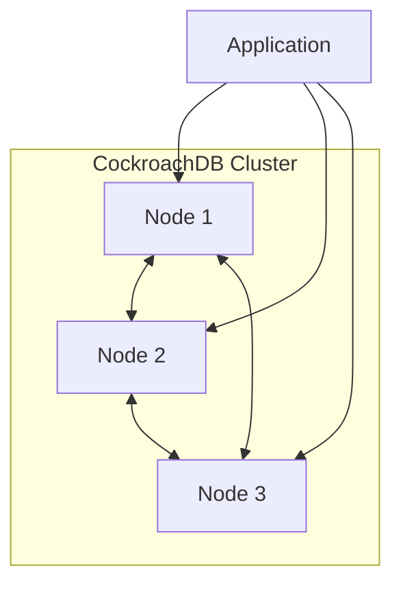

# How to Install and Configure CockroachDB on Ubuntu

Author: [nawazdhandala](https://www.github.com/nawazdhandala)

Tags: Ubuntu, CockroachDB, Distributed Database, PostgreSQL, SQL, Tutorial

Description: Complete guide to installing CockroachDB distributed SQL database on Ubuntu for scalable, resilient applications.

---

CockroachDB is a distributed SQL database that provides horizontal scalability, strong consistency, and resilience. It's PostgreSQL-compatible, making it easy to migrate existing applications while gaining distributed database benefits. This guide covers installation and configuration on Ubuntu.

## Features

- Distributed SQL with strong consistency
- PostgreSQL wire protocol compatibility
- Automatic sharding and rebalancing
- Multi-region deployment
- Serializable transactions
- Survivable zone/region failures

## Architecture Overview



## Prerequisites

- Ubuntu 20.04 or later
- At least 2GB RAM per node
- SSD storage recommended
- Root or sudo access

## Installation

### Download Binary

```bash
# Create directory
sudo mkdir -p /opt/cockroach
cd /opt/cockroach

# Download CockroachDB
curl https://binaries.cockroachdb.com/cockroach-v23.2.0.linux-amd64.tgz | tar -xz

# Move binary
sudo cp cockroach-v23.2.0.linux-amd64/cockroach /usr/local/bin/

# Copy libraries
sudo mkdir -p /usr/local/lib/cockroach
sudo cp -r cockroach-v23.2.0.linux-amd64/lib/* /usr/local/lib/cockroach/

# Verify installation
cockroach version
```

### Create User and Directories

```bash
# Create cockroach user
sudo useradd -r -s /bin/false cockroach

# Create data directory
sudo mkdir -p /var/lib/cockroach
sudo chown cockroach:cockroach /var/lib/cockroach

# Create log directory
sudo mkdir -p /var/log/cockroach
sudo chown cockroach:cockroach /var/log/cockroach

# Create certs directory
sudo mkdir -p /var/lib/cockroach/certs
sudo chown cockroach:cockroach /var/lib/cockroach/certs
```

## Single Node Setup

### Start Insecure Node (Development)

```bash
# Start single node (insecure - for development only)
cockroach start-single-node \
    --insecure \
    --store=/var/lib/cockroach \
    --listen-addr=localhost:26257 \
    --http-addr=localhost:8080 \
    --background
```

### Create Systemd Service

```bash
sudo nano /etc/systemd/system/cockroachdb.service
```

```ini
[Unit]
Description=CockroachDB
Requires=network.target
After=network.target

[Service]
Type=notify
User=cockroach
Group=cockroach
ExecStart=/usr/local/bin/cockroach start-single-node \
    --insecure \
    --store=/var/lib/cockroach \
    --listen-addr=0.0.0.0:26257 \
    --http-addr=0.0.0.0:8080 \
    --cache=.25 \
    --max-sql-memory=.25
Restart=always
RestartSec=10
StandardOutput=syslog
StandardError=syslog
SyslogIdentifier=cockroach

[Install]
WantedBy=multi-user.target
```

```bash
# Start service
sudo systemctl daemon-reload
sudo systemctl start cockroachdb
sudo systemctl enable cockroachdb

# Check status
sudo systemctl status cockroachdb
```

## Secure Cluster Setup

### Generate Certificates

```bash
# Create CA certificate
cockroach cert create-ca \
    --certs-dir=/var/lib/cockroach/certs \
    --ca-key=/var/lib/cockroach/certs/ca.key

# Create node certificate (for each node)
cockroach cert create-node \
    localhost \
    node1.example.com \
    192.168.1.100 \
    --certs-dir=/var/lib/cockroach/certs \
    --ca-key=/var/lib/cockroach/certs/ca.key

# Create client certificate for root user
cockroach cert create-client \
    root \
    --certs-dir=/var/lib/cockroach/certs \
    --ca-key=/var/lib/cockroach/certs/ca.key

# Set permissions
sudo chown -R cockroach:cockroach /var/lib/cockroach/certs
sudo chmod 700 /var/lib/cockroach/certs
sudo chmod 600 /var/lib/cockroach/certs/*.key
```

### Start Secure Node

```bash
# Update systemd service for secure mode
sudo nano /etc/systemd/system/cockroachdb.service
```

```ini
[Unit]
Description=CockroachDB
Requires=network.target
After=network.target

[Service]
Type=notify
User=cockroach
Group=cockroach
ExecStart=/usr/local/bin/cockroach start \
    --certs-dir=/var/lib/cockroach/certs \
    --store=/var/lib/cockroach \
    --listen-addr=0.0.0.0:26257 \
    --http-addr=0.0.0.0:8080 \
    --join=node1.example.com:26257,node2.example.com:26257,node3.example.com:26257 \
    --cache=.25 \
    --max-sql-memory=.25
Restart=always
RestartSec=10

[Install]
WantedBy=multi-user.target
```

### Initialize Cluster

```bash
# Initialize cluster (run once on any node)
cockroach init \
    --certs-dir=/var/lib/cockroach/certs \
    --host=localhost:26257
```

## Connect to CockroachDB

### Using SQL Shell

```bash
# Connect (insecure)
cockroach sql --insecure --host=localhost:26257

# Connect (secure)
cockroach sql \
    --certs-dir=/var/lib/cockroach/certs \
    --host=localhost:26257

# Connect to specific database
cockroach sql --insecure --host=localhost:26257 -d mydb
```

### Using PostgreSQL Clients

```bash
# psql (PostgreSQL client)
psql "postgresql://root@localhost:26257/defaultdb?sslmode=disable"

# With SSL
psql "postgresql://root@localhost:26257/defaultdb?sslmode=require&sslrootcert=/var/lib/cockroach/certs/ca.crt"
```

### Web UI

Access at: `http://localhost:8080`

## Database Management

### Create Database and User

```sql
-- Create database
CREATE DATABASE myapp;

-- Create user with password
CREATE USER appuser WITH PASSWORD 'StrongPassword123!';

-- Grant permissions
GRANT ALL ON DATABASE myapp TO appuser;

-- Use database
USE myapp;

-- List databases
SHOW DATABASES;
```

### Create Tables

```sql
-- Create table with primary key
CREATE TABLE users (
    id UUID PRIMARY KEY DEFAULT gen_random_uuid(),
    email STRING UNIQUE NOT NULL,
    name STRING,
    created_at TIMESTAMP DEFAULT now()
);

-- Create table with foreign key
CREATE TABLE orders (
    id UUID PRIMARY KEY DEFAULT gen_random_uuid(),
    user_id UUID REFERENCES users(id),
    total DECIMAL(10, 2),
    status STRING DEFAULT 'pending',
    created_at TIMESTAMP DEFAULT now(),
    INDEX idx_user_orders (user_id, created_at DESC)
);

-- Create partitioned table (for multi-region)
CREATE TABLE regional_users (
    id UUID PRIMARY KEY DEFAULT gen_random_uuid(),
    email STRING NOT NULL,
    region STRING NOT NULL,
    created_at TIMESTAMP DEFAULT now()
) LOCALITY REGIONAL BY ROW AS region;
```

### CRUD Operations

```sql
-- Insert data
INSERT INTO users (email, name) VALUES
    ('alice@example.com', 'Alice'),
    ('bob@example.com', 'Bob');

-- Select data
SELECT * FROM users WHERE email = 'alice@example.com';

-- Update data
UPDATE users SET name = 'Alice Smith' WHERE email = 'alice@example.com';

-- Delete data
DELETE FROM users WHERE email = 'bob@example.com';

-- Upsert (insert or update)
UPSERT INTO users (id, email, name)
VALUES ('123e4567-e89b-12d3-a456-426614174000', 'alice@example.com', 'Alice Updated');
```

### Transactions

```sql
-- Begin transaction
BEGIN;

INSERT INTO orders (user_id, total)
SELECT id, 99.99 FROM users WHERE email = 'alice@example.com';

UPDATE users SET name = 'Alice Premium' WHERE email = 'alice@example.com';

COMMIT;

-- Transaction with savepoint
BEGIN;
INSERT INTO users (email, name) VALUES ('charlie@example.com', 'Charlie');
SAVEPOINT sp1;
INSERT INTO orders (user_id, total) VALUES ('invalid-uuid', 50.00);
-- If error, rollback to savepoint
ROLLBACK TO SAVEPOINT sp1;
INSERT INTO orders (user_id, total)
SELECT id, 50.00 FROM users WHERE email = 'charlie@example.com';
COMMIT;
```

## Indexes and Performance

### Create Indexes

```sql
-- Single column index
CREATE INDEX idx_users_email ON users(email);

-- Composite index
CREATE INDEX idx_orders_user_status ON orders(user_id, status);

-- Partial index
CREATE INDEX idx_active_users ON users(email) WHERE status = 'active';

-- Covering index (stores data with index)
CREATE INDEX idx_users_covering ON users(email) STORING (name, created_at);

-- GIN index for array/JSON
CREATE INVERTED INDEX idx_user_tags ON users(tags);

-- Show indexes
SHOW INDEXES FROM users;
```

### Query Optimization

```sql
-- Explain query plan
EXPLAIN SELECT * FROM users WHERE email = 'alice@example.com';

-- Explain with analysis
EXPLAIN ANALYZE SELECT * FROM orders WHERE user_id = '123e4567-e89b-12d3-a456-426614174000';

-- Show table statistics
SHOW STATISTICS FOR TABLE users;

-- Create statistics
CREATE STATISTICS stats_users ON email FROM users;
```

## Multi-Node Cluster

### Node 1 Configuration

```bash
# On node 1
cockroach start \
    --certs-dir=/var/lib/cockroach/certs \
    --store=/var/lib/cockroach \
    --listen-addr=node1.example.com:26257 \
    --http-addr=node1.example.com:8080 \
    --join=node1.example.com:26257,node2.example.com:26257,node3.example.com:26257 \
    --locality=region=us-east,zone=us-east-1a \
    --background
```

### Node 2 Configuration

```bash
# On node 2
cockroach start \
    --certs-dir=/var/lib/cockroach/certs \
    --store=/var/lib/cockroach \
    --listen-addr=node2.example.com:26257 \
    --http-addr=node2.example.com:8080 \
    --join=node1.example.com:26257,node2.example.com:26257,node3.example.com:26257 \
    --locality=region=us-east,zone=us-east-1b \
    --background
```

### Initialize and Check

```bash
# Initialize cluster (once)
cockroach init --certs-dir=/var/lib/cockroach/certs --host=node1.example.com:26257

# Check cluster status
cockroach node status --certs-dir=/var/lib/cockroach/certs --host=node1.example.com:26257
```

## Backup and Restore

### Full Backup

```sql
-- Backup to local storage
BACKUP DATABASE myapp TO 'nodelocal://1/backups/myapp-full';

-- Backup to cloud storage
BACKUP DATABASE myapp TO 's3://my-bucket/backups/myapp-full?AUTH=implicit';

-- Backup with revision history
BACKUP DATABASE myapp TO 'nodelocal://1/backups/myapp-full'
    WITH revision_history;
```

### Incremental Backup

```sql
-- Create incremental backup
BACKUP DATABASE myapp TO 'nodelocal://1/backups/myapp-inc'
    INCREMENTAL FROM 'nodelocal://1/backups/myapp-full';
```

### Restore

```sql
-- Restore database
RESTORE DATABASE myapp FROM 'nodelocal://1/backups/myapp-full';

-- Restore to specific point in time
RESTORE DATABASE myapp FROM 'nodelocal://1/backups/myapp-full'
    AS OF SYSTEM TIME '2024-01-15 10:00:00';

-- Restore specific tables
RESTORE TABLE myapp.users FROM 'nodelocal://1/backups/myapp-full';
```

### Scheduled Backups

```sql
-- Create scheduled backup job
CREATE SCHEDULE daily_backup FOR BACKUP DATABASE myapp
    INTO 'nodelocal://1/backups'
    RECURRING '@daily'
    FULL BACKUP '@weekly'
    WITH SCHEDULE OPTIONS first_run = 'now';

-- Show schedules
SHOW SCHEDULES;

-- Pause schedule
PAUSE SCHEDULE 123456789;
```

## Monitoring

### Check Cluster Health

```sql
-- Node status
SELECT * FROM crdb_internal.gossip_nodes;

-- Range status
SELECT * FROM crdb_internal.ranges_no_leases LIMIT 10;

-- Jobs
SHOW JOBS;

-- Active queries
SELECT * FROM [SHOW CLUSTER QUERIES];

-- Cancel query
CANCEL QUERY '16dbf7a0-1234-5678-90ab-cdef12345678';
```

### Performance Metrics

```sql
-- Table statistics
SELECT * FROM crdb_internal.table_statistics WHERE table_name = 'users';

-- SQL stats
SELECT * FROM crdb_internal.node_statement_statistics LIMIT 10;

-- Range metrics
SHOW RANGES FROM TABLE users;
```

## Configuration Options

### Cluster Settings

```sql
-- View all settings
SHOW ALL CLUSTER SETTINGS;

-- Set timezone
SET CLUSTER SETTING server.time_until_store_dead = '5m';

-- Enable enterprise features (with license)
SET CLUSTER SETTING cluster.organization = 'MyCompany';
SET CLUSTER SETTING enterprise.license = 'license-key';

-- Configure replication
SET CLUSTER SETTING kv.replication_reports.interval = '1m';
```

### Zone Configuration

```sql
-- Configure replication factor
ALTER DATABASE myapp CONFIGURE ZONE USING num_replicas = 5;

-- Pin data to specific nodes
ALTER TABLE users CONFIGURE ZONE USING
    constraints = '[+region=us-east]';

-- Configure lease preferences
ALTER TABLE users CONFIGURE ZONE USING
    lease_preferences = '[[+region=us-east]]';
```

## Troubleshooting

### Check Logs

```bash
# View logs
sudo tail -f /var/log/cockroach/cockroach.log

# Or using systemd
sudo journalctl -u cockroachdb -f
```

### Common Issues

```bash
# Node won't start
# Check disk space
df -h /var/lib/cockroach

# Certificate issues
cockroach cert list --certs-dir=/var/lib/cockroach/certs

# Connection refused
# Check firewall
sudo ufw allow 26257
sudo ufw allow 8080

# Cluster initialization issues
cockroach debug merge-logs /var/log/cockroach/*.log
```

### Debug Commands

```bash
# Check node status
cockroach node status --certs-dir=/var/lib/cockroach/certs

# Check store status
cockroach debug range-descriptors --store=/var/lib/cockroach

# Generate debug zip
cockroach debug zip debug.zip --certs-dir=/var/lib/cockroach/certs
```

---

CockroachDB provides PostgreSQL compatibility with distributed database resilience. Its automatic sharding and rebalancing make scaling straightforward. For comprehensive monitoring of your CockroachDB cluster, integrate with OneUptime for alerts, performance tracking, and uptime monitoring.
