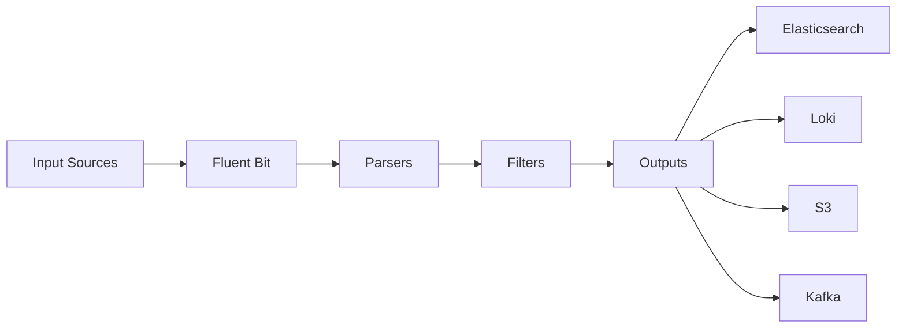

# How to Install and Configure Fluent Bit on Ubuntu

Author: [nawazdhandala](https://www.github.com/nawazdhandala)

Tags: Ubuntu, Fluent Bit, Logging, Observability, Cloud Native, Tutorial

Description: Set up Fluent Bit as a lightweight log processor and forwarder on Ubuntu for cloud-native observability.

---

Fluent Bit is a lightweight and high-performance log processor and forwarder. It's designed for cloud and containerized environments, consuming minimal resources while handling high-throughput log collection. This guide covers installation and configuration on Ubuntu.

## Why Fluent Bit?

- Extremely lightweight (~450KB)
- Low memory footprint (~2MB)
- High throughput
- Pluggable architecture
- Cloud native (CNCF project)
- Kubernetes native

## Architecture Overview



## Prerequisites

- Ubuntu 18.04 or later
- Root or sudo access
- Internet connection

## Installation Methods

### Method 1: Official Repository (Recommended)

```bash
# Install GPG and prerequisites
sudo apt update
sudo apt install -y curl gpg

# Add Fluent Bit GPG key
curl https://raw.githubusercontent.com/fluent/fluent-bit/master/install.sh | sh
```

Or manually:

```bash
# Import GPG key
curl https://packages.fluentbit.io/fluentbit.key | gpg --dearmor | sudo tee /usr/share/keyrings/fluentbit-keyring.gpg > /dev/null

# Add repository
echo "deb [signed-by=/usr/share/keyrings/fluentbit-keyring.gpg] https://packages.fluentbit.io/ubuntu/jammy jammy main" | sudo tee /etc/apt/sources.list.d/fluent-bit.list

# Install
sudo apt update
sudo apt install fluent-bit -y
```

### Method 2: Download Binary

```bash
# Download latest release
curl -LO https://github.com/fluent/fluent-bit/releases/download/v2.2.0/fluent-bit-2.2.0-linux-x86_64.tar.gz

# Extract
tar -xzf fluent-bit-2.2.0-linux-x86_64.tar.gz

# Move to /opt
sudo mv fluent-bit /opt/

# Create symlink
sudo ln -s /opt/fluent-bit/bin/fluent-bit /usr/local/bin/fluent-bit
```

### Method 3: Docker

```bash
# Run Fluent Bit container
docker run -d --name fluent-bit \
  -v /var/log:/var/log:ro \
  -v $(pwd)/fluent-bit.conf:/fluent-bit/etc/fluent-bit.conf \
  fluent/fluent-bit:latest
```

## Basic Configuration

### Configuration File Location

```bash
# Default configuration
/etc/fluent-bit/fluent-bit.conf

# Parsers configuration
/etc/fluent-bit/parsers.conf
```

### Configuration Structure

```ini
# fluent-bit.conf structure

# Service section - global settings
[SERVICE]
    ...

# Input section - data sources
[INPUT]
    ...

# Parser section - parsing rules
[PARSER]
    ...

# Filter section - data transformation
[FILTER]
    ...

# Output section - destinations
[OUTPUT]
    ...
```

## Basic Configuration Example

```bash
sudo nano /etc/fluent-bit/fluent-bit.conf
```

```ini
[SERVICE]
    # Flush interval in seconds
    Flush        5

    # Daemon mode
    Daemon       Off

    # Log level (error, warning, info, debug, trace)
    Log_Level    info

    # Parsers file
    Parsers_File parsers.conf

    # HTTP Server for monitoring
    HTTP_Server  On
    HTTP_Listen  0.0.0.0
    HTTP_Port    2020

# Collect system logs
[INPUT]
    Name         tail
    Path         /var/log/syslog
    Tag          syslog
    Parser       syslog-rfc3164

# Collect auth logs
[INPUT]
    Name         tail
    Path         /var/log/auth.log
    Tag          auth
    Parser       syslog-rfc3164

# Print to stdout (for testing)
[OUTPUT]
    Name         stdout
    Match        *
```

## Input Plugins

### Tail (Log Files)

```ini
[INPUT]
    Name              tail
    Path              /var/log/nginx/access.log
    Tag               nginx.access
    Parser            nginx
    Path_Key          filename
    Refresh_Interval  10
    Rotate_Wait       30
    DB                /var/lib/fluent-bit/nginx.db
    Mem_Buf_Limit     50MB
```

### Systemd (Journal)

```ini
[INPUT]
    Name              systemd
    Tag               systemd.*
    Systemd_Filter    _SYSTEMD_UNIT=docker.service
    Systemd_Filter    _SYSTEMD_UNIT=nginx.service
    Read_From_Tail    On
    Strip_Underscores On
```

### CPU Metrics

```ini
[INPUT]
    Name         cpu
    Tag          cpu.metrics
    Interval_Sec 10
```

### Memory Metrics

```ini
[INPUT]
    Name         mem
    Tag          memory.metrics
    Interval_Sec 10
```

### Docker Logs

```ini
[INPUT]
    Name         docker
    Tag          docker.*
    Docker_Mode  On
```

### TCP Input

```ini
[INPUT]
    Name         tcp
    Listen       0.0.0.0
    Port         5170
    Tag          tcp.input
    Format       json
```

### Syslog Input

```ini
[INPUT]
    Name         syslog
    Listen       0.0.0.0
    Port         5140
    Mode         tcp
    Tag          syslog.remote
    Parser       syslog-rfc3164
```

## Parsers

### Built-in Parsers

```bash
# View available parsers
cat /etc/fluent-bit/parsers.conf
```

### Custom Parsers

```bash
sudo nano /etc/fluent-bit/parsers.conf
```

```ini
# Nginx access log parser
[PARSER]
    Name        nginx
    Format      regex
    Regex       ^(?<remote>[^ ]*) (?<host>[^ ]*) (?<user>[^ ]*) \[(?<time>[^\]]*)\] "(?<method>\S+)(?: +(?<path>[^\"]*?)(?: +\S*)?)?" (?<code>[^ ]*) (?<size>[^ ]*)(?: "(?<referer>[^\"]*)" "(?<agent>[^\"]*)")?$
    Time_Key    time
    Time_Format %d/%b/%Y:%H:%M:%S %z

# JSON parser
[PARSER]
    Name        json
    Format      json
    Time_Key    timestamp
    Time_Format %Y-%m-%dT%H:%M:%S.%L

# Docker log parser
[PARSER]
    Name        docker
    Format      json
    Time_Key    time
    Time_Format %Y-%m-%dT%H:%M:%S.%L
    Time_Keep   On
```

## Filters

### Add Fields

```ini
[FILTER]
    Name    modify
    Match   *
    Add     hostname ${HOSTNAME}
    Add     environment production
```

### Remove/Rename Fields

```ini
[FILTER]
    Name    modify
    Match   *
    Remove  unwanted_field
    Rename  old_name new_name
```

### Grep Filter

```ini
# Include only error logs
[FILTER]
    Name    grep
    Match   *
    Regex   log error|Error|ERROR

# Exclude debug logs
[FILTER]
    Name    grep
    Match   *
    Exclude log DEBUG
```

### Parser Filter

```ini
[FILTER]
    Name         parser
    Match        docker.*
    Key_Name     log
    Parser       json
    Preserve_Key On
    Reserve_Data On
```

### Kubernetes Filter

```ini
[FILTER]
    Name                kubernetes
    Match               kube.*
    Kube_URL            https://kubernetes.default.svc:443
    Kube_CA_File        /var/run/secrets/kubernetes.io/serviceaccount/ca.crt
    Kube_Token_File     /var/run/secrets/kubernetes.io/serviceaccount/token
    Merge_Log           On
    Keep_Log            Off
```

### Lua Script Filter

```ini
[FILTER]
    Name    lua
    Match   *
    script  /etc/fluent-bit/scripts/filter.lua
    call    transform
```

```lua
-- /etc/fluent-bit/scripts/filter.lua
function transform(tag, timestamp, record)
    record["processed_at"] = os.date("!%Y-%m-%dT%H:%M:%SZ")
    return 1, timestamp, record
end
```

## Output Plugins

### Elasticsearch

```ini
[OUTPUT]
    Name            es
    Match           *
    Host            elasticsearch
    Port            9200
    Index           fluent-bit
    Type            _doc
    HTTP_User       elastic
    HTTP_Passwd     password
    tls             On
    tls.verify      Off
    Suppress_Type_Name On
    Logstash_Format On
    Logstash_Prefix logs
    Retry_Limit     5
```

### Loki (Grafana)

```ini
[OUTPUT]
    Name        loki
    Match       *
    Host        loki
    Port        3100
    Labels      job=fluent-bit, env=production
    Auto_Kubernetes_Labels On
```

### Amazon S3

```ini
[OUTPUT]
    Name                         s3
    Match                        *
    bucket                       my-logs-bucket
    region                       us-east-1
    total_file_size              100M
    upload_timeout               10m
    store_dir                    /tmp/fluent-bit/s3
    s3_key_format                /logs/%Y/%m/%d/$TAG/%H_%M_%S.gz
    compression                  gzip
```

### Kafka

```ini
[OUTPUT]
    Name          kafka
    Match         *
    Brokers       kafka:9092
    Topics        logs
    Timestamp_Key @timestamp
    rdkafka.log.connection.close false
```

### CloudWatch

```ini
[OUTPUT]
    Name                  cloudwatch_logs
    Match                 *
    region                us-east-1
    log_group_name        /fluent-bit/logs
    log_stream_prefix     server-
    auto_create_group     true
```

### HTTP Output

```ini
[OUTPUT]
    Name          http
    Match         *
    Host          api.example.com
    Port          443
    URI           /logs
    Format        json
    tls           On
    Header        Authorization Bearer YOUR_TOKEN
```

### Forward to Fluentd

```ini
[OUTPUT]
    Name          forward
    Match         *
    Host          fluentd
    Port          24224
```

### File Output

```ini
[OUTPUT]
    Name   file
    Match  *
    Path   /var/log/fluent-bit/
    Format plain
```

## Complete Configuration Example

```ini
# /etc/fluent-bit/fluent-bit.conf

[SERVICE]
    Flush         5
    Daemon        Off
    Log_Level     info
    Parsers_File  parsers.conf
    HTTP_Server   On
    HTTP_Listen   0.0.0.0
    HTTP_Port     2020
    Health_Check  On

# System logs
[INPUT]
    Name              tail
    Tag               system.syslog
    Path              /var/log/syslog
    Parser            syslog-rfc3164
    DB                /var/lib/fluent-bit/syslog.db
    Mem_Buf_Limit     5MB
    Skip_Long_Lines   On
    Refresh_Interval  10

# Nginx access logs
[INPUT]
    Name              tail
    Tag               nginx.access
    Path              /var/log/nginx/access.log
    Parser            nginx
    DB                /var/lib/fluent-bit/nginx_access.db
    Mem_Buf_Limit     5MB

# Application JSON logs
[INPUT]
    Name              tail
    Tag               app.logs
    Path              /var/log/myapp/*.log
    Parser            json
    DB                /var/lib/fluent-bit/app.db
    Mem_Buf_Limit     10MB

# Add hostname to all records
[FILTER]
    Name    modify
    Match   *
    Add     hostname ${HOSTNAME}
    Add     env production

# Parse nested JSON in app logs
[FILTER]
    Name         parser
    Match        app.*
    Key_Name     message
    Parser       json
    Reserve_Data On

# Route to Elasticsearch
[OUTPUT]
    Name            es
    Match           *
    Host            localhost
    Port            9200
    Index           logs
    Logstash_Format On
    Logstash_Prefix logs
    Retry_Limit     5

# Also route to stdout for debugging
[OUTPUT]
    Name   stdout
    Match  *
    Format json_lines
```

## Start Fluent Bit

```bash
# Start service
sudo systemctl start fluent-bit
sudo systemctl enable fluent-bit

# Check status
sudo systemctl status fluent-bit

# View logs
sudo journalctl -u fluent-bit -f
```

## Monitoring

### HTTP API Endpoints

```bash
# Health check
curl http://localhost:2020/api/v1/health

# Metrics
curl http://localhost:2020/api/v1/metrics

# Prometheus format
curl http://localhost:2020/api/v1/metrics/prometheus

# Uptime
curl http://localhost:2020/api/v1/uptime
```

## Performance Tuning

### Memory Management

```ini
[SERVICE]
    # Storage configuration
    storage.path              /var/lib/fluent-bit/storage
    storage.sync              normal
    storage.checksum          off
    storage.backlog.mem_limit 50M

[INPUT]
    Name              tail
    storage.type      filesystem  # Use disk for buffering
    Mem_Buf_Limit     50MB
```

### High Throughput Settings

```ini
[SERVICE]
    Flush        1
    Grace        5

[INPUT]
    Name              tail
    Buffer_Chunk_Size 512k
    Buffer_Max_Size   5M
```

## Troubleshooting

### Debug Mode

```bash
# Run in foreground with debug
fluent-bit -c /etc/fluent-bit/fluent-bit.conf -v

# Or set in config
[SERVICE]
    Log_Level debug
```

### Check Configuration

```bash
# Validate configuration
fluent-bit -c /etc/fluent-bit/fluent-bit.conf --dry-run
```

### Common Issues

```bash
# Permission denied
sudo usermod -aG adm fluent-bit
sudo chmod 644 /var/log/syslog

# Database locked
sudo rm /var/lib/fluent-bit/*.db
sudo systemctl restart fluent-bit

# Check port in use
ss -tlnp | grep 2020
```

## Kubernetes Deployment

```yaml
# fluent-bit-daemonset.yaml
apiVersion: apps/v1
kind: DaemonSet
metadata:
  name: fluent-bit
  namespace: logging
spec:
  selector:
    matchLabels:
      app: fluent-bit
  template:
    metadata:
      labels:
        app: fluent-bit
    spec:
      containers:
      - name: fluent-bit
        image: fluent/fluent-bit:latest
        volumeMounts:
        - name: varlog
          mountPath: /var/log
        - name: config
          mountPath: /fluent-bit/etc/
      volumes:
      - name: varlog
        hostPath:
          path: /var/log
      - name: config
        configMap:
          name: fluent-bit-config
```

---

Fluent Bit is ideal for cloud-native log collection due to its minimal resource footprint and high performance. It integrates seamlessly with the entire observability ecosystem. For comprehensive monitoring including metrics, traces, and uptime, consider integrating with OneUptime alongside your logging infrastructure.
