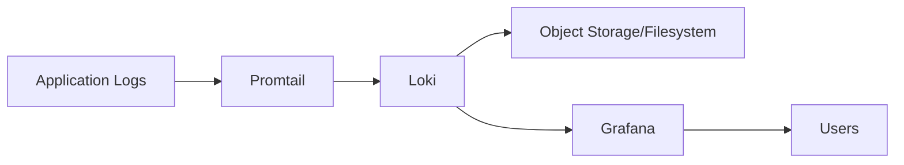

# How to Install and Configure Grafana Loki on Ubuntu

Author: [nawazdhandala](https://www.github.com/nawazdhandala)

Tags: Ubuntu, Grafana, Loki, Logging, Observability, Tutorial

Description: Set up Grafana Loki for scalable log aggregation with Promtail agent and Grafana visualization.

---

Grafana Loki is a horizontally-scalable, highly-available log aggregation system inspired by Prometheus. Unlike other logging systems, Loki indexes only metadata (labels) about your logs, making it cost-effective and efficient. This guide covers installing Loki with Promtail and Grafana on Ubuntu.

## Architecture Overview



## Prerequisites

- Ubuntu 20.04 or later
- At least 2GB RAM
- Root or sudo access
- Grafana installed (optional but recommended)

## Installation Methods

### Method 1: Download Binary

```bash
# Create directory
sudo mkdir -p /opt/loki
cd /opt/loki

# Download Loki
curl -O -L "https://github.com/grafana/loki/releases/download/v2.9.3/loki-linux-amd64.zip"
unzip loki-linux-amd64.zip
chmod a+x loki-linux-amd64
sudo mv loki-linux-amd64 /usr/local/bin/loki

# Download Promtail
curl -O -L "https://github.com/grafana/loki/releases/download/v2.9.3/promtail-linux-amd64.zip"
unzip promtail-linux-amd64.zip
chmod a+x promtail-linux-amd64
sudo mv promtail-linux-amd64 /usr/local/bin/promtail

# Clean up
rm -f *.zip
```

### Method 2: Using Docker

```bash
# Create directory for configs
mkdir -p ~/loki

# Run Loki
docker run -d --name loki -p 3100:3100 \
  -v ~/loki:/etc/loki \
  grafana/loki:2.9.3 \
  -config.file=/etc/loki/loki-config.yaml

# Run Promtail
docker run -d --name promtail \
  -v ~/loki:/etc/promtail \
  -v /var/log:/var/log:ro \
  grafana/promtail:2.9.3 \
  -config.file=/etc/promtail/promtail-config.yaml
```

### Method 3: Docker Compose

```yaml
# docker-compose.yml
version: "3"

services:
  loki:
    image: grafana/loki:2.9.3
    ports:
      - "3100:3100"
    volumes:
      - ./loki-config.yaml:/etc/loki/loki-config.yaml
      - loki-data:/loki
    command: -config.file=/etc/loki/loki-config.yaml
    restart: unless-stopped

  promtail:
    image: grafana/promtail:2.9.3
    volumes:
      - ./promtail-config.yaml:/etc/promtail/promtail-config.yaml
      - /var/log:/var/log:ro
    command: -config.file=/etc/promtail/promtail-config.yaml
    restart: unless-stopped

  grafana:
    image: grafana/grafana:latest
    ports:
      - "3000:3000"
    volumes:
      - grafana-data:/var/lib/grafana
    environment:
      - GF_SECURITY_ADMIN_PASSWORD=admin
    restart: unless-stopped

volumes:
  loki-data:
  grafana-data:
```

## Configure Loki

### Create Configuration Directory

```bash
sudo mkdir -p /etc/loki
```

### Basic Loki Configuration

```bash
sudo nano /etc/loki/loki-config.yaml
```

```yaml
# Loki configuration
auth_enabled: false

server:
  http_listen_port: 3100
  grpc_listen_port: 9096

common:
  instance_addr: 127.0.0.1
  path_prefix: /var/lib/loki
  storage:
    filesystem:
      chunks_directory: /var/lib/loki/chunks
      rules_directory: /var/lib/loki/rules
  replication_factor: 1
  ring:
    kvstore:
      store: inmemory

query_range:
  results_cache:
    cache:
      embedded_cache:
        enabled: true
        max_size_mb: 100

schema_config:
  configs:
    - from: 2020-10-24
      store: boltdb-shipper
      object_store: filesystem
      schema: v11
      index:
        prefix: index_
        period: 24h

ruler:
  alertmanager_url: http://localhost:9093

analytics:
  reporting_enabled: false
```

### Create Data Directory

```bash
sudo mkdir -p /var/lib/loki
sudo chown -R nobody:nogroup /var/lib/loki
```

## Configure Promtail

### Create Promtail Configuration

```bash
sudo nano /etc/loki/promtail-config.yaml
```

```yaml
# Promtail configuration
server:
  http_listen_port: 9080
  grpc_listen_port: 0

positions:
  filename: /var/lib/promtail/positions.yaml

clients:
  - url: http://localhost:3100/loki/api/v1/push

scrape_configs:
  # System logs
  - job_name: system
    static_configs:
      - targets:
          - localhost
        labels:
          job: varlogs
          host: ${HOSTNAME}
          __path__: /var/log/*.log

  # Syslog
  - job_name: syslog
    static_configs:
      - targets:
          - localhost
        labels:
          job: syslog
          host: ${HOSTNAME}
          __path__: /var/log/syslog

  # Auth logs
  - job_name: auth
    static_configs:
      - targets:
          - localhost
        labels:
          job: auth
          host: ${HOSTNAME}
          __path__: /var/log/auth.log

  # Nginx access logs
  - job_name: nginx
    static_configs:
      - targets:
          - localhost
        labels:
          job: nginx
          host: ${HOSTNAME}
          __path__: /var/log/nginx/*.log
    pipeline_stages:
      - regex:
          expression: '^(?P<remote_addr>[\w\.]+) - (?P<remote_user>[^ ]*) \[(?P<time_local>[^\]]*)\] "(?P<method>\w+) (?P<request>[^ ]*) (?P<protocol>[^"]*)" (?P<status>\d+) (?P<body_bytes_sent>\d+) "(?P<http_referer>[^"]*)" "(?P<http_user_agent>[^"]*)"'
      - labels:
          method:
          status:
```

### Create Positions Directory

```bash
sudo mkdir -p /var/lib/promtail
sudo chown -R nobody:nogroup /var/lib/promtail
```

## Create Systemd Services

### Loki Service

```bash
sudo nano /etc/systemd/system/loki.service
```

```ini
[Unit]
Description=Loki Log Aggregation System
After=network.target

[Service]
Type=simple
User=nobody
Group=nogroup
ExecStart=/usr/local/bin/loki -config.file=/etc/loki/loki-config.yaml
Restart=on-failure
RestartSec=5s
LimitNOFILE=65536

[Install]
WantedBy=multi-user.target
```

### Promtail Service

```bash
sudo nano /etc/systemd/system/promtail.service
```

```ini
[Unit]
Description=Promtail Log Collector
After=network.target

[Service]
Type=simple
User=root
ExecStart=/usr/local/bin/promtail -config.file=/etc/loki/promtail-config.yaml
Restart=on-failure
RestartSec=5s

[Install]
WantedBy=multi-user.target
```

### Start Services

```bash
# Reload systemd
sudo systemctl daemon-reload

# Start and enable Loki
sudo systemctl start loki
sudo systemctl enable loki

# Start and enable Promtail
sudo systemctl start promtail
sudo systemctl enable promtail

# Check status
sudo systemctl status loki promtail
```

## Configure Grafana

### Add Loki Data Source

1. Open Grafana: `http://your_server_ip:3000`
2. Go to Configuration → Data Sources → Add data source
3. Select "Loki"
4. Configure:
   - URL: `http://localhost:3100`
   - Click "Save & Test"

### Create Dashboard

1. Create new dashboard
2. Add new panel
3. Select Loki data source
4. Use LogQL query:

```logql
{job="varlogs"} |= "error"
```

## LogQL Query Examples

### Basic Queries

```logql
# All logs from a job
{job="syslog"}

# Filter by label
{host="webserver", job="nginx"}

# Search for text
{job="varlogs"} |= "error"

# Regex match
{job="nginx"} |~ "status=5.."

# Exclude pattern
{job="syslog"} != "cron"
```

### Advanced Queries

```logql
# Parse and filter JSON
{job="application"} | json | level="error"

# Parse with regex
{job="nginx"} | regexp `status=(?P<status>\d+)` | status >= 400

# Aggregations
sum(rate({job="nginx"}[5m])) by (host)

# Count errors per minute
count_over_time({job="varlogs"} |= "error" [1m])

# Top 10 error messages
topk(10, sum by (message) (count_over_time({job="varlogs"} |= "error" | pattern `<message>` [1h])))
```

## Configure Log Retention

### Edit Loki Configuration

```yaml
# Add to loki-config.yaml
limits_config:
  retention_period: 168h  # 7 days

compactor:
  working_directory: /var/lib/loki/compactor
  shared_store: filesystem
  compaction_interval: 10m
  retention_enabled: true
  retention_delete_delay: 2h
  retention_delete_worker_count: 150
```

## Alerting with Loki

### Configure Alert Rules

```bash
sudo nano /etc/loki/rules/alerts.yaml
```

```yaml
groups:
  - name: log-alerts
    rules:
      - alert: HighErrorRate
        expr: |
          sum(rate({job="nginx"} |= "error" [5m])) > 10
        for: 5m
        labels:
          severity: warning
        annotations:
          summary: "High error rate detected"
          description: "Error rate is {{ $value }} errors/second"

      - alert: AuthFailures
        expr: |
          count_over_time({job="auth"} |= "authentication failure" [5m]) > 5
        for: 1m
        labels:
          severity: critical
        annotations:
          summary: "Multiple authentication failures"
          description: "{{ $value }} auth failures in last 5 minutes"
```

### Enable Ruler

```yaml
# Add to loki-config.yaml
ruler:
  storage:
    type: local
    local:
      directory: /etc/loki/rules
  rule_path: /var/lib/loki/rules-temp
  alertmanager_url: http://localhost:9093
  ring:
    kvstore:
      store: inmemory
  enable_api: true
```

## Multi-Tenant Setup

### Enable Authentication

```yaml
# loki-config.yaml
auth_enabled: true
```

### Configure Promtail for Multi-Tenancy

```yaml
# promtail-config.yaml
clients:
  - url: http://localhost:3100/loki/api/v1/push
    tenant_id: tenant1
```

## Production Configuration

### Scalable Configuration

```yaml
# loki-config.yaml for production
auth_enabled: false

server:
  http_listen_port: 3100

distributor:
  ring:
    kvstore:
      store: consul
      consul:
        host: consul:8500

ingester:
  lifecycler:
    ring:
      kvstore:
        store: consul
        consul:
          host: consul:8500
      replication_factor: 3
    final_sleep: 0s
  chunk_idle_period: 5m
  chunk_retain_period: 30s

schema_config:
  configs:
    - from: 2020-10-24
      store: boltdb-shipper
      object_store: s3
      schema: v11
      index:
        prefix: loki_index_
        period: 24h

storage_config:
  aws:
    s3: s3://access_key:secret_key@region/bucket_name
    s3forcepathstyle: true
  boltdb_shipper:
    active_index_directory: /var/lib/loki/index
    cache_location: /var/lib/loki/cache
    shared_store: s3

limits_config:
  enforce_metric_name: false
  reject_old_samples: true
  reject_old_samples_max_age: 168h
  ingestion_rate_mb: 16
  ingestion_burst_size_mb: 24
```

## Troubleshooting

### Check Loki Status

```bash
# Check if Loki is ready
curl http://localhost:3100/ready

# Check metrics
curl http://localhost:3100/metrics

# Check configuration
curl http://localhost:3100/config
```

### Check Promtail Status

```bash
# Check Promtail targets
curl http://localhost:9080/targets

# Check Promtail metrics
curl http://localhost:9080/metrics
```

### View Logs

```bash
# Loki logs
sudo journalctl -u loki -f

# Promtail logs
sudo journalctl -u promtail -f
```

### Common Issues

```bash
# Permission denied on log files
sudo usermod -aG adm promtail
# Or run Promtail as root

# Loki not receiving logs
# Check Promtail targets
curl http://localhost:9080/targets

# Verify network connectivity
curl -X POST http://localhost:3100/loki/api/v1/push \
  -H "Content-Type: application/json" \
  -d '{"streams": [{"stream": {"foo": "bar"}, "values": [["'$(date +%s)000000000'", "test log"]]}]}'
```

## Uninstall

```bash
# Stop services
sudo systemctl stop loki promtail
sudo systemctl disable loki promtail

# Remove binaries
sudo rm /usr/local/bin/loki /usr/local/bin/promtail

# Remove configuration and data
sudo rm -rf /etc/loki /var/lib/loki /var/lib/promtail

# Remove service files
sudo rm /etc/systemd/system/loki.service /etc/systemd/system/promtail.service
sudo systemctl daemon-reload
```

---

Grafana Loki provides cost-effective log aggregation by indexing only labels. Combined with Promtail and Grafana, it offers powerful log querying and visualization. For comprehensive observability including metrics and traces alongside logs, consider integrating with Prometheus and Tempo or using OneUptime for unified monitoring.
