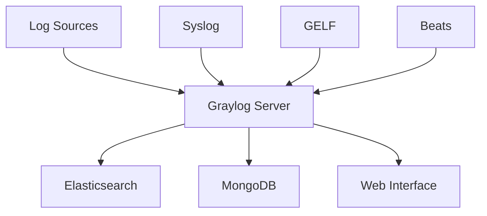

# How to Install and Configure Graylog on Ubuntu

Author: [nawazdhandala](https://www.github.com/nawazdhandala)

Tags: Ubuntu, Graylog, Logging, SIEM, Observability, Tutorial

Description: Complete guide to setting up Graylog for centralized log management with Elasticsearch and MongoDB on Ubuntu.

---

Graylog is a powerful open-source log management platform that collects, indexes, and analyzes log data from various sources. It provides real-time search, alerting, dashboards, and compliance reporting. This guide covers installing Graylog with its dependencies on Ubuntu.

## Architecture Overview



## Prerequisites

- Ubuntu 20.04 or 22.04
- At least 4GB RAM (8GB recommended)
- 4+ CPU cores
- Java 11 or 17
- MongoDB 5.x or 6.x
- OpenSearch 2.x or Elasticsearch 7.x

## System Requirements

| Component | Minimum | Recommended |
|-----------|---------|-------------|
| RAM | 4GB | 8GB+ |
| CPU | 2 cores | 4+ cores |
| Disk | 50GB | 200GB+ |
| Java | 11 | 17 |

## Install Java

```bash
# Update packages
sudo apt update

# Install Java 17
sudo apt install openjdk-17-jre-headless -y

# Verify installation
java -version
```

## Install MongoDB

```bash
# Import MongoDB GPG key
curl -fsSL https://pgp.mongodb.com/server-6.0.asc | sudo gpg -o /usr/share/keyrings/mongodb-server-6.0.gpg --dearmor

# Add repository
echo "deb [ arch=amd64,arm64 signed-by=/usr/share/keyrings/mongodb-server-6.0.gpg ] https://repo.mongodb.org/apt/ubuntu jammy/mongodb-org/6.0 multiverse" | sudo tee /etc/apt/sources.list.d/mongodb-org-6.0.list

# Install MongoDB
sudo apt update
sudo apt install mongodb-org -y

# Start MongoDB
sudo systemctl daemon-reload
sudo systemctl enable mongod
sudo systemctl start mongod

# Verify
sudo systemctl status mongod
```

## Install OpenSearch

OpenSearch is the recommended search backend for Graylog:

```bash
# Import GPG key
curl -o- https://artifacts.opensearch.org/publickeys/opensearch.pgp | sudo gpg --dearmor --batch --yes -o /usr/share/keyrings/opensearch-keyring

# Add repository
echo "deb [signed-by=/usr/share/keyrings/opensearch-keyring] https://artifacts.opensearch.org/releases/bundle/opensearch/2.x/apt stable main" | sudo tee /etc/apt/sources.list.d/opensearch-2.x.list

# Install OpenSearch
sudo apt update
sudo OPENSEARCH_INITIAL_ADMIN_PASSWORD=MyStr0ngPassw0rd! apt install opensearch -y
```

### Configure OpenSearch

```bash
sudo nano /etc/opensearch/opensearch.yml
```

```yaml
# Cluster configuration
cluster.name: graylog
node.name: node-1

# Network
network.host: 127.0.0.1
http.port: 9200

# Discovery
discovery.type: single-node

# Security (disable for local setup)
plugins.security.disabled: true

# Memory
indices.query.bool.max_clause_count: 32768
```

### Configure JVM Options

```bash
sudo nano /etc/opensearch/jvm.options
```

```
# Set heap size (half of available RAM, max 31g)
-Xms2g
-Xmx2g
```

### Start OpenSearch

```bash
sudo systemctl daemon-reload
sudo systemctl enable opensearch
sudo systemctl start opensearch

# Verify
curl -X GET http://localhost:9200
```

## Install Graylog

```bash
# Download and install Graylog repository
wget https://packages.graylog2.org/repo/packages/graylog-5.2-repository_latest.deb
sudo dpkg -i graylog-5.2-repository_latest.deb
sudo apt update

# Install Graylog
sudo apt install graylog-server -y
```

## Configure Graylog

### Generate Password Secret

```bash
# Generate password_secret (keep this safe!)
pwgen -N 1 -s 96
```

### Generate Admin Password Hash

```bash
# Generate SHA256 hash of your admin password
echo -n "YourAdminPassword" | sha256sum
```

### Edit Configuration

```bash
sudo nano /etc/graylog/server/server.conf
```

Key settings to update:

```properties
# Set to true for production
is_leader = true

# Unique node ID
node_id_file = /etc/graylog/server/node-id

# Password secret (from pwgen)
password_secret = YOUR_96_CHARACTER_SECRET

# Admin password hash (from sha256sum)
root_password_sha2 = YOUR_SHA256_HASH

# Timezone
root_timezone = America/New_York

# HTTP bind address (web interface)
http_bind_address = 0.0.0.0:9000

# External URI (for links in notifications)
http_external_uri = http://your_server_ip:9000/

# Elasticsearch/OpenSearch
elasticsearch_hosts = http://127.0.0.1:9200

# MongoDB
mongodb_uri = mongodb://localhost:27017/graylog

# Message journal
message_journal_enabled = true
message_journal_dir = /var/lib/graylog-server/journal

# Index rotation
rotation_strategy = count
elasticsearch_max_docs_per_index = 20000000
elasticsearch_max_number_of_indices = 20

# Buffer settings
processbuffer_processors = 5
outputbuffer_processors = 3
```

### Create Message Journal Directory

```bash
sudo mkdir -p /var/lib/graylog-server/journal
sudo chown graylog:graylog /var/lib/graylog-server/journal
```

## Start Graylog

```bash
# Start and enable Graylog
sudo systemctl daemon-reload
sudo systemctl enable graylog-server
sudo systemctl start graylog-server

# Check status
sudo systemctl status graylog-server

# View logs
sudo tail -f /var/log/graylog-server/server.log
```

## Access Web Interface

1. Open browser: `http://your_server_ip:9000`
2. Login with:
   - Username: admin
   - Password: (the password you hashed, not the hash)

## Configure Inputs

### Syslog UDP Input

1. Go to System → Inputs
2. Select "Syslog UDP" → Launch new input
3. Configure:
   - Title: Syslog UDP
   - Bind address: 0.0.0.0
   - Port: 5140
4. Save

### GELF UDP Input

1. Select "GELF UDP" → Launch new input
2. Configure:
   - Title: GELF UDP
   - Bind address: 0.0.0.0
   - Port: 12201
4. Save

### Beats Input

```bash
# Install Beats input plugin
sudo apt install graylog-integrations-plugins -y
sudo systemctl restart graylog-server
```

1. Select "Beats" → Launch new input
2. Configure:
   - Title: Beats
   - Bind address: 0.0.0.0
   - Port: 5044
4. Save

## Configure Log Sources

### Send Syslog from Ubuntu

```bash
# Edit rsyslog configuration
sudo nano /etc/rsyslog.d/90-graylog.conf
```

```
# Send all logs to Graylog
*.* @GRAYLOG_SERVER_IP:5140;RSYSLOG_SyslogProtocol23Format
```

```bash
sudo systemctl restart rsyslog
```

### Send Docker Logs (GELF)

```bash
# Run container with GELF logging
docker run -d \
  --log-driver=gelf \
  --log-opt gelf-address=udp://GRAYLOG_IP:12201 \
  --log-opt tag="container-name" \
  nginx
```

### Configure Filebeat

```yaml
# /etc/filebeat/filebeat.yml
filebeat.inputs:
  - type: log
    enabled: true
    paths:
      - /var/log/*.log

output.logstash:
  hosts: ["GRAYLOG_IP:5044"]
```

## Create Streams

Streams route messages to specific categories:

1. Go to Streams → Create Stream
2. Configure:
   - Title: Nginx Logs
   - Description: All Nginx access and error logs
   - Index Set: Default index set
3. Add Stream Rules:
   - Field: source
   - Type: match exactly
   - Value: nginx-server

## Configure Alerts

### Create Alert Condition

1. Go to Alerts → Notifications → Create notification
2. Select notification type (Email, Slack, etc.)
3. Configure notification settings
4. Create Event Definition:
   - Go to Alerts → Event Definitions → Create
   - Configure filter condition
   - Set aggregation
   - Link notification

### Email Notification

```bash
# Edit server.conf for email
sudo nano /etc/graylog/server/server.conf
```

```properties
# Email configuration
transport_email_enabled = true
transport_email_hostname = smtp.gmail.com
transport_email_port = 587
transport_email_use_auth = true
transport_email_auth_username = your-email@gmail.com
transport_email_auth_password = your-app-password
transport_email_use_tls = true
transport_email_from_email = graylog@yourdomain.com
```

## Create Dashboards

1. Go to Dashboards → Create new dashboard
2. Add widgets:
   - Message count
   - Field statistics
   - Quick values
   - Search results

### Example Dashboard Widgets

```
# Message count over time
Widget: Stacked Chart
Query: *
Field: timestamp
Interval: 1 minute

# Top source hosts
Widget: Quick Values
Field: source
Show: 10 entries

# Error count
Widget: Stats Count
Query: level:error OR level:ERROR
```

## Index Management

### Configure Index Set

1. Go to System → Indices
2. Edit Default index set
3. Configure:
   - Index prefix: graylog
   - Shards: 4
   - Replicas: 0 (for single node)
   - Rotation strategy: Index Time
   - Rotation period: P1D (daily)
   - Retention strategy: Delete
   - Max indices: 30

### Manually Rotate Index

```bash
# Via API
curl -X POST -H "Content-Type: application/json" \
  -u admin:password \
  http://localhost:9000/api/system/deflector/cycle
```

## Security Configuration

### Enable HTTPS

```bash
# Generate SSL certificate
sudo mkdir -p /etc/graylog/server/ssl
sudo openssl req -x509 -nodes -days 365 -newkey rsa:2048 \
  -keyout /etc/graylog/server/ssl/graylog.key \
  -out /etc/graylog/server/ssl/graylog.crt
```

Edit server.conf:

```properties
http_enable_tls = true
http_tls_cert_file = /etc/graylog/server/ssl/graylog.crt
http_tls_key_file = /etc/graylog/server/ssl/graylog.key
```

### Configure LDAP

1. Go to System → Authentication → LDAP
2. Configure LDAP server settings
3. Map LDAP groups to Graylog roles

## Performance Tuning

### JVM Configuration

```bash
sudo nano /etc/default/graylog-server
```

```bash
# Set heap size (50% of RAM, max 31g)
GRAYLOG_SERVER_JAVA_OPTS="-Xms4g -Xmx4g -XX:+UseG1GC"
```

### Increase Open Files Limit

```bash
sudo nano /etc/security/limits.conf
```

```
graylog soft nofile 64000
graylog hard nofile 64000
```

## Troubleshooting

### Check Logs

```bash
# Graylog server log
sudo tail -f /var/log/graylog-server/server.log

# OpenSearch log
sudo tail -f /var/log/opensearch/graylog.log

# MongoDB log
sudo tail -f /var/log/mongodb/mongod.log
```

### Common Issues

```bash
# OpenSearch not starting
sudo sysctl -w vm.max_map_count=262144
echo "vm.max_map_count=262144" | sudo tee -a /etc/sysctl.conf

# Graylog can't connect to OpenSearch
curl http://localhost:9200/_cluster/health

# MongoDB connection issues
sudo systemctl status mongod
mongo --eval "db.adminCommand('ping')"

# Check Graylog node status
curl -u admin:password http://localhost:9000/api/system/cluster/nodes
```

### Input Not Receiving Data

```bash
# Check if port is open
ss -tlnp | grep 5140

# Test syslog input
logger -n localhost -P 5140 "Test message"

# Check firewall
sudo ufw allow 5140/udp
sudo ufw allow 12201/udp
```

---

Graylog provides enterprise-grade log management with powerful search and alerting capabilities. Its web interface makes it easy to analyze logs and create dashboards. For modern observability including metrics and traces, consider complementing Graylog with Prometheus and OneUptime for comprehensive monitoring coverage.
