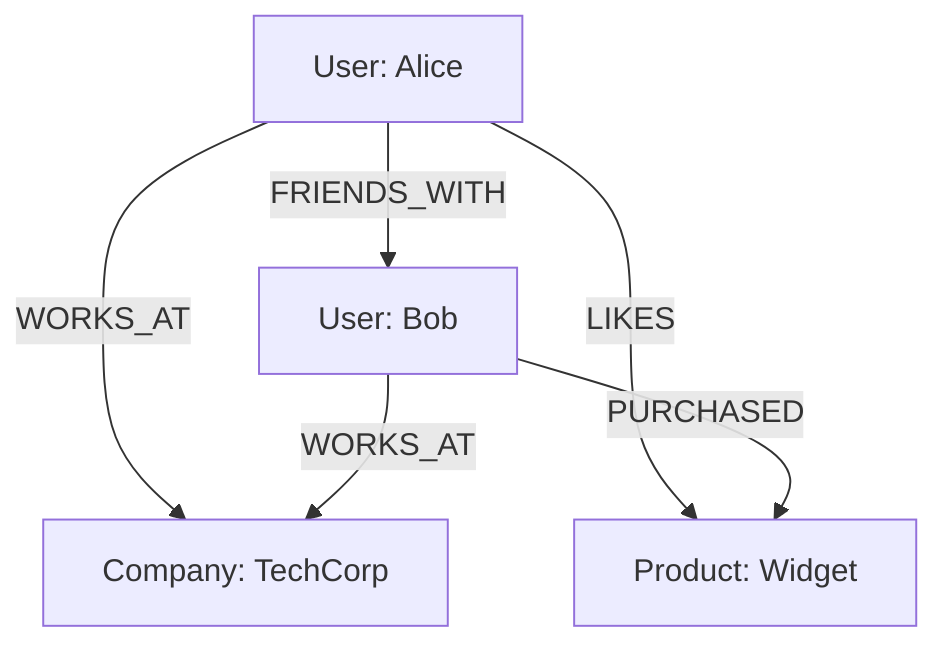

# How to Install and Configure Neo4j on Ubuntu

Author: [nawazdhandala](https://www.github.com/nawazdhandala)

Tags: Ubuntu, Neo4j, Graph Database, NoSQL, Database, Tutorial

Description: Complete guide to installing Neo4j graph database on Ubuntu for relationship-centric data storage and analysis.

---

Neo4j is the world's leading graph database, designed to leverage data relationships. It excels at storing and querying highly connected data with complex relationships. This guide covers installation and configuration on Ubuntu.

## Why Graph Databases?



Graph databases naturally represent:
- Social networks
- Recommendation engines
- Fraud detection
- Knowledge graphs
- Network topologies

## Prerequisites

- Ubuntu 20.04 or later
- At least 2GB RAM (4GB recommended)
- Java 17 (included with Neo4j 5.x)
- Root or sudo access

## Installation

### Add Neo4j Repository

```bash
# Import GPG key
curl -fsSL https://debian.neo4j.com/neotechnology.gpg.key | sudo gpg --dearmor -o /usr/share/keyrings/neo4j-archive-keyring.gpg

# Add repository
echo "deb [signed-by=/usr/share/keyrings/neo4j-archive-keyring.gpg] https://debian.neo4j.com stable latest" | sudo tee /etc/apt/sources.list.d/neo4j.list

# Update and install
sudo apt update
sudo apt install neo4j -y
```

### Alternative: Enterprise Edition

```bash
# For Enterprise edition (requires license)
echo "deb [signed-by=/usr/share/keyrings/neo4j-archive-keyring.gpg] https://debian.neo4j.com stable enterprise" | sudo tee /etc/apt/sources.list.d/neo4j.list
sudo apt update
sudo apt install neo4j-enterprise -y
```

### Start Neo4j

```bash
# Start service
sudo systemctl start neo4j
sudo systemctl enable neo4j

# Check status
sudo systemctl status neo4j
```

## Initial Configuration

### Set Initial Password

```bash
# Set password for neo4j user
sudo neo4j-admin dbms set-initial-password YourStrongPassword

# Or via cypher-shell after first login
cypher-shell -u neo4j -p neo4j
# You'll be prompted to change password
```

### Access Neo4j Browser

1. Open: `http://your_server_ip:7474`
2. Connect with:
   - Username: neo4j
   - Password: your_password
3. Click "Connect"

## Configuration

### Main Configuration File

```bash
sudo nano /etc/neo4j/neo4j.conf
```

### Network Settings

```properties
# Listen on all interfaces
server.default_listen_address=0.0.0.0

# HTTP port
server.http.listen_address=:7474

# HTTPS port
server.https.listen_address=:7473

# Bolt protocol port
server.bolt.listen_address=:7687

# Bolt advertised address (for remote clients)
server.bolt.advertised_address=your_server_ip:7687
```

### Memory Configuration

```properties
# Heap memory (adjust based on available RAM)
server.memory.heap.initial_size=512m
server.memory.heap.max_size=1G

# Page cache (for frequently accessed data)
server.memory.pagecache.size=512m
```

### Security Settings

```properties
# Enable authentication (default: true)
dbms.security.auth_enabled=true

# Enable HTTPS
server.https.enabled=true

# SSL configuration
dbms.ssl.policy.bolt.enabled=true
dbms.ssl.policy.bolt.base_directory=/var/lib/neo4j/certificates
```

### Apply Changes

```bash
sudo systemctl restart neo4j
```

## Cypher Query Language

### Connect via CLI

```bash
# Connect using cypher-shell
cypher-shell -u neo4j -p YourPassword

# Or with address
cypher-shell -a bolt://localhost:7687 -u neo4j -p YourPassword
```

### Create Nodes

```cypher
// Create a simple node
CREATE (n:Person {name: 'Alice', age: 30})
RETURN n;

// Create multiple nodes
CREATE
  (alice:Person {name: 'Alice', age: 30}),
  (bob:Person {name: 'Bob', age: 25}),
  (techcorp:Company {name: 'TechCorp', industry: 'Technology'})
RETURN alice, bob, techcorp;

// Create node with unique constraint
CREATE CONSTRAINT FOR (p:Person) REQUIRE p.email IS UNIQUE;

CREATE (p:Person {name: 'Charlie', email: 'charlie@example.com'})
RETURN p;
```

### Create Relationships

```cypher
// Create relationship between existing nodes
MATCH (a:Person {name: 'Alice'}), (b:Person {name: 'Bob'})
CREATE (a)-[:FRIENDS_WITH {since: 2020}]->(b)
RETURN a, b;

// Create relationship with MERGE (creates if not exists)
MATCH (a:Person {name: 'Alice'}), (c:Company {name: 'TechCorp'})
MERGE (a)-[:WORKS_AT {since: 2019, role: 'Engineer'}]->(c)
RETURN a, c;

// Create bidirectional relationship
MATCH (a:Person {name: 'Alice'}), (b:Person {name: 'Bob'})
CREATE (a)-[:KNOWS]->(b)
CREATE (b)-[:KNOWS]->(a)
RETURN a, b;
```

### Query Data

```cypher
// Find all nodes
MATCH (n) RETURN n LIMIT 25;

// Find specific nodes
MATCH (p:Person) WHERE p.age > 25 RETURN p;

// Find nodes with pattern
MATCH (p:Person {name: 'Alice'}) RETURN p;

// Find connected nodes
MATCH (a:Person)-[:FRIENDS_WITH]->(b:Person)
RETURN a.name, b.name;

// Variable length paths
MATCH (a:Person {name: 'Alice'})-[:FRIENDS_WITH*1..3]->(friend)
RETURN DISTINCT friend.name;

// Shortest path
MATCH path = shortestPath(
  (a:Person {name: 'Alice'})-[*]-(b:Person {name: 'Charlie'})
)
RETURN path;
```

### Update Data

```cypher
// Update node properties
MATCH (p:Person {name: 'Alice'})
SET p.age = 31, p.city = 'New York'
RETURN p;

// Add labels
MATCH (p:Person {name: 'Alice'})
SET p:Employee
RETURN p;

// Update relationship properties
MATCH (a:Person {name: 'Alice'})-[r:WORKS_AT]->(c:Company)
SET r.role = 'Senior Engineer'
RETURN a, r, c;
```

### Delete Data

```cypher
// Delete node (must have no relationships)
MATCH (p:Person {name: 'Charlie'})
DELETE p;

// Delete node with relationships
MATCH (p:Person {name: 'Charlie'})
DETACH DELETE p;

// Delete specific relationship
MATCH (a:Person {name: 'Alice'})-[r:FRIENDS_WITH]->(b:Person {name: 'Bob'})
DELETE r;

// Delete all data (careful!)
MATCH (n) DETACH DELETE n;
```

### Aggregations

```cypher
// Count
MATCH (p:Person) RETURN count(p) AS total;

// Group by
MATCH (p:Person)-[:WORKS_AT]->(c:Company)
RETURN c.name, count(p) AS employees
ORDER BY employees DESC;

// Collect into list
MATCH (p:Person)-[:FRIENDS_WITH]->(friend:Person)
RETURN p.name, collect(friend.name) AS friends;

// Statistical functions
MATCH (p:Person)
RETURN avg(p.age) AS avgAge, min(p.age) AS minAge, max(p.age) AS maxAge;
```

## Indexes and Constraints

### Create Indexes

```cypher
// Create index on single property
CREATE INDEX FOR (p:Person) ON (p.name);

// Create composite index
CREATE INDEX FOR (p:Person) ON (p.name, p.email);

// Create full-text index
CREATE FULLTEXT INDEX personNameIndex FOR (p:Person) ON EACH [p.name, p.bio];

// List indexes
SHOW INDEXES;

// Drop index
DROP INDEX index_name;
```

### Create Constraints

```cypher
// Unique constraint
CREATE CONSTRAINT person_email_unique FOR (p:Person) REQUIRE p.email IS UNIQUE;

// Node key constraint (composite unique)
CREATE CONSTRAINT FOR (p:Person) REQUIRE (p.firstName, p.lastName) IS NODE KEY;

// Existence constraint (Enterprise)
CREATE CONSTRAINT FOR (p:Person) REQUIRE p.name IS NOT NULL;

// List constraints
SHOW CONSTRAINTS;
```

## Importing Data

### From CSV

```cypher
// Load CSV with headers
LOAD CSV WITH HEADERS FROM 'file:///users.csv' AS row
CREATE (p:Person {
  name: row.name,
  email: row.email,
  age: toInteger(row.age)
});

// Load CSV from URL
LOAD CSV WITH HEADERS FROM 'https://example.com/data.csv' AS row
CREATE (p:Person {name: row.name});

// Use MERGE to avoid duplicates
LOAD CSV WITH HEADERS FROM 'file:///users.csv' AS row
MERGE (p:Person {email: row.email})
SET p.name = row.name, p.age = toInteger(row.age);
```

### Import Relationships from CSV

```cypher
// Load relationships
LOAD CSV WITH HEADERS FROM 'file:///friendships.csv' AS row
MATCH (a:Person {email: row.person1_email})
MATCH (b:Person {email: row.person2_email})
CREATE (a)-[:FRIENDS_WITH {since: toInteger(row.since)}]->(b);
```

### Using neo4j-admin import

```bash
# For large datasets, use neo4j-admin import
sudo neo4j-admin database import full \
  --nodes=Person=users.csv \
  --relationships=FRIENDS_WITH=friendships.csv \
  mydb
```

## Backup and Restore

### Online Backup (Enterprise)

```bash
# Create backup
sudo neo4j-admin database backup --to-path=/backups neo4j

# Restore from backup
sudo neo4j-admin database restore --from-path=/backups/neo4j-2024-01-15 --database=neo4j
```

### Offline Backup (Community)

```bash
# Stop Neo4j
sudo systemctl stop neo4j

# Copy data directory
sudo cp -r /var/lib/neo4j/data /backups/neo4j-backup-$(date +%Y%m%d)

# Start Neo4j
sudo systemctl start neo4j
```

### Dump and Load

```bash
# Dump database
sudo neo4j-admin database dump --to-path=/backups neo4j

# Load database
sudo neo4j-admin database load --from-path=/backups/neo4j.dump neo4j
```

## User Management

```cypher
// Create user
CREATE USER analyst SET PASSWORD 'password123' CHANGE REQUIRED;

// Create user without password change
CREATE USER reader SET PASSWORD 'password123' CHANGE NOT REQUIRED;

// List users
SHOW USERS;

// Change password
ALTER USER analyst SET PASSWORD 'newpassword123';

// Grant role
GRANT ROLE reader TO analyst;

// Custom roles (Enterprise)
CREATE ROLE data_reader;
GRANT MATCH {*} ON GRAPH * TO data_reader;
GRANT ROLE data_reader TO analyst;

// Delete user
DROP USER analyst;
```

## Performance Tuning

### Memory Settings

```properties
# /etc/neo4j/neo4j.conf

# Heap memory (typically 25-50% of RAM)
server.memory.heap.initial_size=4G
server.memory.heap.max_size=4G

# Page cache (remaining RAM minus heap)
server.memory.pagecache.size=4G

# Transaction logs
db.tx_log.rotation.retention_policy=2 days
```

### Query Optimization

```cypher
// Profile query
PROFILE MATCH (p:Person)-[:FRIENDS_WITH]->(friend)
WHERE p.name = 'Alice'
RETURN friend;

// Explain query plan
EXPLAIN MATCH (p:Person)-[:FRIENDS_WITH]->(friend)
WHERE p.name = 'Alice'
RETURN friend;

// Use indexes
CREATE INDEX FOR (p:Person) ON (p.name);

// Use USING INDEX hint
MATCH (p:Person)
USING INDEX p:Person(name)
WHERE p.name = 'Alice'
RETURN p;
```

## Monitoring

### Check Database Status

```cypher
// Database information
CALL dbms.components() YIELD name, versions;

// Store information
CALL dbms.queryJmx('org.neo4j:instance=kernel#0,name=Store file sizes');

// Active queries
CALL dbms.listQueries();

// Kill long-running query
CALL dbms.killQuery('query-id');
```

### Enable Query Logging

```properties
# /etc/neo4j/neo4j.conf
db.logs.query.enabled=VERBOSE
db.logs.query.threshold=1s
db.logs.query.path=/var/log/neo4j/query.log
```

## Clustering (Enterprise)

### Causal Clustering Configuration

```properties
# /etc/neo4j/neo4j.conf

# Enable clustering
dbms.mode=CORE

# Initial cluster members
causal_clustering.initial_discovery_members=server1:5000,server2:5000,server3:5000

# Discovery listen address
causal_clustering.discovery_listen_address=:5000

# Transaction listen address
causal_clustering.transaction_listen_address=:6000

# Raft listen address
causal_clustering.raft_listen_address=:7000
```

## Troubleshooting

### Check Logs

```bash
# Neo4j log
sudo tail -f /var/log/neo4j/neo4j.log

# Debug log
sudo tail -f /var/log/neo4j/debug.log

# Query log
sudo tail -f /var/log/neo4j/query.log
```

### Common Issues

```bash
# Service won't start
sudo journalctl -u neo4j -n 50

# Memory issues - adjust heap size
# Check /etc/neo4j/neo4j.conf

# Connection refused
# Verify bolt connector settings
# Check firewall: sudo ufw allow 7687

# Slow queries
# Check query plan with EXPLAIN/PROFILE
# Add appropriate indexes
```

### Health Check

```bash
# Check if Neo4j is running
curl http://localhost:7474/db/neo4j/tx/commit -X POST \
  -H "Content-Type: application/json" \
  -d '{"statements":[{"statement":"RETURN 1"}]}'
```

---

Neo4j excels at modeling and querying connected data. Its Cypher query language makes complex relationship queries intuitive. For comprehensive monitoring of your Neo4j deployment, integrate with OneUptime for performance tracking and alerting.
