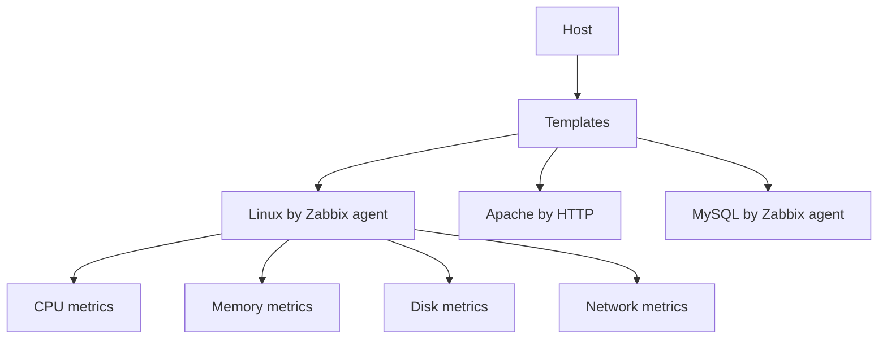

# How to Install and Configure Zabbix on Ubuntu

Author: [nawazdhandala](https://www.github.com/nawazdhandala)

Tags: Ubuntu, Zabbix, Monitoring, Infrastructure, Observability, Tutorial

Description: Complete guide to installing Zabbix Server on Ubuntu for enterprise-grade infrastructure monitoring and alerting.

---

Zabbix is a powerful open-source monitoring solution for networks, servers, applications, and cloud services. It offers enterprise-grade features including auto-discovery, templates, triggers, and comprehensive visualization. This guide covers installing Zabbix on Ubuntu.

## Prerequisites

- Ubuntu 20.04, 22.04, or 24.04
- At least 4GB RAM (8GB recommended)
- 2+ CPU cores
- MySQL/MariaDB or PostgreSQL
- Apache or Nginx web server
- PHP 7.4 or later

## System Requirements

| Component | Minimum | Recommended |
|-----------|---------|-------------|
| RAM | 2GB | 8GB+ |
| CPU | 2 cores | 4+ cores |
| Disk | 50GB | 200GB+ |
| Database | MySQL 5.7+ | MariaDB 10.5+ |

## Install Dependencies

```bash
# Update system
sudo apt update && sudo apt upgrade -y

# Install Apache, MySQL, and PHP
sudo apt install apache2 mysql-server php php-mysql php-gd php-xml php-bcmath php-mbstring php-ldap libapache2-mod-php -y

# Start and enable services
sudo systemctl enable apache2 mysql
sudo systemctl start apache2 mysql
```

## Add Zabbix Repository

```bash
# Download Zabbix repository package
wget https://repo.zabbix.com/zabbix/6.4/ubuntu/pool/main/z/zabbix-release/zabbix-release_6.4-1+ubuntu22.04_all.deb

# Install repository
sudo dpkg -i zabbix-release_6.4-1+ubuntu22.04_all.deb

# Update package cache
sudo apt update
```

## Install Zabbix Components

```bash
# Install Zabbix server, frontend, and agent
sudo apt install zabbix-server-mysql zabbix-frontend-php zabbix-apache-conf zabbix-sql-scripts zabbix-agent -y
```

## Configure Database

### Create Database and User

```bash
# Log into MySQL
sudo mysql
```

```sql
-- Create database
CREATE DATABASE zabbix CHARACTER SET utf8mb4 COLLATE utf8mb4_bin;

-- Create user
CREATE USER 'zabbix'@'localhost' IDENTIFIED BY 'YourStrongPassword';

-- Grant privileges
GRANT ALL PRIVILEGES ON zabbix.* TO 'zabbix'@'localhost';

-- Enable log_bin_trust_function_creators
SET GLOBAL log_bin_trust_function_creators = 1;

-- Apply privileges
FLUSH PRIVILEGES;
EXIT;
```

### Import Initial Schema

```bash
# Import database schema (takes a few minutes)
zcat /usr/share/zabbix-sql-scripts/mysql/server.sql.gz | mysql --default-character-set=utf8mb4 -uzabbix -p zabbix
```

### Disable log_bin_trust_function_creators

```bash
sudo mysql -e "SET GLOBAL log_bin_trust_function_creators = 0;"
```

## Configure Zabbix Server

```bash
# Edit Zabbix server configuration
sudo nano /etc/zabbix/zabbix_server.conf
```

Update these settings:

```ini
# Database configuration
DBHost=localhost
DBName=zabbix
DBUser=zabbix
DBPassword=YourStrongPassword

# Server configuration
ListenPort=10051
LogFile=/var/log/zabbix/zabbix_server.log
LogFileSize=0
PidFile=/run/zabbix/zabbix_server.pid

# Performance tuning
StartPollers=10
StartPollersUnreachable=5
StartTrappers=10
StartPingers=5
StartDiscoverers=5
CacheSize=128M
HistoryCacheSize=64M
TrendCacheSize=32M
ValueCacheSize=64M
```

## Configure PHP

```bash
# Edit PHP configuration for Zabbix
sudo nano /etc/zabbix/apache.conf
```

Verify timezone is set:

```apache
php_value date.timezone America/New_York
```

```bash
# Or edit php.ini directly
sudo nano /etc/php/8.1/apache2/php.ini
```

Update these values:

```ini
max_execution_time = 300
memory_limit = 256M
post_max_size = 32M
upload_max_filesize = 16M
max_input_time = 300
date.timezone = America/New_York
```

## Start Services

```bash
# Restart and enable Zabbix services
sudo systemctl restart zabbix-server zabbix-agent apache2
sudo systemctl enable zabbix-server zabbix-agent apache2

# Check status
sudo systemctl status zabbix-server
```

## Complete Web Setup

1. Open browser: `http://your_server_ip/zabbix`
2. Click "Next step" on welcome screen
3. Verify all prerequisites are met
4. Enter database details:
   - Database type: MySQL
   - Database host: localhost
   - Database port: 0 (default)
   - Database name: zabbix
   - User: zabbix
   - Password: YourStrongPassword
5. Enter Zabbix server details
6. Review and finish installation
7. Login with default credentials:
   - Username: Admin
   - Password: zabbix

**Important**: Change the default password immediately!

## Configure Zabbix Agent

### On Zabbix Server

```bash
# Edit agent configuration
sudo nano /etc/zabbix/zabbix_agentd.conf
```

```ini
# Server address
Server=127.0.0.1

# Server active address
ServerActive=127.0.0.1

# Hostname (must match host in Zabbix)
Hostname=zabbix-server

# Enable remote commands (optional)
EnableRemoteCommands=1
```

```bash
# Restart agent
sudo systemctl restart zabbix-agent
```

### On Remote Hosts

```bash
# Install Zabbix agent
wget https://repo.zabbix.com/zabbix/6.4/ubuntu/pool/main/z/zabbix-release/zabbix-release_6.4-1+ubuntu22.04_all.deb
sudo dpkg -i zabbix-release_6.4-1+ubuntu22.04_all.deb
sudo apt update
sudo apt install zabbix-agent -y

# Configure agent
sudo nano /etc/zabbix/zabbix_agentd.conf
```

```ini
Server=ZABBIX_SERVER_IP
ServerActive=ZABBIX_SERVER_IP
Hostname=client-hostname
```

```bash
# Start agent
sudo systemctl enable zabbix-agent
sudo systemctl start zabbix-agent

# Open firewall
sudo ufw allow 10050/tcp
```

## Add Hosts to Monitor

### Via Web Interface

1. Navigate to Configuration → Hosts → Create host
2. Enter:
   - Host name: server-name
   - Groups: Linux servers
   - Interfaces: Agent (IP address, port 10050)
3. Link templates:
   - Linux by Zabbix agent
   - Template OS Linux by Zabbix agent active
4. Click Add

### Template Configuration



## Configure Alerts

### Create Media Type (Email)

1. Go to Administration → Media types
2. Select Email
3. Configure SMTP:
   - SMTP server: smtp.gmail.com
   - SMTP port: 587
   - SMTP email: your-email@gmail.com
   - Authentication: Username and password
   - Security: STARTTLS

### Create Action

1. Go to Configuration → Actions → Trigger actions
2. Create action:
   - Name: Send alerts to admin
   - Conditions: Trigger severity >= Warning
3. Operations:
   - Send message to user groups: Admins
   - Use default message

### Assign Media to User

1. Go to Administration → Users
2. Select Admin user
3. Media tab → Add:
   - Type: Email
   - Send to: admin@example.com
   - Severity: Check all needed

## Custom Templates

### Create Template

1. Configuration → Templates → Create template
2. Template name: Custom Application Monitor
3. Groups: Templates/Applications
4. Add items, triggers, and graphs

### Create Item

```
Name: Custom App Status
Type: Zabbix agent
Key: custom.app.status
Type of information: Numeric (unsigned)
Update interval: 60s
```

### Create Trigger

```
Name: Custom App is down
Expression: last(/Custom Application Monitor/custom.app.status)=0
Severity: High
```

## SNMP Monitoring

### Enable SNMP on Target

```bash
# On monitored host
sudo apt install snmpd snmp -y

# Configure SNMP
sudo nano /etc/snmp/snmpd.conf
```

```ini
rocommunity public 10.0.0.0/24
syslocation "Server Room"
syscontact admin@example.com
```

### Add SNMP Host in Zabbix

1. Create host with SNMP interface
2. Link SNMP templates
3. Configure community string

## Performance Tuning

### Database Optimization

```bash
# MySQL tuning for Zabbix
sudo nano /etc/mysql/mysql.conf.d/mysqld.cnf
```

```ini
[mysqld]
innodb_buffer_pool_size = 2G
innodb_log_file_size = 512M
innodb_flush_log_at_trx_commit = 2
innodb_flush_method = O_DIRECT
```

### Housekeeping

Configure data retention in Administration → General → Housekeeping:

| Data Type | Default | Recommended |
|-----------|---------|-------------|
| Events | 365 days | 90 days |
| Trends | 365 days | 365 days |
| History | 90 days | 30 days |

## Troubleshooting

### Check Logs

```bash
# Zabbix server log
sudo tail -f /var/log/zabbix/zabbix_server.log

# Zabbix agent log
sudo tail -f /var/log/zabbix/zabbix_agentd.log
```

### Database Connection Issues

```bash
# Test database connection
mysql -uzabbix -p zabbix -e "SELECT 1"

# Check Zabbix server status
sudo systemctl status zabbix-server

# Verify database password in config
sudo grep DBPassword /etc/zabbix/zabbix_server.conf
```

### Agent Communication Issues

```bash
# Test from server
zabbix_get -s agent_ip -k agent.hostname

# Check firewall
sudo ufw status

# Verify agent is listening
ss -tlnp | grep 10050
```

### Web Interface Issues

```bash
# Check Apache errors
sudo tail -f /var/log/apache2/error.log

# Verify PHP configuration
php -i | grep -E "(timezone|memory_limit|max_execution)"
```

---

Zabbix provides comprehensive enterprise monitoring with extensive customization options. Its template system allows quick deployment across many hosts. For simpler setups, consider [Nagios](https://oneuptime.com/blog/post/2026-01-15-install-configure-nagios-ubuntu/view) or cloud-native solutions like OneUptime for modern observability needs.
