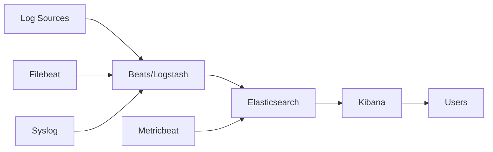

# How to Install the ELK Stack on Ubuntu

Author: [nawazdhandala](https://www.github.com/nawazdhandala)

Tags: Ubuntu, ELK Stack, Elasticsearch, Logstash, Kibana, Logging, Tutorial

Description: Complete guide to installing and configuring the ELK Stack (Elasticsearch, Logstash, Kibana) for log analytics on Ubuntu.

---

The ELK Stack (Elasticsearch, Logstash, Kibana) is a powerful open-source platform for collecting, storing, searching, and visualizing log data. This guide covers installing and configuring all three components on Ubuntu.

## Architecture Overview



## Prerequisites

- Ubuntu 20.04 or 22.04
- At least 4GB RAM (8GB recommended)
- 2+ CPU cores
- Java 11 or 17
- Root or sudo access

## System Requirements

| Component | RAM | CPU | Disk |
|-----------|-----|-----|------|
| Elasticsearch | 2GB+ | 2 cores | 50GB+ |
| Logstash | 1GB+ | 1 core | 10GB |
| Kibana | 1GB+ | 1 core | 1GB |

## Install Java

```bash
# Update packages
sudo apt update

# Install Java 17
sudo apt install openjdk-17-jre-headless -y

# Verify
java -version
```

## Add Elastic Repository

```bash
# Import Elasticsearch GPG key
wget -qO - https://artifacts.elastic.co/GPG-KEY-elasticsearch | sudo gpg --dearmor -o /usr/share/keyrings/elasticsearch-keyring.gpg

# Add repository
echo "deb [signed-by=/usr/share/keyrings/elasticsearch-keyring.gpg] https://artifacts.elastic.co/packages/8.x/apt stable main" | sudo tee /etc/apt/sources.list.d/elastic-8.x.list

# Update package cache
sudo apt update
```

## Install Elasticsearch

```bash
# Install Elasticsearch
sudo apt install elasticsearch -y
```

### Configure Elasticsearch

```bash
sudo nano /etc/elasticsearch/elasticsearch.yml
```

```yaml
# Cluster name
cluster.name: elk-cluster

# Node name
node.name: node-1

# Data and logs paths
path.data: /var/lib/elasticsearch
path.logs: /var/log/elasticsearch

# Network
network.host: localhost
http.port: 9200

# Discovery (single node)
discovery.type: single-node

# Security settings
xpack.security.enabled: true
xpack.security.enrollment.enabled: true

xpack.security.http.ssl:
  enabled: true
  keystore.path: certs/http.p12

xpack.security.transport.ssl:
  enabled: true
  verification_mode: certificate
  keystore.path: certs/transport.p12
  truststore.path: certs/transport.p12
```

### Configure JVM Heap

```bash
sudo nano /etc/elasticsearch/jvm.options.d/heap.options
```

```
# Set heap size (half of available RAM, max 31g)
-Xms2g
-Xmx2g
```

### Start Elasticsearch

```bash
# Start and enable
sudo systemctl daemon-reload
sudo systemctl enable elasticsearch
sudo systemctl start elasticsearch

# Check status
sudo systemctl status elasticsearch
```

### Reset Elastic Password

```bash
# Reset password for elastic user
sudo /usr/share/elasticsearch/bin/elasticsearch-reset-password -u elastic

# Save the generated password!
```

### Verify Installation

```bash
# Test with SSL
curl -k -u elastic:YOUR_PASSWORD https://localhost:9200

# Or without SSL (if disabled)
curl -u elastic:YOUR_PASSWORD http://localhost:9200
```

## Install Kibana

```bash
# Install Kibana
sudo apt install kibana -y
```

### Configure Kibana

```bash
sudo nano /etc/kibana/kibana.yml
```

```yaml
# Server configuration
server.port: 5601
server.host: "0.0.0.0"
server.name: "kibana-server"

# Elasticsearch connection
elasticsearch.hosts: ["https://localhost:9200"]
elasticsearch.username: "kibana_system"
elasticsearch.password: "YOUR_KIBANA_PASSWORD"

# SSL configuration
elasticsearch.ssl.certificateAuthorities: ["/etc/kibana/certs/http_ca.crt"]
elasticsearch.ssl.verificationMode: certificate

# Encryption keys
xpack.encryptedSavedObjects.encryptionKey: "your-32-character-encryption-key!"
xpack.reporting.encryptionKey: "your-32-character-reporting-key!!"
xpack.security.encryptionKey: "your-32-character-security-key!!!"
```

### Generate Kibana Enrollment Token

```bash
# Generate enrollment token (from Elasticsearch server)
sudo /usr/share/elasticsearch/bin/elasticsearch-create-enrollment-token -s kibana
```

### Copy Elasticsearch CA Certificate

```bash
# Copy CA certificate for Kibana
sudo mkdir -p /etc/kibana/certs
sudo cp /etc/elasticsearch/certs/http_ca.crt /etc/kibana/certs/
sudo chown -R kibana:kibana /etc/kibana/certs
```

### Set Kibana System Password

```bash
# Reset kibana_system user password
sudo /usr/share/elasticsearch/bin/elasticsearch-reset-password -u kibana_system

# Update kibana.yml with the new password
```

### Start Kibana

```bash
# Start and enable
sudo systemctl daemon-reload
sudo systemctl enable kibana
sudo systemctl start kibana

# Check status
sudo systemctl status kibana
```

Access Kibana at: `http://your_server_ip:5601`

## Install Logstash

```bash
# Install Logstash
sudo apt install logstash -y
```

### Configure Logstash

Create a pipeline configuration:

```bash
sudo nano /etc/logstash/conf.d/logstash.conf
```

```ruby
# Input section - receive logs
input {
  # Beats input (for Filebeat, Metricbeat, etc.)
  beats {
    port => 5044
    ssl => false
  }

  # Syslog input
  syslog {
    port => 5514
    type => "syslog"
  }

  # TCP input for generic logs
  tcp {
    port => 5000
    codec => json
  }
}

# Filter section - parse and transform
filter {
  # Parse syslog messages
  if [type] == "syslog" {
    grok {
      match => { "message" => "%{SYSLOGTIMESTAMP:syslog_timestamp} %{SYSLOGHOST:syslog_hostname} %{DATA:syslog_program}(?:\[%{POSINT:syslog_pid}\])?: %{GREEDYDATA:syslog_message}" }
    }
    date {
      match => [ "syslog_timestamp", "MMM  d HH:mm:ss", "MMM dd HH:mm:ss" ]
    }
  }

  # Parse Apache/Nginx access logs
  if [type] == "nginx-access" {
    grok {
      match => { "message" => "%{COMBINEDAPACHELOG}" }
    }
    geoip {
      source => "clientip"
    }
  }

  # Parse JSON logs
  if [type] == "json" {
    json {
      source => "message"
    }
  }

  # Add common fields
  mutate {
    add_field => { "[@metadata][index_prefix]" => "logs" }
  }
}

# Output section - send to Elasticsearch
output {
  elasticsearch {
    hosts => ["https://localhost:9200"]
    user => "elastic"
    password => "YOUR_ELASTIC_PASSWORD"
    ssl => true
    cacert => "/etc/logstash/certs/http_ca.crt"
    index => "%{[@metadata][index_prefix]}-%{+YYYY.MM.dd}"
  }

  # Debug output (remove in production)
  # stdout { codec => rubydebug }
}
```

### Copy Certificate for Logstash

```bash
sudo mkdir -p /etc/logstash/certs
sudo cp /etc/elasticsearch/certs/http_ca.crt /etc/logstash/certs/
sudo chown -R logstash:logstash /etc/logstash/certs
```

### Configure JVM for Logstash

```bash
sudo nano /etc/logstash/jvm.options
```

```
-Xms1g
-Xmx1g
```

### Start Logstash

```bash
# Test configuration
sudo -u logstash /usr/share/logstash/bin/logstash --path.settings /etc/logstash -t

# Start and enable
sudo systemctl daemon-reload
sudo systemctl enable logstash
sudo systemctl start logstash

# Check status
sudo systemctl status logstash
```

## Install Filebeat

Filebeat is a lightweight log shipper:

```bash
# Install Filebeat
sudo apt install filebeat -y
```

### Configure Filebeat

```bash
sudo nano /etc/filebeat/filebeat.yml
```

```yaml
# Filebeat inputs
filebeat.inputs:
  - type: log
    enabled: true
    paths:
      - /var/log/*.log
      - /var/log/syslog
    fields:
      type: syslog

  - type: log
    enabled: true
    paths:
      - /var/log/nginx/access.log
    fields:
      type: nginx-access

# Filebeat modules
filebeat.config.modules:
  path: ${path.config}/modules.d/*.yml
  reload.enabled: false

# Output to Logstash
output.logstash:
  hosts: ["localhost:5044"]

# Or direct to Elasticsearch
# output.elasticsearch:
#   hosts: ["https://localhost:9200"]
#   username: "elastic"
#   password: "YOUR_PASSWORD"
#   ssl.certificate_authorities: ["/etc/filebeat/certs/http_ca.crt"]
```

### Enable Filebeat Modules

```bash
# List available modules
sudo filebeat modules list

# Enable system module
sudo filebeat modules enable system nginx

# Configure module
sudo nano /etc/filebeat/modules.d/system.yml
```

### Start Filebeat

```bash
# Setup index templates and dashboards
sudo filebeat setup -e

# Start and enable
sudo systemctl enable filebeat
sudo systemctl start filebeat
```

## Configure Firewall

```bash
# Allow necessary ports
sudo ufw allow 9200/tcp  # Elasticsearch
sudo ufw allow 5601/tcp  # Kibana
sudo ufw allow 5044/tcp  # Logstash Beats
sudo ufw allow 5514/tcp  # Logstash Syslog
```

## Create Index Patterns in Kibana

1. Open Kibana: `http://your_server_ip:5601`
2. Login with elastic user
3. Go to Stack Management → Index Patterns
4. Create index pattern: `logs-*`
5. Select @timestamp as time field

## Disable Security (Development Only)

For development environments, you can disable security:

### Elasticsearch

```yaml
# /etc/elasticsearch/elasticsearch.yml
xpack.security.enabled: false
xpack.security.enrollment.enabled: false
xpack.security.http.ssl.enabled: false
xpack.security.transport.ssl.enabled: false
```

### Kibana

```yaml
# /etc/kibana/kibana.yml
elasticsearch.hosts: ["http://localhost:9200"]
# Remove username, password, and SSL settings
```

### Logstash

```ruby
# Remove ssl, user, password, and cacert from elasticsearch output
output {
  elasticsearch {
    hosts => ["http://localhost:9200"]
    index => "logs-%{+YYYY.MM.dd}"
  }
}
```

## Index Lifecycle Management

Configure automatic index management:

1. Go to Kibana → Stack Management → Index Lifecycle Policies
2. Create policy:
   - Hot phase: 0 days (current data)
   - Warm phase: 7 days (read-only)
   - Cold phase: 30 days (frozen)
   - Delete phase: 90 days

## Monitoring the Stack

### Enable Stack Monitoring

```yaml
# /etc/elasticsearch/elasticsearch.yml
xpack.monitoring.collection.enabled: true
```

Access monitoring in Kibana: Stack Monitoring section

## Troubleshooting

### Check Logs

```bash
# Elasticsearch logs
sudo tail -f /var/log/elasticsearch/elk-cluster.log

# Kibana logs
sudo journalctl -u kibana -f

# Logstash logs
sudo tail -f /var/log/logstash/logstash-plain.log
```

### Common Issues

```bash
# Elasticsearch won't start - check memory
sudo sysctl -w vm.max_map_count=262144
echo "vm.max_map_count=262144" | sudo tee -a /etc/sysctl.conf

# Check Elasticsearch health
curl -k -u elastic:password https://localhost:9200/_cluster/health?pretty

# Check indices
curl -k -u elastic:password https://localhost:9200/_cat/indices?v

# Test Logstash configuration
sudo -u logstash /usr/share/logstash/bin/logstash --path.settings /etc/logstash -t

# Check Filebeat
sudo filebeat test config
sudo filebeat test output
```

### Performance Tuning

```bash
# Increase file descriptors
sudo nano /etc/security/limits.conf
```

```
elasticsearch soft nofile 65536
elasticsearch hard nofile 65536
logstash soft nofile 65536
logstash hard nofile 65536
```

## Backup and Restore

### Create Snapshot Repository

```bash
# Create backup directory
sudo mkdir -p /mnt/backups/elasticsearch
sudo chown elasticsearch:elasticsearch /mnt/backups/elasticsearch
```

Register repository in Kibana or via API:

```bash
curl -X PUT "https://localhost:9200/_snapshot/my_backup" -H 'Content-Type: application/json' -d'
{
  "type": "fs",
  "settings": {
    "location": "/mnt/backups/elasticsearch"
  }
}'
```

### Create Snapshot

```bash
curl -X PUT "https://localhost:9200/_snapshot/my_backup/snapshot_1?wait_for_completion=true"
```

---

The ELK Stack provides powerful log analytics capabilities. For production deployments, consider using Elastic Cloud or implementing proper security, high availability, and backup strategies. For modern observability needs, complement ELK with OneUptime for comprehensive monitoring including uptime, metrics, and incident management.
