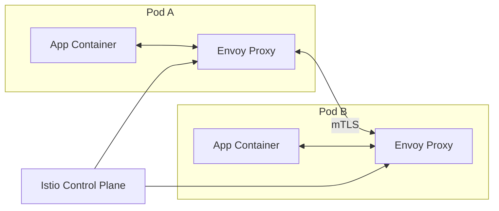

# How to Install Istio Service Mesh on Kubernetes

Author: [nawazdhandala](https://www.github.com/nawazdhandala)

Tags: Istio, Service Mesh, Kubernetes, Ubuntu, Microservices, Traffic Management, mTLS, Observability, DevOps

Description: A comprehensive guide to installing and configuring Istio service mesh on Ubuntu Kubernetes clusters, covering traffic management, security, and observability features.

---

Managing microservices communication at scale is hard. Service mesh solves this by handling service-to-service networking at the infrastructure layer. Istio is the most popular service mesh, providing traffic management, security, and observability without changing application code.

## What is Istio and Why Use a Service Mesh?

Istio is an open-source service mesh that layers transparently onto existing distributed applications. It provides a uniform way to secure, connect, and monitor microservices.

### Service Mesh Benefits

A service mesh addresses several critical challenges in microservices architectures:

- **Traffic Management**: Fine-grained control over traffic behavior with routing rules, retries, failovers, and fault injection
- **Security**: Automatic mTLS encryption, authentication, and authorization between services
- **Observability**: Automatic metrics, logs, and traces for all service communication
- **Resilience**: Circuit breaking, timeouts, and retries without code changes
- **Policy Enforcement**: Rate limiting, access control, and quota management

### How Istio Works

Istio uses a sidecar proxy pattern. Each pod gets an Envoy proxy container injected alongside the application container. All traffic flows through this proxy, enabling Istio to implement its features.



## Prerequisites

Before installing Istio, ensure your environment meets these requirements.

### System Requirements

Your Kubernetes cluster should have adequate resources for Istio components.

```bash
# Check Kubernetes version (Istio 1.20+ requires Kubernetes 1.26+)
kubectl version --short

# Verify cluster has at least 4 CPUs and 8GB RAM available
kubectl top nodes
```

### Install Required Tools

Install kubectl and Helm if not already present on your Ubuntu system.

```bash
# Install kubectl
curl -LO "https://dl.k8s.io/release/$(curl -L -s https://dl.k8s.io/release/stable.txt)/bin/linux/amd64/kubectl"
sudo install -o root -g root -m 0755 kubectl /usr/local/bin/kubectl

# Install Helm
curl https://raw.githubusercontent.com/helm/helm/main/scripts/get-helm-3 | bash
```

### Verify Cluster Access

Confirm you can access your Kubernetes cluster.

```bash
# Check cluster connectivity
kubectl cluster-info

# Verify you have admin permissions
kubectl auth can-i create namespace --all-namespaces
```

## Installation with istioctl

The `istioctl` CLI is the recommended way to install Istio for most use cases.

### Download and Install istioctl

Download the latest Istio release and add istioctl to your PATH.

```bash
# Download Istio (replace version as needed)
curl -L https://istio.io/downloadIstio | ISTIO_VERSION=1.20.0 sh -

# Move to Istio directory
cd istio-1.20.0

# Add istioctl to PATH
export PATH=$PWD/bin:$PATH

# Verify installation
istioctl version
```

### Install Istio with Default Profile

Istio provides several configuration profiles for different use cases. The `demo` profile is good for learning, while `default` is recommended for production.

```bash
# View available profiles
istioctl profile list

# Install with demo profile (includes all features for testing)
istioctl install --set profile=demo -y

# For production, use the default profile
# istioctl install --set profile=default -y
```

### Verify Installation

Check that all Istio components are running properly.

```bash
# Check Istio system pods
kubectl get pods -n istio-system

# Verify Istio installation
istioctl verify-install

# Check Istio version deployed
istioctl version
```

Expected output shows istiod, ingress gateway, and egress gateway pods running:

```
NAME                                    READY   STATUS    RESTARTS   AGE
istio-egressgateway-5c49f9c6c7-xxxxx    1/1     Running   0          2m
istio-ingressgateway-7df94b6d65-xxxxx   1/1     Running   0          2m
istiod-7f8c6d6f6b-xxxxx                 1/1     Running   0          2m
```

## Installing with Helm

Helm provides more flexibility for customizing Istio installation and integrates well with GitOps workflows.

### Add Istio Helm Repository

Configure Helm to access the official Istio charts.

```bash
# Add Istio Helm repository
helm repo add istio https://istio-release.storage.googleapis.com/charts
helm repo update
```

### Install Istio Base Components

Install Istio in stages: base CRDs, istiod control plane, then gateways.

```bash
# Create istio-system namespace
kubectl create namespace istio-system

# Install Istio base (CRDs and cluster-wide resources)
helm install istio-base istio/base -n istio-system --wait
```

### Install Istiod Control Plane

Deploy the Istio control plane (istiod) with your desired configuration.

```bash
# Install istiod with custom values
helm install istiod istio/istiod -n istio-system --wait \
  --set pilot.resources.requests.memory=512Mi \
  --set pilot.resources.requests.cpu=250m \
  --set global.proxy.resources.requests.cpu=50m \
  --set global.proxy.resources.requests.memory=64Mi
```

### Install Istio Ingress Gateway

Deploy the ingress gateway for external traffic entry.

```bash
# Create namespace for ingress gateway
kubectl create namespace istio-ingress

# Install ingress gateway
helm install istio-ingress istio/gateway -n istio-ingress --wait \
  --set service.type=LoadBalancer
```

### Custom Helm Values File

For production deployments, use a values file to manage configuration.

```yaml
# istio-values.yaml
# Custom configuration for production Istio deployment

global:
  # Enable access logging for debugging
  proxy:
    accessLogFile: /dev/stdout
    resources:
      requests:
        cpu: 100m
        memory: 128Mi
      limits:
        cpu: 500m
        memory: 256Mi

pilot:
  # Istiod resource allocation
  resources:
    requests:
      cpu: 500m
      memory: 1Gi
    limits:
      cpu: 1000m
      memory: 2Gi
  # Enable protocol sniffing
  enableProtocolSniffingForInbound: true
  enableProtocolSniffingForOutbound: true

meshConfig:
  # Enable distributed tracing
  enableTracing: true
  defaultConfig:
    tracing:
      sampling: 100.0
  # Access log format
  accessLogFormat: |
    [%START_TIME%] "%REQ(:METHOD)% %REQ(X-ENVOY-ORIGINAL-PATH?:PATH)% %PROTOCOL%"
    %RESPONSE_CODE% %RESPONSE_FLAGS% %BYTES_RECEIVED% %BYTES_SENT%
    %DURATION% "%REQ(X-FORWARDED-FOR)%" "%REQ(USER-AGENT)%"
    "%REQ(X-REQUEST-ID)%" "%REQ(:AUTHORITY)%" "%UPSTREAM_HOST%"
```

Install using the values file:

```bash
helm install istiod istio/istiod -n istio-system -f istio-values.yaml --wait
```

## Sidecar Injection Configuration

Istio requires the Envoy sidecar proxy in each pod. Configure automatic or manual injection.

### Automatic Sidecar Injection

Enable automatic injection by labeling namespaces. Any pod created in labeled namespaces gets a sidecar automatically.

```bash
# Enable automatic injection for a namespace
kubectl label namespace default istio-injection=enabled

# Verify label
kubectl get namespace -L istio-injection

# Restart existing deployments to inject sidecars
kubectl rollout restart deployment -n default
```

### Manual Sidecar Injection

For more control, inject sidecars manually using istioctl.

```bash
# Inject sidecar into a deployment manifest
istioctl kube-inject -f deployment.yaml | kubectl apply -f -

# Or inject into running deployment
kubectl get deployment myapp -o yaml | istioctl kube-inject -f - | kubectl apply -f -
```

### Selective Injection with Annotations

Control injection at the pod level using annotations.

```yaml
# deployment-with-sidecar.yaml
# Deployment with explicit sidecar injection enabled
apiVersion: apps/v1
kind: Deployment
metadata:
  name: myapp
spec:
  replicas: 3
  selector:
    matchLabels:
      app: myapp
  template:
    metadata:
      labels:
        app: myapp
      annotations:
        # Explicitly enable sidecar injection
        sidecar.istio.io/inject: "true"
        # Configure sidecar resources
        sidecar.istio.io/proxyCPU: "100m"
        sidecar.istio.io/proxyMemory: "128Mi"
    spec:
      containers:
        - name: myapp
          image: myapp:latest
          ports:
            - containerPort: 8080
```

### Exclude Pods from Injection

Some pods should not have sidecars (init containers, jobs, etc.).

```yaml
# pod-without-sidecar.yaml
# Pod explicitly excluded from sidecar injection
apiVersion: v1
kind: Pod
metadata:
  name: no-sidecar-pod
  annotations:
    sidecar.istio.io/inject: "false"
spec:
  containers:
    - name: mycontainer
      image: busybox
      command: ["sleep", "3600"]
```

## Traffic Management

Istio's traffic management features let you control how requests flow between services.

### VirtualService

VirtualService defines routing rules for traffic destined to a service.

```yaml
# virtualservice-routing.yaml
# Route traffic based on HTTP headers and paths
apiVersion: networking.istio.io/v1beta1
kind: VirtualService
metadata:
  name: reviews-routing
  namespace: default
spec:
  # Services this VirtualService applies to
  hosts:
    - reviews
  http:
    # Route requests with specific header to v2
    - match:
        - headers:
            end-user:
              exact: jason
      route:
        - destination:
            host: reviews
            subset: v2
    # Route requests to /api/v2 path to v2
    - match:
        - uri:
            prefix: /api/v2
      route:
        - destination:
            host: reviews
            subset: v2
    # Default route to v1
    - route:
        - destination:
            host: reviews
            subset: v1
```

### DestinationRule

DestinationRule defines policies that apply to traffic after routing.

```yaml
# destinationrule-subsets.yaml
# Define service subsets and load balancing policies
apiVersion: networking.istio.io/v1beta1
kind: DestinationRule
metadata:
  name: reviews-destination
  namespace: default
spec:
  host: reviews
  # Traffic policy for all subsets
  trafficPolicy:
    connectionPool:
      tcp:
        maxConnections: 100
      http:
        h2UpgradePolicy: UPGRADE
        http1MaxPendingRequests: 100
        http2MaxRequests: 1000
    loadBalancer:
      simple: ROUND_ROBIN
  # Define subsets based on labels
  subsets:
    - name: v1
      labels:
        version: v1
    - name: v2
      labels:
        version: v2
      # Override traffic policy for v2
      trafficPolicy:
        loadBalancer:
          simple: LEAST_REQUEST
    - name: v3
      labels:
        version: v3
```

### Weighted Traffic Splitting

Distribute traffic between service versions by percentage.

```yaml
# virtualservice-weighted.yaml
# Split traffic between versions using weights
apiVersion: networking.istio.io/v1beta1
kind: VirtualService
metadata:
  name: reviews-weighted
  namespace: default
spec:
  hosts:
    - reviews
  http:
    - route:
        # Send 80% of traffic to v1
        - destination:
            host: reviews
            subset: v1
          weight: 80
        # Send 20% of traffic to v2
        - destination:
            host: reviews
            subset: v2
          weight: 20
```

### Request Timeouts and Retries

Configure timeouts and automatic retries for resilience.

```yaml
# virtualservice-resilience.yaml
# Configure timeouts and retry policies
apiVersion: networking.istio.io/v1beta1
kind: VirtualService
metadata:
  name: ratings-resilience
  namespace: default
spec:
  hosts:
    - ratings
  http:
    - route:
        - destination:
            host: ratings
            subset: v1
      # Request timeout
      timeout: 10s
      # Retry configuration
      retries:
        # Number of retry attempts
        attempts: 3
        # Timeout per retry attempt
        perTryTimeout: 2s
        # Conditions that trigger retry
        retryOn: gateway-error,connect-failure,refused-stream,5xx
```

## Canary Deployments

Canary deployments let you gradually roll out changes to a small subset of users before full deployment.

### Basic Canary Setup

Start by sending a small percentage of traffic to the new version.

```yaml
# canary-deployment.yaml
# Canary deployment with 10% traffic to new version
apiVersion: networking.istio.io/v1beta1
kind: VirtualService
metadata:
  name: myapp-canary
  namespace: default
spec:
  hosts:
    - myapp
  http:
    - route:
        # Stable version gets 90% of traffic
        - destination:
            host: myapp
            subset: stable
          weight: 90
        # Canary version gets 10% of traffic
        - destination:
            host: myapp
            subset: canary
          weight: 10
---
apiVersion: networking.istio.io/v1beta1
kind: DestinationRule
metadata:
  name: myapp-versions
  namespace: default
spec:
  host: myapp
  subsets:
    - name: stable
      labels:
        version: v1
    - name: canary
      labels:
        version: v2
```

### Header-Based Canary

Route specific users to the canary based on headers.

```yaml
# canary-header-based.yaml
# Route internal testers to canary version using headers
apiVersion: networking.istio.io/v1beta1
kind: VirtualService
metadata:
  name: myapp-header-canary
  namespace: default
spec:
  hosts:
    - myapp
  http:
    # Internal testers with special header go to canary
    - match:
        - headers:
            x-canary:
              exact: "true"
      route:
        - destination:
            host: myapp
            subset: canary
    # All other traffic goes to stable
    - route:
        - destination:
            host: myapp
            subset: stable
```

### Progressive Canary Rollout Script

Automate canary rollout with gradual traffic increases.

```bash
#!/bin/bash
# canary-rollout.sh
# Progressive canary rollout script

SERVICE="myapp"
NAMESPACE="default"
INCREMENTS=(10 25 50 75 100)
PAUSE_SECONDS=300

for WEIGHT in "${INCREMENTS[@]}"; do
    STABLE_WEIGHT=$((100 - WEIGHT))

    echo "Setting canary weight to ${WEIGHT}%..."

    kubectl apply -f - <<EOF
apiVersion: networking.istio.io/v1beta1
kind: VirtualService
metadata:
  name: ${SERVICE}-canary
  namespace: ${NAMESPACE}
spec:
  hosts:
    - ${SERVICE}
  http:
    - route:
        - destination:
            host: ${SERVICE}
            subset: stable
          weight: ${STABLE_WEIGHT}
        - destination:
            host: ${SERVICE}
            subset: canary
          weight: ${WEIGHT}
EOF

    if [ $WEIGHT -lt 100 ]; then
        echo "Waiting ${PAUSE_SECONDS} seconds before next increment..."
        echo "Monitor metrics and abort if errors increase."
        sleep $PAUSE_SECONDS
    fi
done

echo "Canary rollout complete. Canary is now receiving 100% of traffic."
```

## Circuit Breaking

Circuit breaking prevents cascade failures by stopping requests to unhealthy services.

### Configure Circuit Breaker

Set connection limits and outlier detection thresholds.

```yaml
# circuit-breaker.yaml
# Circuit breaker configuration with connection pooling and outlier detection
apiVersion: networking.istio.io/v1beta1
kind: DestinationRule
metadata:
  name: reviews-circuit-breaker
  namespace: default
spec:
  host: reviews
  trafficPolicy:
    # Connection pool settings
    connectionPool:
      tcp:
        # Maximum number of TCP connections
        maxConnections: 100
      http:
        # Maximum pending HTTP requests
        http1MaxPendingRequests: 100
        # Maximum HTTP/2 requests
        http2MaxRequests: 1000
        # Maximum requests per connection
        maxRequestsPerConnection: 10
        # Maximum retries
        maxRetries: 3
    # Outlier detection (circuit breaker trigger)
    outlierDetection:
      # Check interval
      interval: 10s
      # Number of consecutive errors before ejection
      consecutive5xxErrors: 5
      # Minimum ejection time
      baseEjectionTime: 30s
      # Maximum percentage of hosts that can be ejected
      maxEjectionPercent: 50
      # Minimum healthy hosts in load balancing pool
      minHealthPercent: 30
```

### Test Circuit Breaker

Use fortio to generate load and test circuit breaking behavior.

```bash
# Deploy fortio load testing tool
kubectl apply -f https://raw.githubusercontent.com/istio/istio/release-1.20/samples/httpbin/sample-client/fortio-deploy.yaml

# Get fortio pod name
FORTIO_POD=$(kubectl get pods -l app=fortio -o jsonpath='{.items[0].metadata.name}')

# Send requests with concurrency to trigger circuit breaker
kubectl exec "$FORTIO_POD" -c fortio -- \
  fortio load -c 50 -qps 100 -n 1000 \
  http://reviews:9080/reviews/0

# Check for circuit breaker trips in the output
# Look for "overflow" errors indicating circuit breaker activation
```

### Monitor Circuit Breaker Status

Query Envoy metrics to see circuit breaker state.

```bash
# Get a pod with the sidecar
POD=$(kubectl get pods -l app=reviews -o jsonpath='{.items[0].metadata.name}')

# Check upstream connection pool stats
kubectl exec "$POD" -c istio-proxy -- \
  curl -s localhost:15000/stats | grep -E 'circuit_breaker|overflow|pending'

# Check cluster health
kubectl exec "$POD" -c istio-proxy -- \
  curl -s localhost:15000/clusters | grep -E 'health_flags|outlier'
```

## mTLS Configuration

Istio can automatically encrypt all service-to-service traffic using mutual TLS.

### Enable Strict mTLS

Require mTLS for all communication in the mesh.

```yaml
# mtls-strict.yaml
# Enforce strict mTLS for the entire mesh
apiVersion: security.istio.io/v1beta1
kind: PeerAuthentication
metadata:
  name: default
  namespace: istio-system
spec:
  # STRICT: Only accept mTLS traffic
  # PERMISSIVE: Accept both plaintext and mTLS
  # DISABLE: Only accept plaintext
  mtls:
    mode: STRICT
```

### Namespace-Level mTLS

Configure mTLS mode per namespace.

```yaml
# mtls-namespace.yaml
# Enable strict mTLS for production namespace only
apiVersion: security.istio.io/v1beta1
kind: PeerAuthentication
metadata:
  name: production-mtls
  namespace: production
spec:
  mtls:
    mode: STRICT
---
# Allow permissive mode in staging for debugging
apiVersion: security.istio.io/v1beta1
kind: PeerAuthentication
metadata:
  name: staging-mtls
  namespace: staging
spec:
  mtls:
    mode: PERMISSIVE
```

### Workload-Specific mTLS

Configure mTLS for specific workloads or ports.

```yaml
# mtls-workload.yaml
# Configure mTLS per workload with port-level exceptions
apiVersion: security.istio.io/v1beta1
kind: PeerAuthentication
metadata:
  name: database-mtls
  namespace: production
spec:
  # Apply to specific workload
  selector:
    matchLabels:
      app: postgres
  mtls:
    mode: STRICT
  # Port-level overrides
  portLevelMtls:
    # Disable mTLS for health check port
    9090:
      mode: DISABLE
```

### Authorization Policies

Control which services can communicate with each other.

```yaml
# authz-policy.yaml
# Allow only frontend to access the API service
apiVersion: security.istio.io/v1beta1
kind: AuthorizationPolicy
metadata:
  name: api-access
  namespace: production
spec:
  # Apply to API workload
  selector:
    matchLabels:
      app: api
  # Allow action (default is DENY all if not specified)
  action: ALLOW
  rules:
    - from:
        # Only allow requests from frontend service account
        - source:
            principals:
              - cluster.local/ns/production/sa/frontend
      to:
        # Only allow specific paths and methods
        - operation:
            methods: ["GET", "POST"]
            paths: ["/api/*"]
```

### Verify mTLS Status

Check that mTLS is working correctly between services.

```bash
# Check mTLS status for all workloads
istioctl x authz check deployment/reviews -n default

# View TLS configuration in Envoy
istioctl proxy-config secret deployment/reviews -n default

# Check if connections are using mTLS
kubectl exec -n default deployment/reviews -c istio-proxy -- \
  curl -s localhost:15000/stats | grep -E 'ssl.*handshake'
```

## Kiali Dashboard

Kiali provides a visual dashboard for observing your service mesh.

### Install Kiali

Deploy Kiali using the Istio addons.

```bash
# Install Kiali from Istio samples
kubectl apply -f https://raw.githubusercontent.com/istio/istio/release-1.20/samples/addons/kiali.yaml

# Wait for Kiali to be ready
kubectl rollout status deployment/kiali -n istio-system

# Check Kiali pod is running
kubectl get pods -n istio-system -l app=kiali
```

### Access Kiali Dashboard

Port-forward to access Kiali locally.

```bash
# Port-forward Kiali dashboard
kubectl port-forward svc/kiali -n istio-system 20001:20001

# Access at http://localhost:20001
# Default credentials (if not using token auth): admin/admin
```

### Kiali Configuration

Customize Kiali behavior with a ConfigMap.

```yaml
# kiali-config.yaml
# Custom Kiali configuration
apiVersion: v1
kind: ConfigMap
metadata:
  name: kiali
  namespace: istio-system
data:
  config.yaml: |
    auth:
      strategy: anonymous
    external_services:
      prometheus:
        url: http://prometheus:9090
      grafana:
        url: http://grafana:3000
      tracing:
        url: http://jaeger-query:16686
    server:
      web_root: /kiali
    deployment:
      accessible_namespaces:
        - "**"
```

### Kiali Features

Kiali provides several useful visualizations:

- **Graph**: Interactive service topology showing traffic flow
- **Applications**: Group services by application labels
- **Workloads**: View individual deployments and pods
- **Services**: Examine service configurations
- **Istio Config**: Validate VirtualServices, DestinationRules, etc.
- **Health**: Traffic health indicators (error rates, latency)

## Jaeger Tracing Integration

Distributed tracing helps you understand request flow across microservices.

### Install Jaeger

Deploy Jaeger for distributed tracing.

```bash
# Install Jaeger from Istio samples
kubectl apply -f https://raw.githubusercontent.com/istio/istio/release-1.20/samples/addons/jaeger.yaml

# Wait for Jaeger to be ready
kubectl rollout status deployment/jaeger -n istio-system
```

### Configure Tracing Sampling

Set the sampling rate for traces.

```yaml
# tracing-config.yaml
# Configure Istio tracing settings
apiVersion: install.istio.io/v1alpha1
kind: IstioOperator
metadata:
  name: istio-tracing
spec:
  meshConfig:
    # Enable tracing
    enableTracing: true
    defaultConfig:
      tracing:
        # Sample 100% of traces (reduce in production)
        sampling: 100.0
        # Maximum path tag length
        max_path_tag_length: 256
    # Configure tracing provider
    extensionProviders:
      - name: jaeger
        zipkin:
          service: jaeger-collector.istio-system.svc.cluster.local
          port: 9411
```

### Access Jaeger UI

Port-forward to access Jaeger dashboard.

```bash
# Port-forward Jaeger UI
kubectl port-forward svc/tracing -n istio-system 16686:80

# Access at http://localhost:16686
```

### Propagate Trace Headers

Your application must propagate trace headers for complete traces across services.

```python
# Example: Python Flask app propagating trace headers
from flask import Flask, request
import requests

app = Flask(__name__)

# Headers that Istio uses for tracing
TRACE_HEADERS = [
    'x-request-id',
    'x-b3-traceid',
    'x-b3-spanid',
    'x-b3-parentspanid',
    'x-b3-sampled',
    'x-b3-flags',
    'x-ot-span-context',
    'traceparent',
    'tracestate'
]

@app.route('/api/order')
def create_order():
    # Extract trace headers from incoming request
    headers = {}
    for header in TRACE_HEADERS:
        if header in request.headers:
            headers[header] = request.headers[header]

    # Forward headers to downstream service
    inventory_response = requests.get(
        'http://inventory:8080/check',
        headers=headers
    )

    return {'status': 'created'}
```

### Custom Span Tags

Add custom attributes to traces for better debugging.

```yaml
# custom-tracing.yaml
# Add custom span tags based on request attributes
apiVersion: networking.istio.io/v1beta1
kind: EnvoyFilter
metadata:
  name: custom-tracing-tags
  namespace: istio-system
spec:
  configPatches:
    - applyTo: NETWORK_FILTER
      match:
        context: SIDECAR_INBOUND
        listener:
          filterChain:
            filter:
              name: envoy.filters.network.http_connection_manager
      patch:
        operation: MERGE
        value:
          typed_config:
            "@type": type.googleapis.com/envoy.extensions.filters.network.http_connection_manager.v3.HttpConnectionManager
            tracing:
              custom_tags:
                - tag: user.id
                  request_header:
                    name: x-user-id
                - tag: tenant.id
                  request_header:
                    name: x-tenant-id
```

## Prometheus/Grafana Integration

Monitor your service mesh with Prometheus metrics and Grafana dashboards.

### Install Prometheus

Deploy Prometheus to scrape Istio metrics.

```bash
# Install Prometheus from Istio samples
kubectl apply -f https://raw.githubusercontent.com/istio/istio/release-1.20/samples/addons/prometheus.yaml

# Wait for Prometheus to be ready
kubectl rollout status deployment/prometheus -n istio-system
```

### Install Grafana

Deploy Grafana with pre-built Istio dashboards.

```bash
# Install Grafana from Istio samples
kubectl apply -f https://raw.githubusercontent.com/istio/istio/release-1.20/samples/addons/grafana.yaml

# Wait for Grafana to be ready
kubectl rollout status deployment/grafana -n istio-system
```

### Access Dashboards

Port-forward to access Prometheus and Grafana.

```bash
# Access Prometheus
kubectl port-forward svc/prometheus -n istio-system 9090:9090

# Access Grafana
kubectl port-forward svc/grafana -n istio-system 3000:3000
# Default credentials: admin/admin
```

### Key Istio Metrics

Prometheus collects these important Istio metrics:

```promql
# Request rate by service
sum(rate(istio_requests_total[5m])) by (destination_service_name)

# Error rate by service
sum(rate(istio_requests_total{response_code=~"5.*"}[5m])) by (destination_service_name)
/ sum(rate(istio_requests_total[5m])) by (destination_service_name)

# P99 latency by service
histogram_quantile(0.99,
  sum(rate(istio_request_duration_milliseconds_bucket[5m]))
  by (destination_service_name, le)
)

# TCP connections by service
sum(istio_tcp_connections_opened_total) by (destination_service_name)
- sum(istio_tcp_connections_closed_total) by (destination_service_name)
```

### Custom Grafana Dashboard

Create a custom dashboard for your services.

```json
{
  "dashboard": {
    "title": "Service Health Dashboard",
    "panels": [
      {
        "title": "Request Rate",
        "type": "graph",
        "targets": [
          {
            "expr": "sum(rate(istio_requests_total{destination_service_name=\"myapp\"}[5m]))",
            "legendFormat": "Requests/sec"
          }
        ]
      },
      {
        "title": "Error Rate",
        "type": "stat",
        "targets": [
          {
            "expr": "sum(rate(istio_requests_total{destination_service_name=\"myapp\",response_code=~\"5.*\"}[5m])) / sum(rate(istio_requests_total{destination_service_name=\"myapp\"}[5m])) * 100",
            "legendFormat": "Error %"
          }
        ]
      },
      {
        "title": "P99 Latency",
        "type": "gauge",
        "targets": [
          {
            "expr": "histogram_quantile(0.99, sum(rate(istio_request_duration_milliseconds_bucket{destination_service_name=\"myapp\"}[5m])) by (le))",
            "legendFormat": "P99 ms"
          }
        ]
      }
    ]
  }
}
```

### Alerting Rules

Configure Prometheus alerts for Istio metrics.

```yaml
# prometheus-alerts.yaml
# Alerting rules for Istio service health
apiVersion: monitoring.coreos.com/v1
kind: PrometheusRule
metadata:
  name: istio-alerts
  namespace: istio-system
spec:
  groups:
    - name: istio-service-health
      rules:
        # High error rate alert
        - alert: HighErrorRate
          expr: |
            sum(rate(istio_requests_total{response_code=~"5.*"}[5m])) by (destination_service_name)
            / sum(rate(istio_requests_total[5m])) by (destination_service_name) > 0.05
          for: 5m
          labels:
            severity: critical
          annotations:
            summary: "High error rate for {{ $labels.destination_service_name }}"
            description: "Error rate is {{ $value | humanizePercentage }} for service {{ $labels.destination_service_name }}"

        # High latency alert
        - alert: HighLatency
          expr: |
            histogram_quantile(0.99,
              sum(rate(istio_request_duration_milliseconds_bucket[5m]))
              by (destination_service_name, le)) > 1000
          for: 5m
          labels:
            severity: warning
          annotations:
            summary: "High latency for {{ $labels.destination_service_name }}"
            description: "P99 latency is {{ $value }}ms for service {{ $labels.destination_service_name }}"

        # Circuit breaker tripped
        - alert: CircuitBreakerTripped
          expr: |
            sum(increase(envoy_cluster_upstream_cx_overflow[5m])) by (cluster_name) > 0
          for: 1m
          labels:
            severity: warning
          annotations:
            summary: "Circuit breaker tripped for {{ $labels.cluster_name }}"
```

## Troubleshooting

Common issues and how to resolve them.

### Sidecar Not Injected

Pods not getting the Envoy sidecar injected.

```bash
# Check namespace label
kubectl get namespace default -L istio-injection

# If missing, add the label
kubectl label namespace default istio-injection=enabled

# Check webhook configuration
kubectl get mutatingwebhookconfiguration istio-sidecar-injector -o yaml

# Verify istiod is healthy
kubectl get pods -n istio-system -l app=istiod

# Check injection logs
kubectl logs -n istio-system -l app=istiod -c discovery | grep -i inject
```

### Service Communication Failing

Services cannot communicate through the mesh.

```bash
# Check if both pods have sidecars
kubectl get pods -o jsonpath='{range .items[*]}{.metadata.name}{"\t"}{range .spec.containers[*]}{.name}{" "}{end}{"\n"}{end}'

# Verify mTLS status
istioctl authn tls-check <pod-name>.<namespace>

# Check Envoy listener configuration
istioctl proxy-config listeners <pod-name>.<namespace>

# Check Envoy cluster configuration
istioctl proxy-config cluster <pod-name>.<namespace>

# Look for errors in proxy logs
kubectl logs <pod-name> -c istio-proxy | grep -i error
```

### VirtualService Not Working

Traffic routing rules not being applied.

```bash
# Validate Istio configuration
istioctl analyze -n default

# Check VirtualService is applied
kubectl get virtualservice -n default

# Verify service exists and matches
kubectl get svc -n default

# Check if host matches exactly
kubectl describe virtualservice <name> -n default

# Debug with proxy config
istioctl proxy-config routes <pod-name>.<namespace> -o json | jq '.[] | select(.name=="80")'
```

### High Latency Issues

Requests taking longer than expected.

```bash
# Check proxy resource usage
kubectl top pods -n default --containers

# Look for connection pooling issues
kubectl exec <pod-name> -c istio-proxy -- curl localhost:15000/stats | grep -E 'overflow|pending|timeout'

# Check for retries
kubectl exec <pod-name> -c istio-proxy -- curl localhost:15000/stats | grep retry

# Analyze slow requests with tracing
# Open Jaeger and look for spans with high duration
```

### Certificate Issues

mTLS certificate errors or expiration.

```bash
# Check certificate status
istioctl proxy-config secret <pod-name>.<namespace>

# View certificate details
kubectl exec <pod-name> -c istio-proxy -- \
  cat /var/run/secrets/istio/root-cert.pem | openssl x509 -text -noout

# Check certificate expiration
kubectl exec <pod-name> -c istio-proxy -- \
  openssl s_client -connect localhost:15021 2>/dev/null | openssl x509 -noout -dates

# Restart istiod to regenerate certificates
kubectl rollout restart deployment/istiod -n istio-system
```

### Debug Proxy Configuration

Comprehensive proxy debugging commands.

```bash
# Full proxy config dump
istioctl proxy-config all <pod-name>.<namespace> -o json > proxy-config.json

# Check bootstrap configuration
istioctl proxy-config bootstrap <pod-name>.<namespace>

# View endpoint resolution
istioctl proxy-config endpoint <pod-name>.<namespace>

# Analyze configuration sync status
istioctl proxy-status

# Open Envoy admin interface
kubectl port-forward <pod-name> 15000:15000
# Then visit http://localhost:15000 for full Envoy admin
```

### Common Error Messages

Reference for common error messages and solutions:

| Error | Cause | Solution |
|-------|-------|----------|
| `upstream connect error` | Service unreachable | Check service exists, ports match |
| `no healthy upstream` | All endpoints unhealthy | Check pod health, circuit breaker |
| `503 UO` | Circuit breaker open | Reduce load, increase limits |
| `503 UC` | Upstream connection failure | Check network policies, mTLS |
| `504 UT` | Upstream timeout | Increase timeout, check service |
| `TLS error` | Certificate mismatch | Check mTLS mode, restart pods |

---

Istio is a powerful tool for managing microservices, but it adds complexity. Start simple with traffic management, then add security and observability features as needed. The investment pays off when you need fine-grained control over service communication.

For comprehensive monitoring of your Istio service mesh and Kubernetes clusters, consider [OneUptime](https://oneuptime.com). OneUptime provides unified observability with metrics, logs, and traces integration, automated alerting, and status pages to keep your team and users informed. It integrates seamlessly with Prometheus, Jaeger, and other observability tools in your Istio ecosystem, giving you a single pane of glass for monitoring your entire infrastructure.
