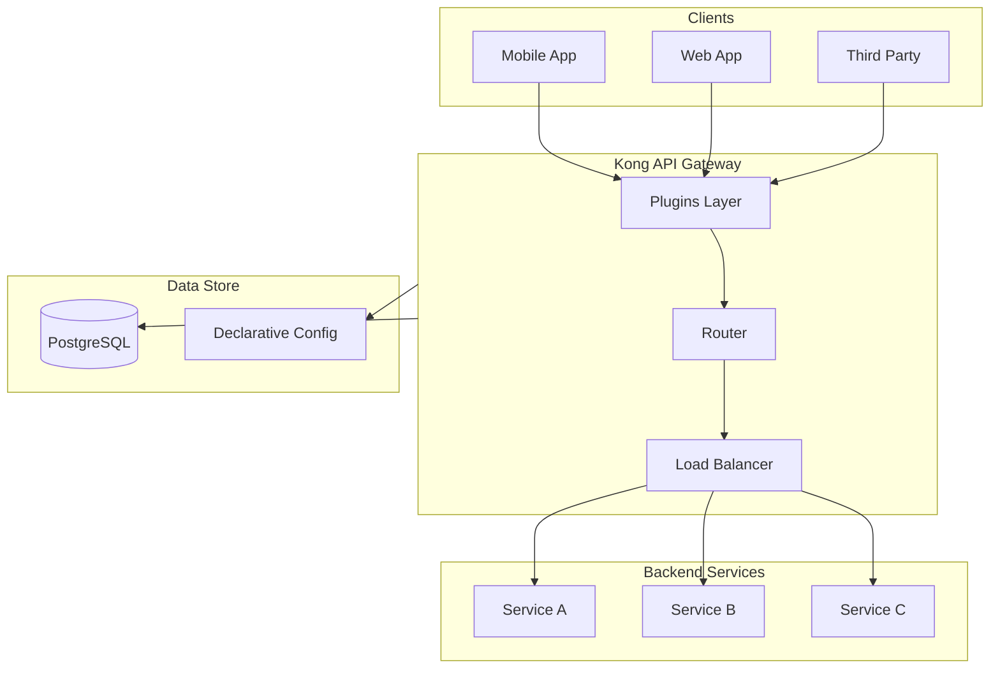

# How to Install Kong API Gateway on Ubuntu

Author: [nawazdhandala](https://www.github.com/nawazdhandala)

Tags: Kong, API Gateway, Ubuntu, Microservices, Load Balancing, Authentication, Rate Limiting, DevOps

Description: A comprehensive guide to installing, configuring, and managing Kong API Gateway on Ubuntu with database and DB-less modes, authentication, plugins, and monitoring.

---

Kong is the most popular open-source API gateway, handling over a trillion API calls monthly across organizations worldwide. It sits between your clients and backend services, managing traffic, authentication, rate limiting, and more. This guide walks you through everything from installation to production-ready configuration.

## What is Kong API Gateway?

Kong is a cloud-native, platform-agnostic API gateway built on top of NGINX and OpenResty. It acts as a reverse proxy that routes client requests to appropriate backend services while applying policies like authentication, rate limiting, and transformation.

### Kong Architecture



### Key Concepts

- **Services**: Represent your upstream APIs and microservices
- **Routes**: Define how requests reach services based on hosts, paths, and methods
- **Plugins**: Extend functionality (authentication, rate limiting, logging, etc.)
- **Consumers**: Represent users or applications consuming your APIs
- **Upstreams**: Define load balancing targets for services

## Prerequisites

Before installing Kong, ensure your system meets these requirements.

Update your Ubuntu system and install required dependencies:

```bash
# Update package lists and upgrade existing packages
sudo apt update && sudo apt upgrade -y

# Install essential dependencies
sudo apt install -y curl gnupg2 lsb-release apt-transport-https ca-certificates
```

Check your Ubuntu version to ensure compatibility:

```bash
# Kong supports Ubuntu 20.04, 22.04, and 24.04 LTS
lsb_release -a
```

Verify system resources (Kong recommends at least 2GB RAM for production):

```bash
# Check available memory
free -h

# Check disk space
df -h
```

## Installing Kong on Ubuntu

Kong can run in two modes: with a database (PostgreSQL/Cassandra) or DB-less (declarative configuration). We'll cover both approaches.

### Method 1: Installing Kong with APT Repository

Add the official Kong APT repository and install Kong:

```bash
# Download and add Kong's GPG key
curl -1sLf "https://packages.konghq.com/public/gateway-37/gpg.034C0BBC1E498C9F.key" | \
  sudo gpg --dearmor -o /usr/share/keyrings/kong-gateway-37-archive-keyring.gpg

# Add Kong's APT repository
echo "deb [signed-by=/usr/share/keyrings/kong-gateway-37-archive-keyring.gpg] \
  https://packages.konghq.com/public/gateway-37/deb/ubuntu $(lsb_release -cs) main" | \
  sudo tee /etc/apt/sources.list.d/kong-gateway-37.list > /dev/null

# Update package lists and install Kong
sudo apt update
sudo apt install -y kong-enterprise-edition
```

### Method 2: Installing Kong from Package

Download and install Kong directly from a package file:

```bash
# Download Kong package for Ubuntu 22.04 (adjust version as needed)
curl -Lo kong.deb "https://packages.konghq.com/public/gateway-37/deb/ubuntu/pool/jammy/main/k/ko/kong-enterprise-edition_3.7.1.2/kong-enterprise-edition_3.7.1.2_amd64.deb"

# Install the package
sudo apt install -y ./kong.deb

# Clean up
rm kong.deb
```

Verify Kong installation:

```bash
# Check Kong version
kong version

# View available Kong commands
kong --help
```

## PostgreSQL Database Setup

For production deployments, Kong with PostgreSQL provides better consistency and supports clustering.

### Installing PostgreSQL

Install and configure PostgreSQL for Kong:

```bash
# Install PostgreSQL 15
sudo apt install -y postgresql-15 postgresql-contrib-15

# Start and enable PostgreSQL service
sudo systemctl start postgresql
sudo systemctl enable postgresql

# Verify PostgreSQL is running
sudo systemctl status postgresql
```

### Creating Kong Database and User

Create a dedicated database and user for Kong:

```bash
# Switch to postgres user and create Kong database
sudo -u postgres psql <<EOF
-- Create Kong user with password
CREATE USER kong WITH PASSWORD 'your_secure_password_here';

-- Create Kong database
CREATE DATABASE kong OWNER kong;

-- Grant all privileges to kong user
GRANT ALL PRIVILEGES ON DATABASE kong TO kong;

-- Exit psql
\q
EOF
```

Configure PostgreSQL to allow Kong connections by editing pg_hba.conf:

```bash
# Find PostgreSQL configuration directory
sudo find /etc/postgresql -name pg_hba.conf

# Add this line to allow local connections (edit the file found above)
# local   kong        kong                                    md5
# host    kong        kong        127.0.0.1/32               md5

# Restart PostgreSQL to apply changes
sudo systemctl restart postgresql
```

## Kong Configuration

Kong's main configuration file is located at `/etc/kong/kong.conf`. Let's configure it properly.

### Database Mode Configuration

Create and configure Kong with PostgreSQL:

```bash
# Copy the default configuration template
sudo cp /etc/kong/kong.conf.default /etc/kong/kong.conf

# Edit the configuration file
sudo nano /etc/kong/kong.conf
```

Add or modify these essential configuration options:

```bash
# /etc/kong/kong.conf - Database mode configuration

#------------------------------------------------------------------------------
# DATASTORE
#------------------------------------------------------------------------------

# Specify PostgreSQL as the database
database = postgres

# PostgreSQL connection settings
pg_host = 127.0.0.1
pg_port = 5432
pg_user = kong
pg_password = your_secure_password_here
pg_database = kong

# Connection pool settings for better performance
pg_pool_size = 100
pg_backlog = 1000
pg_timeout = 5000

#------------------------------------------------------------------------------
# NGINX
#------------------------------------------------------------------------------

# Proxy listener configuration
proxy_listen = 0.0.0.0:8000, 0.0.0.0:8443 ssl

# Admin API listener (restrict to localhost in production)
admin_listen = 127.0.0.1:8001, 127.0.0.1:8444 ssl

#------------------------------------------------------------------------------
# LOGGING
#------------------------------------------------------------------------------

# Log level: debug, info, notice, warn, error, crit
log_level = notice

# Proxy access logs location
proxy_access_log = /var/log/kong/access.log
proxy_error_log = /var/log/kong/error.log
admin_access_log = /var/log/kong/admin_access.log
admin_error_log = /var/log/kong/admin_error.log
```

Create log directory and set permissions:

```bash
# Create Kong log directory
sudo mkdir -p /var/log/kong
sudo chown kong:kong /var/log/kong
```

### Bootstrap the Database

Initialize Kong's database schema:

```bash
# Run database migrations
sudo kong migrations bootstrap -c /etc/kong/kong.conf

# If upgrading Kong, run migrations upgrade instead
# sudo kong migrations up -c /etc/kong/kong.conf
# sudo kong migrations finish -c /etc/kong/kong.conf
```

### Start Kong

Start Kong and verify it's running:

```bash
# Start Kong
sudo kong start -c /etc/kong/kong.conf

# Check Kong status
sudo kong health

# Verify Kong is listening on expected ports
ss -tlnp | grep -E '8000|8001|8443|8444'
```

Test the Admin API:

```bash
# Query Kong Admin API
curl -s http://localhost:8001/ | jq '.version, .hostname'

# Check Kong status endpoint
curl -s http://localhost:8001/status | jq
```

### DB-less Mode Configuration

For simpler deployments or Kubernetes environments, DB-less mode uses declarative YAML configuration.

Configure Kong for DB-less mode:

```bash
# /etc/kong/kong.conf - DB-less mode configuration

#------------------------------------------------------------------------------
# DATASTORE
#------------------------------------------------------------------------------

# Use DB-less mode
database = off

# Path to declarative configuration file
declarative_config = /etc/kong/kong.yml

#------------------------------------------------------------------------------
# NGINX
#------------------------------------------------------------------------------

proxy_listen = 0.0.0.0:8000, 0.0.0.0:8443 ssl
admin_listen = 127.0.0.1:8001, 127.0.0.1:8444 ssl
```

## Creating Services and Routes

Services represent your backend APIs, and routes define how requests reach those services.

### Creating a Service

Create a service pointing to your backend API:

```bash
# Create a service for your backend API
# This example creates a service pointing to a user management API
curl -i -X POST http://localhost:8001/services \
  --data "name=user-service" \
  --data "url=http://localhost:3000/api/users"
```

You can also specify individual components:

```bash
# Create service with explicit configuration
curl -i -X POST http://localhost:8001/services \
  --data "name=order-service" \
  --data "protocol=http" \
  --data "host=order-api.internal" \
  --data "port=8080" \
  --data "path=/v1/orders" \
  --data "connect_timeout=60000" \
  --data "write_timeout=60000" \
  --data "read_timeout=60000" \
  --data "retries=5"
```

### Creating Routes

Create routes to expose services to clients:

```bash
# Create a route for the user service
# Requests to /users will be routed to user-service
curl -i -X POST http://localhost:8001/services/user-service/routes \
  --data "name=user-route" \
  --data "paths[]=/users" \
  --data "methods[]=GET" \
  --data "methods[]=POST" \
  --data "methods[]=PUT" \
  --data "methods[]=DELETE" \
  --data "strip_path=true"
```

Create routes with host-based routing:

```bash
# Create a route with host and path matching
curl -i -X POST http://localhost:8001/services/order-service/routes \
  --data "name=order-route" \
  --data "hosts[]=api.example.com" \
  --data "paths[]=/orders" \
  --data "methods[]=GET" \
  --data "methods[]=POST" \
  --data "strip_path=false" \
  --data "preserve_host=true"
```

### Testing Routes

Test your configured routes:

```bash
# Test the user service route
curl -i http://localhost:8000/users

# Test with headers for host-based routing
curl -i http://localhost:8000/orders \
  -H "Host: api.example.com"

# View all configured services
curl -s http://localhost:8001/services | jq '.data[] | {name, host, port, path}'

# View all configured routes
curl -s http://localhost:8001/routes | jq '.data[] | {name, paths, methods, service}'
```

## Kong Plugin System

Plugins are Kong's superpower. They add functionality like authentication, rate limiting, logging, and transformations without modifying your backend services.

### Viewing Available Plugins

List all available plugins:

```bash
# List all available plugins
curl -s http://localhost:8001/ | jq '.plugins.available_on_server | keys'

# View enabled plugins
curl -s http://localhost:8001/plugins | jq '.data[] | {name, service, route, enabled}'
```

### Rate Limiting Plugin

Protect your APIs from abuse with rate limiting:

```bash
# Enable rate limiting globally (applies to all services)
curl -i -X POST http://localhost:8001/plugins \
  --data "name=rate-limiting" \
  --data "config.minute=100" \
  --data "config.hour=1000" \
  --data "config.policy=local"
```

Apply rate limiting to a specific service:

```bash
# Rate limit on specific service
curl -i -X POST http://localhost:8001/services/user-service/plugins \
  --data "name=rate-limiting" \
  --data "config.minute=60" \
  --data "config.hour=500" \
  --data "config.policy=local" \
  --data "config.hide_client_headers=false"
```

Advanced rate limiting with Redis for distributed deployments:

```bash
# Install Redis first
sudo apt install -y redis-server
sudo systemctl enable redis-server
sudo systemctl start redis-server

# Configure rate limiting with Redis backend
curl -i -X POST http://localhost:8001/services/user-service/plugins \
  --data "name=rate-limiting" \
  --data "config.minute=100" \
  --data "config.hour=1000" \
  --data "config.policy=redis" \
  --data "config.redis_host=127.0.0.1" \
  --data "config.redis_port=6379" \
  --data "config.redis_database=0" \
  --data "config.fault_tolerant=true"
```

### Request Transformer Plugin

Modify requests before they reach your backend:

```bash
# Add headers to requests
curl -i -X POST http://localhost:8001/services/user-service/plugins \
  --data "name=request-transformer" \
  --data "config.add.headers[]=X-Request-ID:$(uuidgen)" \
  --data "config.add.headers[]=X-Gateway:kong" \
  --data "config.remove.headers[]=X-Debug" \
  --data "config.rename.headers[]=Authorization:X-Auth-Token"
```

### Response Transformer Plugin

Modify responses before they reach clients:

```bash
# Transform response headers
curl -i -X POST http://localhost:8001/services/user-service/plugins \
  --data "name=response-transformer" \
  --data "config.remove.headers[]=Server" \
  --data "config.remove.headers[]=X-Powered-By" \
  --data "config.add.headers[]=X-Gateway-Response:true" \
  --data "config.add.headers[]=Cache-Control:no-store"
```

### Logging Plugins

Enable comprehensive logging for debugging and monitoring:

```bash
# File logging plugin
curl -i -X POST http://localhost:8001/services/user-service/plugins \
  --data "name=file-log" \
  --data "config.path=/var/log/kong/user-service.log" \
  --data "config.reopen=true"
```

HTTP logging for external log aggregators:

```bash
# HTTP log plugin - send logs to external service
curl -i -X POST http://localhost:8001/services/user-service/plugins \
  --data "name=http-log" \
  --data "config.http_endpoint=http://logstash.internal:5044/kong" \
  --data "config.method=POST" \
  --data "config.timeout=10000" \
  --data "config.keepalive=60000" \
  --data "config.content_type=application/json"
```

TCP/UDP logging for syslog integration:

```bash
# TCP log plugin
curl -i -X POST http://localhost:8001/services/user-service/plugins \
  --data "name=tcp-log" \
  --data "config.host=syslog.internal" \
  --data "config.port=514" \
  --data "config.timeout=10000" \
  --data "config.keepalive=60000"
```

### CORS Plugin

Enable Cross-Origin Resource Sharing:

```bash
# Enable CORS for frontend applications
curl -i -X POST http://localhost:8001/services/user-service/plugins \
  --data "name=cors" \
  --data "config.origins[]=https://app.example.com" \
  --data "config.origins[]=https://staging.example.com" \
  --data "config.methods[]=GET" \
  --data "config.methods[]=POST" \
  --data "config.methods[]=PUT" \
  --data "config.methods[]=DELETE" \
  --data "config.methods[]=OPTIONS" \
  --data "config.headers[]=Content-Type" \
  --data "config.headers[]=Authorization" \
  --data "config.exposed_headers[]=X-Request-Id" \
  --data "config.credentials=true" \
  --data "config.max_age=3600"
```

## JWT Authentication

JSON Web Token (JWT) authentication is ideal for stateless API authentication.

### Creating a Consumer

Create a consumer to represent an API client:

```bash
# Create a consumer for your application
curl -i -X POST http://localhost:8001/consumers \
  --data "username=mobile-app" \
  --data "custom_id=app-001"
```

### Generating JWT Credentials

Create JWT credentials for the consumer:

```bash
# Generate JWT credential with RS256 algorithm
curl -i -X POST http://localhost:8001/consumers/mobile-app/jwt \
  --data "algorithm=RS256" \
  --data "key=mobile-app-key" \
  --data "secret=your-256-bit-secret"
```

For RSA-based JWT, generate and upload keys:

```bash
# Generate RSA key pair
openssl genrsa -out private.pem 2048
openssl rsa -in private.pem -outform PEM -pubout -out public.pem

# Create JWT credential with RSA public key
curl -i -X POST http://localhost:8001/consumers/mobile-app/jwt \
  --data "algorithm=RS256" \
  --data "key=mobile-app-rsa" \
  --data "rsa_public_key=$(cat public.pem)"
```

### Enabling JWT Plugin

Enable JWT authentication on a service or route:

```bash
# Enable JWT plugin on a service
curl -i -X POST http://localhost:8001/services/user-service/plugins \
  --data "name=jwt" \
  --data "config.claims_to_verify[]=exp" \
  --data "config.key_claim_name=iss" \
  --data "config.secret_is_base64=false" \
  --data "config.run_on_preflight=true"
```

### Testing JWT Authentication

Generate and test JWT tokens:

```bash
# Install JWT CLI tool
npm install -g jwt-cli

# Generate a JWT token (adjust payload as needed)
JWT_TOKEN=$(jwt encode \
  --algorithm HS256 \
  --secret "your-256-bit-secret" \
  --exp "+1h" \
  --iss "mobile-app-key" \
  '{"sub": "user-123", "name": "John Doe"}')

echo "JWT Token: $JWT_TOKEN"

# Test authenticated request
curl -i http://localhost:8000/users \
  -H "Authorization: Bearer $JWT_TOKEN"

# Test without token (should return 401)
curl -i http://localhost:8000/users
```

## Key Authentication

Key authentication (API keys) is simpler than JWT and suitable for server-to-server communication.

### Creating API Keys

Create an API key for a consumer:

```bash
# Create a consumer for key auth
curl -i -X POST http://localhost:8001/consumers \
  --data "username=backend-service" \
  --data "custom_id=service-001"

# Generate an API key for the consumer
curl -i -X POST http://localhost:8001/consumers/backend-service/key-auth \
  --data "key=your-secure-api-key-here"
```

Auto-generate a random API key:

```bash
# Let Kong generate a random key
curl -i -X POST http://localhost:8001/consumers/backend-service/key-auth

# The response will contain the generated key
```

### Enabling Key Auth Plugin

Enable key authentication on a service:

```bash
# Enable key-auth plugin
curl -i -X POST http://localhost:8001/services/order-service/plugins \
  --data "name=key-auth" \
  --data "config.key_names[]=apikey" \
  --data "config.key_names[]=X-API-Key" \
  --data "config.key_in_header=true" \
  --data "config.key_in_query=true" \
  --data "config.key_in_body=false" \
  --data "config.hide_credentials=true"
```

### Testing Key Authentication

Test API key authentication:

```bash
# Test with API key in header
curl -i http://localhost:8000/orders \
  -H "X-API-Key: your-secure-api-key-here"

# Test with API key in query parameter
curl -i "http://localhost:8000/orders?apikey=your-secure-api-key-here"

# Test without API key (should return 401)
curl -i http://localhost:8000/orders
```

## Load Balancing with Upstreams

Kong provides powerful load balancing through upstreams and targets.

### Creating an Upstream

Create an upstream with health checks:

```bash
# Create an upstream for your backend service cluster
curl -i -X POST http://localhost:8001/upstreams \
  --data "name=user-api-upstream" \
  --data "algorithm=round-robin" \
  --data "slots=10000" \
  --data "healthchecks.active.type=http" \
  --data "healthchecks.active.http_path=/health" \
  --data "healthchecks.active.healthy.interval=5" \
  --data "healthchecks.active.healthy.successes=2" \
  --data "healthchecks.active.unhealthy.interval=5" \
  --data "healthchecks.active.unhealthy.http_failures=3" \
  --data "healthchecks.active.unhealthy.tcp_failures=3" \
  --data "healthchecks.active.unhealthy.timeouts=3" \
  --data "healthchecks.passive.healthy.successes=2" \
  --data "healthchecks.passive.unhealthy.http_failures=3"
```

### Adding Targets

Add backend server targets to the upstream:

```bash
# Add first target
curl -i -X POST http://localhost:8001/upstreams/user-api-upstream/targets \
  --data "target=user-api-1.internal:8080" \
  --data "weight=100"

# Add second target
curl -i -X POST http://localhost:8001/upstreams/user-api-upstream/targets \
  --data "target=user-api-2.internal:8080" \
  --data "weight=100"

# Add third target with lower weight (receives less traffic)
curl -i -X POST http://localhost:8001/upstreams/user-api-upstream/targets \
  --data "target=user-api-3.internal:8080" \
  --data "weight=50"
```

### Configuring Service with Upstream

Point a service to the upstream:

```bash
# Create service using the upstream
curl -i -X POST http://localhost:8001/services \
  --data "name=user-service-lb" \
  --data "host=user-api-upstream" \
  --data "port=80" \
  --data "path=/api"
```

### Viewing Upstream Health

Monitor upstream and target health:

```bash
# View upstream configuration
curl -s http://localhost:8001/upstreams/user-api-upstream | jq

# View all targets and their health status
curl -s http://localhost:8001/upstreams/user-api-upstream/health | jq

# View target history
curl -s http://localhost:8001/upstreams/user-api-upstream/targets/all | jq
```

### Load Balancing Algorithms

Kong supports multiple load balancing algorithms:

```bash
# Round-robin (default) - distributes requests evenly
curl -i -X PATCH http://localhost:8001/upstreams/user-api-upstream \
  --data "algorithm=round-robin"

# Consistent hashing - routes same client to same backend
curl -i -X PATCH http://localhost:8001/upstreams/user-api-upstream \
  --data "algorithm=consistent-hashing" \
  --data "hash_on=consumer" \
  --data "hash_fallback=ip"

# Least connections - routes to server with fewest active connections
curl -i -X PATCH http://localhost:8001/upstreams/user-api-upstream \
  --data "algorithm=least-connections"

# Latency - routes to server with lowest latency (Enterprise only)
curl -i -X PATCH http://localhost:8001/upstreams/user-api-upstream \
  --data "algorithm=latency"
```

## Kong Manager (Admin GUI)

Kong Manager provides a web-based interface for managing Kong configuration.

### Enabling Kong Manager

Configure Kong Manager in kong.conf:

```bash
# /etc/kong/kong.conf - Kong Manager configuration

#------------------------------------------------------------------------------
# KONG MANAGER
#------------------------------------------------------------------------------

# Enable Kong Manager
admin_gui_listen = 0.0.0.0:8002, 0.0.0.0:8445 ssl

# Kong Manager URL (for links and redirects)
admin_gui_url = http://your-server-ip:8002

# Admin API URL that Kong Manager will use
admin_gui_api_url = http://your-server-ip:8001

# Session configuration for Kong Manager
admin_gui_session_conf = {"secret":"your-session-secret-min-32-chars-long","cookie_secure":false}
```

Restart Kong to apply changes:

```bash
# Restart Kong
sudo kong restart -c /etc/kong/kong.conf

# Verify Kong Manager is accessible
curl -s http://localhost:8002 | head -20
```

### Securing Kong Manager

For production, secure Kong Manager with authentication:

```bash
# Enable basic authentication for Kong Manager
# Add to kong.conf:
# admin_gui_auth = basic-auth
# admin_gui_auth_conf = {"hide_credentials":true}

# Or use LDAP authentication
# admin_gui_auth = ldap-auth
# admin_gui_auth_conf = {"ldap_host":"ldap.example.com","ldap_port":389,"base_dn":"dc=example,dc=com","attribute":"uid","cache_ttl":60}
```

Access Kong Manager by navigating to `http://your-server-ip:8002` in your browser.

## Declarative Configuration

DB-less mode uses YAML files for configuration, which is ideal for GitOps workflows.

### Creating Declarative Configuration

Create a comprehensive declarative configuration file:

```yaml
# /etc/kong/kong.yml - Declarative configuration

_format_version: "3.0"
_transform: true

# Define services
services:
  # User service with load balancing
  - name: user-service
    url: http://user-api-upstream
    connect_timeout: 60000
    read_timeout: 60000
    write_timeout: 60000
    retries: 5
    routes:
      - name: user-route
        paths:
          - /users
          - /api/v1/users
        methods:
          - GET
          - POST
          - PUT
          - DELETE
        strip_path: true
        preserve_host: false
    plugins:
      - name: rate-limiting
        config:
          minute: 100
          hour: 1000
          policy: local
      - name: jwt
        config:
          claims_to_verify:
            - exp
          key_claim_name: iss

  # Order service
  - name: order-service
    host: order-api.internal
    port: 8080
    path: /v1
    protocol: http
    routes:
      - name: order-route
        paths:
          - /orders
        methods:
          - GET
          - POST
        strip_path: true
    plugins:
      - name: key-auth
        config:
          key_names:
            - X-API-Key
          hide_credentials: true

# Define upstreams for load balancing
upstreams:
  - name: user-api-upstream
    algorithm: round-robin
    healthchecks:
      active:
        type: http
        http_path: /health
        healthy:
          interval: 5
          successes: 2
        unhealthy:
          interval: 5
          http_failures: 3
          timeouts: 3
      passive:
        healthy:
          successes: 2
        unhealthy:
          http_failures: 3
    targets:
      - target: user-api-1.internal:8080
        weight: 100
      - target: user-api-2.internal:8080
        weight: 100

# Define consumers
consumers:
  - username: mobile-app
    custom_id: app-001
    jwt_secrets:
      - algorithm: HS256
        key: mobile-app-key
        secret: your-jwt-secret-here

  - username: backend-service
    custom_id: service-001
    keyauth_credentials:
      - key: your-api-key-here

# Global plugins
plugins:
  - name: cors
    config:
      origins:
        - "*"
      methods:
        - GET
        - POST
        - PUT
        - DELETE
        - OPTIONS
      headers:
        - Content-Type
        - Authorization
      credentials: true
      max_age: 3600

  - name: prometheus
    config:
      per_consumer: true
      status_code_metrics: true
      latency_metrics: true
      bandwidth_metrics: true
      upstream_health_metrics: true
```

### Validating Configuration

Validate your declarative configuration before applying:

```bash
# Validate configuration syntax
kong config parse /etc/kong/kong.yml

# Validate with verbose output
kong config parse /etc/kong/kong.yml -v

# Check for errors in specific sections
kong config parse /etc/kong/kong.yml 2>&1 | grep -i error
```

### Applying Configuration

Apply declarative configuration:

```bash
# In DB-less mode, reload configuration
kong reload -c /etc/kong/kong.conf

# Or use the Admin API to update configuration dynamically
curl -X POST http://localhost:8001/config \
  -F "config=@/etc/kong/kong.yml"
```

### Exporting Current Configuration

Export existing Kong configuration to declarative format:

```bash
# Export current configuration (database mode)
curl -s http://localhost:8001/config | jq > kong-backup.json

# Convert to YAML using deck (Kong's CLI tool)
# Install deck first
curl -sL https://github.com/kong/deck/releases/download/v1.38.1/deck_1.38.1_linux_amd64.tar.gz | tar xz -C /usr/local/bin

# Export configuration with deck
deck gateway dump -o kong-backup.yaml

# Sync configuration from file
deck gateway sync kong-backup.yaml
```

## Monitoring with Prometheus Plugin

The Prometheus plugin exposes metrics for monitoring Kong performance.

### Enabling Prometheus Plugin

Enable the Prometheus plugin globally:

```bash
# Enable Prometheus plugin with all metrics
curl -i -X POST http://localhost:8001/plugins \
  --data "name=prometheus" \
  --data "config.per_consumer=true" \
  --data "config.status_code_metrics=true" \
  --data "config.latency_metrics=true" \
  --data "config.bandwidth_metrics=true" \
  --data "config.upstream_health_metrics=true"
```

### Accessing Metrics

Kong exposes metrics on the status endpoint:

```bash
# Get Prometheus metrics
curl -s http://localhost:8001/metrics

# Filter specific metrics
curl -s http://localhost:8001/metrics | grep kong_http_requests_total

# View latency metrics
curl -s http://localhost:8001/metrics | grep kong_latency
```

### Key Metrics to Monitor

```bash
# Request count by service, route, and status code
kong_http_requests_total{service="user-service",route="user-route",code="200"}

# Request latency histogram
kong_latency_bucket{service="user-service",type="request",le="100"}

# Bandwidth by service and direction
kong_bandwidth_bytes{service="user-service",direction="ingress"}

# Upstream health status
kong_upstream_target_health{upstream="user-api-upstream",target="user-api-1:8080",state="healthy"}

# Database reachability (database mode only)
kong_datastore_reachable

# Memory usage
kong_memory_lua_shared_dict_bytes{shared_dict="kong"}

# NGINX connections
kong_nginx_connections_total{state="active"}
```

### Prometheus Scrape Configuration

Configure Prometheus to scrape Kong metrics:

```yaml
# prometheus.yml - Add to scrape configs

scrape_configs:
  - job_name: 'kong'
    scrape_interval: 15s
    scrape_timeout: 10s
    static_configs:
      - targets:
          - 'kong-gateway:8001'
    metrics_path: /metrics
    scheme: http
```

### Grafana Dashboard

Import the official Kong Grafana dashboard:

```bash
# Download official Kong dashboard
curl -o kong-dashboard.json \
  https://raw.githubusercontent.com/Kong/kong/master/grafana/kong-official.json

# Import through Grafana UI or API
curl -X POST http://grafana:3000/api/dashboards/db \
  -H "Content-Type: application/json" \
  -H "Authorization: Bearer $GRAFANA_API_KEY" \
  -d @kong-dashboard.json
```

## Troubleshooting

### Common Issues and Solutions

#### Kong Won't Start

Check configuration and logs:

```bash
# Validate configuration
sudo kong check /etc/kong/kong.conf

# Check Kong error logs
sudo tail -100 /var/log/kong/error.log

# Check system logs
sudo journalctl -u kong -n 100

# Verify NGINX configuration
sudo kong prepare -c /etc/kong/kong.conf
sudo nginx -t -c /usr/local/kong/nginx.conf
```

#### Database Connection Issues

Debug PostgreSQL connectivity:

```bash
# Test PostgreSQL connection
psql -h localhost -U kong -d kong -c "SELECT 1;"

# Check PostgreSQL logs
sudo tail -50 /var/log/postgresql/postgresql-15-main.log

# Verify PostgreSQL is listening
ss -tlnp | grep 5432

# Check pg_hba.conf authentication rules
sudo cat /etc/postgresql/15/main/pg_hba.conf | grep kong
```

#### Port Already in Use

Find and resolve port conflicts:

```bash
# Check what's using Kong ports
sudo ss -tlnp | grep -E '8000|8001|8443|8444'

# Kill conflicting process
sudo fuser -k 8000/tcp

# Or change Kong ports in configuration
```

#### SSL/TLS Certificate Issues

Debug certificate problems:

```bash
# Test SSL endpoint
openssl s_client -connect localhost:8443 -servername api.example.com

# Check certificate details
curl -vk https://localhost:8443 2>&1 | grep -A5 "Server certificate"

# Verify certificate files
openssl x509 -in /path/to/cert.pem -text -noout
```

#### Plugin Not Working

Debug plugin issues:

```bash
# Check if plugin is loaded
curl -s http://localhost:8001/ | jq '.plugins.available_on_server | keys' | grep plugin-name

# View plugin configuration
curl -s http://localhost:8001/plugins | jq '.data[] | select(.name=="plugin-name")'

# Check plugin errors in logs
sudo grep -i "plugin-name" /var/log/kong/error.log

# Test with debug log level
# Set log_level = debug in kong.conf and restart
```

#### Memory Issues

Monitor and optimize memory usage:

```bash
# Check Kong memory usage
curl -s http://localhost:8001/status | jq '.memory'

# View NGINX worker memory
ps aux | grep "nginx: worker" | awk '{sum+=$6} END {print sum/1024 " MB"}'

# Adjust shared memory settings in kong.conf
# lua_shared_dict_size = 256m

# Clear Kong cache
curl -X DELETE http://localhost:8001/cache
```

### Useful Debug Commands

```bash
# Kong health check
kong health

# Detailed Kong status
curl -s http://localhost:8001/status | jq

# List all Kong entities
curl -s http://localhost:8001/services | jq '.data | length'
curl -s http://localhost:8001/routes | jq '.data | length'
curl -s http://localhost:8001/plugins | jq '.data | length'
curl -s http://localhost:8001/consumers | jq '.data | length'

# Test upstream health
curl -s http://localhost:8001/upstreams/user-api-upstream/health | jq

# View Kong configuration
kong config parse /etc/kong/kong.conf --v

# Check database migrations status
kong migrations list -c /etc/kong/kong.conf
```

## Kong as a Systemd Service

Create a systemd service for Kong:

```bash
# Create systemd service file
sudo tee /etc/systemd/system/kong.service > /dev/null <<EOF
[Unit]
Description=Kong API Gateway
Documentation=https://docs.konghq.com/
After=network.target postgresql.service

[Service]
Type=forking
User=root
Group=root
ExecStartPre=/usr/local/bin/kong prepare -c /etc/kong/kong.conf
ExecStart=/usr/local/bin/kong start -c /etc/kong/kong.conf
ExecReload=/usr/local/bin/kong reload -c /etc/kong/kong.conf
ExecStop=/usr/local/bin/kong stop
Restart=on-failure
RestartSec=5
LimitNOFILE=65535

[Install]
WantedBy=multi-user.target
EOF

# Reload systemd and enable Kong service
sudo systemctl daemon-reload
sudo systemctl enable kong
sudo systemctl start kong

# Check service status
sudo systemctl status kong
```

## Security Best Practices

Follow these security recommendations for production deployments:

```bash
# 1. Restrict Admin API to localhost only
# admin_listen = 127.0.0.1:8001, 127.0.0.1:8444 ssl

# 2. Enable SSL for proxy
# proxy_listen = 0.0.0.0:8443 ssl

# 3. Use strong SSL configuration
# ssl_protocols = TLSv1.2 TLSv1.3
# ssl_prefer_server_ciphers = on
# ssl_ciphers = ECDHE-ECDSA-AES128-GCM-SHA256:ECDHE-RSA-AES128-GCM-SHA256

# 4. Enable HSTS
curl -i -X POST http://localhost:8001/plugins \
  --data "name=response-transformer" \
  --data "config.add.headers[]=Strict-Transport-Security:max-age=31536000; includeSubDomains"

# 5. Remove server header
# headers = off

# 6. Set secure cookie flags
# admin_gui_session_conf = {"secret":"...","cookie_secure":true,"cookie_samesite":"Strict"}
```

---

Kong API Gateway is a powerful solution for managing API traffic at scale. With its extensive plugin ecosystem, you can implement authentication, rate limiting, load balancing, and monitoring without modifying your backend services. Whether you choose database mode for flexibility or DB-less mode for simplicity, Kong provides the foundation for building robust API infrastructure.

For comprehensive monitoring of your Kong API Gateway and the services behind it, consider using [OneUptime](https://oneuptime.com). OneUptime provides unified observability with metrics, logs, and traces, along with uptime monitoring, incident management, and status pages. It integrates seamlessly with Prometheus to visualize your Kong metrics alongside your entire infrastructure, giving you complete visibility into your API gateway performance and health.
